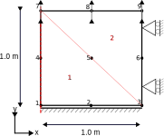

# Constant Rate of Strain (CRS) test
The CRS test is essential for simulating one-dimensional consolidation behavior under controlled strain conditions.

This test simulates a CRS test with 5 phases, precribing a constant rate of strain to alter loading and unloading phases. This is a regression test.

The test covers the **drained** model (CONSTANT_PW_FIELD) for:
| Property | Linear Elastic | Mohr-Coulomb |
| ------------- | ------------- | -------------: |
| Young's modulus [kN/m^2] | 1.0e+04 | 2.0e+04 |
| Poisson's ratio [-] | 0.25 | 0.25 |
| Cohesion [kN/m^2] | - | 2.0 |
| Friction angle [deg] | - | 25.0 |
| Tensile strength [kN/m^2] | - | 0.0 |
| Dilatancy angle [deg] | - | 2.0 |

## Setup
A schematic overview of the test setup is displayed in the figure below.
An axisymmetric element is used and the symmetry axis is showed here as a red dashed line.

The test is performed under the following conditions:

- **Constraints**:
    - The bottom nodes (1, 2, 3) are fixed in the X and Y directions.
    - The side nodes (3, 6, 9) are fixed in the X direction but free to move in teh Y direction.
    - The nodes on the symmetry axis (1, 4, 7) are fixed in the X direction but free to move in teh Y direction.
    - The top nodes (7, 8, 9) have prescribed displacements in the Y-direction for each phase.

The displacements per phase are:
| Phase | Y-Displacement |
| -------------: | -------------: |
| 1 | -10.0% |
| 2 | +5.0% |
| 3 | -20.0% |
| 4 | +0.0% |
| 5 | -15.0% |

## Assertions
For this test, the **Cauchy stress tensor**, the **Engineering strain tensor** and the **Pore water pressure** are verified at the end of each phase.