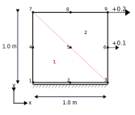
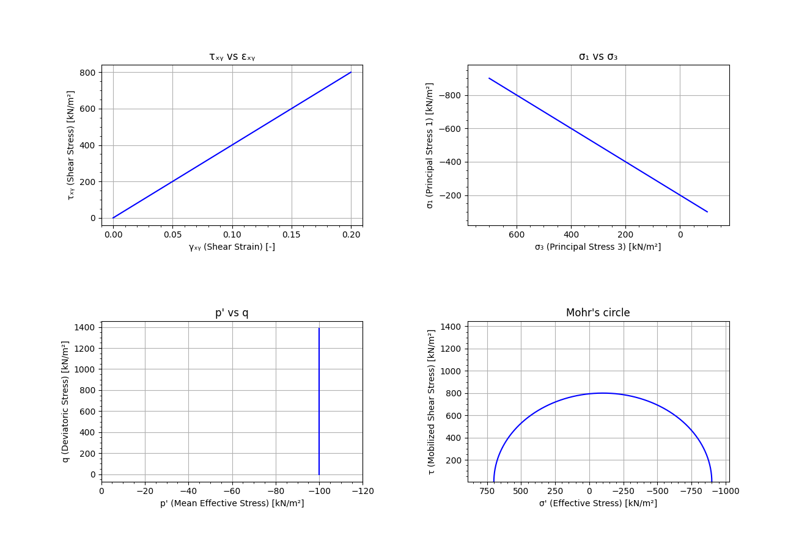
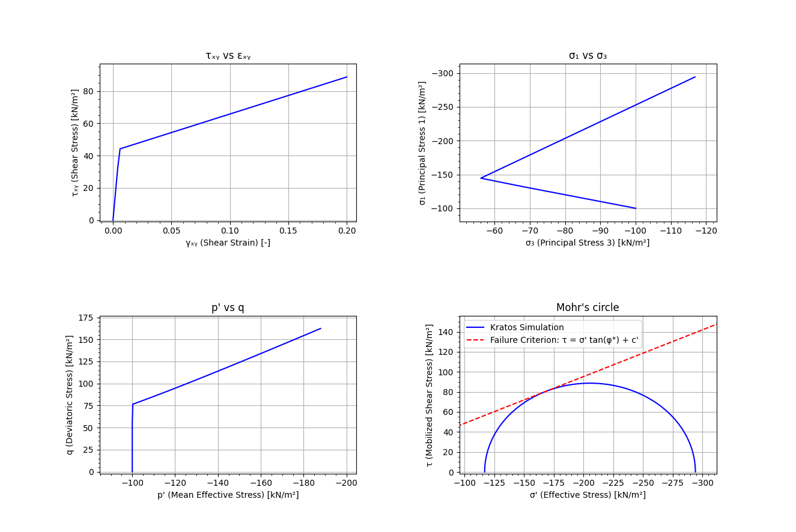

# Direct Simple Shear Test

This test simulates a direct simple shear test with a prescribed linear increasing displacement.

The test covers the **drained** model (CONSTANT_PW_FIELD) for:
| Property | Linear Elastic | Mohr-Coulomb |
| ------------- | ------------- | -------------: |
| Young's modulus [kN/m^2] | 1.0e+04 | 2.0e+04 |
| Poisson's ratio [-] | 0.25 | 0.25 |
| Cohesion [kN/m^2] | - | 2.0 |
| Friction angle [deg] | - | 25.0 |
| Tensile strength [kN/m^2] | - | 0.0 |
| Dilatancy angle [deg] | - | 2.0 |

## Setup
A schematic overview of the test setup is displayed in the figure below.

The test is performed under the following conditions:

- **Constraints**:
    - The bottom nodes (1, 2, 3) are fixed in the X and Y directions.
    - The middle nodes (4, 5, 6) are fixed in the Y direction and have a prescribed displacement from 0 to 0.1 in the X-direction.
    - The top nodes (7, 8, 9) are fixed in the Y direction and have a prescribed displacement from 0 to 0.2 in the X-direction.

## Assertions
For this test, the **Cauchy stress tensor** and the **Engineering strain tensor** are verified at t = 1.0.

## Visualisation of results
Here a visualisation of the expected results over time is given.
For linear elastic:

For Mohr-Coulomb:

The behaviour from the simulation that is depicted in the graphs is as expected.