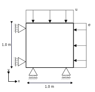

# Triaxial test (simple, single stage)

This test is a triaxial test with a prescribed displacement on a Mohr-Coulomb model. It mimics a lab test, where soil properties such as the cohesion ($c$) and the friction angle ($ϕ$) are determined.
In the lab this is performed on a cylindric volume of soil, where an increasing pressure is applied on the top of the cylinder. In the model test, the cylinder is emulated by two 2 axisymmetric elements that are symmetric around the left side.

A schematic overview of the model is displayed in the figure below:

## Setup

The test is performed with the following conditions:

- Constraints:
    - The displacement in the bottom nodes (5, 8, 9) is fixed in the Y direction.
    - The displacement in the symmetry axis (i.e. the left nodes 1, 3, 5) is fixed in the X direction.
    - The displacement of the top nodes (1, 2, 6) is prescribed and moves linearly from y = 0 at t = 0 to y = -0.2 at t = 1.
- Material:
    - The material is described by the Mohr-Coulomb model with the following parameters:
        - Poisson ratio = 0.25,
        - Young's modulus = 20000 $kN/m^2$,
        - Cohesion = 2.0 $kN/m^2$,
        - Friction angle = 25.0 $\degree$,
        - Dilatancy angle = 2.0 $\degree$.
- Conditions:
  - An initial uniform stress field (at t = 0) is applied with a value of -100 $kN/m^2$ in all directions.
  - A lateral load is applied with a value of 100 $kN/m^2$ to the right side, mimicing the constant cell pressure.

## Assertions
For this regression test, the outcomes of the simulation for the displacement, the normal stresses and the engineering strain at t = 1 are asserted.
