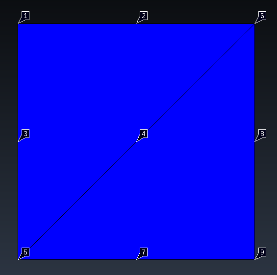

# Triaxial compression test with 6 noded elements

This test is a Drained compression triaxial test on Mohr-Coulomb model with axisymmetric 2D6N elements. The test is performed on a cube, consisting of 2 elements, as displayed in the figure below.

The test consists of two stages:
- Stage 1: Apply a confining stress of -100 kPa
  - Constraints:
    - The displacement in the bottom nodes (5, 7, 9) are fixed in the y direction
    - The displacement in the left nodes (1, 3, 5) are fixed in the x direction.
    - The bottom left node (5) is fixed in the x and y direction (seems redundant to me)
  - Loads:
    - A normal load is applied to the right side of the cube (nodes 6, 8, 9), ramping up from 0 to 100 in the time interval [0, 1]
    - A normal load is applied to the top side of the cube (nodes 1, 2, 6), ramping up from 0 to 100 in the time interval [0, 1]
  - Material:
    - The material is described using the Mohr-Coulomb model
  - Conditions:
    - An AxisymmetricLineNormalLoadDiffOrderCondition2D3N is added to both the top and right side of the cube (nodes 1, 2, 6 and 6, 8, 9 respectively).
  

    