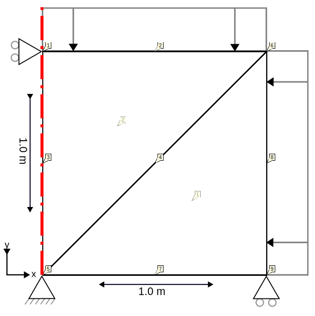

# Triaxial compression test with 6 noded elements

This test is a drained compression tri-axial test on a Mohr-Coulomb model with axi-symmetric 2D6N elements. It mimics a
lab test, where soil properties are defined.
In the lab this is performed on a cylindric volume of soil, with an increasing pressure applied from the top and/or
sides of the cylinder. In the model test, the cylinder is emulated by two 2 axisymmetric elements. The mesh is displayed
in the figure below:

## Setup

The test is performed in two stages, with the following common conditions for both stages:

- Constraints:
    - The displacement in the bottom nodes (5, 7, 9) are fixed in the Y direction
    - The displacement in the symmetry axis (i.e. the left nodes 1, 3, 5) are fixed in the X direction.
- Material:
    - The material is described using the Mohr-Coulomb model of the UMAT library found in MohrCoulomb64.dll 
* Conditions:
  * An AxisymmetricLineNormalLoadDiffOrderCondition2D3N is added to both the top and the right side of the cube (nodes
  1, 2,
  6 and 6, 8, 9 respectively).

## Stage 1 - Apply a confining stress of -100 kPa, time interval \[0, 1\]

- A normal load is applied to the right side of the cube (nodes 6, 8, 9), linearly ramping up from 0 to -100 kPa in the
  time interval \[0, 1\].

- A normal load is applied to the top of the cube (nodes 1, 2, 6), linearly ramping up from 0 to -100 kPa in the
  time interval \[0, 1\].

## Stage 2 - Apply a deviatoric stress of -200 kPa, time interval \[1, 1.25\]

- A constant normal load of -100 kPa is applied to the right side of the cube (nodes 6, 8, 9), during the interval
  \[1.0, 1.25\].

- The displacement of the top nodes (1, 2, 6) is specified in the Y direction during the interval \[1.0, 2.0\] to
  linearly change from 0.0 to -1.0 meaning at the end-time of 1.25, it will have reached -0.25. This results in a -200
  kPa deviatoric stress.

_Note: Since the displacement at the top is fixed, the stress resulting from the earlier applied top normal load is
confined. Therefore, it is not needed to specify this again during stage 2._

## Assertions

The calculated effective stresses after the Kratos Geomechanics calculations are compared to the expected solutions:

- After stage 1: The effective stresses in XX and YY are expected to be -100 kPa in the element integration
  points, due to the applied confining stress in the XY plane. Due to the axisymmetry of the problem, the same stress is
  expected in the third dimension (ZZ).

- After stage 2: The effective stresses in XX and ZZ are still expected to be -100 kPa, while in the YY direction, the
  expectation is -300 kPa due to the forced Y-displacement (also here, the comparisons are done in the integration
  points).
