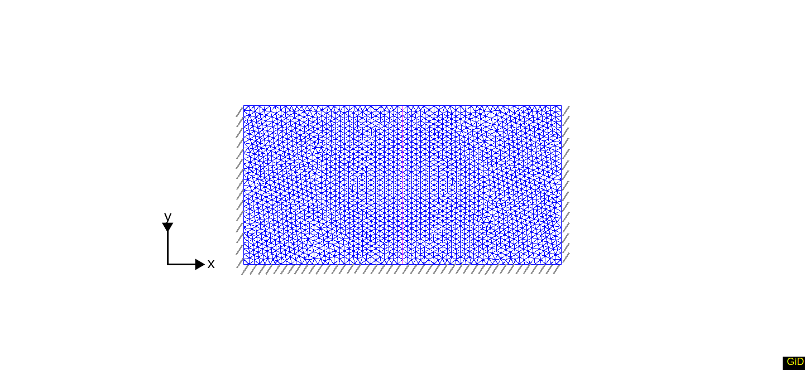
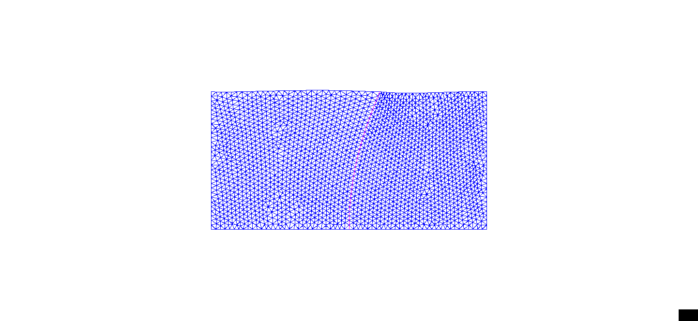
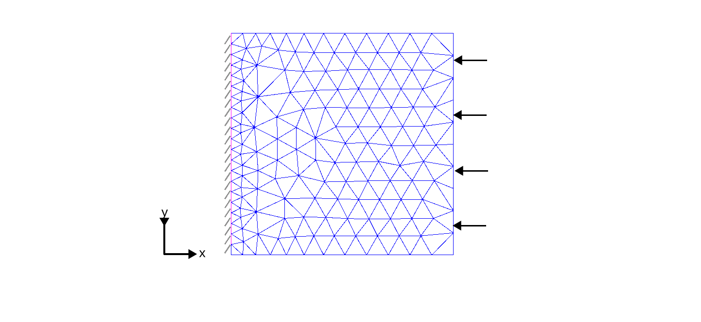
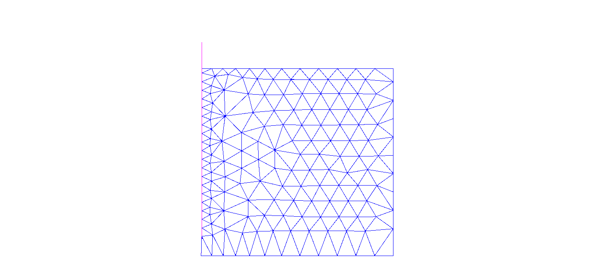

# Interface

This set of tests verifies the interface functionality.

## Using interface between beam and soil

### Setup

This test models the beam movement in the soil. The beam is fixed on the bottom and loaded on the top. The model consists of 4230 3-noded elements for the soil (using the UPwSmallStrainElement2D3N class), 31 2-noded elements for the beam (GeoCrBeamElementLinear2D2N), and 62 4-noded elements for interfaces (UPwSmallStrainInterfaceElement2D4N) that connect the beam with the soil. A schematic representation can be found in the figure below:

All nodes on the sides are fixed in the horizontal direction. The bottom nodes are fixed in both the horizontal and the vertical
directions. In the middle of the domain a vertical beam is placed. It is shown in red color. The beam bottom has a fixed support and a horizontal constant load with a magnitude of $q=10.0 \quad \mathrm{[N/m]}$ is applied to the beam top. 

The soil is described with GeoLinearElasticPlaneStrain2DLaw:
-   A Young's modulus $E = 3.0e7 \quad \mathrm{[Pa]}$ with Poisson's ratio $\nu = 0.20 \quad \mathrm{[-]}$.
-   The soil and water density are $2000$ and $1000 \quad \mathrm{[kg/m^3]}$ respectively. The porosity is $n=0.3$. 
-   The bulk modulus of solid $K = 1.0e12 \quad \mathrm{[Pa]}$.
-   The dynamic viscosity of water $\mu = 10^{-3} \quad \mathrm{[Pa \cdot s]}$ and the intrinsic permeability of the soil $\kappa = 4.5\cdot 10^{-30} \quad \mathrm{[m^2]}$.

The beam is described with BeamConstitutiveLaw:
-   A Young's modulus $E = 2.07e13 \quad \mathrm{[Pa]}$ with Poisson's ratio $\nu = 0.29 \quad \mathrm{[-]}$.
-   Density of $7850.0 \quad \mathrm{[kg/m^3]}$.
-   Cross area of $0.01 \quad \mathrm{[m^2]}$,
-   Moment of inertia about Z axis $I33 = 8.33333\cdot 10^{-8} \quad \mathrm{[kg m^2]}$

The interface is described with SmallStrainUDSM2DInterfaceLaw and it has a cohesion of $1000 \quad \mathrm{[kN]}$ and a stiffness of $1e12 \quad \mathrm{[Pa]}$. The stiffness value is provided as the first UMAT parameter. 

### Solution

Under the load the beam bends and acts on the soil. The following picture shows the bended beam and soil displacement.

### Assertions

The test asserts maximum values of displacement in X and Y directions. The values are compared with the correspondent solution obtained for a base case. The base case has the same settings, but it does not use the interface. 

## Weak Interface

### Setup

This test uses the same setting as the previous test except the interface stiffness of $1e2 \quad \mathrm{[Pa]}$. 

### Solution

This very small value of the stiffness leads to a large movement of the beam against the soil. The following picture shows that the beam is bended as in the previous test but the beam affects the soil displacement very little. The brown lines depict the interfaces' horizontal lines.

### Assertions

The test checks that the beam displacement shall be much larger than the soil displacement. 

## Interface cohesive side

This test models a vertical movement of the soil block which left hand side is connected to the interface. 

### Setup

The model consists of 275 3-noded elements for the soil (using the UPwSmallStrainElement2D3N class) and 21 4-noded elements for interface (UPwSmallStrainInterfaceElement2D4N). A schematic representation can be found in the figure below, the interface is shown with a pink color. 

The soil is dry, and it is described with GeoLinearElasticPlaneStrain2DLaw:
-   A Young's modulus $E = 1.0E9 \quad \mathrm{[Pa]}$ with Poisson's ratio $\nu = 0.49 \quad \mathrm{[-]}$.
-   The soil density is $2000 \quad \mathrm{[kg/m^3]}$ and the porosity is $n=0.3$. 
-   The bulk modulus of solid $K = 1.0e12 \quad \mathrm{[Pa]}$.

The interface is described with SmallStrainUDSM2DInterfaceLaw and it has a cohesion of $1000 \quad \mathrm{[kN]}$ and a stiffness of $1e12 \quad \mathrm{[Pa]}$. 

The left side of the interface is fixed. The soil moves down with a prescribed vertical displacement of $-0.1 \quad \mathrm{[m]}$  and a horizontal line load of $-1 \quad \mathrm{[kN]}$  is applied to the soil right side. 

### Solution

A result of the prescribed displacement is shown below. The soil moved down, when the interface is squeezed because its left side is fixed.  

### Assertions

The test checks the expected shear stress in the interface of $10 \quad \mathrm{[kN]}$. 
