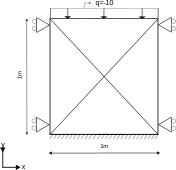

# Load on block 2D no damping

This test verifies that in a block of plane strain elements, the motion induced by instant application of a line load does not damp out.

## Setup

This test consists of a 4 3-noded elements (using the UPwSmallStrainElement2D3N class) of $1 \mathrm{x} 1 \mathrm{[m]}$. A
schematic representation can be found in the figure below:

All nodes on the sides have fixed horizontal displacements. The bottom node displacements are fixed in the horizontal and vertical direction. At the top of the column a vertical compressive lineload with a magnitude of $10 \mathrm{[N/m]}$ is instantly applied at $t = 0 \mathrm{[s]}$.

The material is described using:
-   A linear elastic plane strain model (LinearElasticPlaneStrain2DLaw)
-   A Young's modulus of $100.0 \mathrm{[MPa]}$ with a 0.2 Poisson's ratio.
-   The non porous soil density is $2650 \mathrm{[kg/m^3]}$ and the porosity is 0.3
These material properties of the dry soil give a compression modulus $K = E / (3(1-2\nu)) = 41.667 \mathrm{[MPa]}$ and a shear modulus $G = E / (2( 1 + \nu )) = 19.23 \mathrm{[MPa]}$ so a compressive wave speed of $c = \sqrt{( K + 4/3 G ) / \rho} = 188.71 \mathrm{[m/s]}$.

Due to the absence of damping, no energy can leave the system and the block wil show a periodic motion of which the amplitude does not decrease. For reasons of test time only a few steps are performed.

## Assertions

The test asserts that the vertical displacements of the loaded nodes match a prerecorded value for the performed time steps.
