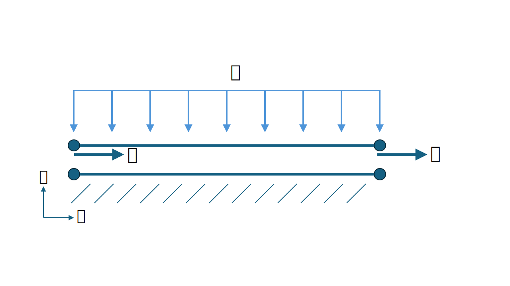

# Test Cases for Mohr-Coulomb with tension cutoff

**Author:** [Mohamed Nabi](https://github.com/mnabideltares)

**Source files:** [Thermal fixed temperature](https://github.com/KratosMultiphysics/Kratos/tree/master/applications/GeoMechanicsApplication/tests/test_mohr_coulomb_with_tension_cutoff)

## Case Specification
### Continuum element
In these test cases, a 1 x 1 m soil is considered. The pressure is fixed to be at 0 Pa and only the deformation is taken into account. The size of this block is changed by means of Dirichlet condition, and the stresses are then calculated. The purpose of these tests is to validate the response of different zones in the Mohr-Coulomb diagram (including the tension cutoff). 

The diagram includes one admissible and four inadmissible zones. Hence, five test cases are considered. Based on the imposed boundary conditions the trial stresses fall in one of those zones. These tests consider one quadrilateral element of 4 nodes, namely 2D4N.

The boundary conditions are shown below:

||$\Delta x \mathrm{[m]}$|$\Delta y\mathrm{[m]}$|
|--------------------------|-----|------|
|Elastic zone              |-0.01|-0.01 |
|Tensile apex return zone  |0.017|0.013 |
|Tensile cutoff return zone|0.012|0.008 |
|Corner return zone        |0.022|-0.002|
|Regular failure zone      |0.008|-0.028|

All degrees of freedom have been prescribed. In horizontal and vertical directions, the element is compressed or extended by imposing displacements. The elastic behavior of the elements is described by a Young's modulus of $`1000 \mathrm{Pa}`$ and a Poisson's ratio of $`0.0`$. The material behavior is described using a cohesion of $`10.0 \mathrm{Pa}`$, a friction angle of $`35^{\circ}`$, a dilatancy angle of $`20^{\circ}`$ and a tensile strength of $`10 \mathrm{Pa}`$.

These tests are also extended to three dimensional elements. The 3D cases are applied on hexahydrons of 8 nodes, namely 3D8N.

### Interface element
In this test case, the Mohr-Coulomb model with tension cutoff is applied to the interface element. A single two-noded element is considered to allow comparison with the analytical solution. A normal load and a tangential deformation are applied to this element. The configuration of this test case is shown in the figure below.

An increasing normal load of 600 Pa is applied over 2 seconds. This is followed by an increasing compressive deformation of 0.1 m in the $\tau$ direction, applied over the next 2 seconds.

Initially, the stresses lie within the admissible zone. As the deformation increases, the trial stresses move into the inadmissible zone. These stresses are then correctly projected back onto the yield envelope.