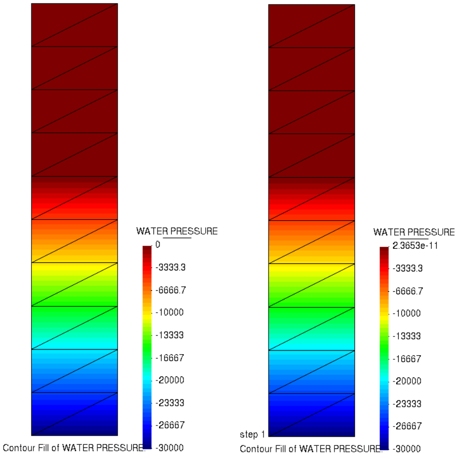

# Test Cases for partially saturated flow
## Saturated below phreatic level

**Author:** [Mohamed Nabi](https://github.com/mnabideltares)

**Source files:** [Partially saturated flow](https://github.com/KratosMultiphysics/Kratos/tree/master/applications/GeoMechanicsApplication/tests/test_partially_saturated)

## Case Specification
In this test case, a column of 1 x 5 m soil is considered (set between -5 m and 0 m). A phreatic line is set at the level of $y = -2$ m. The water pore pressure field is then calculated.
The simulation is done on a double stage process and a steady state Pw element is considered. This test is conducted for various configurations, including 2D3N and 2D6N triangular elements. The pressure distribution along the column is then evaluated with its alalytical result.

## Results

The picture below illustrates the pressure contours resulting from the simulation (as an example the 2D6N test is shown below).

