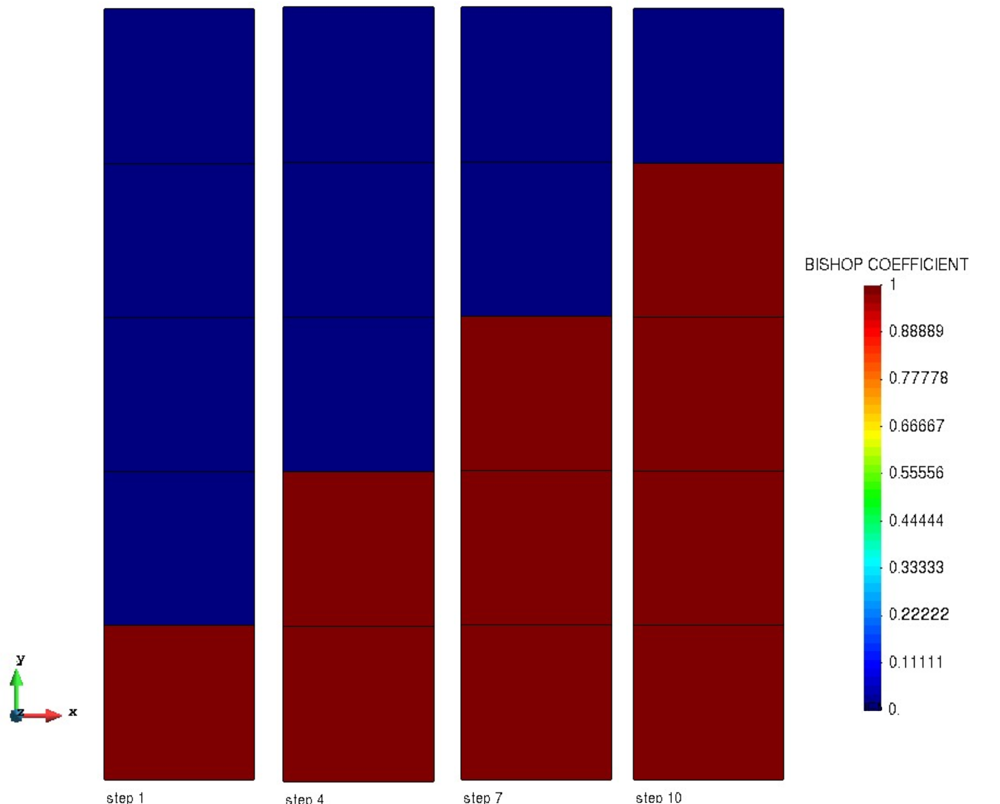

# Test Cases for partially saturated flow
## Saturated below phreatic level

**Author:** [Mohamed Nabi](https://github.com/mnabideltares)

**Source files:** [Partially saturated flow](https://github.com/KratosMultiphysics/Kratos/tree/master/applications/GeoMechanicsApplication/tests/test_partially_saturated)

## Case Specification
In this test case, a column of 1 x 5 m soil is considered (set between $`y = -5 \mathrm{m}`$ and $`y = 0 \mathrm{m}`$). A phreatic line is set at the level of $y = -2$ m. The water pore pressure field is then calculated.
The simulation is done on a double stage process, and steady state Pw and U-Pw elements are considered. This test is conducted for various configurations, including

- 2D3N: for Pw and U-Pw small strain elements
- 2D6N: for Pw and U-Pw small strain and U-Pw different order elements.

The pressure distribution along the column is then compared with its analytical result.

## Results

The picture below illustrates the pressure contours resulting from the simulation (as an example the 2D6N for Pw is shown below).

## Rising waterlevel

**Author:** [Wijtze Pieter Kikstra](https://github.com/WPK4FEM)

## Case Specification
In this test case, the same column of 1 x 5 m soil is considered. A phreatic level is set at $`y = -4`$ m. The water pore pressure field is then calculated.
During The simulation the top and bottom boundary conditions change, such that from time 1 to time 10 the waterlevel rises from $`y = -4 \mathrm{m}`$ to $`y = -1 \mathrm{m}`$i This test is conducted for 2D4N Pw  elements.
Note the tension cut off in the boundary conditions, with a value of $`h_{element} * \rho_{water} * g`$ ( $`h_{element}`$ is a characteristic element length. This shifts the discontinuity of the spatial derivative in the pressure field to the element above the phreatic line (where no water is flowing), which is benificial for convergence.
The pressure distribution for the nodes of the bottom element and Bishop coefficients for all elements along the column are compared with its analytical result at $`t = 1`$, $`t = 4`$, $`t = 7`$ and $`t = 10`$.

## Results

The picture below illustrates the Bishop coefficient at the selected time steps, illustrating the rise of the water level.

