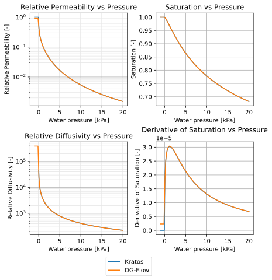
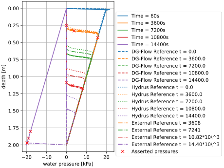
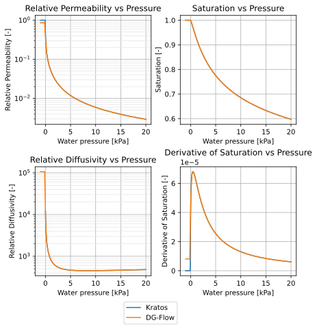
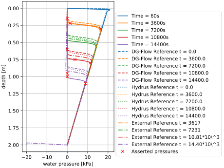
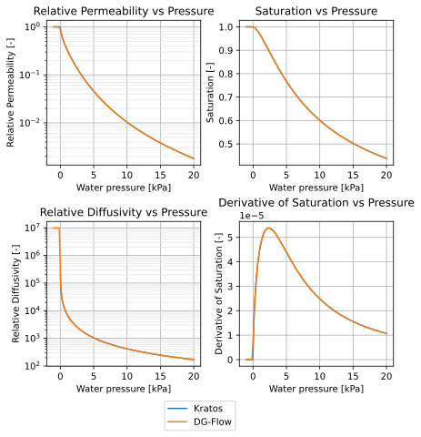
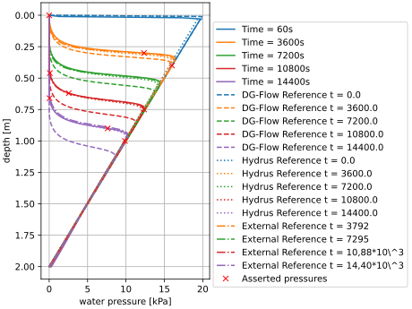
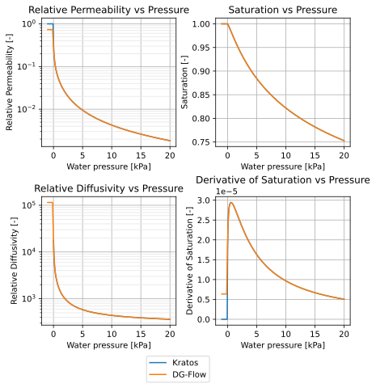
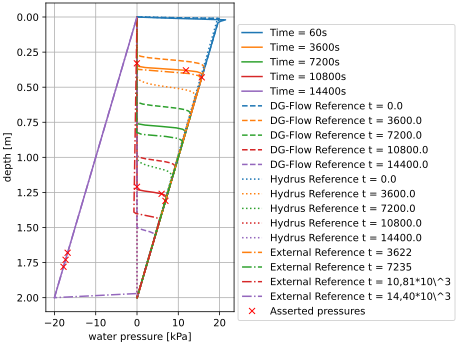

## Infiltration tests

The geometry and boundary conditions of the infiltration test are shown below. The initial condition is a hydrostatic pressure profile with the reference coordinate at the bottom of the column. This means that at the start, the column contains positive pressures. The boundary condition of $p_w=0$, induces infiltration, which propagates downwards through the column. 

Characteristics:
- Zero pressure boundary condition at the top of the model.
- Zero flux boundary condition at the bottom of the model.
- Hydrostatic pressure profile as initial condition with the reference coordinate at y = -2 (at the bottom of the column)
- The elements used are `TransientPwElement2D3N`

### Results
For this problem, linear Pw (water pressure) elements (TransientPwElement2D3N) are used (meaning the displacements are not regarded). The pressure profiles at different time steps can be found in the following image. The red markers depict the asserted pressures, chosen at characteristic positions in the curves.

### Infiltration tests with 'Staringreeks' materials

Very similar to the set-up described above, the following tests are performed with different materials. The results are shown below.
For each test, the Van Genuchten characteristics are shown in the first image with comparisons to DG-Flow. For the second image, the infiltration from the top boundary is shown with comparisons to DG-Flow, HYDRUS and an external reference solution. The asserted pressures (red markers) are chosen at characteristic positions in the curves.

**Note: one more difference is that the column width of these tests is 0.1m instead of 0.02m**

#### B6

#### B10

#### O4

#### O6

