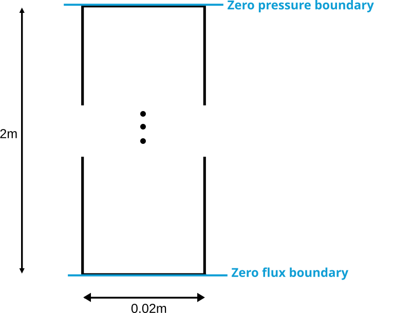
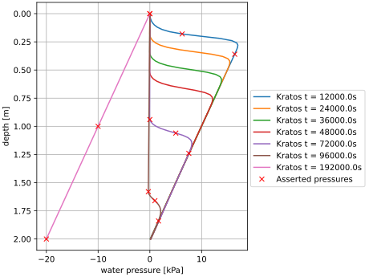

## Infiltration test

The geometry and boundary conditions of the infiltration test are shown below. The initial condition is a hydrostatic pressure profile with the reference coordinate at the bottom of the column. This means that at the start, the column contains positive pressures. The boundary condition of $p_w=0$, induces infiltration, which propagates downwards through the column. 

Characteristics:
- Zero pressure boundary condition at the top of the model.
- Zero flux boundary condition at the bottom of the model.
- Hydrostatic pressure profile as initial condition with the reference coordinate at y = -2 (at the bottom of the column)
- The elements used are `TransientPwElement2D3N`

### Results
For this problem, linear Pw (water pressure) elements (TransientPwElement2D3N) are used (meaning the displacements are not regarded). The pressure profiles at different time steps can be found in the following image. The red markers depict the asserted pressures, chosen at characteristic positions in the curves.

