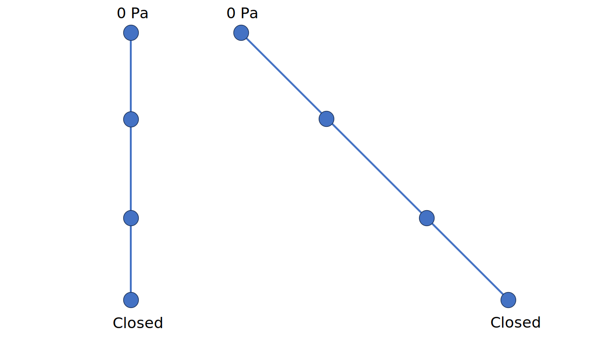

# Test Cases for Water Pore Pressure Line Element

**Author:** [Mohamed Nabi](https://github.com/mnabideltares)

**Source files:** [Water pore pressure line element](https://github.com/KratosMultiphysics/Kratos/tree/master/applications/GeoMechanicsApplication/tests/test_pressure_line_element)

## Case Specification
In this water-pressure test case, a 3 [m] deep soil is considered, with everywhere set to 10 $\mathrm{[Pa]}$ as initial condition. Then the top boundary is set to 0 $\mathrm{[Pa]}$ and the bottom boundary is left free (it automatically becomes Neumann boundary with zero flux). The simulation spans 50 hours to allow for a transition from an exponential to a linear pressure profile along the depth. This test is conducted for various configurations, including 2D2N, 2D3N, 2D4N, 2D5N, 3D2N and 3D3N line elements. The pressure distribution along the depth is then evaluated with its own result.

As the water pressure is influenced by gravity force in the vertical direction (here Y-direction), the gravity then needs to be projected in the direction of the element. Therefor here we tested two configurations, namely a case with vertically-oriented elements, and a case with elements with a slope of 45 degrees. The gravity is considered to be 10 $\mathrm{[m/s^2]}$ 

The boundary conditions are shown below:

## Results

The picture below illustrates the pressure profile resulting from the simulation (as an example the 2D3N test is shown below).

These results are associated with the final time step after the solution reaches a steady state. The results for both test configurations are identical. The analytical solution is:

$P = 10000 y$

In this test case, the result at node number 3 at location $y = -2 \mathrm{[m]}$ is compared with the analytical solution. The value of the pressure at node 3 is -20,000 $\mathrm{[Pa]}$

# Test Cases for Water Pore Pressure Line Element with Filter as Retention Law
Two test cases are repeated with modification for retention law in the material parameters. They are test cases on elements of 2D3N and 3D3N (with slope of 45 degrees). Here, the retention law is replaced by "PressureFilterLaw". The results are then compared with analytical results. The analytical solution is:

$P = 10000 y$

The results for both test configurations are identical and they are also identical to the results of the pressure line element.

The picture below illustrates the pressure profile resulting from the simulation (as an example the 2D3N test is shown below).

