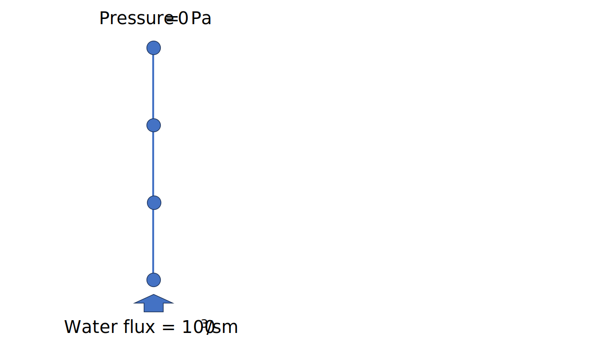
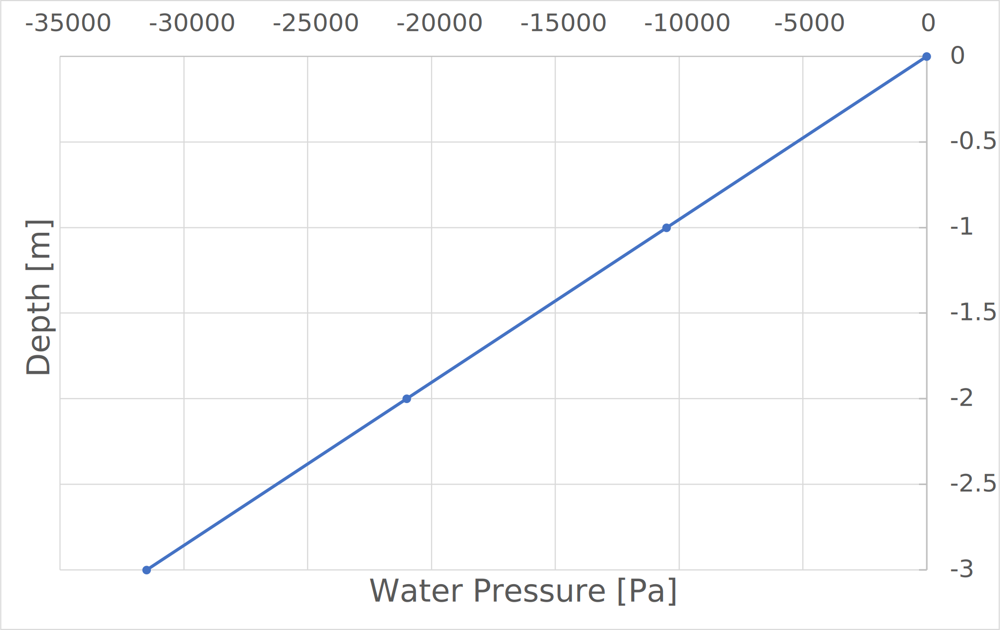

# Test Cases for Water Pore Pressure Point Flux

**Author:** [Mohamed Nabi](https://github.com/mnabideltares)

**Source files:** [Water pore pressure point flux](https://github.com/KratosMultiphysics/Kratos/tree/master/applications/GeoMechanicsApplication/tests/test_pressure_point_flux)

## Case Specification
In this water-pressure test case, a 3 [m] deep soil is considered, with everywhere set to 10 $\mathrm{[Pa]}$ as initial condition. Then the top boundary is set to 0 $\mathrm{[Pa]}$ and a water flux of 100 $\mathrm{[m^3/s]}$ is imposed at the bottom boundary. The simulation spans 50 hours to allow for a transition from the intial condition to a linear pressure profile along the depth. This test is conducted for two configurations, including 2D2N and 3D2N line elements. The pressure distribution along the depth is then evaluated with its steady state analytical results.

The boundary conditions are shown below:

## Results

The picture below illustrates the pressure profile resulting from the simulation (as an example the 2D2N test is shown below).

These results are associated with the final time step after the solution reaches a steady state. The results for both test configurations are identical. The analytical solution is:

$P = 10500 y$

In this test case, the result at node number 3 at location $y = -2 \mathrm{[m]}$ is compared with the analytical solution. The value of the pressure at node 3 is -21000 $\mathrm{[Pa]}$