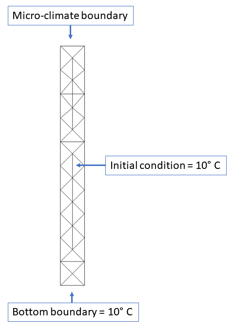
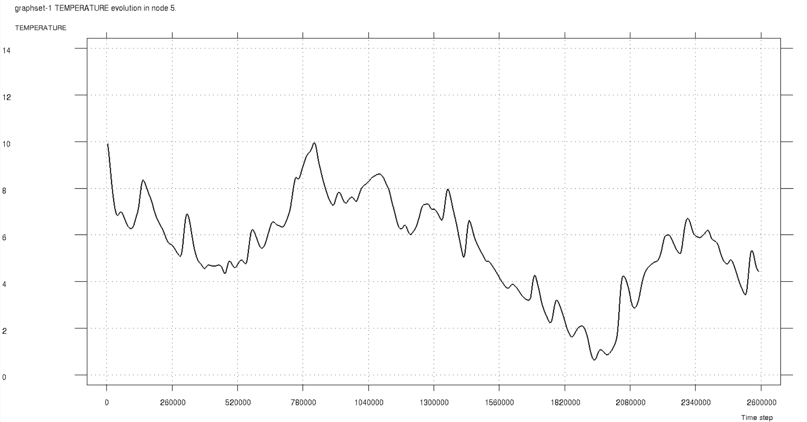
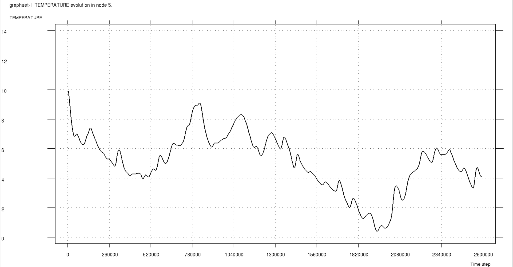
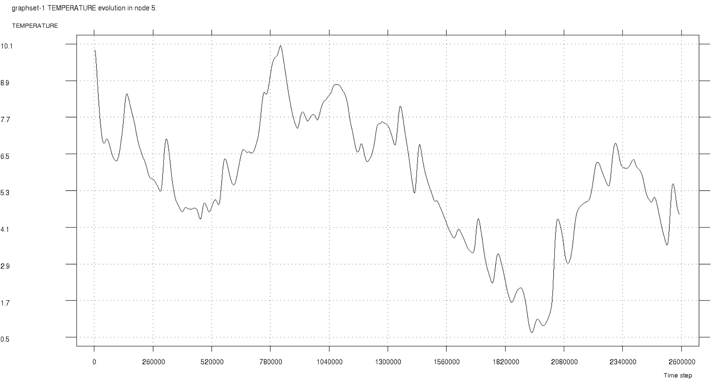
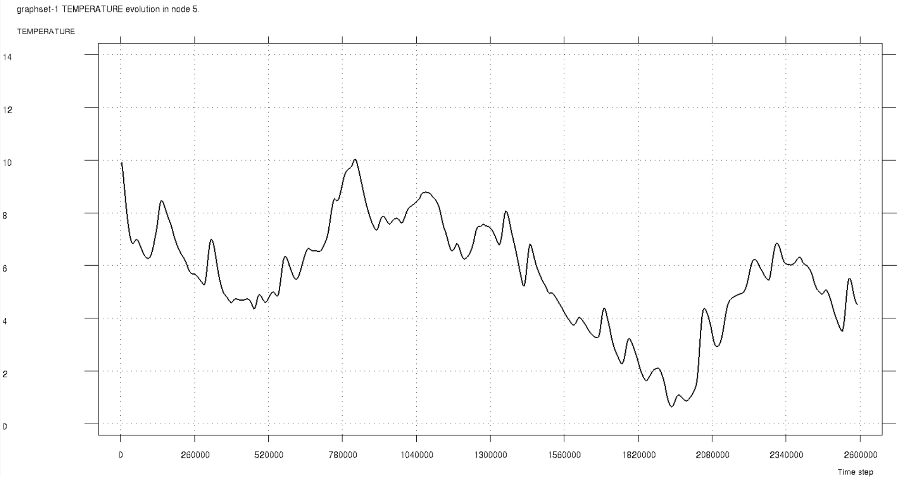
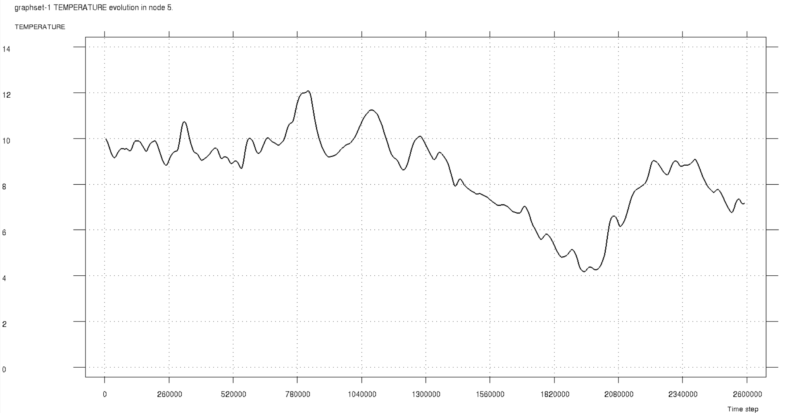
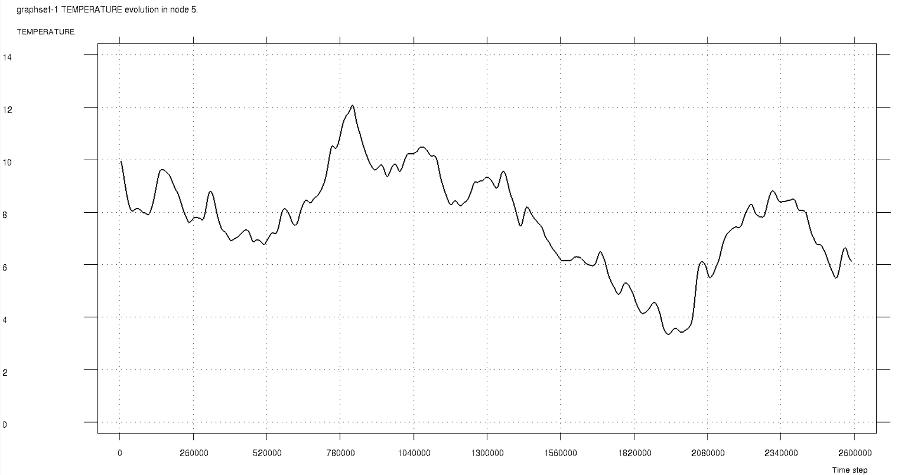

# Test Cases for Micro-Climate Boundary Condition

**Author:** [Mohamed Nabi](https://github.com/mnabideltares)

**Source files:** [Micro Climate Boundary Condition](https://github.com/KratosMultiphysics/Kratos/tree/master/applications/GeoMechanicsApplication/tests/test_thermal_element/test_micro_climate)
#
# Case Specification
We employed eight test cases to encompass a range of potential scenarios and thoroughly evaluate all functionalities related to the micro-climate within the code. These test cases, each varying in the constant required from the user, are detailed in the table below.

| Simulation| Describtion            | a1  | a2  | a3   | Q   | Smax   |
|-----------|:-----------------------|:---:|:---:|:----:|:---:|:------:|
| 1         | Limited evaporation    | 0   | 0   | 0    | 0   | 0.0004 |
| 2         | Potential evaporation  | 0   | 0   | 0    | 0   | 40000  |
| 3         | No evaporation         | 0   | 0   | 0    | 0   | 0      |
| 4         | Limited cover heat     | 0.8 | 0   | -100 | 0   | 0      |
| 5         | Full cover heat source | 0   | 30  | 0    | 0   | 0      |
| 6         | Building heat source   | 0   | 0   | 0    | 100 | 0      |
| 7         | Potential evaporation  | 0.8 | 30  | -100 | 100 | 40000  |
| 8         | Final setup            | 0.8 | 30  | -100 | 100 | 0.0004 |

The domain, grid and boundary conditions are shown as below. The test cases are done on a domain $0.1 \times 1$ $m^2$. The elements are triangles with 3 nodes.

## Results
The history of the temperature is captured at node 5 for all test cases, which is located at $\left(0.05, -0.2 \right)$. It means this point is at the distance of 0.2 m from the surface.

* Case 1

* Case 2

* Case 3

* Case 4

* Case 5

* Case 6

* Case 7

* Case 8
