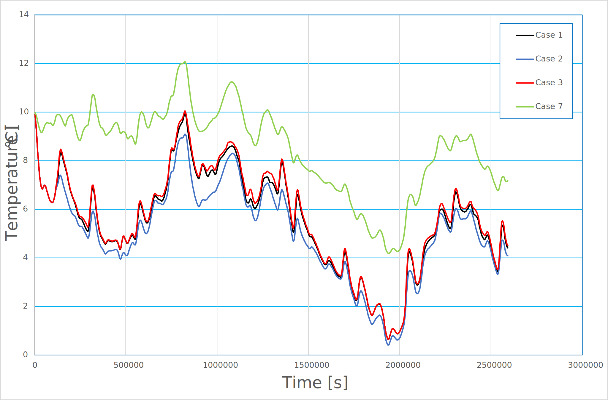
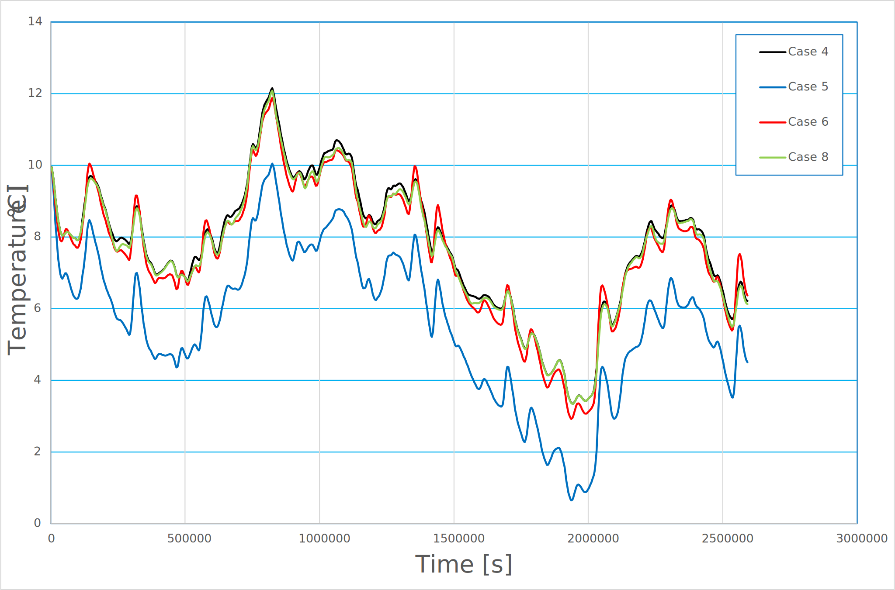

# Test Cases for Micro-Climate Boundary Condition

**Author:** [Mohamed Nabi](https://github.com/mnabideltares)

**Source files:** [Micro Climate Tests](https://github.com/KratosMultiphysics/Kratos/tree/master/applications/GeoMechanicsApplication/tests/test_thermal_element/test_micro_climate)

**Theoretical documentation source** [Micro Climate Condition](https://github.com/KratosMultiphysics/Kratos/tree/master/applications/GeoMechanicsApplication/custom_conditions/README.md)
#
# Case Specification
We employed eight test cases to encompass a range of potential scenarios and thoroughly evaluate all functionalities related to the micro-climate within the code. These test cases, each varying in the constant required from the user, are detailed in the table below.

| Case | Description                | $a_1$  | $a_2$  | $a_3$ | $Q_f$ | $S_{max}$ |
|------|:---------------------------|:------:|:------:|:-----:|:-----:|:---------:|
| 1    | Limited evaporation        | 0      | 0      | 0     | 0     | 0.0004    |
| 2    | Potential evaporation $^*$ | 0      | 0      | 0     | 0     | 40000     |
| 3    | No evaporation             | 0      | 0      | 0     | 0     | 0         |
| 4    | Limited cover heat         | 0.8    | 0      | -100  | 0     | 0         |
| 5    | Full cover heat source     | 0      | 30     | 0     | 0     | 0         |
| 6    | Building heat source       | 0      | 0      | 0     | 100   | 0         |
| 7    | Potential evaporation      | 0.8    | 30     | -100  | 100   | 40000     |
| 8    | Final setup                | 0.8    | 30     | -100  | 100   | 0.0004    |

The domain, grid and boundary conditions are shown as below. The test cases are done on a domain $0.1 \mathrm{[m]} \times 1 \mathrm{[m]}$. The elements are triangles with 3 nodes (GeoTransientThermal2D3N).

## Results
The history of the temperature is captured at node 5 for all test cases, which is located at $\left(0.05, -0.2 \right)$. It means this point is at the distance of 0.2 m from the surface. The air temperature, air humidity, solar radiation, precipitation and wind speed are taken from KNMI data and added as tables to the MPDA file.

As the input data for air is same for all test cases, the air seasonal conditions are dominant at our simulations. Hence, relatively small differences can be seen between the history curves of these cases.

* Evaporation cases 

* Heat source cases

NB: Cases 7 and 8 are cases at which both evaporation and heat source are activated. Case 8 referes to the most realistic problems which we want to simulate for this setup.

$^*$ Potential evaporation is the amount of water that would be evaporated and transpired by soil if there was sufficient water available.

