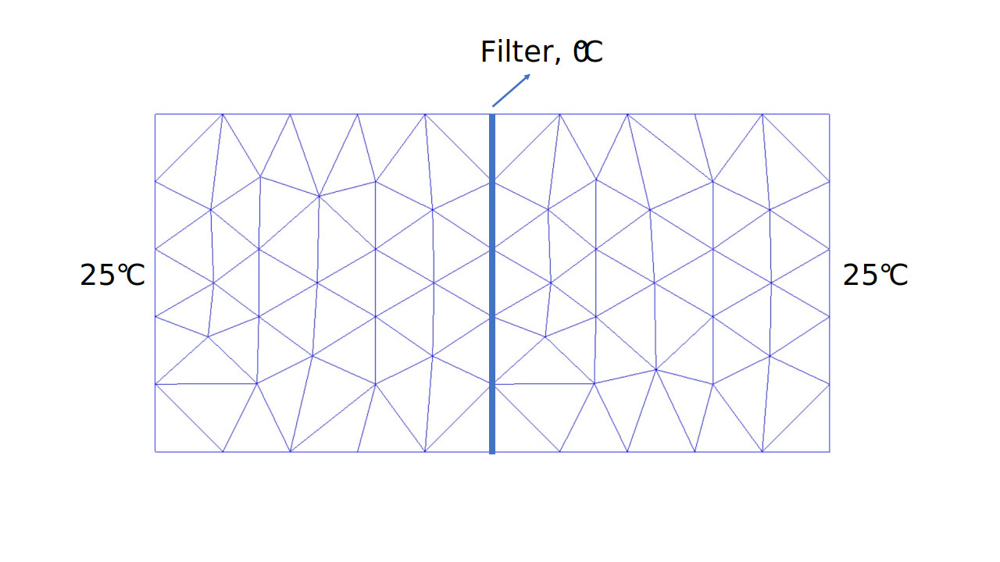
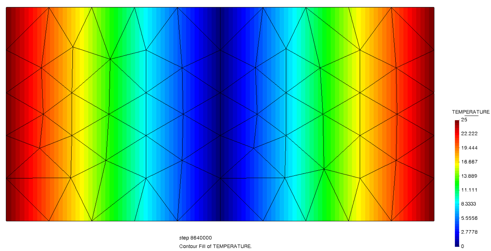

# Test Cases for Thermal Filter Element

**Author:** [Mohamed Nabi](https://github.com/mnabideltares)

**Source files:** [Thermal filter element with fixed temperature](https://github.com/KratosMultiphysics/Kratos/tree/master/applications/GeoMechanicsApplication/tests/test_thermal_element/test_thermal_filter_element)

## Case Specification
In this thermal test case, a $2 \mathrm{[m]} \times 1 \mathrm{[m]}$ soil block is considered, with everywhere set to 0 $\mathrm{[^\circ C]}$. A well/filter passes vertically through middle of the domain. The temperature along the filter is kept constant at 0 $\mathrm{[^\circ C]}$. A sudden jump at the right and left boundary temperatures are given for the soil. These are both 25 $\mathrm{[^\circ C]}$. The simulation spans 100 days to allow for a transition from the initial to a linear temperature profile between the two sides. This test is conducted for various configurations, including 2D3N and 2D3N soil elements, and corresponding 2D2N and 2D3N filter elements. The temperature distribution is then evaluated with its own result.
The boundary conditions are shown below:

## Results

The picture below illustrates the temperature contours resulting from the simulation (as an example the soil-element 2D6N test is shown below).

These results are associated with the final time step after the solution reaches a steady state. The analytical solution is:

$T = 25 \left| x \right|$

In this test case, the result at node number 80 at location $x = 0.3071796770$ is compared with the analytical solution. The value of the temperature at node 80 is 7.679491925 $\mathrm{[^\circ C]}$