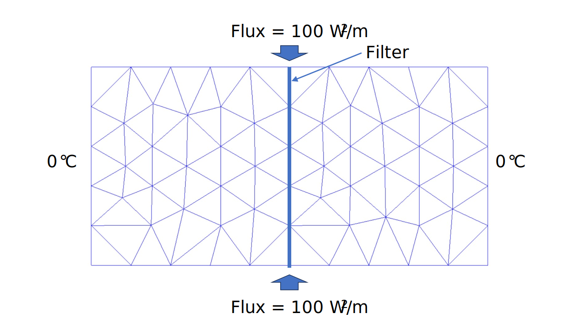
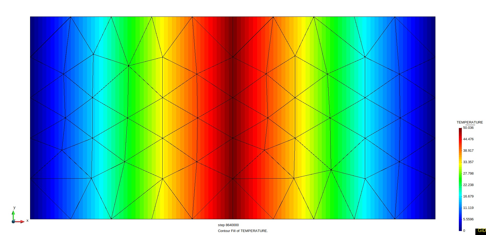

# Test Cases for Thermal Filter Element

**Author:** [Mohamed Nabi](https://github.com/mnabideltares)

**Source files:** [Thermal filter element with fixed temperature](https://github.com/KratosMultiphysics/Kratos/tree/master/applications/GeoMechanicsApplication/tests/test_thermal_element/test_thermal_filter_element)

## Case Specification
In this thermal test case, a $2 \mathrm{[m]} \times 1 \mathrm{[m]}$ soil block is considered, with everywhere set to 0 $\mathrm{[^\circ C]}$. A well/filter passes vertically through middle of the domain. Heat fluxes are set at the top and bottom of the filter, with values of 100 $\mathrm{[W/m^2]}$. Dirichlet boundary conditions of temperature are set at the left and right of the soil domain, both with a value of 0 $\mathrm{[^\circ C]}$. The simulation spans 100 $\mathrm{[days]}$ to allow for a transition from the initial to a linear temperature profile. This test is conducted for various configurations, including 2D3N and 2D6N soil elements (with corresponding 2D2N and 2D3N filter elements). The temperature distribution is then evaluated with its own results. The boundary conditions are shown below:

## Results
The picture below illustrates the temperature contours resulting from the simulation (as an example the soil-element 2D6N test is shown below).

These results are associated with the final time step after the solution reaches a steady state. In this test case, the result at node number 80 is examined. The value of the temperature at node 80 is 34.657035390578656 $\mathrm{[^\circ C]}$.