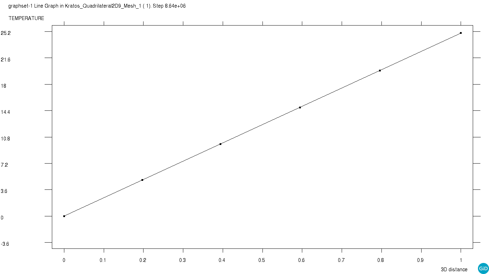

# Test Cases for Thermal fixed temperature

**Author:** [Mohamed Nabi](https://github.com/mnabideltares)

**Source files:** [Thermal fixed temperature](https://github.com/KratosMultiphysics/Kratos/tree/master/applications/GeoMechanicsApplication/tests/test_thermal_element/test_thermal_fixed_temperature)

## Case Specification
In this thermal test case, a 1 x 1 m soil is considered, with everywhere set to 0 degrees and then a sudden jump to 25 degrees at the right boundary. The simulation spans 100 days to allow for a transition from an exponential to a linear temperature profile between the two sides. This test is conducted for various configurations, including 2D3N, 2D4N, 2D6N, 2D8N, 2D9N, 2D10N, 2D15N, 3D4N, and 3D10N. The temperature distribution within the box is then evaluated with its own result.
The boundary conditions are shown below:

## Results

The picture below illustrates the temperature contours resulting from the simulation (as an example the 2D9N test is shown below).

