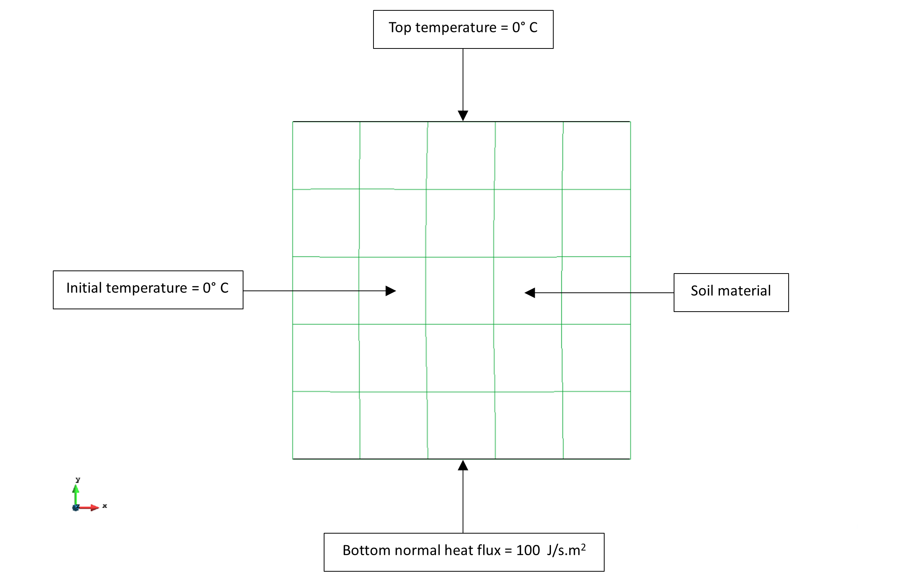
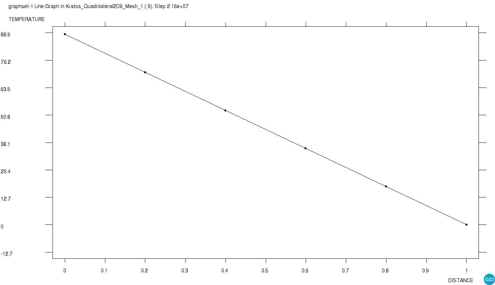

# Test Cases for Thermal heat flux

**Author:** [Mohamed Nabi](https://github.com/mnabideltares)

**Source files:** [Thermal heat flux](https://github.com/KratosMultiphysics/Kratos/tree/master/applications/GeoMechanicsApplication/tests/test_thermal_element/test_thermal_heat_flux)

## Case Specification
In this thermal heat flux test case, a 1 x 1 m soil box is considered, with a 100 J.s-1.m-2 heat flux applied as a condition to the bottom side and the top temperature set to 0 degrees. The simulation spans 250 days to allow for a transition from an exponential to a linear temperature profile between the two sides. This test is conducted for various configurations, including 2D3N, 2D4N, 2D6N, 2D8N, 2D9N, 2D10N, 2D15N, 3D4N, and 3D10N. The temperature distribution within the box is then evaluated with its own result.
The boundary conditions are shown below:

## Results

The picture below illustrates the temperature contours resulting from the simulation (as an example the 2D9N test is shown below).

