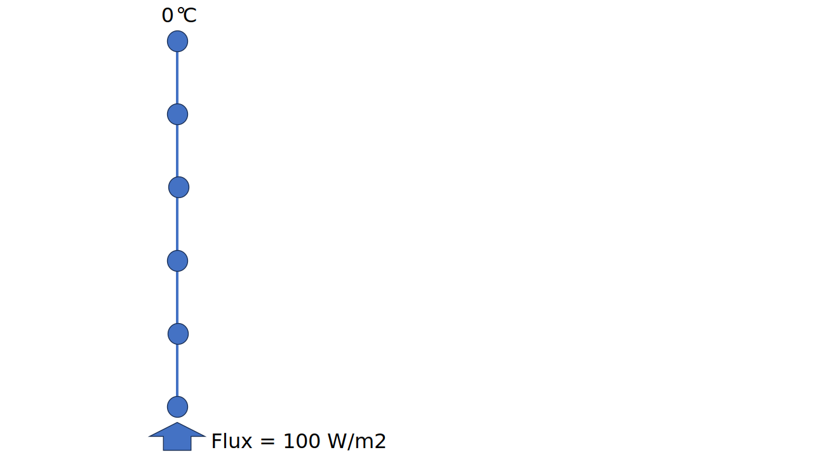

# Test Cases for Thermal Point Flux Condition

**Author:** [Mohamed Nabi](https://github.com/mnabideltares)

**Source files:** [Thermal line element with point flux condition](https://github.com/KratosMultiphysics/Kratos/tree/master/applications/GeoMechanicsApplication/tests/test_thermal_element/test_thermal_heat_flux_line_element)

## Case Specification
In this thermal test case, a 1 m height soil column is considered, where the initial temperature in the entire domain is set to 0 $\mathrm{[^\circ C]}$. The top boundary condition is set to be 0 $\mathrm{[^\circ C]}$. A heat flux of 100 $\mathrm{[W/m^2]}$ is set at the bottom boundary. The simulation spans 250 days to allow for a transition from an exponential to a linear temperature profile between the two sides. This test is conducted for various configurations, including 2D2N, 2D3N, 2D4N, 2D5N, 3D2N and 3D3N line elements. The temperature distribution along the depth is then evaluated with its own result.
The boundary conditions are shown below:

## Results

The picture below illustrates the temperature contours resulting from the simulation (as an example the 2D3N test is shown below).

These results are associated with the final time step after the solution reaches a steady state. The analytical solution is:

$T = \frac{100}{1.1328} \left( 1 -y \right)$

In this test case, the result at node number 1 at location $y = 0 \mathrm{[m]}$ is compared with the analytical solution. The value of the temperature at node 1 is $\frac{100}{1.1328}$ $\mathrm{[^\circ C]}$