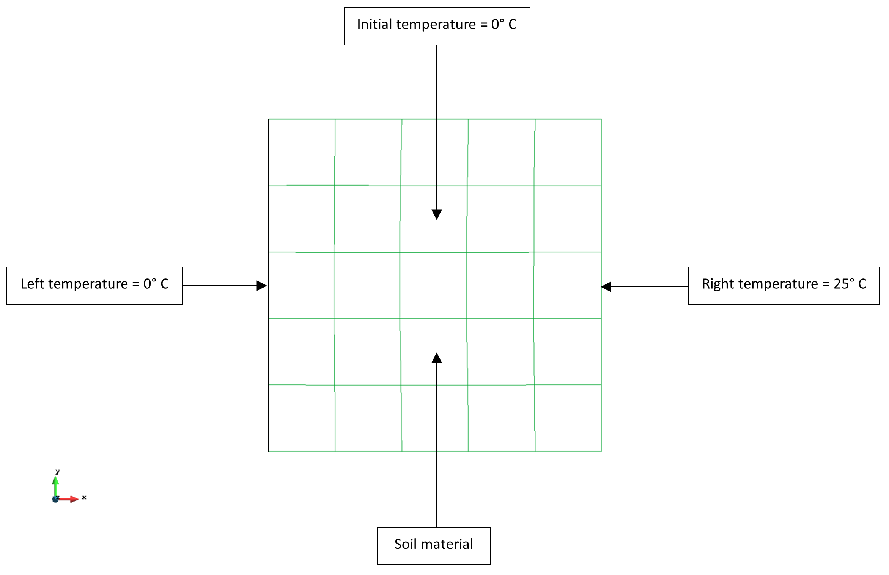
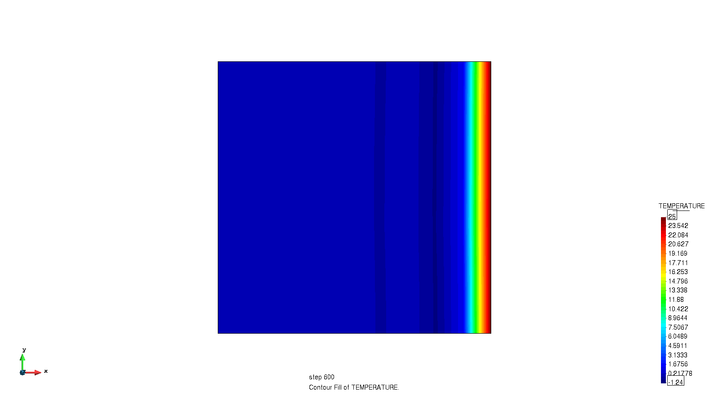

# Test Cases for Transient thermal fixed temperature

**Author:** [Mohamed Nabi](https://github.com/mnabideltares)

**Source files:** [Transient thermal fixed temperature](https://github.com/KratosMultiphysics/Kratos/tree/master/applications/GeoMechanicsApplication/tests/test_thermal_element/test_transient_thermal_fixed_temperature)

## Case Specification
In this thermal test case, a 1 x 1 m soil is considered, with everywhere set to 0 degrees and then a sudden jump to 25 degrees at the right boundary. The simulation spans 1 day to specifically assess the unsteady or transient behavior, enabling a comprehensive understanding of the temperature profile transition between the two sides. This test is conducted for various configurations, including 2D3N, 2D4N, 2D6N, 2D8N, 2D9N, 2D10N, 2D15N, 3D4N, and 3D10N. The temperature distribution within the box is then evaluated with its own result.
The boundary conditions are shown below:

## Results

The animated figure below illustrates the temperature contours resulting from the simulation (as an example the 2D9N test is shown below). You may notice temperatures that drop below the initial condition. These are physically unrealistic but a result of the time integration scheme.

