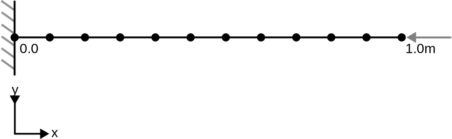

# Staged analysis on a truss with reset displacement option

This test asserts the 'reset_displacement' option of the TrussLinearElement3D2N element (structural mechanics application) works as expected. It exists of 4 stages, where the 'ResetDisplacementProcess' makes sure the total formulation of the structural trusses are converted to the 'staged displacement' definition of the GeoMechanicsApplication (i.e. DISPLACEMENT is the displacement with respect to the start of the stage).

## Setup
The test describes a beam with a length of 1m, consisting of 11 equidistant nodes (0.0, 0.1, ... , 0.9, 1.0). The displacement and rotation of node 1 is fixed for all directions. In stage 1-3, a load in the negative x direction is applied to the right node (11), which is removed in stage 4. See the figure below for a schematic representation of the problem. 

The material is described using:
-   Young's modulus equal to 2069.0e8 N/m2 and Poisson's ratio is 0.29
-   The TrussConstitutiveLaw from the structural mechanics application
-   A cross area of 1.0 m2

The following stages can be distinguished:
- Stage 1: A point load of 1e10 N is applied to node 11 in the negative x-direction. The 'reset_displacement' option is set to false. The beam is expected to contract.
- Stage 2: Essentially the same as stage 1: however, due to the 'reset_displacement_process' added in this stage, the displacement is expected to be 0.0 after these stages stage.
- Stage 3: A point load of 2e10 N is applied to node 11 in the negative x-direction. Therefore, the displacement (with respect to the start of the stage) is the same as in stage 1.
- Stage 4: The load is removed and no 'reset_displacement_process' is active. The beam is expected to expand again to its original shape.

## Assertions
In stage 1, the displacement for any node can be approximated using the following expression:
$$u_y = \frac{F}{EA}x$$
, where $F$ is the applied force, $E$ is Young's Modulus, $A$ is the cross-sectional area and $x$ is the x-coordinate of
the node. In stage 3 the force is doubled, meaning the total displacement is also doubled, but the staged displacement
is equal to the staged displacement of stage 1. Due to the reset_displacement process in stage 2-4, the internal force
in a given stage is retained from the end of the previous stage. Since this internal force is in equilibrium with the
applied external force, the displacement in stage 2 and 3 is expected to be 0.0 for all nodes. 

In stage 4, the load is removed, meaning that the displacement is expected to be the opposite of the displacement in stage 1 + displacement in stage 3 (bringing the beam back to its original position).
