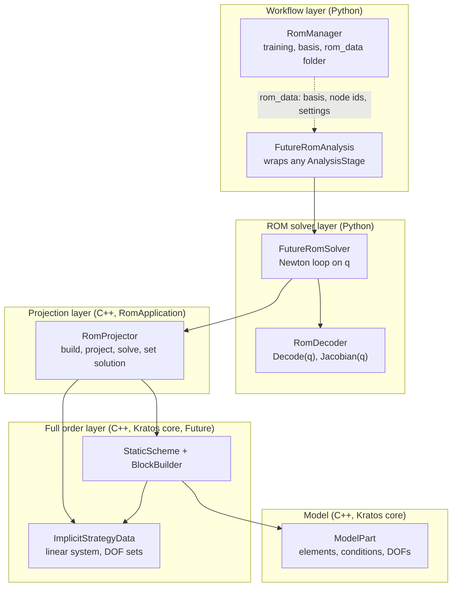
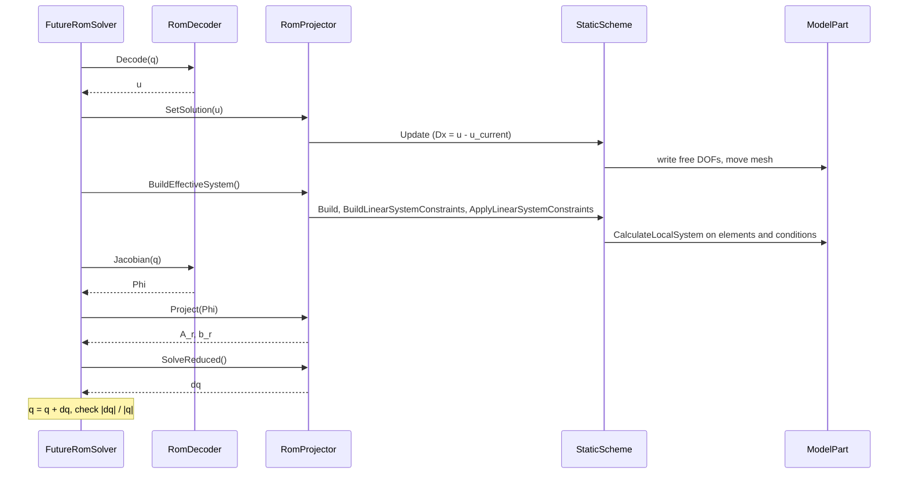
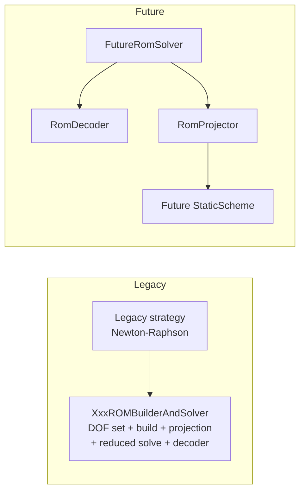

# Architecture of the RomApplication on Kratos `Future`

This document describes how the projection-based ROMs are organised on top of the
`KratosMultiphysics.Future` solving-strategy stack: which components exist, what each one is responsible
for, and how they talk to each other. Results and timings are in [README.md](README.md).

## 1. The idea in one paragraph

A projection-based ROM needs three things: a **decoder** `u = D(q)` that turns reduced coordinates into a
full state, a **full order operator** that builds the tangent matrix `A(u)` and the residual `b(u)`, and a
**projection** that reduces them to a small system for `dq`. In the legacy code the three live inside one
`BuilderAndSolver` class per ROM variant, so every new decoder or projection means another copy of the
class. Here they are three separate components with narrow interfaces. The decoder is Python, the full
order operator is the Kratos core, and the projection is a small C++ class of this application.

## 2. Layers



Each layer only calls the one below it. Nothing in the core knows about ROMs, and the projector knows
nothing about decoders.

| Layer | Component | File | Responsibility |
|---|---|---|---|
| Workflow | `RomManager` | `python_scripts/rom_manager.py` | Unchanged. Runs the FOM, computes the basis, writes `rom_data`. |
| Workflow | `FutureRomAnalysis` | `python_scripts/future/future_rom_analysis.py` | Reuses a standard analysis stage for the model, DOFs and processes, and replaces its solution step by the ROM solver. Builds the decoder from `rom_data`. |
| ROM solver | `FutureRomSolver` | `python_scripts/future/rom_future_solver.py` | Owns the scheme and the strategy data. Newton iteration on `q` and convergence check. |
| ROM solver | `RomDecoder`, `LinearDecoder` | `python_scripts/future/rom_decoders.py` | `Decode(q) -> u` and `Jacobian(q) -> Phi`. |
| Projection | `RomProjector` | `future/rom_projector.h` | Builds the constrained full order system, projects it, solves the reduced system, writes a state to the DOFs. |
| Projection | `NumpyRomProjector` | `python_scripts/future/rom_future_solver.py` | Same interface in NumPy/SciPy. Reference to validate the C++ one. |
| Full order | `StaticScheme`, `BlockBuilder`, `ImplicitStrategyData` | `kratos/future/solving_strategies/` | Core. DOF sets, sparse graph, assembly, constraints, update. Not modified. |

## 3. The two interfaces that matter

**Decoder** (Python, one class per kind of ROM):

```python
class RomDecoder:
    def NumberOfRomDofs(self): ...
    def Decode(self, q): ...      # u, one entry per effective DOF
    def Jacobian(self, q): ...    # Phi = dD/dq, dense, one row per effective DOF
```

**Projector** (C++ `RomProjector`, or its NumPy twin):

```python
projector.BuildEffectiveSystem()   # A(u), b(u) with constraints applied
projector.Project(Phi)             # returns (Phi^T A Phi, Phi^T b)
projector.SolveReduced()           # returns dq
projector.SetSolution(u)           # writes u to the free DOFs through the scheme
```

The only convention shared by the two is the **row ordering**: row `i` belongs to the DOF with effective
equation id `i`. The ordering exists once the scheme has been initialised, which is why the solver receives
its decoder after `Initialize()`.

## 4. One Newton iteration



Per iteration Python makes one decoder evaluation and four calls into C++. The dense basis crosses the
boundary without being copied. All loops over elements, DOFs and matrix entries are in C++.

Design decisions visible in this loop:

- **Absolute update.** The state is always set as `u = D(q)`, not incremented by `Phi dq`. For a linear
  decoder both are the same; for a nonlinear decoder only the absolute form is correct.
- **The scheme does the update.** `SetSolution` goes through `StaticScheme::Update`, so fixed DOFs are
  skipped, constraints are honoured and the mesh is moved by the same code as in a FOM.
- **Fixed DOFs.** Their rows of `Phi` are taken as zero inside `Project`, as the legacy
  `GlobalROMBuilderAndSolver` does. The decoder does not need to know the boundary conditions.

## 5. Legacy and Future side by side



| Concern | Legacy | Future |
|---|---|---|
| DOF set and equation ids | Re-implemented in each ROM builder and solver | `ImplicitScheme::Initialize` |
| Assembly | `Build` of each class | `ImplicitScheme::Build` |
| Projection | `ProjectROM` of each class | `RomProjector::Project` |
| Reduced solve | `SolveROM` of each class | `RomProjector::SolveReduced` |
| Basis storage | `ROM_BASIS` matrix on every node | One dense array owned by the decoder |
| Decoder | Hard-coded: linear in five classes, ANN in two more with a hand-written network and gradient | A Python object; a new decoder is a new Python class |
| Nonlinear loop and convergence | Legacy strategy and criteria | Python loop in `FutureRomSolver` |
| Classes to add a ROM variant | A new builder and solver (400 to 900 lines) | A decoder, or a projection method |

## 6. Where each extension goes

| Feature | Component that changes | Other components |
|---|---|---|
| ANN, RBF or quadratic decoder | New `RomDecoder` subclass, Jacobian by automatic differentiation | None |
| LSPG, Petrov-Galerkin | New projection methods in `RomProjector` | Solver selects the method |
| HROM (weights, selected elements) | `RomProjector::BuildEffectiveSystem`, plus a hook in the core `ImplicitScheme` | None |
| Dynamic problems | A dynamic scheme in the core `Future` | None here: the projector takes any `ImplicitScheme` |
| Other convergence criteria | `FutureRomSolver` | None |
| RomManager integration | Workflow layer: choose `FutureRomAnalysis` instead of `RomAnalysis` | None |

## 7. What is implemented and checked

Implemented: Galerkin projection, linear decoder, static scheme, serial and shared-memory runs.

| Case | Type | Outcome |
|---|---|---|
| Three-node Laplacian (C++ test) | Linear | Same reduced solution as the legacy test |
| Structural static test of the application | Linear, 2 steps | Differs from legacy by 3e-10 |
| Thermal static test of the application | Nonlinear (radiation) | Equal to legacy after one iteration; the legacy ROM stops there |
| Stanford bunny, 26,679 DOFs, 6 modes | Large displacements, follower pressure, 30 steps | Differs from legacy by 1e-7; 11.6 s against 9.3 s |
| Flow past a cylinder, 9,216 DOFs, 200 modes | Transient Navier-Stokes, 500 steps | About 1 % from the FOM; differs from legacy by 0.5 %, cause not yet identified |

Notes on the last two, which are run from scripts outside the repository:

- The bunny needs `move_mesh` on in the scheme settings, as the pressure follows the deformed surface.
- The cylinder only runs with BDF2 integrated by the element (`element_manages_time_integration`), because
  `Future` has no dynamic scheme. Bossak is not available.

## 8. Limits that come from the core

- No Newton-Raphson strategy or convergence criteria in `Future`; the nonlinear loop is Python.
- Only a static scheme.
- No MPI.
- No per-entity hook in `ImplicitScheme::Build`, which HROM needs.
- No application solver uses `Future` yet. `FutureRomAnalysis` therefore still lets the parent analysis
  stage create its legacy solver to read the model and add the DOFs, and bypasses it in the solution steps.

## 9. Questions for discussion

1. Is the boundary right: decoder in Python, projector in C++?
2. Should the nonlinear loop stay in Python until the core has a Newton strategy, or should the
   RomApplication provide a C++ strategy that calls a decoder object?
3. Which hook in `ImplicitScheme` do we ask the core for: entity weights, a list of entities to assemble,
   or public local contribution methods?
4. Should `FutureRomAnalysis` remain a wrapper around existing analysis stages, or wait for application
   solvers based on `Future`?
