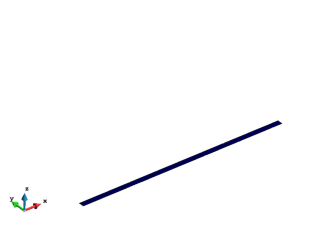
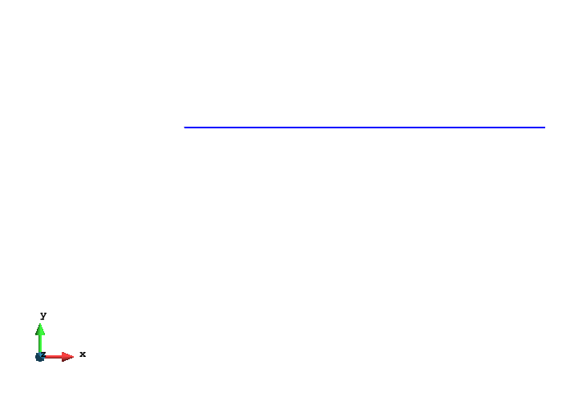

# Solid Mechanics Application

This application focuses on the Finite Element Method (FEM) for solids, shells and beams.

The SolidMechanics application team are in charge of all developments related to this application.

## Getting Started

This application is part of the Kratos Multiphysics Platform. Instructions on how to get you a copy of the project up and running on your local machine for development and testing purposes are available for both [Linux](http://kratos-wiki.cimne.upc.edu/index.php/LinuxInstall) and [Windows](http://kratos-wiki.cimne.upc.edu/index.php/Windows_7_Download_and_Installation) systems.

### Prerequisites

Build [Kratos](https://github.com/KratosMultiphysics/Kratos/wiki) and make sure that you put

``` cmake
-DSOLID_MECHANICS_APPLICATION=ON
-DCONSTITUTIVE_MODELS_APPLICATION=ON
```

between the compilation options, so the Solid Mechanics Application, and Constitutive Models Application are compiled.

Auxiliar external libraries can be added for the solvers: (recommended)

``` cmake
-DEXTERNAL_SOLVERS_APPLICATION=ON
```

when frequency analysis is needed, this module has to be activated:

``` cmake
-DINCLUDE_FEAST=ON
```

## Theory

Classical FE method theory for small and large displacements.

[original wiki web page](http://kratos-wiki.cimne.upc.edu/index.php/Solid_Mechanics_Application)

## Solid Elements


### Displacement based formulations:

Infinitessimal formulation, Total Lagrangian formulation, Updated Lagrangian formulation.

Bbar element for second order elements and infinitessimal theory.

### Mixed elements:

U-P formulation for linear triangles and linear tetrahedra. Monolitich approach with Bochev stabilization.

## Structural Elements:

### Shells

Co-rotational thick and thin 3D shells theory. Large displacements and large rotations.



### Beams

Geometrically exact theory for 3D beams. Large displacements and large rotations.



### Material Laws

The Material laws are implemented in [this application](https://github.com/KratosMultiphysics/Kratos/tree/master/applications/ConstitutiveModelsApplication).

### Time integration schemes

The standard schemes for displacement and rotation degrees of freedom. The following schemes can be chosen separately for -displacements- and for -displacements and rotations-:

* Newmak Scheme
* Bossak Scheme
* Simo scheme
* Static scheme ( no time integration is performed )

### Contact mechanics

The mechanics of contact is implemented in [this application](https://github.com/KratosMultiphysics/Kratos/tree/master/applications/ContactMechanicsApplication).

## Available Interfaces

### GiD Interface

It is located in GiD interface repository in [GiD interface repository](https://github.com/KratosMultiphysics/GiDInterface/tree/master/).

Requires [GiD](https://www.gidhome.com/) - Pre and Post Processing software.

## Releases

The last release of the Solid Mechanics application is supplied with GiD the interface, it can be automatically downloaded in Data->Problem_type->Kratos :: Solid (in application market)

## License

The Solid Mechanics application is OPEN SOURCE. The main code and program structure is available and aimed to grow with the need of any user willing to expand it. The BSD (Berkeley Software Distribution) licence allows to use and distribute the existing code without any restriction, but with the possibility to develop new parts of the code on an open or close source depending on the developers.

## Contact

* **Josep Maria Carbonell** - *Core Development* - [cpuigbo@cimne.upc.edu](mailto:cpuigbo@cimne.upc.edu)
