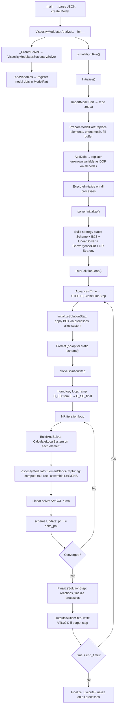

# Simulation Workflow: ViscosityModulatorAnalysis

This document traces the complete lifecycle of a simulation launched with  
`viscosity_modulator_analysis.py`, using the **stationary solver** and the  
`ViscosityModulatorElementShockCapturing` element. It follows the code path from the  
first line of `__main__` to the final `Finalize()` call.

---

## 1. Entry Point — `__main__`

```python
# viscosity_modulator_analysis.py
parameters = KratosMultiphysics.Parameters(parameter_file.read())  # parse JSON
model      = KratosMultiphysics.Model()                             # empty container
simulation = ViscosityModulatorAnalysis(model, parameters)
simulation.Run()
```

`ViscosityModulatorAnalysis` is a thin wrapper around `AnalysisStage`. Its only  
substantive override is `_CreateSolver()`, which delegates to the solver factory.  
Everything else is inherited from `AnalysisStage`.

---

## 2. `AnalysisStage.__init__` — Constructor

Called from `ViscosityModulatorAnalysis.__init__`. Two things happen immediately:

1. **Solver construction** (`_GetSolver()` → `_CreateSolver()`)  
   The solver wrapper reads `solver_settings["solver_type"]` from the JSON and  
   imports the matching module:

   | `solver_type` in JSON | Module loaded |
   |---|---|
   | `"stationary"` | `viscosity_modulator_stationary_solver` |
   | `"transient"` | `viscosity_modulator_transient_solver` |
   | `"scalar_coupled"` | `coupled_fluid_scalar_solver` |
   | … | … |

   For your case (`"stationary"`), `ViscosityModulatorStationarySolver` is  
   instantiated. Inside its `__init__`:
   - The `ViscosityModulatorSolver` (base) `__init__` runs first:
     - Validates the convection-diffusion variables (density, diffusion,  
       unknown, velocity, specific heat, etc.)
     - Creates (or looks up) the `ModelPart` from the `Model` container.
     - Sets `self.min_buffer_size = 1`.
   - The stationary solver sets `min_buffer_size` according to the element type  
     (for `ViscosityModulatorElement*` a buffer of 2 is required; for  
     `ViscosityModulatorElementShockCapturing` it stays at 1).

2. **Variable registration** (`solver.AddVariables()`)  
   All nodal solution-step variables defined in  
   `viscosity_modulator_variables` (TEMPERATURE / CONCENTRATION, VELOCITY,  
   CONDUCTIVITY, DENSITY, SPECIFIC_HEAT, HEAT_FLUX, etc.) are added to the  
   `ModelPart` *before* the mesh is imported. The full `ViscosityModulatorSettings`  
   object is stored in `ProcessInfo[CONVECTION_DIFFUSION_SETTINGS]`.

---

## 3. `simulation.Run()` — Top-Level Orchestration

```python
def Run(self):
    self.Initialize()       # setup phase (done once)
    self.RunSolutionLoop()  # time/iteration loop
    self.Finalize()         # teardown
```

---

## 4. `Initialize()` — One-Time Setup

### 4.1 Mesh Import

```python
solver.ImportModelPart()
```

Reads the `.mdpa` file (or HDF5/restart, depending on `model_import_settings`).  
Populates the `ModelPart` with nodes, elements, conditions, and submodelparts.

### 4.2 Mesh Preparation (`PrepareModelPart`)

1. **Material import** — reads `materials_filename` JSON and calls  
   `ReadMaterialsUtility`. Material properties (conductivity, density, specific  
   heat) that are nodal are distributed to each node via `VariableUtils.SetVariable`.

2. **Element/Condition replacement** (`ReplaceElementsAndConditionsProcess`)  
   The generic element name from the JSON (e.g. `"ViscosityModulatorElementShockCapturing"`)  
   is resolved to the concrete template specialisation, e.g.:
   ```
   ViscosityModulatorElementShockCapturing2D3N   (2D triangle)
   ViscosityModulatorElementShockCapturing2D4N   (2D quad)
   ViscosityModulatorElementShockCapturing3D4N   (3D tetrahedron)
   ViscosityModulatorElementShockCapturing3D8N   (3D hexahedron)
   ```
   Conditions are similarly renamed (e.g. `ScalarFace2D2N`).

3. **Mesh orientation check** (`TetrahedralMeshOrientationCheck`)  
   Verifies consistent element orientations. If `assign_neighbour_elements_to_conditions`  
   is `true`, each boundary condition gets a pointer to its adjacent element  
   (needed for flux boundary conditions).

4. **Buffer allocation** (`_set_and_fill_buffer`)  
   The nodal historical data buffer is sized to `max(min_buffer_size, current_buffer_size)`.  
   For `ViscosityModulatorElementShockCapturing` with the stationary solver the minimum is 1  
   (no history needed), but a buffer of 2 enables access to `phi_old` (step n-1).

### 4.3 DOF Registration

```python
solver.AddDofs()
```

The unknown variable (e.g. `TEMPERATURE` or `CONCENTRATION`) is registered as a  
DOF on every node. If `gradient_dofs = true`, the gradient components  
(`TEMPERATURE_GRADIENT_X`, `_Y`, `_Z`) are also registered.

### 4.4 Process Initialization

All processes listed in `"processes"` and `"output_processes"` in the JSON are  
constructed and their `ExecuteInitialize()` method is called. This is where, for  
example, Dirichlet boundary conditions, body forces, or flux BCs are first applied.

### 4.5 Solver Initialization (`solver.Initialize()`)

The full **strategy stack** is built here (lazily, via getters):

```
_GetSolutionStrategy()
  └─ _CreateSolutionStrategy()          (reads analysis_type from JSON)
       └─ _create_newton_raphson_strategy()   (for non_linear)
            ├─ _GetScheme()
            │    └─ _CreateScheme()           ← overridden in stationary solver
            ├─ _GetConvergenceCriterion()
            │    └─ _CreateConvergenceCriterion()
            ├─ _GetBuilderAndSolver()
            │    └─ _CreateBuilderAndSolver()
            └─ ResidualBasedNewtonRaphsonStrategyPython(...)   ← Python-side NR
```

Details of each component:

#### 4.5.1 Scheme — `ResidualBasedIncrementalUpdateStaticScheme`

Created in `ViscosityModulatorStationarySolver._CreateScheme()`. At the same  
time, several `ProcessInfo` flags are written that the element will read:

| ProcessInfo key | Value | Meaning |
|---|---|---|
| `TIME_INTEGRATION_THETA` | `1.0` | Pure **backward Euler** (implicit) in time |
| `DYNAMIC_TAU` | `1.0` | SUPG dynamic stabilisation coefficient |
| `STATIONARY` | `True` | Elements set `dt_inv = 0`, dropping the time derivative |
| `SHOCK_CAPTURING_INTENSITY` | `C_SC` (from JSON) | Discontinuity-capturing constant |
| `USE_ANISOTROPIC_DISC_CAPTURING` | `true/false` | Isotropic vs. anisotropic shock-capturing diffusion |

The scheme is "static": it only performs the DOF update  
`x += dx` without any mass-matrix or damping-matrix operations.

#### 4.5.2 Builder and Solver — `ResidualBasedBlockBuilderAndSolver`

Wraps the linear solver. The `block_builder = true` (default) path keeps Dirichlet  
constraints by setting zero rows/cols and a 1 on the diagonal (the "block" approach).  
The alternative (`block_builder = false`) eliminates constrained DOFs entirely.

#### 4.5.3 Linear Solver

Constructed from `linear_solver_settings`. The default is **AMGCL** (Algebraic  
Multigrid with GMRES + ILU(0) smoother), but any Kratos-registered solver can  
be used (AMGCL, SuperLU, PARDISO, etc.).

#### 4.5.4 Convergence Criterion

Selected by `convergence_criterion` in JSON:

| Option | What is measured |
|---|---|
| `"residual_criterion"` | ‖**b** − **A**·**x**‖ / ‖**b**₀‖ < tol |
| `"solution_criterion"` | ‖Δ**x**‖ / ‖**x**‖ < tol |
| `"and_criterion"` | Both of the above |
| `"or_criterion"` | Either of the above |

#### 4.5.5 Nonlinear Strategy — `ResidualBasedNewtonRaphsonStrategyPython`

A **pure-Python** custom Newton-Raphson (from  
`continuation_newton_raphson_strategy_for_shock_capturing.py`). It extends the  
standard NR with a **continuation / homotopy** approach for the shock-capturing  
constant: across `NumberOfContinuationIterations` sub-steps the shock-capturing  
intensity is ramped from 0 to `C_SC` following

```
C_SC(k) = C_SC_final · (1 − exp(−2k/N))    for k < N−1
C_SC(N−1) = C_SC_final
```

This avoids convergence failure when a large shock-capturing diffusion is  
applied suddenly to a convection-dominated field.

> [!IMPORTANT]
> The stationary solver **always** uses `ResidualBasedNewtonRaphsonStrategyPython`  
> for `analysis_type = "non_linear"`, even when Navier-Stokes is not involved.  
> For `analysis_type = "linear"`, `ResidualBasedLinearStrategy` is used instead  
> (no iteration loop, single solve per step).

---

## 5. `RunSolutionLoop()` — Time/Continuation Loop

```python
while self.time < self.end_time:
    self.time = solver.AdvanceInTime(self.time)   # increment STEP, clone buffer
    self.InitializeSolutionStep()
    solver.Predict()
    is_converged = solver.SolveSolutionStep()
    self.FinalizeSolutionStep()
    self.OutputSolutionStep()
```

For a **stationary** simulation `end_time` is typically 1.0 and `time_step` is  
1.0, so this loop executes exactly once.

### 5.1 `AdvanceInTime`

```python
dt = settings["time_stepping"]["time_step"]   # from JSON
new_time = current_time + dt
ModelPart.ProcessInfo[STEP] += 1
ModelPart.CloneTimeStep(new_time)             # shifts nodal buffer
```

### 5.2 `InitializeSolutionStep`

1. **Process BCs** — all processes call `ExecuteInitializeSolutionStep()`.  
   This enforces Dirichlet values, applies time-varying loads, updates velocity  
   fields (e.g. from a Navier-Stokes solve if coupled), etc.
2. **Strategy `InitializeSolutionStep`** — inside the Python NR strategy:
   - If `ReformDofSetAtEachStep = true` (or if not yet done): DOF set is  
     enumerated, system vectors/matrices are allocated.
   - `BuildRHS` is called to give the convergence criterion an initial residual  
     norm for normalisation.

### 5.3 `Predict`

Calls `scheme.Predict(...)`. For the static scheme this is a no-op (no  
prediction of velocity/acceleration).

### 5.4 `SolveSolutionStep` — The Nonlinear Loop

This is the heart of the simulation. The full call tree:

```
SolveSolutionStep()
  └─ ResidualBasedNewtonRaphsonStrategyPython.SolveSolutionStep()
       for k in range(NumberOfContinuationIterations):
           ProcessInfo[SHOCK_CAPTURING_INTENSITY] = C_SC(k)   # homotopy ramp
           SolveSolutionStepForFixedContinuationParameter()
               ├─ scheme.InitializeNonLinIteration(...)
               ├─ convergence_criteria.PreCriteria(...)
               ├─ builder_and_solver.BuildAndSolve(...)   ← assemble K, b; solve Δx
               ├─ scheme.Update(...)                      ← x += Δx
               ├─ scheme.FinalizeNonLinIteration(...)
               ├─ convergence_criteria.PostCriteria(...)  ← check convergence
               └─ repeat until converged or max_iterations reached
```

#### 5.4.1 `BuildAndSolve` — Global Assembly

`ResidualBasedBlockBuilderAndSolver.BuildAndSolve` loops over all elements and  
conditions, calling `CalculateLocalSystem` on each:

```
for each element:
    element.CalculateLocalSystem(LHS_e, RHS_e, ProcessInfo)
    assemble LHS_e → K_global
    assemble RHS_e → b_global

apply Dirichlet BC (modify K, b)
linear_solver.Solve(K, Δx, b)
```

#### 5.4.2 Element: `EulerianViscosityModulatorShockCapturingElement::CalculateLocalSystem`

This is where the PDE is discretised. The strong form solved is:

```
ρ·cₚ · ∂φ/∂t  +  ρ·cₚ · a·∇φ  −  ∇·(k∇φ)  =  f
```

where φ is the unknown (temperature/concentration), **a** is the convection  
velocity, k is the diffusivity, ρ is density, cₚ is specific heat, and f is  
the volume source. For the **stationary** case `∂φ/∂t = 0`.

**Step-by-step inside the element:**

1. **`InitializeEulerianElement`** — reads from `ProcessInfo`:  
   - `theta` (= 1.0 ↔ backward Euler)  
   - `dt_inv` (= 0 if stationary)  
   - `C_SC` (shock-capturing intensity — updated each homotopy sub-step)  
   - `USE_ANISOTROPIC_DISC_CAPTURING`

2. **`CalculateGeometry`** — computes shape function gradients **DN_DX** and  
   element volume via a single Gauss point (GI_GAUSS_1 at the barycenter).

3. **`ComputeH`** — element size estimator:  
   ```
   h = sqrt(Σᵢ (1/‖∇Nᵢ‖²)) / TNumNodes
   ```

4. **`GetNodalValues`** — reads nodal φ (current step), φ_old (previous step),  
   velocity **v** and **v_old**, density, specific_heat, conductivity, and  
   volumetric source from the nodal buffer. Averages scalar properties  
   (conductivity, density, specific_heat) using a lumping factor.

5. **Divergence of velocity** — computed at the mid-point:  
   `div_v = Σᵢ DN_DX(i,:) · (θ·vᵢ + (1−θ)·vᵢ_old)`

6. **Gradient of φ** — `∇φ = DN_DX^T · (θ·φ + (1−θ)·φ)`

7. **Gauss-point integration loop** (GI_GAUSS_2, TNumNodes points):  
   For each Gauss point:

   a. **Velocity at Gauss point**: `vel_gp = N · (θ·v + (1−θ)·v_old)`  
   b. **SUPG stabilisation parameter τ**:
      ```
      inv_τ = ρ·cₚ · (β_dyn·dt_inv + 2‖a‖/h + β·div_v) + 4k/h²
      τ      = ρ·cₚ / inv_τ
      ```
      This τ blends dynamic, convective, and diffusive time-scales to prevent  
      spurious oscillations (Streamline-Upwind Petrov-Galerkin, SUPG).

   c. **`aux1`** — contains the mass-like and SUPG-stabilised mass terms  
      (appears with `dt_inv`; zero when stationary).  
   d. **`aux2`** — contains the pure convection and SUPG-stabilised convection  
      terms.

   e. **Shock-capturing diffusion matrix** — if `C_SC > 0` and `‖∇φ‖ > ε`:
      ```
      Pₑ_∥ = ‖a·∇φ‖·h / (2·‖a‖²·‖∇φ‖·k)      (parallel Péclet number)
      αc    = max(0,  C_SC − 1/Pₑ_∥)           (nonlinear diffusion coefficient)
      ```
      If **isotropic**:
      ```
      Ksc = 0.5·αc·h·‖a·∇φ‖ / (‖∇φ‖·‖a‖²) · I
      ```
      If **anisotropic** (default, `use_anisotropic_diffusion = true`):
      ```
      Ksc = 0.5·αc·h·‖a·∇φ‖ / (‖∇φ‖·‖a‖²) · (‖a‖²·I − a⊗a)
      ```
      The subtraction of the parallel component `a⊗a` means extra diffusion  
      is added only **perpendicular to the streamline**, leaving the streamline  
      direction untouched. This provides better accuracy than isotropic  
      shock-capturing while still stabilising sharp fronts.

8. **Assembly of element matrices**:

   ```
   LHS += [ρ·cₚ·dt_inv + θ·β·div_v] · aux1      (mass / unsteady term)
        + k·θ·DN_DX·DN_DX^T · TNumNodes           (physical diffusion)
        + DN_DX · Ksc · DN_DX^T                   (shock-capturing diffusion)
        + ρ·cₚ·θ · aux2                           (convection + SUPG)

   RHS += [ρ·cₚ·dt_inv - (1−θ)·β·div_v] · aux1 · φ_old   (previous-step mass)
        - k·(1−θ)·DN_DX·DN_DX^T · φ_old · TNumNodes       (previous-step diffusion)
        - ρ·cₚ·(1−θ) · aux2 · φ_old                       (previous-step convection)
        + aux1 · f                                         (volume source)
        - LHS · φ                                          (residual form)
   ```

   Scale all terms by `Volume / TNumNodes`.

   > [!NOTE]
   > The RHS includes the subtraction `−LHS·φ`. This converts the assembly to  
   > **residual form**: `b = f_ext − K·φ`, which is what the nonlinear solver  
   > expects. On convergence `‖b‖ → 0`.

#### 5.4.3 `scheme.Update`

After solving `K·Δx = b`:

```python
scheme.Update(model_part, dof_set, A, Dx, b)
```

`ResidualBasedIncrementalUpdateStaticScheme.Update` adds the increment to all  
free DOFs:

```
φᵢ += Δφᵢ    for all unconstrained nodes i
```

#### 5.4.4 Convergence Check

After the update, `convergence_criteria.PostCriteria` checks:
- **Residual criterion**: ‖**b**‖ / ‖**b**₀‖ < `residual_relative_tolerance`  
  AND ‖**b**‖ < `residual_absolute_tolerance`

If not converged and `iteration_number < max_iteration`, the loop repeats.  
The nonlinearity comes from the shock-capturing term: `Ksc` depends on `∇φ`,  
which changes as φ is updated.

> [!IMPORTANT]
> The simulation is **nonlinear even though the PDE is linear**, because the  
> shock-capturing diffusion `Ksc` is a function of the solution gradient `∇φ`.  
> Each Newton-Raphson iteration re-assembles `Ksc` with the updated `∇φ`.

---

## 6. `FinalizeSolutionStep`

```python
strategy.FinalizeSolutionStep()   # scheme, B&S, criterion finalise
for process in processes:
    process.ExecuteFinalizeSolutionStep()
```

Reaction forces (if `compute_reactions = true`) are computed here by the builder  
and solver:  
`reactions = K · φ_constrained - b_constrained`

---

## 7. `OutputSolutionStep`

Output processes (e.g. VTK writer, GiD output) check `IsOutputStep()` and, if  
true, call `PrintOutput()`. Processes that act before/after output  
(e.g. result transfer processes) are also invoked.

---

## 8. `Finalize`

```python
for process in processes:
    process.ExecuteFinalize()
solver.Finalize()
```

Closes output files, releases memory, prints final summary.

---

## 9. Full Lifecycle Diagram



---

## 10. Key Parameters and Their Effect

| JSON parameter | Where used | Effect |
|---|---|---|
| `solver_type` | `python_solvers_wrapper` | Selects solver class |
| `analysis_type` | `_CreateSolutionStrategy` | `"linear"` → 1 solve; `"non_linear"` → NR loop |
| `max_iteration` | NR strategy | Maximum Newton-Raphson iterations per step |
| `convergence_criterion` | Convergence criterion | Residual vs. solution norm |
| `shock_capturing_intensity` (C_SC) | Element + continuation strategy | Strength of anisotropic discontinuity capturing |
| `use_anisotropic_diffusion` | Element | Cross-wind only (true) vs. isotropic (false) SC diffusion |
| `linear_solver_settings` | `_CreateLinearSolver` | AMGCL, SuperLU, PARDISO, etc. |
| `TIME_INTEGRATION_THETA` | Element (`theta`) | 0=Forward Euler, 0.5=Crank-Nicolson, 1=Backward Euler (stationary solver forces 1.0) |
| `block_builder` | `_CreateBuilderAndSolver` | How Dirichlet BCs are enforced |
| `reform_dofs_at_each_step` | NR + B&S | Re-enumerate DOFs every step (needed for topology changes) |
