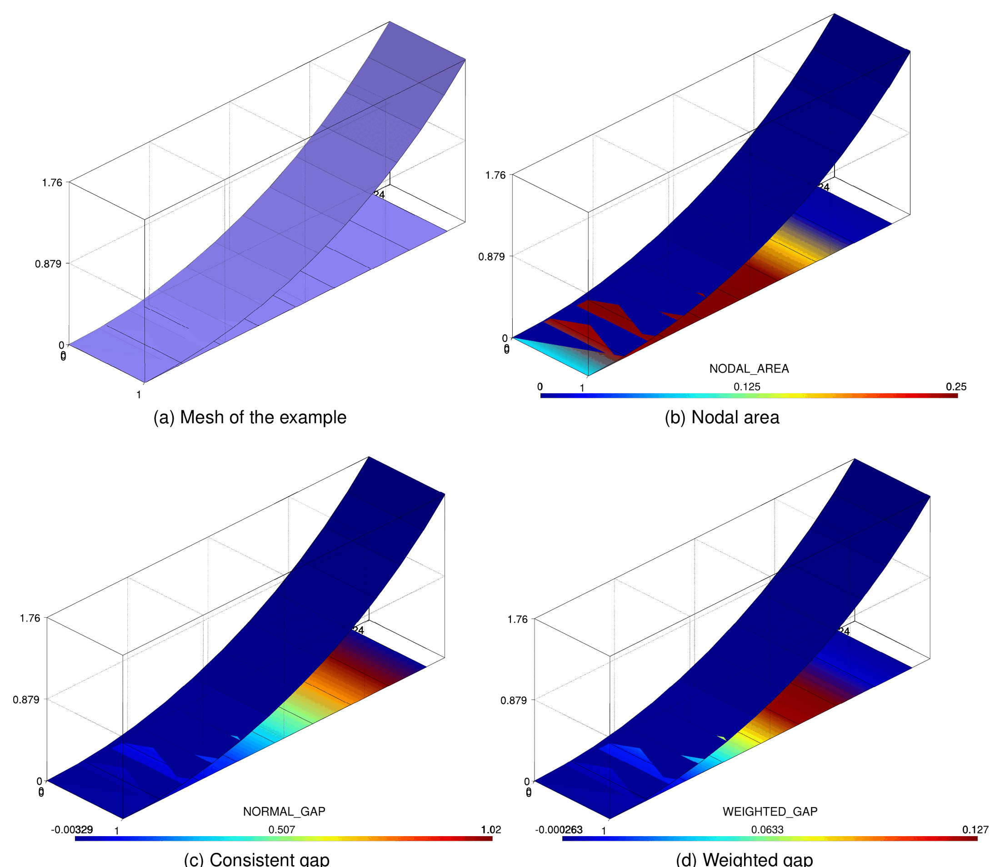
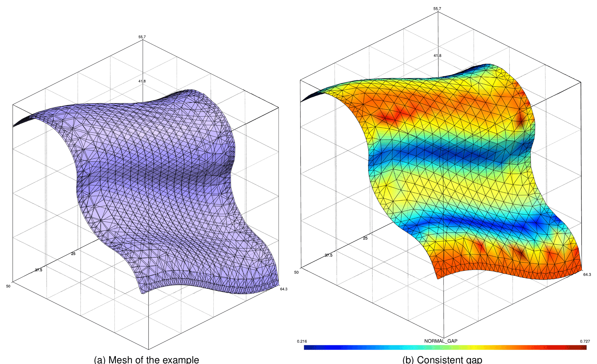

> **Sources.** Thesis §4.4.4 (pp. 129–130: penetration definition, consistent gap, Figs. 4.34, 4.35), Appendix E.1 (p. 339, Algorithm 8 "Consistent gap computation"), §4.3.3.4.2 (mortar operators); code: `custom_processes/normal_gap_process.{h,cpp}`, `custom_processes/base_contact_search_process.cpp`, `custom_processes/simple_contact_search_process.cpp`, `custom_processes/advanced_contact_search_process.{h,cpp}`, `custom_utilities/mortar_explicit_contribution_utilities.cpp`, `custom_utilities/contact_utilities.cpp`, `custom_processes/compute_dynamic_factor_process.cpp`, `custom_strategies/custom_strategies/residualbased_newton_raphson_contact_strategy.h`, `custom_strategies/custom_convergencecriterias/base_mortar_criteria.h`, `python_scripts/search_base_process.py`, Kratos core `kratos/processes/simple_mortar_mapper_process.h`, `kratos/utilities/exact_mortar_segmentation_utility.{h,cpp}`; tests `tests/cpp_tests/processes/test_weighted_gap.cpp`.

The search described in [Search pipeline and bounding volumes](Search_Pipeline_And_Bounding_Volumes.html) yields *candidate* pairs of slave and master conditions. Whether a candidate is kept, and whether the slave nodes enter the active set, depends on how far the surfaces are from each other. This page explains the two gap measures used by the application, how they are computed and how they are compared with the thresholds. Notation follows the thesis: superscript $$1$$ is the slave side, $$2$$ the master side, $$\mathbf{n}$$ the slave normal, $$g_n$$ the (consistent) normal gap, $$\tilde{g}_n$$ the weighted gap, $$\mathbf{D}$$ and $$\mathbf{M}$$ the mortar operators, $$\Phi_j$$ the dual shape functions and $$N_k$$ the standard ones.

## Penetration definition (thesis §4.4.4)

In an implicit analysis potential contact pairs must be created *before* penetration happens, i.e. slave nodes approaching a master surface must be detected at a certain distance, the **maximal detection distance (MDD)**. The MDD is a significant parameter of the detection procedure: it should be as small as possible, to avoid unnecessary pairs, but large enough to capture the contact that will develop during the step. The thesis defines it automatically from the element size $$h$$ (in the code: `NODAL_H`, computed by `FindNodalHProcess` in `SearchBaseProcess.ExecuteInitialize`, scaled by `active_check_factor`). Once the MDD is defined, the penetration (or gap) of each node has to be estimated in order to be compared with it.

Conventional penetration estimates (segment intersection, volume intersection, node in volume, node under surface, ray tracing; thesis Fig. 4.25) are usually uncoupled from the contact formulation. The application instead uses a **consistent** estimate: the very same mortar formulation that defines the weighted gap in the conditions is used to compute a nodal gap during the search. The consistent gap is obtained by mapping the coordinates of one surface onto the other with the mortar mapper (Appendix E) and evaluating node by node

<p align="center">$$ g_n = - \mathbf{n} \cdot \left( \mathbf{x}_1 - \chi_h \, \mathbf{x}_2 \right), $$</p>

where $$\chi_h \mathbf{x}_2$$ are the master coordinates mapped onto the slave node. This value has length units and can be compared with a reference length, unlike the weighted gap. As the thesis notes, the consistent gap coincides with the weighted gap divided by the mortar integration area of the node (Fig. 4.34): the `NODAL_AREA` $$A_j = D_{jj}$$.

<p align="center"></p>
<p align="center"><em>Figure: Consistent gap example, circular surface vs. plane: (a) mesh, (b) nodal area, (c) consistent gap NORMAL_GAP, (d) weighted gap WEIGHTED_GAP. Dividing (d) by (b) recovers (c), which coincides with the analytical height to the circle (thesis Fig. 4.34).</em></p>

<p align="center"></p>
<p align="center"><em>Figure: Consistent gap example on the double-curvature surfaces used to test the mortar mapper: (a) mesh, (b) consistent gap. The gap follows the curvature "parallel lines"; peaks appear at the nodes of the coarse regions (thesis Fig. 4.35).</em></p>

## The two gap measures

### Consistent nodal gap: `NORMAL_GAP` (thesis Algorithm 8)

The procedure is Algorithm 8 of the thesis (Appendix E.1):

```text
Algorithm 8  Consistent gap computation
 1: procedure CONSISTENT GAP COMPUTATION
 2:     Reset auxiliary values for the nodal coordinates on the origin mesh  x_aux
 3:     for all node ∈ OriginMesh_nodes do
 4:         x_aux = x_node
 5:     for all node ∈ DestinationMesh_nodes do
 6:         x_aux = 0
 7:     Map x_aux from OriginMesh_nodes → DestinationMesh_nodes           (mortar mapper)
 8:     for all node ∈ DestinationMesh_nodes do
 9:         From node get the normal (n)
10:         g_consistent = − n · (x_node − x_aux)
```

It is implemented by `NormalGapProcess<TDim, TNumNodes, TNumNodesMaster>` (`custom_processes/normal_gap_process.{h,cpp}`), constructed with the `MasterSubModelPart<N>` and `SlaveSubModelPart<N>` model parts and a boolean `SearchOrientation` (`true` for the normal search, `false` for an [inverted search](Search_Pipeline_And_Bounding_Volumes.html#dynamic-search-and-inverted-search)):

1. `AUXILIAR_COORDINATES` of the master (origin) nodes are set to their coordinates and those of the slave (destination) nodes to zero (lines 2–6). In the inverted case the roles and the `MASTER`/`SLAVE` flags are swapped (`SwitchFlagNodes`).
2. A `SimpleMortarMapperProcess<TDim, TNumNodes, Variable<array_1d<double,3>>, TNumNodesMaster>` maps `AUXILIAR_COORDINATES` from master to slave (line 7) with the parameters `{"distance_threshold": ProcessInfo[DISTANCE_THRESHOLD], "update_interface": false, "remove_isolated_conditions": true, "origin_variable_historical": false, "destination_variable_historical": false, "zero_tolerance_factor": ProcessInfo[ZERO_TOLERANCE_FACTOR], "consider_tessellation": Properties[CONSIDER_TESSELLATION]}`. The mapper uses the dual Lagrange multiplier mortar projection described in [Mortar integration and dual Lagrange multipliers](../Theory/Mortar_Integration_And_Dual_Lagrange_Multipliers.html), so it shares the exact integration (`ExactMortarIntegrationUtility`) with the contact conditions.
3. `ComputeNormalGap` evaluates lines 8–10 for the slave nodes with the nodal `NORMAL` and stores the result in the non-historical variable `NORMAL_GAP`; nodes on which nothing was mapped (`AUXILIAR_COORDINATES` still zero, i.e. no master found within `DISTANCE_THRESHOLD`) keep the previous value, and master nodes get `NORMAL_GAP = 0`.

`BaseContactSearchProcess::ComputeMappedGap` runs this process from `CheckPairing`, after initializing `NORMAL_GAP` of the whole `ContactSub<N>` to $$10^{12}$$ so that unmapped nodes are recognized as far away. Sign convention: `NORMAL_GAP` is **negative when the slave node penetrates** the master surface and positive when there is a gap.

### Weighted gap: `WEIGHTED_GAP`

The weighted gap is the quantity that actually enters the contact conditions (see [Frictionless contact](../Theory/Frictionless_Contact.html)). For slave node $$j$$ it is the dual-weighted integral of the gap over the slave surface, which in discrete form reads

<p align="center">$$ \tilde{g}_{n,j} = - \mathbf{n}_j \cdot \left( \mathbf{D} \, \mathbf{x}_1 - \mathbf{M} \, \mathbf{x}_2 \right)_j , \qquad D_{jk} = \int_{\Gamma_c^1} \Phi_j N^1_k \, d\Gamma, \quad M_{jl} = \int_{\Gamma_c^1} \Phi_j \left( N^2_l \circ \chi_h \right) d\Gamma . $$</p>

In the code it is assembled *explicitly* (no system solve) by `MortarExplicitContributionUtilities::AddExplicitContributionOfMortarCondition` (frictionless) and `AddExplicitContributionOfMortarFrictionalCondition` (adds `WEIGHTED_SLIP`), called from the `AddExplicitContribution` method of every paired mortar condition. For each condition of `ComputingContact`:

1. an `ExactMortarIntegrationUtility` is created with the `INTEGRATION_ORDER_CONTACT` of the properties, `ProcessInfo[DISTANCE_THRESHOLD]` (default $$10^{24}$$), `ProcessInfo[ZERO_TOLERANCE_FACTOR]` (default $$1$$) and `CONSIDER_TESSELLATION`, and the master is clipped against the slave (`GetExactIntegration`);
2. if the clipping is non-empty and the integrated area exceeds $$10^{-5}$$ of the slave area, the mortar operators are computed and `NODAL_AREA` receives the diagonal $$D_{jj}$$ (`AtomicAdd`);
3. the rows of $$\mathbf{D}\mathbf{x}_1 - \mathbf{M}\mathbf{x}_2$$ are dotted with the negative nodal normal and accumulated into the historical variable `WEIGHTED_GAP` of the slave nodes; in the frictional case the tangential part of the time derivative of the same expression, computed with the previous mortar operators (objective slip) or with the displacement increments (non-objective slip, conditions flagged `MODIFIED`), is accumulated into `WEIGHTED_SLIP`.

Because the contributions of all the paired conditions sharing a slave node are summed, `WEIGHTED_GAP` must be reset to zero before every evaluation. `ContactUtilities::ComputeExplicitContributionConditions(rModelPart)` loops over the conditions of `ComputingContact` and calls `AddExplicitContribution`; it is invoked at four points of the solution process:

| Where | When | Purpose |
|---|---|---|
| `BaseContactSearchProcess::ComputeWeightedReaction` | End of every search (`UpdateMortarConditions`, `CheckPairing`) | Provide `WEIGHTED_GAP`/`WEIGHTED_SLIP` (or the mesh-tying residuals `WEIGHTED_SCALAR_RESIDUAL`, `WEIGHTED_VECTOR_RESIDUAL`) for the activation criteria |
| `ResidualBasedNewtonRaphsonContactStrategy::Predict` | Start of the step, before the first iteration | Gap of the predicted configuration (see below) |
| `BaseMortarConvergenceCriteria::PreCriteria` | Every non-linear iteration when `ADAPT_PENALTY` is on or `VELOCITY` exists | Gap needed by the adaptive penalty and the dynamic factor |
| `BaseMortarConvergenceCriteria::PostCriteria` | Every non-linear iteration | Saves the current gap in buffer position 1, recomputes it in position 0; used by the active-set check and the frictional criteria |

The `DISTANCE_THRESHOLD` and `ZERO_TOLERANCE_FACTOR` values are consumed inside `ExactMortarIntegrationUtility`: a master whose projected distance exceeds `mDistanceThreshold` is skipped entirely, and `mZeroToleranceFactor * ZeroTolerance` is the geometric tolerance of the inside/clipping checks (`CheckInside`). `zero_tolerance_factor` is exposed in the contact process settings (`1.0` for ALM/penalty, `1.0e2` for the MPC process) and copied to `ProcessInfo[ZERO_TOLERANCE_FACTOR]` by `SearchBaseProcess._initialize_process_info`.

The relation between the two measures is the one stated in the thesis and used throughout the code: $$g_{n,j} \approx \tilde{g}_{n,j} / A_j$$. `ComputeDynamicFactorProcess` writes exactly this ratio into `NORMAL_GAP` of the active slave nodes, and the advanced activation compares `WEIGHTED_GAP / NODAL_AREA` with the same length thresholds as `NORMAL_GAP`.

## `check_gap` modes

The `check_gap` key of `search_parameters` selects how the candidates delivered by the broad/narrow phase are turned into pairs and which nodes are activated (`BaseContactSearchProcess::ConvertCheckGap`, enum `CheckGap`):

| JSON value | `CheckGap` | Pair creation | Activation |
|---|---|---|---|
| `"NoCheck"` / `"no_check"` | `NoCheck = 0` | Every candidate that passes the orientation filter becomes a paired condition immediately (`AddPotentialPairing` → `AddPairing`) | All nodes of every paired slave are set `ACTIVE` |
| `"DirectCheck"` / `"direct_check"` | `DirectCheck = 1` | The candidate is paired if at least one slave node projects inside the master closer than `NODAL_H * ACTIVE_CHECK_FACTOR` | The nodes satisfying the projection test are set `ACTIVE`; nodes already `ACTIVE` count as potential contact |
| `"MappingCheck"` / `"mapping_check"` (default; the Python default `"check_mapping"` also resolves here) | `MappingCheck = 2` | Candidate ids are stored in the slave `INDEX_MAP`; after `NormalGapProcess`, `CreateAuxiliaryConditions` creates a paired condition for every stored id | `ComputeActiveInactiveNodes` compares `NORMAL_GAP` (and `WEIGHTED_GAP / NODAL_AREA`) with the thresholds |

The **direct check** (`AddPotentialPairing`) projects each inactive slave node onto the master geometry with `GeometricalProjectionUtilities::FastProjectDirection`, first along the nodal normal (or the slave condition normal if the nodal one is zero) and then along the reversed master normal; the node is activated if the projection distance is at most `NODAL_H * ACTIVE_CHECK_FACTOR` and the projected point is inside the master (`IsInside` with `ZeroTolerance`). It does not require the mapper and is therefore cheaper, but it gives a nodal, not a consistent, estimate of the gap and is not compatible with the advanced activation, which needs `NORMAL_GAP`.

With `NoCheck` and `DirectCheck` the weighted gap is still integrated at the end of the search (`ComputeWeightedReaction`), so the conditions start the step with a meaningful `WEIGHTED_GAP`.

## Activation thresholds

The quantities involved in the decision "is this slave node active?" are:

| Quantity | Where it lives | Value / default | Set by | Used by |
|---|---|---|---|---|
| `ACTIVE_CHECK_FACTOR` | `ProcessInfo` and contact `Properties` | `search_parameters["active_check_factor"]` (default `0.01`, multiplied by $$h_{max}/h_{min}$$ when `adapt_search`) | `SearchBaseProcess._initialize_process_info`, `_initialize_search_values` | `AddPotentialPairing` (times `NODAL_H`), `AdvancedContactSearchProcess::ComputeActiveInactiveNodes` (times `DISTANCE_THRESHOLD`) |
| `DISTANCE_THRESHOLD` | `ProcessInfo` | `1.0e24` at initialization; `max(mean NODAL_H slave, mean NODAL_H master)` after every advanced search | `SearchBaseProcess._initialize_search_values`, `AdvancedContactSearchProcess::CheckPairing` | `NormalGapProcess` (mapper), `ExactMortarIntegrationUtility` (integration cut-off), advanced activation |
| `ZERO_TOLERANCE_FACTOR` | `ProcessInfo` | `zero_tolerance_factor` (`1.0`; `1.0e2` for MPC) | `SearchBaseProcess._initialize_process_info` | Geometric tolerance of the mortar integration and the mapper |
| `GapThreshold` | `static constexpr` | `2.0e-3` in `BaseContactSearchProcess`, `2.0e-4` in `AdvancedContactSearchProcess` | compile time | Base criterion (times `NODAL_H`) and `consider_gap_threshold` |
| `NODAL_H` | Historical nodal variable | Mesh size around the node | `FindNodalHProcess` | Both criteria |
| `NODAL_AREA` | Non-historical nodal variable | $$A_j = D_{jj}$$ | Explicit contribution | Normalization of `WEIGHTED_GAP`, LM initial guess |

**Simple activation** (`SimpleContactSearchProcess`, base `ComputeActiveInactiveNodes`): a slave node is active if

<p align="center">$$ g_{n,j} \lt 2\cdot 10^{-3} \, h_j , $$</p>

otherwise it is deactivated. On activation with penetration ($$g_{n,j} \lt 0$$) the multiplier is initialized with the penalty guess $$\lambda_j = \dfrac{\varepsilon_j}{k} A_j g_{n,j}$$ along the normal (`VECTOR_LAGRANGE_MULTIPLIER`, `SCALAR_LAGRANGE_MULTIPLIER` or `LAGRANGE_MULTIPLIER_CONTACT_PRESSURE`), with $$\varepsilon_j$$ the nodal `INITIAL_PENALTY` (or the global one) and $$k$$ the `SCALE_FACTOR`.

**Advanced activation** (`AdvancedContactSearchProcess::ComputeActiveInactiveNodes`), in pseudo-code:

```text
L_ref = DISTANCE_THRESHOLD * ACTIVE_CHECK_FACTOR
if predict_correct_lagrange_multiplier:  (a, b) = linear regression of λ_n over g̃_n on the active nodes
for all slave nodes j:
    L = L_ref
    weighted_check = ACTIVE(j) and ( g̃_n,j / A_j < L )
    if static_check_movement and g̃_n,j − g̃_n,j(previous step) > −1e-3 |g̃_n,j|:      # gap not closing
        if consider_gap_threshold and L < GapThreshold (2e-4):  L = GapThreshold
    if NORMAL_GAP(j) < L  or  weighted_check:
        if predict_correct_lagrange_multiplier: SetActiveNodeWithRegression(j, a, b)
        else:                                   SetActiveNode(j)
    else:
        SetInactiveNode(j)
```

`SetActiveNode` sets `ACTIVE` and `MARKER` (so that a later `SetInactiveNode` in the same search cannot undo it) and, in frictional problems, `SLIP = true` for nodes with zero `FRICTION_COEFFICIENT` or when `pure_slip`, `SLIP = false` otherwise if undefined. `SetInactiveNode` clears `ACTIVE`, zeroes the multiplier of the node (`VECTOR_LAGRANGE_MULTIPLIER`, `SCALAR_LAGRANGE_MULTIPLIER` or `LAGRANGE_MULTIPLIER_CONTACT_PRESSURE` according to `TypeSolution`) and sets `NORMAL_GAP = 0` so that the post-process shows something meaningful. Note that the activation decided by the search is only the *initial guess* of the step: the semi-smooth Newton active-set strategy of [Strategies and convergence criteria](../Implementation/Strategies_And_Convergence_Criteria.html) updates the `ACTIVE` flags at every iteration from the augmented pressure.

**Lagrange multiplier prediction and correction** (`predict_correct_lagrange_multiplier: true`). `ComputeLinearRegressionGapPressure` fits $$\lambda_n = a + b \, \tilde{g}_n$$ over the currently active nodes (with $$\lambda_n$$ either `LAGRANGE_MULTIPLIER_CONTACT_PRESSURE` or $$\boldsymbol{\lambda} \cdot \mathbf{n}$$). Newly activated nodes receive the predicted pressure $$\min(a + b \tilde{g}_{n,j}, 0)$$ (`Predict*MortarLM`), nodes that stay active are corrected with the same formula (`Correct*MortarLM`); one implementation exists per `TypeSolution` (`Scalar`, `Components`, `ALMFrictionless`, `ALMFrictionlessComponents`, `ALMFrictional`). This is meant to shorten the first iterations of steps in which the contact area grows.

## Gap history, `Predict()` and the dynamic factor

`WEIGHTED_GAP` is a historical variable and its buffer is used as a one-step memory of the gap:

- `BaseMortarConvergenceCriteria::PostCriteria` copies `WEIGHTED_GAP` into buffer position 1 before recomputing it; `static_check_movement` in the advanced activation and `ComputeDynamicFactorProcess` read the previous value from there.
- `ResidualBasedNewtonRaphsonContactStrategy::Predict` does **not** call the base predictor. It zeroes `WEIGHTED_GAP` (and `WEIGHTED_SLIP` for frictional problems) on the `Contact` nodes, recomputes the explicit contribution with the current geometry and then advances the nodal coordinates by the displacement of the step (`DISPLACEMENT` at step 1, `DISPLACEMENT − DISPLACEMENT(1)` afterwards), so that the first iteration works on the predicted configuration.
- `ComputeDynamicFactorProcess` (executed in `PreCriteria` when the problem is dynamic and `compute_dynamic_factor` is on in the convergence criterion, or directly by `ExplicitPenaltyContactProcess`) computes, for every active slave node, $$g_n = \tilde{g}_n / A$$ (stored in `NORMAL_GAP`) and its previous value, and when the node passes from gap to penetration sets

<p align="center">$$ \text{DYNAMIC\_FACTOR} = \min\!\left( 1, \ \frac{\vert g_n \vert}{\vert g_n - g_n^{prev} \vert} \right), $$</p>

  i.e. the fraction of the step during which the node was actually in contact. The nodal `DYNAMIC_FACTOR` multiplies the penalty term of the generated ALM conditions (`DynamicFactor` vector in `CalculateLocalLHS/RHS`) and is initialized to one by `ALMFastInit`. The same process also adapts the nodal `INITIAL_PENALTY` with a logistic factor of the penetration when `MAX_GAP_THRESHOLD` is positive (`advance_explicit_parameters`: `max_gap_threshold`, `max_gap_factor`).

## Weighted-gap unit tests as executable definitions

`tests/cpp_tests/processes/test_weighted_gap.cpp` builds small master/slave meshes, pairs every slave with every master into `ALMFrictionalMortarContactCondition3D4N` (or `2D2N`) conditions, and compares the explicitly integrated `WEIGHTED_GAP`/`WEIGHTED_SLIP` with independent references. The reference gap is exactly Algorithm 8 applied by hand: `AUXILIAR_COORDINATES` mapped with `SimpleMortarMapperProcess<3, 4, Variable<array_1d<double,3>>>` and `NORMAL_GAP = −n · (x − x_aux)`; `NODAL_AREA` is obtained from a preliminary explicit contribution into `NODAL_VOLUME`.

| Test | Geometry (helper) | Assertion (tolerance $$10^{-4}$$ relative) |
|---|---|---|
| `WeightedGap1` | Plane vs. cylinder, 8 divisions, radius 6, angle $$\pi/6$$ (`CreateNewProblem3D`) | $$\tilde{g}_n / A_j = g_n$$ (`NORMAL_GAP` from the mapper) on every slave node with non-zero weighted gap |
| `WeightedGap2` | Same, `STEP = 1` | Same as 1 and `WEIGHTED_SLIP = 0` |
| `WeightedGap3`, `WeightedGap3b` | Two parallel planes, master shifted by $$\Delta x = 0.1$$ (`SimplestCreateNewProblem3D`, `SimpleCreateNewProblem3DGapGap`) | Objective slip: `WEIGHTED_SLIP` $$/ A_j$$ equals $$-\Delta x$$ in the shift direction |
| `WeightedGap4`, `WeightedGap4b` | Same, conditions flagged `MODIFIED` | Non-objective slip gives the same $$-\Delta x$$ |
| `WeightedGap5` | Plane vs. cylinder with master shift | Objective slip vector equals the imposed shift |
| `WeightedGap6`, `WeightedGap7` | Plane vs. cylinder with master shift | Non-objective slip on the nodes whose gap matches the reference |
| `WeightedGap8`, `WeightedGap9` | 2D lines (`CreateNewProblem2D`), `ALMFrictionalMortarContactCondition2D2N` | Weighted slip in 2D, objective and non-objective |

These tests are the executable definition of the two gap measures: the weighted gap normalized by the nodal area must reproduce the consistent gap of the mortar mapper to $$10^{-4}$$, which is the statement of Fig. 4.34 in test form. The search-level tests (`SearchProcessKDTree*`, `SearchProcessOctree` in `test_search_process.cpp`) exercise the `MappingCheck` path end to end, and `tests/test_dynamic_search.py` checks `NORMAL_GAP` after a dynamic search against reference JSON files.

## Notes and limitations

- `NORMAL_GAP` is a non-historical variable: it is available for post-processing (`clear_inactive_for_post` zeroes it on inactive nodes) but it is *not* the quantity used inside the contact conditions, which work with `WEIGHTED_GAP`.
- `DirectCheck` cannot be combined with the advanced activation criteria; use `MappingCheck` (default) whenever `simple_search` is `false`.
- The base `GapThreshold` (`2.0e-3`) and the advanced one (`2.0e-4`) are compile-time constants; the user-level knob is `active_check_factor`.
- Nodes without any master within `DISTANCE_THRESHOLD` keep `NORMAL_GAP = 1.0e12` during the check and are therefore deactivated; if the threshold is too small (very coarse master mesh) the contact may be missed, in which case `search_factor` and `active_check_factor` should be increased or `adapt_search` enabled.
- `Predict()` moves the nodal coordinates with the step displacement but the geometry used by the explicit contribution is the one *before* the move; the first Newton iteration recomputes the gap in `PostCriteria`.

*Thesis figures © Vicente Mataix Ferrándiz, PhD thesis "Innovative mathematical and numerical models for studying the deformation of shells during industrial forming processes with the Finite Element Method", UPC 2020, reproduced by the author. Figures marked "inspired by" are the author's redrawings of the cited sources.*
