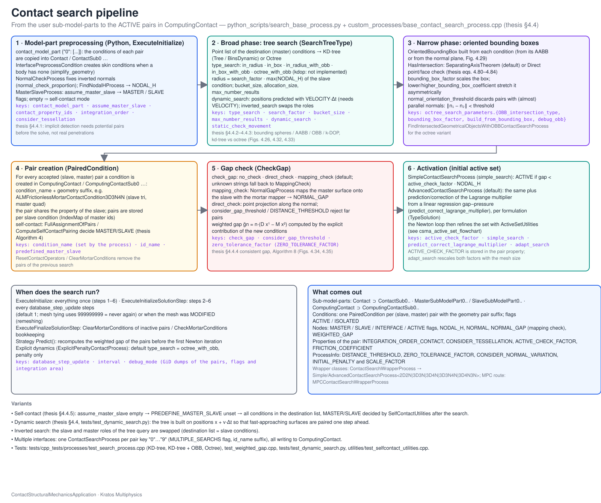
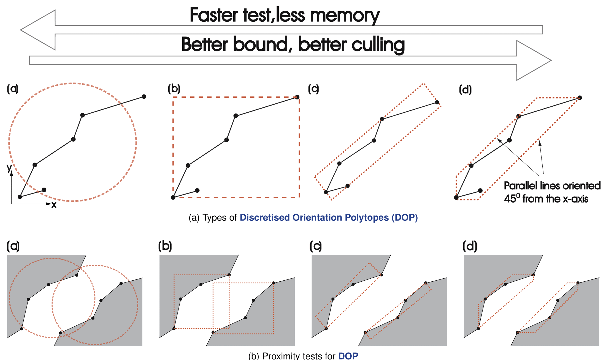
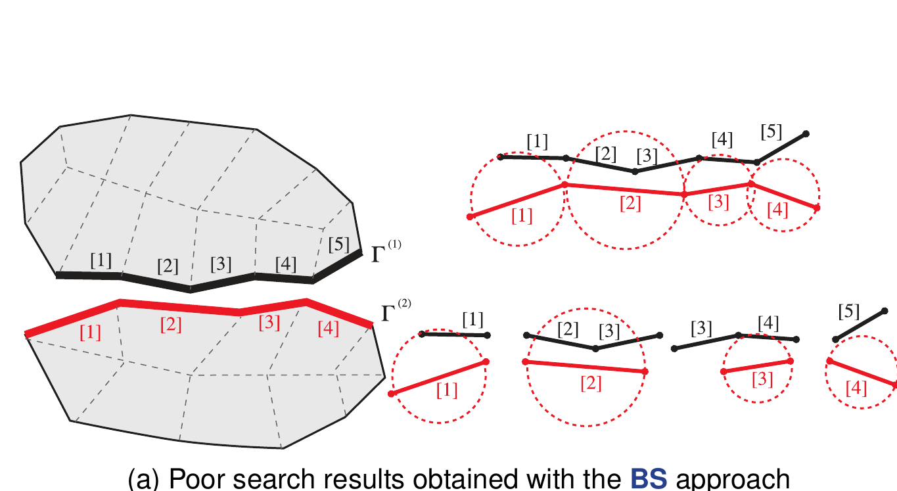
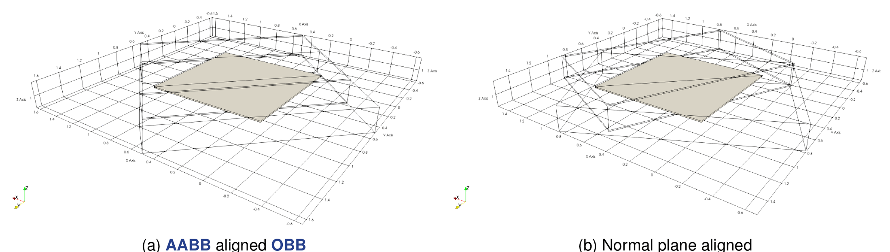
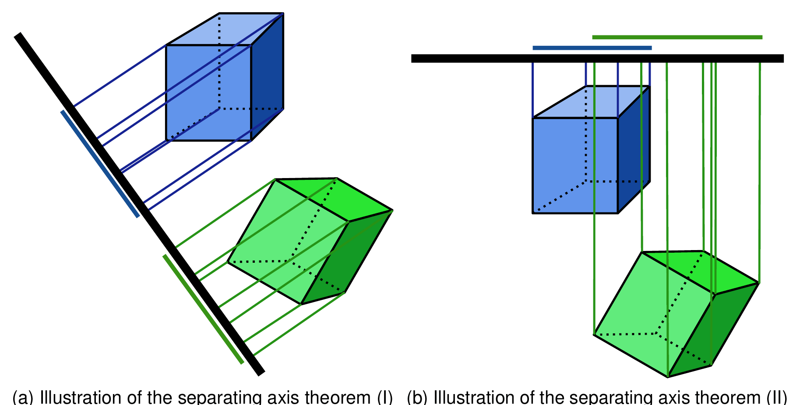
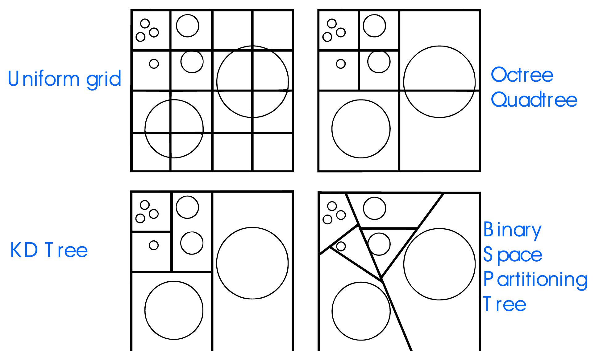
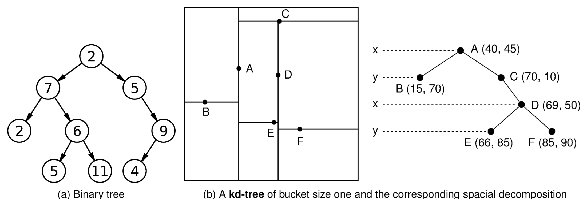

> **Sources.** Thesis §4.4.1–4.4.3 (pp. 123–129: introduction, bounding volumes, OBB implementation, collision detection, SAT, tree structures), Figs. 4.26, 4.27, 4.29, 4.30, 4.32, 4.33; code: `custom_processes/base_contact_search_process.{h,cpp}`, `custom_processes/simple_contact_search_process.cpp`, `custom_processes/advanced_contact_search_process.{h,cpp}`, `custom_processes/contact_search_wrapper_process.cpp`, `custom_processes/find_intersected_geometrical_objects_with_obb_for_contact_search_process.{h,cpp}`, `custom_processes/normal_check_process.cpp`, `custom_processes/master_slave_process.cpp`, `custom_utilities/interface_preprocess.{h,cpp}`, `custom_utilities/contact_utilities.cpp`, `python_scripts/search_base_process.py`, `python_scripts/alm_contact_process.py`, `python_scripts/explicit_penalty_contact_process.py`, Kratos core `kratos/geometries/oriented_bounding_box.{h,cpp}`, `kratos/spatial_containers/{kd_tree,bucket,tree,point_object}.h`; tests `tests/cpp_tests/processes/test_search_process.cpp`, `tests/test_dynamic_search.py`, `tests/test_check_normals_process.py`.

This page describes how the application decides *which* slave and master conditions may come into contact before the mortar conditions described in [Frictionless contact](../Theory/Frictionless_Contact.html) and [Conditions](../Implementation/Conditions.html) are ever assembled. The output of the search is the set of **paired conditions** stored in the `ComputingContact` sub-model-part; the gap checks and the activation of nodes are detailed in [Gap computation](Gap_Computation.html) and the automatic master/slave assignment in [Self-contact](Self_Contact.html).

<p align="center"></p>
<p align="center"><em>Figure: The contact search pipeline of the ContactStructuralMechanicsApplication, from the user model parts to the paired mortar conditions.</em></p>

## Explicit versus implicit detection (thesis §4.4.1)

The detection phase depends strongly on the time integration scheme:

- **Explicit approach.** The time step is very small, so it is enough to detect the bodies that have *actually* penetrated each other and apply repulsive forces. The focus is on real penetration, not on estimation.
- **Implicit approach.** The solution of the step depends on values that are not known yet, so *potential* pairings must be estimated in advance. Each potential pair introduces additional degrees of freedom (the Lagrange multipliers) and contributes to the left- and right-hand sides of the system.

The application targets the implicit approach, which makes the detection phase critical: superfluous pairs are not only expensive to assemble, they also degrade the conditioning of the system and the convergence of the active-set strategy. For $$n$$ slave and $$m$$ master conditions the naive brute-force search (test every master against every slave) costs $$\mathcal{O}(nm)$$, which is unacceptable for meshes with a large number of contact faces. The goal of the search is therefore to find all *proximate* slave–master pairs with a cost close to $$\mathcal{O}(n \log m)$$, which is what bounding volumes and tree structures provide.

## The search pipeline of the application

### Stage 0 – model parts and flags (`SearchBaseProcess`, Python)

All contact processes (`ALMContactProcess`, `PenaltyContactProcess`, `ExplicitPenaltyContactProcess`, `MPCContactProcess`, `MeshTyingProcess`) inherit from `SearchBaseProcess` in `python_scripts/search_base_process.py`. Its `ExecuteInitialize` builds the following hierarchy inside the structural model part (default name `Structure`):

| Sub-model-part | Created by | Content |
|---|---|---|
| `Contact` | `SearchBaseProcess.ExecuteInitialize` | Union of all interface nodes and conditions; recreated from scratch when the root model part is flagged `MODIFIED` (remeshing) |
| `Contact/ContactSub<N>` | `__generate_search_model_part_from_input_list` (one per non-empty key `"N"` of `contact_model_part`), or `__detect_skin` when no model part is given | Nodes and conditions of pair `N` |
| `Contact/ContactSub<N>/MasterSubModelPart<N>` and `SlaveSubModelPart<N>` | `BaseContactSearchProcess::SetOriginDestinationModelParts` (C++) | Nodes/conditions flagged `MASTER` / `SLAVE`, consumed by `NormalGapProcess` and by the octree search |
| `ComputingContact` and `ComputingContact/ComputingContactSub<N>` | `BaseContactSearchProcess` constructor | The paired mortar conditions actually assembled |

For every listed user model part the process sets the `INTERFACE` flag on nodes (and on conditions when present), assigns `MASTER` to everything and then `SLAVE` to the model parts listed in `assume_master_slave["N"]` (`_assign_master_flags`, `_assign_slave_flags`). If `assume_master_slave["N"]` is empty, `predefined_master_slave` becomes `false` and the master/slave roles are decided automatically (see [Self-contact](Self_Contact.html)).

### Stage 1 – interface conditions (`InterfacePreprocessCondition`)

When the interface model parts contain only nodes (the recommended input is conditions, but nodes are accepted), `InterfacePreprocessCondition::GenerateInterfacePart` scans the element faces whose nodes are all `INTERFACE` and creates `LineCondition2D2N`/`LineCondition2D3N` or `SurfaceCondition3D3N`/`3D4N`/`3D6N`/`3D8N`/`3D9N` conditions on them (`"simplify_geometry": true` forces the linear variants). Each new condition inherits the `SLAVE`/`MASTER` flag from its nodes (`AssignMasterSlaveCondition`) and either copies the element properties or uses `contact_property_id`. The conditions are then transferred to `ContactSub<N>` with `FastTransferBetweenModelPartsProcess`.

### Stage 2 – normal check (`NormalCheckProcess`)

Mortar contact needs outward normals on both sides. `NormalCheckProcess` (defaults `{"length_proportion": 0.1, "check_threshold": 5.0e-7}`, `length_proportion` is set from `normal_check_proportion`) computes the unit normals with `NormalCalculationUtils`, offsets the center of every solid element face by `length_proportion` times its length along the normal and tests whether the offset point falls *inside* the parent element (`IsInside` with `check_threshold`). If it does, the face normal points inwards: the element and its conditions are flagged `MARKER` and inverted with `MortarUtilities::InvertNormalForFlag`, and the normals are recomputed. A second pass repeats the check node-wise on the averaged nodal normals. Slender elements (beams, shells, membranes) are skipped with an informative message. The process runs only when `IS_RESTARTED == 0`.

### Stage 3 – master/slave flags on an existing `Contact` model part (`MasterSlaveProcess`)

When the `Contact` sub-model-part already exists (restart, or a user-provided interface), `MasterSlaveProcess` assigns the condition flags from the nodal ones: a condition whose nodes are all `INTERFACE` is `SLAVE` if all its nodes are `SLAVE`, otherwise `MASTER`; interface nodes and conditions are added to `Contact`.

### Stage 4 – the C++ search process family

`SearchBaseProcess._create_main_search` instantiates `CSMA.ContactSearchProcess` (the Python name of `ContactSearchWrapperProcess`) for each pair `N`. The wrapper reads `DOMAIN_SIZE` and the number of nodes of the first `MASTER` and `SLAVE` conditions and creates the matching template instance:

| Geometry | `simple_search: true` | `simple_search: false` (default) |
|---|---|---|
| 2D lines | `SimpleContactSearchProcess<2,2>` | `AdvancedContactSearchProcess<2,2>` |
| 3D triangles | `SimpleContactSearchProcess<3,3>` | `AdvancedContactSearchProcess<3,3>` |
| 3D quadrilaterals | `SimpleContactSearchProcess<3,4>` | `AdvancedContactSearchProcess<3,4>` |
| Slave triangles / master quadrilaterals | `SimpleContactSearchProcess<3,3,4>` | `AdvancedContactSearchProcess<3,3,4>` |
| Slave quadrilaterals / master triangles | `SimpleContactSearchProcess<3,4,3>` | `AdvancedContactSearchProcess<3,4,3>` |

Both derive from `BaseContactSearchProcess<TDim, TNumNodes, TNumNodesMaster>`, which owns the whole algorithm; the derived classes only override the activation methods (`SetActiveNode`, `ComputeActiveInactiveNodes`, `CheckPairing`). `MPCContactSearchProcess` reuses the same base but creates `ContactMasterSlaveConstraint` objects instead of conditions. The constructor of the base class:

1. requires the `Contact` sub-model-part, validates the parameters and sets the local flags `INVERTED_SEARCH`, `PREDEFINE_MASTER_SLAVE`, `PURE_SLIP`, `MULTIPLE_SEARCHS` (`true` when `id_name` is not empty) and `CREATE_AUXILIAR_CONDITIONS` (`true` when `condition_name` is not empty);
2. creates or cleans `ComputingContact[/ComputingContactSub<id_name>]`;
3. builds the reference condition name `<condition_name>Condition<TDim>D<TNumNodes>N<final_string>` (for instance `ALMFrictionlessMortarContactCondition3D3N`) and fetches it as a `PairedCondition` prototype;
4. resets `NORMAL_GAP` to zero when `check_gap` is `MappingCheck` and deactivates all conditions of `ContactSub<N>`;
5. detects the `TypeSolution` from the nodal variables: `VectorLagrangeMultiplier` (`VECTOR_LAGRANGE_MULTIPLIER`), `NormalContactStress` (`LAGRANGE_MULTIPLIER_CONTACT_PRESSURE`), `FrictionlessPenaltyMethod`/`FrictionalPenaltyMethod` (`WEIGHTED_GAP` without multipliers), `ScalarLagrangeMultiplier` (`SCALAR_LAGRANGE_MULTIPLIER`) or `OtherFrictionless`/`OtherFrictional`.

### Stage 5 – life cycle and `database_step_update`

The base process splits the work in the standard Kratos hooks (`Execute()` simply calls the three in sequence):

| Hook | Work |
|---|---|
| `ExecuteInitialize` | `CheckContactModelParts` (clones conditions that were already `MARKER`, so that shared conditions of several pairs get their own `INDEX_MAP`), `CreatePointListMortar` (fills the kd-tree point list with the master conditions, unless the octree is used), `InitializeMortarConditions` (gives every condition of `ContactSub<N>` an `INDEX_MAP`) |
| `ExecuteInitializeSolutionStep` | `ClearMortarConditions` then `UpdateMortarConditions` – the actual search |
| `ExecuteFinalizeSolutionStep` | `ClearMortarConditions` |

On the Python side, `SearchBaseProcess.ExecuteInitializeSolutionStep` only calls the C++ search when `_compute_search()` is true, i.e. when the process interval is active and either `STEP == 1` or the internal counter `database_step` has reached `search_parameters["database_step_update"]` (default `1`, search every step). When the search is skipped, all nodes and conditions of the contact model part are set `ACTIVE = false`, so **increasing `database_step_update` disables contact in the intermediate steps**; it is meant for problems where the pairing is known to be stable (mesh tying, small sliding). Before and after the search the `MARKER` flag of the nodes is reset: `MARKER` is set on nodes activated during the current search so that `SetInactiveNode` does not deactivate them again within the same call.

### Stage 6 – broad phase: point list and trees (`UpdateMortarConditions`)

`UpdateMortarConditions` first refreshes the point list (`UpdatePointListMortar`: in the dynamic case it also applies the predicted displacement, see below), recomputes the unit normals of `ContactSub<N>` and, when the master/slave roles are not predefined, runs the self-contact pre-pairing. Then it dispatches on `SearchTreeType`:

| `type_search` (JSON) | `SearchTreeType` | Broad-phase query |
|---|---|---|
| `"InRadius"` / `"in_radius"` (C++ default) | `KdtreeInRadius = 0` | `Tree::SearchInRadius` around the slave center with radius `search_factor` times the slave circumradius (`Radius()`: largest center-to-node distance) |
| `"InBox"` / `"in_box"` | `KdtreeInBox = 1` | `Tree::SearchInBox` with the slave bounding box whose extreme points are pushed along their normals by `search_factor` times the slave length (`ContactUtilities::ScaleNode`) |
| `"InRadiusWithOBB"` / `"in_radius_with_obb"` (Python default) | `KdtreeInRadiusWithOBB = 2` | As `InRadius`, plus an OBB intersection test between slave and each candidate master |
| `"InBoxWithOBB"` / `"in_box_with_obb"` | `KdtreeInBoxWithOBB = 3` | As `InBox`, plus the OBB test |
| `"OctreeWithOBB"` / `"octree_with_obb"` (explicit default) | `OctreeWithOBB = 4` | Octree of the master conditions built by `FindIntersectedGeometricalObjectsWithOBBContactSearchProcess`, OBB test in the leaves |
| `"KDOP"` / `"kdop"` | `Kdop = 5` | Not implemented – the constructor raises `KDOP contact search: Not yet implemented` |

Any other string silently falls back to `KdtreeInRadius`. The kd-tree branch (`SearchUsingKDTree`) builds a `Tree<KDTreePartition<Bucket<3, PointObject<Condition>>>>` over `mPointListDestination` (the master conditions, or the slave ones for an inverted search) with the given `bucket_size`, allocates a result vector of `allocation_size` entries per slave condition and calls `PerformKDTreeSearch`. The octree branch (`SearchUsingOcTree`) creates `MasterSubModelPart<N>`/`SlaveSubModelPart<N>`, forwards `octree_search_parameters` (with `bounding_box_factor` multiplied by the maximum `NODAL_H` of the two sides) to `FindIntersectedGeometricalObjectsWithOBBContactSearchProcess` and calls `IdentifyNearEntitiesAndCheckEntityForIntersection` for each active slave condition; conditions found to intersect are flagged `SELECTED`. The octree is not compatible with `inverted_search` (`KRATOS_ERROR`).

### Stage 7 – narrow phase: OBB / SAT

In the `*WithOBB` variants an `OrientedBoundingBox<TDim>` is built for the slave (`slave_obb`) and for every candidate master, with half-lengths enlarged by `bounding_box_factor` times the maximum `NODAL_H` of the contact model part, and the candidate is discarded unless `slave_obb.HasIntersection(master_obb)`; the intersection algorithm is selected by `OBB_intersection_type` (see [Collision detection](#collision-detection-and-the-separating-axis-theorem-thesis-4421) below). The octree process performs the same test inside `MarkIfIntersected`, additionally flagging the intersecting masters.

### Stage 8 – pair filtering and creation

Every surviving candidate goes through `CheckGeometricalObject` / `CheckCondition`, which return `Fail`, `AlreadyInTheMap` or `OK`:

- a condition never pairs with itself;
- pairs whose center normals differ by less than `normal_orientation_threshold` (default `0.1`, plus $$10^{-16}$$) are rejected – two faces looking in the *same* direction cannot be in contact (the same criterion drives the self-contact algorithm, Fig. 4.36);
- when the roles are not predefined, or the candidate is itself a slave, the reverse pairing is rejected if it already exists in the candidate's `INDEX_MAP`;
- a master already present in the slave's `INDEX_MAP` is reported as `AlreadyInTheMap`.

With `check_gap = MappingCheck` the accepted master ids are only *stored* in the slave `INDEX_MAP`; the pairs are created later by `CheckPairing → CreateAuxiliaryConditions` after the mapped gap has been computed. With `NoCheck`/`DirectCheck`, `AddPotentialPairing` decides immediately (see [Gap computation](Gap_Computation.html)). In both cases `AddPairing` clones the prototype `PairedCondition` with the slave geometry, the properties of the pair (`contact_property_ids` or the slave properties) and the master geometry as *paired geometry*, adds it to `ComputingContactSub<N>`, stores the new id in the `INDEX_MAP` (`SetNewEntityId`), copies the slave `NORMAL`, sets `ACTIVE` and calls `Initialize`. Ids continue after the maximum condition id of the main model part (`GetMaximumConditionsIds`). `ResetContactOperators` (called from the convergence criteria) removes the paired conditions that ended the step `ACTIVE = false`, or everything after a remeshing (`MODIFIED`).

### Stage 9 – activation: simple versus advanced

The last part of `UpdateMortarConditions` resets the weighted variables (`WEIGHTED_GAP`, `WEIGHTED_SLIP`, `WEIGHTED_SCALAR_RESIDUAL` or `WEIGHTED_VECTOR_RESIDUAL` according to the `TypeSolution`), integrates them explicitly with `ContactUtilities::ComputeExplicitContributionConditions` and sets the nodal `ACTIVE` flags:

- `SimpleContactSearchProcess` uses the base criterion `NORMAL_GAP < GapThreshold * NODAL_H` with `GapThreshold = 2.0e-3` and, if the node penetrates, initializes the Lagrange multiplier with the penalty guess $$\lambda = \varepsilon A_i g_n / k$$ (nodal `INITIAL_PENALTY` or the global one, `NODAL_AREA`, `SCALE_FACTOR`), written to `VECTOR_LAGRANGE_MULTIPLIER`, `SCALAR_LAGRANGE_MULTIPLIER` or `LAGRANGE_MULTIPLIER_CONTACT_PRESSURE`.
- `AdvancedContactSearchProcess` first sets `DISTANCE_THRESHOLD` to the maximum of the mean `NODAL_H` of the master and slave sides, then activates a slave node when `NORMAL_GAP < ACTIVE_CHECK_FACTOR * DISTANCE_THRESHOLD`, or when it is already active and its area-normalized weighted gap is below the same length; `static_check_movement`/`consider_gap_threshold` widen the threshold to `GapThreshold = 2.0e-4` for nodes whose weighted gap is not decreasing. With `predict_correct_lagrange_multiplier` a linear regression pressure–gap over the active nodes (`ComputeLinearRegressionGapPressure`) is used to predict (`Predict*MortarLM`) or correct (`Correct*MortarLM`) the multiplier of each node.

Frictional problems also receive their `SLIP` flag here: nodes with zero `FRICTION_COEFFICIENT` or `pure_slip` are set `SLIP`, the others start in stick. All the thresholds are described in [Gap computation](Gap_Computation.html).

## Bounding volumes (thesis §4.4.2)

A bounding volume is a simple geometric envelope of a condition that makes the proximity test cheap. The thesis follows the classification of Dinas (Fig. 4.26): the trade-off is between the cost of the test and the tightness of the bound.

<p align="center"></p>
<p align="center"><em>Figure: Types of bounding volumes and their proximity tests: (a) bounding sphere (radius search), (b) axis-aligned bounding box, (c) oriented bounding box, (d) discrete orientation polytope (thesis Fig. 4.26, inspired by Yang and Laursen 2008).</em></p>

- **Bounding sphere (BS)** – the nodes inside a radius; the cheapest test and the loosest bound. This is what the plain `InRadius` search does.
- **Axis-aligned bounding box (AABB)** – a cuboid parallel to the Cartesian planes; still loose for inclined faces. This is the `InBox` search.
- **Oriented bounding box (OBB)** – a box rotated with the face; much tighter, at the price of more computation and memory. This is the narrow phase of the `*WithOBB` and `OctreeWithOBB` searches.
- **k-DOP** (discrete orientation polytope / convex hull) – always tighter than AABB and cheaper to update than OBB for deforming bodies, but not implemented (`SearchTreeType::Kdop` is a placeholder).

The application originally used only the radius search; in order to capture all the pairs a large `search_factor` was needed, which produced many *false potential pairs* and impoverished the convergence of the active set (Fig. 4.27a). This is why the OBB was adopted as the intermediate solution and why the Python processes default to `"in_radius_with_obb"`.

<p align="center"></p>
<p align="center"><em>Figure: Poor search results obtained with the bounding-sphere approach: neighbouring faces are paired although they cannot come into contact (thesis Fig. 4.27a).</em></p>

### OBB definition and construction (thesis §4.4.2.1)

Following Eberly (GeometricTools), an OBB in $$\mathbb{R}^3$$ is defined by a center $$\mathbf{C}$$, a right-handed orthonormal set of axes $$\mathbf{A}_0, \mathbf{A}_1, \mathbf{A}_2$$ and positive extents $$a_0, a_1, a_2$$. The solid box is (thesis eq. 4.80a)

<p align="center">$$ \left\{ \mathbf{C} + \sum_{i=0}^{2} x_i \mathbf{A}_i \;:\; \vert x_i \vert \le \vert a_i \vert \ \text{ for all } i \right\} $$</p>

and its eight vertices are (thesis eq. 4.80b)

<p align="center">$$ \mathbf{C} + \sum_{i=0}^{2} \sigma_i a_i \mathbf{A}_i, \qquad \vert \sigma_i \vert = 1 . $$</p>

In the code the class is `OrientedBoundingBox<TDim>` (`kratos/geometries/oriented_bounding_box.h`) with members `mPointCenter`, `mOrientationVectors` and `mHalfLength`. The constructor `OrientedBoundingBox(rGeometry, BoundingBoxFactor, BuildFromBoundingBox)` offers the two construction strategies of the thesis for surface geometries:

1. **From the AABB** (`build_from_bounding_box: true`, default). $$\mathbf{A}_0$$ is the normalized diagonal of the geometry bounding box and $$\mathbf{A}_1, \mathbf{A}_2$$ complete an orthonormal basis (`MathUtils::OrthonormalBasis`). Simple, but for coplanar nodes the direction is arbitrary (Fig. 4.29a).
2. **From the normal** (`build_from_bounding_box: false`). $$\mathbf{A}_0$$ is the unit normal at the center; the nodes are rotated into the tangent plane (`MortarUtilities::RotatePoint`), the farthest node from the center defines $$\mathbf{A}_1$$ and $$\mathbf{A}_2 = \mathbf{A}_1 \times \mathbf{A}_0$$. The box is larger but oriented to the farthest point, which is less arbitrary (Fig. 4.29b). For solid geometries (`WorkingSpaceDimension() == LocalSpaceDimension()`) the first strategy is always used.

In both cases the extents are the maximum projections of the nodes on the axes plus `BoundingBoxFactor`, which is why `bounding_box_factor` is a *relative* quantity: the search process multiplies it by the maximum `NODAL_H` before building the boxes.

<p align="center"></p>
<p align="center"><em>Figure: OBB from surfaces, build comparison: (a) AABB-aligned OBB, (b) normal-plane-aligned OBB (thesis Fig. 4.29).</em></p>

### Collision detection and the separating axis theorem (thesis §4.4.2.1)

Two algorithms are available for `HasIntersection`, selected by `OBBHasIntersectionType` (`"Direct"` or `"SeparatingAxisTheorem"` in `OBB_intersection_type`).

**Direct check** (`DirectHasIntersection`). First the vertices of one box are tested for inclusion in the other and vice versa (`IsInside`); the points are rotated to the axes of the target box (`RotateNode2D/3D`) so that the standard AABB inside test can be applied (`CheckIsInside2D/3D`). In 2D the vertex signs are (thesis eq. 4.81a)

<p align="center">$$ \text{sign}^{2D}_x = \begin{bmatrix} -1 & 1 & 1 & -1 \end{bmatrix}, \qquad \text{sign}^{2D}_y = \begin{bmatrix} -1 & -1 & 1 & 1 \end{bmatrix}, $$</p>

each vertex $$i$$ of the destination box is (thesis eq. 4.81b)

<p align="center">$$ \mathbf{x}^{aabb}_i = \mathbf{C}^{dest} + \text{sign}^{2D}_{xi} \, \mathbf{A}^{dest}_0 a^{dest}_0 + \text{sign}^{2D}_{yi} \, \mathbf{A}^{dest}_1 a^{dest}_1 , $$</p>

and it lies inside the origin box when (thesis eq. 4.81c)

<p align="center">$$ \Vert \mathbf{x}^{aabb}_{xi} - C^{orig}_x \Vert \le a^{orig}_0 \quad \text{and} \quad \Vert \mathbf{x}^{aabb}_{yi} - C^{orig}_y \Vert \le a^{orig}_1 . $$</p>

The 3D version uses the eight sign triplets of thesis eq. 4.82a, the vertex definition $$\mathbf{x}^{aabb}_i = \mathbf{C}^{dest} + \sum_k \text{sign}^{3D}_{ki} \mathbf{A}^{dest}_k a^{dest}_k$$ (eq. 4.82b) and the three inequalities $$\Vert \mathbf{x}^{aabb}_{ki} - C^{orig}_k \Vert \le a^{orig}_k$$ (eq. 4.82c). If no vertex is inside, the edges (2D, `IntersectionUtilities::ComputeLineLineIntersection`) or the faces (3D, `Quadrilateral3D4::HasIntersection`) of the equivalent geometries (`GetEquivalentGeometry`) are intersected pairwise. In total up to **24** checks are needed in 2D and **52** in 3D, although the loop stops at the first positive one.

**Separating axis theorem** (`SeparatingAxisTheoremHasIntersection`, default). Instead of testing nodes and faces, the SAT states that two convex sets are disjoint if and only if there is an axis $$\mathbf{n}$$ on which their projections do not overlap (Figs. 4.30, 4.31). The candidate axes are the box axes and their pairwise cross products, in 2D (thesis eq. 4.83a)

<p align="center">$$ \mathbf{n} \in \left\{ \mathbf{A}^{dest}_0, \mathbf{A}^{dest}_1, \mathbf{A}^{orig}_0, \mathbf{A}^{orig}_1, \ \mathbf{A}^{dest}_0 \times \mathbf{A}^{orig}_0, \ \mathbf{A}^{dest}_0 \times \mathbf{A}^{orig}_1, \ \mathbf{A}^{dest}_1 \times \mathbf{A}^{orig}_0, \ \mathbf{A}^{dest}_1 \times \mathbf{A}^{orig}_1 \right\} $$</p>

and in 3D the six axes plus the nine cross products $$\mathbf{A}^{dest}_i \times \mathbf{A}^{orig}_j$$ (thesis eq. 4.83b). A plane with normal $$\mathbf{n}$$ separates the boxes when the projected center distance exceeds the sum of the projected half-extents, in 2D (thesis eq. 4.84a)

<p align="center">$$ \Vert (\mathbf{C}^{dest} - \mathbf{C}^{orig}) \cdot \mathbf{n} \Vert \gt \Vert (\mathbf{A}^{dest}_0 a^{dest}_0) \cdot \mathbf{n} \Vert + \Vert (\mathbf{A}^{dest}_1 a^{dest}_1) \cdot \mathbf{n} \Vert + \Vert (\mathbf{A}^{orig}_0 a^{orig}_0) \cdot \mathbf{n} \Vert + \Vert (\mathbf{A}^{orig}_1 a^{orig}_1) \cdot \mathbf{n} \Vert $$</p>

and in 3D with the third axis of each box added on the right-hand side (thesis eq. 4.84b). This is implemented in `GetSeparatingPlane2D/3D`; the number of checks drops to **8** in 2D and **15** in 3D, which is why the SAT is the default.

<p align="center"></p>
<p align="center"><em>Figure: Illustration of the separating axis theorem: two boxes are disjoint if their projections on some axis do not overlap (thesis Fig. 4.30).</em></p>

The `octree_search_parameters` block configures the OBB stage for every `type_search` (not only the octree, despite its name):

| Key | Default | Effect |
|---|---|---|
| `bounding_box_factor` | `0.1` | Relative enlargement of the OBB half-lengths (multiplied by the maximum `NODAL_H`); also enlarges the octree bounding box |
| `debug_obb` | `false` | Writes the OBBs as auxiliary geometries (`*_AUXILIAR_DEBUG_OBB` sub-model-parts, debug builds) |
| `OBB_intersection_type` | `"SeparatingAxisTheorem"` | `"Direct"` or `"SeparatingAxisTheorem"` |
| `build_from_bounding_box` | `true` | OBB built from the AABB diagonal (`true`) or from the surface normal (`false`) |
| `lower_bounding_box_coefficient` | `0.0` | Octree only: extra extension of the *lower* corner of the global octree box in the thin directions (`SetOctreeBoundingBox`) |
| `higher_bounding_box_coefficient` | `1.0` | Octree only: same for the *upper* corner. Asymmetric values are useful when a flat interface lies on a coordinate plane |

## Tree structures (thesis §4.4.3)

Bounding volumes make each pairwise test cheap; tree structures make the *number* of tests small. Fig. 4.32 compares the classical space-subdivision approaches: the uniform grid, the quadtree/octree, the kd-tree and the binary space partitioning tree.

<p align="center"></p>
<p align="center"><em>Figure: Space subdivision approaches: uniform grid, octree/quadtree, kd-tree, binary space partitioning tree (thesis Fig. 4.32).</em></p>

A tree is a hierarchy of binary nodes (Fig. 4.33a): the top node is the root, nodes with children are parents, and the bottom ones are the leaves. The **kd-tree** recursively subdivides the space into disjoint hyper-rectangular cells; each tree node is associated with a box and the data points inside it, the root with the bounding box of all points (Fig. 4.33b). Besides the points, a kd-tree is defined by the **bucket size** (maximum number of points per leaf) and the **splitting rule**. The **octree** is the 3D analogue of the quadtree (each cell has eight children).

<p align="center"></p>
<p align="center"><em>Figure: Tree structures: (a) binary tree, (b) a kd-tree of bucket size one and the corresponding spatial decomposition (thesis Fig. 4.33).</em></p>

The application uses the trees already available in the Kratos core:

- `Tree<KDTreePartition<Bucket<3, PointObject<Condition>, PointVector>>>` (`kratos/spatial_containers/kd_tree.h`, `bucket.h`, `tree.h`) for the `Kdtree*` searches. The points are `PointObject<Condition>` (`point_object.h`), i.e. the centers of the master conditions, refreshed with `UpdatePoint()` at every search. The user controls `bucket_size` (default `4`), `allocation_size`/`max_number_results` (default `1000`, size of the result buffer and upper bound on the number of candidates per slave) and `search_factor` (default `3.5`, multiplier of the radius or box).
- The octree of `FindIntersectedGeometricalObjectsProcess` (`kratos/processes/find_intersected_geometrical_objects_process.h`), specialized for contact in `FindIntersectedGeometricalObjectsWithOBBContactSearchProcess`, which overrides `SetOctreeBoundingBox` (the bounding box covers both the slave and the master model parts, enlarged by `bounding_box_factor` and the lower/higher coefficients) and `MarkIfIntersected` (only `SLAVE` objects are tested and both members of an intersecting pair are flagged `SELECTED`).

## Dynamic search and inverted search

**Dynamic search** (`dynamic_search: true`, effective only if `VELOCITY` is a nodal variable). The search is performed on the *predicted* configuration of the current step rather than on the converged configuration of the previous one. `ContactUtilities::ComputeStepJump` stores in `DELTA_COORDINATES` the displacement increment predicted from the velocities and the previous acceleration,

<p align="center">$$ \Delta \mathbf{x} = c_v \, \Delta t \, (\mathbf{v}^{n} + \mathbf{v}^{n-1}) + c_a \, \Delta t^2 \, \mathbf{a}^{n-1}, $$</p>

with $$c_v = 0.5$$, $$c_a = 0.5$$ for a full jump and $$c_v = 0.25$$, $$c_a = 0.125$$ for the half jump used by `GetHalfJumpCenter`. The kd-tree query is centered at the half-jump center of the slave, and with `MappingCheck` the nodal coordinates are temporarily moved by `DELTA_COORDINATES` before the gap mapping and restored afterwards (`UpdatePointListMortar`, `CheckPairing`). `static_check_movement` complements this in the advanced activation by comparing `WEIGHTED_GAP` with its value in the previous step. `tests/test_dynamic_search.py` (`test_dynamic_search_triangle`, `test_dynamic_search_quad`) runs a falling block with `ACCELERATION_X = -9.81` in the buffer, `DELTA_TIME = 0.5` and `ACTIVE_CHECK_FACTOR = 0.3`, and compares the resulting `NORMAL_GAP` with reference JSON files.

**Inverted search** (`inverted_search: true`, or `InvertSearch()` at run time, flag `INVERTED_SEARCH`). All the `Is(SLAVE) == !INVERTED_SEARCH` tests of the base process flip, so the tree is built on the slave conditions and the master conditions are the query objects, and `NormalGapProcess` swaps the mapping direction (`SearchOrientation = false`). It is used to check the search from the master side; it is not available with the octree.

**Multiple searches** (`id_name`, flag `MULTIPLE_SEARCHS`). Each key `N` of `contact_model_part` produces an independent `BaseContactSearchProcess` operating on `ContactSub<N>` and `ComputingContactSub<N>`, which is how multi-body and multi-layer problems (`ALMMultiLayerContactTest`) are handled.

## Explicit-dynamics defaults

`ExplicitPenaltyContactProcess` (used with `contact_structural_mechanics_explicit_dynamic_solver.py`) keeps the same `search_parameters` block but changes the default `type_search` to `"octree_with_obb"`. In explicit analyses the time step is tiny and the search is called very often, so a search that does not require a global point list, works on actual penetration and shares the bounding box of both bodies is preferred; `_compute_search` still obeys `database_step_update`. Note that the octree path relies on `MasterSubModelPart<N>`/`SlaveSubModelPart<N>` and therefore requires predefined master/slave roles.

## `search_parameters` reference

The block lives inside the contact process settings (`alm_contact_process.py`, `penalty_contact_process.py`, `explicit_penalty_contact_process.py`, `mpc_contact_process.py`, `mesh_tying_process.py`). Defaults are those of `ALMContactProcess`:

```json
"search_parameters" : {
    "type_search"                         : "in_radius_with_obb",
    "simple_search"                       : false,
    "adapt_search"                        : false,
    "search_factor"                       : 3.5,
    "active_check_factor"                 : 0.01,
    "max_number_results"                  : 1000,
    "bucket_size"                         : 4,
    "dynamic_search"                      : false,
    "static_check_movement"               : false,
    "database_step_update"                : 1,
    "normal_orientation_threshold"        : 1.0e-1,
    "consider_gap_threshold"              : false,
    "debug_mode"                          : false,
    "predict_correct_lagrange_multiplier" : false,
    "check_gap"                           : "check_mapping",
    "octree_search_parameters" : {
        "bounding_box_factor"             : 0.1,
        "debug_obb"                       : false,
        "OBB_intersection_type"           : "SeparatingAxisTheorem",
        "build_from_bounding_box"         : true,
        "lower_bounding_box_coefficient"  : 0.0,
        "higher_bounding_box_coefficient" : 1.0
    }
}
```

| Key | Default | Meaning | Consuming code |
|---|---|---|---|
| `type_search` | `"in_radius_with_obb"` | Broad/narrow phase combination, see the table of [Stage 6](#stage-6--broad-phase-point-list-and-trees-updatemortarconditions) | `BaseContactSearchProcess::ConvertSearchTree`, `CreatePointListMortar`, `UpdateMortarConditions` |
| `simple_search` | `false` | Select `SimpleContactSearchProcess` instead of `AdvancedContactSearchProcess` | `ContactSearchWrapperProcess` (key removed before forwarding) |
| `adapt_search` | `false` | Multiply `search_factor` and `active_check_factor` by the mesh size ratio $$h_{max}/h_{min}$$ (`ContactUtilities::CalculateRelativeSizeMesh`) for strongly graded meshes | `SearchBaseProcess.ExecuteInitialize` |
| `search_factor` | `3.5` | Radius (times the slave circumradius) or box extension (times the slave length) of the kd-tree query | `PerformKDTreeSearch` |
| `active_check_factor` | `0.01` | Written to `ProcessInfo[ACTIVE_CHECK_FACTOR]` and to the contact properties; fraction of `DISTANCE_THRESHOLD` (advanced) or of `NODAL_H` (direct check) below which a node is activated | `AdvancedContactSearchProcess::ComputeActiveInactiveNodes`, `AddPotentialPairing` |
| `max_number_results` | `1000` | Forwarded as `allocation_size`: size of the kd-tree result buffer per slave | `SearchUsingKDTree`, `ClearDestinationListAndAssignFlags` |
| `bucket_size` | `4` | kd-tree bucket size | `SearchUsingKDTree` |
| `dynamic_search` | `false` | Search on the velocity-predicted configuration | `UpdatePointListMortar`, `PerformKDTreeSearch`, `CheckPairing` |
| `static_check_movement` | `false` | Advanced activation: compare the weighted gap with the previous step | `AdvancedContactSearchProcess::ComputeActiveInactiveNodes` |
| `database_step_update` | `1` | Number of steps between two searches | `SearchBaseProcess._compute_search`, `ExecuteFinalizeSolutionStep` |
| `normal_orientation_threshold` | `0.1` | Minimum norm of the difference of the two center normals for a pair to be admissible | `CheckGeometricalObject` |
| `consider_gap_threshold` | `false` | Advanced activation: enlarge the activation length to `GapThreshold` (`2.0e-4`) for nodes whose gap is not closing | `AdvancedContactSearchProcess::ComputeActiveInactiveNodes` |
| `debug_mode` | `false` | GiD dumps of flags (`_debug_output`), text files `*_normal_debug_*.out`, `gap_active_nodes_debug_*.out`, `SELFCONTACT_*` and the integrated area | `SearchBaseProcess`, `CreateDebugFile`, `ClearDestinationListAndAssignFlags` |
| `predict_correct_lagrange_multiplier` | `false` | Linear-regression prediction/correction of the multipliers of newly active nodes | `AdvancedContactSearchProcess::ComputeActiveInactiveNodes`, `SetActiveNodeWithRegression` |
| `check_gap` | `"check_mapping"` | `"NoCheck"`/`"no_check"`, `"DirectCheck"`/`"direct_check"`, `"MappingCheck"`/`"mapping_check"`; unknown strings (including the Python default) resolve to `MappingCheck` | `BaseContactSearchProcess::ConvertCheckGap` |
| `octree_search_parameters` | see above | OBB and octree configuration | `SearchUsingKDTree`, `SearchUsingOcTree`, `FindIntersectedGeometricalObjectsWithOBBContactSearchProcess` |

Keys that exist only at the C++ level (`ContactSearchWrapperProcess::GetDefaultParameters`) and are filled by `SearchBaseProcess._create_search_parameters`: `condition_name` and `final_string` (built from `contact_type`, `normal_variation` and the axisymmetric option, see [Conditions](../Implementation/Conditions.html)), `predefined_master_slave` (from `assume_master_slave`), `id_name` (the pair key), `allocation_size` (from `max_number_results`), `pure_slip` (`ALMContactProcess._set_additional_parameters`) and `inverted_search` (C++ default `false`).

Note: `_create_search_parameters` forwards only `simple_search`, `type_search`, `check_gap`, `bucket_size`, `search_factor`, `dynamic_search`, `static_check_movement`, `consider_gap_threshold`, `normal_orientation_threshold` and `debug_mode` (plus `allocation_size`). The values of `predict_correct_lagrange_multiplier` and `octree_search_parameters` written in the Python `search_parameters` block are therefore **not** transmitted to the C++ process, which uses its own defaults (`false`, and the `bounding_box_factor = 0.1` block). To change them from Python, create `CSMA.ContactSearchProcess` directly, as the C++ and Python tests do.

## Tests

| Test | File | What it checks |
|---|---|---|
| `SearchProcessKDTree` | `tests/cpp_tests/processes/test_search_process.cpp` | 2D plane–cylinder problem (`CreatePlaneCilynderProblemForSearch`), `"type_search": "InRadius"`, `"check_gap": "MappingCheck"`, `simple_search: true`; asserts the exact content of the `INDEX_MAP` of each slave condition (2–3 masters for the central slaves, none for the extremes) |
| `SearchProcessKDTreeWithOBB` | same | Same problem with `"InRadiusWithOBB"` and `bounding_box_factor = 0.1` |
| `SearchProcessOctree` | same | Same problem with `"OctreeWithOBB"` and `"SeparatingAxisTheorem"` |
| `test_dynamic_search_triangle` / `_quad` | `tests/test_dynamic_search.py` | `dynamic_search: true` on a falling block; `NORMAL_GAP` compared with `*_dynamic_search.json` |
| `test_check_normals`, `test_check_normals_quads`, `test_check_normals_s_shape` | `tests/test_check_normals_process.py` | `NormalCheckProcess` re-orients inverted normals on tetrahedra, hexahedra and the S-shape self-contact mesh |
| `InterfacePreprocessCondition2D`, `InterfacePreprocessCondition3D` | `tests/cpp_tests/utilities/test_interface_preprocess_utilities.cpp` | Condition generation from `INTERFACE` nodes |
| `ALMMultiLayerContactTest`, `ComponentsALMMultiLayerContactTest` | `tests/ValidationTests.py` | Several `contact_model_part` keys, i.e. multiple independent searches |

See also the [test suite reference](../Validation/Test_Suite_Reference.html).

## Notes and limitations

- The search loops over the slave conditions are serial (`// TODO: Make me parallel!!!`); the kd-tree construction and the point updates are parallel.
- `KDOP` is declared in `SearchTreeType` but raises an error; use one of the OBB variants instead.
- The octree search needs predefined master/slave roles and does not support `inverted_search`.
- `database_step_update > 1` deactivates every contact node and condition in the steps without search; it is safe only when the contact state does not change between searches.
- The Python default `"check_gap": "check_mapping"` is not one of the strings recognized by `ConvertCheckGap`; it works because the fallback is `MappingCheck`.

*Thesis figures © Vicente Mataix Ferrándiz, PhD thesis "Innovative mathematical and numerical models for studying the deformation of shells during industrial forming processes with the Finite Element Method", UPC 2020, reproduced by the author. Figures marked "inspired by" are the author's redrawings of the cited sources.*
