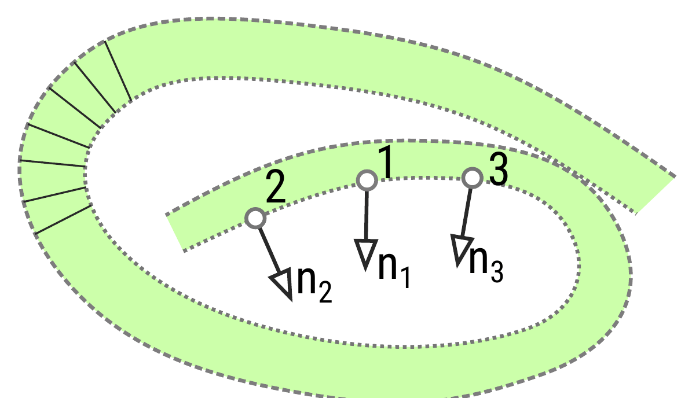
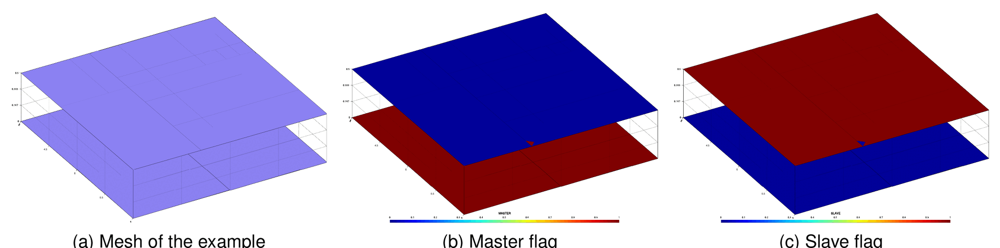
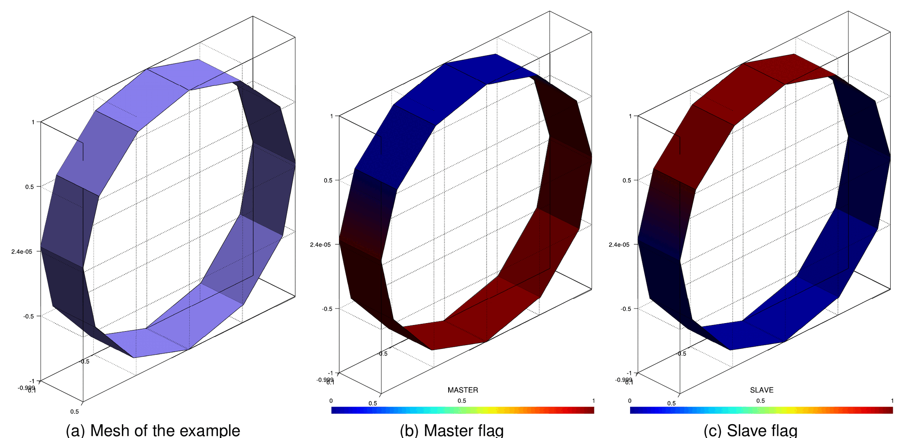
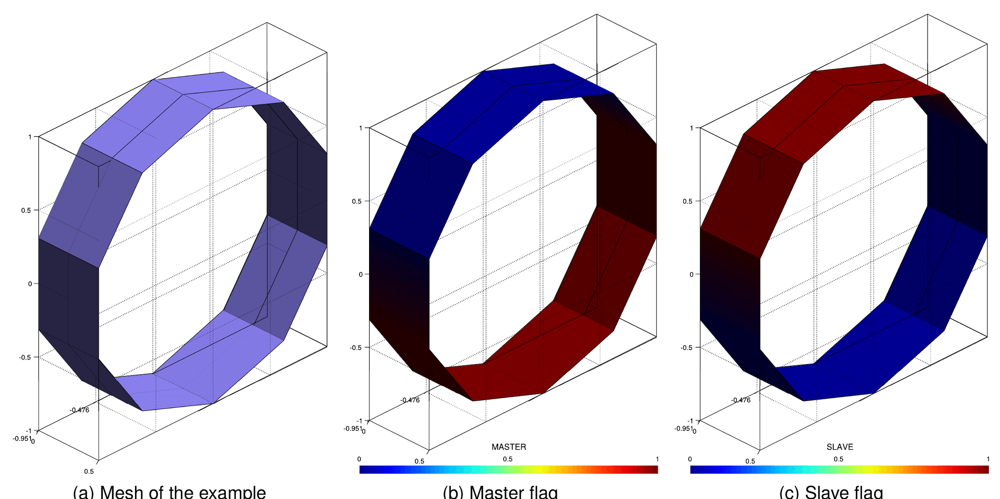
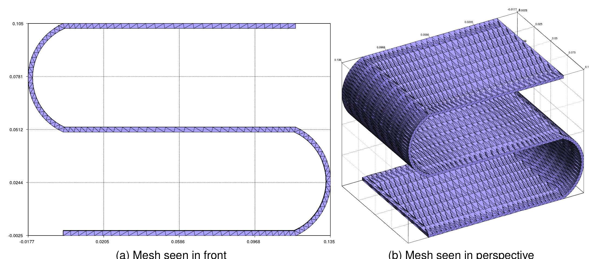
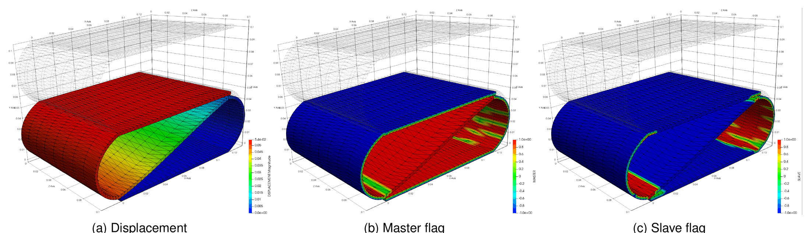

> **Sources.** Thesis §4.4.5 "Self-contact detection" (pp. 130–135, Algorithm 4, Figs. 4.36–4.41); code: [`custom_utilities/self_contact_utilities.h`](https://github.com/KratosMultiphysics/Kratos/blob/master/applications/ContactStructuralMechanicsApplication/custom_utilities/self_contact_utilities.h) / [`.cpp`](https://github.com/KratosMultiphysics/Kratos/blob/master/applications/ContactStructuralMechanicsApplication/custom_utilities/self_contact_utilities.cpp), [`custom_processes/base_contact_search_process.cpp`](https://github.com/KratosMultiphysics/Kratos/blob/master/applications/ContactStructuralMechanicsApplication/custom_processes/base_contact_search_process.cpp) (flag `PREDEFINE_MASTER_SLAVE`), [`python_scripts/search_base_process.py`](https://github.com/KratosMultiphysics/Kratos/blob/master/applications/ContactStructuralMechanicsApplication/python_scripts/search_base_process.py) (`assume_master_slave`), tests `tests/cpp_tests/utilities/test_selfcontact_utilities.cpp`, `ValidationTests.ALMSelfContactContactTest`.

## The problem

In the mortar formulation every contact pair has a *slave* side (where the integration is performed, Popp's "non-mortar" side) and a *master* side. For two or more independent bodies the user can assign these roles a priori — one surface is declared master, the other slave — and the [search](Search_Pipeline_And_Bounding_Volumes.html) only has to pair slave conditions with master candidates. In a **self-contact** problem there is a single body that touches itself: the same surface contains, at different places, both sides of the contact, the roles cannot be assigned beforehand, and the roles may even change during the simulation. The detection therefore needs a dedicated procedure that decides, for every condition of the potential contact surface, whether it acts as master or as slave in the current configuration.

The literature on self-contact for solids is scarce (the most detailed treatment is the one by Yastrebov for node-to-segment integration); most of the publications concern fabrics, rods and other slender structures where self-contact is common. The procedure of the thesis targets solids discretised with linear surface conditions and works with the mortar pairing already in place.

## Algorithm (thesis Algorithm 4)

The detection time is higher than for a standard contact search of the same size, because a preliminary stage — hardly parallelisable — has to be executed before the pairing. The steps are:

1. **All-against-all initial search.** Every condition of the contact surface is potentially paired with every other condition (in the code, `SelfContactUtilities::FullAssignmentOfPairs` or the normal KD-tree/OBB search executed *without* a predefined slave/master split, see below).
2. **Normal discrimination.** Pairs whose normals are "similar" cannot be in contact: two facets facing the same direction never touch each other, so they are removed from the candidate lists. The criterion implemented in `CheckGeometricalObject` rejects a pair when $$\Vert \mathbf{n}_1 - \mathbf{n}_2 \Vert$$, the norm of the difference of the unit normals at the centres of the two conditions, is below `normal_orientation_threshold` (default 0.1). Fig. 4.36 shows the idea: the normals $$\mathbf{n}_1$$ and $$\mathbf{n}_3$$ are almost parallel and the pair 1–3 is discarded at once, whereas the decision on the pair 1–2 depends on the threshold.

<p align="center"></p>
<p align="center"><em>Figure: normal discrimination between candidate conditions of a self-contacting surface (thesis Fig. 4.36).</em></p>

3. **Neighbourhood ordering.** The main hypothesis is that master and slave conditions form *regions* — exactly what a human does when defining the domains by hand. An ordered set of conditions is therefore built by proximity: starting from an arbitrary condition, its neighbours (conditions sharing a boundary, found through a map of boundary connectivities) are appended, then the neighbours of the last appended condition, and so on; when no neighbour is left an arbitrary not-yet-visited condition is taken. The result mimics a region-by-region sweep of the surface.
4. **Master/slave assignment.** Walking the ordered set, every candidate pair of the current condition is examined: neighbours are skipped (a condition never contacts its own neighbours); if none of the nodes of the candidate is already a slave, the candidate condition and its nodes are flagged `MASTER` and its own candidate list is cleared (it will not be considered as a slave any more); if the current condition received at least one master, it and its nodes are flagged `SLAVE`.
5. **Consistency check.** Finally every condition that holds `MASTER` and `SLAVE` nodes at the same time is set inactive (`ACTIVE` unset); the others are set active.

```text
procedure SELF-CONTACT DETECTION (thesis Algorithm 4)
    perform an initial search of all conditions against all conditions
    for all node in ContactMesh.nodes:      reset SLAVE, MASTER
    for all cond in ContactMesh.conditions: reset SLAVE, MASTER, ACTIVE
    ordered_conditions := {an arbitrary first condition}       # std::unordered_set
    boundaries := map(boundary connectivity -> owner condition) # std::unordered_map
    for all cond in ordered_conditions:
        for all boundary of cond:
            if a neighbour sharing the boundary is found: add it to ordered_conditions
            else: add an arbitrary condition not added before
    for all cond in ordered_conditions:
        for all pair in cond.potential_pairs:
            if cond and pair are neighbours: continue
            if no node of pair is SLAVE:
                set MASTER on pair and on its nodes; clear pair.potential_pairs
        if at least one pair is MASTER: set SLAVE on cond and on its nodes
    for all cond in ContactMesh.conditions:
        if cond shares MASTER and SLAVE nodes: unset ACTIVE   # cannot be both at once
        else: set ACTIVE
```

**Limitation.** A node cannot be master and slave at the same time, so conditions that end up with mixed nodes are deactivated. In the tubular example below two conditions are lost in this way. For fine meshes such conditions appear isolated and represent a negligible fraction of the surface, but the limitation is intrinsic to the node-based flags of the formulation.

## Implementation

The procedure lives in the namespace `SelfContactUtilities`:

| Function | Purpose |
|---|---|
| `ComputeSelfContactPairing(ModelPart& rModelPart, std::size_t EchoLevel = 0)` | Executes Algorithm 4 on the pairs stored in the conditions of the contact model part: neighbourhood ordering, master/slave assignment, deactivation of mixed conditions; `EchoLevel` controls the verbosity. When the search runs with `debug_mode`, `SearchUsingKDTree` writes the result to a GiD file `SELFCONTACT_<model part>_STEP_<n>` (flags `MASTER`, `SLAVE`, `ACTIVE`). |
| `FullAssignmentOfPairs(ModelPart& rModelPart)` | Brute-force assignment of every condition as a potential pair of every other one (the "all against all" initial search used by the unit tests and by the debug path). |
| `NotPredefinedMasterSlave(ModelPart& rModelPart)` | When no master/slave split is predefined, (re)assigns the `MASTER`/`SLAVE` flags of nodes and conditions consistently with the final pairing. |

All three are exposed to Python in the submodule `KratosMultiphysics.ContactStructuralMechanicsApplication.SelfContactUtilities`.

Inside `BaseContactSearchProcess` the behaviour is governed by the local flag `PREDEFINE_MASTER_SLAVE`, set from the JSON key `predefined_master_slave`:

- `UpdateMortarConditions()` — when the flag is *not* set, the destination point list is filled with **all** conditions and the `MASTER`/`SLAVE` flags are reset (`ClearDestinationListAndAssignFlags`), the tree/OBB search runs against that list, then `SelfContactUtilities::NotPredefinedMasterSlave` makes the flags consistent with the pairs actually found;
- `SearchUsingKDTree` — after collecting the candidate pairs, `SelfContactUtilities::ComputeSelfContactPairing` arranges the database into a consistent master/slave structure (with the debug GiD output when `debug_mode` is true);
- the pair acceptance checks (`CheckCondition`) skip the "candidate must be slave" test when the flag is not set, so that any condition can be paired with any other.

The Python side sets `predefined_master_slave` automatically in `SearchBaseProcess.__assume_master_slave`: the flag is `True` when the `assume_master_slave` list of the pair is non-empty and `False` otherwise. No separate "self-contact" switch exists — leaving `assume_master_slave` empty *is* the self-contact mode.

## Setting it up

Declare a single contact model part per pair (the whole potential self-contacting surface) and leave the master/slave assumption empty. The validation test `tests/ALM_frictionless_contact_test_3D/self_contact_test_parameters.json` does exactly this with two surfaces of the same body:

```json
{
    "python_module" : "alm_contact_process",
    "kratos_module" : "KratosMultiphysics.ContactStructuralMechanicsApplication",
    "process_name"  : "ALMContactProcess",
    "Parameters"    : {
        "model_part_name"     : "Structure",
        "assume_master_slave" : {},
        "contact_model_part"  : {"0" : ["GENERIC_Contact_Auto1"], "1" : ["GENERIC_Contact_Auto2"]},
        "contact_type"        : "Frictionless"
    }
}
```

Practical remarks:

- the search still uses `type_search`, `search_factor`, the OBB parameters and `normal_orientation_threshold` (see [Search pipeline](Search_Pipeline_And_Bounding_Volumes.html)); a tighter normal threshold removes more candidates and speeds up the assignment;
- `database_step_update` controls how often the roles are recomputed; for large sliding self-contact keep it at 1;
- since the slave side is the integration side, the *default* role is master: after the assignment the master surface is usually much larger than the slave one, which is expected (see the S-shape example);
- the ALM, penalty and MPC processes all inherit this behaviour from `SearchBaseProcess`; mesh tying does not make sense for self-contact.

## Examples (thesis §4.4.5.3)

**Planes detection.** Two parallel planes without shared nodes: the algorithm must return one plane fully master and the other fully slave, which it does (Fig. 4.37). This case is part of the C++ test suite (`SelfContactUtilities1`).

<p align="center"></p>
<p align="center"><em>Figure: simplest self-contact detection case, two parallel planes — mesh, master flag and slave flag (thesis Fig. 4.37).</em></p>

**Tubular detection.** A simplified ring of quadrilaterals whose inner and outer surfaces share nodes — a pure self-contact configuration. With the all-against-all initial assignment the number of master conditions is larger than the number of slave ones (all candidates of a condition are set master before moving to the next potential slave), and the two conditions that share master and slave nodes become inactive (Fig. 4.38). The two-element-thick version (Fig. 4.39) behaves as an extension of the first case despite the more complex neighbourhood. Both are C++ tests (`SelfContactUtilities2`, `SelfContactUtilities3`).

<p align="center"></p>
<p align="center"><em>Figure: tubular case with one element of thickness — mesh, master flag and slave flag (thesis Fig. 4.38).</em></p>

<p align="center"></p>
<p align="center"><em>Figure: tubular case with two elements of thickness (thesis Fig. 4.39).</em></p>

**S-shape profile.** An S-shaped solid meshed with tetrahedra is compressed by a negative vertical displacement on its top face until the branches touch (Fig. 4.40). Assigning the pairs manually is possible but tedious, and the automatic assignment is not trivial because of the large number of triangular faces. The resulting displacement shows the expected contact at the corners; the master nodes are the vast majority of the surface and the slave nodes concentrate in the corners that come into contact (Fig. 4.41).

<p align="center"></p>
<p align="center"><em>Figure: S-shape profile mesh (tetrahedra), front and perspective views (thesis Fig. 4.40).</em></p>

<p align="center"></p>
<p align="center"><em>Figure: S-shape profile self-contact simulation — displacement, master flag and slave flag (thesis Fig. 4.41).</em></p>

The S-shape case is published in the Examples repository: [contact_structural_mechanics/use_cases/self_contact](https://github.com/KratosMultiphysics/Examples/tree/master/contact_structural_mechanics/use_cases/self_contact).

<p align="center"></p>
<p align="center"><em>Figure: animation of the self-contact use case of the Examples repository.</em></p>

## Where it is tested

| Test | Location | Checks |
|---|---|---|
| `SelfContactUtilities1`, `SelfContactUtilities2`, `SelfContactUtilities3` | `tests/cpp_tests/utilities/test_selfcontact_utilities.cpp` | planes and tubular cases of Figs. 4.37–4.39 (flags after `FullAssignmentOfPairs` + `ComputeSelfContactPairing`) |
| `ALMSelfContactContactTest`, `ComponentsALMSelfContactContactTest` (validation) | `tests/ALM_frictionless_contact_test_3D/self_contact_test_parameters.json` | full ALM simulation with automatic master/slave assignment, scalar and vector LM |
| `TestCheckNormals.test_check_normals_s_shape` (nightly) | `tests/test_check_normals_process.py` | the normal check (`NormalCheckProcess`) on the S-shaped surface used by the self-contact example |

See also the [gap computation](Gap_Computation.html) page for the activation of the pairs once the roles are assigned, and [Utilities](../Implementation/Utilities.html) for the API reference.

*Thesis figures © Vicente Mataix Ferrándiz, PhD thesis "Innovative mathematical and numerical models for studying the deformation of shells during industrial forming processes with the Finite Element Method", UPC 2020, reproduced by the author. Figures marked "inspired by" are the author's redrawings of the cited sources.*
