> **Sources.** Thesis Chapter 6, §6.8 "Adaptive remeshing methods applied on CCM" (pp. 232–240), §6.9 "Remeshing workflow" (pp. 240–242), §6.10.3–6.10.5 (pp. 243–249), Figs. 6.1, 6.19–6.33, 6.38–6.54; code: [`python_scripts/contact_remesh_mmg_process.py`](https://github.com/KratosMultiphysics/Kratos/blob/master/applications/ContactStructuralMechanicsApplication/python_scripts/contact_remesh_mmg_process.py), [`python_scripts/adaptive_remeshing/`](https://github.com/KratosMultiphysics/Kratos/tree/master/applications/ContactStructuralMechanicsApplication/python_scripts/adaptive_remeshing), [`python_solvers_wrapper_adaptative_remeshing_contact_structural.py`](https://github.com/KratosMultiphysics/Kratos/blob/master/applications/ContactStructuralMechanicsApplication/python_scripts/python_solvers_wrapper_adaptative_remeshing_contact_structural.py), [`custom_processes/contact_spr_error_process.h`](https://github.com/KratosMultiphysics/Kratos/blob/master/applications/ContactStructuralMechanicsApplication/custom_processes/contact_spr_error_process.h), [`custom_strategies/custom_convergencecriterias/contact_error_mesh_criteria.h`](https://github.com/KratosMultiphysics/Kratos/blob/master/applications/ContactStructuralMechanicsApplication/custom_strategies/custom_convergencecriterias/contact_error_mesh_criteria.h). Requires the `MeshingApplication` compiled with MMG; it was not available in the environment used to write this page, so the behaviour is documented from the sources and the thesis.

## Why remesh a contact problem

The exact solution of a contact problem is only $$C^0$$ across the boundary of the contact area (the pressure jumps from zero to a finite value, thesis §6.8), and that boundary moves during the simulation. A fine mesh is needed there to capture the pressure and the stress concentration, while the rest of the body can stay coarse. The thesis therefore extends its metric-based remeshing framework — built on the [MMG library](https://www.mmgtools.org/) through the `MeshingApplication` — to contact problems and compares three ways of building the metric:

<p align="center">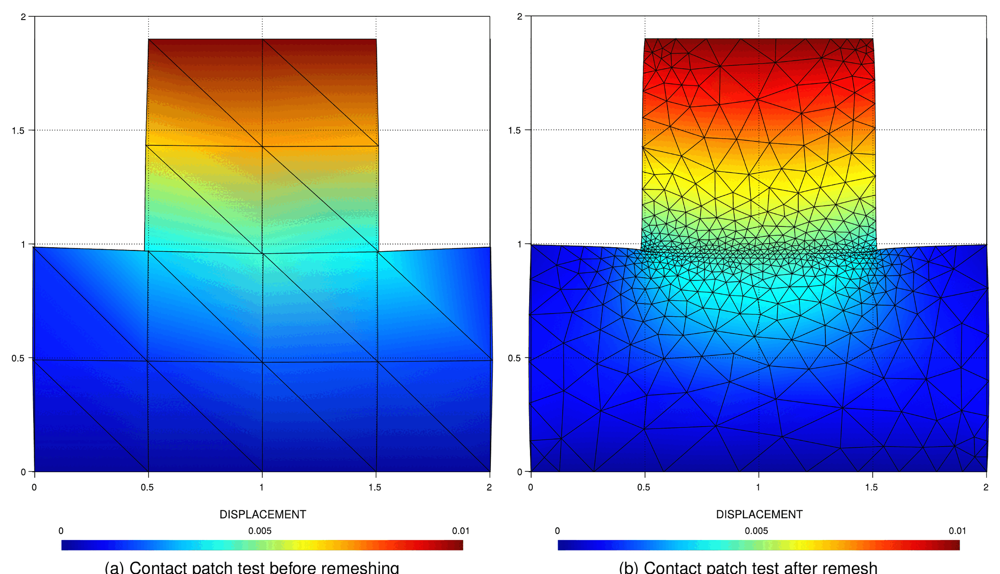</p>
<p align="center"><em>Figure: adaptive mesh techniques applied on a contact patch test, before and after remeshing (thesis Fig. 6.1).</em></p>

| Metric | Idea (thesis §) | Verdict for contact |
|---|---|---|
| **Level set** (§6.8.1) | Treat the contact gap like the distance function of embedded CFD methods and refine in its gradient direction (`NORMAL_GAP` from the consistent gap of §4.4.4). | Refines around the contact zone but with an anisotropy that does not help (Fig. 6.20); discarded. |
| **Hessian** (§6.8.2) | Metric from the Hessian of one or several scalar fields, intersected: the **contact pressure** (mapped from the slave to the master side with the mortar mapper so both bodies are refined consistently), the **von Mises stress** and optionally the **strain energy** (both extrapolated from the Gauss points to the nodes, §6.7), normalised by a factor depending on $$E$$ and $$\nu$$ (eq. 6.26). | Good: fine mesh in the contact zone, at the loaded faces and in the stress concentrations (Figs. 6.22–6.26, 6.38–6.41). The default of the application. |
| **SPR error** (§6.8.3) | Superconvergent-patch-recovery error estimator (Zienkiewicz–Zhu) with the contact treatment of Wriggers: the slave-side patches are coupled to the closest master nodes and the recovered stress must satisfy the contact conditions at the interface (eqs. 6.27–6.30). New in the thesis: the constraint uses the augmented pressure $$\bar\lambda_n$$ of the ALM formulation instead of a penalty estimate, mapped to the master side with the mortar mapper. Remeshing happens only if the estimated error exceeds a threshold. | Good: error concentrated at the contact boundary on the first coarse mesh, then equidistributed (Figs. 6.27–6.31, 6.42–6.45). |

<p align="center">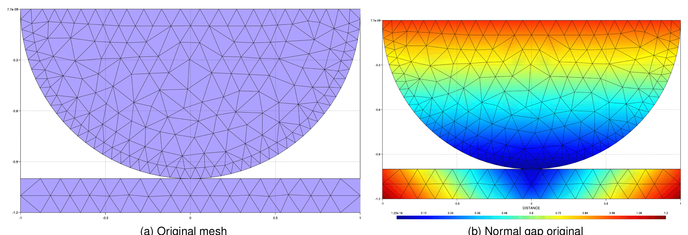</p>
<p align="center"><em>Figure: Hertz-like geometry used to test the level-set metric — original mesh and normal gap (thesis Fig. 6.19).</em></p>

<p align="center">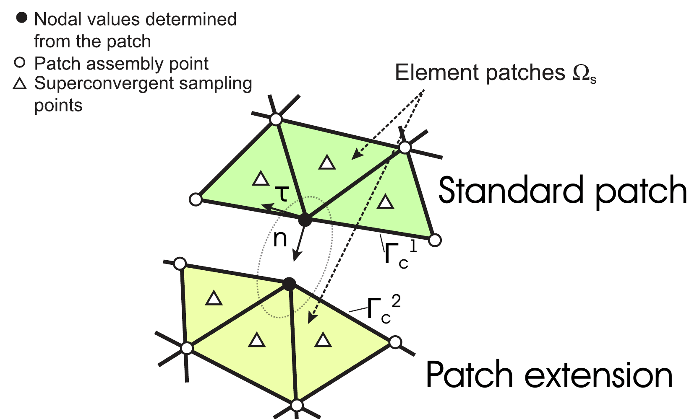</p>
<p align="center"><em>Figure: standard (slave) and extended (master) patches of the SPR error estimator on a contact interface (thesis Fig. 6.27, inspired by Wriggers and Zienkiewicz–Zhu).</em></p>

## Workflows (thesis §6.9)

Two workflows are used; both differ from the standard structural remeshing in the treatment of the contact data.

**Level set / Hessian metric (Fig. 6.32).** After the non-linear loop of a step has converged (or every `step_frequency` steps): the contact pressure is mapped from slave to master, the von Mises stress and strain energy are extrapolated to the nodes, the metric is computed and intersected, the pair conditions are removed (to avoid duplicated conditions), the mesh is regenerated by MMG with interpolation of the nodal and internal values, and the contact flags and sub-model-parts are cleared. The solver and the processes are then re-initialised before the next step, which rebuilds the contact pairs from scratch.

**SPR metric (Fig. 6.33).** The recovered and estimated stresses are computed after convergence, the contact pressure is mapped before the error computation, and the element sizes are estimated from the error; if the error is below `error_mesh_tolerance` the step simply ends, otherwise the mesh is regenerated as above (no extrapolation of integration values is needed).

<p align="center">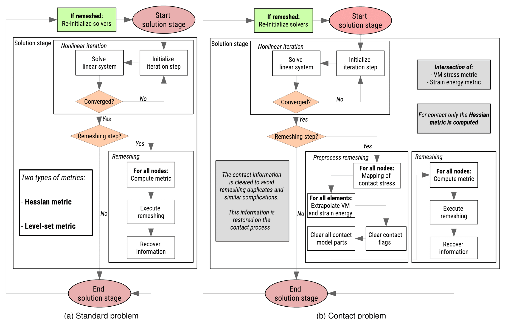</p>
<p align="center"><em>Figure: workflow of the level-set / Hessian remeshing, standard problem (left) and contact problem (right) (thesis Fig. 6.32).</em></p>

<p align="center">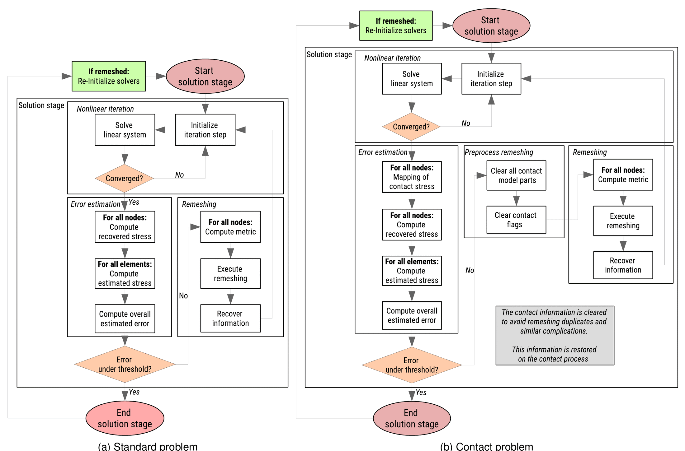</p>
<p align="center"><em>Figure: workflow of the SPR-error remeshing (thesis Fig. 6.33).</em></p>

## Implementation

| Component | Role |
|---|---|
| `contact_remesh_mmg_process.py` — `ContactRemeshMmgProcess(MmgProcess)` | The MMG remeshing process specialised for contact. Default `strategy: "Hessian"` with `hessian_strategy_parameters.metric_variable = ["VON_MISES_STRESS", "AUGMENTED_NORMAL_CONTACT_PRESSURE", "STRAIN_ENERGY"]` (all non-historical, `consider_strain_energy` switch, `automatic_normalization_factor`), `error_strategy_parameters` for the SPR route (`compute_error_extra_parameters.penalty_normal / penalty_tangential`, `error_metric_parameters.error_threshold`), `extrapolate_contour_values` and `interpolate_non_historical` enabled, `remesh_control_type: "step"` with `initial_step` and `step_frequency`, size control (`automatic_remesh`, `minimal_size`, `maximal_size`, `anisotropy_remeshing`) and the MMG advanced parameters. |
| `adaptive_remeshing/adaptative_remeshing_contact_structural_mechanics_analysis.py` — `AdaptativeRemeshingContactStructuralMechanicsAnalysis` | Analysis stage that owns the loop: before remeshing it flags the `Contact` conditions as `INTERFACE` (so MMG preserves the sub-model-parts), removes `ComputingContact`, runs the metric and remeshing processes, removes `Contact`, sets `MODIFIED` and re-initialises the solver and processes (`_ReInitializeSolver`, `_transfer_slave_to_master` for the pressure mapping). It forces `max_iteration = 1`, `analysis_type = "linear"` and `fancy_convergence_criterion = false` in the settings and drives the non-linear iterations itself. It also runs a skin detection so that the boundary conditions have conditions before remeshing. |
| `adaptive_remeshing/adaptative_remeshing_contact_structural_mechanics_static_solver.py`, `..._implicit_dynamic_solver.py` | Contact solvers that add `NODAL_H`, create the remeshing process (`get_remeshing_process`, MMG 2D/3D) and the metric process (`get_metric_process`, `MetricErrorProcess2D/3D` of the `MeshingApplication`), and build the remeshing-aware convergence criterion. |
| `adaptive_remeshing/adaptative_remeshing_contact_structural_mechanics_utilities.py` — `AdaptativeRemeshingContactMechanicalUtilities` | Injects `penalty_normal` / `penalty_tangential` (default `1.0e4`) into `compute_error_settings.compute_error_extra_parameters` and combines the regular criteria with `ContactErrorMeshCriteria` for `convergence_criterion: "adaptative_remesh_criteria"` (or any `*_with_adaptative_remesh`). Raises `NameError('The AdaptativeErrorCriteria can not be used without compiling the MeshingApplication')` otherwise. |
| `python_solvers_wrapper_adaptative_remeshing_contact_structural.py` | Solver dispatch (`static` / `dynamic`, OpenMP only) for the analysis above. |
| `custom_processes/contact_spr_error_process.h` — `ContactSPRErrorProcess<TDim>` | SPR error estimator with the contact terms of eqs. 6.29–6.30 on the nodes flagged `CONTACT` (`stress_vector_variable`, `penalty_normal`, `penalty_tangential`). Python names `ContactSPRErrorProcess2D/3D`. |
| `custom_strategies/custom_convergencecriterias/contact_error_mesh_criteria.h` — `ContactErrorMeshCriteria` | Convergence criterion on the discretisation error: flags the contact nodes and conditions, runs `ContactSPRErrorProcess` and compares `ERROR_RATIO` with `error_mesh_tolerance` (defaults `error_mesh_tolerance: 5.0e-3`, `error_mesh_constant: 5.0e-3`); "converged" means that no remeshing is required. |
| `ResidualBasedNewtonRaphsonContactStrategy` (`adaptative_strategy`) | Not remeshing: the *adaptive time stepping* of the strategy. The test case `3D_contact_simplest_patch_matching_adaptative_test` uses this key. |

Minimal `ProjectParameters.json` fragment for a Hessian-based contact remeshing (requires the `MeshingApplication`):

```json
"solver_settings" : {
    "solver_type"           : "Static",
    "contact_settings"      : { "mortar_type" : "ALMContactFrictionless" },
    "convergence_criterion" : "contact_residual_criterion"
},
"processes" : {
    "contact_process_list" : [ { "python_module" : "alm_contact_process", "kratos_module" : "KratosMultiphysics.ContactStructuralMechanicsApplication", "process_name" : "ALMContactProcess", "Parameters" : { "...": "..." } } ],
    "mesh_adaptivity_processes" : [{
        "python_module" : "contact_remesh_mmg_process",
        "kratos_module" : "KratosMultiphysics.ContactStructuralMechanicsApplication",
        "process_name"  : "ContactRemeshMmgProcess",
        "Parameters"    : {
            "model_part_name"       : "Structure",
            "strategy"              : "Hessian",
            "consider_strain_energy": false,
            "initial_step"          : 4,
            "step_frequency"        : 3,
            "minimal_size"          : 0.01,
            "maximal_size"          : 1.0,
            "hessian_strategy_parameters" : { "interpolation_error" : 0.04 }
        }
    }]
}
```

and the analysis is driven by `AdaptativeRemeshingContactStructuralMechanicsAnalysis` instead of `StructuralMechanicsAnalysis` (the analysis detects the `mesh_adaptivity_processes` list). For the SPR route use `"strategy": "superconvergent_patch_recovery"` (alias `"spr"`) in the process together with `"convergence_criterion": "adaptative_remesh_criteria"` in the solver.

## Thesis examples (§6.8.2.2, §6.10.3–6.10.5)

**Punch test with the Hessian metric (§6.8.2.2.2).** A coarse plane-strain punch test (steel on steel, thesis Table 6.2), 4 steps of $$\Delta t = 0.5$$ s with $$u_y = -0.01\,t$$ imposed on the top face, remeshed every 2 steps with the intersection of the Hessians of the contact pressure, the von Mises stress and (optionally) the strain energy. The comparison with and without the strain energy shows the extra refinement it brings around the stress concentrations (Figs. 6.22–6.26).

<p align="center">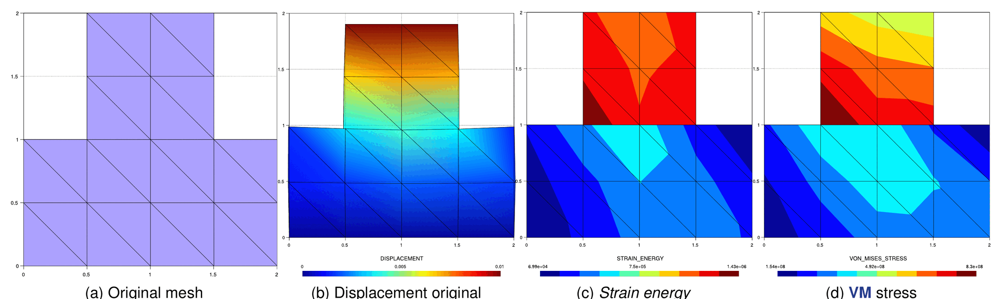</p>
<p align="center"><em>Figure: punch test, original mesh and solution at $$t = 0.5$$ s — displacement, strain energy and von Mises stress (thesis Fig. 6.22).</em></p>

<p align="center">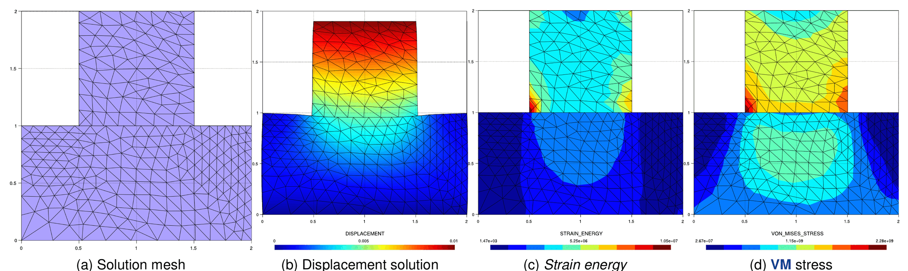</p>
<p align="center"><em>Figure: punch test after the first remeshing ($$t = 1.0$$ s) — von Mises stress and contact-stress Hessian (thesis Fig. 6.23).</em></p>

**SPR error on the punch test (§6.8.3.2).** The same problem with the SPR estimator: the error is concentrated at the contact boundary on the first mesh, and after remeshing it is equidistributed (Figs. 6.29–6.31); the displacement converges faster than the recovered quantities.

<p align="center">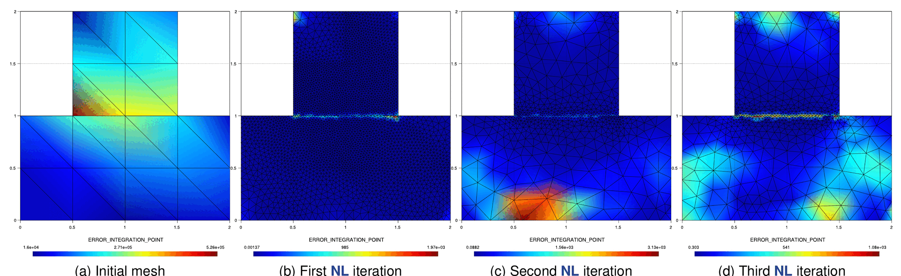</p>
<p align="center"><em>Figure: estimated error of the punch test before and after the SPR-driven remeshing (thesis Fig. 6.30).</em></p>

**Hertz problem, Hessian of the contact pressure and von Mises stress (§6.10.3).** A Hertz problem with a large top pressure $$q = 10^7\,t$$ Pa (upper domain $$E = 2\times10^8$$ Pa, $$\nu = 0.35$$; lower domain $$E = 2\times10^{11}$$ Pa, $$\nu = 0.29$$; thesis Table 6.3), 10 steps of $$\Delta t = 0.1$$ s, remeshed every 3 steps from the 4th. The very coarse first mesh already predicts where refinement is needed (the contact interface and the loaded face); the mesh of step 7 is almost identical to that of step 10, showing that the metric has converged.

<p align="center">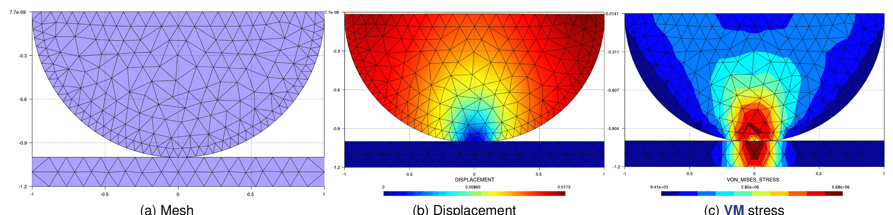</p>
<p align="center"><em>Figure: Hertz problem with Hessian remeshing, step 1 — mesh, displacement, von Mises stress (thesis Fig. 6.38).</em></p>

<p align="center">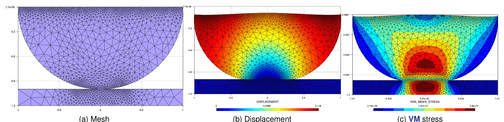</p>
<p align="center"><em>Figure: the same problem at step 10, after three remeshings (thesis Fig. 6.41).</em></p>

**Hertz problem, SPR error (§6.10.4).** Same problem with the SPR metric: the error is concentrated on the contact boundary at the first step and becomes uniform on the sphere afterwards, so the elements become more uniform and larger than with the Hessian metric (Figs. 6.42–6.45).

**Contacting cylinders with adaptive remeshing (§6.10.5).** Two crossed cylinders (the use case of [Applications gallery](Applications_Gallery.html)) with the Hessian metric in 3D: the mesh follows the moving contact patch during the sliding (Figs. 6.46–6.54).

<p align="center">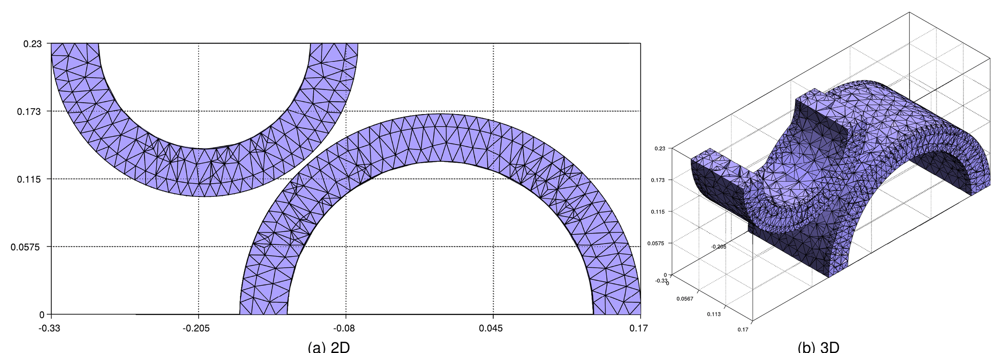</p>
<p align="center"><em>Figure: initial mesh of the contacting cylinders (thesis Fig. 6.46).</em></p>

<p align="center">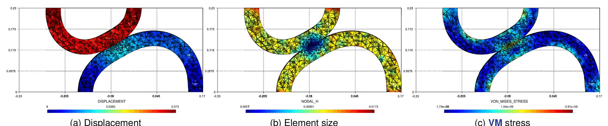</p>
<p align="center"><em>Figure: contacting cylinders at $$t = 0.35$$ s — displacement, element size and von Mises stress (thesis Fig. 6.47).</em></p>

<p align="center">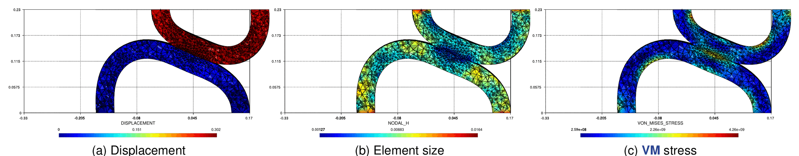</p>
<p align="center">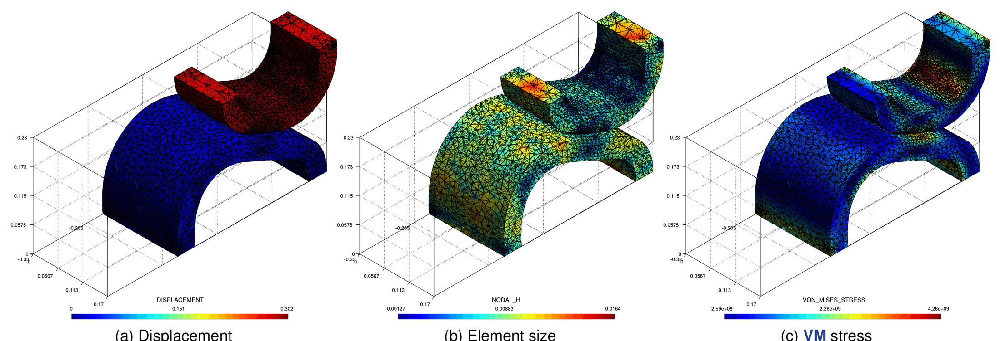</p>
<p align="center"><em>Figure: contacting cylinders at $$t = 1.4$$ s, front and perspective views (thesis Figs. 6.53–6.54).</em></p>

The published Examples of these remeshing cases (`mmg_remeshing_examples/use_cases/contact_*`) have been removed from the Examples repository; the repository test `ALMThreeDSimplestPatchMatchingAdaptativeTestContact` (nightly, gated on the `MeshingApplication`) is the closest executable case.

## Related pages

- [Gap computation](../Contact_Search/Gap_Computation.html) (the consistent gap used by the level-set metric), [Mortar integration and dual Lagrange multipliers](../Theory/Mortar_Integration_And_Dual_Lagrange_Multipliers.html) (the mortar mapper used to transfer the contact pressure).
- The general remeshing machinery (metrics, MMG process, internal-variable interpolation) is documented with the `MeshingApplication`: [MMG process](../../Meshing_Application/General/Utilities-MMG-Process.html).

*Thesis figures © Vicente Mataix Ferrándiz, PhD thesis "Innovative mathematical and numerical models for studying the deformation of shells during industrial forming processes with the Finite Element Method", UPC 2020, reproduced by the author. Figures marked "inspired by" are the author's redrawings of the cited sources.*
