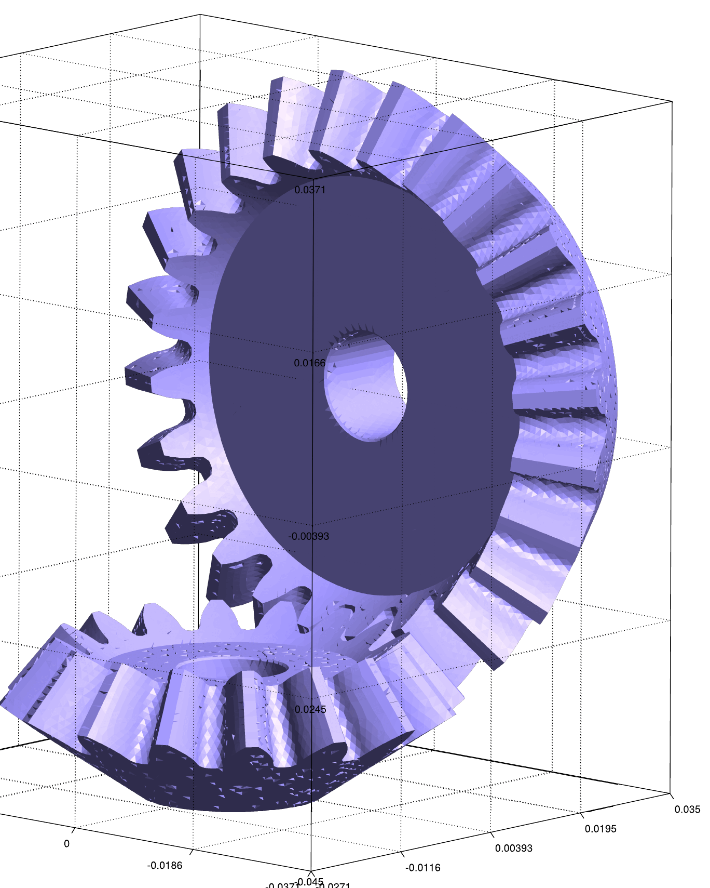
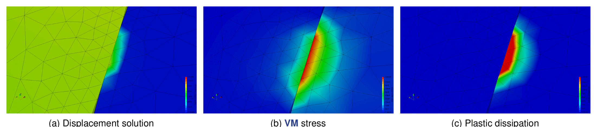
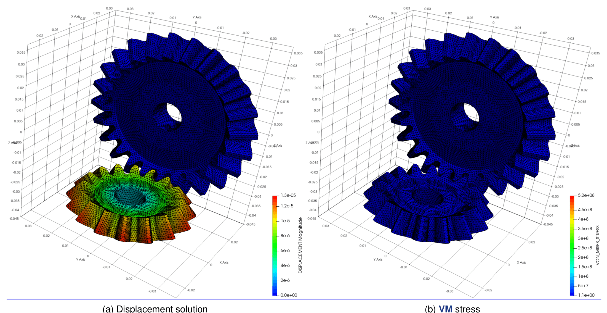
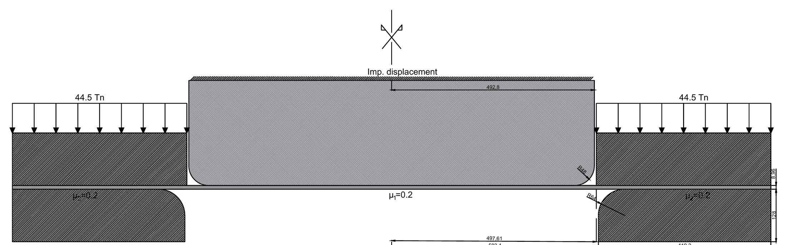
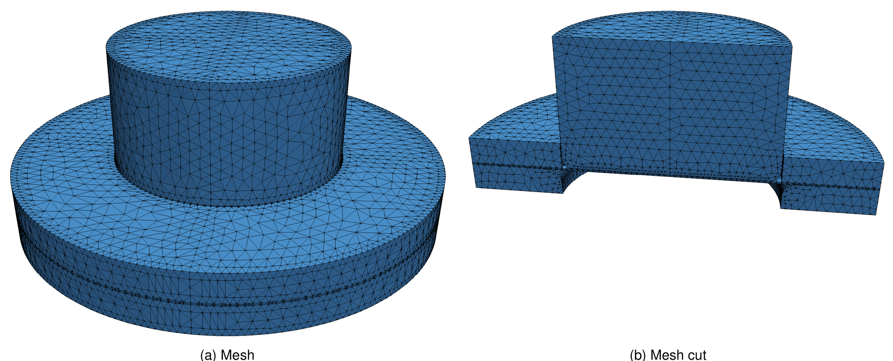
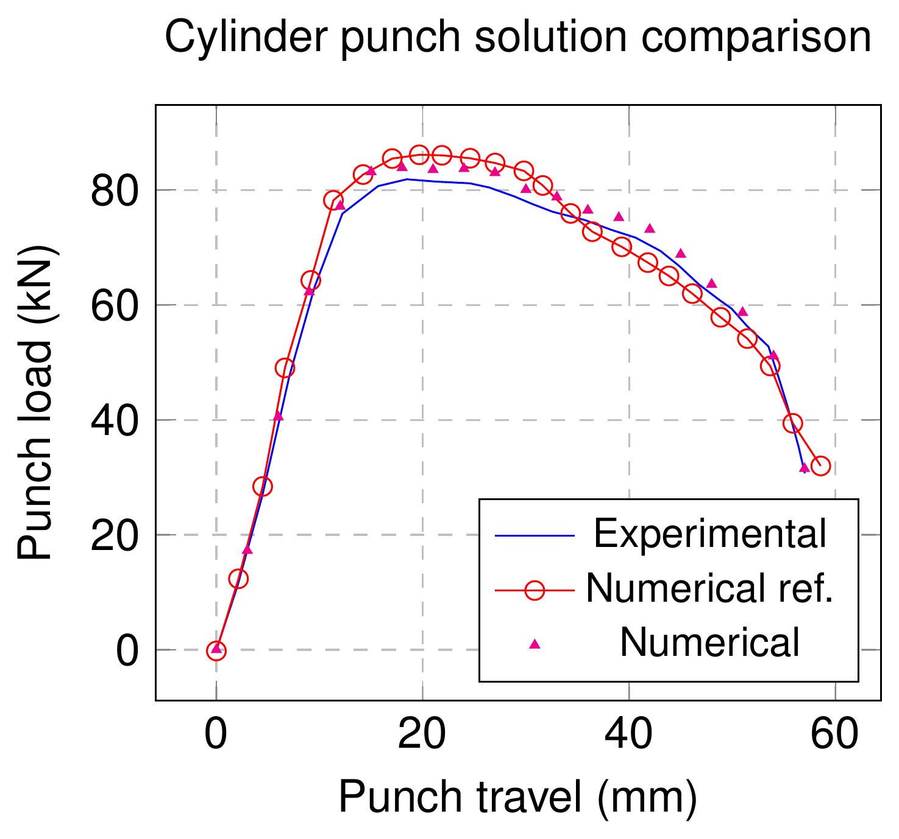
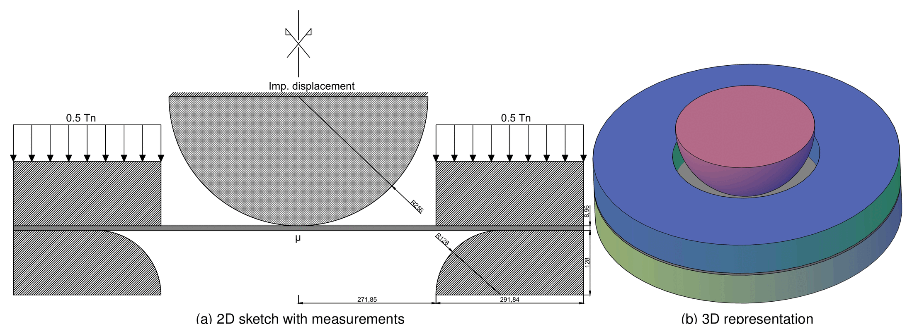
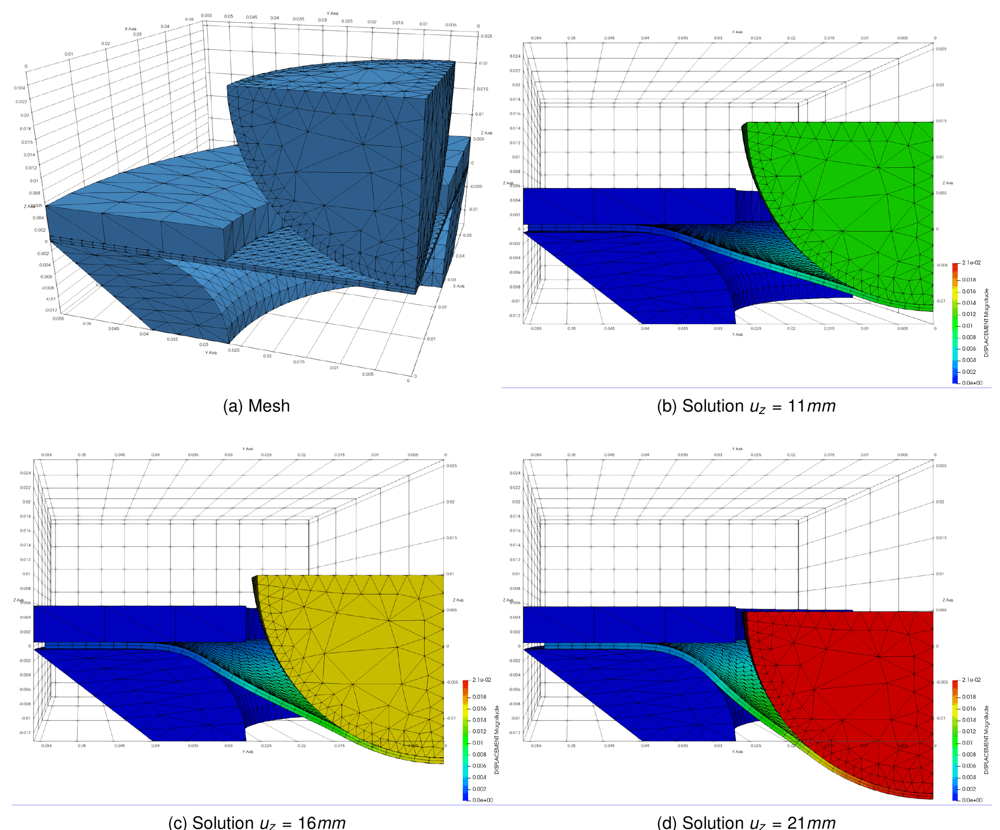
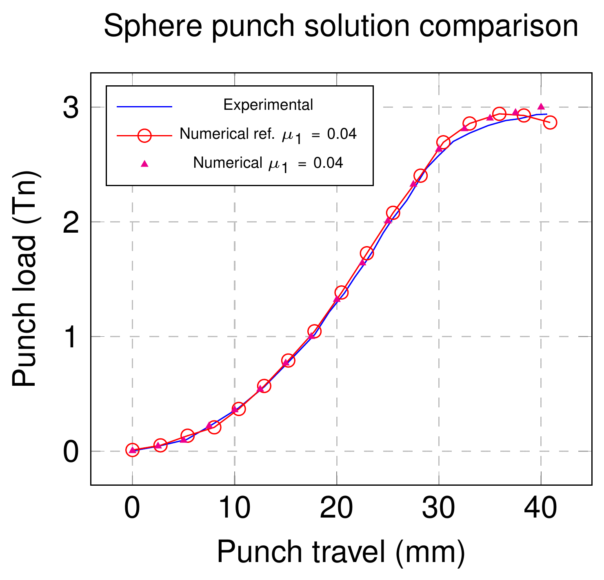

> **Sources.** The [`contact_structural_mechanics`](https://github.com/KratosMultiphysics/Examples/tree/master/contact_structural_mechanics) folder of the Examples repository (`validation/` and `use_cases/`, each with a `README.md`, a `source/` folder with the input files and a `data/` folder with the results); thesis §5.6.4 (gears with plasticity, Figs. 5.11–5.13, Table 5.3) and Chapter 7 (stamping application cases, Figs. 7.1–7.6). The individual example pages listed in the sidebar of this section are downloaded from the Examples repository at build time.

## Published examples (Examples repository)

Every example ships a complete `ProjectParameters.json` + `StructuralMaterials.json` + `.mdpa` set that can be run with the standard `MainKratos.py` of the [tutorial](../Usage/Tutorial_Hertz_2D.html). The table gives the formulation and the feature each case exercises; the thesis section in which the same case is discussed links to [Benchmarks](../Validation/Benchmarks.html).

### Validation cases

| Example | Formulation | Exercises | Thesis |
|---|---|---|---|
| [Double arch](https://github.com/KratosMultiphysics/Examples/tree/master/contact_structural_mechanics/validation/double_arch) | ALM frictionless and frictional, 2D | two curved bodies with large relative sliding and changing active set; frictional version with $$\mu = 0.5$$; reference solution from the literature | §4.5.7 |
| [Hertz](https://github.com/KratosMultiphysics/Examples/tree/master/contact_structural_mechanics/validation/hertz) | ALM frictionless, 2D and 3D | pressure distribution against the analytical Hertz solution for several meshes (`hertz1`–`hertz4`) | §4.5.4 |
| [Full Hertz](https://github.com/KratosMultiphysics/Examples/tree/master/contact_structural_mechanics/validation/hertz_full) | ALM frictionless, 3D | complete 3D sphere–plane problem with reference values of $$a$$ and $$p_{max}$$ | §4.5.4.2 |
| [Shallow ironing 3D](https://github.com/KratosMultiphysics/Examples/tree/master/contact_structural_mechanics/validation/shallow_ironing_3D) | ALM frictionless and frictional, 3D | large sliding of a die over a soft block; frictional variant and a "literature" parameter set | §4.5.12 |
| [Press fit](https://github.com/KratosMultiphysics/Examples/tree/master/contact_structural_mechanics/validation/press_fit) | ALM frictional, 2D and 3D | interference fit with non-homogeneous boundary conditions; horizontal reaction compared with the reference | §4.5.11 |

<em>Double arch benchmark, frictionless (left) and frictional (centre); 2D press fit (right). Animations from the Examples repository.</em>

<em>3D press fit, shallow ironing and the Hertz benchmark.</em>

### Use cases

| Example | Formulation | Exercises | Thesis |
|---|---|---|---|
| [Contacting cylinders](https://github.com/KratosMultiphysics/Examples/tree/master/contact_structural_mechanics/use_cases/cylinders) | ALM frictionless and frictional, 3D | two crossed cylinders with horizontal and vertical relative movement; reaction histories | §4.5.10 |
| [Ironing with die 3D](https://github.com/KratosMultiphysics/Examples/tree/master/contact_structural_mechanics/use_cases/ironing_with_die_3D) | ALM frictionless, 3D | a curved die dragged over a block: large sliding with a moving active set | §4.5.12 |
| [Cylinder in ring](https://github.com/KratosMultiphysics/Examples/tree/master/contact_structural_mechanics/use_cases/in_ring) | ALM frictionless, 2D, dynamic | energy conservation test: a cylinder bouncing inside a ring (implicit dynamics, `compute_dynamic_factor`) | §4.5.6 |
| [Hyperelastic tubes](https://github.com/KratosMultiphysics/Examples/tree/master/contact_structural_mechanics/use_cases/hyperelastic_tubes) | ALM frictionless, 3D | two half-cylinders of hyperelastic material pressed together: large deformations and large contact area | §4.5.9 |
| [Tooth model](https://github.com/KratosMultiphysics/Examples/tree/master/contact_structural_mechanics/use_cases/tooth_model) | ALM frictionless, 3D | dental composite restoration with enamel and dentine layers; two material set-ups | §4.5.5 |
| [Arc pressing block](https://github.com/KratosMultiphysics/Examples/tree/master/contact_structural_mechanics/use_cases/arc_block) | ALM frictionless, 2D | curved body pressed on a block for three stiffness ratios (deformable, rigid arc, rigid block) | §4.5.8 |
| [Gears](https://github.com/KratosMultiphysics/Examples/tree/master/contact_structural_mechanics/use_cases/gears) | ALM frictionless, 3D, plasticity | meshing gears with a J2 elasto-plastic constitutive law (and a linear-elastic variant) | §5.6.4 |
| [Self-contact](https://github.com/KratosMultiphysics/Examples/tree/master/contact_structural_mechanics/use_cases/self_contact) | ALM frictionless, 3D | S-shaped solid folding onto itself, automatic master/slave assignment | §4.4.5.3.3 |

<em>Cylinder in ring (energy conservation), hyperelastic tubes and self-contact.</em>

<em>Contacting cylinders (frictional horizontal movement), ironing with a die, arc pressing a deformable block.</em>

<em>Gears with plasticity (von Mises stress and plastic dissipation) and the tooth model (von Mises stress).</em>

> The contact examples with adaptive remeshing that used to live in `mmg_remeshing_examples/use_cases/` (contact SPR, contact Hessian, Hertz Hessian, contacting cylinders) are no longer present in the Examples repository; they are described from the thesis in [Adaptive remeshing](Adaptive_Remeshing.html).

## Gears with plasticity (thesis §5.6.4)

The thesis combines the contact formulation with the finite-strain J2 elasto-plastic model of its Chapter 5 on a pair of meshing gears: the larger gear is fixed and a rotation is imposed to the smaller one (thesis eq. 5.26), so that the teeth come into contact. The contact region is very small compared with the geometry, so the overall displacement and stress fields barely change (Fig. 5.13), while the detail of the contacting teeth (Fig. 5.12) shows that the larger gear reaches the yield limit and dissipates plastically.

| Parameter (thesis Table 5.3) | Value |
|---|---|
| Young modulus $$E$$ | $$2 \times 10^{11}$$ Pa |
| Poisson ratio $$\nu$$ | 0.29 |
| Yield stress $$\gamma_c$$ | $$525 \times 10^{6}$$ Pa |
| Fracture energy $$G_f$$ | $$1 \times 10^{8}$$ Pa |

The only precaution for contact with a non-linear material is the initial pairing: pairs in tension that are not supposed to touch must not be activated at the first step (see `active_check_factor` and `predict_correct_lagrange_multiplier` in [Contact process settings](../Usage/Contact_Process_Settings_Reference.html)). Both the plastic and the linear-elastic set-ups are published in the [gears](https://github.com/KratosMultiphysics/Examples/tree/master/contact_structural_mechanics/use_cases/gears) use case.

<em>Figure: mesh of the gears example (thesis Fig. 5.11).</em>

<em>Figure: detail of the contacting teeth — displacement, von Mises stress and plastic dissipation (thesis Fig. 5.12).</em>

<em>Figure: overall displacement and von Mises stress (thesis Fig. 5.13).</em>

## Stamping application cases (thesis Chapter 7)

The final chapter of the thesis integrates all its developments — solid-shell elements, frictional mortar contact, finite-strain plasticity and adaptive remeshing — on two sheet-forming benchmarks taken from Oñate and Zienkiewicz (1983), originally solved with an axisymmetric viscous shell formulation and here computed as full 3D J2 elasto-plastic simulations. Both use the frictional ALM formulation with several contact interfaces (punch–sheet, sheet–die, sheet–blank holder).

### Cylinder punch

A cylindrical punch, a blank holder, a die and a sheet of 8.96 mm thickness (dimensions converted from the Imperial units of the original work); the friction coefficient is $$\mu = 0.2$$ on every interface. The full geometry is meshed (no symmetry simplification). The punch load–travel curve does not coincide with the experiment but is closer to it than the reference numerical solution (Fig. 7.3).

<em>Figure: geometry of the cylinder punch case (thesis Fig. 7.1).</em>

<em>Figure: mesh of the cylinder punch case and cut (thesis Fig. 7.2).</em>

<em>Figure: punch load against punch travel — experiment, reference numerical solution and the present simulation (thesis Fig. 7.3).</em>

### Spherical punch

A spherical punch with its die and blank holder; the original work studies three friction coefficients between sheet and punch ($$\mu_1 = 0.04$$, 0.2, 0.5) and the thesis retains $$\mu_1 = \mu_2 = 0.04$$, the case that best matched the experiment. A quarter of the geometry is meshed. The load–travel curve is closer to the experiment than the reference at most points, with a larger difference in the last steps (Fig. 7.6).

<em>Figure: geometry of the spherical punch case, 2D sketch and 3D representation (thesis Fig. 7.4).</em>

<em>Figure: quarter mesh and solution at punch travels of 11, 16 and 21 mm (thesis Fig. 7.5).</em>

<em>Figure: punch load against punch travel for $$\mu = 0.04$$ (thesis Fig. 7.6).</em>

These cases are not part of the Examples repository; the closest published set-ups are the shallow ironing and the ironing-with-die cases.

*Thesis figures © Vicente Mataix Ferrándiz, PhD thesis "Innovative mathematical and numerical models for studying the deformation of shells during industrial forming processes with the Finite Element Method", UPC 2020, reproduced by the author. Figures marked "inspired by" are the author's redrawings of the cited sources.*
