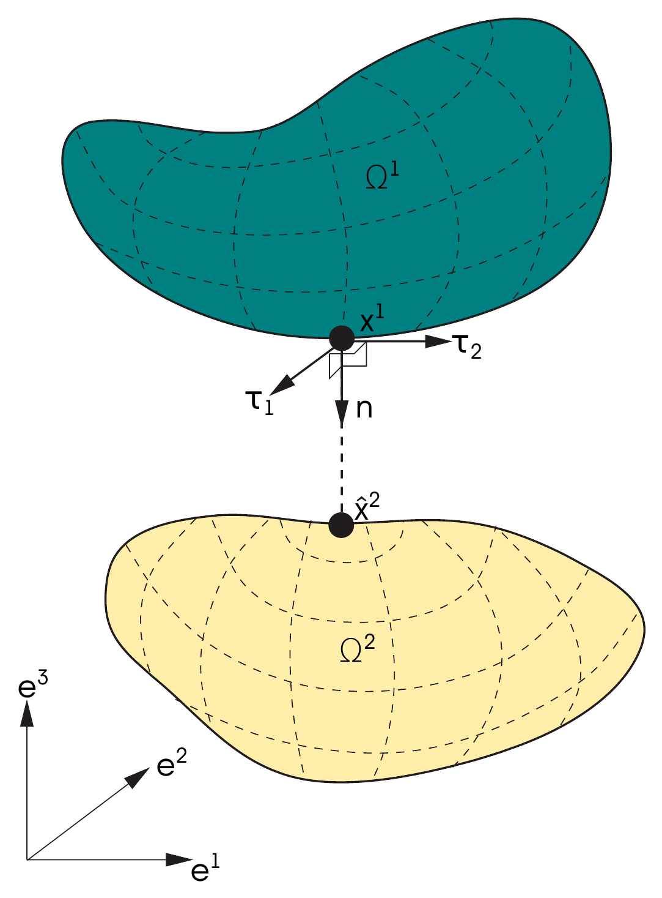
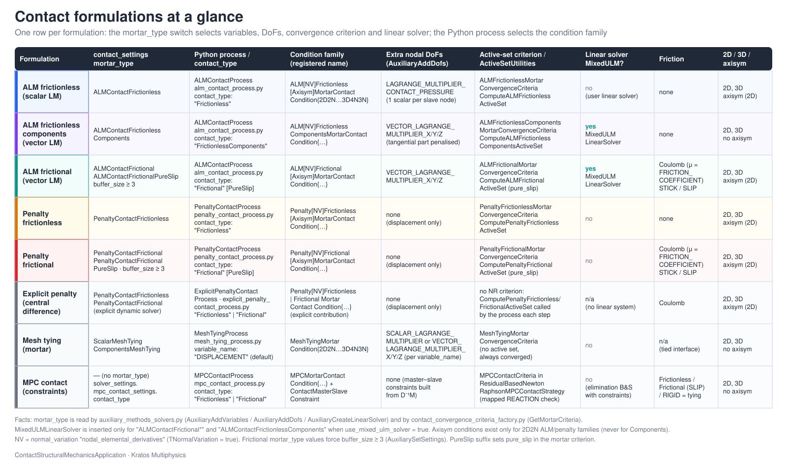
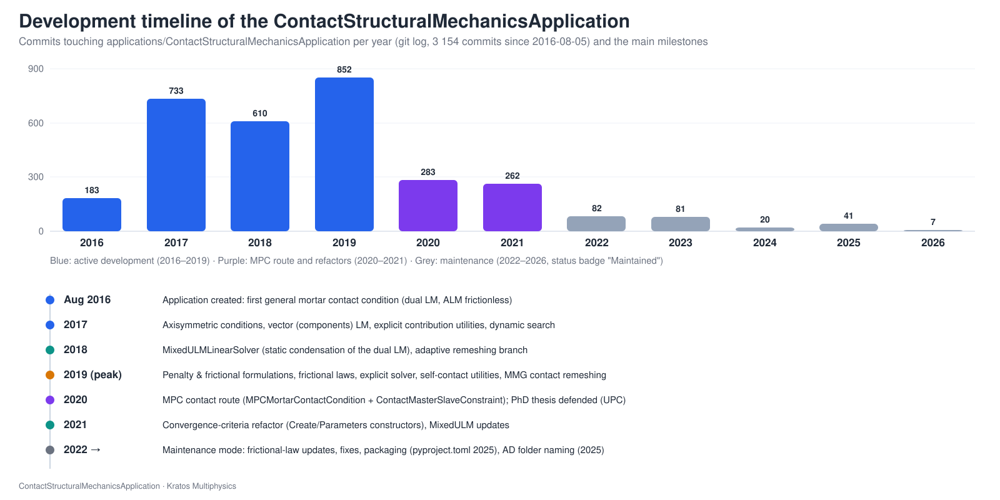
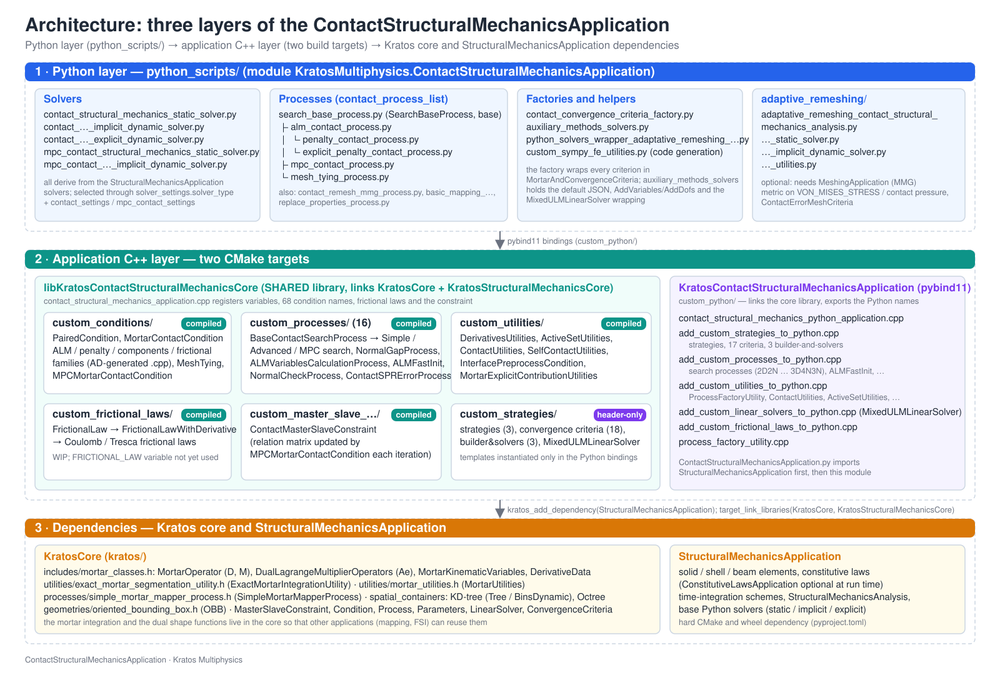

The **ContactStructuralMechanicsApplication** (CSMA) adds computational contact mechanics to the [StructuralMechanicsApplication](../../Structural_Mechanics_Application/General/Overview.html) of Kratos Multiphysics. It implements **segment-to-segment (mortar) contact with dual Lagrange multipliers**, enforced either with an **augmented Lagrangian method (ALM)**, a **penalty method** or **multipoint constraints (MPC)**, for **frictionless and frictional** (Coulomb) problems in **2D, 3D and axisymmetric** settings, plus **mortar mesh tying** of non-conforming meshes. Everything needed to run a contact simulation is included: the contact conditions (with consistently linearised, automatically generated tangent matrices), the contact search (bounding-volume trees, oriented bounding boxes, self-contact detection), the semi-smooth Newton strategies and active-set convergence criteria, a dedicated mixed displacement/Lagrange-multiplier linear solver, and the Python processes and solvers that drive them from a standard `ProjectParameters.json`.

<p align="center">
 
 
 
 
 
 
</p>
<p align="center"><em>Examples from the <a href="https://github.com/KratosMultiphysics/Examples/tree/master/contact_structural_mechanics">KratosMultiphysics/Examples</a> repository: double arch (frictionless and frictional), cylinder in a ring, hyperelastic tubes, contacting cylinders with adaptive remeshing, self-contact.</em></p>

## The contact problem in one paragraph

Two (or more) deformable bodies $$\Omega^1$$ and $$\Omega^2$$ may come into contact along a priori unknown portions of their boundaries $$\Gamma_c^1$$ (the **slave** side) and $$\Gamma_c^2$$ (the **master** side). Contact adds three sources of non-linearity to the structural problem: the constraints are **inequalities** (Hertz–Signorini–Moreau conditions: no penetration, compressive pressure, complementarity), the **active set** of nodes in contact is unknown, and, with friction, the **stick/slip state** of each active node is unknown too. The application discretises the interface with the **mortar method** (integrals of the constraints over the slave surface, weighted by **dual shape functions** so that the coupling matrix $$\mathbf{D}$$ is diagonal), enforces the constraints with an augmented Lagrangian or a penalty functional, and solves the resulting non-smooth problem with a **semi-smooth Newton–Raphson** scheme in which the active set is updated inside the Newton loop through a non-linear complementarity (NCP) function.

<p align="center"></p>
<p align="center"><em>Figure: Basic definition of the contact problem (thesis Fig. 4.3). The slave point $$\mathbf{x}^1$$ is projected along the normal $$\mathbf{n}$$ onto the master surface, $$\hat{\mathbf{x}}^2$$; the gap is measured along $$\mathbf{n}$$ and the tangential slip in the local frame $$(\boldsymbol{\tau}_1,\boldsymbol{\tau}_2)$$.</em></p>

## Formulations at a glance

<p align="center"></p>

| Formulation | `mortar_type` (solver) | Python process / `contact_type` | Condition family | Extra nodal DoFs | Friction | Notes |
|---|---|---|---|---|---|---|
| ALM, scalar Lagrange multiplier | `ALMContactFrictionless` | `alm_contact_process` / `Frictionless` | `ALMFrictionless…MortarContactCondition` | `LAGRANGE_MULTIPLIER_CONTACT_PRESSURE` (1 per slave node) | no | Default choice for frictionless contact; axisymmetric variant available |
| ALM, vector ("components") multiplier | `ALMContactFrictionlessComponents` | `alm_contact_process` / `FrictionlessComponents` | `ALMFrictionlessComponents…` | `VECTOR_LAGRANGE_MULTIPLIER` (dim per slave node) | no | Tangential multiplier penalised to zero; system can be statically condensed (`MixedULMLinearSolver`) |
| ALM frictional (Coulomb) | `ALMContactFrictional` (`…PureSlip`) | `alm_contact_process` / `Frictional` (`FrictionalPureSlip`) | `ALMFrictional…` | `VECTOR_LAGRANGE_MULTIPLIER` | Coulomb | Stick/slip active set, objective slip increment, `MixedULMLinearSolver`, buffer size 3 |
| Penalty frictionless | `PenaltyContactFrictionless` | `penalty_contact_process` / `Frictionless` | `PenaltyFrictionless…` | none | no | Displacement-only; exactness depends on the penalty |
| Penalty frictional | `PenaltyContactFrictional` | `penalty_contact_process` / `Frictional` | `PenaltyFrictional…` | none | Coulomb | Displacement-only |
| Explicit penalty | `PenaltyContactFrictionless` / `…Frictional` | `explicit_penalty_contact_process` | penalty families | none | optional | For the explicit central-difference solver; octree search by default |
| MPC contact (simplified NTN/NTS) | – (uses `mpc_contact_settings`) | `mpc_contact_process` / `Frictionless`, `Frictional` | `MPCMortarContactCondition` + `ContactMasterSlaveConstraint` | none (constraints) | Coulomb | Mortar weights build master–slave constraints; tension check releases nodes |
| Mortar mesh tying | `ScalarMeshTying` / `ComponentsMeshTying` | `mesh_tying_process` | `MeshTyingMortarCondition` | `SCALAR_LAGRANGE_MULTIPLIER` / `VECTOR_LAGRANGE_MULTIPLIER` | – | Ties any nodal variable across non-matching meshes; MPC tying with tension check also available |

### Capability matrix

| Capability | Status |
|---|---|
| Dimensions | 2D (`Line2D2` pairs), 3D (`Triangle3D3`, `Quadrilateral3D4` and mixed triangle/quadrilateral pairs), axisymmetric 2D (ALM and penalty, non-components) |
| Kinematics | Finite deformations and large sliding (mortar segmentation and gap recomputed every iteration; optional consistent linearisation of the normals, `normal_variation`) |
| Search | KD-tree in radius / in box, optionally with oriented bounding boxes (OBB, separating axis theorem), octree with OBB, k-DOP; dynamic (velocity-predicted) search; self-contact pairing |
| Enforcement | Augmented Lagrangian (scalar or vector multiplier), penalty (implicit and explicit), multipoint constraints, adapted augmented Lagrangian (automatic penalty update) |
| Friction | Coulomb (frictional laws Coulomb/Tresca as WIP classes), pure-slip mode |
| Solvers | Static, implicit dynamic (Newmark/Bossak), explicit dynamic; Newton–Raphson, line search and arc-length strategies with contact-aware predictors; adaptive time-step splitting |
| Linear algebra | Block or elimination builder-and-solver with contact-aware DoF handling; `MixedULMLinearSolver` condensing the dual Lagrange multipliers |
| Adaptive remeshing | Level-set, Hessian and SPR-error metrics for contact problems through the MeshingApplication (MMG) |
| Parallelism | Shared memory (OpenMP); MPI is not supported |
| Element types on the interface | Linear line, linear triangle, bilinear quadrilateral (no higher-order geometries) |

## Where the theory comes from

The formulation, the search algorithms and the benchmarks are documented in Chapter 4 ("Contact mechanics") and Appendices A, C, D and E of the PhD thesis of the application's author:

> V. Mataix Ferrándiz, *Innovative mathematical and numerical models for studying the deformation of shells during industrial forming processes with the Finite Element Method*, PhD thesis, Universitat Politècnica de Catalunya (UPC), Barcelona, 2020. [UPCommons PDF](https://upcommons.upc.edu/bitstream/2117/328952/1/TVMF1de1.pdf).

The theory pages of this documentation reproduce the relevant derivations, figures, algorithms and tables of the thesis and map every concept to the code. The mortar/dual-Lagrange-multiplier machinery follows A. Popp's work (TU München, 2012) and the augmented Lagrangian treatment follows Alart–Curnier and Cavalieri–Cardona; see the [Bibliography](../Reference/Bibliography.html).

## A short history

<p align="center"></p>

The application was created in August 2016 as a container for a general mortar contact condition, grew through 2017–2019 with the dual-mortar ALM frictionless formulation and its automatic-differentiation code generation, the penalty and frictional formulations, frictional laws, self-contact detection, the explicit solver and contact-driven adaptive remeshing, added the MPC-based formulation in 2020 (the year the thesis was defended), refactored all convergence criteria in 2021, and has been in maintenance mode since 2022 (about 3 150 commits in total).

## Architecture in one picture

<p align="center"></p>

A contact simulation is a normal `StructuralMechanicsAnalysis`: the presence of `contact_settings` (or `mpc_contact_settings`) in `solver_settings` makes the structural solver wrapper pick the contact solvers of this application; the contact process listed under `processes` builds the interface model parts, runs the contact search and creates the mortar conditions; the contact strategy, builder-and-solver, convergence criteria and (optionally) the mixed linear solver do the rest. See [Architecture](../Implementation/Architecture.html).

## Documentation map

| Section | Pages |
|---|---|
| **General** | [Overview](Overview.html) (this page), [Getting started](Getting_Started.html) |
| **Theory** | [Contact problem and state of the art](../Theory/Contact_Problem_And_State_Of_The_Art.html), [Constrained optimisation methods](../Theory/Constrained_Optimisation_Methods.html), [Frictionless contact](../Theory/Frictionless_Contact.html), [Frictional contact](../Theory/Frictional_Contact.html), [Mortar integration and dual Lagrange multipliers](../Theory/Mortar_Integration_And_Dual_Lagrange_Multipliers.html), [Mesh tying](../Theory/Mesh_Tying.html), [Linearisation and derivatives](../Theory/Linearisation_And_Derivatives.html), [Automatic differentiation](../Theory/Automatic_Differentiation.html) |
| **Contact search** | [Search pipeline and bounding volumes](../Contact_Search/Search_Pipeline_And_Bounding_Volumes.html), [Gap computation](../Contact_Search/Gap_Computation.html), [Self contact](../Contact_Search/Self_Contact.html) |
| **Implementation** | [Architecture](../Implementation/Architecture.html), [Conditions](../Implementation/Conditions.html), [Strategies and convergence criteria](../Implementation/Strategies_And_Convergence_Criteria.html), [Builder and solvers and linear solvers](../Implementation/Builder_And_Solvers_And_Linear_Solvers.html), [Processes](../Implementation/Processes.html), [Utilities](../Implementation/Utilities.html), [Frictional laws and MPC constraint](../Implementation/Frictional_Laws_And_MPC_Constraint.html), [Variables and flags reference](../Implementation/Variables_And_Flags_Reference.html) |
| **Usage** | [Solver settings reference](../Usage/Solver_Settings_Reference.html), [Contact process settings reference](../Usage/Contact_Process_Settings_Reference.html), [Tutorial: 2D Hertz contact](../Usage/Tutorial_Hertz_2D.html), [Output and post-processing](../Usage/Output_And_Postprocessing.html), [Tips, troubleshooting and limitations](../Usage/Tips_Troubleshooting_And_Limitations.html) |
| **Validation** | [Benchmarks](../Validation/Benchmarks.html), [Test suite reference](../Validation/Test_Suite_Reference.html) |
| **Examples** | [Applications gallery](../Examples/Applications_Gallery.html), [Adaptive remeshing](../Examples/Adaptive_Remeshing.html), plus the example pages imported from the Examples repository |
| **Reference** | [Bibliography](../Reference/Bibliography.html), [Glossary](../Reference/Glossary.html) |

The source tree also contains a `README.md` in every folder of the application (`custom_conditions`, `custom_strategies`, `custom_processes`, `custom_utilities`, `custom_frictional_laws`, `custom_linear_solvers`, `custom_master_slave_constraints`, `python_scripts`, `tests`, `automatic_differentiation`) that summarises that folder and links back here.

## Status, authors and citation

| | |
|---|---|
| Status | Maintained (no active feature development; bug fixes and API updates) |
| Authors | Vicente Mataix Ferrándiz (formulation, implementation), Alejandro Cornejo Velázquez (maintenance); contributions by Anna Rehr (SPR error estimation) and the Kratos team |
| Licence | BSD (see `license.txt`) |
| Dependencies | `StructuralMechanicsApplication` (mandatory); `ConstitutiveLawsApplication` (some tests), `MeshingApplication` with MMG (adaptive remeshing), `LinearSolversApplication` (AMGCL inner solver) — optional |
| Python package | `KratosContactStructuralMechanicsApplication` (wheel), module `KratosMultiphysics.ContactStructuralMechanicsApplication` |

If you use the application in your work, please cite the thesis above and the Kratos reference:

```bibtex
@phdthesis{MataixFerrandiz2020,
  author = {Mataix Ferr{\'a}ndiz, Vicente},
  title  = {Innovative mathematical and numerical models for studying the deformation of shells during industrial forming processes with the Finite Element Method},
  school = {Universitat Polit{\`e}cnica de Catalunya},
  year   = {2020},
  url    = {https://upcommons.upc.edu/bitstream/2117/328952/1/TVMF1de1.pdf}
}
@article{Dadvand2010,
  author  = {Dadvand, Pooyan and Rossi, Riccardo and O{\~n}ate, Eugenio},
  title   = {An object-oriented environment for developing finite element codes for multi-disciplinary applications},
  journal = {Archives of Computational Methods in Engineering},
  volume  = {17}, number = {3}, pages = {253--297}, year = {2010},
  doi     = {10.1007/s11831-010-9045-2}
}
```

*Thesis figures © Vicente Mataix Ferrándiz, PhD thesis "Innovative mathematical and numerical models for studying the deformation of shells during industrial forming processes with the Finite Element Method", UPC 2020, reproduced by the author. Figures marked "inspired by" are the author's redrawings of the cited sources.*
