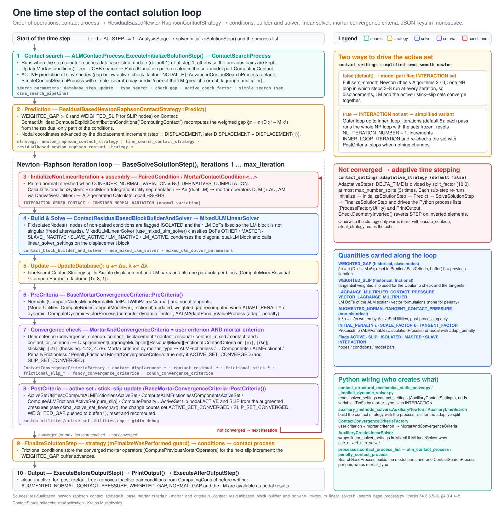

> **Sources.** Thesis App. B.2 (the Kratos framework) and §4.3.3.5 (solution work-flow); code: `CMakeLists.txt`, `pyproject.toml`, `ContactStructuralMechanicsApplication.json`, `contact_structural_mechanics_application.{h,cpp}`, `custom_python/*.cpp`, `python_scripts/search_base_process.py`, `python_scripts/auxiliary_methods_solvers.py`, `python_scripts/contact_structural_mechanics_static_solver.py`, `custom_processes/base_contact_search_process.{h,cpp}`, `custom_strategies/custom_strategies/residualbased_newton_raphson_contact_strategy.h`, `custom_strategies/custom_convergencecriterias/base_mortar_criteria.h`, `custom_utilities/active_set_utilities.cpp`; `git log` of the application folder.

The ContactStructuralMechanicsApplication (CSMA) is a *plug-in* of the [StructuralMechanicsApplication](../../Structural_Mechanics_Application/General/Overview.html): it does not define elements, constitutive laws or an analysis stage of its own. It adds the pieces that turn a structural problem into a contact problem, namely the interface conditions, the search that pairs them, the strategies and convergence criteria that drive the active set, and the Python glue that wires everything from a standard `ProjectParameters.json`. This page explains how these pieces are organised, how they are built, which data they share and in which order they are executed. The classes themselves are documented in the sibling pages: [Conditions](Conditions.html), [Strategies and convergence criteria](Strategies_And_Convergence_Criteria.html), [Builder and solvers and linear solvers](Builder_And_Solvers_And_Linear_Solvers.html), [Processes](Processes.html), [Utilities](Utilities.html), [Frictional laws and MPC constraint](Frictional_Laws_And_MPC_Constraint.html) and the [Variables and flags reference](Variables_And_Flags_Reference.html).

## Three layers

<p align="center"></p>
<p align="center"><em>Figure: the Python layer, the application C++ layer (two CMake targets) and the Kratos core / StructuralMechanicsApplication dependencies.</em></p>

| Layer | Where | What lives there | How it is reached |
|---|---|---|---|
| **Python** | `python_scripts/` (installed as `KratosMultiphysics.ContactStructuralMechanicsApplication`) | Contact solvers derived from the structural solvers (`ContactStaticMechanicalSolver`, `ContactImplicitMechanicalSolver`, `ContactExplicitMechanicalSolver`, `MPCContactStaticSolver`, `MPCContactImplicitMechanicalSolver`), the contact processes (`SearchBaseProcess` and its children `ALMContactProcess`, `PenaltyContactProcess`, `ExplicitPenaltyContactProcess`, `MPCContactProcess`, `MeshTyingProcess`), the convergence-criteria factory, the default-settings helpers (`auxiliary_methods_solvers.py`), the adaptive-remeshing analysis stage and the sympy utilities used for code generation | Selected by the structural solver wrapper when `solver_settings` contains `contact_settings` or `mpc_contact_settings`, and by the `contact_process_list` of `ProjectParameters.json` |
| **Application C++** | `custom_conditions/`, `custom_processes/`, `custom_utilities/`, `custom_frictional_laws/`, `custom_master_slave_constraints/` (compiled) and `custom_strategies/`, `custom_linear_solvers/` (header-only) | Mortar conditions, contact search, active-set and derivative utilities, frictional laws, the MPC constraint, the contact strategies, 18 convergence criteria, 3 builder-and-solvers and the `MixedULMLinearSolver` | Registered in `KratosContactStructuralMechanicsApplication::Register()` and exported to Python by the pybind11 module in `custom_python/` |
| **Kratos core + StructuralMechanicsApplication** | `kratos/` and `applications/StructuralMechanicsApplication/` | `mortar_classes.h` (`MortarOperator`, `DualLagrangeMultiplierOperators`, `MortarKinematicVariables`, `DerivativeData`), `ExactMortarIntegrationUtility`, `MortarUtilities`, `SimpleMortarMapperProcess`, KD-tree / octree spatial containers, `OrientedBoundingBox`, `MasterSlaveConstraint`, `Condition`, `Process`, `Parameters`; the solid/shell elements, constitutive laws, time schemes and `StructuralMechanicsAnalysis` | `kratos_add_dependency(StructuralMechanicsApplication)` and `target_link_libraries(... KratosCore KratosStructuralMechanicsCore)` |

A design decision worth knowing when reading the code: the **mortar machinery itself is not in this application**. The mortar operators $$\mathbf{D}$$ and $$\mathbf{M}$$, the dual shape-function coefficient matrix $$\mathbf{A}_e$$, the exact segmentation of a slave/master pair and the mortar mapper are Kratos-core classes (`kratos/includes/mortar_classes.h`, `kratos/utilities/exact_mortar_segmentation_utility.h`, `kratos/utilities/mortar_utilities.h`, `kratos/processes/simple_mortar_mapper_process.h`), so that the mapping and FSI applications can reuse them. What this application adds on top is the *contact-specific* use of those operators: the weak contact constraints, their consistent linearisation (`custom_utilities/derivatives_utilities.h`), the active-set logic and the search. See [Mortar integration and dual Lagrange multipliers](../Theory/Mortar_Integration_And_Dual_Lagrange_Multipliers.html) for the mathematics.

## Folder-by-folder map

The application root `applications/ContactStructuralMechanicsApplication/` contains the following (all paths relative to it; links point to the page that documents the folder in depth):

| Folder / file | Purpose | Documented in |
|---|---|---|
| `contact_structural_mechanics_application.{h,cpp}` | The `KratosApplication` subclass: builds the 68 condition prototypes (with `Line2D2`, `Triangle3D3` and `Quadrilateral3D4` geometries) in the constructor and registers conditions, the `ContactMasterSlaveConstraint` and all variables in `Register()` | [Conditions](Conditions.html) |
| `contact_structural_mechanics_application_variables.{h,cpp}` | Declaration/creation of the 34 application variables and the `FrictionalCase` and `NormalDerivativesComputation` enums | [Variables and flags reference](Variables_And_Flags_Reference.html) |
| `ContactStructuralMechanicsApplication.py` | Python bootstrap: imports `StructuralMechanicsApplication` first, then `_ImportApplication(KratosContactStructuralMechanicsApplication(), "KratosContactStructuralMechanicsApplication")` | this page |
| `CMakeLists.txt`, `pyproject.toml`, `ContactStructuralMechanicsApplication.json` | Build and packaging (see below) | this page |
| `custom_conditions/` | `PairedCondition`, `MortarContactCondition` and the ALM / penalty / components / frictional / axisymmetric families (the large `.cpp` files are generated), `MeshTyingMortarCondition`, `MPCMortarContactCondition` | [Conditions](Conditions.html) |
| `automatic_differentiation/` | The sympy generators (`generate_*_mortar_condition.py`), the `*_template.cpp` files with the `BEGIN/END AD REPLACEMENT` markers, the LaTeX derivations and per-folder READMEs | [Automatic differentiation](../Theory/Automatic_Differentiation.html) |
| `custom_processes/` | 16 processes: the search hierarchy (`BaseContactSearchProcess` → `SimpleContactSearchProcess` / `AdvancedContactSearchProcess` / `MPCContactSearchProcess`, plus the two dimension-agnostic wrappers), `NormalGapProcess`, `NormalCheckProcess`, `MasterSlaveProcess`, `ALMFastInit`, `ALMVariablesCalculationProcess`, `AALMAdaptPenaltyValueProcess`, `ComputeDynamicFactorProcess`, `AssignParentElementConditionsProcess`, `FindIntersectedGeometricalObjectsWithOBBContactSearchProcess`, `ContactSPRErrorProcess` | [Processes](Processes.html), [Search pipeline and bounding volumes](../Contact_Search/Search_Pipeline_And_Bounding_Volumes.html) |
| `custom_utilities/` | `ContactUtilities`, `ActiveSetUtilities`, `SelfContactUtilities`, `DerivativesUtilities`, `MortarExplicitContributionUtilities`, `InterfacePreprocessCondition`, `logging_settings.hpp` | [Utilities](Utilities.html) |
| `custom_strategies/custom_strategies/` | `ResidualBasedNewtonRaphsonContactStrategy`, `LineSearchContactStrategy`, `ResidualBasedNewtonRaphsonMPCContactStrategy` (header-only) | [Strategies and convergence criteria](Strategies_And_Convergence_Criteria.html) |
| `custom_strategies/custom_convergencecriterias/` | `BaseMortarConvergenceCriteria` and its 5 active-set children, `MortarAndConvergenceCriteria`, the displacement / residual / mixed contact criteria (with LM and frictional variants), `ContactErrorMeshCriteria`, `MPCContactCriteria` (header-only) | [Strategies and convergence criteria](Strategies_And_Convergence_Criteria.html) |
| `custom_strategies/custom_builder_and_solvers/` | `ContactResidualBasedBlockBuilderAndSolver`, `ContactResidualBasedEliminationBuilderAndSolver`, `ContactResidualBasedEliminationBuilderAndSolverWithConstraints` (header-only) | [Builder and solvers and linear solvers](Builder_And_Solvers_And_Linear_Solvers.html) |
| `custom_linear_solvers/` | `MixedULMLinearSolver` (header-only) | [Builder and solvers and linear solvers](Builder_And_Solvers_And_Linear_Solvers.html) |
| `custom_frictional_laws/` | `FrictionalLaw` → `FrictionalLawWithDerivative` → `CoulombFrictionalLaw` / `TrescaFrictionalLaw` | [Frictional laws and MPC constraint](Frictional_Laws_And_MPC_Constraint.html) |
| `custom_master_slave_constraints/` | `ContactMasterSlaveConstraint` | [Frictional laws and MPC constraint](Frictional_Laws_And_MPC_Constraint.html) |
| `custom_python/` | pybind11 bindings (one `add_custom_*_to_python.cpp` per category) and `ProcessFactoryUtility` | this page (bindings map) |
| `python_scripts/` | Solvers, processes, factories and helpers; `adaptive_remeshing/` sub-package | [Solver settings reference](../Usage/Solver_Settings_Reference.html), [Contact process settings reference](../Usage/Contact_Process_Settings_Reference.html), [Adaptive remeshing](../Examples/Adaptive_Remeshing.html) |
| `tests/` | `SmallTests.py`, `NightlyTests.py`, `ValidationTests.py`, `contact_structural_mechanics_test_factory.py`, the data folders (`ALM_frictionless_contact_test_2D`, …, `mesh_tying_test`, `mpc_contact_tests`, `penalty_*`) and `cpp_tests/` (gtests for conditions, linear solvers, processes and utilities) | [Test suite reference](../Validation/Test_Suite_Reference.html) |
| `documents/doxyfile` | Doxygen configuration (`PROJECT_NAME = "KratosMultiphysics - Contact Mechanics"`) | – |
| `README.md`, `license.txt` | Overview and BSD licence | [Overview](../General/Overview.html) |

## Build layout

The `CMakeLists.txt` defines **two targets**:

1. `KratosContactStructuralMechanicsCore` — a `SHARED` library built from a `GLOB_RECURSE` of `contact_structural_mechanics_application.cpp`, `contact_structural_mechanics_application_variables.cpp`, `custom_utilities/*.cpp`, `custom_frictional_laws/*.cpp`, `custom_processes/*.cpp`, `custom_conditions/*.cpp` and `custom_master_slave_constraints/*.cpp`. It links `PUBLIC KratosCore KratosStructuralMechanicsCore` and is compiled with `CONTACT_STRUCTURAL_MECHANICS_APPLICATION=EXPORT,API` (the `KRATOS_API(CONTACT_STRUCTURAL_MECHANICS_APPLICATION)` macro on every exported class).
2. `KratosContactStructuralMechanicsApplication` — the pybind11 module (`pybind11_add_module(... MODULE THIN_LTO ...)`) built from `custom_python/*.cpp`, linked `PRIVATE` against the core library, with an empty prefix and the `.pyd` / `.so` suffix fix-ups for Windows and macOS.

Consequences of this split:

- **Strategies, convergence criteria, builder-and-solvers and the linear solver are header-only templates** (`custom_strategies/**`, `custom_linear_solvers/`). There is no `.cpp` for them and they are not in the core library glob; their only instantiations are the ones requested by `add_custom_strategies_to_python.cpp` and `add_custom_linear_solvers_to_python.cpp` for the `UblasSpace` sparse/local space pair. A C++ user of these classes includes the header directly.
- **Conditions, processes, utilities, frictional laws and the constraint are compiled** into the core library, with explicit `template class` instantiations at the bottom of each `.cpp` for the geometry pairs `<2,2>`, `<3,3>`, `<3,4>`, `<3,3,4>` and `<3,4,3>` (times the `FrictionalCase` and normal-variation combinations for the conditions).
- **Unity build exclusion.** When `CMAKE_UNITY_BUILD` is on, `custom_utilities/interface_preprocess.cpp` and *every* `custom_conditions/*.cpp` are given `SKIP_UNITY_BUILD_INCLUSION TRUE` (the batch size is `KRATOS_UNITY_BUILD_BATCH_SIZE`). The generated frictional condition alone is about 170 000 lines, so concatenating it with other translation units would explode compile memory; `interface_preprocess.cpp` is excluded because of a conflict of explicit instantiations.
- **Tests.** With `KRATOS_BUILD_TESTING=ON`, `tests/cpp_tests/*.cpp` are added through `kratos_add_gtests(TARGET KratosContactStructuralMechanicsCore ...)`. With `INSTALL_TESTING_FILES=ON` the whole `tests/` folder is installed under `applications/ContactStructuralMechanicsApplication/` excluding `*.c`, `*.h`, `*.cpp`, `*.hpp` and `*.git` so that the Python tests find their reference and parameter files. `KRATOS_BUILD_BENCHMARK` would build `benchmarks/*.cpp` against Google Benchmark, but the folder does not currently exist.
- **Python install.** `kratos_python_install` copies `ContactStructuralMechanicsApplication.py` to `KratosMultiphysics/ContactStructuralMechanicsApplication/__init__.py` and `kratos_python_install_directory` installs `python_scripts/` as the package body (both honour `INSTALL_PYTHON_USING_LINKS`). The targets are appended to `KRATOS_KERNEL` and `KRATOS_PYTHON_INTERFACE` in the parent scope.

### Wheel packaging

`pyproject.toml` (hatchling backend) declares the wheel `KratosContactStructuralMechanicsApplication`, `requires-python = ">=3.8"`, the dependencies `KratosMultiphysics=={env:KRATOS_VERSION}` and `KratosStructuralMechanicsApplication=={env:KRATOS_VERSION}`, and the binaries to ship in `[kratos] libs` (`KratosContactStructuralMechanicsApplication.*`, `KratosContactStructuralMechanicsCore.*`, `libKratosContactStructuralMechanicsCore.*`). The legacy `ContactStructuralMechanicsApplication.json` carries the same information for the older wheel scripts (`excluded_binaries` explicitly leaves `libKratosStructuralMechanicsCore.*` to the structural wheel). Neither the `ConstitutiveLawsApplication` (needed by some tests) nor the `MeshingApplication` (needed for adaptive remeshing, guarded at run time with `kratos_utilities.CheckIfApplicationsAvailable("MeshingApplication")`) is a build or wheel dependency.

## Data model: model parts, properties and flags

A contact simulation manipulates the same `ModelPart` as the structural problem; the application adds sub-model-parts, non-historical values and flags to it. Everything is created by `SearchBaseProcess` (Python) and `BaseContactSearchProcess` (C++).

### Sub-model-parts

| Name | Created by | Contents |
|---|---|---|
| `Contact` | `SearchBaseProcess.ExecuteInitialize` (`main_model_part.CreateSubModelPart("Contact")`, `search_base_process.py:124-132`); removed and recreated when the root model part `Is(MODIFIED)` after remeshing | All interface nodes and the *original* skin conditions of every pair. It is what the search, the active-set utilities (`rModelPart.GetSubModelPart("Contact")` in `active_set_utilities.cpp`) and the convergence criteria iterate over. `BaseContactSearchProcess` raises an error if it does not exist |
| `ContactSub<key>` | `SearchBaseProcess.__generate_search_model_part_from_input_list` / `__detect_skin` (`search_base_process.py:662-663, 725-726`) | One per pair `"0"` … `"9"` of the `contact_model_part` dictionary; holds the nodes and conditions of that pair (transferred with `FastTransferBetweenModelPartsProcess`) and its `Properties` (id `100 + key` when `contact_property_ids` is `0`). If the input lists are empty the skin is detected with `SkinDetectionProcess2D/3D` into `ContactSub0` |
| `MasterSubModelPart<id_name>`, `SlaveSubModelPart<id_name>` | `BaseContactSearchProcess::SetOriginDestinationModelParts` (`base_contact_search_process.cpp:237-254`), inside the `ContactSub<key>` of the pair | Nodes and conditions flagged `MASTER` / `SLAVE`; the master part is the *origin* and the slave part the *destination* of the `SimpleMortarMapperProcess` used by `NormalGapProcess` when `check_gap` is `MappingCheck` |
| `ComputingContact` | `BaseContactSearchProcess` constructor (`base_contact_search_process.cpp:78-91`) | The *pair conditions* (`MortarContactCondition` instances) created by the search. This is the model part whose conditions are assembled: `ContactUtilities::ComputeExplicitContributionConditions(rModelPart.GetSubModelPart("ComputingContact"))` computes the gap, the block builder-and-solver checks it exists, and the MPC strategy toggles `INTERACTION` on its conditions |
| `ComputingContactSub<id_name>` | Same constructor | One per pair when `id_name` is not empty (`MULTIPLE_SEARCHS` local flag); the pair conditions of that search |

The pair conditions are created by name: the Python process gives the family stem (for example `ALMFrictionlessMortarContact`) as `condition_name` and the master node count as `final_string` (`"4N"` for a triangle/quadrilateral pair, `""` otherwise), and the C++ search composes `condition_name + "Condition" + TDim + "D" + TNumNodes + "N" + final_string` (`base_contact_search_process.cpp:94-101`) and fetches the prototype from `KratosComponents<Condition>`. The `ContactSearchWrapperProcess` chooses the template instance (`<2,2>`, `<3,3>`, `<3,4>`, `<3,3,4>`, `<3,4,3>`) from `DOMAIN_SIZE` and the node counts of the first `MASTER` and `SLAVE` conditions it finds.

### Properties and ProcessInfo

The processes push their settings into three places, which the conditions and utilities then read:

- **`Properties` of each `ContactSub<key>`**: `INTEGRATION_ORDER_CONTACT`, `CONSIDER_TESSELLATION`, `ACTIVE_CHECK_FACTOR` (`search_base_process.py:177-179, 407-408`), `FRICTION_COEFFICIENT` per pair (`alm_contact_process.py:474`), `TYING_VARIABLE` for mesh tying (`mesh_tying_process.py:216`), and `THICKNESS` for axisymmetric conditions (from the material).
- **`ProcessInfo`**: `ZERO_TOLERANCE_FACTOR`, `ACTIVE_CHECK_FACTOR`, `DISTANCE_THRESHOLD` (search), `CONSIDER_NORMAL_VARIATION`, `ADAPT_PENALTY`, `MAX_GAP_FACTOR`, `OPERATOR_THRESHOLD`, `TANGENT_FACTOR`, `SLIP_AUGMENTATION_COEFFICIENT`, `SLIP_THRESHOLD`, `INITIAL_PENALTY`, `SCALE_FACTOR`, `ACTIVE_SET_CONVERGED` (ALM process, `alm_contact_process.py:373-447`), `REACTION_CHECK_STIFFNESS_FACTOR` (MPC), `MAX_GAP_THRESHOLD` (explicit), and the counters `NL_ITERATION_NUMBER`, `INNER_LOOP_ITERATION` maintained by the strategy.
- **Nodal non-historical values** (`SetValue`): `INITIAL_PENALTY`, `DYNAMIC_FACTOR`, `AUGMENTED_NORMAL_CONTACT_PRESSURE`, `AUGMENTED_TANGENT_CONTACT_PRESSURE`, `NODAL_AREA`, `NORMAL_GAP`, `FRICTION_COEFFICIENT`; the historical variables and DoFs are added by the solver (`AuxiliaryAddVariables` / `AuxiliaryAddDofs`, see the [Variables and flags reference](Variables_And_Flags_Reference.html)).

### Flags

Kratos flags are the main *state* mechanism of the application. Their meaning depends on the entity they are set on:

| Flag | On nodes | On conditions | On model parts / process info |
|---|---|---|---|
| `INTERFACE` | Node belongs to a contact interface (`search_base_process.py:682`) | Original skin condition belongs to an interface (`search_base_process.py:685`); `InterfacePreprocessCondition` and `NormalCheckProcess` restrict themselves to `INTERFACE` entities | – |
| `SLAVE` / `MASTER` | Side of the node (`_assign_slave_flags` / `_assign_master_flags`, then `MasterSlaveProcess`). `ActiveSetUtilities` only visit `SLAVE` nodes; `MixedULMLinearSolver` classifies DoFs with them | Side of the skin condition; the search pairs `SLAVE` conditions with `MASTER` candidates (`predefined_master_slave`) | – |
| `ACTIVE` | Node is in the active contact set (its NCP function says "in contact"); set by the search on creation and by `ActiveSetUtilities` every iteration | Pair condition is active, that is at least one slave node is active (`ContactUtilities::ActivateConditionWithActiveNodes`); inactive pairs are skipped by the builder | – |
| `SLIP` | Frictional state of an active node: set = slip, unset = stick (`ActiveSetUtilities::ComputeALMFrictionalActiveSet`) | `MPCMortarContactCondition` uses it to select `UpdateConstraintFrictional` | Main and `Contact` model parts: *the problem is frictional* (`alm_contact_process.py:395-401`); `BaseContactSearchProcess`, `ALMFastInit`, `InterfacePreprocessCondition` and `BaseMortarConvergenceCriteria::PreCriteria` read it |
| `ISOLATED` | Slave node whose pair conditions are all isolated: `ContactResidualBasedBlockBuilderAndSolver::FixIsolatedNodes` fixes its Lagrange-multiplier DoFs and `FreeIsolatedNodes` releases them (`contact_residualbased_block_builder_and_solver.h:289-350`) | Pair condition whose segmentation produced no (or a negligible) integration area: `CalculateConditionSystem` sets it and zeroes the local system (`mortar_contact_condition.cpp:422`) | – |
| `INTERACTION` | – | `MPCMortarContactCondition::InitializeNonLinearIteration` rebuilds its constraint only if the condition `Is(INTERACTION)` (`mpc_mortar_contact_condition.cpp:183`) | Computing model part: full semi-smooth Newton when set (see below); process info in the MPC strategy |
| `CONTACT` | Node carries a contact constraint in `ContactSPRErrorProcess` | – | Main model part: a contact process is present (`alm_contact_process.py:393`); the explicit solver scales `DELTA_TIME` by `delta_time_factor_for_contact` when the computing model part `Is(CONTACT)` |
| `RIGID` | – | `MPCMortarContactCondition` uses it to select `UpdateConstraintTying` (rigid coupling, that is mesh tying through constraints) | Main model part in `MPCContactProcess` when the problem is tying rather than contact (`mpc_contact_process.py:158-162`) |
| `VISITED` | Bookkeeping in `FixIsolatedNodes` (visited slave nodes) | Bookkeeping in `FindIntersectedGeometricalObjectsWithOBBContactSearchProcess` to avoid repeated intersections | – |
| `MARKER` | Node that must *not* be deactivated by the search (`base_contact_search_process.cpp:1508-1531`), reset by `SearchBaseProcess.ExecuteInitializeSolutionStep`; also used by `NormalCheckProcess` to mark entities whose normal must be inverted | Pair condition or constraint already visited in `ClearMortarConditions` / `MPCContactSearchProcess` | – |
| `MODIFIED` | – | Frictional generated code: `MODIFIED` = *non-objective* slip formulation selected because the change of the mortar operators is below `OPERATOR_THRESHOLD` (`ALM_frictional_mortar_contact_condition.cpp:201-205`) | Root / main model part: the mesh was remeshed, so `SearchBaseProcess` rebuilds the `Contact` sub-model-part and `BaseContactSearchProcess` clears everything (`base_contact_search_process.cpp:1695`) |
| `TO_ERASE` | – | Original skin conditions of the interface when regenerated after remeshing; pair conditions to be removed by `ClearMortarConditions` | – |

`BaseContactSearchProcess` also defines **local flags** of its own (`base_contact_search_process.h:102-106`): `INVERTED_SEARCH` (search from master to slave), `CREATE_AUXILIAR_CONDITIONS` (a `condition_name` was given, so pair conditions are created), `MULTIPLE_SEARCHS` (an `id_name` was given), `PREDEFINE_MASTER_SLAVE` and `PURE_SLIP`. They are set from the JSON of the search in its constructor. Other classes with local flags are `BaseMortarConvergenceCriteria` (`COMPUTE_DYNAMIC_FACTOR`, `IO_DEBUG`, `PURE_SLIP`), the displacement/residual criteria (`ENSURE_CONTACT`, `PRINTING_OUTPUT`, `TABLE_IS_INITIALIZED`, `ROTATION_DOF_IS_CONSIDERED`, `INITIAL_RESIDUAL_IS_SET`, …) and `MixedULMLinearSolver` (`BLOCKS_ARE_ALLOCATED`, `IS_INITIALIZED`). The full list is in the [Variables and flags reference](Variables_And_Flags_Reference.html#flags).

## Life cycle of a time step

<p align="center"></p>
<p align="center"><em>Figure: the contact solution loop of one time step (search, prediction, Newton iterations with active-set update, finalisation).</em></p>

The plain workflow is a `StructuralMechanicsAnalysis` whose solver is one of the contact solvers and whose `processes` list contains a contact process. Within one time step the calls are:

1. **`SearchBaseProcess.ExecuteInitializeSolutionStep`** (`search_base_process.py:211-241`). If the current time is inside `interval` and the step counter reached `database_step_update` (or `STEP == 1`), the process resets the `MARKER` flags and calls `ExecuteInitializeSolutionStep` of every `ContactSearchProcess` (one per pair). In C++ this is `ClearMortarConditions()` followed by `UpdateMortarConditions()` (`base_contact_search_process.cpp:181-189`): the pair conditions of the previous step that are no longer close are removed from `ComputingContact`, the KD-tree / octree is rebuilt from the master conditions, every slave condition is queried, candidate pairs are filtered (normal orientation, gap check through `NormalGapProcess` when `check_gap` is `MappingCheck`) and new `MortarContactCondition` instances are created and appended to `ComputingContact`; slave nodes are pre-activated according to `ACTIVE_CHECK_FACTOR`. When no search is due, the nodes and conditions of the `Contact` sub-model-part are simply flagged not `ACTIVE`. Details in [Search pipeline and bounding volumes](../Contact_Search/Search_Pipeline_And_Bounding_Volumes.html).
2. **Strategy `InitializeSolutionStep`** (base Newton–Raphson): the builder-and-solver sets up the DoF set (`reform_dofs_at_each_step` is forced to `true` by the solvers because the set of active pairs changes every step) and calls `InitializeSolutionStep` on every condition; `PairedCondition::InitializeSolutionStep` recomputes the cached master normal `mPairedNormal`, and the frictional conditions store the previous mortar operators for the slip increment.
3. **`ResidualBasedNewtonRaphsonContactStrategy::Predict`** (`residualbased_newton_raphson_contact_strategy.h:313-348`): zeroes `WEIGHTED_GAP` (and `WEIGHTED_SLIP` when the model part `Is(SLIP)`) on the `Contact` nodes, calls `ContactUtilities::ComputeExplicitContributionConditions("ComputingContact")` so that every pair integrates its current weighted gap $$\tilde{g}_n$$, and advances the nodal coordinates by the displacement increment (`DISPLACEMENT` in step 1, `DISPLACEMENT - DISPLACEMENT(1)` afterwards). No prediction of the multipliers is made here (that block is commented out); `predict_correct_lagrange_multiplier` in the search does it instead.
4. **`SolveSolutionStep`** (`residualbased_newton_raphson_contact_strategy.h:465-515`). Two modes, chosen by the `INTERACTION` flag of the computing model part (see next section). In both, each Newton iteration runs: `InitializeNonLinearIteration` (conditions recompute normals when `CONSIDER_NORMAL_VARIATION` requests it) → `MortarAndConvergenceCriteria::PreCriteria` → build and solve → update → `PostCriteria`. Inside `BaseMortarConvergenceCriteria`:
   - `PreCriteria` (`base_mortar_criteria.h:168-232`) updates the nodal normals when normal variation is on, the nodal tangents for frictional problems, recomputes the weighted gap when `ADAPT_PENALTY` or a dynamic problem requires it, runs `ComputeDynamicFactorProcess` (dynamic case with `compute_dynamic_factor`) and `AALMAdaptPenaltyValueProcess` (`adapt_penalty`).
   - `PostCriteria` (`base_mortar_criteria.h:235-...`) copies `WEIGHTED_GAP` to the buffer, zeroes it, recomputes it with `ComputeExplicitContributionConditions`, optionally dumps a GiD debug frame, and then calls the family-specific active-set update (`ActiveSetUtilities::ComputeALMFrictionlessActiveSet`, `ComputeALMFrictionalActiveSet`, `ComputePenaltyFrictionlessActiveSet`, …), which evaluates the augmented pressure $$\bar{\lambda}_n = k\lambda_n + \varepsilon\tilde{g}_n$$ node by node, toggles `ACTIVE` (and `SLIP`) and returns the number of changes. The step converges only when the user criterion (`displacement`, `residual`, …) *and* the active set (no node changed status) are both satisfied.
5. **`FinalizeSolutionStep`**: the strategy finalises (the `mFinalizeWasPerformed` guard avoids doing it twice after an adaptive split), conditions run `FinalizeSolutionStep` (frictional ones reset `mPreviousMortarOperatorsInitialized`), and the solver optionally runs `ContactUtilities::CheckActivity` when `ensure_contact` is set. Then `SearchBaseProcess.ExecuteFinalizeSolutionStep` (`search_base_process.py:243-257`) calls the C++ `ExecuteFinalizeSolutionStep`, which clears the mortar conditions again when a search is due next step. The ALM process afterwards clears the augmented pressures of inactive nodes for post-processing (`clear_inactive_for_post`) and resets the `SLIP` flags every `slip_step_reset_frequency` steps.
6. **Adaptive splitting** (`adaptative_strategy`): if the step did not converge, `AdaptativeStep()` divides `DELTA_TIME` by `split_factor` up to `max_number_splits` times and re-runs the sequence `InitializeSolutionStep → Predict → SolveSolutionStep → FinalizeSolutionStep` for every sub-step, driving the user processes and output through the `ProcessFactoryUtility` lists (`AddProcessesList` / `AddPostProcess` of the solver).

The Algorithm-level description of the same loop (thesis Algorithm 2 for frictionless, Algorithm 3 for frictional) is in [Frictionless contact](../Theory/Frictionless_Contact.html) and [Frictional contact](../Theory/Frictional_Contact.html); the criteria are catalogued in [Strategies and convergence criteria](Strategies_And_Convergence_Criteria.html).

## `INTERACTION` and `simplified_semi_smooth_newton`

Two ways of combining the Newton iterations with the active-set update exist, and the names are easy to confuse:

| `contact_settings.simplified_semi_smooth_newton` | Flag set by `ContactStaticMechanicalSolver.Initialize` (`contact_structural_mechanics_static_solver.py:91-96`) | What `SolveSolutionStep` does | Active-set check in `ActiveSetUtilities` |
|---|---|---|---|
| `false` (default) | `computing_model_part.Set(INTERACTION, True)` | **Full semi-smooth Newton**: a single `BaseSolveSolutionStep()`; the active set is updated inside every Newton iteration through `PostCriteria` | `rModelPart.Is(INTERACTION) || NL_ITERATION_NUMBER == 1` is true for every iteration, so the set is re-evaluated each time (`active_set_utilities.cpp:37, 90, 184, 226, 287`) |
| `true` | `computing_model_part.Set(INTERACTION, False)` | **Simplified (nested) scheme**: an outer loop of at most `inner_loop_iterations` passes; each pass resets `NL_ITERATION_NUMBER = 1`, sets `INNER_LOOP_ITERATION`, runs a complete Newton solve with a *frozen* active set and then calls `PostCriteria` to update the set; the outer loop stops when the set does not change | The set is only re-evaluated at `NL_ITERATION_NUMBER == 1`, that is once per outer pass |

The MPC route uses the same flag on the process info (`ResidualBasedNewtonRaphsonMPCContactStrategy`, `residualbased_newton_raphson_mpc_contact_strategy.h:425`) and additionally sets `INTERACTION` on the `ComputingContact` *conditions* when `update_each_nl_iteration` is `true`, which makes `MPCMortarContactCondition::InitializeNonLinearIteration` rebuild the constraint relation matrix at every iteration.

## Python bindings map

`custom_python/contact_structural_mechanics_python_application.cpp` defines the module `KratosContactStructuralMechanicsApplication`, calls the five `AddCustom*ToPython` functions, exposes the enum `NormalDerivativesComputation` and registers the variables (see the [Variables and flags reference](Variables_And_Flags_Reference.html#python-exposure)).

| Binding file | Exported names |
|---|---|
| `add_custom_strategies_to_python.cpp` | Strategies `ResidualBasedNewtonRaphsonContactStrategy`, `LineSearchContactStrategy`, `ResidualBasedNewtonRaphsonMPCContactStrategy`; criteria `MortarAndConvergenceCriteria`, `MeshTyingMortarConvergenceCriteria`, `ALMFrictionlessMortarConvergenceCriteria`, `PenaltyFrictionlessMortarConvergenceCriteria`, `ALMFrictionlessComponentsMortarConvergenceCriteria`, `ALMFrictionalMortarConvergenceCriteria`, `PenaltyFrictionalMortarConvergenceCriteria`, `DisplacementContactCriteria`, `DisplacementLagrangeMultiplierContactCriteria`, `DisplacementLagrangeMultiplierFrictionalContactCriteria`, `DisplacementLagrangeMultiplierMixedContactCriteria`, `DisplacementLagrangeMultiplierMixedFrictionalContactCriteria`, `DisplacementResidualContactCriteria`, `DisplacementLagrangeMultiplierResidualContactCriteria`, `DisplacementLagrangeMultiplierResidualFrictionalContactCriteria`, `ContactErrorMeshCriteria`, `MPCContactCriteria`; builder-and-solvers `ContactResidualBasedBlockBuilderAndSolver`, `ContactResidualBasedEliminationBuilderAndSolver`, `ContactResidualBasedEliminationBuilderAndSolverWithConstraints` |
| `add_custom_linear_solvers_to_python.cpp` | `MixedULMLinearSolver` |
| `add_custom_processes_to_python.cpp` | `ALMFastInit`, `MasterSlaveProcess`, `ComputeDynamicFactorProcess`, `ALMVariablesCalculationProcess`, `ContactSPRErrorProcess2D`, `ContactSPRErrorProcess3D`, `ContactSearchProcess` (the `ContactSearchWrapperProcess`), `MPCContactSearchProcess` (the `MPCContactSearchWrapperProcess`), `NormalCheckProcess`, `FindIntersectedGeometricalObjectsWithOBBContactSearchProcess`, `AssignParentElementConditionsProcess`, and the templated `SimpleContactSearchProcess<S>`, `AdvancedContactSearchProcess<S>`, `MPCContactSearchProcess<S>`, `NormalGapProcess<S>` for `S` in `2D2N`, `3D3N`, `3D4N`, `3D3N4N`, `3D4N3N` |
| `add_custom_utilities_to_python.cpp` | `ProcessFactoryUtility`, `ContactUtilities` (static methods), `InterfacePreprocessCondition`, and the sub-modules `ActiveSetUtilities` and `SelfContactUtilities` |
| `add_custom_frictional_laws_to_python.cpp` | `FrictionalLaw` and `FrictionalLaw<S>`, `TrescaFrictionalLaw<S>`, `CoulombFrictionalLaw<S>` for the five geometry suffixes with and without the `NV` (normal variation) suffix |
| `process_factory_utility.{h,cpp}` | `ProcessFactoryUtility`: holds a Python list of processes and lets the C++ strategies call `ExecuteInitializeSolutionStep`, `ExecuteFinalizeSolutionStep`, `ExecuteBeforeOutputStep`, `PrintOutput`, … on them during adaptive splitting |

Everything else the user touches (`contact_settings`, `contact_process_list`) is pure Python in `python_scripts/`; the solvers are selected by `StructuralMechanicsApplication/python_scripts/python_solvers_wrapper_structural.py`, which maps the presence of `contact_settings` to `contact_structural_mechanics_{static,implicit_dynamic,explicit_dynamic}_solver` and of `mpc_contact_settings` to `mpc_contact_structural_mechanics_{static,implicit_dynamic}_solver`. See [Getting started](../General/Getting_Started.html).

## From `ProjectParameters.json` to objects

The two JSON blocks a user writes are consumed by different layers, and it helps to know who owns which key. `solver_settings` is read by the solver (Python), `processes.contact_process_list` by the contact process (Python), and both hand their values down to C++ objects through constructors, `Parameters` and the `ProcessInfo`:

```
ProjectParameters.json
├── solver_settings
│   ├── solver_type = "Static" | "Dynamic" (+ time_integration_method)   → python_solvers_wrapper_structural.py
│   ├── contact_settings { mortar_type, simplified_semi_smooth_newton,     → Contact*MechanicalSolver
│   │                      inner_loop_iterations, use_mixed_ulm_solver, …}   ├─ AuxiliaryAddVariables / AuxiliaryAddDofs (nodal DB)
│   │                                                                        ├─ ContactConvergenceCriteriaFactory → MortarAndConvergenceCriteria(...)
│   │                                                                        ├─ Contact*BuilderAndSolver, MixedULMLinearSolver
│   │                                                                        └─ ResidualBasedNewtonRaphsonContactStrategy(...)
│   └── mpc_contact_settings { contact_type, update_each_nl_iteration, … }  → MPCContact*Solver → ResidualBasedNewtonRaphsonMPCContactStrategy
└── processes.contact_process_list
    └── alm_contact_process | penalty_contact_process | explicit_penalty_contact_process
        | mpc_contact_process | mesh_tying_process                          → SearchBaseProcess subclasses
            ├─ model parts (Contact, ContactSub<k>), flags, Properties, ProcessInfo values
            ├─ InterfacePreprocessCondition, NormalCheckProcess, MasterSlaveProcess, ALMVariablesCalculationProcess, ALMFastInit
            └─ ContactSearchProcess / MPCContactSearchProcess (one per pair) → ComputingContact conditions / constraints
```

Two facts follow from this split:

- `contact_settings.mortar_type` is a **user-provided** key (the test cases set `"ALMContactFrictionless"`, `"ALMContactFrictional"`, `"ALMContactFrictionalPureSlip"`, `"PenaltyContactFrictionless"`, `"PenaltyContactFrictional"`, `"ComponentsMeshTying"`, …) and must be consistent with `contact_type` / the process chosen in `contact_process_list`; nothing cross-checks them. It drives the nodal variables, the DoFs, the mortar convergence criterion and the use of the `MixedULMLinearSolver`.
- The solver never sees the pair conditions: it only knows the computing model part. The process creates the `ComputingContact` sub-model-part inside it, so the standard builder-and-solver loop over `Conditions()` picks the mortar conditions up automatically.

### What the contact solvers change with respect to the structural ones

| Method (all contact solvers) | Behaviour | Where |
|---|---|---|
| `__init__` | Stores `contact_settings` (defaults from `AuxiliaryContactSettings`), then `AuxiliarySetSettings` raises `buffer_size` to at least 3 when `"Frictional"` is in `mortar_type` (the frictional conditions read `DISPLACEMENT` two steps back for the slip increment) | `auxiliary_methods_solvers.py:92-99` |
| `ValidateSettings` | Forces `clear_storage = true` and `reform_dofs_at_each_step = true` with an informative log line | `auxiliary_methods_solvers.py:109-120` |
| `AddVariables` / `AddDofs` | Adds `NORMAL`, `NODAL_H` and the formulation-specific historical variables and Lagrange-multiplier DoFs (table in the [Variables and flags reference](Variables_And_Flags_Reference.html#nodal-variables-and-dofs-added-by-the-solvers)) | `auxiliary_methods_solvers.py:122-170` |
| `Initialize` | Silences the strategy when `silent_strategy`; sets the computing model part flag `INTERACTION = not simplified_semi_smooth_newton` | `contact_structural_mechanics_static_solver.py:84-96` |
| `ComputeDeltaTime` | Supports `time_step`, `time_step_table` and the legacy `time_step_intervals`; with `inner_loop_adaptive` the step is divided by the last `INNER_LOOP_ITERATION` count | `auxiliary_methods_solvers.py:180-212` |
| `ExecuteFinalizeSolutionStep` | Runs `ContactUtilities.CheckActivity` when `ensure_contact` is set (raises if no node is active) | `contact_structural_mechanics_static_solver.py:107-111` |
| `AddProcessesList` / `AddPostProcess` | Wrap the analysis-stage process lists in `ProcessFactoryUtility` objects so that the C++ strategy can drive them during adaptive splitting | `contact_structural_mechanics_static_solver.py:118-122` |
| `_CreateBuilderAndSolver` | `"block"` → `ContactResidualBasedBlockBuilderAndSolver`; `"elimination"` → `ContactResidualBasedEliminationBuilderAndSolver` or `...WithConstraints` when `multi_point_constraints_used` | `contact_structural_mechanics_static_solver.py:138-156` |
| `_CreateSolutionStrategy` | `solving_strategy_settings.type`: `newton_raphson` → `ResidualBasedNewtonRaphsonContactStrategy`, `line_search` → `LineSearchContactStrategy`, `arc_length` → the structural arc-length strategy | `contact_structural_mechanics_static_solver.py:158-177` |
| `_CreateLinearSolver` | Optional `ScalingSolver` wrapper (`rescale_linear_solver`) and `MixedULMLinearSolver` wrapper (`use_mixed_ulm_solver`, only for `ALMContactFrictional*` and `ALMContactFrictionlessComponents`) | `auxiliary_methods_solvers.py:230-278` |

The implicit dynamic solver adds the same overrides on top of `ImplicitMechanicalSolver`; the explicit solver (`ContactExplicitMechanicalSolver`) uses the reduced `AuxiliaryExplicitContactSettings` block and multiplies its stable time step by `delta_time_factor_for_contact` while the computing model part `Is(CONTACT)`.

## Alternative routes

The default route described above (implicit, ALM or penalty, `MortarContactCondition` families) has three siblings that reuse most of the architecture:

| Route | Process | Solver / strategy | Interface objects | What differs |
|---|---|---|---|---|
| **Explicit penalty** | `explicit_penalty_contact_process` | `contact_structural_mechanics_explicit_dynamic_solver` (central differences) | `PenaltyFrictionless…` / `PenaltyFrictional…MortarContactCondition` | No Newton loop; the conditions contribute through `AddExplicitContribution` (residual only, `MortarExplicitContributionUtilities`); the penalty is rescaled from `MAX_GAP_THRESHOLD`; the octree search is the default; `NL_ITERATION_NUMBER` is kept at 1 by the process |
| **MPC contact** | `mpc_contact_process` | `mpc_contact_structural_mechanics_{static,implicit_dynamic}_solver` → `ResidualBasedNewtonRaphsonMPCContactStrategy` with its internal `MPCContactCriteria` | `MPCMortarContactCondition` (zero LHS/RHS) + `ContactMasterSlaveConstraint` per pair, created by `MPCContactSearchProcess` | No Lagrange-multiplier DoFs; the mortar operators build the constraint relation matrix $$\mathbf{D}^{-1}\mathbf{M}$$ each iteration; the active set is decided from the mapped `REACTION` (tension check with `REACTION_CHECK_STIFFNESS_FACTOR`); `SLIP` / `RIGID` on the main model part switch between frictional, frictionless and tying constraints. See [Frictional laws and MPC constraint](Frictional_Laws_And_MPC_Constraint.html) |
| **Mesh tying** | `mesh_tying_process` | Any contact solver with `mortar_type` `ScalarMeshTying` / `ComponentsMeshTying` | `MeshTyingMortarCondition` | Search executed once (`database_step_update = 999999999`), operators computed once in `Initialize`, no active set (the mortar criterion is `MeshTyingMortarConvergenceCriteria`). See [Mesh tying](../Theory/Mesh_Tying.html) |
| **Adaptive remeshing** | `alm_contact_process` + `contact_remesh_mmg_process` | `adaptative_remeshing_contact_structural_mechanics_analysis.py` with the `adaptive_remeshing/` solvers | Same as default | The analysis stage remeshes with MMG between iterations, sets `MODIFIED` on the model part so that `SearchBaseProcess` rebuilds the `Contact` sub-model-part from scratch, re-initialises the solver and transfers slave data to the master. Requires the `MeshingApplication`. See [Adaptive remeshing](../Examples/Adaptive_Remeshing.html) |

## The time step as pseudo-code

The following condenses the previous sections into one block (implicit, ALM/penalty route; the names are the actual methods):

```
# --- StructuralMechanicsAnalysis.RunSolutionLoop, one step ---
time += ContactSolver.ComputeDeltaTime()              # inner_loop_adaptive may shrink it
SearchBaseProcess.ExecuteInitializeSolutionStep()     # if interval and database_step_update reached:
    ContactSearchProcess.ExecuteInitializeSolutionStep()   #   ClearMortarConditions(); UpdateMortarConditions()
                                                           #   -> pair conditions in "ComputingContact", nodes pre-ACTIVE
Strategy.InitializeSolutionStep()                     # SetUpDofSet (reform_dofs_at_each_step), conditions.InitializeSolutionStep
Strategy.Predict()                                    # WEIGHTED_GAP = 0; ComputeExplicitContributionConditions; x += Δu
Strategy.SolveSolutionStep():
    if model_part.IsNot(INTERACTION):                 # simplified_semi_smooth_newton = true
        for inner in 1..inner_loop_iterations:
            NL_ITERATION_NUMBER = 1; INNER_LOOP_ITERATION = inner
            converged = BaseSolveSolutionStep()       # Newton loop with frozen active set
            converged = criteria.PostCriteria(...)    # active-set update; stop when unchanged
    else:                                             # full semi-smooth Newton (default)
        converged = BaseSolveSolutionStep():
            repeat until converged or max_iteration:
                conditions.InitializeNonLinearIteration()      # normals if CONSIDER_NORMAL_VARIATION
                criteria.PreCriteria()                         # normals/tangents, dynamic factor, AALM penalty
                BuildAndSolve(); Update()                      # MortarContactCondition::CalculateLocalSystem
                converged = criteria.PostCriteria()            # user criterion AND active set unchanged
    if not converged and adaptative_strategy: converged = AdaptativeStep()
Strategy.FinalizeSolutionStep()                       # conditions.FinalizeSolutionStep; ensure_contact check
SearchBaseProcess.ExecuteFinalizeSolutionStep()       # ClearMortarConditions when a search is due next step
ALMContactProcess.ExecuteFinalizeSolutionStep()       # clear_inactive_for_post, slip_step_reset_frequency
OutputProcess.PrintOutput()
```

## Registration and start-up

At import time `ContactStructuralMechanicsApplication.py` imports `KratosMultiphysics.StructuralMechanicsApplication` first (so that the structural variables and elements exist), then calls `_ImportApplication` on a `KratosContactStructuralMechanicsApplication()` instance. Its `Register()` (`contact_structural_mechanics_application.cpp`) performs, in order:

1. `KRATOS_REGISTER_VARIABLE` / `KRATOS_REGISTER_3D_VARIABLE_WITH_COMPONENTS` for the 34 application variables (35 registration lines including the constraint).
2. `KRATOS_REGISTER_CONDITION` for the 68 condition names built from the member prototypes (`mMeshTyingMortarCondition2D2N`, `mALMFrictionlessMortarContactCondition2D2N`, …). The prototypes are constructed in the application constructor with a `CouplingGeometry`-compatible signature `(Id, pSlaveGeometry, pProperties, pMasterGeometry)`; see the [Conditions](Conditions.html#registered-names) page for the decoder.
3. `KRATOS_REGISTER_CONSTRAINT("ContactMasterSlaveConstraint", ...)`.

Strategies, criteria, builder-and-solvers and the linear solver are not registered in `Register()` (they are templates); they exist only as Python classes created by the solver scripts, and the strategies additionally carry a `Name()` (`"newton_raphson_contact_strategy"`, `"line_search_contact_strategy"`, `"newton_raphson_mpc_contact_strategy"`) for the Kratos strategy factory.

## Where is …? A quick index

| Looking for | Go to |
|---|---|
| The weak form, its linearisation and the generated local matrices | `custom_conditions/*.cpp` between the `BEGIN/END AD REPLACEMENT` banners; generators in `automatic_differentiation/`; [Conditions](Conditions.html), [Automatic differentiation](../Theory/Automatic_Differentiation.html) |
| The active-set decision (NCP function) | `custom_utilities/active_set_utilities.cpp`; called from the `*_mortar_criteria.h` `PostCriteria`; [Frictionless contact](../Theory/Frictionless_Contact.html#active-set-strategy) |
| Where the pair conditions are created and destroyed | `BaseContactSearchProcess::UpdateMortarConditions` / `ClearMortarConditions` (`custom_processes/base_contact_search_process.cpp`); [Search pipeline and bounding volumes](../Contact_Search/Search_Pipeline_And_Bounding_Volumes.html) |
| How the weighted gap $$\tilde{g}_n$$ is computed outside the assembly | `ContactUtilities::ComputeExplicitContributionConditions` → `MortarExplicitContributionUtilities::AddExplicitContributionOfMortarCondition`; [Gap computation](../Contact_Search/Gap_Computation.html) |
| How the Lagrange multipliers are condensed out of the linear system | `custom_linear_solvers/mixedulm_linear_solver.h`; [Builder and solvers and linear solvers](Builder_And_Solvers_And_Linear_Solvers.html) |
| The penalty and scale-factor defaults | `ALMVariablesCalculationProcess` (`custom_processes/alm_variables_calculation_process.cpp`) driven by `advance_ALM_parameters`; [Contact process settings reference](../Usage/Contact_Process_Settings_Reference.html) |
| The list of every JSON key | [Solver settings reference](../Usage/Solver_Settings_Reference.html), [Contact process settings reference](../Usage/Contact_Process_Settings_Reference.html) |
| The list of every variable and flag | [Variables and flags reference](Variables_And_Flags_Reference.html) |
| The tests that exercise a given feature | [Test suite reference](../Validation/Test_Suite_Reference.html) |

## Development timeline

<p align="center"></p>
<p align="center"><em>Figure: commits per year touching the application and the main milestones.</em></p>

The application was created on 2016-08-05 ("Adding the new ContactStructuralMechanicsApplication until is stable enough to move to the StructuralMechanicsApplication or the ContactMechanicsApplication") together with the first general mortar contact condition. Its `git log` counts **3 154 commits** (as of this writing), distributed as follows:

| Year | 2016 | 2017 | 2018 | 2019 | 2020 | 2021 | 2022 | 2023 | 2024 | 2025 | 2026 |
|---|---|---|---|---|---|---|---|---|---|---|---|
| Commits | 183 | 733 | 610 | **852** | 283 | 262 | 82 | 81 | 20 | 41 | 7 |

Milestones (from the commit messages):

- **2016-08** — application created; general mortar contact condition.
- **2017–2018** — dual-mortar ALM frictionless formulation, automatic-differentiation code generation (`automatic_differentiation/`), exact segmentation, search with KD-trees and bounding boxes, mesh tying, first benchmarks.
- **2019-01** — penalty active-set criteria; explicit contact process, explicit solver and explicit test.
- **2019-04** — penalty frictional condition, frictional explicit contribution, new ALM frictional version (WIP).
- **2019-06** — first frictional laws (Coulomb/Tresca, WIP), derivatives for frictional laws, Hertz frictional tests.
- **2019-08** — specialised MMG remeshing script for contact (`contact_remesh_mmg_process.py`).
- **2019-09** — self-contact utilities, later improved with the `ACTIVE` flag.
- **2020-03** — `MPCContactSearchWrapperProcess` and the MPC (constraint-based) contact route; the thesis is defended the same year.
- **2021-05** — refactor of all convergence criteria (`Create` + `Parameters` constructors).
- **2022 onwards** — maintenance mode (API updates, bug fixes): 2025-10 DoF initialisation fix in `ResidualBasedNewtonRaphsonMPCContactStrategy`; 2025-11 consistent naming in `automatic_differentiation/` and `pyproject.toml` for all applications; 2026-08 latest fixes (size-comparison cast in `MixedULMLinearSolver`, unused coordinate variables in `MPCMortarContactCondition`).

The status badge of the application is therefore "Maintained" rather than "Actively developed"; see [Tips, troubleshooting and limitations](../Usage/Tips_Troubleshooting_And_Limitations.html) for the known limitations that follow from this.
