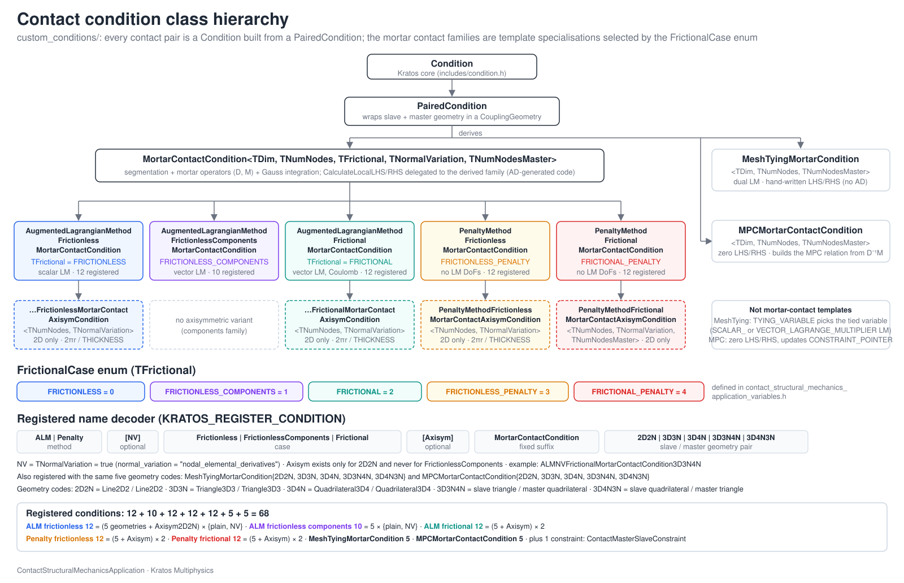

> **Sources.** Thesis §4.3.3.4 (discretization and mortar operators, pp. 100–113), §4.3.4.3 (frictional algebraic form), §4.3.5 (mesh tying); code: `custom_conditions/paired_condition.{h,cpp}`, `custom_conditions/mortar_contact_condition.{h,cpp}`, `custom_conditions/ALM_frictionless_mortar_contact_condition.h`, `custom_conditions/ALM_frictionless_components_mortar_contact_condition.h`, `custom_conditions/ALM_frictional_mortar_contact_condition.h`, `custom_conditions/penalty_frictionless_mortar_contact_condition.h`, `custom_conditions/penalty_frictional_mortar_contact_condition.h`, the four `*_axisym_condition.{h,cpp}`, `custom_conditions/mesh_tying_mortar_condition.{h,cpp}`, `custom_conditions/mpc_mortar_contact_condition.{h,cpp}`, `contact_structural_mechanics_application.{h,cpp}` (prototypes and `Register()`), `automatic_differentiation/*/*_template.cpp`, `kratos/includes/mortar_classes.h`, `custom_utilities/mortar_explicit_contribution_utilities.{h,cpp}`.

A *condition* in Kratos is the object that contributes a local left-hand side (LHS) and right-hand side (RHS) to the global system for a piece of boundary. In this application every **contact pair** (one slave face and one master face that the [search](../Contact_Search/Search_Pipeline_And_Bounding_Volumes.html) has matched) is a condition: it owns both geometries, integrates the mortar operators $$\mathbf{D}$$ and $$\mathbf{M}$$ over the exact intersection of the two faces, and evaluates the weak contact constraints and their consistent linearization for its slave nodes. This page describes how these classes are organized, how a local system is computed, what differs between the formulation families, how the registered names are built, and which values the conditions read from the `ProcessInfo` and the `Properties`. The mathematics is documented in the Theory section: [Frictionless contact](../Theory/Frictionless_Contact.html), [Frictional contact](../Theory/Frictional_Contact.html), [Mesh tying](../Theory/Mesh_Tying.html), [Mortar integration and dual Lagrange multipliers](../Theory/Mortar_Integration_And_Dual_Lagrange_Multipliers.html) and [Automatic differentiation](../Theory/Automatic_Differentiation.html).

## Class hierarchy

<p align="center"></p>
<p align="center"><em>Figure: the condition classes of `custom_conditions/`, their template parameters and the registered-name decoder.</em></p>

```
Condition                                          (Kratos core, includes/condition.h)
└── PairedCondition                                paired_condition.{h,cpp}
    ├── MortarContactCondition<TDim, TNumNodes, TFrictional, TNormalVariation, TNumNodesMaster>
    │   │                                          mortar_contact_condition.{h,cpp}
    │   ├── AugmentedLagrangianMethodFrictionlessMortarContactCondition            FRICTIONLESS
    │   │   └── AugmentedLagrangianMethodFrictionlessMortarContactAxisymCondition
    │   ├── AugmentedLagrangianMethodFrictionlessComponentsMortarContactCondition  FRICTIONLESS_COMPONENTS
    │   ├── AugmentedLagrangianMethodFrictionalMortarContactCondition              FRICTIONAL
    │   │   └── AugmentedLagrangianMethodFrictionalMortarContactAxisymCondition
    │   ├── PenaltyMethodFrictionlessMortarContactCondition                        FRICTIONLESS_PENALTY
    │   │   └── PenaltyMethodFrictionlessMortarContactAxisymCondition
    │   └── PenaltyMethodFrictionalMortarContactCondition                          FRICTIONAL_PENALTY
    │       └── PenaltyMethodFrictionalMortarContactAxisymCondition
    ├── MeshTyingMortarCondition<TDim, TNumNodes, TNumNodesMaster>
    └── MPCMortarContactCondition<TDim, TNumNodes, TNumNodesMaster>
```

Three layers can be distinguished:

1. **`PairedCondition`** (non-templated) only adds to `Condition` the notion of a *second* geometry and a cached normal for it.
2. **`MortarContactCondition`** contains everything that is common to the contact formulations: the segmentation of the pair, the integration of the mortar operators and of their derivatives, the isolation check, the integration-method selection, and the dispatch to the family-specific `CalculateLocalLHS` / `CalculateLocalRHS`. It never assembles anything itself: its own `CalculateLocalLHS` / `CalculateLocalRHS`, `EquationIdVector`, `GetDofList` and `GetActiveInactiveValue` raise `KRATOS_ERROR` (`mortar_contact_condition.cpp:537-590`).
3. **The families** are specializations of the `FrictionalCase` template parameter. Their headers are hand-written (DoF lists, `MatrixSize`, state encoding, extra members), while the bodies of `CalculateLocalLHS` / `CalculateLocalRHS` in the `.cpp` files are **generated** by the sympy scripts of `automatic_differentiation/` and are, therefore, very large (from 27 480 lines for the penalty frictionless condition to 170 787 lines for the ALM frictional one). The **axisymmetric** variants derive from the 2D instantiation of a family and override only the integration weight.

`MeshTyingMortarCondition` and `MPCMortarContactCondition` do not derive from `MortarContactCondition`: the first one because its operators are constant and computed once (there is no active set, no derivative of the operators), the second one because it does not contribute to the system at all but feeds a multipoint constraint.

### Template parameters

| Parameter | Type | Meaning | Values instantiated |
|---|---|---|---|
| `TDim` | `SizeType` | Working dimension (2 or 3). It is also the number of vertices of the integration cells produced by the segmentation (`DecompositionType` = `Line2D2<Point>` in 2D, `Triangle3D3<Point>` in 3D) | 2, 3 |
| `TNumNodes` | `SizeType` | Number of nodes of the **slave** geometry | 2 (line), 3 (triangle), 4 (quadrilateral) |
| `TFrictional` | `FrictionalCase` | Formulation family (see the enum below). It selects `DerivativeDataType` (`DerivativeDataFrictional` for the two frictional families, `DerivativeData` otherwise), the `IsFrictional` constant and the base `MatrixSize` | the five enumerators |
| `TNormalVariation` | `bool` | Whether the derivatives of the slave and master normals are included in the linearization (`DerivativesUtilities::CalculateDeltaNormalSlave/Master`). It is the `NV` infix of the registered names | `false`, `true` |
| `TNumNodesMaster` | `SizeType` | Number of nodes of the **master** geometry (defaults to `TNumNodes`) | 2, 3, 4 |

The pairs `<TDim, TNumNodes, TNumNodesMaster>` that exist are `<2,2,2>`, `<3,3,3>`, `<3,4,4>`, `<3,3,4>` and `<3,4,3>`; combined with the five `FrictionalCase` values and the two values of `TNormalVariation`, `mortar_contact_condition.cpp:751-808` instantiates the 50 base classes explicitly. The `BelongType` used by the segmentation to remember which slave/master edge produced each cell vertex is also chosen from these parameters (`PointBelongsLine2D2N`, `PointBelongsTriangle3D3N`, `PointBelongsQuadrilateral3D4N`, `PointBelongsTriangle3D3NQuadrilateral3D4N`, `PointBelongsQuadrilateral3D4NTriangle3D3N`, all in `kratos/includes/mortar_classes.h`).

### The `FrictionalCase` enum

Defined in `contact_structural_mechanics_application_variables.h`:

```cpp
enum class FrictionalCase {
    FRICTIONLESS            = 0,   // ALM, scalar normal Lagrange multiplier
    FRICTIONLESS_COMPONENTS = 1,   // ALM, vector Lagrange multiplier, tangential part penalized to zero
    FRICTIONAL              = 2,   // ALM, vector Lagrange multiplier, Coulomb friction
    FRICTIONLESS_PENALTY    = 3,   // pure penalty, displacement DoFs only
    FRICTIONAL_PENALTY      = 4    // pure penalty with friction, displacement DoFs only
};
```

The enum drives compile-time decisions in `mortar_contact_condition.h:140-159`:

<p align="center">$$ \texttt{MatrixSize} = \begin{cases} d\,(n_s + n_m) + n_s & \texttt{FRICTIONLESS} \\ d\,(2 n_s + n_m) & \texttt{FRICTIONLESS\_COMPONENTS},\ \texttt{FRICTIONAL} \\ d\,(n_s + n_m) & \texttt{FRICTIONLESS\_PENALTY},\ \texttt{FRICTIONAL\_PENALTY} \end{cases} $$</p>

with $$d$$ = `TDim`, $$n_s$$ = `TNumNodes` and $$n_m$$ = `TNumNodesMaster`, and `IsFrictional = (TFrictional == FRICTIONAL || TFrictional == FRICTIONAL_PENALTY)`, which selects the `MortarOperatorWithDerivatives<TDim, TNumNodes, IsFrictional, TNumNodesMaster>` and `DualLagrangeMultiplierOperatorsWithDerivatives<...>` types (the frictional versions also store the derivatives needed by the slip). A second enum in the same header, `NormalDerivativesComputation`, is read at run time from `CONSIDER_NORMAL_VARIATION` (see [PairedCondition](#pairedcondition) below and the [Variables and flags reference](Variables_And_Flags_Reference.html#enums)).

## PairedCondition

`PairedCondition` (`paired_condition.h`) is "basically equal to the base condition, with a pointer to the paired geometry". The two faces are stored in a single Kratos-core `CouplingGeometry<Node>` (`using CouplingGeometryType = CouplingGeometry<Node>`, `paired_condition.h:71`), created in the constructors as `Kratos::make_shared<CouplingGeometryType>(pGeometry, pPairedGeometry)` (`paired_condition.h:104-126`). The accessors are:

| Accessor (`paired_condition.h`) | Returns | Contact meaning |
|---|---|---|
| `GetParentGeometry()` / `pGetParentGeometry()` (l. 211-258) | `GetGeometry().GetGeometryPart(CouplingGeometryType::Master)` | the **slave** face (the one that carries the Lagrange multipliers and on which the integration cells are built) |
| `GetPairedGeometry()` / `pGetPairedGeometry()` (l. 229-276) | `GetGeometry().GetGeometryPart(CouplingGeometryType::Slave)` | the **master** face |
| `GetPairedNormal()` / `SetPairedNormal()` (l. 283-294) | `mPairedNormal` | unit normal of the master face at its center, cached because the master face is not "owned" by this condition |

> **Note (naming inversion).** `CouplingGeometry` calls its *first* geometry `Master` and its *second* one `Slave`, in the sense of "the geometry that owns the integration". Contact mechanics (and this application) use the opposite convention, so `CouplingGeometryType::Master` is the **slave** face and `CouplingGeometryType::Slave` is the **master** face. Always use `GetParentGeometry()` (slave) and `GetPairedGeometry()` (master) and never the `CouplingGeometry` enumerators directly. The slave normal, by contrast, is not cached in the condition: it is read from the condition's own `NORMAL` value (`this->GetValue(NORMAL)`, `mortar_contact_condition.cpp:302`), which the search process sets.

The three life-cycle hooks of `PairedCondition` (`paired_condition.cpp:68-120`) only manage `mPairedNormal`:

- `Initialize` and `InitializeSolutionStep` recompute it from `GetPairedGeometry().UnitNormal(center)`;
- `InitializeNonLinearIteration` recomputes it only when `rCurrentProcessInfo[CONSIDER_NORMAL_VARIATION]` (cast to `NormalDerivativesComputation`) is different from `NO_DERIVATIVES_COMPUTATION`, so that with `ELEMENTAL_DERIVATIVES`, `NODAL_ELEMENTAL_DERIVATIVES` or `NO_DERIVATIVES_COMPUTATION_WITH_NORMAL_UPDATE` the master normal follows the deformation inside the Newton loop.

`mPairedNormal` is serialized (`save`/`load`, `paired_condition.cpp:125-138`). `PairedCondition` has three `Create` overloads; the one taking `(NewId, pGeometry, pProperties, pPairedGeom)` is what the search uses to build a pair from the two skin conditions (`mpReferenceCondition->Create(rConditionId, pObjectSlave->pGetGeometry(), pProperties, pObjectMaster->pGetGeometry())`, `base_contact_search_process.cpp:811`).

## Life-cycle hooks

Kratos calls five hooks on every condition during a time step ([Architecture](Architecture.html#life-cycle-of-a-time-step)). The table summarizes what each class does in them; a dash means "only forwards to the base class".

| Hook | `PairedCondition` (`paired_condition.cpp`) | `MortarContactCondition` (`mortar_contact_condition.cpp`) | ALM / penalty **frictional** families (`*_template.cpp`) | `MeshTyingMortarCondition` (`mesh_tying_mortar_condition.cpp`) | `MPCMortarContactCondition` (`mpc_mortar_contact_condition.cpp`) |
|---|---|---|---|---|---|
| `Initialize` | caches `mPairedNormal` (l. 68-81) | resets `ISOLATED` to `false` (l. 89-100) | `mPreviousMortarOperators.Initialize()`, `mPreviousMortarOperatorsInitialized = false` (l. 73-86) | resolves `TYING_VARIABLE`, segments the pair once and caches `mMortarConditionMatrices`; deactivates the pair if the intersection is empty (l. 72-194) | initializes `mPreviousMortarOperators` if `Is(SLIP)` and performs a first constraint update with an empty `ProcessInfo` (l. 78-120) |
| `InitializeSolutionStep` | recomputes `mPairedNormal` (l. 86-99) | – | computes the previous operators once per step (`ComputePreviousMortarOperators`, guarded by `mPreviousMortarOperatorsInitialized`; l. 89-105) | – | unless `Is(BLOCKED)`: previous operators for `SLIP`, then the constraint update dispatch (l. 125-172) |
| `InitializeNonLinearIteration` | recomputes `mPairedNormal` only if `CONSIDER_NORMAL_VARIATION != NO_DERIVATIVES_COMPUTATION` (l. 104-120) | – | – | – | constraint update dispatch only if `Is(INTERACTION)` (l. 178-216) |
| `FinalizeSolutionStep` | – | – | `mPreviousMortarOperatorsInitialized = false` so the next step recomputes them (l. 108-121) | – | recomputes `mPreviousMortarOperators` if `Is(SLIP)` (l. 223-235) |
| `FinalizeNonLinearIteration` | – | – | – | – | empty (`// TODO: Add somethig if necessary`, l. 241-249) |

The **assembly** methods (`CalculateLocalSystem`, `CalculateLeftHandSide`, `CalculateRightHandSide`) are called by the builder-and-solver inside each Newton iteration, and `AddExplicitContribution(const ProcessInfo&)` is called by `ContactUtilities::ComputeExplicitContributionConditions` before the active-set check; both are described next. Serialization (`save`/`load`) stores `mPairedNormal` in the base, and `mPreviousMortarOperators` plus `mPreviousMortarOperatorsInitialized` in the frictional and MPC classes (`ALM_frictional_mortar_contact_condition.h:525-533`, `mpc_mortar_contact_condition.h:592-599`), so that a restart resumes with a consistent slip.

## MortarContactCondition: how a local system is computed

`CalculateLocalSystem`, `CalculateLeftHandSide` and `CalculateRightHandSide` (`mortar_contact_condition.cpp:157-208`) just resize the local containers to `MatrixSize` (`ResizeLHS` / `ResizeRHS`) and call the master driver `CalculateConditionSystem(rLHS, rRHS, rProcessInfo, ComputeLHS, ComputeRHS)` (`mortar_contact_condition.cpp:290-434`). `CalculateMassMatrix` and `CalculateDampingMatrix` resize to `0x0`: a contact condition has no inertia. The driver executes the following steps.

```
CalculateConditionSystem(LHS, RHS, ProcessInfo, ComputeLHS, ComputeRHS)        mortar_contact_condition.cpp:290
  1. slave = GetParentGeometry(); n_slave = GetValue(NORMAL)
     derivative_data.Initialize(slave, ProcessInfo)        <- u1, X1, NormalSlave, PenaltyParameter[i] = node.GetValue(INITIAL_PENALTY),
                                                              ScaleFactor = ProcessInfo[SCALE_FACTOR] (+ TangentFactor, u1old if frictional)
     if TNormalVariation: DerivativesUtilities::CalculateDeltaNormalSlave(...)
  2. integration_utility = ExactMortarIntegrationUtility(INTEGRATION_ORDER_CONTACT, DISTANCE_THRESHOLD,
                                                         0, ZERO_TOLERANCE_FACTOR, CONSIDER_TESSELLATION)
     master = GetPairedGeometry(); n_master = GetPairedNormal()
  3. is_inside = CheckIsolatedElement(DELTA_TIME) ? false
                 : integration_utility.GetExactIntegration(slave, n_slave, master, n_master, cells)   l. 334
     integration_area = GetTotalArea(slave, cells)
  4. if is_inside and integration_area / slave.Area() > 1e-5:                                          l. 340
       derivative_data.UpdateMasterPair(master, ProcessInfo)      <- u2, X2 (+ u2old)
       if TNormalVariation: CalculateDeltaNormalMaster(...)
       dual_LM = DerivativesUtilities::CalculateAeAndDeltaAe(slave, n_slave, master, derivative_data,
                    general_variables, consider_normal_variation, cells, method, axisym_coefficient)  l. 354
       for each cell in cells:                                                                         l. 358
         decomp_geom = Line2D2 / Triangle3D3 built from the cell vertices (global coordinates)
         skip if bad shape (LengthCheck in 2D with CheckThresholdCoefficient = 1e-12, HeronCheck in 3D)
         for each Gauss point of decomp_geom (GetIntegrationMethod()):                                 l. 380
           derivative_data.ResetDerivatives()
           map GP -> slave local coordinates (local_point_parent)
           MortarExplicitContributionUtilities::CalculateKinematics(...)        <- N_slave, Phi (dual), N_master, DetJ  l. 390
           w = GP.Weight() * GetAxisymmetricCoefficient(general_variables)
           if ComputeLHS:
             (3D) CalculateDeltaCellVertex(...); CalculateDeltaDetjSlave(...); CalculateDeltaN(...)
             mortar_operators.CalculateDeltaMortarOperators(general_variables, derivative_data, w)      l. 403
           else:
             mortar_operators.CalculateMortarOperators(general_variables, w)                            l. 405
       active_inactive = GetActiveInactiveValue(slave)                                                 l. 411
       if ComputeLHS: CalculateLocalLHS(LHS, mortar_operators, derivative_data, active_inactive, ProcessInfo)
       if ComputeRHS: CalculateLocalRHS(RHS, mortar_operators, derivative_data, active_inactive, ProcessInfo)
     else:                                                                                             l. 421
       Set(ISOLATED, true); ZeroLHS(LHS); ZeroRHS(RHS)
```

Some remarks on each stage:

**Segmentation (step 3).** `IntegrationUtility` is `ExactMortarIntegrationUtility<TDim, TNumNodes, true, TNumNodesMaster>` (`mortar_contact_condition.h:156`); the `true` asks the utility to return, for every vertex of every cell, the *belonging* information (which slave/master node or edge intersection generated it), needed later by `CalculateDeltaCellVertex` to differentiate the cell geometry with respect to the displacements. `GetExactIntegration` projects the master onto the slave plane along the slave normal, clips the two polygons and triangulates the intersection (see [Mortar integration and dual Lagrange multipliers](../Theory/Mortar_Integration_And_Dual_Lagrange_Multipliers.html)). The result is a list of `TDim` -vertex cells expressed in the slave local coordinates. The `distance_threshold` (default `1.0e24`) and the `zero_tolerance_factor` (default `1.0`) come from the `ProcessInfo`; the `INTEGRATION_ORDER_CONTACT` (default 2) and `CONSIDER_TESSELLATION` (default `false`) from the pair `Properties`.

**Isolation.** `CheckIsolatedElement` (`mortar_contact_condition.cpp:440-532`) currently only returns `this->Is(ISOLATED)` (a long heuristic based on the relative motion of the two faces is kept commented out). Hence, once a pair is flagged `ISOLATED` (because its intersection is empty or its area is below $$10^{-5}$$ of the slave area) it stays zeroed until `Initialize` resets the flag (`mortar_contact_condition.cpp:95`), which happens when the search rebuilds the pairs. Isolated slave nodes are handled by the block builder-and-solver ([Builder and solvers](Builder_And_Solvers_And_Linear_Solvers.html)).

**Dual shape functions (step 4, `Ae`).** `CalculateAeAndDeltaAe` (`custom_utilities/derivatives_utilities.h:345`) integrates $$\mathbf{D}_e$$ and $$\mathbf{M}_e$$ over the cells (Popp's eq. 3.65) and returns the coefficient matrix $$\mathbf{A}_e = \mathbf{D}_e \mathbf{M}_e^{-1}$$ that turns the standard shape functions $$N_k$$ into the dual ones $$\Phi_j = \sum_k A_{e,jk} N_k$$, together with its directional derivatives $$\Delta \mathbf{A}_e$$ (Popp's eq. 4.58); the boolean `dual_LM` it returns is `false` when the matrix could not be inverted safely, in which case the standard shape functions are used for the multipliers. The axisymmetric coefficient is passed so that $$\mathbf{A}_e$$ is consistent with the weighted integration.

**Cell and Gauss loops.** Each cell is a `Line2D2<Point>` or `Triangle3D3<Point>` in *global* coordinates; degenerate cells are skipped (`MortarUtilities::LengthCheck` / `HeronCheck`, `mortar_contact_condition.cpp:369-373`). For every Gauss point of the cell (`GetIntegrationMethod()` below), `CalculateKinematics` evaluates the slave shape functions $$N^{(1)}$$ and the dual ones $$\Phi$$ at the parent local point, projects the point onto the master to get $$N^{(2)}$$, and computes the Jacobian determinant of the cell (`MortarKinematicVariablesWithDerivatives`, `mortar_classes.h:444`). When the LHS is requested the derivatives of the cell vertices (3D only), of the Jacobian and of all the shape functions are updated first and `CalculateDeltaMortarOperators` accumulates both the operators and their derivatives (`MortarOperatorWithDerivatives`, `mortar_classes.h:1195-1297`, Popp's eqs. 4.32–4.38):

<p align="center">$$ D_{jk} \mathrel{+}= w \, \Phi_j N^{(1)}_k \, \det J, \qquad M_{jl} \mathrel{+}= w \, \Phi_j N^{(2)}_l \, \det J, \qquad \Delta D_{jk}, \Delta M_{jl} \text{ for each of the } d\,(n_s + n_m) \text{ displacement DoFs}. $$</p>

For a pure RHS evaluation only `CalculateMortarOperators` is called: the residual does not need the derivatives, which makes `CalculateRightHandSide` (used, for example, by the line-search strategy and by the convergence criteria) much cheaper than `CalculateLocalSystem`.

**Active/inactive encoding and dispatch (steps `GetActiveInactiveValue` and `CalculateLocalLHS/RHS`).** The base class declares `GetActiveInactiveValue` as virtual and the families implement it (see the table in the next section). The integer is passed as `rActiveInactive` to the family-specific `CalculateLocalLHS(rLocalLHS, rMortarConditionMatrices, rDerivativeData, rActiveInactive, rCurrentProcessInfo)` and `CalculateLocalRHS(...)` (`mortar_contact_condition.h:531-552`), whose bodies are the sympy-generated code. The interface has kept this integer since the first generators, which emitted `if (rActiveInactive == N) {...} else if ...` chains (`generate_frictionless_mortar_condition.py:187-200`); the code that is currently committed comes from the `_non_zero` generators and from the frictional generator, which branch **per node** directly on the flags (`if (r_geometry[i].IsNot(ACTIVE)) { ... } else if (r_geometry[i].Is(SLIP)) {...}`), so the integer is computed but the generated bodies do not test it. See [Automatic differentiation](../Theory/Automatic_Differentiation.html) for the generation pipeline and the `BEGIN/END AD REPLACEMENT` markers.

### `GetIntegrationMethod` and `INTEGRATION_ORDER_CONTACT`

`GetIntegrationMethod()` (`mortar_contact_condition.h:583-601`, identical in `mesh_tying_mortar_condition.h:638-650`) maps the `INTEGRATION_ORDER_CONTACT` property of the pair to the Gauss rule used *on every integration cell*:

| `INTEGRATION_ORDER_CONTACT` | `GeometryData::IntegrationMethod` | Gauss points per cell (line / triangle) |
|---|---|---|
| 1 | `GI_GAUSS_1` | 1 / 1 |
| 2 (default, also when the property is missing) | `GI_GAUSS_2` | 2 / 3 |
| 3 | `GI_GAUSS_3` | 3 / 4 |
| 4 | `GI_GAUSS_4` | 4 / 6 |
| 5 | `GI_GAUSS_5` | 5 / 7 |
| any other value | `GI_GAUSS_2` | 2 / 3 |

The same integer is handed to `ExactMortarIntegrationUtility`, which uses the same switch (`kratos/utilities/exact_mortar_segmentation_utility.cpp:1324-1346`) for the auxiliary integration it performs during the clipping. Because the integrand on a cell is a product of polynomials of low degree (the shape functions of both sides are linear/bilinear and the cell Jacobian is constant on a triangle), the default order 2 is exact for the frictionless operators on linear geometries; higher orders only matter for quadrilaterals and for the axisymmetric weight. The property is written by `SearchBaseProcess` from the `integration_order` key of the contact process settings ([Contact process settings reference](../Usage/Contact_Process_Settings_Reference.html)).

## The formulation families

<p align="center"></p>
<p align="center"><em>Figure: nodal DoFs, historical variables, non-historical values and flags used by each `mortar_type`; the conditions below only see the slave/master displacements and the slave multipliers listed in their DoF list.</em></p>

Every family orders its local system as **[master displacements, slave displacements, slave multipliers]** (`/* ORDER - [ MASTER, SLAVE, LAMBDA ] */` in every `EquationIdVector`, for example `ALM_frictional_mortar_contact_condition_template.cpp:174-215`), with the components of each node consecutive (`X`, `Y`, and `Z` in 3D).

| Family (header) | `FrictionalCase` | Slave multiplier DoFs | `MatrixSize` | State encoding of `GetActiveInactiveValue` | Extra state | Explicit contribution (`AddExplicitContribution(ProcessInfo)`) | Axisymmetric variant |
|---|---|---|---|---|---|---|---|
| `AugmentedLagrangianMethodFrictionlessMortarContactCondition` (`ALM_frictionless_mortar_contact_condition.h:135`) | `FRICTIONLESS` | `LAGRANGE_MULTIPLIER_CONTACT_PRESSURE` (1 per slave node) | $$d(n_s+n_m)+n_s$$ → 10 (2D2N), 21 (3D3N), 28 (3D4N), 24 (3D3N4N), 25 (3D4N3N) | $$\sum_i a_i 2^i$$, $$a_i = 1$$ if node $$i$$ `Is(ACTIVE)` (l. 385-393) | none | base: `AddExplicitContributionOfMortarCondition(this, pinfo, order, IsAxisymmetric(), false)` → `WEIGHTED_GAP` (`mortar_contact_condition.cpp:253`) | `...FrictionlessMortarContactAxisymCondition<TNumNodes, TNormalVariation>` |
| `AugmentedLagrangianMethodFrictionlessComponentsMortarContactCondition` (`ALM_frictionless_components_mortar_contact_condition.h:135`) | `FRICTIONLESS_COMPONENTS` | `VECTOR_LAGRANGE_MULTIPLIER_X/Y(/Z)` ($$d$$ per slave node); the tangential components are driven to zero by a $$-k^2/\varepsilon$$ term | $$d(2n_s+n_m)$$ → 12, 27, 36, 30, 33 | $$\sum_i a_i 2^i$$ (l. 385) | none | base (as above) | none |
| `AugmentedLagrangianMethodFrictionalMortarContactCondition` (`ALM_frictional_mortar_contact_condition.h:145`) | `FRICTIONAL` | `VECTOR_LAGRANGE_MULTIPLIER_X/Y(/Z)` | $$d(2n_s+n_m)$$ → 12, 27, 36, 30, 33 | $$\sum_i s_i 3^i$$ with $$s_i = 0$$ inactive, $$1$$ active-slip, $$2$$ active-stick (l. 437-450) | `mPreviousMortarOperators` (`MortarOperator<TNumNodes,TNumNodesMaster>`) + `mPreviousMortarOperatorsInitialized` (l. 380-382); `StepSlip = TNormalVariation ? 0 : 1` (l. 148) | `AddExplicitContributionOfMortarFrictionalCondition(this, pinfo, mPreviousMortarOperators, order, false, false)` → `WEIGHTED_GAP` and `WEIGHTED_SLIP` (template l. 125-131) | `...FrictionalMortarContactAxisymCondition<TNumNodes, TNormalVariation>` |
| `PenaltyMethodFrictionlessMortarContactCondition` (`penalty_frictionless_mortar_contact_condition.h:146`) | `FRICTIONLESS_PENALTY` | none (displacement-only) | $$d(n_s+n_m)$$ → 8, 18, 24, 21, 21 | $$\sum_i a_i 2^i$$ (l. 439) | none | `AddExplicitContributionOfMortarCondition(this, pinfo, order, false, true)` → `WEIGHTED_GAP` **and** `NODAL_AREA` (template l. 73-79) | `PenaltyMethodFrictionlessMortarContactAxisymCondition<TNumNodes, TNormalVariation>` |
| `PenaltyMethodFrictionalMortarContactCondition` (`penalty_frictional_mortar_contact_condition.h:146`) | `FRICTIONAL_PENALTY` | none | $$d(n_s+n_m)$$ → 8, 18, 24, 21, 21 | $$\sum_i s_i 3^i$$ (l. 471-484) | `mPreviousMortarOperators`, `mPreviousMortarOperatorsInitialized` (l. 412-414), `StepSlip` (l. 149), private `ComputeTangentMatrixSlip(rGeometry)` = `MortarUtilities::ComputeTangentMatrix` (l. 545-549) | `AddExplicitContributionOfMortarFrictionalCondition(this, pinfo, mPreviousMortarOperators, false, false)` → `WEIGHTED_GAP`, `WEIGHTED_SLIP` (template l. 125-130) | `PenaltyMethodFrictionalMortarContactAxisymCondition<TNumNodes, TNormalVariation, TNumNodesMaster>` |

Additional facts that the table cannot hold:

- **Where the ALM parameters come from.** The generated bodies read `ScaleFactor = rDerivativeData.ScaleFactor`, `PenaltyParameter = rDerivativeData.PenaltyParameter` (one value per slave node), `TangentFactor = rDerivativeData.TangentFactor` (frictional only), `DynamicFactor = GetVariableVector(slave, DYNAMIC_FACTOR)` and `LM`/`LMNormal` from the nodal multiplier variables; `DerivativeData::Initialize` fills them from `node.GetValue(INITIAL_PENALTY)`, `rCurrentProcessInfo[SCALE_FACTOR]` and `rCurrentProcessInfo[TANGENT_FACTOR]` (`mortar_classes.h:709-710, 960`). The generated frictionless code therefore evaluates, for an active node $$j$$, the augmented pressure $$\bar{\lambda}_{n,j} = k \lambda_{n,j} + \varepsilon_j \tilde{g}_{n,j}$$ with $$\tilde{g}_{n,j} = \mathbf{n}_j \cdot (\mathbf{D} \mathbf{x}^{(1)} - \mathbf{M} \mathbf{x}^{(2)})_j$$ and, for an inactive node, the term $$-\frac{k^2}{\varepsilon_j} \lambda_{n,j}$$ that returns the multiplier to zero ([Frictionless contact](../Theory/Frictionless_Contact.html), thesis §4.3.3.4.3).
- **Consistent slip (frictional families).** The slip increment needs the operators of the previous converged step: `InitializeSolutionStep` calls `ComputePreviousMortarOperators` once per step (guarded by `mPreviousMortarOperatorsInitialized`, which `FinalizeSolutionStep` resets; `ALM_frictional_mortar_contact_condition_template.cpp:89-117`). The generated code then compares the Frobenius norms of $$\mathbf{D}-\mathbf{D}_{old}$$ and $$\mathbf{M}-\mathbf{M}_{old}$$ with `rCurrentProcessInfo[OPERATOR_THRESHOLD]`: if both exceed it the *objective* slip $$(\mathbf{D}-\mathbf{D}_{old})\mathbf{x}^{(1)} - (\mathbf{M}-\mathbf{M}_{old})\mathbf{x}^{(2)}$$ is used, otherwise the *non-objective* $$\mathbf{D}(\mathbf{x}^{(1)}-\mathbf{x}^{(1)}_{old}) - \mathbf{M}(\mathbf{x}^{(2)}-\mathbf{x}^{(2)}_{old})$$, and the condition flag `MODIFIED` records the choice (`this->Set(MODIFIED, !is_objetive)`, `ALM_frictional_mortar_contact_condition.cpp:201-205`). The friction coefficient is read per slave node with `GetFrictionCoefficient()` (`FRICTION_COEFFICIENT` non-historical value, `ALM_frictional_mortar_contact_condition.h:456-467`), still marked `// TODO: Define the "CL" or friction law`; the `FrictionalLaw` classes are described in [Frictional laws and MPC constraint](Frictional_Laws_And_MPC_Constraint.html). See [Frictional contact](../Theory/Frictional_Contact.html) for the stick/slip branches (thesis §4.3.4.3).
- **Penalty families.** Without multipliers, the augmented pressure reduces to $$\varepsilon_j \tilde{g}_{n,j}$$ and the stick force to `TangentFactor`$$\cdot \varepsilon_j$$ times the slip; the penalty frictionless `AddExplicitContribution` additionally accumulates `NODAL_AREA`, which the penalty process uses to scale the nodal penalty. These conditions are the ones used by the explicit dynamic solver.
- **Explicit contributions.** `AddExplicitContribution(const ProcessInfo&)` is the *only* method allowed to write on the nodes; `ContactUtilities::ComputeExplicitContributionConditions` calls it on the `ComputingContact` model part at the beginning of every step and iteration to refresh the weighted gap (and slip) that the active-set check and the `Predict` of the strategy need ([Architecture](Architecture.html#life-cycle-of-a-time-step)). The overloads taking a destination variable (`mortar_contact_condition.cpp:264-285`) compute the nodal area into a `double` variable via `MortarExplicitContributionUtilities::ComputeNodalArea` and raise an error for `array_1d` destinations.

> **Note.** `PenaltyMethodFrictionalMortarContactCondition::AddExplicitContribution` passes `false, false` after `mPreviousMortarOperators` (`penalty_frictional_mortar_contact_condition.cpp:129`), so the `IntegrationOrder` argument receives 0 and `ExactMortarIntegrationUtility` falls back to `GI_GAUSS_2`: the explicit gap/slip of this family ignores `INTEGRATION_ORDER_CONTACT` (the implicit assembly does honor it). Harmless with the default order.

### Local DoF ordering

`EquationIdVector` and `GetDofList` fill the local vector in the order **master displacements, slave displacements, slave multipliers**, node by node and component by component. For the smallest ALM frictionless condition, `ALMFrictionlessMortarContactCondition2D2N` (`MatrixSize` = 2·(2+2)+2 = 10), the local indices are

```
index : 0   1   2   3   4   5   6   7   8        9
DoF   : u2x u2y u2x u2y u1x u1y u1x u1y lambda_n lambda_n
node  : m0  m0  m1  m1  s0  s0  s1  s1  s0       s1
```

where `m` denotes master nodes, `s` slave nodes, `u2` the master displacement, `u1` the slave displacement and `lambda_n` the `LAGRANGE_MULTIPLIER_CONTACT_PRESSURE` DoF (`ALM_frictionless_mortar_contact_condition_template.cpp:96-133`). For the vector-multiplier families the last block has `TDim` entries per slave node (`VECTOR_LAGRANGE_MULTIPLIER_X`, `_Y`, `_Z`); for the penalty families it is absent. The generated code addresses `rLocalLHS(i, j)` with these absolute indices, which is why every specialization is a separate function with hard-coded sizes and why a change in this ordering requires regenerating all the `.cpp` files. The mesh-tying condition follows the same order with `dof_size` components per node, and the MPC condition only has the two displacement blocks.

The resulting sizes for every registered geometry pair are:

| Family | 2D2N | 3D3N | 3D4N | 3D3N4N | 3D4N3N |
|---|---|---|---|---|---|
| ALM frictionless, $$d(n_s+n_m)+n_s$$ | 10 | 21 | 28 | 24 | 25 |
| ALM frictionless components / ALM frictional, $$d(2n_s+n_m)$$ | 12 | 27 | 36 | 30 | 33 |
| Penalty frictionless / penalty frictional / MPC, $$d(n_s+n_m)$$ | 8 | 18 | 24 | 21 | 21 |
| Mesh tying (`DISPLACEMENT`), $$d(2n_s+n_m)$$ | 12 | 27 | 36 | 30 | 33 |
| Mesh tying (scalar variable), $$2n_s+n_m$$ | 6 | 9 | 12 | 10 | 11 |

### Active/inactive and stick/slip encodings

The two `GetActiveInactiveValue` encodings turn the nodal flags of the slave face into one integer:

- **Frictionless families** (`ALM_frictionless_mortar_contact_condition.h:385-393`, identical in the components and penalty frictionless headers): `value += 1 << i_node` for every node that `Is(ACTIVE)`. For a triangle with nodes 0 and 2 active the value is $$2^0 + 2^2 = 5$$; the range is $$0 \ldots 2^{n_s}-1$$ (0–15 for a quadrilateral).
- **Frictional families** (`ALM_frictional_mortar_contact_condition.h:437-450`, `penalty_frictional_mortar_contact_condition.h:471-484`): `value += pow(3, i_node)` for an active node that `Is(SLIP)` and `value += 2 * pow(3, i_node)` for an active node that is *not* `SLIP` (stick); inactive nodes contribute 0. For a triangle with node 0 sticking, node 1 slipping and node 2 inactive the value is $$2 \cdot 3^0 + 1 \cdot 3^1 = 5$$; the range is $$0 \ldots 3^{n_s}-1$$ (0–80 for a quadrilateral).

The committed generated code branches per node instead of on the integer. The frictional structure, repeated for every slave node `i` in both `CalculateLocalLHS` and `CalculateLocalRHS`, is

```
// NODE i
if (r_geometry[i].IsNot(ACTIVE)) {            // INACTIVE: -k^2/eps * lambda_i  (returns the multiplier to zero)
    ...
} else if (r_geometry[i].Is(SLIP)) {          // ACTIVE-SLIP
    if (is_objetive) { ... }                  //   objective slip     (D - D_old) x1 - (M - M_old) x2
    else             { ... }                  //   non-objective slip D (x1 - x1_old) - M (x2 - x2_old)
} else {                                      // ACTIVE-STICK
    if (is_objetive) { ... } else { ... }
}
```

(`ALM_frictional_mortar_contact_condition.cpp:207-1327` for node 0 of the `<2,2,false,2>` specialization; the `// ACTIVE-SLIP`, `// OBJECTIVE-SLIP` and `// ACTIVE-STICK` comments mark the branches). Five branches per node times up to four nodes, each containing the fully expanded linearization, is what makes this file 170 787 lines long. The frictionless families have two branches per node (inactive / active). The `is_objetive` boolean and the `MODIFIED` flag are computed once per call, before the node loop (l. 201-205).

### Axisymmetric variants

The four `*_axisym_condition.{h,cpp}` classes are templated on `<TNumNodes, TNormalVariation>` (plus `TNumNodesMaster` for the penalty frictional one) and derive from the `<2, TNumNodes, TNormalVariation>` instantiation of their family; only `<2, false>` and `<2, true>` are instantiated. They override three methods (`ALM_frictionless_mortar_contact_axisym_condition.cpp:74-113`, same lines in the other three files):

- `IsAxisymmetric()` returns `true`;
- `GetAxisymmetricCoefficient(rVariables)` returns $$2 \pi r / t$$ with `t = GetProperties()[THICKNESS]`;
- `CalculateRadius(rVariables)` returns $$r = \sum_i N^{(1)}_i x_i$$, the *current* $$x$$ coordinate of the Gauss point on the slave (the reference-configuration alternative is kept commented out).

Because the base class multiplies every Gauss weight by `GetAxisymmetricCoefficient` (`mortar_contact_condition.cpp:393`) and passes it to `CalculateAeAndDeltaAe`, the operators $$\mathbf{D}$$, $$\mathbf{M}$$ and $$\mathbf{A}_e$$ become integrals over the revolved surface, consistent with the axisymmetric solid elements that divide by `THICKNESS`. The base implementation returns `1.0` (`mortar_contact_condition.cpp:703-706`). The `Axisym` infix in the registered names selects these classes; the Python processes pick them when `axisymmetric` is `true` in the contact process settings (`alm_contact_process.py:325-346`, `penalty_contact_process.py:197-213`).

> **Note (`MatrixSize` shadowing).** Each axisymmetric header re-declares `static constexpr IndexType MatrixSize` instead of inheriting it. Two of them disagree with their base: `ALM_frictional_mortar_contact_axisym_condition.h:119` declares `2 * (TNumNodes + TNumNodes) + TNumNodes` (= 10 for two nodes) while the frictional base is `TDim * (TNumNodes + TNumNodes + TNumNodesMaster)` (= 12), and `penalty_frictionless_mortar_contact_axisym_condition.h:120` declares the same `2 * (TNumNodes + TNumNodes) + TNumNodes` (= 10) while the penalty base is `TDim * (TNumNodes + TNumNodesMaster)` (= 8). The mismatch is harmless because the derived constants are never used: `ResizeLHS`, `ResizeRHS`, `ZeroLHS` and `ZeroRHS` are implemented in the base class with the base constant (`mortar_contact_condition.cpp:711-740`), and the generated `CalculateLocalLHS/RHS` are specializations of the base family with hard-coded sizes.

## Registered names

`KratosContactStructuralMechanicsApplication::Register()` (`contact_structural_mechanics_application.cpp:123-261`) registers **68 conditions** and one constraint (`ContactMasterSlaveConstraint`). The prototypes are members of the application class (`contact_structural_mechanics_application.h`) built in its constructor with `LineType = Line2D2<Node>`, `TriangleType = Triangle3D3<Node>` and `QuadrilateralType = Quadrilateral3D4<Node>` geometries for the slave *and* the master (`contact_structural_mechanics_application.cpp:25-120`).

### Decoder

A contact condition name is assembled as

<p align="center">$$ \underbrace{\texttt{ALM} \;\vert\; \texttt{Penalty}}_{\text{method}} \; \underbrace{[\texttt{NV}]}_{\text{normal variation}} \; \underbrace{\texttt{Frictionless} \;\vert\; \texttt{FrictionlessComponents} \;\vert\; \texttt{Frictional}}_{\text{family}} \; \underbrace{[\texttt{Axisym}]}_{\text{2D only}} \; \texttt{MortarContactCondition} \; \underbrace{\texttt{2D2N} \;\vert\; \texttt{3D3N} \;\vert\; \texttt{3D4N} \;\vert\; \texttt{3D3N4N} \;\vert\; \texttt{3D4N3N}}_{\text{geometry pair}} $$</p>

and the two non-contact families are `MeshTyingMortarCondition<pair>` and `MPCMortarContactCondition<pair>`. The geometry suffix reads `<TDim>D<TNumNodes>N[<TNumNodesMaster>N]`, the master count being appended only when it differs from the slave count. `BaseContactSearchProcess` builds exactly this string at run time: `condition_name << "Condition" << TDim << "D" << TNumNodes << "N" << final_string` (`base_contact_search_process.cpp:99`), where the Python process supplies the prefix (`_get_condition_name`, for example `"ALMNVFrictionalAxisymMortarContact"`) and `final_string` = `"<n_master>N"` when the two sides have a different number of nodes (`search_base_process.py:307-320`).

| Suffix | Slave geometry | Master geometry | Template arguments |
|---|---|---|---|
| `2D2N` | `Line2D2` | `Line2D2` | `<2, 2, ..., 2>` |
| `3D3N` | `Triangle3D3` | `Triangle3D3` | `<3, 3, ..., 3>` |
| `3D4N` | `Quadrilateral3D4` | `Quadrilateral3D4` | `<3, 4, ..., 4>` |
| `3D3N4N` | `Triangle3D3` | `Quadrilateral3D4` | `<3, 3, ..., 4>` |
| `3D4N3N` | `Quadrilateral3D4` | `Triangle3D3` | `<3, 4, ..., 3>` |

### Full list

| Group (count) | Registered names |
|---|---|
| Mesh tying (5) | `MeshTyingMortarCondition2D2N`, `MeshTyingMortarCondition3D3N`, `MeshTyingMortarCondition3D4N`, `MeshTyingMortarCondition3D3N4N`, `MeshTyingMortarCondition3D4N3N` |
| ALM frictionless (12) | `ALMFrictionlessMortarContactCondition2D2N`, `ALMNVFrictionlessMortarContactCondition2D2N`, `ALMFrictionlessAxisymMortarContactCondition2D2N`, `ALMNVFrictionlessAxisymMortarContactCondition2D2N`, `ALMFrictionlessMortarContactCondition3D3N`, `ALMNVFrictionlessMortarContactCondition3D3N`, `ALMFrictionlessMortarContactCondition3D4N`, `ALMNVFrictionlessMortarContactCondition3D4N`, `ALMFrictionlessMortarContactCondition3D3N4N`, `ALMNVFrictionlessMortarContactCondition3D3N4N`, `ALMFrictionlessMortarContactCondition3D4N3N`, `ALMNVFrictionlessMortarContactCondition3D4N3N` |
| ALM frictionless components (10) | `ALMFrictionlessComponentsMortarContactCondition2D2N`, `ALMNVFrictionlessComponentsMortarContactCondition2D2N`, `ALMFrictionlessComponentsMortarContactCondition3D3N`, `ALMNVFrictionlessComponentsMortarContactCondition3D3N`, `ALMFrictionlessComponentsMortarContactCondition3D4N`, `ALMNVFrictionlessComponentsMortarContactCondition3D4N`, `ALMFrictionlessComponentsMortarContactCondition3D3N4N`, `ALMNVFrictionlessComponentsMortarContactCondition3D3N4N`, `ALMFrictionlessComponentsMortarContactCondition3D4N3N`, `ALMNVFrictionlessComponentsMortarContactCondition3D4N3N` |
| ALM frictional (12) | `ALMFrictionalMortarContactCondition2D2N`, `ALMNVFrictionalMortarContactCondition2D2N`, `ALMFrictionalAxisymMortarContactCondition2D2N`, `ALMNVFrictionalAxisymMortarContactCondition2D2N`, `ALMFrictionalMortarContactCondition3D3N`, `ALMNVFrictionalMortarContactCondition3D3N`, `ALMFrictionalMortarContactCondition3D4N`, `ALMNVFrictionalMortarContactCondition3D4N`, `ALMFrictionalMortarContactCondition3D3N4N`, `ALMNVFrictionalMortarContactCondition3D3N4N`, `ALMFrictionalMortarContactCondition3D4N3N`, `ALMNVFrictionalMortarContactCondition3D4N3N` |
| Penalty frictionless (12) | `PenaltyFrictionlessMortarContactCondition2D2N`, `PenaltyNVFrictionlessMortarContactCondition2D2N`, `PenaltyFrictionlessAxisymMortarContactCondition2D2N`, `PenaltyNVFrictionlessAxisymMortarContactCondition2D2N`, `PenaltyFrictionlessMortarContactCondition3D3N`, `PenaltyNVFrictionlessMortarContactCondition3D3N`, `PenaltyFrictionlessMortarContactCondition3D4N`, `PenaltyNVFrictionlessMortarContactCondition3D4N`, `PenaltyFrictionlessMortarContactCondition3D3N4N`, `PenaltyNVFrictionlessMortarContactCondition3D3N4N`, `PenaltyFrictionlessMortarContactCondition3D4N3N`, `PenaltyNVFrictionlessMortarContactCondition3D4N3N` |
| Penalty frictional (12) | `PenaltyFrictionalMortarContactCondition2D2N`, `PenaltyNVFrictionalMortarContactCondition2D2N`, `PenaltyFrictionalAxisymMortarContactCondition2D2N`, `PenaltyNVFrictionalAxisymMortarContactCondition2D2N`, `PenaltyFrictionalMortarContactCondition3D3N`, `PenaltyNVFrictionalMortarContactCondition3D3N`, `PenaltyFrictionalMortarContactCondition3D4N`, `PenaltyNVFrictionalMortarContactCondition3D4N`, `PenaltyFrictionalMortarContactCondition3D3N4N`, `PenaltyNVFrictionalMortarContactCondition3D3N4N`, `PenaltyFrictionalMortarContactCondition3D4N3N`, `PenaltyNVFrictionalMortarContactCondition3D4N3N` |
| MPC (5) | `MPCMortarContactCondition2D2N`, `MPCMortarContactCondition3D3N`, `MPCMortarContactCondition3D4N`, `MPCMortarContactCondition3D3N4N`, `MPCMortarContactCondition3D4N3N` |
| Constraint (1) | `ContactMasterSlaveConstraint` (`KRATOS_REGISTER_CONSTRAINT`, `contact_structural_mechanics_application.cpp:261`) |

There is no axisymmetric `FrictionlessComponents` condition, no axisymmetric 3D condition (axisymmetry is a 2D concept) and no `NV` variant of the mesh-tying or MPC conditions (they do not linearize the normals). Users never write these names in `ProjectParameters.json`: the contact processes derive them from `contact_type`, `normal_variation` and `axisymmetric` ([Contact process settings reference](../Usage/Contact_Process_Settings_Reference.html)).

> **Note (pairs cannot come from an `.mdpa`).** A `Begin Conditions <name>` block of an `.mdpa` file creates conditions through `Create(NewId, rThisNodes, pProperties)`, which for a `PairedCondition` wraps the nodes in a `CouplingGeometry` whose second geometry is `nullptr` (`paired_condition.h:104-114`). Such a condition fails `Check()` with `YOU HAVE NOT INITIALIZED THE PAIR GEOMETRY IN THE MortarContactCondition`. Pairs must therefore always be created by the search (or, in C++ tests, with `r_prototype.Create(id, p_slave_geometry, p_properties, p_master_geometry)` as in `tests/cpp_tests/conditions/test_mesh_tying_condition.cpp:280`). The `.mdpa` only provides the *skin* conditions (any surface/line condition of the StructuralMechanicsApplication) from which the search builds the pairs.

> **Note (mesh-tying prototypes).** The prototypes `mMeshTyingMortarCondition3D3N4N` and `mMeshTyingMortarCondition3D4N3N` are constructed with *matching* geometries (`TriangleType`/`TriangleType` and `QuadrilateralType`/`QuadrilateralType`, `contact_structural_mechanics_application.cpp:34-35`) while every contact prototype of the same suffix uses the true mixed pair (for example `mALMFrictionlessMortarContactCondition3D3N4N` at line 49 uses `TriangleType`/`QuadrilateralType`). The prototype geometry is only a placeholder that `Create(NewId, pGeom, pProperties, pMasterGeom)` replaces with the real faces, so the registered condition works; the inconsistency only affects code that inspects the prototype itself.

## MeshTyingMortarCondition

`MeshTyingMortarCondition<TDim, TNumNodes, TNumNodesMaster>` (`mesh_tying_mortar_condition.{h,cpp}`) glues two non-matching meshes with dual Lagrange multipliers ([Mesh tying](../Theory/Mesh_Tying.html)). Its differences with respect to the contact conditions are:

- **Generic in the tied variable.** `Initialize` (`mesh_tying_mortar_condition.cpp:72-100`) reads the `TYING_VARIABLE` property (default `"DISPLACEMENT"`). If the name is a `Variable<double>`, `mpDoFVariables = {var}` and `mpLMVariables = {SCALAR_LAGRANGE_MULTIPLIER}`; if it is a `Variable<array_1d<double,3>>`, the `_X`, `_Y` (and `_Z` in 3D) components are paired with `VECTOR_LAGRANGE_MULTIPLIER_X/Y/Z`; anything else raises `Compatible variables are: double or array_1d<double, 3>`. The local size is therefore dynamic, `dof_size * (2 * TNumNodes + TNumNodesMaster)` with `dof_size = mpDoFVariables.size()` (`mesh_tying_mortar_condition.cpp:260, 652`), and there is no `MatrixSize` constant.
- **Operators computed once and cached.** The rest of `Initialize` (l. 101-194) performs the same segmentation, `Ae` and Gauss loops as `CalculateConditionSystem` but without derivatives (the operators of a tied interface do not change with the deformation in the small-deformation setting the condition targets) and stores the result in `mMortarConditionMatrices`. A pair with an empty intersection is switched off with `this->Set(ACTIVE, false)` (l. 189).
- **Hand-written LHS/RHS (no AD).** `CalculateConditionSystem` (l. 362-395) only fills a `DofData` struct with the current `u1`, `u2` and `LagrangeMultipliers` (`InitializeDofData` / `UpdateMasterPair`) and calls `CalculateLocalLHS` (l. 528-580) and `CalculateLocalRHS` (l. 585-640). With $$k$$ the scale factor (`SCALE_FACTOR` if present in the `ProcessInfo`, else `BUILD_SCALE_FACTOR`, else 1), the block structure in the order [master, slave, multipliers] is

<p align="center">$$ \mathbf{K}_{tying} = \begin{bmatrix} \mathbf{0} & \mathbf{0} & -k\,\mathbf{M}^T \\ \mathbf{0} & \mathbf{0} & k\,\mathbf{D}^T \\ -k\,\mathbf{M} & k\,\mathbf{D} & \mathbf{0} \end{bmatrix}, \qquad \mathbf{r}_{tying} = \begin{bmatrix} k\,\mathbf{M}^T \boldsymbol{\lambda} \\ -k\,\mathbf{D}^T \boldsymbol{\lambda} \\ -k\,(\mathbf{D}\mathbf{u}^{(1)} - \mathbf{M}\mathbf{u}^{(2)}) \end{bmatrix}, $$</p>

  each scalar entry being repeated for the `dof_size` components of the node (`rLocalLHS(row + j*dof_size + i, col + k*dof_size + i)`, `mesh_tying_mortar_condition.cpp:556-575`). This is the discrete form of the tying constraint $$\mathbf{D}\mathbf{u}^{(1)} = \mathbf{M}\mathbf{u}^{(2)}$$ of the LaTeX derivation in `automatic_differentiation/mesh_tying_mortar_condition/mesh_tying_mortar_condition.tex`; the `automatic_differentiation/mesh_tying_mortar_condition/` generator is legacy (its README states that AD was removed from mesh tying).
- **Registered for five pairs** (`mesh_tying_mortar_condition.cpp:863-867`) and driven by `MeshTyingProcess` (`python_scripts/mesh_tying_process.py`), which sets `TYING_VARIABLE` on the pair properties and flags the model part `RIGID`. The only condition-level C++ test of the application, `tests/cpp_tests/conditions/test_mesh_tying_condition.cpp`, exercises this class.

## MPCMortarContactCondition

`MPCMortarContactCondition<TDim, TNumNodes, TNumNodesMaster>` (`mpc_mortar_contact_condition.{h,cpp}`) implements the alternative *multipoint-constraint* route: the contact constraint is imposed by a `ContactMasterSlaveConstraint` that ties the slave displacements to the master ones, and the condition exists only to compute and refresh that constraint ([Frictional laws and MPC constraint](Frictional_Laws_And_MPC_Constraint.html)). Consequently:

- `MatrixSize = TDim * (TNumNodes + TNumNodesMaster)` (`mpc_mortar_contact_condition.h:142`) and there are no multiplier DoFs. `CalculateLeftHandSide` returns a **zero** matrix (`mpc_mortar_contact_condition.cpp:351-362`). `CalculateRightHandSide` returns a zero vector except when the condition `Is(SLIP)`: then, for every slave node that `Is(SLIP)`, it adds the explicit Coulomb force $$-\mu\, (\mathbf{R}\cdot\mathbf{n})\, \mathbf{t}$$ built from the nodal `REACTION`, `NORMAL`, `FRICTION_COEFFICIENT` and `WEIGHTED_SLIP` (l. 367-410, with `// TODO: Check sign` comments).
- The real work happens in the life-cycle hooks. `Initialize` (l. 78-120), `InitializeSolutionStep` (l. 125-172, skipped when the condition `Is(BLOCKED)`) and `InitializeNonLinearIteration` (l. 178-216, executed only when the condition `Is(INTERACTION)`, which the MPC strategy sets when `update_each_nl_iteration` is `true`) share the same body:

```
if Has(CONSTRAINT_POINTER) and p_const != nullptr:
    dual_LM = MortarExplicitContributionUtilities<..., FRICTIONLESS_PENALTY, false, ...>::ComputePreviousMortarOperators(this, pinfo, D_M, order, false)
    relation_matrix = Zero(TDim*TNumNodes, TDim*TNumNodesMaster); constant_vector = Zero(TDim*TNumNodes)
    if Is(SLIP):     UpdateConstraintFrictional(D_M, relation_matrix, constant_vector, pinfo, dual_LM)     l. 716
    elif Is(RIGID):  UpdateConstraintTying(D_M, relation_matrix, constant_vector, pinfo, dual_LM)          l. 832
    else:            UpdateConstraintFrictionless(D_M, relation_matrix, constant_vector, pinfo, dual_LM)   l. 593
    ConstraintDofDatabaseUpdate(relation_matrix, constant_vector, pinfo)                                    l. 466
    p_const->SetLocalSystem(relation_matrix, constant_vector, pinfo)
```

- **The relation matrix is built from $$\mathbf{D}^{-1}\mathbf{M}$$.** All three `UpdateConstraint*` methods invert $$\mathbf{D}$$ (trivially, entry by entry, when `dual_LM` is `true` because the dual multipliers make $$\mathbf{D}$$ diagonal; with `MathUtils::InvertMatrix` otherwise) and form `D_inv_M = prod(inverse_DOperator, MOperator)`; rows with a negative entry below $$-10^{-8}$$ are zeroed (l. 632-641). Then, for every slave node that `IsActive()`, with `weight_coeff = 1 / node.GetValue(NODAL_PAUX)`:
  - *frictionless* (l. 593-713): only the **normal** component is constrained, `relation(i,dim_a; j,dim_b) = weight_coeff * n_a n_b * D_inv_M(i,j)`, and the constant vector carries the gap, `constant(i,dim) = weight_coeff * (WEIGHTED_GAP_i / NODAL_AREA_i + n_i . (u1_0 - D_inv_M u2_0)_i) * n_dim` (the second term re-expresses the "initial" gap through the previous displacements);
  - *frictional* (l. 716-829): slip nodes get the normal-only relation, stick nodes get the full vector relation `relation(i,dim; j,dim) = weight_coeff * D_inv_M(i,j)` (both `// TODO` comments about nodal forces and slip in the constant vector are still present);
  - *tying* (l. 832-932): every active node gets the full vector relation, that is the mesh-tying constraint $$\mathbf{u}^{(1)} = \mathbf{D}^{-1}\mathbf{M}\mathbf{u}^{(2)}$$ through constraints instead of multipliers.
- **`ConstraintDofDatabaseUpdate`** (l. 466-590) prunes rows and columns whose absolute sum is below $$10^{-4}$$, rebuilds the reduced relation matrix and constant vector and calls `p_const->SetDofList(...)` with the surviving slave (`DISPLACEMENT_X/Y/Z` of active slave nodes) and master DoFs, so the constraint only involves the nodes that are really in contact.
- The frictional MPC also stores `mPreviousMortarOperators` (`mpc_mortar_contact_condition.h:409-411`), initialized in `Initialize` when `Is(SLIP)` and refreshed once per step by `ComputePreviousMortarOperators` (l. 935-943). `AddExplicitContribution(const ProcessInfo&)` (l. 447-462) updates `WEIGHTED_GAP` (and `WEIGHTED_SLIP` for `SLIP`) exactly like the penalty conditions, which is what `MPCContactCriteria` and the search read.

The `CONSTRAINT_POINTER` value is set by `MPCContactSearchProcess` when it creates the pair together with its `ContactMasterSlaveConstraint`; the `SLIP` / `RIGID` flags on the condition are inherited from the model part flags set by `MPCContactProcess` (`mpc_contact_process.py:158-162`). The dispatch flow is drawn in [Frictional laws and MPC constraint](Frictional_Laws_And_MPC_Constraint.html).

## What the conditions read from `Properties` and `ProcessInfo`

The conditions are configured indirectly: the Python processes push values into the pair `Properties`, into the `ProcessInfo` and into nodal non-historical values, and the conditions read them at assembly time. The full list of variables is in the [Variables and flags reference](Variables_And_Flags_Reference.html); the ones that reach the conditions are:

| Where | Variable | Read by | Effect |
|---|---|---|---|
| `Properties` of the pair | `INTEGRATION_ORDER_CONTACT` | `GetIntegrationMethod`, `CalculateConditionSystem`, all `AddExplicitContribution`, mesh tying and MPC | Gauss rule per integration cell (default 2) |
| `Properties` | `CONSIDER_TESSELLATION` | `CalculateConditionSystem` (l. 324), mesh tying `Initialize`, explicit utilities | Tessellate the clipped polygon in `ExactMortarIntegrationUtility` instead of using the exact triangulation (default `false`) |
| `Properties` | `THICKNESS` | axisymmetric `GetAxisymmetricCoefficient` | Denominator of $$2\pi r/t$$ |
| `Properties` | `TYING_VARIABLE` | `MeshTyingMortarCondition::Initialize` | Name of the tied variable (default `"DISPLACEMENT"`) |
| `ProcessInfo` | `SCALE_FACTOR` (core) | `DerivativeData::Initialize` (`mortar_classes.h:710`), mesh tying LHS/RHS (fallback `BUILD_SCALE_FACTOR`, then 1) | Scale $$k$$ of the multiplier equations, chosen so that the multiplier block has the same order of magnitude as the stiffness (thesis §4.3.3.3) |
| `ProcessInfo` | `TANGENT_FACTOR` (core, `mapping_variables.h`) | `DerivativeDataFrictional::Initialize` (`mortar_classes.h:960`) | Ratio between tangential and normal penalty in the stick equations |
| `ProcessInfo` | `OPERATOR_THRESHOLD` | frictional generated code (`ALM_frictional_mortar_contact_condition.cpp:201`) | Switch between objective and non-objective slip; sets the `MODIFIED` flag |
| `ProcessInfo` | `CONSIDER_NORMAL_VARIATION` | `PairedCondition::InitializeNonLinearIteration`, `CalculateConditionSystem` (l. 311), `CalculateAeAndDeltaAe`, `CalculateDeltaCellVertex`, `CalculateDeltaN` | Whether normals are updated every iteration and which normal derivatives enter $$\Delta\mathbf{D}$$, $$\Delta\mathbf{M}$$ (the template parameter `TNormalVariation` must also be `true` for the `NV` conditions) |
| `ProcessInfo` | `DISTANCE_THRESHOLD`, `ZERO_TOLERANCE_FACTOR` | `CalculateConditionSystem` (l. 322-323), explicit utilities | Tolerances of the segmentation (defaults `1.0e24` and `1.0`) |
| `ProcessInfo` | `DELTA_TIME`, `STEP` | `CheckIsolatedElement`, `DerivativeData::Initialize` (`STEP == 1` chooses the displacement increment) | Time-step bookkeeping |
| `ProcessInfo` | `INTERACTION` flag | `MPCMortarContactCondition::InitializeNonLinearIteration` | Rebuild the constraint every iteration |
| Nodal non-historical (slave) | `INITIAL_PENALTY` (core) | `DerivativeData::Initialize` (`mortar_classes.h:709`) → `PenaltyParameter[i]` | Nodal penalty $$\varepsilon_i$$ (set by `ALMFastInit` / `ALMVariablesCalculationProcess`, adapted by `AALMAdaptPenaltyValueProcess`) |
| Nodal non-historical (slave) | `DYNAMIC_FACTOR` | generated code (`GetVariableVector(slave, DYNAMIC_FACTOR)`) | Factor multiplying the displacement equations in dynamics (`ComputeDynamicFactorProcess`) |
| Nodal non-historical (slave) | `FRICTION_COEFFICIENT` (core) | `GetFrictionCoefficient()`, MPC RHS | Coulomb coefficient $$\mu_i$$ |
| Nodal non-historical (slave) | `NODAL_PAUX`, `NODAL_AREA` | MPC `UpdateConstraint*` | Weights of the constraint rows and normalization of `WEIGHTED_GAP` |
| Nodal historical (slave) | `NORMAL`, `DISPLACEMENT` (buffer 0, 1, 2), `LAGRANGE_MULTIPLIER_CONTACT_PRESSURE` or `VECTOR_LAGRANGE_MULTIPLIER`, `WEIGHTED_GAP`, `WEIGHTED_SLIP` | `DerivativeData`, generated code, explicit contributions | The unknowns and the integrated gap/slip; the frictional families need a buffer size of 3 because `u1old = u(1) - u(2)` |
| Condition value | `NORMAL` | `CalculateConditionSystem` (l. 302) | Slave face normal for the projection |
| Condition value | `CONSTRAINT_POINTER` | `MPCMortarContactCondition` | The constraint to update |
| Condition flags | `ACTIVE`, `ISOLATED`, `MODIFIED`, `SLIP`, `RIGID`, `INTERACTION`, `BLOCKED` | see above | Inactive pairs are skipped by the builder; the others drive the branches described in this page |

### Consistency checks and integration-point output

`Check()` (`mortar_contact_condition.cpp:661-690` plus the family overrides) verifies at start-up that the slave nodes carry `DISPLACEMENT`, `WEIGHTED_GAP`, `NORMAL` and the displacement DoFs, that the pair geometry has been initialized (`YOU HAVE NOT INITIALIZED THE PAIR GEOMETRY IN THE MortarContactCondition`) and, per family, the multiplier variable and DoFs (`VECTOR_LAGRANGE_MULTIPLIER` and `WEIGHTED_SLIP` for the frictional condition, `ALM_frictional_mortar_contact_condition_template.cpp:268-290`). The solver adds these variables and DoFs according to `mortar_type` ([Variables and flags reference](Variables_And_Flags_Reference.html#nodal-variables-and-dofs-added-by-the-solvers)).

The three `CalculateOnIntegrationPoints` overloads (`double`, `array_1d<double,3>` and `Vector`; `mortar_contact_condition.cpp:592-658`, `mesh_tying_mortar_condition.cpp:746-818`, `mpc_mortar_contact_condition.cpp:945-1011`) resize the output to the number of integration points of the *slave geometry* and fill it with zeros: the contact conditions do not carry integration-point results. Everything a user wants to post-process (multipliers, augmented pressures, weighted gap and slip, normals, flags) is stored on the **slave nodes**, see [Output and post-processing](../Usage/Output_And_Postprocessing.html). The `Info()` / `PrintInfo()` / `PrintData()` methods print the class name, the id and the two geometries (`paired_condition.h:306-325`).

## Adding a new formulation family

The structure above makes the list of touch points for a new mortar family (or a new geometry pair) explicit. All of them must be kept consistent, otherwise the local sizes of the generated code and of the DoF lists disagree at run time:

1. Add the enumerator to `FrictionalCase` in `contact_structural_mechanics_application_variables.h` and extend the `MatrixSize` / `IsFrictional` / `DerivativeDataType` selectors of `mortar_contact_condition.h:140-159`.
2. Write the family header (copying `ALM_frictionless_mortar_contact_condition.h` is the simplest start): `MatrixSize`, `EquationIdVector` / `GetDofList` in the [master, slave, multiplier] order, `GetActiveInactiveValue`, `Check`, the `Create` overloads, `AddExplicitContribution` and any extra state (with `save`/`load`).
3. Write the sympy generator and the `*_template.cpp` in a new `automatic_differentiation/<family>/` folder ([Automatic differentiation](../Theory/Automatic_Differentiation.html)); run it with sympy 1.2 and copy the output to `custom_conditions/<family>.cpp`. The explicit instantiations for the five geometry pairs times the two normal-variation values go at the bottom of the template.
4. Add the explicit `template class MortarContactCondition<..., NEW_CASE, ...>` lines to `mortar_contact_condition.cpp` (and, if the family needs them, to `custom_frictional_laws/*.cpp`, `custom_utilities/derivatives_utilities.cpp` and `custom_utilities/mortar_explicit_contribution_utilities.cpp`, which are instantiated per `FrictionalCase`).
5. Declare the prototypes in `contact_structural_mechanics_application.h`, build them in the constructor and register them in `Register()` following the naming decoder, so that `BaseContactSearchProcess` can find `<prefix>Condition<dim>D<n>N[<m>N]`.
6. Teach the Python side: `_get_condition_name` of the corresponding process (`alm_contact_process.py`, `penalty_contact_process.py`), the `mortar_type` branches of `AuxiliaryAddVariables` / `AuxiliaryAddDofs` (`auxiliary_methods_solvers.py:122-170`) and, if a new multiplier variable is introduced, the `MixedULMLinearSolver` block classification and the convergence criteria ([Strategies and convergence criteria](Strategies_And_Convergence_Criteria.html)).
7. Add a case to `tests/cpp_tests/` or to the Python test factory ([Test suite reference](../Validation/Test_Suite_Reference.html)); the patch tests of `tests/ALM_frictionless_contact_test_2D/` are the quickest regression check.

A new **geometry pair** (for instance quadratic faces) is heavier: it needs a `PointBelongs*` hash in `kratos/includes/mortar_classes.h`, support in `ExactMortarIntegrationUtility`, `MortarUtilities` and `DerivativesUtilities`, one more `dim_combinations` / `nnodes_combinations` entry in every generator, and the corresponding prototypes; the application currently supports linear geometries only.

## Where to look next

| Question | Page |
|---|---|
| Which weak form and which linearization does a family implement? | [Frictionless contact](../Theory/Frictionless_Contact.html), [Frictional contact](../Theory/Frictional_Contact.html), [Mesh tying](../Theory/Mesh_Tying.html) |
| How are $$\mathbf{D}$$, $$\mathbf{M}$$, $$\Phi_j$$ and the segmentation defined? | [Mortar integration and dual Lagrange multipliers](../Theory/Mortar_Integration_And_Dual_Lagrange_Multipliers.html) |
| How is the generated `CalculateLocalLHS/RHS` produced and regenerated? | [Automatic differentiation](../Theory/Automatic_Differentiation.html) |
| Who creates the pairs and sets `NORMAL`, `ACTIVE`, `SLAVE`/`MASTER`? | [Search pipeline and bounding volumes](../Contact_Search/Search_Pipeline_And_Bounding_Volumes.html), [Processes](Processes.html) |
| Who decides `ACTIVE`/`SLIP` between iterations and when the step is converged? | [Strategies and convergence criteria](Strategies_And_Convergence_Criteria.html) |
| `DerivativesUtilities`, `MortarExplicitContributionUtilities`, `ContactUtilities` | [Utilities](Utilities.html) |
| `FrictionalLaw` classes and the `ContactMasterSlaveConstraint` | [Frictional laws and MPC constraint](Frictional_Laws_And_MPC_Constraint.html) |
| Every variable, enum and flag | [Variables and flags reference](Variables_And_Flags_Reference.html) |

Source files on GitHub: [`custom_conditions/`](https://github.com/KratosMultiphysics/Kratos/blob/master/applications/ContactStructuralMechanicsApplication/custom_conditions), [`mortar_contact_condition.cpp`](https://github.com/KratosMultiphysics/Kratos/blob/master/applications/ContactStructuralMechanicsApplication/custom_conditions/mortar_contact_condition.cpp#L290), [`paired_condition.h`](https://github.com/KratosMultiphysics/Kratos/blob/master/applications/ContactStructuralMechanicsApplication/custom_conditions/paired_condition.h), [`mesh_tying_mortar_condition.cpp`](https://github.com/KratosMultiphysics/Kratos/blob/master/applications/ContactStructuralMechanicsApplication/custom_conditions/mesh_tying_mortar_condition.cpp#L528), [`mpc_mortar_contact_condition.cpp`](https://github.com/KratosMultiphysics/Kratos/blob/master/applications/ContactStructuralMechanicsApplication/custom_conditions/mpc_mortar_contact_condition.cpp#L178), [`contact_structural_mechanics_application.cpp`](https://github.com/KratosMultiphysics/Kratos/blob/master/applications/ContactStructuralMechanicsApplication/contact_structural_mechanics_application.cpp), [`kratos/includes/mortar_classes.h`](https://github.com/KratosMultiphysics/Kratos/blob/master/kratos/includes/mortar_classes.h).
