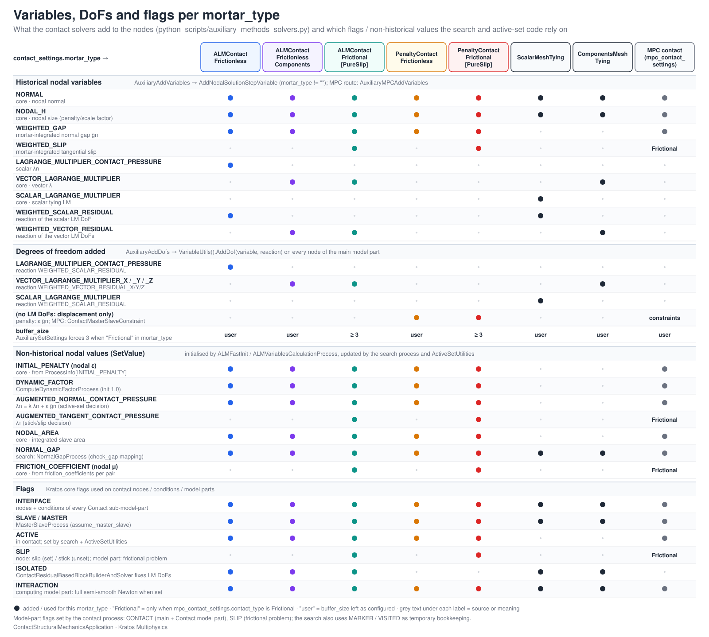

> **Sources.** Thesis §4.3.3.3 (ALM parameters), §4.3.3.6 and §4.3.4.5 (active and slip sets); code: `contact_structural_mechanics_application_variables.{h,cpp}`, `contact_structural_mechanics_application.cpp` (`Register()`), `custom_python/contact_structural_mechanics_python_application.cpp:49-95`, `python_scripts/auxiliary_methods_solvers.py:122-170`, `python_scripts/search_base_process.py`, `python_scripts/alm_contact_process.py`, `python_scripts/mpc_contact_process.py`, `custom_processes/base_contact_search_process.h`, `custom_linear_solvers/mixedulm_linear_solver.h`, `custom_strategies/custom_convergencecriterias/*.h`, `custom_utilities/active_set_utilities.cpp`, `kratos/includes/variables.h`, `kratos/includes/mapping_variables.h`, `kratos/includes/mortar_classes.h`.

The application communicates between its Python layer, its processes, its strategies and its conditions almost exclusively through **variables** (stored in the `ProcessInfo`, in the `Properties` of a pair, or on the nodes as historical or non-historical values) and through **flags** (on nodes, conditions and model parts). This page is the reference for all of them. It complements the [Architecture](Architecture.html#data-model-model-parts-properties-and-flags) page, which explains *when* they are set during a time step, and the [Conditions](Conditions.html#what-the-conditions-read-from-properties-and-processinfo) page, which lists the subset consumed at assembly time. Nothing here is a user setting: the JSON keys that produce these values are documented in the [Solver settings reference](../Usage/Solver_Settings_Reference.html) and the [Contact process settings reference](../Usage/Contact_Process_Settings_Reference.html).

<p align="center"></p>
<p align="center"><em>Figure: what each `mortar_type` adds to the nodes (historical variables and DoFs) and which non-historical values and flags the search and active-set code rely on.</em></p>

## Application variables

The 34 variables below are declared in `contact_structural_mechanics_application_variables.h` with `KRATOS_DEFINE_APPLICATION_VARIABLE(CONTACT_STRUCTURAL_MECHANICS_APPLICATION, <type>, <NAME>)` (or the `_3D_..._WITH_COMPONENTS` form, which also creates the `_X`, `_Y`, `_Z` components), created in `contact_structural_mechanics_application_variables.cpp` and registered in `KratosContactStructuralMechanicsApplication::Register()`. The *group* column follows the comment blocks of the header; *storage* tells where the value normally lives (`PI` = `ProcessInfo`, `Prop` = pair `Properties`, `N-hist` = nodal historical, `N-val` = nodal non-historical `SetValue`, `C-val` = condition `SetValue`). The "written by / read by" columns were obtained by searching every `.h`, `.cpp` and `.py` of the application (tests excluded).

### MPC contact

| Variable | Type | Storage | Purpose | Written by | Read by |
|---|---|---|---|---|---|
| `CONSTRAINT_POINTER` | `MasterSlaveConstraint::Pointer` | C-val | The `ContactMasterSlaveConstraint` owned by an `MPCMortarContactCondition` | `MPCContactSearchProcess` when it creates a pair (`custom_processes/mpc_contact_search_process.cpp`) | `MPCMortarContactCondition` (`Initialize`, `InitializeSolutionStep`, `InitializeNonLinearIteration`, `ConstraintDofDatabaseUpdate`), `MPCContactCriteria`, `ResidualBasedNewtonRaphsonMPCContactStrategy` |
| `REACTION_CHECK_STIFFNESS_FACTOR` | `double` | PI | Factor applied to the reaction in the tension check that releases MPC-constrained nodes | `MPCContactProcess` (`mpc_contact_process.py:339`, from `reaction_check_stiffness_factor`) | `MPCContactCriteria` |

### Mortar general

| Variable | Type | Storage | Purpose | Written by | Read by |
|---|---|---|---|---|---|
| `CONSIDER_TESSELLATION` | `bool` | Prop | Tessellate the clipped polygon instead of using the exact triangulation in `ExactMortarIntegrationUtility` | `SearchBaseProcess` (`search_base_process.py:180`, from `consider_tessellation`) | `MortarContactCondition::CalculateConditionSystem`, `MeshTyingMortarCondition::Initialize`, `NormalGapProcess`, `MortarExplicitContributionUtilities` |
| `INNER_LOOP_ITERATION` | `int` | PI | Counter of the inner loop of the simplified semi-smooth Newton (`INTERACTION` not set) | `ResidualBasedNewtonRaphsonContactStrategy::SolveSolutionStep` (`residualbased_newton_raphson_contact_strategy.h:496, 511`) | `auxiliary_methods_solvers.py:186-187` (convergence-criteria parameters) |
| `INTEGRATION_ORDER_CONTACT` | `int` | Prop | Gauss order on every integration cell, 1–5 (default 2) | `SearchBaseProcess` (`search_base_process.py:179, 409`, from `integration_order`) | `GetIntegrationMethod` of the mortar and mesh-tying conditions, `CalculateConditionSystem`, `AddExplicitContribution` of every family, `MPCMortarContactCondition` |
| `DISTANCE_THRESHOLD` | `double` | PI | Maximum slave-master distance accepted by the segmentation and the gap mapper | `SearchBaseProcess` (`search_base_process.py:405`, fixed to `1.0e24`) | `CalculateConditionSystem`, `AdvancedContactSearchProcess`, `NormalGapProcess`, `MPCContactCriteria`, `MortarExplicitContributionUtilities` |
| `ZERO_TOLERANCE_FACTOR` | `double` | PI | Multiplier of the machine epsilon used as geometric tolerance by the segmentation | `SearchBaseProcess` (`search_base_process.py:391`, from `zero_tolerance_factor`) | `CalculateConditionSystem`, `NormalGapProcess`, `MortarExplicitContributionUtilities` |
| `ACTIVE_CHECK_FACTOR` | `double` | PI and Prop | Fraction of the nodal size `NODAL_H` below which a node is activated by the search (thesis §4.4) | `SearchBaseProcess` (`search_base_process.py:392, 410`, from `search_parameters.active_check_factor`) | `BaseContactSearchProcess` (`base_contact_search_process.cpp:654, 766`), `AdvancedContactSearchProcess` |
| `SLIP_THRESHOLD` | `double` | PI | Threshold on the augmented tangential pressure that separates stick from slip in the active-set update | `ALMContactProcess` (`alm_contact_process.py:413`, frictional only) | `ActiveSetUtilities::ComputeALMFrictionalActiveSet` (`active_set_utilities.cpp:293`) |
| `AUXILIAR_COORDINATES` (+ `_X/_Y/_Z`) | `array_1d<double,3>` | N-val | Coordinates used by the gap mapper (`MappingCheck`) as origin of the projection | `NormalGapProcess` (`normal_gap_process.cpp:40-49`) | `NormalGapProcess` (through `SimpleMortarMapperProcess`); dumped by the `debug_mode` GiD output |
| `DELTA_COORDINATES` (+ `_X/_Y/_Z`) | `array_1d<double,3>` | N-val | Predicted displacement increment used to move the nodes before a dynamic search | `ContactUtilities::ComputeStepJump` (`contact_utilities.cpp:114`) | `BaseContactSearchProcess` (`base_contact_search_process.cpp:463, 545, 1416`), `ContactUtilities` (debug check at l. 232) |
| `NORMAL_GAP` | `double` | N-val | Geometric (not integrated) normal gap of a slave node, obtained by projection or mapping | `NormalGapProcess`, `BaseContactSearchProcess`, `SimpleContactSearchProcess`, `AdvancedContactSearchProcess` | `ActiveSetUtilities`, `ComputeDynamicFactorProcess`, the search (`check_gap`) |
| `TANGENT_SLIP` (+ `_X/_Y/_Z`) | `array_1d<double,3>` | N-val | Geometric tangential slip | nobody (only a commented-out debugging block in `active_set_utilities.cpp:116-118`) | nobody; registered and exposed but currently unused |

### Weighted (mortar-integrated) quantities

| Variable | Type | Storage | Purpose | Written by | Read by |
|---|---|---|---|---|---|
| `WEIGHTED_GAP` | `double` | N-hist | Integrated (weighted) normal gap $$\tilde{g}_{n,j} = \mathbf{n}_j \cdot (\mathbf{D}\mathbf{x}^{(1)} - \mathbf{M}\mathbf{x}^{(2)})_j$$ of slave node $$j$$ | `MortarExplicitContributionUtilities::AddExplicitContributionOfMortarCondition` / `...FrictionalCondition` (called through `AddExplicitContribution` of every condition, `mortar_explicit_contribution_utilities.cpp:153, 329`); reset by `ALMFastInit` and `BaseContactSearchProcess` | `ActiveSetUtilities`, `BaseMortarConvergenceCriteria` and every mortar criteria, `ResidualBasedNewtonRaphsonContactStrategy::Predict`, `AALMAdaptPenaltyValueProcess`, `ComputeDynamicFactorProcess`, `CoulombFrictionalLaw`, `MPCMortarContactCondition`, `MPCContactCriteria`, `AdvancedContactSearchProcess` |
| `WEIGHTED_SLIP` (+ `_X/_Y/_Z`) | `array_1d<double,3>` | N-hist | Integrated tangential slip increment of a slave node | `AddExplicitContributionOfMortarFrictionalCondition` (`mortar_explicit_contribution_utilities.cpp:338`); reset by `ALMFastInit`, `BaseContactSearchProcess` | `ActiveSetUtilities::ComputeALMFrictionalActiveSet`, frictional criteria, `MPCMortarContactCondition::CalculateRightHandSide`, `MPCContactCriteria`, `ContactUtilities` |
| `WEIGHTED_SCALAR_RESIDUAL` | `double` | N-hist | Reaction of the scalar multiplier DoF (`LAGRANGE_MULTIPLIER_CONTACT_PRESSURE` or `SCALAR_LAGRANGE_MULTIPLIER`) | the builder-and-solver, as reaction variable of the DoF (`auxiliary_methods_solvers.py:160, 166`) | `BaseContactSearchProcess` (reset), `MeshTyingProcess` |
| `WEIGHTED_VECTOR_RESIDUAL` (+ `_X/_Y/_Z`) | `array_1d<double,3>` | N-hist | Reaction of the vector multiplier DoFs (`VECTOR_LAGRANGE_MULTIPLIER_X/Y/Z`) | the builder-and-solver (`auxiliary_methods_solvers.py:162-164, 168-170`) | `BaseContactSearchProcess` (reset), `MeshTyingProcess` |

The two residual variables exist only because `VariableUtils().AddDof(variable, reaction, model_part)` requires a reaction variable; the `# TODO Remove WEIGHTED_SCALAR_RESIDUAL in case of check for reaction is defined` comments in `auxiliary_methods_solvers.py:159, 161` acknowledge that no criterion reads them.

### Augmented Lagrangian method

| Variable | Type | Storage | Purpose | Written by | Read by |
|---|---|---|---|---|---|
| `ACTIVE_SET_COMPUTED` | `bool` | PI | Guard so that the active set is evaluated once per iteration even if several criteria are combined | `BaseMortarConvergenceCriteria` (`base_mortar_criteria.h:306, 390`, reset to `false`), the ALM mortar criteria (set to `true` after the check, e.g. `alm_frictional_mortar_criteria.h:201`) | the ALM mortar criteria and the `displacement_lagrangemultiplier_*_frictional_contact_criteria` |
| `ACTIVE_SET_CONVERGED` | `bool` | PI | Result of the active-set check (no node changed status) | `ALMContactProcess` / `MPCContactProcess` (initialized to `true`, `alm_contact_process.py:375`, `mpc_contact_process.py:338`), the ALM and penalty mortar criteria (`alm_frictional_mortar_criteria.h:199`) | the same criteria (`PostCriteria`) |
| `SLIP_SET_CONVERGED` | `bool` | PI | Result of the stick/slip check | `ALMFrictionalMortarConvergenceCriteria` (`alm_frictional_mortar_criteria.h:200`) | `ALMFrictionalMortarConvergenceCriteria` (l. 206) |
| `OPERATOR_THRESHOLD` | `double` | PI | Threshold on the Frobenius norm of $$\mathbf{D}-\mathbf{D}_{old}$$ and $$\mathbf{M}-\mathbf{M}_{old}$$ that selects the objective slip formulation | `ALMContactProcess` (`alm_contact_process.py:380`, from `operator_threshold`) | generated `AugmentedLagrangianMethodFrictionalMortarContactCondition::CalculateLocalLHS/RHS` (`ALM_frictional_mortar_contact_condition.cpp:201`) |
| `SLIP_AUGMENTATION_COEFFICIENT` | `double` | PI | Coefficient that augments the tangential pressure with the slip in the stick/slip decision | `ALMContactProcess` (`alm_contact_process.py:412`) | `ActiveSetUtilities::ComputeALMFrictionalActiveSet` (`active_set_utilities.cpp:294`) |
| `DYNAMIC_FACTOR` | `double` | N-val | Nodal factor multiplying the displacement equations of the contact condition in dynamics to account for the gap evolution within the step | `ComputeDynamicFactorProcess`, initialized to 1 by `ALMFastInit` | generated code of all five families (`GetVariableVector(slave, DYNAMIC_FACTOR)`), `BaseMortarConvergenceCriteria` (`COMPUTE_DYNAMIC_FACTOR`) |
| `LAGRANGE_MULTIPLIER_CONTACT_PRESSURE` | `double` | N-hist (DoF) | Scalar normal multiplier $$\lambda_n$$ of the `ALMContactFrictionless` formulation | the linear solver (it is a DoF); predicted by `ResidualBasedNewtonRaphsonContactStrategy::Predict`; reset by the search and `ALMFastInit` | generated frictionless code (`LMNormal`), `ActiveSetUtilities::ComputeALMFrictionlessActiveSet`, `ContactResidualBasedBlockBuilderAndSolver::FixIsolatedNodes`, the displacement/LM criteria, `BaseMortarConvergenceCriteria` (output) |
| `AUGMENTED_NORMAL_CONTACT_PRESSURE` | `double` | N-val | Augmented normal pressure $$\bar{\lambda}_n = k \lambda_n + \varepsilon \tilde{g}_n$$ (divided by the nodal area for output) | `ActiveSetUtilities` (frictionless and frictional active-set functions); zeroed by `ALMFastInit` and `ALMContactProcess` (`alm_contact_process.py:198, 281`) | `CoulombFrictionalLaw::GetThresholdValue`, `ContactSPRErrorProcess`, `BaseMortarConvergenceCriteria` (output), `ALMContactProcess` / `MPCContactProcess` (total contact force, `alm_contact_process.py:257-258`), the adaptive-remeshing scripts |
| `AUGMENTED_TANGENT_CONTACT_PRESSURE` (+ `_X/_Y/_Z`) | `array_1d<double,3>` | N-val | Augmented tangential pressure of a frictional node | `ActiveSetUtilities::ComputeALMFrictionalActiveSet`; zeroed by `ALMFastInit` | `BaseMortarConvergenceCriteria` (output), `ALMContactProcess` (debug output) |
| `CONSIDER_NORMAL_VARIATION` | `int` | PI | Integer cast to `NormalDerivativesComputation` (see enums) that controls the normal update and the normal derivatives | `ALMContactProcess` (`alm_contact_process.py:373, 407`, from `normal_variation`) | `PairedCondition::InitializeNonLinearIteration`, `MortarContactCondition::CalculateConditionSystem`, `BaseMortarConvergenceCriteria` |
| `ADAPT_PENALTY` | `bool` | PI | Whether the adapted augmented Lagrangian (AALM) penalty update is active | `ALMContactProcess` (`alm_contact_process.py:378`, from `advance_ALM_parameters.adapt_penalty`) | `BaseMortarConvergenceCriteria::PreCriteria` (runs `AALMAdaptPenaltyValueProcess`) |
| `MAX_GAP_FACTOR` | `double` | PI | Ratio between `NODAL_H` and the maximum admissible gap used when re-scaling the penalty | `ALMContactProcess` (`alm_contact_process.py:379`) | `AALMAdaptPenaltyValueProcess`, `ComputeDynamicFactorProcess` |

### Mesh tying, explicit and frictional laws

| Variable | Type | Storage | Purpose | Written by | Read by |
|---|---|---|---|---|---|
| `TYING_VARIABLE` | `std::string` | Prop | Name of the variable tied by `MeshTyingMortarCondition` (default `"DISPLACEMENT"`) | `MeshTyingProcess` (`mesh_tying_process.py:216`) | `MeshTyingMortarCondition::Initialize` (`mesh_tying_mortar_condition.cpp:72-100`) |
| `PARENT_ELEMENT` | `Element::Pointer` | C-val | Element attached to a skin condition (intended for mesh tying with static condensation) | `AssignParentElementConditionsProcess` (`assign_parent_element_conditions_process.cpp:72`) | nobody else in the application |
| `MAX_GAP_THRESHOLD` | `double` | PI | Gap above which the explicit penalty is re-scaled | `ExplicitPenaltyContactProcess` (`explicit_penalty_contact_process.py:134-137`, from `advance_explicit_parameters.max_gap_threshold` or the mean `NODAL_H`) | `ComputeDynamicFactorProcess` |
| `FRICTIONAL_LAW` | `FrictionalLaw::Pointer` | – | Intended holder of the frictional law of a pair | nobody | nobody; the conditions read `FRICTION_COEFFICIENT` nodally instead ([Frictional laws and MPC constraint](Frictional_Laws_And_MPC_Constraint.html)) |
| `TRESCA_FRICTION_THRESHOLD` | `double` | Prop, N-val or PI | Constant tangential threshold of the Tresca law | user / Python | `TrescaFrictionalLaw::GetThresholdValue` (properties, then node, then process info) |

> **Note.** Three variables (`TANGENT_SLIP`, `PARENT_ELEMENT`, `FRICTIONAL_LAW`) are registered but have no consumer in the current code base, and `FRICTIONAL_LAW` is not even written. They are kept for compatibility and for the planned frictional-law refactoring.

## Kratos-core variables used by the application

These variables are defined in `kratos/includes/variables.h` (or `mapping_variables.h` for `TANGENT_FACTOR`) and are therefore available as `KratosMultiphysics.<NAME>` in Python; they play a central role in the formulation.

| Variable | Type | Storage | Role in the contact application | Written by | Read by |
|---|---|---|---|---|---|
| `SCALE_FACTOR` | `double` | PI | Scale factor $$k$$ of the multiplier equations, so that $$k \lambda_n$$ has the magnitude of a stress-like stiffness term (thesis §4.3.3.3, Tables 4.1–4.2) | `ALMContactProcess` (`alm_contact_process.py:437-447`: from `ALMVariablesCalculationProcess` when `advance_ALM_parameters.manual_ALM` is `false`, otherwise `advance_ALM_parameters.scale_factor`; forced to 1 when zero), `MeshTyingProcess` | `DerivativeData::Initialize` (`mortar_classes.h:710`, feeds the generated code), `MeshTyingMortarCondition` (LHS/RHS), `ActiveSetUtilities`, `CoulombFrictionalLaw`, `BaseContactSearchProcess` |
| `BUILD_SCALE_FACTOR` | `double` | PI | Fallback scale of the mesh-tying condition when `SCALE_FACTOR` is absent | the block builder-and-solver of the core when `use_block_builder` scaling is on | `MeshTyingMortarCondition::CalculateLocalLHS/RHS` |
| `INITIAL_PENALTY` | `double` | PI and N-val | Penalty $$\varepsilon$$ of the augmented Lagrangian / penalty formulations; the process-info value is the global default, the nodal value the one actually used | `ALMContactProcess`, `PenaltyContactProcess`, `ExplicitPenaltyContactProcess` (process info, `alm_contact_process.py:440-445`, `penalty_contact_process.py:244-251`); `ALMFastInit` and `ExplicitPenaltyContactProcess` (nodal, `explicit_penalty_contact_process.py:279`); adapted by `AALMAdaptPenaltyValueProcess` | `DerivativeData::Initialize` (`mortar_classes.h:709`, `PenaltyParameter[i] = node.GetValue(INITIAL_PENALTY)`), `ActiveSetUtilities`, `ComputeDynamicFactorProcess`, `CoulombFrictionalLaw`, `ResidualBasedNewtonRaphsonContactStrategy` |
| `FRICTION_COEFFICIENT` | `double` | Prop and N-val | Coulomb coefficient $$\mu$$ per pair (properties) copied to the slave nodes | `ALMContactProcess` / `MPCContactProcess` (`alm_contact_process.py:473-474`, `mpc_contact_process.py:399-400`, from `friction_coefficients`), `ALMFastInit` (nodal copy) | `GetFrictionCoefficient()` of the frictional conditions, `MPCMortarContactCondition::CalculateRightHandSide`, `ActiveSetUtilities`, `FrictionalLaw::GetFrictionCoefficient` |
| `TANGENT_FACTOR` | `double` | PI | Ratio between tangential and normal penalty in the stick equations (`mapping_variables.h:401`: "The factor between the tangent and normal behaviour") | `ALMContactProcess` / `MPCContactProcess` (`alm_contact_process.py:411`, `mpc_contact_process.py:367`, from `tangent_factor`) | `DerivativeDataFrictional::Initialize` (`mortar_classes.h:960`), `ActiveSetUtilities` |
| `NODAL_H` | `double` | N-hist | Nodal mesh size; reference length for the search radius, the active check and the ALM parameter estimation | `FindNodalHProcess` (core), run by `SearchBaseProcess` | `ALMVariablesCalculationProcess`, `AALMAdaptPenaltyValueProcess`, `BaseContactSearchProcess`, `ContactUtilities`, `ExplicitPenaltyContactProcess` |
| `NORMAL` | `array_1d<double,3>` | N-hist and C-val | Nodal (averaged) and condition (face) unit normals of the interface | `NormalCalculationUtils` (core) through `SearchBaseProcess` / `BaseContactSearchProcess`; inverted where needed by `NormalCheckProcess` | every condition (`GetValue(NORMAL)` for the slave face, `FastGetSolutionStepValue(NORMAL)` for the nodes in `DerivativeData`), `ActiveSetUtilities`, `NormalGapProcess`, `MPCMortarContactCondition` |
| `NODAL_AREA` | `double` | N-val | Slave nodal area (sum of the integrated dual weights) used to normalize weighted quantities into pressures/gaps | `MortarExplicitContributionUtilities::ComputeNodalArea` and the penalty `AddExplicitContribution`; reset by `ExplicitPenaltyContactProcess` (`explicit_penalty_contact_process.py:172`) | `ActiveSetUtilities`, `MPCMortarContactCondition`, `ComputeDynamicFactorProcess`, `AdvancedContactSearchProcess`, `ALMFastInit`, `ALMContactProcess` (total force) |
| `NODAL_PAUX`, `NODAL_MAUX` | `double` | N-val | Auxiliary nodal weights of the MPC route (`PAUX` = slave side, `MAUX` = master side) used to scale the constraint rows and the mapped reactions | `ResidualBasedNewtonRaphsonMPCContactStrategy` (`residualbased_newton_raphson_mpc_contact_strategy.h:828-831`, reset), `MPCContactCriteria` | `MPCMortarContactCondition::UpdateConstraint*` (`1/NODAL_PAUX`), `MPCContactCriteria` |
| `REACTION` | `array_1d<double,3>` | N-hist | Displacement reactions; in the MPC route they carry the contact force of the constrained slave nodes | the builder-and-solver | `MPCContactCriteria` (tension check, `mpc_contact_criteria.h:250, 281`), `MPCMortarContactCondition::CalculateRightHandSide` (slip force), `ALMContactProcess` / `MPCContactProcess` (output of the total reaction) |
| `CONTACT_FORCE` | `array_1d<double,3>` | N-val | Normal contact force recovered from `REACTION` in the MPC route | `MPCContactCriteria` (`mpc_contact_criteria.h:165, 260`) | post-processing |
| `CONTACT_PRESSURE` | `double` | N-val | Fallback contact pressure used by the SPR error estimator when `AUGMENTED_NORMAL_CONTACT_PRESSURE` is missing | user / other applications | `ContactSPRErrorProcess` (`contact_spr_error_process.cpp:134-198`), adaptive remeshing |
| `VECTOR_LAGRANGE_MULTIPLIER` (+ `_X/_Y/_Z`) | `array_1d<double,3>` | N-hist (DoF) | Vector multiplier $$\boldsymbol{\lambda}$$ of the `ALMContactFrictional`, `ALMContactFrictionlessComponents` and `ComponentsMeshTying` formulations | the linear solver; predicted by the strategy; reset by the search and `ALMFastInit` | generated frictional / components code, `MeshTyingMortarCondition`, `ActiveSetUtilities`, `CoulombFrictionalLaw`, `MixedULMLinearSolver`, the LM criteria |
| `SCALAR_LAGRANGE_MULTIPLIER` | `double` | N-hist (DoF) | Scalar multiplier of `ScalarMeshTying` | the linear solver | `MeshTyingMortarCondition`, `BaseContactSearchProcess`, `SimpleContactSearchProcess` |
| `THICKNESS` | `double` | Prop | Thickness used by the axisymmetric conditions in $$2\pi r/t$$ | the material JSON | the four `*AxisymCondition` classes |
| `DISPLACEMENT`, `VELOCITY`, `ACCELERATION` | `array_1d<double,3>` | N-hist | Kinematics; the frictional families need **three** buffer positions of `DISPLACEMENT` (`u1old = u(1) - u(2)`, `mortar_classes.h:962`) | the structural solver | `DerivativeData`, `ContactUtilities::ComputeStepJump`, `CheckIsolatedElement` (commented), `BaseMortarConvergenceCriteria` (dynamic factor) |
| `DELTA_TIME`, `STEP`, `NL_ITERATION_NUMBER` | `double`, `int`, `int` | PI | Time-step bookkeeping; `STEP == 1` switches `DerivativeData::Initialize` to absolute displacements; `NL_ITERATION_NUMBER` drives the convergence tables and the `Predict` of the strategy | the analysis stage and the strategy | conditions, criteria, processes |
| `ERROR_RATIO` | `double` | PI | Estimated error ratio of the SPR estimator | `ContactSPRErrorProcess` | `ContactErrorMeshCriteria` |

## Nodal variables and DoFs added by the solvers

The contact solvers call `AuxiliaryAddVariables(main_model_part, mortar_type)` inside `AddVariables` and `AuxiliaryAddDofs(main_model_part, mortar_type)` inside `AddDofs` (`python_scripts/auxiliary_methods_solvers.py:122-170`), on top of what the structural solver adds (`DISPLACEMENT`, `REACTION`, `VELOCITY`, `ACCELERATION`, ...). `NORMAL` and `NODAL_H` are added for every non-empty `mortar_type`; the MPC solvers use `AuxiliaryMPCAddVariables` (l. 150-156) instead and add no multiplier DoF.

| `mortar_type` | Historical variables added | DoFs added (reaction variable) | Conditions that use it |
|---|---|---|---|
| `ALMContactFrictionless` | `NORMAL`, `NODAL_H`, `LAGRANGE_MULTIPLIER_CONTACT_PRESSURE`, `WEIGHTED_GAP`, `WEIGHTED_SCALAR_RESIDUAL` | `LAGRANGE_MULTIPLIER_CONTACT_PRESSURE` (`WEIGHTED_SCALAR_RESIDUAL`) | `ALM[NV]Frictionless[Axisym]MortarContactCondition*` |
| `ALMContactFrictionlessComponents` | `NORMAL`, `NODAL_H`, `VECTOR_LAGRANGE_MULTIPLIER`, `WEIGHTED_GAP`, `WEIGHTED_VECTOR_RESIDUAL` | `VECTOR_LAGRANGE_MULTIPLIER_X/Y/Z` (`WEIGHTED_VECTOR_RESIDUAL_X/Y/Z`) | `ALM[NV]FrictionlessComponentsMortarContactCondition*` |
| `ALMContactFrictional` (also the `ALMContactFrictionalPureSlip` variant, matched with `"ALMContactFrictional" in mortar_type`) | `NORMAL`, `NODAL_H`, `VECTOR_LAGRANGE_MULTIPLIER`, `WEIGHTED_GAP`, `WEIGHTED_SLIP`, `WEIGHTED_VECTOR_RESIDUAL` | `VECTOR_LAGRANGE_MULTIPLIER_X/Y/Z` (`WEIGHTED_VECTOR_RESIDUAL_X/Y/Z`) | `ALM[NV]Frictional[Axisym]MortarContactCondition*` |
| `PenaltyContactFrictionless` | `NORMAL`, `NODAL_H`, `WEIGHTED_GAP` | none | `Penalty[NV]Frictionless[Axisym]MortarContactCondition*` |
| `PenaltyContactFrictional` (and its `PureSlip` variant) | `NORMAL`, `NODAL_H`, `WEIGHTED_GAP`, `WEIGHTED_SLIP` | none | `Penalty[NV]Frictional[Axisym]MortarContactCondition*` |
| `ScalarMeshTying` | `NORMAL`, `NODAL_H`, `SCALAR_LAGRANGE_MULTIPLIER`, `WEIGHTED_SCALAR_RESIDUAL` | `SCALAR_LAGRANGE_MULTIPLIER` (`WEIGHTED_SCALAR_RESIDUAL`) | `MeshTyingMortarCondition*` with a scalar `TYING_VARIABLE` |
| `ComponentsMeshTying` | `NORMAL`, `NODAL_H`, `VECTOR_LAGRANGE_MULTIPLIER`, `WEIGHTED_VECTOR_RESIDUAL` | `VECTOR_LAGRANGE_MULTIPLIER_X/Y/Z` (`WEIGHTED_VECTOR_RESIDUAL_X/Y/Z`) | `MeshTyingMortarCondition*` with `DISPLACEMENT` |
| MPC solvers (`AuxiliaryMPCAddVariables`, `contact_type`) | `NORMAL`, `NODAL_H`, `WEIGHTED_GAP` (+ `WEIGHTED_SLIP` if `Frictional`) | none | `MPCMortarContactCondition*` |

The multiplier DoFs are added to *all* nodes of the main model part (`VariableUtils().AddDof(..., main_model_part)`); the block builder-and-solver fixes the ones that do not belong to an active slave node ([Builder and solvers and linear solvers](Builder_And_Solvers_And_Linear_Solvers.html)). Because the frictional formulations difference the displacement over two previous steps, the contact solvers raise the minimum buffer size to 3 for `ALMContactFrictional*` and `PenaltyContactFrictional*` ([Solver settings reference](../Usage/Solver_Settings_Reference.html)).

## Enumerations

| Enum | Defined in | Enumerators | Used for | Python |
|---|---|---|---|---|
| `FrictionalCase` | `contact_structural_mechanics_application_variables.h:46-52` | `FRICTIONLESS = 0`, `FRICTIONLESS_COMPONENTS = 1`, `FRICTIONAL = 2`, `FRICTIONLESS_PENALTY = 3`, `FRICTIONAL_PENALTY = 4` | Template parameter `TFrictional` of `MortarContactCondition`, `DerivativesUtilities`, `MortarExplicitContributionUtilities` and the frictional laws; selects `MatrixSize`, the derivative-data type and the multiplier DoFs ([Conditions](Conditions.html#the-frictionalcase-enum)) | not exposed (compile-time only) |
| `NormalDerivativesComputation` | `contact_structural_mechanics_application_variables.h:57-62` | `NO_DERIVATIVES_COMPUTATION = 0`, `ELEMENTAL_DERIVATIVES = 1`, `NODAL_ELEMENTAL_DERIVATIVES = 2`, `NO_DERIVATIVES_COMPUTATION_WITH_NORMAL_UPDATE = 3` | Value of `CONSIDER_NORMAL_VARIATION`: `0` freezes the normals within the step; `1` and `2` linearize the normals (elemental only, or nodal averaged from the elemental ones) and update them every iteration; `3` updates them without derivatives | `KratosMultiphysics.ContactStructuralMechanicsApplication.NormalDerivativesComputation` (`contact_structural_mechanics_python_application.cpp:49-54`); `ALMContactProcess` maps the `normal_variation` string (`no_derivatives_computation`, `elemental_derivatives`, `nodal_elemental_derivatives`, `no_derivatives_computation_with_normal_update`) to it |
| `BaseContactSearchProcess::SearchTreeType` | `custom_processes/base_contact_search_process.h:115-122` | `KdtreeInRadius = 0`, `KdtreeInBox = 1`, `KdtreeInRadiusWithOBB = 2`, `KdtreeInBoxWithOBB = 3`, `OctreeWithOBB = 4`, `Kdop = 5` | Spatial search algorithm chosen from `search_parameters.type_search` ([Search pipeline and bounding volumes](../Contact_Search/Search_Pipeline_And_Bounding_Volumes.html)) | not exposed; selected by string |
| `BaseContactSearchProcess::CheckGap` | `custom_processes/base_contact_search_process.h:136-140` | `NoCheck = 0`, `DirectCheck = 1`, `MappingCheck = 2` | How the gap of a candidate pair is evaluated before activation (`search_parameters.check_gap`) ([Gap computation](../Contact_Search/Gap_Computation.html)) | not exposed; selected by string |
| `BaseContactSearchProcess::TypeSolution` | `custom_processes/base_contact_search_process.h:145-153` | `NormalContactStress = 0`, `ScalarLagrangeMultiplier = 1`, `VectorLagrangeMultiplier = 2`, `FrictionlessPenaltyMethod = 3`, `FrictionalPenaltyMethod = 4`, `OtherFrictionless = 5`, `OtherFrictional = 6` | Tells the search which nodal unknown to reset when a pair is (de)activated (scalar LM, vector LM, or none for penalty and MPC); deduced from the condition name | not exposed |
| `MixedULMLinearSolver::BlockType` | `custom_linear_solvers/mixedulm_linear_solver.h:76-83` | `OTHER`, `MASTER`, `SLAVE_INACTIVE`, `SLAVE_ACTIVE`, `LM_INACTIVE`, `LM_ACTIVE` | Classification of every DoF of the system from the `MASTER` / `SLAVE` / `ACTIVE` node flags before the block condensation ([Builder and solvers and linear solvers](Builder_And_Solvers_And_Linear_Solvers.html)) | not exposed |

## Python exposure

`custom_python/contact_structural_mechanics_python_application.cpp:49-95` exposes the `NormalDerivativesComputation` enum and registers the variables with `KRATOS_REGISTER_IN_PYTHON_VARIABLE` / `KRATOS_REGISTER_IN_PYTHON_3D_VARIABLE_WITH_COMPONENTS`, so that they are reachable as `KratosMultiphysics.ContactStructuralMechanicsApplication.<NAME>` (the scripts of the application import the module as `CSMA`). The following details are worth knowing:

- **Not exposed**: `CONSTRAINT_POINTER`, `PARENT_ELEMENT` and `FRICTIONAL_LAW`. Their types (`MasterSlaveConstraint::Pointer`, `Element::Pointer`, `FrictionalLaw::Pointer`) have no `Variable<>` binding in Python, so these three can only be read or written from C++.
- **Registered twice**: `ACTIVE_CHECK_FACTOR` appears at lines 70 and 78 of the binding file. The second registration overwrites the first attribute with the same object; it is harmless.
- **Core variable re-registered**: `TANGENT_FACTOR` (line 88) is a Kratos-core variable from `mapping_variables.h` that is registered again in this module, so it exists both as `KratosMultiphysics.TANGENT_FACTOR` and as `KratosMultiphysics.ContactStructuralMechanicsApplication.TANGENT_FACTOR` (the application scripts use `KM.TANGENT_FACTOR`).
- The component variables (`WEIGHTED_SLIP_X`, `AUGMENTED_TANGENT_CONTACT_PRESSURE_Y`, ...) are created by the `_3D_VARIABLE_WITH_COMPONENTS` macros and are usable as any other `double` variable, for instance in `WriteNodalResults` or `AssignScalarVariableProcess`.

A minimal example of reading contact results from Python after a solve:

```python
import KratosMultiphysics as KM
import KratosMultiphysics.ContactStructuralMechanicsApplication as CSMA

contact_model_part = model["Structure.Contact"]
for node in contact_model_part.Nodes:
    if node.Is(KM.SLAVE) and node.Is(KM.ACTIVE):
        gap      = node.GetSolutionStepValue(CSMA.WEIGHTED_GAP)               # historical
        pressure = node.GetValue(CSMA.AUGMENTED_NORMAL_CONTACT_PRESSURE)      # non-historical
        lm       = node.GetSolutionStepValue(CSMA.LAGRANGE_MULTIPLIER_CONTACT_PRESSURE)
```

## Flags

Kratos flags are bits stored on any `Flags`-derived object (nodes, conditions, elements, model parts, and also the `ProcessInfo` and the processes themselves). The application uses the **core flags** listed below with an entity-dependent meaning, plus a few **local flags** defined by its own classes. The [Architecture](Architecture.html#flags) page shows when each flag is set during a time step; this table is the exhaustive reference.

### Core flags

| Flag | On nodes | On conditions | On model parts / process info / other |
|---|---|---|---|
| `ACTIVE` | Slave node in the active contact set: its augmented pressure says "in contact" (thesis §4.3.3.6). Set by the search when a pair is created (`BaseContactSearchProcess`, honoring `ACTIVE_CHECK_FACTOR`) and updated every iteration by `ActiveSetUtilities::ComputeALMFrictionlessActiveSet` / `ComputePenaltyFrictionlessActiveSet` / `ComputeALMFrictionalActiveSet` / `ComputePenaltyFrictionalActiveSet`. `MixedULMLinearSolver` classifies slave DoFs as `SLAVE_ACTIVE` / `SLAVE_INACTIVE` with it | Pair condition with at least one active slave node (`ContactUtilities::ActivateConditionWithActiveNodes`); inactive pairs are skipped by the builder-and-solver. `MeshTyingMortarCondition::Initialize` deactivates a pair whose intersection is empty | – |
| `SLIP` | Frictional state of an active slave node: set = slip, unset = stick (`ActiveSetUtilities::ComputeALMFrictionalActiveSet`, thesis §4.3.4.5). The frictional conditions branch on it (`GetActiveInactiveValue`, generated code) | `MPCMortarContactCondition` selects `UpdateConstraintFrictional` and the slip force of its RHS with it; `MPCContactProcess` sets it on the conditions of a frictional problem | Main and `Contact` model parts: *the problem is frictional* (`alm_contact_process.py:395-401`); read by `BaseContactSearchProcess`, `ALMFastInit`, `InterfacePreprocessCondition`, `BaseMortarConvergenceCriteria::PreCriteria` |
| `SLAVE` / `MASTER` | Side of an interface node (`SearchBaseProcess._assign_slave_flags` / `_assign_master_flags`, then `MasterSlaveProcess` fixes nodes shared by both sides). `ActiveSetUtilities` only visit `SLAVE` nodes; `MixedULMLinearSolver::BlockType` uses both; the block builder-and-solver fixes the multiplier DoFs of non-slave nodes | Side of a skin condition; the search pairs `SLAVE` conditions with `MASTER` candidates when `predefined_master_slave` is `true` (otherwise both directions are tried) | Sub-model-parts `MasterSubModelPart<id>` / `SlaveSubModelPart<id>` group the flagged entities |
| `INTERFACE` | Node of a contact interface (`search_base_process.py:682`) | Skin condition of a contact interface (`search_base_process.py:685`); `InterfacePreprocessCondition` and `NormalCheckProcess` only visit `INTERFACE` entities | – |
| `ISOLATED` | Slave node all of whose pairs are isolated: `ContactResidualBasedBlockBuilderAndSolver::FixIsolatedNodes` fixes its multiplier DoFs and `FreeIsolatedNodes` releases them afterwards (`contact_residualbased_block_builder_and_solver.h:289-350`) | Pair whose segmentation produced no (or a negligible, below $$10^{-5}$$ of the slave area) intersection: `MortarContactCondition::CalculateConditionSystem` sets it and zeroes the local system (`mortar_contact_condition.cpp:422`); `CheckIsolatedElement` returns it; `Initialize` resets it | – |
| `INTERACTION` | – | `MPCMortarContactCondition::InitializeNonLinearIteration` rebuilds its constraint only if the condition `Is(INTERACTION)` (`mpc_mortar_contact_condition.cpp:183`); set by `ResidualBasedNewtonRaphsonMPCContactStrategy` when `update_each_nl_iteration` is `true` | Computing model part: full semi-smooth Newton (active set updated inside the Newton loop) when set, simplified semi-smooth Newton with inner loop when not (`contact_structural_mechanics_static_solver.py:91-96`, `residualbased_newton_raphson_contact_strategy.h:465-515`); also on the process info of the MPC strategy |
| `CONTACT` | Node carrying a contact constraint in `ContactSPRErrorProcess` | – | Main model part: a contact process is present (`alm_contact_process.py:393`); the explicit solver scales `DELTA_TIME` by `delta_time_factor_for_contact` when the computing model part `Is(CONTACT)` |
| `RIGID` | – | `MPCMortarContactCondition` selects `UpdateConstraintTying` (rigid coupling, that is mesh tying through constraints) | Main model part in `MPCContactProcess` when the problem is tying rather than contact (`mpc_contact_process.py:158-162`); `MeshTyingProcess` also flags its model part |
| `VISITED` | Bookkeeping of `FixIsolatedNodes` (slave nodes already treated) | Bookkeeping of `FindIntersectedGeometricalObjectsWithOBBContactSearchProcess` to avoid testing the same intersection twice | – |
| `MARKER` | Node that must *not* be deactivated by the search in the current step (`base_contact_search_process.cpp:1508-1531`), reset by `SearchBaseProcess.ExecuteInitializeSolutionStep`; `NormalCheckProcess` marks entities whose normal must be inverted | Pair or constraint already visited in `ClearMortarConditions` / `MPCContactSearchProcess` | – |
| `MODIFIED` | – | Frictional generated code: *non-objective* slip formulation selected because the change of the mortar operators is below `OPERATOR_THRESHOLD` (`ALM_frictional_mortar_contact_condition.cpp:205`) | Root / main model part: the mesh has been remeshed, so `SearchBaseProcess` rebuilds the `Contact` sub-model-part and `BaseContactSearchProcess` clears all pairs (`base_contact_search_process.cpp:1695`) |
| `TO_ERASE` | – | Skin conditions of the interface regenerated after remeshing, and pair conditions scheduled for removal by `ClearMortarConditions` / `RemoveConditions` | – |
| `BLOCKED` | – | `MPCMortarContactCondition::InitializeSolutionStep` skips the constraint update when the condition `Is(BLOCKED)`; `MPCContactProcess.ExecuteFinalizeSolutionStep` blocks all conditions when `update_condition_relation_step` is `false` (`mpc_contact_process.py:282-283`) so the relation matrix is frozen after the first step | – |
| `SELECTED` | – | Skin conditions whose oriented bounding boxes intersect, in `FindIntersectedGeometricalObjectsWithOBBContactSearchProcess` (`find_intersected_geometrical_objects_with_obb_for_contact_search_process.cpp:160-177`) and consumed by `BaseContactSearchProcess` (`base_contact_search_process.cpp:748-775`) | – |
| `TO_SPLIT` | – | – | Computing model part: set by the contact solvers when the elimination builder-and-solver *with constraints* is used (`contact_structural_mechanics_static_solver.py:149`), so that `MixedULMLinearSolver` classifies the DoFs from the reduced system instead of from the node ids (`mixedulm_linear_solver.h:520, 606`) |
| `BOUNDARY` | – | – | On the `FindIntersectedGeometricalObjectsWithOBBContactSearchProcess` object itself: whether the OBB-based intersection is active (`...obb_for_contact_search_process.cpp:65-69`) |

### Local flags

Local flags are declared with `KRATOS_DEFINE_LOCAL_FLAG` inside a class and are set on the object itself (a process, a criterion or a linear solver), usually from its JSON settings in the constructor:

| Class (file) | Local flags | Meaning |
|---|---|---|
| `BaseContactSearchProcess` (`custom_processes/base_contact_search_process.h:102-106`) | `INVERTED_SEARCH` | Search from master to slave (`inverted_search`) |
| | `CREATE_AUXILIAR_CONDITIONS` | A `condition_name` was given, so pair conditions are created (otherwise the search only pairs and flags) |
| | `MULTIPLE_SEARCHS` | An `id_name` was given: several interfaces, each with its own `ComputingContactSub<id_name>` |
| | `PREDEFINE_MASTER_SLAVE` | `predefined_master_slave`: the user fixed which side is slave |
| | `PURE_SLIP` | `pure_slip`: every active node is treated as slipping (no stick branch) |
| `BaseMortarConvergenceCriteria` (`custom_strategies/custom_convergencecriterias/base_mortar_criteria.h:74-76`) | `COMPUTE_DYNAMIC_FACTOR` | Run `ComputeDynamicFactorProcess` in `PreCriteria` (dynamic problems) |
| | `IO_DEBUG` | Write the GiD debug files with gaps, pressures and flags after every iteration |
| | `PURE_SLIP` | Pure-slip active-set check |
| `ALMFrictionlessMortarConvergenceCriteria`, `ALMFrictionlessComponentsMortarConvergenceCriteria`, `ALMFrictionalMortarConvergenceCriteria`, `PenaltyFrictionlessMortarConvergenceCriteria`, `PenaltyFrictionalMortarConvergenceCriteria` (`*_mortar_criteria.h:67-68`) | `PRINTING_OUTPUT`, `TABLE_IS_INITIALIZED` | Print the active-set table; the table header has been created |
| `MortarAndConvergenceCriteria` (`mortar_and_criteria.h:67-69`) | `PRINTING_OUTPUT`, `TABLE_IS_INITIALIZED`, `CONDITION_NUMBER_IS_INITIALIZED` | Same, plus the condition-number estimator column |
| `DisplacementContactCriteria`, `DisplacementResidualContactCriteria` (`displacement_contact_criteria.h:68-70`, `displacement_residual_contact_criteria.h:68-71`) | `PRINTING_OUTPUT`, `TABLE_IS_INITIALIZED`, `ROTATION_DOF_IS_CONSIDERED`, (`INITIAL_RESIDUAL_IS_SET`) | Table output; rotation DoFs present (shells/beams); the reference residual has been stored |
| `DisplacementLagrangeMultiplierContactCriteria`, `...MixedContactCriteria`, `...ResidualContactCriteria` (`displacement_lagrangemultiplier_*_contact_criteria.h:71-75`) | `ENSURE_CONTACT`, `PRINTING_OUTPUT`, `TABLE_IS_INITIALIZED`, `ROTATION_DOF_IS_CONSIDERED`, (`INITIAL_RESIDUAL_IS_SET`) | `ENSURE_CONTACT`: do not declare convergence while no node is active |
| `DisplacementLagrangeMultiplierFrictionalContactCriteria`, `...MixedFrictionalContactCriteria`, `...ResidualFrictionalContactCriteria` (`displacement_lagrangemultiplier_*_frictional_contact_criteria.h:73-81`) | the above plus `PURE_SLIP`, and for the residual variant `INITIAL_NORMAL_RESIDUAL_IS_SET`, `INITIAL_STICK_RESIDUAL_IS_SET`, `INITIAL_SLIP_RESIDUAL_IS_SET` | Separate reference residuals for the normal, stick and slip multiplier equations |
| `MixedULMLinearSolver` (`custom_linear_solvers/mixedulm_linear_solver.h:89-92`) | `BLOCKS_ARE_ALLOCATED`, `IS_INITIALIZED` | The sub-block matrices have been allocated; the solver has been initialized for the current DoF set |

The strategies and criteria are documented in [Strategies and convergence criteria](Strategies_And_Convergence_Criteria.html), the search flags in [Search pipeline and bounding volumes](../Contact_Search/Search_Pipeline_And_Bounding_Volumes.html) and the linear-solver flags in [Builder and solvers and linear solvers](Builder_And_Solvers_And_Linear_Solvers.html).

## Quick lookup by question

| Question | Answer |
|---|---|
| Where is the contact pressure? | `AUGMENTED_NORMAL_CONTACT_PRESSURE` (non-historical, slave nodes); the raw multiplier is `LAGRANGE_MULTIPLIER_CONTACT_PRESSURE` or `VECTOR_LAGRANGE_MULTIPLIER` (historical DoF) and must be multiplied by `SCALE_FACTOR` to become a stress |
| Where is the gap? | `WEIGHTED_GAP` (integrated, historical) divided by `NODAL_AREA` gives a length; `NORMAL_GAP` (non-historical) is the geometric projection gap of the search |
| Which nodes are in contact? | Slave nodes with `Is(ACTIVE)`; frictional state with `Is(SLIP)` |
| Which parameters does the ALM use? | `SCALE_FACTOR` (process info), `INITIAL_PENALTY` (nodal), `TANGENT_FACTOR` (process info), `DYNAMIC_FACTOR` (nodal), `FRICTION_COEFFICIENT` (nodal) |
| Why does the frictional solver need buffer size 3? | `DerivativeDataFrictional::Initialize` reads `DISPLACEMENT` at buffer positions 1 and 2 (`mortar_classes.h:962`) |
| Which variables can I print? | Every variable exposed to Python (all but `CONSTRAINT_POINTER`, `PARENT_ELEMENT`, `FRICTIONAL_LAW`); see [Output and post-processing](../Usage/Output_And_Postprocessing.html) |

Source files on GitHub: [`contact_structural_mechanics_application_variables.h`](https://github.com/KratosMultiphysics/Kratos/blob/master/applications/ContactStructuralMechanicsApplication/contact_structural_mechanics_application_variables.h), [`contact_structural_mechanics_application_variables.cpp`](https://github.com/KratosMultiphysics/Kratos/blob/master/applications/ContactStructuralMechanicsApplication/contact_structural_mechanics_application_variables.cpp), [`contact_structural_mechanics_python_application.cpp`](https://github.com/KratosMultiphysics/Kratos/blob/master/applications/ContactStructuralMechanicsApplication/custom_python/contact_structural_mechanics_python_application.cpp#L49), [`auxiliary_methods_solvers.py`](https://github.com/KratosMultiphysics/Kratos/blob/master/applications/ContactStructuralMechanicsApplication/python_scripts/auxiliary_methods_solvers.py#L122), [`base_contact_search_process.h`](https://github.com/KratosMultiphysics/Kratos/blob/master/applications/ContactStructuralMechanicsApplication/custom_processes/base_contact_search_process.h#L102), [`mixedulm_linear_solver.h`](https://github.com/KratosMultiphysics/Kratos/blob/master/applications/ContactStructuralMechanicsApplication/custom_linear_solvers/mixedulm_linear_solver.h#L76), [`kratos/includes/variables.h`](https://github.com/KratosMultiphysics/Kratos/blob/master/kratos/includes/variables.h).
