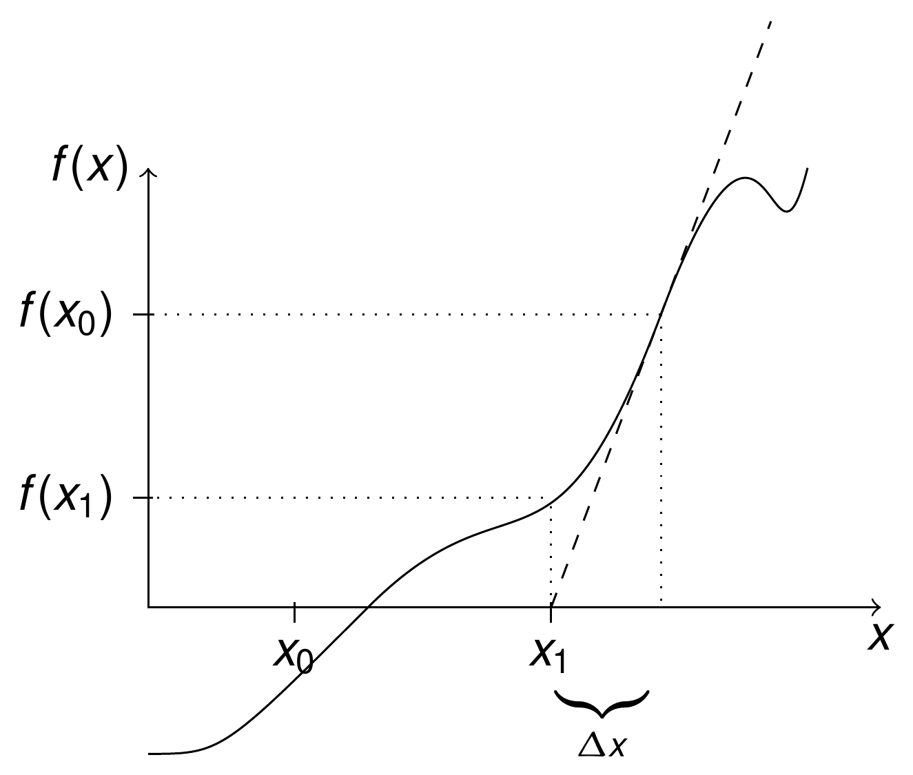
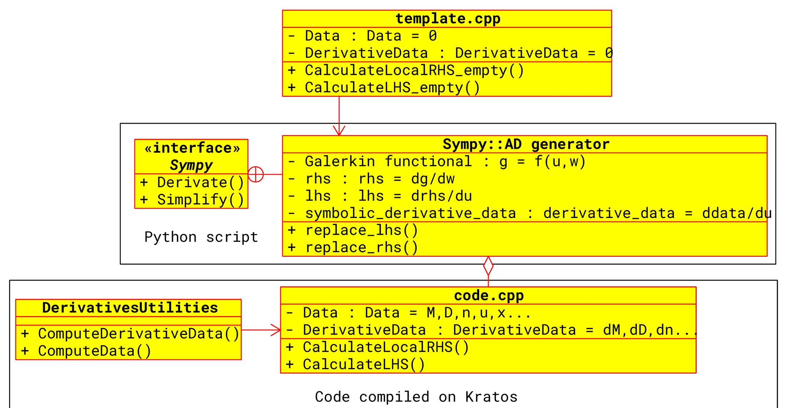
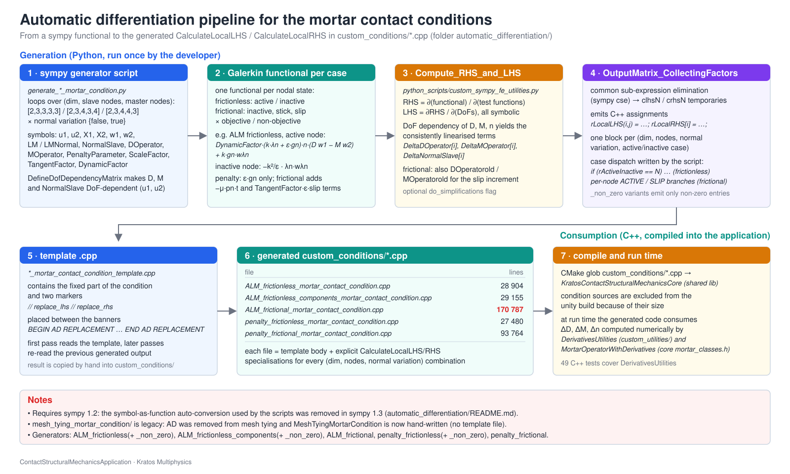

> **Sources.** Thesis Appendix C "Automatic differentiation" (pp. 305–310); code: [`automatic_differentiation/`](https://github.com/KratosMultiphysics/Kratos/tree/master/applications/ContactStructuralMechanicsApplication/automatic_differentiation) (generator scripts, templates, theory notes), [`python_scripts/custom_sympy_fe_utilities.py`](https://github.com/KratosMultiphysics/Kratos/blob/master/applications/ContactStructuralMechanicsApplication/python_scripts/custom_sympy_fe_utilities.py) built on the core [`kratos/python_scripts/sympy_fe_utilities.py`](https://github.com/KratosMultiphysics/Kratos/blob/master/kratos/python_scripts/sympy_fe_utilities.py), the generated files `custom_conditions/*_mortar_contact_condition.cpp`, and [`custom_utilities/derivatives_utilities.h`](https://github.com/KratosMultiphysics/Kratos/blob/master/applications/ContactStructuralMechanicsApplication/custom_utilities/derivatives_utilities.h) for the externally computed derivatives.

## Why the tangent is generated

A mortar contact condition contributes to the residual a functional of the displacements of the slave and master nodes, of the Lagrange multipliers and — through the mortar operators $$\mathbf{D}$$, $$\mathbf{M}$$, the slave normals and the integration cells — of the *current geometry* of both surfaces. Quadratic convergence of the Newton–Raphson method (thesis eq. C.1–C.2) requires the exact tangent of that residual with respect to every degree of freedom, including the derivatives of $$\mathbf{D}$$ and $$\mathbf{M}$$ with respect to the nodal positions, which are algorithmic quantities (results of a projection and a polygon clipping). Deriving the ~$$10^2$$–$$10^3$$ entries of each local tangent by hand for five formulations × five geometry pairs × two normal-variation modes × all active/stick/slip states is not feasible, so the application generates the code for `CalculateLocalLHS` / `CalculateLocalRHS` symbolically. The thesis presents this in Appendix C; the concept is sketched in Fig. C.1.

<p align="center"></p>
<p align="center"><em>Figure: the AD concept — a program computing $$y$$ from $$x$$ is extended to a program computing $$y$$ and $$\partial y / \partial x$$ (thesis Fig. C.1).</em></p>

## Mathematical concepts (thesis C.2–C.3.1)

**Newton–Raphson and quadratic convergence.** For a residual $$\mathbf{R}(\mathbf{u}) = \mathbf{0}$$ the Newton iteration is (thesis eq. C.1)

<p align="center">$$
\mathbf{R}(\mathbf{u}_i + \Delta\mathbf{u}_i) \approx \mathbf{R}(\mathbf{u}_i) + \frac{\partial\mathbf{R}}{\partial\mathbf{u}}(\mathbf{u}_i)\,\Delta\mathbf{u}_i = \mathbf{0}
\;\Rightarrow\;
\Delta\mathbf{u}_i = -\left[\frac{\partial\mathbf{R}}{\partial\mathbf{u}}\right]^{-1} \mathbf{R}(\mathbf{u}_i), \qquad \mathbf{u}_{i+1} = \mathbf{u}_i + \Delta\mathbf{u}_i ,
$$</p>

and converges quadratically, $$\lim_{k\to\infty} \Vert \mathbf{x}_{k+1} - \mathbf{x}_{sol} \Vert / \Vert \mathbf{x}_k - \mathbf{x}_{sol} \Vert^2 = M$$ (thesis eq. C.2), only if the tangent is consistent. Fig. C.2 illustrates the single-DoF case.

<p align="center"></p>
<p align="center"><em>Figure: Newton–Raphson iterations for a single degree of freedom (thesis Fig. C.2).</em></p>

**Derivation modes.** Automatic differentiation evaluates elementary operations whose derivatives are known and chains them exactly. With the example of thesis eq. C.4a, $$f = b\,c$$, $$b = \sum_{i=1}^n a_i^2$$, $$c = \sin b$$: the *forward mode* accumulates the derivatives of the intermediate variables with respect to the independent ones ($$\nabla b_i = 2 a_i$$, $$\nabla c_i = \cos b \, \nabla b_i$$, $$\nabla f_i = \nabla b_i\, c + b\, \nabla c_i$$; eq. C.4b), whereas the *backward mode* propagates adjoints $$\bar{x} = \partial f / \partial x$$ from the output back to the inputs (eq. C.4c). The cost of the forward mode grows with the number of independent variables, that of the backward mode with the number of scalar outputs (work ratio, eq. C.5). The implementation used here is symbolic and works in forward mode: the whole functional is written as a sympy expression and differentiated with respect to every degree of freedom.

**AD exceptions.** When the residual depends on a quantity that is itself the result of an algorithm — $$\mathbf{R}(\mathbf{u}(a), a) = 0$$ in thesis eq. C.6 — the total derivative needs the implicit part $$\partial\mathbf{R}/\partial\mathbf{u} \cdot \partial\mathbf{u}/\partial a$$ (eq. C.6d). Instead of differentiating through the algorithm, an *AD exception* declares the derivative of that quantity as an external, independently computed object (local exceptions, valid for one call, or global ones; eqs. C.8a–C.8b). In the contact conditions the exceptions are the derivatives of the mortar operators, of the dual shape functions and of the normals: they are computed numerically by `DerivativesUtilities` (see [Linearisation and derivatives](Linearisation_And_Derivatives.html)) and only *referenced* by the symbolic code.

## The Kratos integration (thesis C.3.2)

Symbolic algebra systems alone are not enough for complex non-linear finite elements: the uncontrolled growth of the expressions and the redundant operations make the generated code inefficient, and the standard common-sub-expression search of a CAS is insufficient for highly non-linear formulations. The approach taken (simpler than the techniques of AceGen, but sufficient for the contact conditions) is:

1. write a **C++ template** of the condition that is complete except for two empty functions, `CalculateLocalLHS` and `CalculateLocalRHS`;
2. write a **Python generator** that builds the Galerkin functional of one contact state with sympy, declares the algorithmic quantities ($$\mathbf{D}$$, $$\mathbf{M}$$, normals) as *functions of the DoFs* (the AD exceptions), differentiates, and prints C++ code in which the derivatives of those quantities appear as symbols;
3. **replace** the symbols of the derivatives by the members that `DerivativesUtilities` fills at run time (`DeltaDOperator[i]`, `DeltaMOperator[i]`, `DeltaNormalSlave[i]`), and insert the code into the template.

<p align="center"></p>
<p align="center"><em>Figure: the AD workflow — the empty C++ template, the sympy generator that fills it from a Galerkin functional, and `DerivativesUtilities` providing the externally computed derivatives at run time (thesis Fig. C.3).</em></p>

<p align="center"></p>
<p align="center"><em>Figure: the code-generation pipeline as it exists in the repository, from the sympy script to the compiled application.</em></p>

## Anatomy of a generator script

All generators share the same structure; `generate_frictionless_mortar_condition.py` is the smallest. The essential steps are reproduced below (abridged).

**Loop over geometry pairs, normal-variation modes and contact states.**

```python
dim_combinations           = [2, 3, 3, 3, 3]
nnodes_combinations        = [2, 3, 4, 3, 4]   # slave nodes:  Line2D2, Triangle3D3, Quadrilateral3D4, Triangle, Quadrilateral
nnodes_master_combinations = [2, 3, 4, 4, 3]   # master nodes: ...,  Quadrilateral (3D3N4N), Triangle (3D4N3N)
normal_combs = 2                                # TNormalVariation = false / true
for normalvar in range(normal_combs):
    for dim, nnodes, nnodes_master in zip(dim_combinations, nnodes_combinations, nnodes_master_combinations):
        active_inactive_combinations = list(ibin(nnodes, 'all'))   # every ACTIVE/INACTIVE pattern of the slave nodes
        for active_inactive in active_inactive_combinations:
            ...
```

**Symbols.** Displacements `u1`, `u2` and reference coordinates `X1`, `X2` of slave and master nodes, test functions `w1`, `w2`, the multiplier `LMNormal` (scalar ALM) or `LM` (vector formulations) with its test function, the slave normals `NormalSlave`, the mortar operators `DOperator`, `MOperator` (and `DOperatorold`, `MOperatorold` for the frictional slip increment), and the parameters `DynamicFactor`, `PenaltyParameter`, `ScaleFactor`, `TangentFactor`, `mu`. The current coordinates are `x1 = X1 + u1`, `x2 = X2 + u2`.

**AD exceptions: DoF-dependent matrices.** `DefineDofDependencyMatrix` turns every entry of a matrix into a sympy *function* of the listed DoFs, so that differentiating the functional produces symbolic derivatives such as `Derivative(DOperator(u1..., u2...), u1(0,0))` instead of zero:

```python
if normalvar == 1:
    NormalSlave = DefineDofDependencyMatrix(NormalSlave, u1_var)   # normals depend on the slave displacements only
DOperator = DefineDofDependencyMatrix(DOperator, u12_var)          # D and M depend on slave and master displacements
MOperator = DefineDofDependencyMatrix(MOperator, u12_var)
Dx1Mx2 = DOperator * x1 - MOperator * x2                           # weighted gap vector, thesis eq. 4.31
for node in range(nnodes):
    NormalGap[node] = - Dx1Mx2.row(node).dot(NormalSlave.row(node))
```

> This is why the scripts need **sympy 1.2**: they rely on calling a `Symbol` with arguments to convert it into a function, a behaviour removed in sympy 1.3 (see the folder [`README.md`](https://github.com/KratosMultiphysics/Kratos/blob/master/applications/ContactStructuralMechanicsApplication/automatic_differentiation/README.md)). Install it in a dedicated environment with `pip install sympy==1.2` before running a generator.

**The Galerkin functional of one state.** For the frictionless ALM condition (thesis eqs. 4.13, 4.35), with the augmented pressure $$\bar\lambda_n = k\lambda_n + \varepsilon \tilde g_n$$:

```python
for node in range(nnodes):
    if active_inactive[node] == 1:      # ACTIVE node: contact term + weak gap constraint
        augmented_contact_pressure = ScaleFactor * LMNormal[node] + PenaltyParameter[node] * NormalGap[node]
        rv_galerkin += DynamicFactor[node] * (augmented_contact_pressure * NormalSlave.row(node)).dot(Dw1Mw2.row(node))
        rv_galerkin += ScaleFactor * NormalGap[node] * wLMNormal[node]
    else:                               # INACTIVE node: regularisation of the multiplier, -k^2/eps * lambda * w_lambda
        rv_galerkin -= ScaleFactor**2 / PenaltyParameter[node] * LMNormal[node] * wLMNormal[node]
```

The vector (components) formulation adds the term that penalises the tangential multiplier, the penalty formulations drop every multiplier term, and the frictional formulation has, per node, five branches: inactive, slip-objective, slip-non-objective, stick-objective and stick-non-objective, built from `augmented_normal_contact_pressure`, `augmented_tangent_contact_pressure = -mu * p_n * TangentSlave` and the two slip measures `TangentSlipObjective` $$= \Delta t\,[(\mathbf{D}-\mathbf{D}_{old})\mathbf{x}^{(1)} - (\mathbf{M}-\mathbf{M}_{old})\mathbf{x}^{(2)}]_\tau$$ and `TangentSlipNonObjective` $$= \Delta t\,[\mathbf{D}(\mathbf{x}^{(1)}-\mathbf{x}^{(1)}_{old}) - \mathbf{M}(\mathbf{x}^{(2)}-\mathbf{x}^{(2)}_{old})]_\tau$$ (thesis eqs. 4.65–4.69, see [Frictional contact](Frictional_Contact.html)).

**Differentiation.** `Compute_RHS_and_LHS(functional, testfunc, dofs)` (delegating to the core `sympy_fe_utilities`) differentiates the functional with respect to the test functions to obtain the residual vector, and the residual with respect to the DoFs to obtain the tangent:

<p align="center">$$ \mathbf{r}_a = \frac{\partial \mathcal{W}}{\partial w_a}, \qquad \mathbf{K}_{ab} = \frac{\partial \mathbf{r}_a}{\partial d_b} . $$</p>

The DoF ordering is `[master displacements, slave displacements, Lagrange multipliers]`, which fixes the block structure of the local matrices documented in [Conditions](../Implementation/Conditions.html).

**Code output.** `OutputMatrix_CollectingFactors` / `OutputVector_CollectingFactors` perform common-sub-expression elimination (sympy `cse`) and emit C++ assignments `const double clhs0 = ...;` followed by `rLocalLHS(i,j) = ...;` (the `_non_zero` variants of the frictionless generators emit only the non-zero entries and zero the matrix first). `DefineVariableLists` and `SubstituteIndex` then rewrite the symbolic derivative names into the run-time arrays:

| symbolic derivative | replaced by | computed by |
|---|---|---|
| `Derivative(DOperator(...), u1(i,k))` → `DeltaDOperator<dof>` | `DeltaDOperator[dof](i,j)` | `MortarOperatorWithDerivatives::CalculateDeltaMortarOperators` |
| `Derivative(MOperator(...), ...)` | `DeltaMOperator[dof](i,j)` | idem |
| `Derivative(NormalSlave(...), u1(i,k))` | `DeltaNormalSlave[dof](i,j)` (only `TNormalVariation = true`) | `DerivativesUtilities::CalculateDeltaNormalSlave` |

and the template placeholders `TDim`, `TNumNodes`, `TNumNodesMaster`, `TNormalVariation`, `MatrixSize`, `SIZEDERIVATIVES1/2` are replaced by the numbers of the current combination, producing one explicit template specialisation per combination.

**State dispatch.** The generated function is a chain of `if (rActiveInactive == N) { ... } else if ...` blocks. For the frictionless and penalty-frictionless conditions $$N = \sum_i a_i 2^i$$ with $$a_i \in \{0,1\}$$ the ACTIVE flag of slave node $$i$$ (`convert_active_inactive_int`, matching `GetActiveInactiveValue` in the condition header). For the frictional conditions the per-node state has three values, encoded as $$N = \sum_i s_i 3^i$$ (`convert_chain_int_int`), and the generated code branches per node on `IsNot(ACTIVE)` / `Is(SLIP)` and on `is_objetive`, a run-time flag that compares the Frobenius norms of $$\mathbf{M}-\mathbf{M}_{old}$$ and $$\mathbf{D}-\mathbf{D}_{old}$$ with `OPERATOR_THRESHOLD` and sets the condition flag `MODIFIED` when the non-objective slip is used.

**Template filling.** The first combination is written into a copy of `*_template.cpp` at the markers `// replace_lhs` and `// replace_rhs`, which sit between the banners `BEGIN AD REPLACEMENT` / `END AD REPLACEMENT`; every following combination re-reads the produced `.cpp` and appends its specialisation at the (re-inserted) marker, so the final file contains all specialisations in one translation unit.

## Generators, templates and generated files

| Folder in `automatic_differentiation/` | Generator | Template | Generated file in `custom_conditions/` | Lines | Notes |
|---|---|---|---|---|---|
| `ALM_frictionless_mortar_condition/` | `generate_frictionless_mortar_condition.py`, `..._non_zero.py` | `ALM_frictionless_mortar_contact_condition_template.cpp` | `ALM_frictionless_mortar_contact_condition.cpp` | 28 904 | scalar LM; $$2^n$$ active states; theory note `alm_frictionless_mortar_contact_condition.tex` |
| `ALM_frictionless_components_mortar_condition/` | `generate_frictionless_components_mortar_condition.py`, `..._non_zero.py` | `ALM_frictionless_components_mortar_contact_condition_template.cpp` | `ALM_frictionless_components_mortar_contact_condition.cpp` | 29 155 | vector LM, tangential part penalised; its `.tex` is byte-identical to the frictionless one |
| `ALM_frictional_mortar_condition/` | `generate_frictional_mortar_condition.py` | `ALM_frictional_mortar_contact_condition_template.cpp` | `ALM_frictional_mortar_contact_condition.cpp` | 170 787 | 5 branches per node, $$3^n$$ states, objective/non-objective slip; the `.tex` is an unfilled stub |
| `penalty_frictionless_mortar_condition/` | `generate_penalty_frictionless_mortar_condition.py`, `..._non_zero.py` | `penalty_frictionless_mortar_contact_condition_template.cpp` | `penalty_frictionless_mortar_contact_condition.cpp` | 27 480 | no LM DoFs, $$\varepsilon \tilde g_n$$ only |
| `penalty_frictional_mortar_condition/` | `generate_penalty_frictional_mortar_condition.py` | `penalty_frictional_mortar_contact_condition_template.cpp` | `penalty_frictional_mortar_contact_condition.cpp` | 93 764 | 3 branches per node (inactive / slip / stick), `TangentFactor · ε · slip` for stick |
| `mesh_tying_mortar_condition/` | `generate_mesh_tying_mortar_condition.py` | — | — | — | **legacy**: AD was removed from mesh tying, whose LHS/RHS is hand-written for generality (see [Mesh tying](Mesh_Tying.html)); the theory note `mesh_tying_mortar_condition.tex` is still valid |

Each generated file holds 2 (normal variation) × 5 (geometry pairs) = 10 specialisations of `CalculateLocalLHS` and 10 of `CalculateLocalRHS` (20 `template<>` blocks), each containing all state branches. The size of the frictional file — the largest source in Kratos — is the reason `CMakeLists.txt` excludes `custom_conditions/*.cpp` from unity builds and why compiling the application takes noticeably longer than its size suggests.

> **Documentation notes.** The `README.md` of `penalty_frictionless_mortar_condition/` still names the *frictionless ALM* script and output (`generate_frictionless_mortar_condition.py` → `ALM_frictionless_mortar_contact_condition.cpp`); the correct files are those in the table. The frictional `.tex` is a template stub without content. Neither affects the generated code.

## How to regenerate a condition

1. Create an environment with sympy 1.2 and a Kratos installation whose `PYTHONPATH` exposes `KratosMultiphysics` (the scripts import `KratosMultiphysics.ContactStructuralMechanicsApplication.custom_sympy_fe_utilities`).
2. `cd applications/ContactStructuralMechanicsApplication/automatic_differentiation/<family>/`.
3. Edit the functional in `generate_*.py` if the formulation changes; keep the DoF ordering and the symbol names, because the header of the condition (which is *not* generated) expects them.
4. Run `python3 generate_<family>_mortar_condition.py`. The script prints the DoF vectors and the LHS/RHS shapes for every combination; the frictional generator takes considerably longer than the others because of the five branches per node.
5. Copy the produced `<family>_mortar_contact_condition.cpp` over the file of the same name in `custom_conditions/` and rebuild. The `_non_zero.py` variants produce a smaller file that only assigns non-zero entries; the headers are agnostic to which variant was used.
6. Run the patch tests (`tests/test_ContactStructuralMechanicsApplication.py -l small`) and the derivative tests (`tests/cpp_tests/utilities/test_derivatives_utilities.cpp`); a wrong tangent shows up immediately as a loss of the quadratic convergence rate in the convergence table.

## Helper library: `custom_sympy_fe_utilities.py`

The module wraps and extends the core `KratosMultiphysics.sympy_fe_utilities`:

| Group | Functions |
|---|---|
| Definitions | `DefineMatrix`, `DefineSymmetricMatrix`, `DefineVector`, `DefineShapeFunctions`, `DefineCustomShapeFunctions`, `DefineJacobian`, `DefineCalculateNormals`, `GetShapeFunctionDefinitionLine2D2N`, `GetShapeFunctionDefinitionLine3D3N` |
| Continuum helpers | `StrainToVoigt`, `MatrixB`, `grad_sym_voigtform`, `grad`, `DfjDxi`, `DfiDxj`, `div` |
| DoF dependency (AD exceptions) | `CreateVariableMatrixList`, `CreateVariableVectorList`, `DefineDofDependencyScalar`, `DefineDofDependencyVector`, `DefineDofDependencyMatrix`, `SubstituteMatrixValue`, `SubstituteScalarValue` |
| Differentiation | `Compute_RHS`, `Compute_LHS`, `Compute_RHS_and_LHS` |
| Code output | `OutputVector`, `OutputMatrix`, `OutputVectorNonZero`, `OutputMatrixNonZero`, `OutputSymbolicVariable`, `Derivatives_CollectingFactors`, `OutputMatrix_CollectingFactors`, `OutputVector_CollectingFactors`, `OutputMatrix_CollectingFactorsNonZero`, `OutputVector_CollectingFactorsNonZero`, `SubstituteIndex`, `DefineVariableLists`, `GetSympyVersion` |

## Relation to the rest of the documentation

- The externally computed derivatives (the "exceptions") are described in [Linearisation and derivatives](Linearisation_And_Derivatives.html) and implemented in `DerivativesUtilities` / `MortarOperatorWithDerivatives`.
- The functionals being differentiated are the algebraic forms of the [frictionless](Frictionless_Contact.html) and [frictional](Frictional_Contact.html) formulations (thesis §4.3.3.4.3 and §4.3.4.3.3).
- How the generated `CalculateLocalLHS/RHS` are called, and the active/inactive encoding they expect, is described in [Conditions](../Implementation/Conditions.html).

*Thesis figures © Vicente Mataix Ferrándiz, PhD thesis "Innovative mathematical and numerical models for studying the deformation of shells during industrial forming processes with the Finite Element Method", UPC 2020, reproduced by the author. Figures marked "inspired by" are the author's redrawings of the cited sources.*
