> **Sources.** Thesis Appendix D (pp. 313–336: §D.1–D.7, Algorithm 7, Tables D.1–D.15, Figs. D.3–D.20) and §4.3.3.2.1.3 / §4.3.3.3 (pp. 100–104: eqs. 4.9–4.11, 4.18, Tables 4.1–4.2, Figs. 4.13–4.14); code: `custom_processes/aalm_adapt_penalty_value_process.{h,cpp}`, `custom_processes/alm_variables_calculation_process.{h,cpp}`, `custom_conditions/mpc_mortar_contact_condition.{h,cpp}`, `custom_master_slave_constraints/contact_master_slave_constraint.{h,cpp}`, `custom_strategies/custom_convergencecriterias/base_mortar_criteria.h`, `python_scripts/alm_contact_process.py`, `python_scripts/penalty_contact_process.py`, `python_scripts/mesh_tying_process.py`.

The contact constraint (no penetration, compressive pressure, complementarity) is an **inequality constraint** on a minimization problem. This page introduces, in the general setting of constrained optimization, the methods used by the application to impose it, compares them on small analytical examples, and points to the classes and JSON keys in which each concept surfaces. The contact-specific weak forms built with these methods are on the [Frictionless contact](Frictionless_Contact.html) and [Frictional contact](Frictional_Contact.html) pages; the survey of alternatives (perturbed Lagrangian, Nitsche, …) is on the [state of the art page](Contact_Problem_And_State_Of_The_Art.html).

## Introduction

The main problem motivating the study of constrained optimization is the existence of physical phenomena such as impact, friction and others which are modeled with some kind of discontinuous or non-smooth behavior. Such problems suffer from bifurcation points and may lead to non-smooth dynamic systems where each mode is associated with a different set of smooth differential equations (Leine and Nijmeijer).

The methods presented here are:

- **Penalty method (PM)**, also known as *exterior point method*. Probably the simplest and most extended method, particularly because it can deal with explicit contributions and is therefore used in explicit simulations.
- **Lagrange multiplier method (LMM)**. It can be given a rigorous justification within the context of variational calculus and, in contrast to the penalty method, gives an exact solution.
- **Augmented Lagrange multiplier method (ALM)**. Combines the two former methods.
- **Multipoint constraints (MPC) with master–slave elimination**. Not an optimization method by itself, but a way to impose constraints of interest; it is highlighted because it is available natively in Kratos (`MasterSlaveConstraint`). Unfortunately it is not particularly good at dealing with complex contact constraints, as shown below.

Other methods omitted here, but present in the literature as an extension of this list, are the *barrier* method (interior point method), the *perturbed Lagrangian*, the *Nitsche* method and the *cross-constraint* method.

Throughout the page $$\langle \cdot \rangle$$ denotes the **Macaulay bracket** (ramp function),

<p align="center">$$ \langle x \rangle = \begin{cases} x & x \ge 0 \\ 0 & x \lt 0 \end{cases} $$</p>

(thesis eq. 4.10), $$\varepsilon$$ is the penalty parameter, $$\lambda$$ the Lagrange multiplier and $$k$$ the scale factor of the multiplier.

## Penalty method

### Concept

The penalty method can be idealized as the presence of fictitious elastic structural elements (springs) which enforce the constraint approximately (thesis Fig. D.1, reproduced from Yastrebov and not shown here): wherever the slave surface penetrates the master surface, distributed springs of stiffness $$\varepsilon_n$$ push the surfaces apart with a force proportional to the penetration. In the most general case it is a **penalty functional appended to the functional of interest**, which increases according to how severely the constraint is violated (Kikuchi and Oden).

### Formulation

We start with a base functional and a constraint. The method extends to any number of constraints and, unlike the Lagrange multiplier method, it can deal with **over-constrained** problems (which does not mean it will fulfill all of them satisfactorily); see the [over-constrained example](#over-constrained-optimization-problem) below. Let $$w$$ and $$x$$ be the test function and the unknown (DoF) respectively (thesis eq. D.1a):

<p align="center">$$ \begin{cases} f(w, x) = \text{Base functional} \\ \text{constraint} \le 0 \end{cases} $$</p>

The penalty functional appended to the base functional penalizes precisely the infringement of the constraint (thesis eq. D.1b):

<p align="center">$$ f_p(w, x) = f(w, x) + \frac{\varepsilon}{2} \max(0, \text{constraint})^2 $$</p>

Simple, yet powerful and generic. As with any functional, the residual (RHS) and the tangent matrix (LHS) follow by differentiation (thesis eq. D.2), and the same recipe applies to all the methods on this page; it is exactly what the symbolic generators of the application do (see [Automatic differentiation](Automatic_Differentiation.html)):

<p align="center">$$ \mathbf{RHS}(x) = \frac{\partial f_p(w, x)}{\partial w}, \qquad \mathbf{LHS}(x) = -\frac{\partial \mathbf{RHS}(x)}{\partial x} $$</p>

### Applicability to contact problems

The non-penetration condition together with the Hertz–Signorini–Moreau (HSM) conditions reads (thesis eq. D.3a), with $$g$$ the gap, $$\sigma_n$$ the normal contact stress and $$\sigma_t$$ the tangential one:

<p align="center">$$ g \ge 0, \quad \sigma_n \le 0, \quad g \sigma_n = 0, \quad \sigma_t = 0 $$</p>

To fulfill these conditions the contact pressure is defined as a continuous function of the penetration (thesis eq. D.3b):

<p align="center">$$ \begin{cases} g \ge 0, & \sigma_n = 0, & g \sigma_n = 0 \\ g \lt 0, & \sigma_n = \varepsilon_n (-g) \lt 0, & g \sigma_n \ne 0 \end{cases} $$</p>

This approximation implies that the non-penetration condition is not respected, but the penetration is resisted: the deeper the penetration, the stronger the reaction. The energy accumulated in these continuous linear springs is (thesis eq. D.3c):

<p align="center">$$ f_p(x) = f(x) - \int_0^{-\langle -g \rangle} \varepsilon_n \langle -g' \rangle \, dg' = \int_0^{-\langle -g \rangle} \varepsilon_n g' \, dg' = \frac{1}{2} \varepsilon_n \langle -g \rangle^2 $$</p>

Integrating over the boundary in the normal direction, the contribution to the balance of virtual work is (thesis eq. D.3d):

<p align="center">$$ \delta f_p(x) = \delta f(x) + \int_{\Gamma_c^1} \varepsilon_n (-g_n) \, \delta g_n \, d\Gamma_c^1 = \int_{\Gamma_c^1} \varepsilon_n \left( \langle -g_n \rangle \right) \delta g_n \, d\Gamma_c^1 $$</p>

This is the functional discretized by the penalty families of the application (`PenaltyMethodFrictionlessMortarContactCondition`, `PenaltyMethodFrictionalMortarContactCondition`): the generator script computes the "augmented" contact pressure as $$\varepsilon g_n$$ only, without any multiplier term, with $$g_n$$ the *weighted* (mortar) gap $$\tilde{g}_n$$ of each slave node. The penalty parameter is the process-info variable `INITIAL_PENALTY`, which `penalty_contact_process.py` sets to $$10^4$$ times the value computed by `ALMVariablesCalculationProcess` (or to `advance_ALM_parameters.penalty` when `manual_ALM` is true), with a floor of $$10^{16}$$ when it is left at zero. The explicit variant (`explicit_penalty_contact_process.py`) additionally rescales the penalty with the gap-threshold logic of `advance_explicit_parameters` (`max_gap_threshold`, `max_gap_factor`, `logistic_exponent_factor`, `MAX_GAP_THRESHOLD`).

### Adapted penalty method (APM)

In the expression above $$\varepsilon$$ is constant; alternatively the value of $$\varepsilon$$ can be adapted dynamically in order to improve the convergence of the system. Bussetta, Marceau and Ponthot present the **Adapted Penalty Method** as a plausible way of doing so. The concept is summarized by a function $$\mathscr{F}$$ that makes $$\varepsilon$$ vary with the penetration $$g_n$$ (thesis Fig. D.2 and eq. D.4): $$\mathscr{F}$$ grows linearly with slope $$1/g_{min}$$ until $$g_{min}$$, is equal to 1 between $$g_{min}$$ and $$g_{max}$$, and grows again with slope $$1/g_{max}$$ beyond $$g_{max}$$.

<p align="center">$$ \varepsilon_{n_{i+1}} = \mathscr{F}\left( \vert g_i \vert, g_{min}, g_{max} \right) \varepsilon_{n_i} $$</p>

<p align="center">$$ \mathscr{F}\left( \vert g_i \vert, g_{min}, g_{max} \right) = \begin{cases} \dfrac{\vert g_i \vert}{g_{max}} & \text{if } \vert g_i \vert \gt g_{max} \\[6pt] \dfrac{\vert g_i \vert}{g_{min}} & \text{if } \vert g_i \vert \lt g_{min} \\[6pt] 1 & \text{else} \end{cases} $$</p>

This matters because the choice of the penalty coefficients is of the utmost importance to get an effective solution: too small and the result may not respect the constraint, allowing penetrations; too large and numerical oscillations and ill-conditioning of the system of equations prevent convergence. Other proposals exist, with more layers of complexity, such as the double penalty (Heege).

The application does not implement the APM as such for the penalty families; the adaptation of the penalty is implemented for the augmented Lagrangian (the AALM, [below](#adapted-augmented-lagrangian-method-aalm)), which is the only formulation in which the converged solution does not depend on the value finally reached by $$\varepsilon$$.

## Lagrange multiplier method

### Concept

The LMM, named after Joseph-Louis Lagrange, is used in optimization theory to find the extremum (saddle point) of a functional subjected to **equality constraints**. The basic idea is to convert a constrained problem into a form such that the derivative test of an unconstrained problem can still be applied; the obtained functional is called the *Lagrangian* $$\mathcal{L}(x, \lambda)$$ and the new unknown added to it is the *Lagrange multiplier* $$\lambda$$. The great advantage is that the optimization can be solved without explicit parameterization in terms of the constraints.

### Formulation

We want to minimize $$f$$ subjected to $$g$$ (thesis eq. D.5a–c):

<p align="center">$$ \min_{g(x) = 0} f(x) \rightarrow \nabla \mathcal{L}_\lambda (x, \lambda) = 0 $$</p>

<p align="center">$$ \mathcal{L}_\lambda (x, \lambda) = f(x) + \lambda g(x) $$</p>

<p align="center">$$ \nabla \mathcal{L}_\lambda (x, \lambda) = \begin{bmatrix} \dfrac{\partial \mathcal{L}_\lambda}{\partial x} \\[8pt] \dfrac{\partial \mathcal{L}_\lambda}{\partial \lambda} \end{bmatrix} = \begin{bmatrix} \dfrac{\partial f(x)}{\partial x} + \lambda \dfrac{\partial g(x)}{\partial x} \\[8pt] g(x) \end{bmatrix} = 0 $$</p>

For **inequality** constraints the problem must be formulated with some kind of active-set strategy (Yastrebov). Three *primal–dual active set strategies* (PDASS) can be defined (thesis eq. D.5d):

<p align="center">$$ \begin{cases} \textbf{Active set strategy 1:} & g(x) \gt 0 : f(x) \quad g(x) \le 0 : \mathcal{L}_\lambda (x, \lambda) \\ \textbf{Active set strategy 2:} & \lambda \gt 0 : f(x) \quad \lambda \le 0 : \mathcal{L}_\lambda (x, \lambda) \\ \textbf{Active set strategy 3:} & g(x) \gt 0 \text{ and } \lambda \gt 0 : f(x) \quad g(x) \le 0 \text{ or } \lambda \le 0 : \mathcal{L}_\lambda (x, \lambda) \end{cases} $$</p>

Combined with the Lagrangian, the three strategies can be expressed with the Macaulay bracket (thesis eq. D.5e):

<p align="center">$$ \begin{cases} \textbf{Active set strategy 1:} & \mathcal{L}_\lambda (x, \lambda) = f(x) - \langle -\lambda \rangle g(x) \\ \textbf{Active set strategy 2:} & \mathcal{L}_\lambda (x, \lambda) = f(x) - \lambda \langle -g(x) \rangle \\ \textbf{Active set strategy 3:} & \mathcal{L}_\lambda (x, \lambda) = f(x) - \langle -\lambda \rangle g(x) - \lambda \langle -g(x) \rangle - \langle \lambda \rangle \langle g(x) \rangle \end{cases} $$</p>

The influence of each strategy can be summarized as:

1. **Strategy 1** is based on the check of the violation of $$g$$. It is the most commonly used due to its robustness, but needs a higher number of non-linear iterations to converge.
2. **Strategy 2** checks the positivity of $$\lambda$$. It may lead to a continuous switch between the base functional $$f$$ and the Lagrangian $$\mathcal{L}_\lambda$$, lacking the robustness of the first strategy despite a faster rate of convergence under ideal conditions.
3. **Strategy 3** provides the robustness of the first strategy and the rate of convergence of the second, but may also diverge faster when the initial solution is far from the final one. This forces a slow loading of the problem or a fine tuning of the boundary conditions.

The solution of the minimization problem is a stationary point of $$\mathcal{L}_\lambda$$, but usually not all stationary points of the Lagrangian are solutions of the initial minimization problem. The resulting system of equations has a **higher number of unknowns** with the corresponding additional computational cost. The Hessian $$\mathbf{H}$$ of the Lagrangian gives the LHS, the gradient being minus the RHS. With $$\mathbf{H}(x) = \nabla g(x)$$ the matrix of constraint gradients (thesis eq. D.6a), the Hessian is (thesis eq. D.6b):

<p align="center">$$ \mathbf{H}(\mathcal{L}_\lambda (x, \lambda)) = \begin{bmatrix} \dfrac{\partial^2 \mathcal{L}_\lambda}{\partial x^2} & \dfrac{\partial^2 \mathcal{L}_\lambda}{\partial \lambda \partial x} \\[8pt] \dfrac{\partial^2 \mathcal{L}_\lambda}{\partial x \partial \lambda} & \dfrac{\partial^2 \mathcal{L}_\lambda}{\partial \lambda^2} \end{bmatrix} = \begin{bmatrix} \dfrac{\partial^2 f(x)}{\partial x^2} & \dfrac{\partial g(x)}{\partial x} \\[8pt] \dfrac{\partial g(x)}{\partial x} & 0 \end{bmatrix} $$</p>

This is the *typical* LHS structure of a problem solved with the LMM: the equations have a **zero diagonal** for each multiplier term, so special care is needed in the solution process to avoid divisions by the zero diagonal (a saddle-point system). This issue is partially solved with the ALM.

### Applicability to contact problems

<p align="center">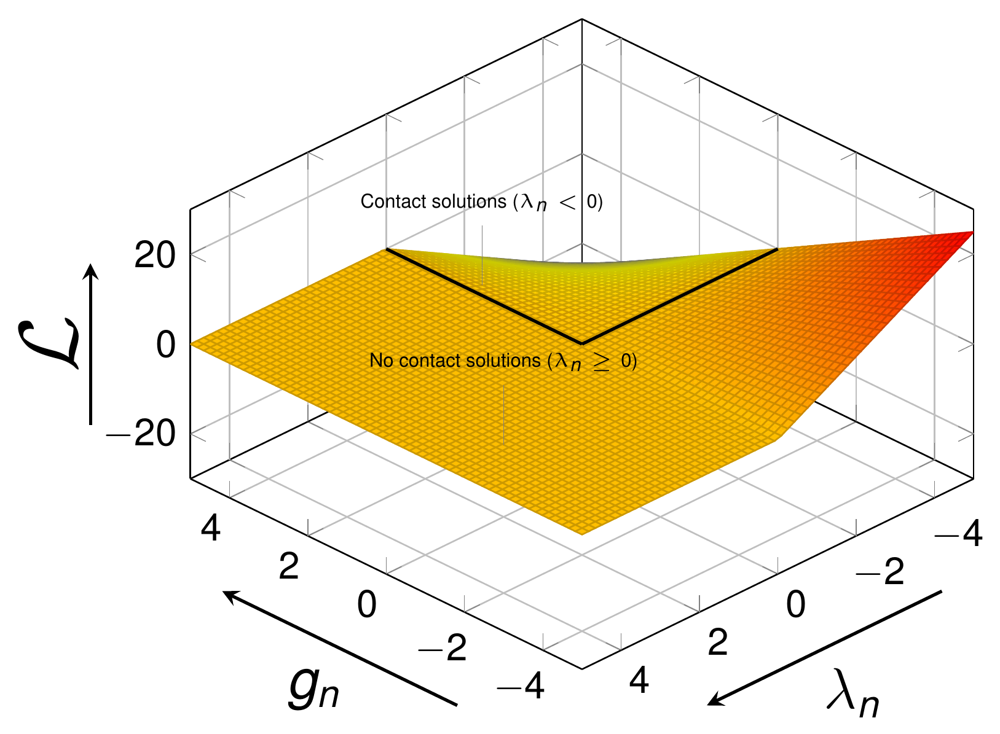</p>
<p align="center"><em>Figure: Lagrangian function for the contact problem (thesis Fig. D.3).</em></p>

Following the same reasoning as for the penalty method, a functional for contact mechanics can be defined with the LMM. The HSM conditions still apply. Defining $$\lambda_n$$ as the normal Lagrange multiplier, which represents the normal contact pressure (thesis eq. D.7):

<p align="center">$$ \mathcal{L}_\lambda (x, \lambda) = f(x) + \int_{\Gamma_c^1} \lambda g_n(x) \, d\Gamma_c^1 $$</p>

<p align="center">$$ \delta \mathcal{L}_\lambda (x, \lambda) = \delta f(x) + \int_{\Gamma_c} g_n(x) \delta \lambda + \lambda \delta g_n(x) \, d\Gamma_c = 0 $$</p>

where $$\lambda_n$$ and $$g_n$$ must fulfill the minimization problem with the inequality constraints of the HSM conditions. This means that, of the strategies above, the preferable one is the **third**. Representing the Lagrangian as a function of $$g_n$$ and $$\lambda_n$$ (figure above), it is apparent that in a tension state ($$\lambda_n \gt 0$$) there is *no* solution to the functional (zero solutions); this generates a discontinuity which affects the resolution of the resulting system of equations. This last problem can be solved precisely with the ALM.

In the application the pure LMM is available for the **equality** constraint of [mesh tying](Mesh_Tying.html) (`MeshTyingMortarCondition`, `mortar_type` = `ScalarMeshTying` / `ComponentsMeshTying`), where no active set is needed; the multiplier is the `SCALAR_LAGRANGE_MULTIPLIER` or `VECTOR_LAGRANGE_MULTIPLIER` DoF and the block system has exactly the zero-diagonal structure of the Hessian above (the scale factor $$k$$ of `scale_factor_parameters` multiplies the off-diagonal blocks to improve the conditioning). For the inequality contact constraint, the pure LMM formulation is derived in the thesis for reference, but what is implemented is always its augmented version.

## Augmented Lagrange multiplier method

### Concept

The ALM was originally introduced by Arrow and Solow and later improved by Powell and Hestenes, which is why it was originally named *the multiplier method of Hestenes and Powell*. It consists in a regularized version of the LMM (Yastrebov): the regularization occurs through the inclusion of a **penalty** parameter, but once the problem has reached convergence the influence of the penalty disappears, resulting in exact fulfillment of the constraint.

### Standard formulation

The Lagrangian is basically the combination of the penalty method and of the LMM. The method was generalized by Rockafellar for inequality constraints, in this particular case $$g(x) \ge 0$$. Recalling the two functionals (thesis eq. D.8a),

<p align="center">$$ f_p(x) = f(x) + \frac{1}{2} \varepsilon g(x)^2; \qquad \mathcal{L}_\lambda (x, \lambda) = f(x) + \lambda g(x) $$</p>

their combination gives the augmented Lagrangian (thesis eq. D.8b):

<p align="center">$$ \mathcal{L}_{\bar{\lambda}} (x, \lambda) = \mathcal{L}_\lambda (x, \lambda) + \frac{1}{2} \varepsilon g(x)^2 = f(x) + \lambda g(x) + \frac{1}{2} \varepsilon g(x)^2 $$</p>

Expressed for the inequality constraint $$g(x) \ge 0$$ (thesis eq. D.8c):

<p align="center">$$ \mathcal{L}_{\bar{\lambda}} (x, \lambda) = f(x) - \frac{1}{2 \varepsilon} \left( \lambda^2 - \langle -(\lambda + \varepsilon g(x)) \rangle^2 \right) $$</p>

In expanded form (thesis eq. D.8d):

<p align="center">$$ \mathcal{L}_{\bar{\lambda}} (x, \lambda) = f(x) + \begin{cases} \lambda g(x) + \dfrac{1}{2} \varepsilon g(x)^2 & , \lambda + \varepsilon g(x) \le 0 \\[6pt] -\dfrac{1}{2 \varepsilon} \lambda^2 & , \lambda + \varepsilon g(x) \gt 0 \end{cases} $$</p>

The quantity $$\bar{\lambda} = \lambda + \varepsilon g(x)$$ is called the **augmented Lagrangian** (augmented multiplier). The gradient of the expanded form is (thesis eq. D.8e):

<p align="center">$$ \nabla \mathcal{L}_{\bar{\lambda}} (x, \lambda) = \nabla f(x) + \begin{cases} \begin{bmatrix} (\lambda + \varepsilon g(x)) \dfrac{\partial g(x)}{\partial x} \\[6pt] g(x) \end{bmatrix} & , \bar{\lambda} \le 0 \\[16pt] \begin{bmatrix} 0 \\[6pt] -\dfrac{\lambda}{\varepsilon} \end{bmatrix} & , \bar{\lambda} \gt 0 \end{cases} $$</p>

and its Hessian (thesis eq. D.9):

<p align="center">$$ \mathbf{H}(\mathcal{L}_{\bar{\lambda}} (x, \lambda)) = \begin{bmatrix} \dfrac{\partial^2 \mathcal{L}_{\bar{\lambda}}}{\partial x^2} & \dfrac{\partial^2 \mathcal{L}_{\bar{\lambda}}}{\partial \lambda \partial x} \\[8pt] \dfrac{\partial^2 \mathcal{L}_{\bar{\lambda}}}{\partial x \partial \lambda} & \dfrac{\partial^2 \mathcal{L}_{\bar{\lambda}}}{\partial \lambda^2} \end{bmatrix} = \begin{cases} \begin{bmatrix} \dfrac{\partial^2 f(x)}{\partial x^2} + \dfrac{\partial^2 g(x)}{\partial x^2} (\lambda + \varepsilon g(x)) + \varepsilon \left( \dfrac{\partial g(x)}{\partial x} \right)^2 & \dfrac{\partial g(x)}{\partial x} \\[8pt] \dfrac{\partial g(x)}{\partial x} & 0 \end{bmatrix} & , \bar{\lambda} \le 0 \\[24pt] \begin{bmatrix} \dfrac{\partial^2 f(x)}{\partial x^2} & 0 \\[6pt] 0 & \dfrac{1}{\varepsilon} \end{bmatrix} & , \bar{\lambda} \gt 0 \end{cases} $$</p>

Compared with the LMM Hessian, the issue of the zero diagonal terms is **partially** solved: it only affects the *inactive* set ($$\bar{\lambda} \gt 0$$), where the multiplier equation becomes $$\lambda/\varepsilon$$; in the active set the zero diagonal remains. A Generalized Newton–Raphson method for this non-smooth potential was proposed by Alart and Curnier; it is the semi-smooth Newton method used by the application (see [Frictionless contact](Frictionless_Contact.html)).

### Uzawa iteration

The standard LMM still has the zero diagonal terms and the non-positivity of the Lagrange multiplier. In 1958 the Japanese economist Uzawa presented an alternative iterative approach to solve this, known as the *Uzawa algorithm*. The increment of the Lagrangian is decomposed into two components, one for the $$x$$ DoFs and the other for the update of the Lagrange multiplier. Calling $$\lambda_i$$ and $$x_i$$ the solution at non-linear iteration $$i$$ (thesis eq. D.10a–c):

<p align="center">$$ \mathcal{L}_{\bar{\lambda}} (x_i + \Delta x_i, \lambda_i + \Delta \lambda_i) \approx \mathcal{L}_{\bar{\lambda}} (x_i + \Delta x_i, \lambda_i) + \left. \frac{\partial \mathcal{L}_{\bar{\lambda}} (x, \lambda_i)}{\partial \lambda} \right\vert_{\lambda_i} \Delta \lambda_i + O(\lambda_i^2) = 0 $$</p>

<p align="center">$$ \begin{aligned} \mathcal{L}_{\bar{\lambda}} (x_i + \Delta x_i, \lambda_i) &\approx \mathcal{L}_{\bar{\lambda}} (x_i, \lambda_i) + \left. \frac{\partial \mathcal{L}_{\bar{\lambda}} (x, \lambda_i)}{\partial x} \right\vert_{x_i} \Delta x_i = 0 \\ \left[ f(x_i) + \lambda_i g(x_i) + \frac{1}{2} \varepsilon g(x_i)^2 \right] &+ \left[ \frac{\partial f(x)}{\partial x} + \left[ \lambda_i + \varepsilon g(x) \right] \frac{\partial g(x)}{\partial x} \right]_{x_i} \Delta x_i + O(x_i^2) = 0 \end{aligned} $$</p>

<p align="center">$$ \lambda_{i+1} = \lambda_i + \varepsilon g(x_i), \qquad \Delta \lambda_i = \varepsilon g(x_i) $$</p>

Convergence of this method is **linear** for the Lagrange multiplier ($$O(\lambda_i)$$), as the second order part has been removed. Besides, the Lagrangian is smooth, so a standard Newton–Raphson is applicable to the displacement sub-problem, with no additional DoFs.

For the present work the **standard approach** (displacements and multipliers solved together, no Uzawa loop) is used; the reason is precisely the linear convergence of the multiplier with Uzawa, discussed in the [state of the art page](Contact_Problem_And_State_Of_The_Art.html#augmented-lagrangian-method-alm).

### Applicability to contact problems

<p align="center">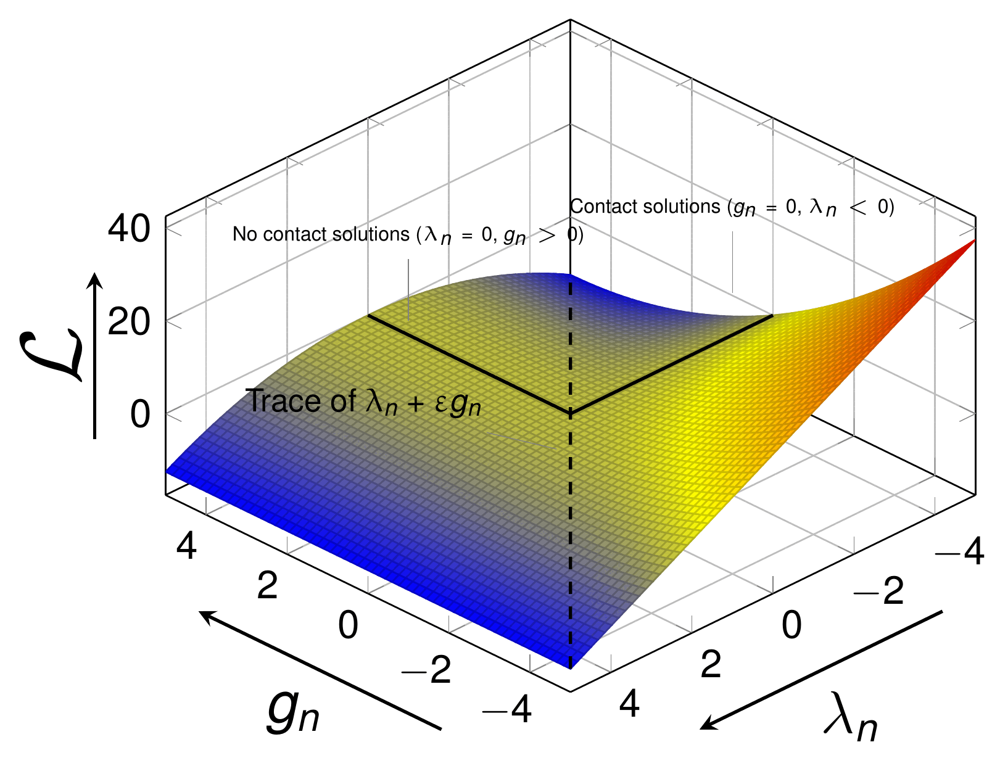</p>
<p align="center"><em>Figure: Augmented Lagrangian function for the contact problem (thesis Fig. D.4).</em></p>

Following the same criterion as for the LMM, the equivalent formulation is obtained for the ALM. In contrast to the locus of the LMM (Fig. D.3), the locus of the ALM is a $$C^1$$-differentiable saddle point, with the corresponding advantages for the resolution of the problem, e.g. the existence of LHS/RHS contributions even for $$\bar{\lambda}_n \gt 0$$. Again considering $$\lambda_n$$ as the normal contact stress and calling $$\bar{\lambda}_n = \lambda_n + \varepsilon g_n(x)$$ the augmented contact stress (thesis eq. D.11):

<p align="center">$$ \mathcal{L}_{\bar{\lambda}} (x, \lambda) = f(x) + \int_{\Gamma_c^1} \begin{cases} \lambda g_n(x) + \dfrac{1}{2} \varepsilon g_n(x)^2 & , \bar{\lambda} \le 0 \\[6pt] -\dfrac{1}{2 \varepsilon} \lambda^2 & , \bar{\lambda} \gt 0 \end{cases} \, d\Gamma_c^1 $$</p>

<p align="center">$$ \delta \mathcal{L}_{\bar{\lambda}} (x, \lambda) = \delta f(x) + \int_{\Gamma_c} \begin{cases} \delta \lambda g_n(x) + (\lambda + \varepsilon g_n(x)) \delta g_n(x) & , \bar{\lambda} \le 0 \\[6pt] -\dfrac{\lambda}{\varepsilon} \delta \lambda & , \bar{\lambda} \gt 0 \end{cases} \, d\Gamma_c = 0 $$</p>

In the contact chapter of the thesis this functional is written with the additional **scale factor** $$k$$ multiplying the multiplier, in the compact Alart–Curnier form (thesis eq. 4.9):

<p align="center">$$ \mathcal{L}_{co}(\mathbf{u}, \lambda_n) = \int_{\Gamma_c^1} k \lambda_n \cdot g_n + \frac{\varepsilon}{2} g_n^2 - \frac{1}{2 \varepsilon} \langle k \lambda_n + \varepsilon g_n \rangle^2 \, d\Gamma_{co}^i $$</p>

with the augmented normal pressure $$\bar{\lambda}_n = k \lambda_n + \varepsilon g_n$$. The solution does not depend on $$\varepsilon$$ or $$k$$, but the convergence rate does; their calibration is treated [below](#alm-parameter-calibration-thesis-4333). This functional, evaluated node-wise on the weighted gap, is exactly what the generator script of `AugmentedLagrangianMethodFrictionlessMortarContactCondition` differentiates: for an active node the contribution is $$(k \lambda_n + \varepsilon \tilde{g}_n) \mathbf{n} \cdot (\mathbf{D} \delta \mathbf{u}^1 - \mathbf{M} \delta \mathbf{u}^2) + k \tilde{g}_n \delta \lambda_n$$, for an inactive node $$-\frac{k^2}{\varepsilon} \lambda_n \delta \lambda_n$$ (the $$1/\varepsilon$$ diagonal of the Hessian above). The nodal quantity $$k \lambda_n + \varepsilon \tilde{g}_n$$ is stored in `AUGMENTED_NORMAL_CONTACT_PRESSURE` and its sign decides the active set (`ActiveSetUtilities::ComputeALMFrictionlessActiveSet`).

### Adapted Augmented Lagrangian Method (AALM)

In the expressions above $$\varepsilon$$ is assumed constant, but there are techniques which adapt the value of $$\varepsilon$$ dynamically in order to improve the convergence of the system. In particular Bussetta, Marceau and Ponthot created the **AALM**, an ALM with an algorithm to update $$\varepsilon$$ as a function of the current penetration $$g_n$$. Three cases are distinguished (thesis Algorithm 7): the sign of $$g_n$$ changes ($$g_i \times g_{i-1} \lt 0$$), the absolute value of $$g_n$$ is larger than the defined limit ($$g_i \gt g_{max}$$), or the absolute value is smaller than the limit.

```
Algorithm 7  Adaptation of the normal penalty coefficient (Bussetta, Marceau and Ponthot)
Require: eps_n, g_i and g_{i-1}
 1: procedure ADAPTATION OF NORMAL PENALTY COEFFICIENT
 2:   if g_i * g_{i-1} < 0 then                              # the gap changed sign
 3:     if g_i * g_{i-1} < 0 then                            # (sic in the source: same test)
 4:       eps_n = | (eps_n g_{i-1}) / g_i * (|g_i| + g_max) / (g_i - g_{i-1}) |
 5:     else
 6:       eps_n = | eps_n g_{i-1} / (10 g_i) |
 7:   else if g_i > g_max then                                # penetration above the limit
 8:     if |g_i - g_{i-1}| > max(g_i/10, g_{i-1}/10, 5 g_max) then
 9:       eps_n = 2 eps_n
10:     else if |g_i| = |g_{i-1}| +- 1% < 10 g_max then       # stagnating penetration
11:       eps_n = eps_n * ( sqrt(|g_i|/g_max - 1) + 1 )^2
12:     else if g_i > g_max then
13:       eps_n = 2 eps_n (g_{i-1} / g_i)
14:     else
15:       eps_n = eps_n * ( sqrt(|g_i|/g_max - 1) + 1 )
16:   else                                                    # penetration below the limit
17:     eps_n = eps_n
```

**Implementation: `AALMAdaptPenaltyValueProcess`** (`custom_processes/aalm_adapt_penalty_value_process.cpp`). The process is run at the beginning of every non-linear iteration by `BaseMortarConvergenceCriteria::PreCriteria` (`base_mortar_criteria.h`) whenever the process-info flag `ADAPT_PENALTY` is true; in that case the criteria first reset and recompute the weighted gap so that $$g_i$$ is up to date. The mapping between the algorithm and the code is:

| Algorithm 7 | Code |
|---|---|
| $$\varepsilon_n$$ | nodal `INITIAL_PENALTY` (non-historical value); initialized from the process-info `INITIAL_PENALTY` at `STEP == 1` and `NL_ITERATION_NUMBER == 1` |
| $$g_i$$, $$g_{i-1}$$ | `WEIGHTED_GAP` at buffer positions 0 and 1, both divided by `NODAL_AREA` (the weighted gap is an integral; dividing by the nodal area gives a length). `PostCriteria` pushes the current gap into position 1 after each iteration. |
| $$g_{max}$$ | `MAX_GAP_FACTOR` × `NODAL_H` of the node, i.e. a fraction of the local mesh size |
| line 3 (inner sign test) | replaced by `std::abs(previous_gap) > max_gap`, which is the branch structure of the original paper |
| absolute values | the code wraps every update in `std::abs(...)` and compares `std::abs(current_gap)` with `max_gap` (the paper's algorithm is written without absolute values; the note in the code documents that the absolute value is deduced from the paper) |
| nodes without `NODAL_AREA` | penalty unchanged |

The JSON entry points are in `advance_ALM_parameters` of `alm_contact_process` (defaults shown; see the [contact process settings](../Usage/Contact_Process_Settings_Reference.html)):

```json
"advance_ALM_parameters" : {
    "manual_ALM"           : false,   // true: use "penalty" and "scale_factor" below
    "stiffness_factor"     : 1.0,     // multiplies E_mean/h_mean (eq. 4.11)
    "penalty_scale_factor" : 1.0,     // ratio scale factor / penalty
    "use_scale_factor"     : true,    // false: SCALE_FACTOR forced to 1.0
    "penalty"              : 1.0e-12, // manual epsilon
    "scale_factor"         : 1.0e0,   // manual k
    "adapt_penalty"        : false,   // enables AALMAdaptPenaltyValueProcess (ADAPT_PENALTY)
    "max_gap_factor"       : 1.0e-3   // g_max = max_gap_factor * NODAL_H (MAX_GAP_FACTOR)
}
```

`alm_contact_process.py` copies `adapt_penalty` into the process-info variable `ADAPT_PENALTY` and `max_gap_factor` into `MAX_GAP_FACTOR`. Note that `penalty_contact_process.py` shares the same block (with `max_gap_factor` = $$5 \times 10^{-4}$$) but does not set `ADAPT_PENALTY`, so the adaptation is effective for the ALM families only. The penalty adapted per node is read by the conditions from the nodal `INITIAL_PENALTY` (initialized by `ALMFastInit` from the process-info value), which is why the adaptation is spatially local.

## Multipoint constraints (master-slave elimination)

### Concept

A multipoint constraint (MPC) is a type of multifreedom constraint (MFC), a functional equation connecting two or more DoFs (Felippa). The nature of the constraint can be *linear*, if all the displacement components appear linearly in the LHS, or *non-linear* otherwise. These relationships can be solved with the former optimization methods, but here the **master–slave elimination** method from Felippa is presented, because it is natively available in Kratos (`MasterSlaveConstraint`, `LinearMasterSlaveConstraint` and the builder-and-solvers with constraints).

### Formulation

Our system of equations is (thesis eq. D.12a) $$\mathbf{LHS} \Delta \mathbf{x} = \mathbf{RHS}$$, onwards $$\mathbf{LHS} = \mathbf{A}$$ and $$\mathbf{RHS} = \mathbf{b}$$. Defining the relation matrix $$\mathbf{T}$$ and the constant vector $$\mathbf{g}$$ such that the full set of DoFs $$\mathbf{x}$$ is expressed with the reduced (master) set $$\bar{\mathbf{x}}$$ (thesis eq. D.12b),

<p align="center">$$ \mathbf{x} = \mathbf{T} \bar{\mathbf{x}} + \mathbf{g} $$</p>

which in an incremental approach leaves (thesis eq. D.12c)

<p align="center">$$ \mathbf{x}_i = \mathbf{x}_{i-1} + \Delta \mathbf{x} = \mathbf{T} \bar{\mathbf{x}} + \mathbf{g} \rightarrow \mathbf{x}_{i-1} + \Delta \mathbf{x} = \mathbf{T} (\bar{\mathbf{x}}_{i-1} + \Delta \bar{\mathbf{x}}) + \mathbf{g} $$</p>

If the previous step is converged then $$\mathbf{x}_{i-1} = \mathbf{T} \bar{\mathbf{x}}_{i-1} + \mathbf{g}$$ and simply (thesis eq. D.12d)

<p align="center">$$ \Delta \mathbf{x}_i = \mathbf{T} \Delta \bar{\mathbf{x}}_i + \begin{cases} i = 0, & \mathbf{g} \\ i \ne 0, & \mathbf{0} \end{cases} $$</p>

which brings the eliminated system (thesis eq. D.12e):

<p align="center">$$ \bar{\mathbf{A}} \Delta \bar{\mathbf{x}} = \bar{\mathbf{b}} \quad \text{in which} \quad \bar{\mathbf{A}} = \mathbf{T}^T \mathbf{A} \mathbf{T}, \quad \bar{\mathbf{b}} = \mathbf{T}^T \left( \mathbf{b} - \begin{cases} i = 0, & \mathbf{A} \mathbf{g} \\ i \ne 0, & \mathbf{0} \end{cases} \right) $$</p>

### Applicability to contact problems

<p align="center">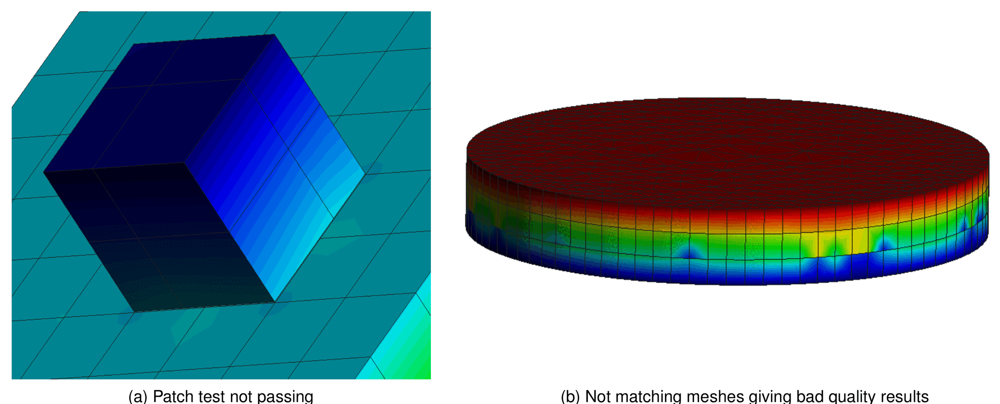</p>
<p align="center"><em>Figure: Patch test solutions obtained with the master–slave elimination method (thesis Fig. D.5): (a) patch test not passing, (b) non-matching meshes giving bad quality results.</em></p>

To consider MPCs for the contact constraint, the constraints must be **deactivated** once the residuals (reactions) of the corresponding DoFs indicate that the constraint is in tension, as this does not respect the unidirectionality of the contact constraint, which requires compression.

Unfortunately the MPC method with master–slave elimination does not give a good solution once the meshes are not matching (similarly to an NTN method) for a problem of deformable domains. The figure above shows solutions obtained with this method, where the weights have been obtained with a mortar segmentation, therefore exact: (a) a 3D patch test with non-matching meshes, where the constraint is fulfilled but, as both domains are deformable, the resulting solution is not continuous; (b) the same problem with a higher number of DoFs, where the bad quality of the results is even more noticeable. In order to obtain good results with this method the **master domain must be rigid or quasi-rigid, or the meshes must match** at the interface.

**Implementation.** The MPC contact formulation of the application follows exactly this scheme:

- `MPCMortarContactCondition` (`custom_conditions/mpc_mortar_contact_condition.cpp`) contributes nothing to the LHS/RHS; in `InitializeNonLinearIteration` it computes the mortar operators $$\mathbf{D}$$ and $$\mathbf{M}$$ with dual multipliers (so that $$\mathbf{D}$$ is diagonal and its inverse trivial) and builds the relation matrix $$\mathbf{T}$$ from $$\mathbf{D}^{-1} \mathbf{M}$$ and the constant vector $$\mathbf{g}$$ from the weighted gap. Rows with negative entries of $$\mathbf{D}^{-1} \mathbf{M}$$ are zeroed, and only slave nodes flagged `ACTIVE` get a row. The frictionless variant (`UpdateConstraintFrictionless`) constrains only the normal component ($$\mathbf{n} \otimes \mathbf{n}$$ projection of $$\mathbf{D}^{-1} \mathbf{M}$$ scaled by $$1 / $$`NODAL_PAUX`), the frictional one (`UpdateConstraintFrictional`, selected with the `SLIP` flag of the model part, `contact_type` containing `Frictional`) also constrains the tangential components of stick nodes, and the tying variant (`UpdateConstraintTying`, `RIGID` flag, `contact_type` = `MeshTying`) constrains all the components permanently.
- The resulting local system is pushed into a `ContactMasterSlaveConstraint` (derived from `LinearMasterSlaveConstraint`, registered as `"ContactMasterSlaveConstraint"`) attached to the condition through the variable `CONSTRAINT_POINTER`; `ConstraintDofDatabaseUpdate` prunes near-zero rows and columns so that inactive nodes do not constrain anything. The constraints are created by `MPCContactSearchProcess` instead of contact conditions.
- The "deactivate in tension" rule is implemented by `MPCContactCriteria`: after each iteration the `REACTION` of the master nodes is mapped to the slave side with the mortar mapper (`SimpleMortarMapperProcess`), and a slave node is (de)activated by comparing the normal reaction pressure with $$-$$`REACTION_CHECK_STIFFNESS_FACTOR` × `YOUNG_MODULUS` (JSON key `reaction_check_stiffness_factor`, default $$10^{-10}$$) and the gap with zero. The dedicated strategy is `ResidualBasedNewtonRaphsonMPCContactStrategy`, selected when the solver settings contain `mpc_contact_settings`.

Details of the classes are in [Frictional laws and MPC constraint](../Implementation/Frictional_Laws_And_MPC_Constraint.html) and [Conditions](../Implementation/Conditions.html).

## Summary of the different methods

The presented methods can be summarized in the following table (thesis Table D.1, inspired by and expanded from Felippa). ALM and LMM are virtually identical except for the dependence of the ALM on the penalty (which does not affect the final solution). Additionally the ALM retains partially the positive definiteness because it adds relatively small terms on the diagonal of the LHS matrix.

| Method | Master–slave elimination | Penalty (PM) | Lagrange multipliers (LMM) | Augmented Lagrangian (ALM) |
|---|---|---|---|---|
| Generality | Fair | Excellent | Excellent | Excellent |
| Ease of implementation | Poor to fair | Good | Fair | Fair |
| Sensitivity to user decisions | High | High | Small to none | Small |
| Accuracy | Variable | Variable | Excellent | Excellent |
| Sensitivity as regards constraint dependence | High | None | High | High |
| Retains positive definiteness | Yes | Yes | No | Partially |

Apart from the ALM, two other methods try to tackle the issues of the LMM:

- **Double Lagrange multiplier** (the *Lagrange doubles* used in the Castem 2000 code; not to be confused with the *dual* Lagrange multipliers of this application): avoids the non-positive LHS of the LMM by duplicating the number of multipliers and adding dummy terms to the LHS, which increases the cost but makes the LHS positive definite.
- **Perturbed Lagrangian** (Simo, Wriggers and Taylor): a stabilized method, preserving the stability of the discretized problem if the penalty parameter $$\varepsilon$$ is small enough.

The choice of the application is summarized in the [state of the art page](Contact_Problem_And_State_Of_The_Art.html#conclusions-the-choices-of-the-application): ALM with dual multipliers as the main method, penalty for explicit dynamics and MPC for rigid/quasi-rigid masters. A per-formulation overview is given in the [Overview](../General/Overview.html) formulation matrix.

## ALM parameter calibration (thesis 4.3.3.3)

The convergence rate (not the solution) depends on the penalty $$\varepsilon$$ and on the scale factor $$k$$. In numerical computations default values are selected in terms of the mean Young modulus $$E$$ of the bodies in contact and of the mean mesh size $$h$$ (thesis eq. 4.11, taken from Cavalieri and Cardona):

<p align="center">$$ \varepsilon = k \approx 10 \frac{E_{mean}}{h_{mean}} $$</p>

A simple 3D Taylor patch test (a small punch block on a larger block, figure below) shows the influence of $$k$$ and $$\varepsilon$$ on the condition number $$\kappa$$ of the LHS. The material properties are (thesis Table 4.1):

| $$E$$ solid 1 | $$\nu$$ solid 1 | $$E$$ solid 2 | $$\nu$$ solid 2 |
|---|---|---|---|
| 100 Pa | 0.3 | 100 Pa | 0.3 |

With $$h \approx 10$$ the reference values of eq. 4.11 correspond to $$\varepsilon = k = 100$$; the load on the top face of the punch is 1 Pa.

<p align="center">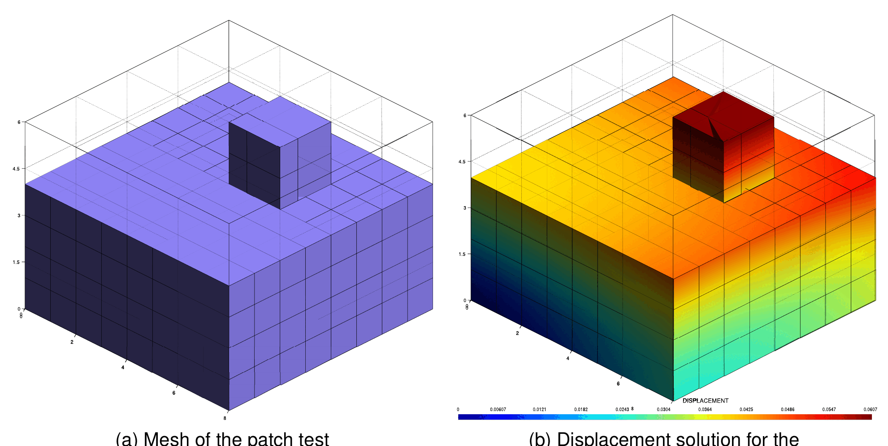</p>
<p align="center"><em>Figure: Condition number study for the ALM, (a) mesh of the patch test, (b) displacement solution (thesis Fig. 4.13).</em></p>

The condition number of a function measures how much the output value can change for a small change in the input. A problem with a low condition number is **well-conditioned**, with a high one **ill-conditioned**. The proper definition uses the singular value decomposition; if $$\mathbf{A}$$ is normal ($$\mathbf{A}^* \mathbf{A} = \mathbf{A} \mathbf{A}^*$$) it reduces to the ratio of the extreme eigenvalues (thesis eq. 4.18a,b), which can be obtained cheaply with the power iteration and the inverse power iteration (this is what the `condn_convergence_criterion` option of the mortar criteria computes at run time):

<p align="center">$$ \kappa(\mathbf{A}) = \frac{\sigma_{max}(\mathbf{A})}{\sigma_{min}(\mathbf{A})}, \qquad \kappa(\mathbf{A}) = \frac{\vert \lambda_{max}(\mathbf{A}) \vert}{\vert \lambda_{min}(\mathbf{A}) \vert} $$</p>

The results of the numerical experiment are (thesis Table 4.2; the reference pair $$k = \varepsilon = 100$$ is marked in bold):

| $$k$$ | $$\varepsilon$$ | $$\kappa$$ | | $$k$$ | $$\varepsilon$$ | $$\kappa$$ | | $$k$$ | $$\varepsilon$$ | $$\kappa$$ |
|---|---|---|---|---|---|---|---|---|---|---|
| 1 | 1.00E-12 | 1.13E+05 | | 10 | 1000 | 1.74E+04 | | 1000 | 10 | 1.92E+04 |
| 1 | 1.00E-02 | 1.13E+05 | | 10 | 10000 | 2.69E+05 | | 1000 | 100 | 1.81E+04 |
| 1 | 1 | 1.13E+05 | | 100 | 1.00E-12 | 1.74E+04 | | 1000 | 1000 | 3.14E+04 |
| 1 | 10 | 1.18E+05 | | 100 | 1.00E-02 | 1.74E+04 | | 1000 | 10000 | 6.43E+04 |
| 1 | 100 | 1.63E+05 | | 100 | 1 | 1.74E+04 | | 10000 | 1.00E-12 | 6.64E+05 |
| 1 | 1000 | 6.15E+05 | | 100 | 10 | 1.74E+04 | | 10000 | 1.00E-02 | 6.63E+05 |
| 1 | 10000 | 2.69E+07 | | **100** | **100** | **1.74E+04** | | 10000 | 1 | 6.63E+05 |
| 10 | 1.00E-12 | 1.74E+04 | | 100 | 1000 | 1.74E+04 | | 10000 | 10 | 6.63E+05 |
| 10 | 1.00E-02 | 1.74E+04 | | 100 | 10000 | 9.38E+04 | | 10000 | 100 | 3.53E+05 |
| 10 | 1 | 1.74E+04 | | 1000 | 1.00E-12 | 6.60E+04 | | 10000 | 1000 | 3.26E+06 |
| 10 | 10 | 1.74E+04 | | 1000 | 1.00E-02 | 6.60E+04 | | 10000 | 10000 | 7.38E+05 |
| 10 | 100 | 1.74E+04 | | 1000 | 1 | 5.75E+05 | | | | |

<p align="center">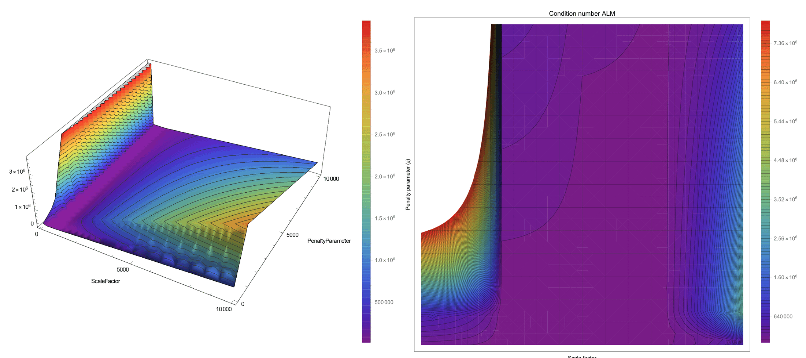</p>
<p align="center"><em>Figure: Condition number study, graphic representation of Table 4.2 (thesis Fig. 4.14).</em></p>

Two conclusions follow: the penalty $$\varepsilon$$ **always increases** the condition number (as proven analytically for the single-DoF example below, eq. D.25), whereas the scale factor $$k$$ may improve or worsen it depending on its value; and the estimate of eq. 4.11 ($$k = \varepsilon = 100$$ here) provides the best conditioning overall.

**Implementation: `ALMVariablesCalculationProcess`** (`custom_processes/alm_variables_calculation_process.cpp`). Unless `manual_ALM` is true, the contact processes run this process on the contact model part before the first solve (`ExecuteInitializeSolutionStep` of `alm_contact_process.py`, after `FindNodalHProcess` has computed `NODAL_H`). Its default parameters are:

```json
{
    "stiffness_factor"     : 10.0,  // the "10" of eq. 4.11; the contact processes pass advance_ALM_parameters.stiffness_factor (1.0)
    "penalty_scale_factor" : 1.0,   // ratio between scale factor and penalty
    "compute_scale_factor" : true,  // write SCALE_FACTOR in the process info
    "compute_penalty"      : true   // write INITIAL_PENALTY in the process info
}
```

The process loops over the interface conditions and accumulates, separately for `SLAVE` and `MASTER` conditions (or for both when the flags are not set), the Young modulus of the condition properties weighted by the condition size and the nodal length variable (`NODAL_H` by default, a constructor argument) weighted by the nodal share of the condition area. It then evaluates, per side,

<p align="center">$$ \varepsilon^{side} = \text{stiffness\_factor} \cdot \frac{E^{side}_{mean}}{h^{side}_{mean}}, \qquad k^{side} = \text{penalty\_scale\_factor} \cdot \text{stiffness\_factor} \cdot \frac{E^{side}_{mean}}{h^{side}_{mean}} $$</p>

and stores the **minimum** of the slave and master values in the process-info variables `INITIAL_PENALTY` and `SCALE_FACTOR` (falling back to the master values when the slave side has no Young modulus). The chosen values are printed with the label `ALM Values`. Afterwards `alm_contact_process.py` forces `SCALE_FACTOR` to 1 when `use_scale_factor` is false and floors both values at 1 when they are zero; `penalty_contact_process.py` multiplies the penalty by $$10^4$$ (a pure penalty needs a much stiffer spring than an ALM regularization) and `mesh_tying_process.py` calls the process with `compute_penalty` false to obtain only the scale factor of the tying multipliers (`scale_factor_parameters`).

Note: the "volume" weighting the Young modulus is `DomainSize()` of the *condition* geometry (an area in 3D, a length in 2D), so $$E_{mean}$$ is in practice area-weighted; for homogeneous interfaces this makes no difference.

## Numerical examples: single-degree-of-freedom spring and wall

The different approaches are compared on problems of increasing complexity (the MPC method is excluded, as it cannot deal with them). They help to understand how the methods behave when computing the contribution of the constraints.

### Initial spring–wall problem

<p align="center">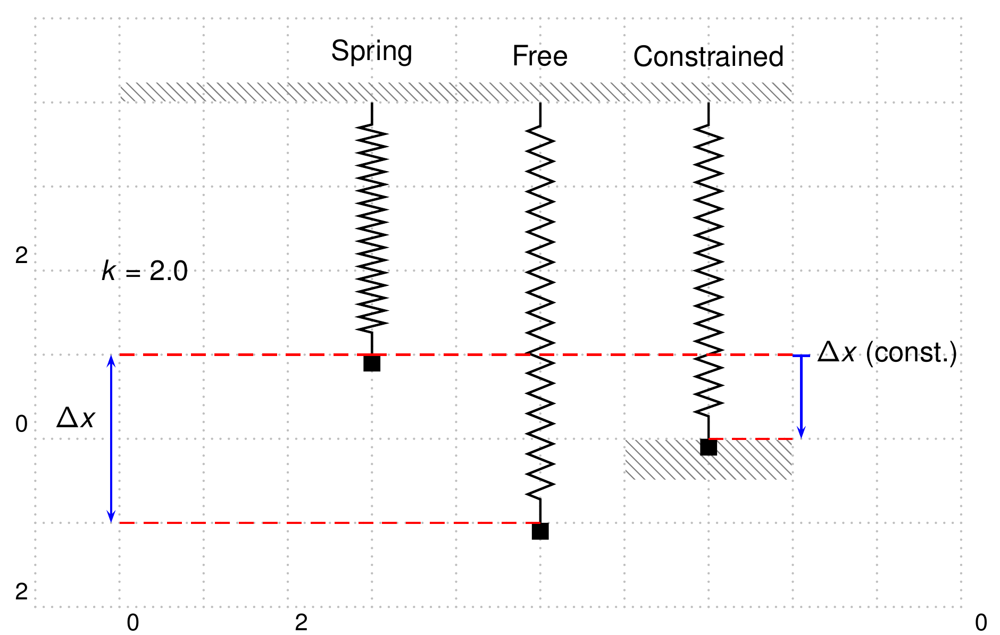</p>
<p align="center"><em>Figure: Simplified contact problem with a spring and a wall (thesis Fig. D.6).</em></p>

A single spring of stiffness $$k = 2$$ (not to be confused with the scale factor) with a wall constraint that does not allow penetration, $$x \ge 0$$ (thesis eq. D.13):

<p align="center">$$ \begin{cases} f(x) = \frac{1}{2} k (x + 1)^2 \\ \text{Subject to } x \ge 0 \end{cases} $$</p>

**Penalty method** (thesis eq. D.14):

<p align="center">$$ f_p(x) = \frac{1}{2} k (x + 1)^2 + \frac{\varepsilon}{2} \left( \max\{0, x\} \right)^2 $$</p>

<p align="center">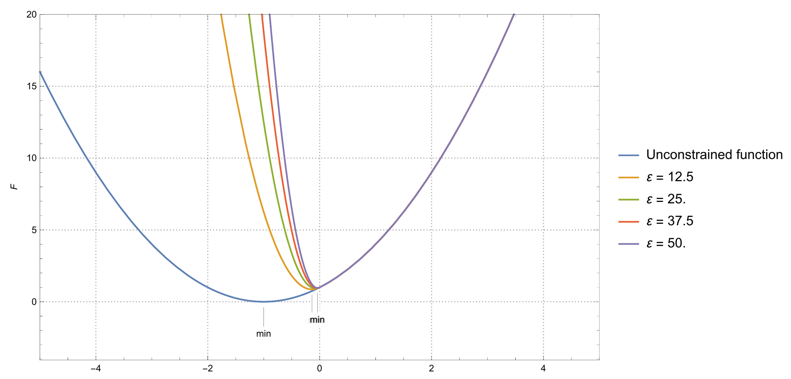</p>
<p align="center"><em>Figure: Solution for a SDOF solved with the penalty method, comparing different values of ε (thesis Fig. D.7).</em></p>

Applying Newton–Raphson iteratively, as $$\varepsilon$$ grows the solution comes closer to the actual solution $$x = 0$$. Starting from $$x = 1$$ with $$\varepsilon = 10^6$$ three iterations are needed (thesis Table D.2): $$x = 1$$ ($$f_p = 4$$), $$x = -1$$ ($$f_p = 10^6$$), $$x = -2 \times 10^{-6}$$ ($$f_p = 8.40465 \times 10^{-11}$$); even with this value the constraint is not completely satisfied.

**Lagrange multiplier method** (thesis eq. D.15, only one of the active-set alternatives is shown here):

<p align="center">$$ \mathcal{L}_\lambda (x) = \frac{1}{2} k (x + 1)^2 + \min\{0, \lambda\} \, x $$</p>

<p align="center">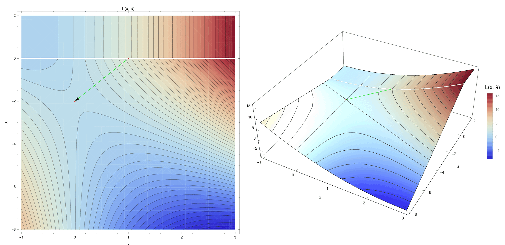</p>
<p align="center"><em>Figure: Solution for a SDOF solved with the Lagrange multiplier method (thesis Fig. D.8).</em></p>

Convergence is achieved in only **two** iterations (thesis Table D.3): $$(x, \lambda) = (1, 0)$$ with $$\mathcal{L}_\lambda = 4.12311$$, then $$(0, -2)$$ with $$\mathcal{L}_\lambda = 0$$, reaching the exact solution and satisfying the constraint exactly.

### Non-linear spring with a wall

The base functional is replaced by a quartic one (thesis eq. D.16), with the auxiliary variable $$x = u + 1$$:

<p align="center">$$ f(x) = \frac{1}{4} x^4 = \frac{1}{4} (u + 1)^4 $$</p>

**Initial wall**, constraint $$u \le 0$$ or $$x \le 1$$ (thesis eq. D.17). The three active-set strategies of the LMM give (thesis eqs. D.18–D.20):

<p align="center">$$ \text{AS1:} \quad \mathcal{L}(x, \lambda) = \frac{1}{4} x^4 + \lambda u, \; x \le 1 \quad \Longleftrightarrow \quad \mathcal{L}(x, \lambda) = \frac{1}{4} x^4 - \lambda \langle -u \rangle $$</p>

<p align="center">$$ \text{AS2:} \quad \mathcal{L}(x, \lambda) = \frac{1}{4} x^4 + \lambda u, \; \lambda \le 0 \quad \Longleftrightarrow \quad \mathcal{L}(x, \lambda) = \frac{1}{4} x^4 - \langle -\lambda \rangle u $$</p>

<p align="center">$$ \text{AS3:} \quad \mathcal{L}(x, \lambda) = \frac{1}{4} x^4 + \lambda u, \; \lambda \le 0, \; x \le 1 \quad \Longleftrightarrow \quad \mathcal{L}(x, \lambda) = \frac{1}{4} x^4 - \langle -\lambda \rangle u - \lambda \langle -u \rangle + \langle -\lambda \rangle \langle -u \rangle $$</p>

For this simple case the three strategies follow the same path and converge in three iterations to $$x = 1$$, $$\lambda = 1$$ (thesis Tables D.4–D.6, Figs. D.9–D.11).

**Moved wall.** To make the problem harder the wall is moved by 0.9 (example from Yastrebov), so the constraint becomes (thesis eq. D.21)

<p align="center">$$ \text{Subject to: } u + 0.9 \le 0 $$</p>

The exact solution is $$u = -0.9$$, $$\lambda = -0.001$$. The convergence rate now changes from one method to another, some of them even diverging.

*Penalty method.* No tuning is required and the convergence is obtained in a straightforward manner; only $$\varepsilon$$ affects the solution. With $$\varepsilon = 10^6$$ the correct solution is achieved in 9 iterations (thesis Table D.7); at iteration 7 there is a sudden increase of the error (12208.5) because the iterate enters the penalized region ($$u \gt -0.9$$). The number of iterations is quite high for a single-DoF problem.

<p align="center">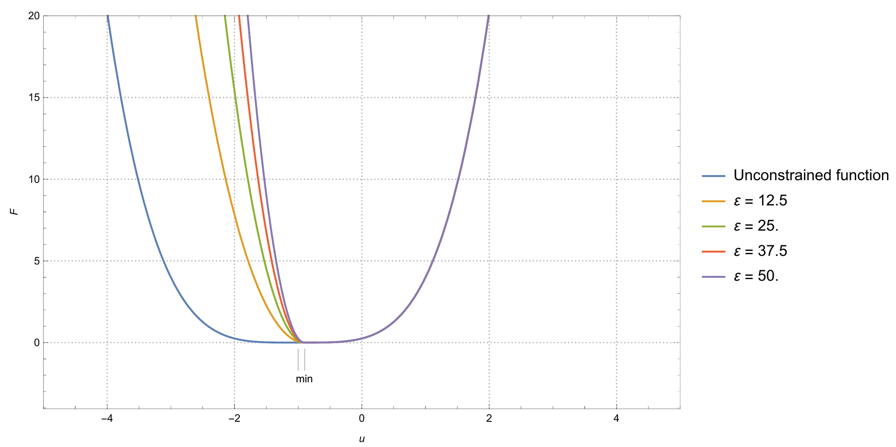</p>
<p align="center"><em>Figure: Solution for a non-linear SDOF problem solved with the penalty method, comparing different values of ε, moved wall (thesis Fig. D.12).</em></p>

*Lagrange multiplier method.* Strategy 1 converges in 8 iterations, moving along the $$u$$ axis with $$\lambda = 0$$ until iteration 6 and then correcting $$\lambda$$ (thesis Table D.8, Fig. D.13). Strategy 2 **does not converge** to the right solution: it stalls around $$u \approx -0.996$$, $$\lambda = 0.459259$$ (thesis Table D.9, Fig. D.14), and extending to 20 iterations does not help; the functional is almost flat, which explains part of the difficulty, and a local minimum cannot be found. Strategy 3 reproduces exactly the path of strategy 1 in 8 iterations (thesis Table D.10, Fig. D.15), although its graphical representation differs. In a simplified manner the third strategy behaves as the best option, although this is not always true.

*Augmented Lagrange multiplier method.* The augmented Lagrangian for this problem is (thesis eq. D.22):

<p align="center">$$ \mathcal{L}_{\bar{\lambda}} (u, \lambda) = \begin{cases} \frac{1}{2} k (u + 1)^4 + \lambda (u + 0.9) + \frac{1}{2} \varepsilon (u + 0.9)^2 & \lambda + \varepsilon (u + 0.9) \le 0 \\[4pt] \frac{1}{2} k (u + 1)^4 - \frac{1}{2 \varepsilon} \lambda^2 & \lambda + \varepsilon (u + 0.9) \gt 0 \end{cases} $$</p>

Different values of $$\varepsilon$$ give a similar convergence rate, but the condition number of the LHS varies with $$\varepsilon$$. Estimating $$\kappa$$ as the ratio of the extreme eigenvalues (thesis eq. D.23) and deriving the RHS/LHS from the functional with $$\bar{\lambda} = \lambda + \varepsilon (u + 0.9)$$ (thesis eq. D.24):

<p align="center">$$ \mathbf{RHS}(u, \lambda) = \delta \mathcal{L}_{\bar{\lambda}} (u, \lambda) = \begin{cases} \begin{bmatrix} 2k(u+1)^3 + \bar{\lambda} \\ u + 0.9 \end{bmatrix}^T \begin{bmatrix} \delta u \\ \delta \lambda \end{bmatrix} = 0, & \bar{\lambda} \le 0 \text{ (Active)} \\[12pt] \begin{bmatrix} 2k(u+1)^3 \\ -\frac{\lambda}{\varepsilon} \end{bmatrix}^T \begin{bmatrix} \delta u \\ \delta \lambda \end{bmatrix} = 0, & \bar{\lambda} \gt 0 \text{ (Inactive)} \end{cases} $$</p>

<p align="center">$$ \mathbf{LHS}(x) = \Delta \delta \mathcal{L}_{\bar{\lambda}} (u, \lambda) = \begin{cases} \begin{bmatrix} \delta u \\ \delta \lambda \end{bmatrix}^T \begin{bmatrix} 6k(u+1)^2 + \varepsilon & 1 \\ 1 & 0 \end{bmatrix} \begin{bmatrix} \delta u \\ \delta \lambda \end{bmatrix}, & \bar{\lambda} \le 0 \text{ (Active)} \\[12pt] \begin{bmatrix} \delta u \\ \delta \lambda \end{bmatrix}^T \begin{bmatrix} 6k(u+1)^2 & 0 \\ 0 & -\frac{1}{\varepsilon} \end{bmatrix} \begin{bmatrix} \delta u \\ \delta \lambda \end{bmatrix}, & \bar{\lambda} \gt 0 \text{ (Inactive)} \end{cases} $$</p>

For the **inactive** set the LHS is diagonal and $$\kappa$$ grows linearly with $$\varepsilon$$; for the **active** set it grows quadratically (thesis eq. D.25):

<p align="center">$$ \kappa_{inactive}(\mathbf{LHS}) \approx \begin{cases} 6 k \varepsilon u^2, & \frac{1}{\varepsilon} \le 6 k u^2 \\[4pt] \frac{1}{6 k u^2 \varepsilon}, & \frac{1}{\varepsilon} \gt 6 k u^2 \end{cases} \quad \text{assuming } \frac{1}{\varepsilon} \le 6 k u^2 \text{ then } \sim k \varepsilon $$</p>

<p align="center">$$ \kappa_{active}(\mathbf{LHS}) \approx \frac{1}{2} \left( 6k(u+1)^2 + \varepsilon \right) \left( \sqrt{\left( 6k(u+1)^2 + \varepsilon \right)^2 + 4} + \left( 6k(u+1)^2 + \varepsilon \right) \right) + 1 \sim (k + \varepsilon)^2 $$</p>

In conclusion, a high $$\varepsilon$$ compared with the stiffness of the problem gives an ill-conditioned problem, affecting precision and convergence, while on the other hand the energy functional becomes smoother. All the graphical representations of the augmented Lagrangian show a continuous field without flat areas (thesis Figs. D.16–D.19), which already explains how the method avoids the problems found with the LMM and the need to choose between active-set strategies.

<p align="center">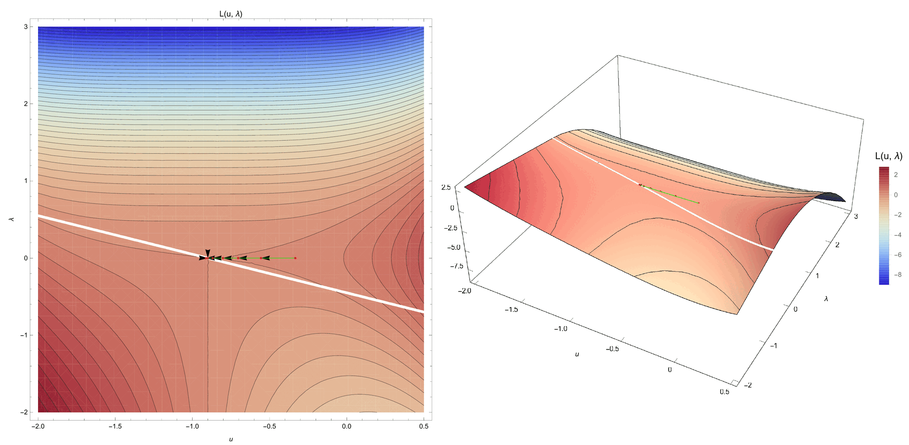</p>
<p align="center"><em>Figure: Solution for a non-linear SDOF solved with the ALM, ε = 0.5, moved wall (thesis Fig. D.16). The corresponding plots for ε = 1, 5 and 10 are thesis Figs. D.17–D.19; the smoothness of the surface increases with ε.</em></p>

With $$\varepsilon = 0.5, 1, 5, 10$$ the ALM converges in 8 iterations in every case, following practically the same path as LMM strategy 1; the only value that changes is the error at iteration 6, when the iterate crosses the constraint threshold (thesis Tables D.11–D.14).

### Convergence comparison

The iteration counts of thesis Tables D.2–D.15 are gathered here (Newton–Raphson, converged values rounded):

| Problem | Method | Iterations | Converged solution | Final error | Thesis table |
|---|---|---|---|---|---|
| Linear spring, wall at 0 | PM, ε = 1e6 | 3 | x = −2e−6 (penetration) | fp = 8.4e−11 | D.2 |
| Linear spring, wall at 0 | LMM | 2 | x = 0, λ = −2 (exact) | 0 | D.3 |
| Quartic spring, wall at 1 | LMM, active set 1 | 3 | x = 1, λ = 1 | 2.2e−16 | D.4 |
| Quartic spring, wall at 1 | LMM, active set 2 | 3 | x = 1, λ = 1 | 2.2e−16 | D.5 |
| Quartic spring, wall at 1 | LMM, active set 3 | 3 | x = 1, λ = 1 | 2.2e−16 | D.6 |
| Quartic spring, moved wall | PM, ε = 1e6 | 9 | u = −0.9 | 1.7e−12 | D.7 |
| Quartic spring, moved wall | LMM, active set 1 | 8 | u = −0.9, λ = −0.001 | 2.2e−19 | D.8 |
| Quartic spring, moved wall | LMM, active set 2 | no convergence (10, nor 20) | stalls at u ≈ −0.996, λ = 0.459 | 5.9e−8 and stagnating | D.9 |
| Quartic spring, moved wall | LMM, active set 3 | 8 | u = −0.9, λ = −0.001 | 2.2e−19 | D.10 |
| Quartic spring, moved wall | ALM, ε = 0.5 | 8 | u = −0.9, λ = −0.001 | 4.3e−19 | D.11 |
| Quartic spring, moved wall | ALM, ε = 1.0 | 8 | u = −0.9, λ = −0.001 | 1.1e−18 | D.12 |
| Quartic spring, moved wall | ALM, ε = 5.0 | 8 | u = −0.9, λ = −0.001 | 2.6e−18 | D.13 |
| Quartic spring, moved wall | ALM, ε = 10.0 | 8 | u = −0.9, λ = −0.001 | 3.9e−18 | D.14 |
| Over-constrained 2-DoF (below) | PM, ε = 1e6 | 4 | (x1, x2) = (3, 4) | fp = 2.0e−9 | D.15 |
| Over-constrained 2-DoF (below) | LMM | singular LHS | — | — | eq. D.28 |

For the ALM cases, the error at the threshold-crossing iteration 6 grows with the penalty: 0.0122 (ε = 0.5), 0.0168 (ε = 1), 0.0616 (ε = 5), 0.122 (ε = 10), a small-scale illustration of the conditioning trend of eq. D.25 and Table 4.2.

### Over-constrained optimization problem

The last example is an over-constrained problem, which can be solved with the penalty method but not with the more advanced methodologies (LMM, ALM). The problem is (thesis eq. D.26):

<p align="center">$$ \begin{aligned} \text{Minimize} \quad & f(\mathbf{x}) = (x_1 - 6)^2 + (x_2 - 7)^2 \\ \text{subject to} \quad & g_1(\mathbf{x}) = -3 x_1 - 2 x_2 + 6 \le 0 \\ & g_2(\mathbf{x}) = -x_1 + x_2 - 3 \le 0 \\ & g_3(\mathbf{x}) = x_1 + x_2 - 7 \le 0 \\ & g_4(\mathbf{x}) = \tfrac{2}{3} x_1 - x_2 - \tfrac{4}{3} \le 0 \end{aligned} $$</p>

<p align="center">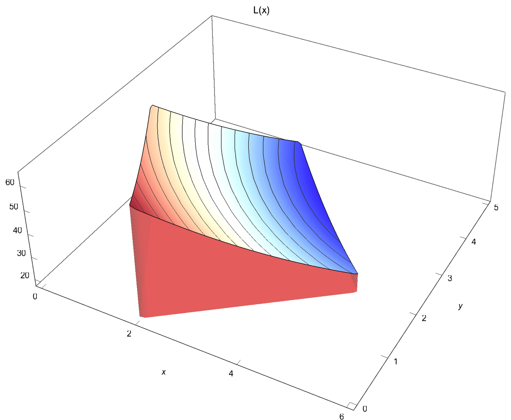</p>
<p align="center"><em>Figure: Graphic representation of the over-constrained problem eq. D.26 (thesis Fig. D.20).</em></p>

With the penalty method the functional becomes (thesis eq. D.27):

<p align="center">$$ \begin{aligned} f_p(\varepsilon, \mathbf{x}) = {} & (x_1 - 6)^2 + (x_2 - 7)^2 \\ & + \varepsilon \left( \max\{0, -3 x_1 - 2 x_2 + 6\} \right)^2 \\ & + \varepsilon \left( \max\{0, -x_1 + x_2 - 3\} \right)^2 \\ & + \varepsilon \left( \max\{0, x_1 + x_2 - 7\} \right)^2 \\ & + \varepsilon \left( \max\{0, \tfrac{2}{3} x_1 - x_2 - \tfrac{4}{3}\} \right)^2 \end{aligned} $$</p>

Solving with Newton–Raphson from $$\mathbf{x} = (0, 0)$$ with $$\varepsilon = 10^6$$ the correct solution $$(3, 4)$$ is obtained in 4 steps (thesis Table D.15: $$(0, 0) \rightarrow (0, 3) \rightarrow (6, 7) \rightarrow (3, 4)$$, with $$f_p$$ going from $$2\sqrt{468000384000085}$$ to $$14.4222$$, $$1.69706 \times 10^7$$ and $$1.97134 \times 10^{-9}$$).

With the LMM, formulating for example the second active-set strategy with $$x_1 = 6$$, $$x_2 = 7$$ and $$\lambda_i = 0$$ for $$i = 1, \ldots, 4$$, the resulting LHS is (thesis eq. D.28)

<p align="center">$$ \mathbf{LHS} = \begin{pmatrix} -2 & 0 & 0 & 0 & 0 & 0 \\ 0 & -2 & 0 & 0 & 0 & 0 \\ 0 & 0 & 0 & 0 & 0 & 0 \\ 0 & 0 & 0 & 0 & 0 & 0 \\ 0 & 0 & 0 & 0 & 0 & 0 \\ 0 & 0 & 0 & 0 & 0 & 0 \end{pmatrix} $$</p>

a $$6 \times 6$$ matrix of rank 2: the system is not solvable. The same happens with the first, more robust, active-set strategy. The underlying reason is the over-constraint, which is not a problem for the penalty method. This small example shows that the LMM, despite being a powerful and generic technique, is not applicable in all cases; in contact problems the analogous situation is a slave node whose multiplier is constrained by several master facets or by a Dirichlet condition, which is why the application's elimination builder-and-solver fixes the multiplier DoF of slave nodes whose displacement is fixed and why isolated nodes are handled with the `ISOLATED` flag ([Builder and solvers](../Implementation/Builder_And_Solvers_And_Linear_Solvers.html)).

## Quick reference: concept to code

| Concept | Formulation in the application | Class / key |
|---|---|---|
| Penalty functional, eq. D.3d | `PenaltyContactFrictionless`, `PenaltyContactFrictional` | `PenaltyMethodFrictionlessMortarContactCondition`, `PenaltyMethodFrictionalMortarContactCondition`; `INITIAL_PENALTY` |
| Lagrange multiplier (equality) | `ScalarMeshTying`, `ComponentsMeshTying` | `MeshTyingMortarCondition`; `SCALAR_LAGRANGE_MULTIPLIER`, `VECTOR_LAGRANGE_MULTIPLIER`, `scale_factor_parameters` |
| Augmented Lagrangian, eq. 4.9 / D.11 | `ALMContactFrictionless`, `ALMContactFrictionlessComponents`, `ALMContactFrictional` | `AugmentedLagrangianMethodFrictionlessMortarContactCondition` and siblings; `INITIAL_PENALTY` (ε), `SCALE_FACTOR` (k), `AUGMENTED_NORMAL_CONTACT_PRESSURE` |
| Active set of the semi-smooth Newton (Alart–Curnier) | sign of the augmented pressure | `ActiveSetUtilities`, `ALMFrictionlessMortarConvergenceCriteria`, `ALMFrictionalMortarConvergenceCriteria` |
| ALM parameter estimate, eq. 4.11 | automatic ε and k | `ALMVariablesCalculationProcess` (`stiffness_factor`, `penalty_scale_factor`, `compute_scale_factor`, `compute_penalty`); `advance_ALM_parameters` |
| AALM, Algorithm 7 | nodal penalty adaptation | `AALMAdaptPenaltyValueProcess`; `ADAPT_PENALTY`, `MAX_GAP_FACTOR`; `adapt_penalty`, `max_gap_factor` |
| Master–slave elimination, eq. D.12 | MPC contact | `MPCMortarContactCondition`, `ContactMasterSlaveConstraint`, `MPCContactCriteria`, `ResidualBasedNewtonRaphsonMPCContactStrategy`; `mpc_contact_settings`, `reaction_check_stiffness_factor` |
| Condition number, eq. 4.18 | run-time monitoring | `condn_convergence_criterion` of the contact solver settings |

*Thesis figures © Vicente Mataix Ferrándiz, PhD thesis "Innovative mathematical and numerical models for studying the deformation of shells during industrial forming processes with the Finite Element Method", UPC 2020, reproduced by the author. Figures marked "inspired by" are the author's redrawings of the cited sources.*
