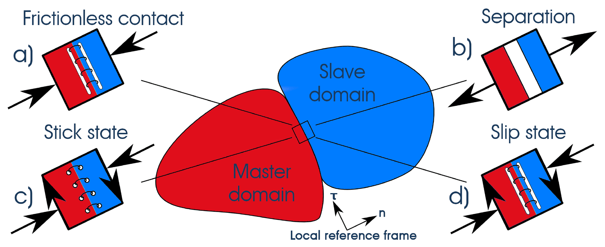
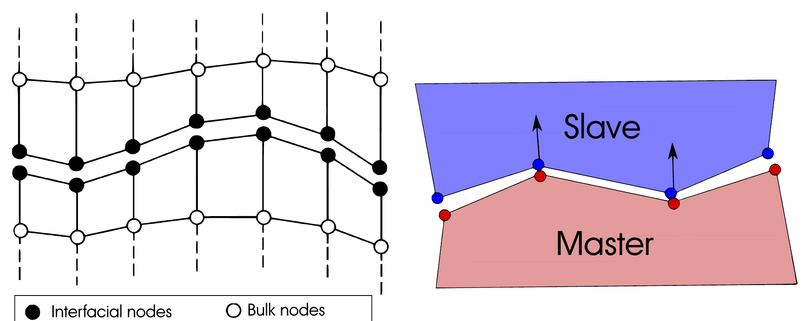
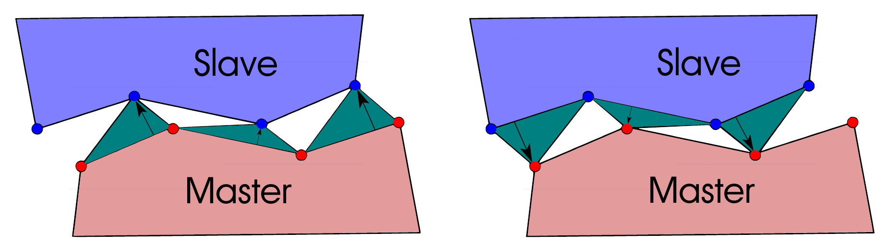
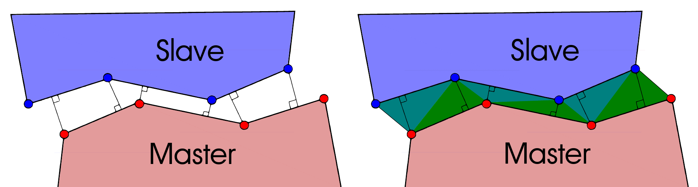
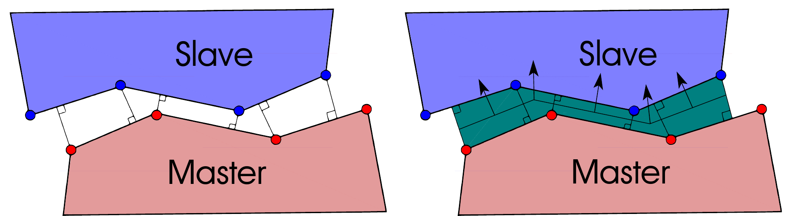
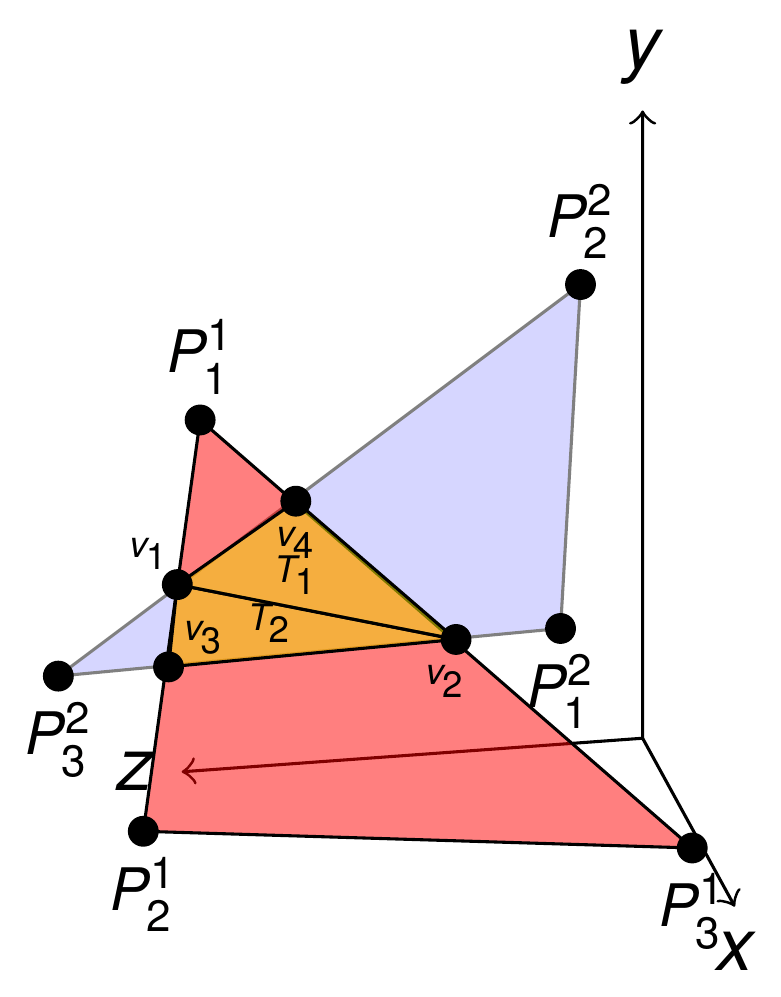

> **Sources.** Thesis Chapter 4, §4.1 (pp. 85–89), §4.2 (pp. 89–96) and Table 4.3 (p. 114); code: `custom_conditions/mortar_contact_condition.h`, `custom_conditions/mesh_tying_mortar_condition.h`, `custom_conditions/mpc_mortar_contact_condition.h`, `custom_frictional_laws/coulomb_frictional_law.h`, `custom_frictional_laws/tresca_frictional_law.h`, `python_scripts/auxiliary_methods_solvers.py`.

This page is the entry point to the theory section. It defines what a contact problem is, reviews the methods available in the literature to discretize the contact interface and to enforce the contact constraint, and explains which of those alternatives were selected for the `ContactStructuralMechanicsApplication` and why. The pages [Constrained optimisation methods](Constrained_Optimisation_Methods.html), [Frictionless contact](Frictionless_Contact.html), [Frictional contact](Frictional_Contact.html), [Mortar integration and dual Lagrange multipliers](Mortar_Integration_And_Dual_Lagrange_Multipliers.html) and [Mesh tying](Mesh_Tying.html) develop each of the chosen ingredients in depth.

## Scope: contact with the Finite Element Method

Computational Contact Mechanics (CCM) covers an extended range of problems, and depending on the problem to be solved a different numerical technique is required (Wriggers, *Computational Contact Mechanics*). Three large families can be distinguished:

- **Finite Element Method (FEM).** The most general one, applicable from small to large deformations and from linear to non-linear material behavior. This is the family this application belongs to: contact is a boundary condition of a non-linear solid mechanics problem solved with the `StructuralMechanicsApplication`.
- **Discrete Element Method (DEM).** Studies the interaction between a large number of particles coming into contact (in Kratos, the `DEMApplication`).
- **Multibody systems.** Rigid bodies interacting between them, creating a mechanism, where contact may influence the behavior of the system.

The developments documented here focus exclusively on the FEM approach, which is consistent with the rest of the solid mechanics stack of Kratos.

## Historical outline

The history of contact mechanics is probably as long as the history of civilization: practically any physical interaction between objects involves contact and friction, making the invention of the wheel the first human invention involving this problem. The ancient Egyptians already employed oil to reduce the friction between the wheels and the floor in order to facilitate the transportation of the pyramid blocks (thesis Fig. 4.1, not reproduced here).

The modern contributions start with **Leonardo da Vinci** (*Codex Madrid I*), who experimented with friction and concluded that the frictional force is proportional to the weight and independent of the contact area. This was a crucial influence on **Charles Augustin Coulomb**, to whom we owe many of the expressions used in computational mechanics, like the extended expression $$F_\tau = \mu N$$ known as the *Coulomb friction law*. In 1785, in *The theory of simple machines*, Coulomb differentiated for the first time between *kinetic* and *static* friction.

The first mathematical contributions are attributed to **Euler**, who studied the friction problem assuming that the roughness of the contact surfaces can be represented with a series of triangles. This led him to the conclusion that the static friction coefficient is larger than the dynamic one, i.e. a larger force is needed to start moving an object than to keep it moving. In the same way that we owe Euler the use of $$\pi$$, we owe him the use of $$\mu$$ for the friction coefficient.

For a long time contact conditions were modeled in a very experimental manner. It was **Hertz**, with *Ueber die Berührung fester elastischer Körper* (1882, thesis Fig. 4.2), who presented the first analytical solution of a contact problem, the contact of two elastic bodies with curved surfaces. This classical solution still provides a foundation for modern problems in contact mechanics and is extensively used as the main *benchmark* for contact codes; the application's validation suite relies on it (see [Benchmarks](../Validation/Benchmarks.html)). The developments that followed were motivated by railways, reduction gears and rolling contact bearings at the beginning of the 20th century, but the analytical solutions were limited to simple geometries and (mainly) linear materials, in contrast with industrial needs: complex geometries, non-trivial boundary conditions, non-linear materials, friction, wear, adhesion, large deformations and large sliding.

In 1933 **Signorini** formulated the general problem of the equilibrium of a linear elastic body in frictionless contact with a rigid foundation, the so-called *unilateral* contact problem. Later mathematical developments came from **Fichera** (uniqueness of variational inequalities) and from **Kikuchi and Oden**, who extended Fichera's proof to the Signorini problem.

Until the existence of modern computers, contact was modeled for industrial applications as a local problem using the stress and strain fields obtained from the analysis of a complete structure. Once computational power increased in the second half of the 20th century the whole non-linear constraint of the contact problem could be considered. First only semi-analytical problems were solved; after the appearance of modern FEM with NASTRAN more and more developments emerged, first solving Signorini's unilateral problem, then including friction, later large deformations and finally *bilateral* multibody contact.

An additional difficulty emerged when treating the **frictional** problem. While the frictionless problem can be formulated as a minimization problem with inequality constraints following standard approaches (barrier, penalty, Lagrange multipliers, augmented Lagrangian, see [Constrained optimisation methods](Constrained_Optimisation_Methods.html)), there is *no associated minimization principle* for the frictional contact problem, as Kikuchi and Oden proved. This is due to the dependence of the frictional status on the normal contact pressure, which at the same time induces additional second order dependencies (such as the geometrical configuration). Several approaches tackle this: the replacement of the *variational inequality* by a *variational equality* with a modified contact term, which allows the classical optimization techniques to be reused, plus the simplex method, parametric quadratic programming, the flexibility method, the Nitsche method, direct elimination, cross constraints and others.

Beyond the purely mechanical view, **tribology** contributed the adhesive contact models of Johnson, Kendall and Roberts (JKR) and of Derjaguin, Muller and Toporov (DMT), later coupled with friction by Talon and Curnier, and the work of Bowden and Tabor, who emphasized that, due to the microstructure of the surfaces in contact, the *true* contact area is smaller than the apparent one. Kragelsky was one of the first to develop models for wear. None of these micro-mechanical effects is modeled in this application: the frictional models implemented are the simple macroscopic Coulomb and Tresca laws presented below.

## The contact problem

Contact and friction can be found in almost all kinds of movements, in nature and in human-made devices: foundations in civil engineering (traditionally restricted to small deformations, e.g. the Boussinesq solution for the elastic support), bearings and connections in metallic structures, gears, metal forming, cutting processes, rolling contact of car tyres, crashes, and in biomechanics human joints, teeth, implants or stents.

The physics of the contact interaction is particularly rich and complicated, due to the multiscale and multiphysical nature of the phenomenon. Mechanically, contact problems are classically formulated as boundary value problems where the contact constraints are formulated as **sets of inequalities**, and the problem becomes even more complex when friction is assumed. Three properties make contact a hard boundary condition:

1. **The boundary conditions are solution dependent.** Whether a point is in contact or not is not known a priori; it is part of the solution. For frictional problems, Coulomb's law yields a non-smooth energy functional.
2. **The contacting bodies may penetrate each other or separate**, and with a finite element discretization the boundary is only piecewise smooth, which leads to mathematical and numerical difficulties (this motivates the interface discretization techniques reviewed below and the [linearization](Linearisation_And_Derivatives.html) of all the geometric quantities).
3. **The detection phase** (which parts of which surfaces may come into contact) can be a significant bottleneck in terms of efficiency; this is treated in the [contact search](../Contact_Search/Search_Pipeline_And_Bounding_Volumes.html) pages.

### Basic definition

Every contact problem is defined between two entities (not necessarily different, e.g. *self-contact*), noted $$\Omega^i$$ for $$i = 1, 2$$. The contact problem occurs on the interface, where we want to link the displacements of the first domain ($$\mathbf{x}^1$$) with its projection over the second domain ($$\hat{\mathbf{x}}^2$$) in a local reference frame ($$\mathbf{n}$$, $$\boldsymbol{\tau}_1$$ and $$\boldsymbol{\tau}_2$$). The contact problem consists in avoiding the penetration in the normal direction between the domains and in respecting the tangential movement restriction imposed by the frictional component of the contact.

<em>Figure: Basic definition of the contact problem (thesis Fig. 4.3).</em>

Two kinds of contact are distinguished:

- **Unilateral contact**: contact between a rigid solid and a deformable solid (Signorini's problem). A priori this is enough for metal forming problems (rigid tools), but it is restrictive.
- **Bilateral contact**: contact between two or more deformable bodies. It is the general case and the one considered in the formulation of this application. In the mortar formulation adopted here the two surfaces are given the roles of **slave** (the surface where the Lagrange multipliers live and on which the interface integrals are evaluated) and **master**; see [Mortar integration](Mortar_Integration_And_Dual_Lagrange_Multipliers.html) for the precise role of each side and the [contact process settings](../Usage/Contact_Process_Settings_Reference.html) (`assume_master_slave`) for how to assign them.

Although contact may occur between more than two bodies, the problem is presented for two bodies for the sake of simplicity; in the application each contact pair is resolved as a two-body problem and any number of pairs may coexist (the `"0"`…`"9"` pair dictionaries of the contact processes), including self-contact pairs ([Self contact](../Contact_Search/Self_Contact.html)).

### Contact states

The different states of the contact problem are illustrated in the figure below. Two bodies, master and slave, share an interface on which a local reference frame is defined by the normal $$\mathbf{n}$$ and the tangent $$\boldsymbol{\tau}$$ directions.

<em>Figure: Contact states, based on Yastrebov (thesis Fig. 4.4).</em>

- **(a) Frictionless contact.** Movement is allowed in the tangent direction of the local frame but not toward the opposite body. The idealization is a perfect rail without friction between the two bodies. The corresponding conditions are the **Karush–Kuhn–Tucker (KKT)** conditions (non-penetration, compressive pressure, complementarity), made precise in [Frictionless contact](Frictionless_Contact.html).
- **(b) Separation.** Absence of contact: the two bodies are not in contact anymore and therefore there is no interaction between them.
- **(c) Stick state.** In frictional contact, before the friction threshold is surpassed, whatever the friction model, the two bodies are fully tied and act as one body. The idealization is a sewing of the interface.
- **(d) Slip state.** Once the threshold is surpassed the bodies move freely in the tangent direction, as in (a), but the rail is not ideal and hinders the movement due to the friction present.

In the application these states map directly onto nodal flags of the slave nodes: `ACTIVE` (true for (a), (c), (d); false for (b)) and, for frictional formulations, `SLIP` (true for (d), false for (c)). The transitions between states are decided by the active-set strategy implemented in `ActiveSetUtilities` and the mortar convergence criteria (see [Strategies and convergence criteria](../Implementation/Strategies_And_Convergence_Criteria.html)).

## State of the art: discretization of the contact interface

When we mention *discretization* we refer to the procedure followed for the integration of the interface, i.e. how the contact constraint and the contact virtual work are evaluated on the finite element meshes of the two bodies, which in general are **non-matching**. The following are the main methods that can be considered from this perspective. Two recurring criteria are used to compare them: whether they pass the **Taylor–Papadopoulos patch test** (a flat interface with a constant pressure must be transmitted exactly across non-matching meshes) and whether they support **large deformations and large sliding**.

### Node-To-Node (NTN)

<em>Figure: Node-To-Node discretization, inspired by Yastrebov (thesis Fig. 4.5).</em>

The discretization of the contact interface is between a node of the slave domain and a node of the master domain. Originally proposed by Francavilla and Zienkiewicz in 1975, it is the oldest and simplest of all the discretization methods.

- **Pros:** passes the Taylor test when the mesh is conforming; simple conceptually and to implement. As it relates degrees of freedom directly, all kinds of constraint enforcement methodologies can be considered.
- **Cons:** small slip and small deformations only; the method loses precision when the nodes move across the interface and are no longer coincident. The mesh must be conforming between interfaces, which introduces a restriction in mesh generation.

### Node-To-Segment (NTS)

<em>Figure: Node-To-Segment discretization, inspired by Yastrebov (thesis Fig. 4.6).</em>

The discretization is between a node of the slave domain and the surface (segment) of the master domain. Proposed by Hughes et al. in 1977, it already allowed problems in large deformations to be solved.

- **Pros:** simple and robust; its implementation is probably the most extended in finite element software. Large deformations and large slip can be considered. Mesh independent: the meshes are not required to be conforming as in the NTN.
- **Cons:** fails the Taylor test for non-conforming meshes, except when considering the *double pass* (solving the problem twice, swapping master and slave) or the modification suggested by Zavarise and De Lorenzis. It has several difficulties to compute the gap; Yastrebov proposes several alternatives to solve this issue.

### Contact Domain Method (CDM)

<em>Figure: Contact Domain Method, inspired by Yastrebov (thesis Fig. 4.7).</em>

The discretization is based on a full triangulation of the zone between the contacting surfaces based on surface nodes. This method is in fact a fully symmetric NTS discretization, proposed originally by Oliver et al. and Hartmann et al.

- **Pros:** passes the Taylor test; large deformations and large slip can be considered like in the NTS; developed in-house at CIMNE.
- **Cons:** mesh dependent (in part related to the next point); triangulation problems may happen in 3D cases.

### Segment-To-Segment (STS), the mortar methods

<em>Figure: Segment-To-Segment (mortar) discretization, inspired by Yastrebov (thesis Fig. 4.8).</em>

In the STS discretization the contact interface is integrated between a surface of the slave domain and the surface of the master domain. It is also denominated *mortar* method as a metaphor for the strong union between bricks in a wall. The method was originally developed in the field of Domain Decomposition Methods (Wohlmuth, Toselli and Widlund) and proposed for CCM by Simo, Wriggers and Taylor.

- **Pros:**
  - Passes the Taylor test, even with different types of mesh combinations, e.g. tetrahedra with hexahedra meshes, as shown in the [benchmarks](../Validation/Benchmarks.html).
  - Correct integration of contact forces: the method is consistent as both meshes are fully integrated.
  - Large deformations and large slip can be considered (Puso and Laursen). The mortar-based formulation leads to a consistent formulation of the frictional contact problem for large sliding and large deformations.
  - The mortar formulation is general enough: as a method coming from DDM it can be used to couple different types of problems in a multiphysics way. It can be used for mapping (see the [mortar mapper](Mortar_Integration_And_Dual_Lagrange_Multipliers.html)) or to strongly couple problems with [mesh tying](Mesh_Tying.html). The work of Seitz shows a fully integrated multiphysics with thermo-elasto-plastic frictional contact, and Popp's thesis an FSI implementation. The consideration of dual Lagrange multipliers (below) extends the application range of the formulation.
- **Cons:** complex implementation in 3D. The complexity comes from the 3D intersection between two flat geometries (figure below), which requires additional considerations, especially when the Gâteaux derivatives are needed for a consistent linearization (see [Linearization and derivatives](Linearisation_And_Derivatives.html)). Great advances were made by Puso and Laursen, Brunssen, Popp and Gitterle.

<em>Figure: 3D segmentation between two triangles (thesis Fig. 4.9).</em>

### Other alternative methods

The following approaches exist in the state of the art of CCM but cannot be applied directly in a standard FEM formulation. They are mentioned for completeness.

**Isogeometric analysis.** The key concept is the meshless integration, done directly on the NURBS that describe the geometry, avoiding the mesh step. Originally developed by Hughes, it has grown significantly thanks to the continuous workflow between FEA and CAD. NURBS provide an exact representation of the surfaces and high-order integration. It has been considered particularly to represent surfaces, which suits thin objects like the ones present in forming simulations; in addition to the corresponding shell formulation (Benson et al.), contact formulations are needed (De Lorenzis et al.).

**Smooth surface approximation.** To overcome the discontinuity of the standard FEM interface a smooth approach of the boundary may be defined, with Hermite, spline, Bézier surfaces or NURBS. When the analytical surface is defined at the beginning and moved rigidly, the approach is also called Segment-To-Analytical-Surface (STAS) and limits the contact to unilateral cases (Wriggers and Imhof), which is not necessarily a limitation for forming processes where the tools are de facto rigid. The second approach consists in a standard FEM with two deformable bodies and a continuously updated analytical surface, e.g. with Nagata patches (Neto et al.).

### Conclusion on the discretization

After all the methods presented, and due to the consideration of standard FEM, the thesis selects the **STS / mortar** approach: it provides the best standard FEM integration possible, despite its technical problems related to implementation details.

### What the application implements

| Discretization | Implemented? | Where |
|---|---|---|
| STS / mortar (exact segmentation, dual Lagrange multipliers) | **Yes, main formulation** | `MortarContactCondition` and its five families (ALM frictionless / frictionless-components / frictional, penalty frictionless / frictional), `MeshTyingMortarCondition`, `MPCMortarContactCondition`; segmentation by `ExactMortarIntegrationUtility` (Kratos core). See [Conditions](../Implementation/Conditions.html). |
| NTN / NTS (simplified) | **Yes, through multipoint constraints** | `MPCMortarContactCondition` computes the mortar operators $$\mathbf{D}$$ and $$\mathbf{M}$$ and turns them into a linear master–slave relation ($$\mathbf{D}^{-1}\mathbf{M}$$) between slave and master displacement DoFs, stored in a `ContactMasterSlaveConstraint`. When the meshes match this degenerates into an NTN constraint; in general it behaves like a mortar-weighted NTS. See [Frictional laws and MPC constraint](../Implementation/Frictional_Laws_And_MPC_Constraint.html) and [§D.5 of the optimisation page](Constrained_Optimisation_Methods.html). |
| CDM | No | — |
| Isogeometric / smoothed surfaces | No | The conditions are instantiated for `Line2D2`, `Triangle3D3` and `Quadrilateral3D4` geometries only (linear facets); mixed triangle–quadrilateral pairs are supported. |

## State of the art: optimization (constraint enforcement) methods

The assumption of a known a priori contact surface allows the variational inequality to be replaced by a variational equality with an additional contact term. The form of this contact term depends upon the choice of the optimization method. Since the mortar discretization follows Popp, the initial choice was the dual Lagrange multiplier method (DLMM); the most common approaches are reviewed below to justify the final choice. The methods themselves (functionals, gradients, Hessians, worked examples) are developed in [Constrained optimisation methods](Constrained_Optimisation_Methods.html).

### Penalty Method (PM)

Probably the most extended optimization method in CCM, particularly in explicit approaches. The contact conditions are fulfilled exactly only in the case of an infinite penalty parameter $$\varepsilon$$, which results in ill-conditioning.

- **Pros:** very simple and robust (its robustness is shown in the over-constrained example of the optimisation page). Pure displacement-based formulation, no change in the system size.
- **Cons:** the solution is inexact; exactness only for infinite $$\varepsilon$$, which makes the system unsolvable due to the deterioration of the condition number. The choice of the penalty parameter is a user decision: too small and the penetration is large, too large and the system is ill-conditioned.

### Lagrange Multiplier Method (LMM)

Contact conditions are exactly satisfied by the introduction of an extra DoF called Lagrange multiplier (LM), usually represented by $$\lambda$$.

- **Pros:** exact solution when solving the system of equations, the main reason of its extensive use in optimization problems. User independent: no parameter to choose.
- **Cons:** additional DoFs; the LHS grows by $$n^{contact}$$ DoFs for frictionless contact and by $$3 \times n^{contact}$$ for frictionless contact with full $$\boldsymbol{\lambda}$$ components or for frictional problems, with $$n^{contact}$$ the number of nodes in contact. Moderate convergence rate in Newton–Raphson, and the conditioning of the system is affected by the zero diagonal terms introduced by the Lagrange multipliers (saddle-point structure).

### Augmented Lagrangian Method (ALM)

An LMM regularized by a PM. It yields a smooth energy functional and a fully unconstrained problem, resulting in the exact fulfillment of the contact constraints with a finite value of the penalty parameter $$\varepsilon$$. It has been successfully combined with a mortar approach by Cavalieri and Cardona.

The method is often considered a synonym of the *Uzawa iteration*; indeed the Uzawa iteration is always applied to the ALM in the literature, but this is just one of the possible approaches to solve the system. In the following, "ALM" refers to the **standard approach without Uzawa iteration**, because with Uzawa the convergence order of the Lagrange multiplier becomes linear.

- **Pros:** exact solution as in the LMM; the result is not influenced by the penalty $$\varepsilon$$. No additional DoFs with the Uzawa algorithm (otherwise the system grows exactly as in the LMM). A smooth functional is obtained (compare Figs. D.3 and D.4 on the optimisation page). Less sensitive to the penalty choice than the PM: $$\varepsilon$$ only contributes to the smoothness of $$\mathcal{L}$$ but does not affect the solution; once converged, the contribution of $$\varepsilon$$ is zero.
- **Cons:** with the Uzawa iteration, an additional non-linear loop (the augmentation) increases the computational cost and typically shows only linear convergence.

### Dual Lagrange Multiplier Method (DLMM)

The concept of dual Lagrange multipliers was introduced by Wohlmuth. The method is an extension of the LMM in which the Lagrange multipliers $$\boldsymbol{\lambda}$$ are interpolated with a different set of shape functions, locally supported and discontinuous dual basis functions $$\Phi_j$$ that are **biorthogonal** to the standard displacement shape functions $$N_k$$ on each slave element.

- **Pros:** exact solution as in the LMM. The system can be **condensed**, reducing the DoFs to the original ones, so the system becomes pure displacement. With regard to linear solvers, the DLMM allows an out-of-the-box application of state-of-the-art iterative solvers and preconditioners (GMRES, AMG with the proper modifications, e.g. Wiesner et al.).
- **Cons:** as the disadvantages of the LMM disappear, there are none, apart from being slightly more difficult to implement than the standard LMM.

### Other alternative methods

**Perturbed Lagrangian.** Combines PM and LMM in a mixed formulation, similar to the ALM (Oden, 1981). The contribution of the Lagrange multiplier is regularized with a complementary term. Discarded due to its limitations to consider the slip case in frictional simulations, where the incremental constitutive equation for friction is usually needed. As an advantage, it does not deteriorate the conditioning of the system.

**Nitsche.** Nitsche methods are based on a different concept: the stress vector on the interface is computed from the stress field inside the solid body. The formulation usually includes a penalty term to avoid ill-conditioning, but as in the ALM the constraint is enforced exactly and this term has no effect on the final solution. No additional DoFs are introduced, but since the stresses are formulated from the displacement field the method becomes complex for non-linear cases (see Chouly et al. for an overview).

**Minor mentions.** Techniques coming from DDM such as FETI or monotone methods (Kornhuber, Krause), and the gradient-based mortar formulation of Hiermeier, still based on LMM and ALM, which provides a symmetric system with respect to the active-set contributions and therefore allows iterative solvers such as the Conjugate Gradient.

### Summary table

| Method | Extra DoFs | Exact constraint | User parameter | Conditioning | Notes |
|---|---|---|---|---|---|
| Penalty (PM) | none | no (only for infinite penalty) | penalty $$\varepsilon$$ | degrades with $$\varepsilon$$ | simplest, robust, explicit-friendly |
| Lagrange multipliers (LMM) | one per contact node (scalar) or three (vector/frictional) | yes | none | saddle point, zero diagonal | no minimization principle for friction |
| Augmented Lagrangian (ALM) | as LMM (none with Uzawa) | yes | penalty $$\varepsilon$$ and scale factor $$k$$ (do not change the solution) | partially positive definite | smooth functional; semi-smooth Newton possible |
| Dual Lagrange multipliers (DLMM) | as LMM, but condensable | yes | none | condensed system is pure displacement | biorthogonal shape functions |
| Perturbed Lagrangian | as LMM | regularized | penalty | good | slip case problematic |
| Nitsche | none | yes | stabilization parameter | good | complex for non-linear materials |

The complete comparison of the thesis (Table D.1: generality, ease of implementation, sensitivity to user decisions, accuracy, sensitivity to constraint dependence, positive definiteness) is reproduced on the [optimisation methods page](Constrained_Optimisation_Methods.html).

### What the application implements

The choice of enforcement method is made with the `mortar_type` key of the solver `contact_settings` (see [Solver settings reference](../Usage/Solver_Settings_Reference.html)) together with the Python contact process:

| Enforcement | `mortar_type` | Python process | Condition family | Extra DoFs |
|---|---|---|---|---|
| ALM with scalar dual LM (frictionless) | `ALMContactFrictionless` | `alm_contact_process` | `AugmentedLagrangianMethodFrictionlessMortarContactCondition` | `LAGRANGE_MULTIPLIER_CONTACT_PRESSURE` |
| ALM with vector dual LM (frictionless by components) | `ALMContactFrictionlessComponents` | `alm_contact_process` | `AugmentedLagrangianMethodFrictionlessComponentsMortarContactCondition` | `VECTOR_LAGRANGE_MULTIPLIER` |
| ALM with vector dual LM (frictional, Coulomb) | `ALMContactFrictional` | `alm_contact_process` | `AugmentedLagrangianMethodFrictionalMortarContactCondition` | `VECTOR_LAGRANGE_MULTIPLIER` |
| Penalty (frictionless / frictional) | `PenaltyContactFrictionless` / `PenaltyContactFrictional` | `penalty_contact_process`, `explicit_penalty_contact_process` | `PenaltyMethodFrictionlessMortarContactCondition` / `PenaltyMethodFrictionalMortarContactCondition` | none |
| Dual LM mesh tying (equality constraint) | `ScalarMeshTying` / `ComponentsMeshTying` | `mesh_tying_process` | `MeshTyingMortarCondition` | `SCALAR_LAGRANGE_MULTIPLIER` / `VECTOR_LAGRANGE_MULTIPLIER` |
| Master–slave elimination (MPC) | — (`mpc_contact_settings`) | `mpc_contact_process` | `MPCMortarContactCondition` + `ContactMasterSlaveConstraint` | none (DoFs eliminated) |

Two remarks connect this table with the state of the art above:

- The ALM families use **dual** Lagrange multipliers, i.e. they are simultaneously an ALM and a DLMM. Thanks to the biorthogonality the mortar matrix $$\mathbf{D}$$ is diagonal and the LM DoFs can be **statically condensed**; this is what `MixedULMLinearSolver` does when `use_mixed_ulm_solver` is true for the vector-LM families (see [Builder and solvers and linear solvers](../Implementation/Builder_And_Solvers_And_Linear_Solvers.html)).
- The ALM is solved **without Uzawa iterations**: the displacement and the Lagrange multiplier are unknowns of the same Newton–Raphson system, and the active set is updated inside the same loop (semi-smooth Newton), as described in [Frictionless contact](Frictionless_Contact.html).

## Frictional models

The frictional problem is quite complex by itself, but the application focuses on simple models that allow the phenomenon to be introduced in the simulations, without taking into account the dynamic effects of friction. The frictional behaviors are addressed with the simple **Coulomb** and **Tresca** laws. Their basic definitions are (thesis eq. 4.1), where the Tresca law depends only on a constant threshold parameter $$g$$ while the Coulomb law depends on the normal reaction and the friction coefficient $$\mu$$:

$$ \begin{cases} \text{Tresca:} & \Vert \mathbf{F}_T \Vert \le g \\ \text{Coulomb:} & \Vert \mathbf{F}_T \Vert \le \mu \, \vert F_N \vert \end{cases} $$

<em>Figure: Friction cone for variants of the Coulomb law, inspired by Rao et al. (thesis Fig. 4.10).</em>

More advanced frictional models exist (figure above). These laws express that the friction no longer depends on the normal force when the latter surpasses a certain threshold, a kind of saturation of the friction threshold often considered in metal forming. The Coulomb cone can become a truncated cone, as in the **Coulomb–Orowan** and **Shaw** laws, or a cylinder (**Tresca**). It is also possible to regularize the Coulomb law, which smooths the law reducing part of the numerical problems of the original piecewise function: square-root regularization, hyperbolic tangent or piecewise polynomial. Besides the pure frictional behavior, frictional models can incorporate additional effects such as wear, adhesion or variational evolutions of the friction coefficient (Rao et al.).

It is commonly admitted in the literature that there is an analogy between plasticity and friction, although the applicability of plasticity principles to frictional contact remains an open question (Antoni). The formulations of several frictional laws and their numerical procedures have been derived taking this analogy into account. The correspondence, as presented by Yastrebov, is (thesis Table 4.3):

| Friction | Plasticity |
|---|---|
| Stick state | Elastic deformation |
| Slip state | Plastic flow |
| Coulomb's cone $$\partial C(p_n)$$ | Yield surface |
| Maximal frictional stress $$\Vert \mathbf{t}^\tau_{co} \Vert = \mu \vert p_n \vert$$ | Yield strength |

The analogy is exploited in the [frictional formulation](Frictional_Contact.html): the stick/slip decision is a return-mapping-like check of the augmented tangential pressure against the friction threshold, and the tangential Lagrange multiplier plays the role of the back-stress.

### What the application implements

- **Coulomb** is the law wired in the frictional conditions: the generated `AugmentedLagrangianMethodFrictionalMortarContactCondition` and `PenaltyMethodFrictionalMortarContactCondition` read the nodal `FRICTION_COEFFICIENT` and evaluate the threshold as $$\mu$$ times the augmented normal pressure (`AUGMENTED_NORMAL_CONTACT_PRESSURE`). The classes `CoulombFrictionalLaw` and `TrescaFrictionalLaw` (`custom_frictional_laws/`) encapsulate the threshold and its derivative; `TrescaFrictionalLaw` returns the constant `TRESCA_FRICTION_THRESHOLD`. The `frictional_law` key of the contact processes accepts `"Coulomb"` and the variable `FRICTIONAL_LAW` is registered, but at present only the Coulomb behavior is actually exercised by the conditions; the frictional laws are marked as work in progress in the application README. See [Frictional laws and MPC constraint](../Implementation/Frictional_Laws_And_MPC_Constraint.html).
- Pure-slip (every active node is forced into the slip state, i.e. the tangential force is always at the Coulomb limit and opposes the sliding) is available by using a `contact_type` containing `PureSlip` (e.g. `FrictionalPureSlip`) in the contact process; this sets the `pure_slip` option of the mortar convergence criteria (`PURE_SLIP` flag of `BaseMortarConvergenceCriteria`).
- Regularized laws (Shaw, Coulomb–Orowan, hyperbolic tangent) are **not** implemented.

## Conclusions: the choices of the application

After all the methods introduced, the thesis concludes that two methodologies are combined:

1. **Mortar (STS) discretization with dual Lagrange multipliers**, following Popp's work and derived ones, where the DLMM is used in combination with a non-linear complementarity (NCP) function. The dual shape functions make the mortar matrix $$\mathbf{D}$$ diagonal and allow the condensation of the multipliers.
2. **Augmented Lagrangian enforcement** as used by Cavalieri and Cardona with a mortar approach. The resulting system is close to an ALM solution; combined with the DLMM it is a displacement-only approach (after condensation), and it is solved **without** the Uzawa iteration algorithm. The active set (contact/no contact, stick/slip) is resolved by a semi-smooth Newton method that treats the NCP function as an additional residual, so that geometric non-linearity, material non-linearity and the change of contact status converge in a single Newton loop.
3. Additionally, the **Adapted Augmented Lagrangian Method (AALM)** of Bussetta, Marceau and Ponthot is available to enhance the method by adapting the penalty parameter during the iterations (`adapt_penalty` in `advance_ALM_parameters`, process `AALMAdaptPenaltyValueProcess`); see [Constrained optimisation methods](Constrained_Optimisation_Methods.html#adapted-augmented-lagrangian-method-aalm).

The practical consequences for a user of the application are:

- The default recommendation is `ALMContactFrictionless` (scalar LM) for frictionless problems and `ALMContactFrictional` for Coulomb friction; the penalty families are kept for explicit dynamics and for problems where extra DoFs are undesirable, and the MPC formulation for rigid or quasi-rigid masters and matching meshes (see [Constrained optimisation methods, §D.5](Constrained_Optimisation_Methods.html#multipoint-constraints-master-slave-elimination)).
- The ALM parameters $$\varepsilon$$ (penalty) and $$k$$ (scale factor) do not change the converged solution but do change the conditioning and the convergence; they are computed automatically from the Young modulus and the mesh size by `ALMVariablesCalculationProcess` unless `manual_ALM` is set ([parameter calibration](Constrained_Optimisation_Methods.html#alm-parameter-calibration-thesis-4333)).
- Because the interface is integrated exactly (segmentation) and linearized consistently, non-matching and even mixed triangle/quadrilateral meshes pass the patch test, at the price of the large generated condition files described in [Automatic differentiation](Automatic_Differentiation.html).

## Further reading

The monographs recommended by the thesis for a deeper outline of the state of the art are Wriggers (*Computational Contact Mechanics*), Laursen (*Computational Contact and Impact Mechanics*), Schweizerhof and Yastrebov (*Numerical Methods in Contact Mechanics*), together with Popov's book on friction and the forming-oriented manuscript of Boisse. The full reference list is in the [Bibliography](../Reference/Bibliography.html), and the acronyms used on this page (CCM, NTN, NTS, CDM, STS, PM, LMM, ALM, DLMM, KKT, NCP) are in the [Glossary](../Reference/Glossary.html).

*Thesis figures © Vicente Mataix Ferrándiz, PhD thesis "Innovative mathematical and numerical models for studying the deformation of shells during industrial forming processes with the Finite Element Method", UPC 2020, reproduced by the author. Figures marked "inspired by" are the author's redrawings of the cited sources.*
