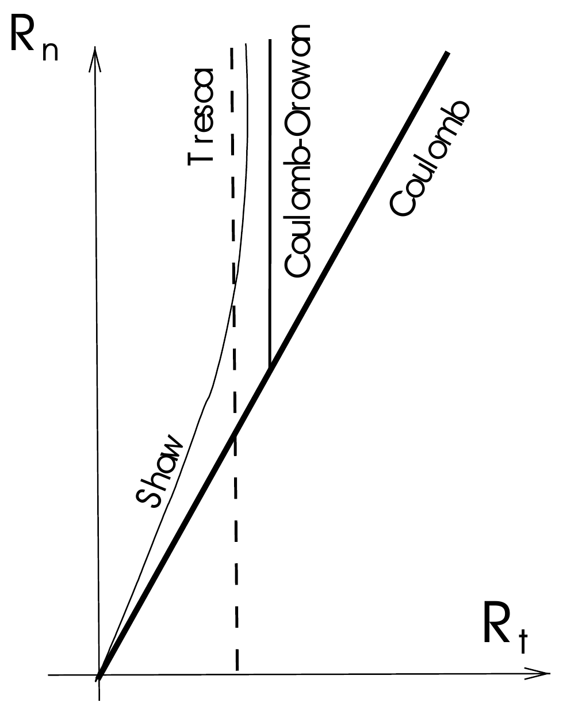
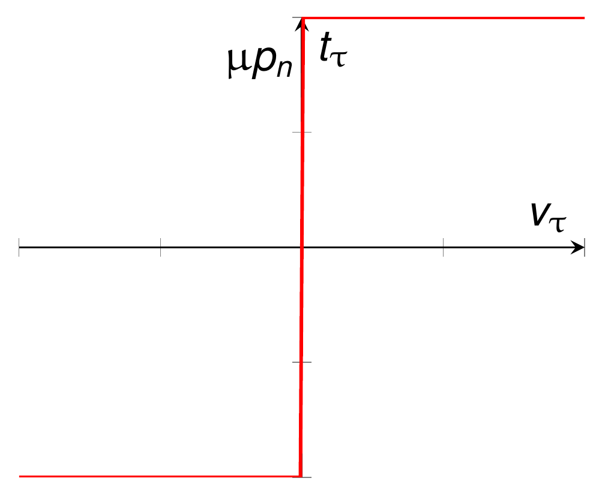
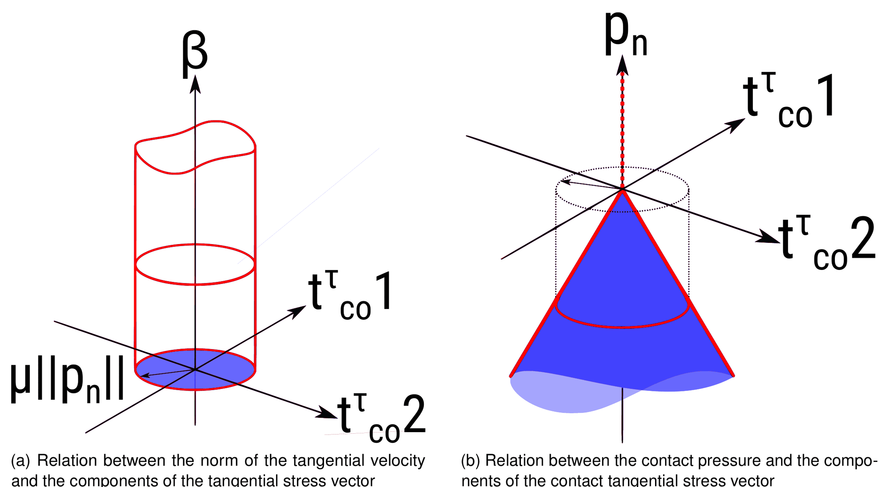
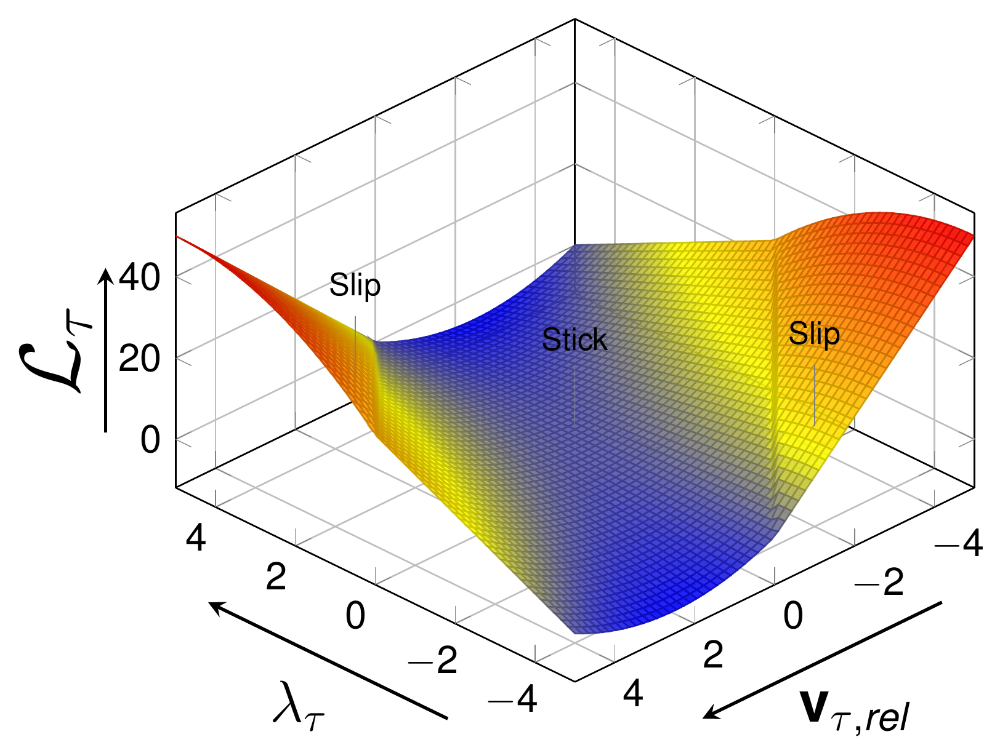
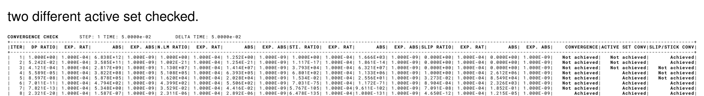
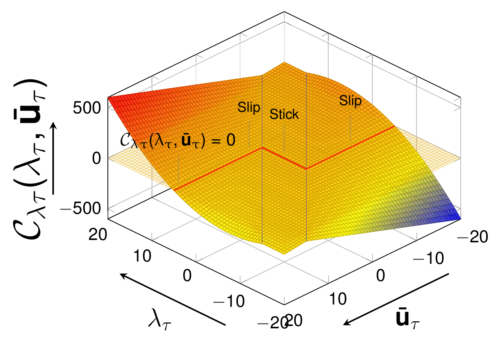

> **Sources.** Thesis §4.2.5 (p. 96, frictional models), §4.3.4 (pp. 113–123: strong form, weak forms, discretisation, algebraic forms, Algorithm 3, active-set strategy), Table 4.3; code: `custom_conditions/ALM_frictional_mortar_contact_condition.{h,cpp}`, `custom_conditions/penalty_frictional_mortar_contact_condition.{h,cpp}`, `custom_conditions/mpc_mortar_contact_condition.cpp`, `automatic_differentiation/ALM_frictional_mortar_condition/generate_frictional_mortar_condition.py`, `automatic_differentiation/penalty_frictional_mortar_condition/generate_penalty_frictional_mortar_condition.py`, `custom_utilities/active_set_utilities.cpp`, `custom_utilities/mortar_explicit_contribution_utilities.cpp`, `custom_strategies/custom_convergencecriterias/alm_frictional_mortar_criteria.h`, `custom_strategies/custom_convergencecriterias/displacement_lagrangemultiplier_frictional_contact_criteria.h`, `custom_frictional_laws/{coulomb,tresca}_frictional_law.cpp`, `python_scripts/alm_contact_process.py`, `python_scripts/auxiliary_methods_solvers.py`.

This page extends the [frictionless formulation](Frictionless_Contact.html) to frictional contact. Everything that is common with the frictionless case (definition of the problem, kinematics, gap function, dual Lagrange multipliers, mortar operators $$\mathbf{D}$$ and $$\mathbf{M}$$) is not repeated here; see [Frictionless contact](Frictionless_Contact.html) and [Mortar integration and dual Lagrange multipliers](Mortar_Integration_And_Dual_Lagrange_Multipliers.html). The notation follows the thesis: superscript $$1$$ is the slave body, superscript $$2$$ the master body, $$\mathbf{n}$$ the slave normal, $$\lambda_n$$ the normal Lagrange multiplier, $$\boldsymbol{\lambda}_\tau$$ the tangential one, $$\tilde{g}_n$$ the weighted gap, $$\bar{\lambda}_n$$ the augmented normal pressure, $$\varepsilon$$ the penalty and $$k$$ the scale factor.

The application implements three frictional variants, all restricted to the **Coulomb** law:

| Variant | `mortar_type` | Process / `contact_type` | Condition family | Extra DoFs |
|---|---|---|---|---|
| Augmented Lagrangian (ALM), vector LM | `ALMContactFrictional`, `ALMContactFrictionalPureSlip` | `alm_contact_process` / `Frictional`, `FrictionalWithNormalUpdate`, `FrictionalPureSlip` | `ALM[NV]Frictional[Axisym]MortarContactCondition*` | `VECTOR_LAGRANGE_MULTIPLIER` |
| Penalty, displacement only | `PenaltyContactFrictional`, `PenaltyContactFrictionalPureSlip` | `penalty_contact_process` / same values | `Penalty[NV]Frictional[Axisym]MortarContactCondition*` | none |
| Multipoint constraint (simplified NTN/NTS) | — (`mpc_contact_settings`) | `mpc_contact_process` / `Frictional`, `FrictionalPureSlip` | `MPCMortarContactCondition*` + `ContactMasterSlaveConstraint` | none |

## Frictional models (thesis §4.2.5)

The tribological origin of friction is complex (elastic and plastic deformation of asperities, wear particles, micro-fractures, …). The application deliberately restricts itself to the two simplest macroscopic laws, **Tresca** and **Coulomb** (thesis eq. 4.1):

<p align="center">$$ \begin{cases} \text{Tresca:} & \Vert \mathbf{F}_T \Vert \le g \\ \text{Coulomb:} & \Vert \mathbf{F}_T \Vert \le \mu \, \vert F_N \vert \end{cases} $$</p>

The Tresca law depends only on a constant threshold $$g$$, whereas Coulomb's law scales the tangential threshold with the normal reaction through the friction coefficient $$\mu$$. More elaborate laws (Coulomb–Orowan, Shaw, regularised Coulomb) saturate or smooth the friction cone, see Fig. 4.10; they are not implemented, but the generic threshold $$\mathscr{F}$$ introduced below is the single place where a different law would enter (see [Frictional laws](#frictional-laws-coulomb-and-tresca) at the end of this page).

<p align="center"></p>
<p align="center"><em>Figure: Friction cone for variants of the Coulomb law (thesis Fig. 4.10, inspired by Rao et al. 2016).</em></p>

## Strong formulation (thesis §4.3.4.1)

The solution spaces, the balance of linear momentum and the normal Karush–Kuhn–Tucker (KKT) conditions are exactly those of the frictionless problem (thesis eqs. 4.2–4.7); in particular the *vector* Lagrange multiplier developments of the "components" formulation (thesis §4.3.3.2.2) are reused. What is added is a constitutive law in the tangential direction.

### Tangential contact condition: Coulomb's law

The Coulomb law relates the tangential traction $$\mathbf{t}^\tau_{co}$$ to the tangential relative velocity $$\mathbf{v}_{\tau,rel}$$ through a non-smooth graph (Fig. 4.20) and is written with a slip-rate parameter $$\beta$$ (thesis eq. 4.45):

<p align="center">$$ \begin{aligned} \phi_{co} &:= \Vert \mathbf{t}^\tau_{co} \Vert - \mu \Vert p_n \Vert \le 0 & \text{(4.45a)} \\ \mathbf{v}_{\tau,rel}(\mathbf{X}^1, t) + \beta \, \mathbf{t}^\tau_{co} &= \mathbf{0} & \text{(4.45b)} \\ \beta &\ge 0 & \text{(4.45c)} \\ \phi_{co} \, \beta &= 0 & \text{(4.45d)} \end{aligned} $$</p>

where $$\mu$$ is the friction coefficient and $$\beta$$ the velocity–traction ratio. Eq. (4.45a) bounds the magnitude of the tangential stress by $$\mu$$ times the normal contact pressure. When the tangential stress is strictly below the Coulomb limit ($$\phi_{co} \lt 0$$) the complementarity condition (4.45d) forces $$\beta = 0$$, hence $$\mathbf{v}_{\tau,rel} = \mathbf{0}$$: this is the **stick** state. When the tangential stress lies on the Coulomb limit ($$\phi_{co} = 0$$), $$\beta$$ may be positive and (4.45b) forces the tangential stress to oppose the relative tangential velocity: this is the **slip** state.

<p align="center"></p>
<p align="center"><em>Figure: Coulomb's schematic depiction of the frictional contact condition in tangential direction (thesis Fig. 4.20).</em></p>

Figure 4.21 gives the geometrical picture in 3D. In (a) the admissible points are either inside the blue disc ($$\beta = 0$$, $$\Vert \mathbf{t}^\tau_{co} \Vert \le \mu \Vert p_n \Vert$$, stick) or on the surface of the red semi-infinite cylinder ($$\beta \ge 0$$, $$\Vert \mathbf{t}^\tau_{co} \Vert = \mu \Vert p_n \Vert$$, slip). In (b) the interior of the Coulomb cone (blue) is the stick state and the surface of the cone (red) the slip state.

<p align="center"></p>
<p align="center"><em>Figure: Graphical representation of Coulomb's frictional conditions for a 3D contact problem: (a) norm of the tangential velocity vs. tangential stress components, (b) contact pressure vs. tangential stress components (thesis Fig. 4.21, inspired by Yastrebov 2011).</em></p>

The analogy between friction and plasticity (thesis Table 4.3, after Yastrebov and Antoni) is a useful mental model, in particular for the return-mapping-like structure of the slip branch of the ALM functional below:

| Friction | Plasticity |
|---|---|
| Stick state | Elastic deformation |
| Slip state | Plastic flow |
| Coulomb's cone $$\partial C(p_n)$$ | Yield surface |
| Maximal frictional stress $$\Vert \mathbf{t}^\tau_{co} \Vert = \mu \vert p_n \vert$$ | Yield strength |

Finally the tangent direction is defined as the complement of the normal, which also defines the tangential Lagrange multiplier (thesis eq. 4.46):

<p align="center">$$ \boldsymbol{\tau} = \mathbf{I} - \mathbf{n} \otimes \mathbf{n}, \qquad \boldsymbol{\lambda}_\tau = \boldsymbol{\lambda} - \mathbf{n} \, \lambda_n \qquad \text{(4.46)} $$</p>

In the code this is literally how the tangential multiplier is built (`LMTangent[node,idim] = LM[node,idim] - LMNormal[node] * NormalSlave[node,idim]` in the generator, `tangent_lagrange_multiplier = r_lagrange_multiplier - normal_lagrange_multiplier * r_nodal_normal` in `ActiveSetUtilities`).

## Weak formulation (thesis §4.3.4.2)

### Lagrange multiplier method (LMM)

Multiplying the balance of momentum (thesis eq. 4.2) by a test function $$\mathbf{w}^i \in \mathcal{V}^i$$ and integrating on each domain $$i$$ gives (thesis eq. 4.47)

<p align="center">$$ \mathcal{L}^i(\mathbf{u}^i) = \int_{\Omega^i} \left[ \nabla \cdot \boldsymbol{\sigma}^i + \mathbf{b}^i \right] \cdot \mathbf{w}^i \, \mathrm{d}\Omega^i + \int_{\Gamma^i_\sigma} \left[ \mathbf{t}^i - \boldsymbol{\sigma}^i \cdot \mathbf{n}^i \right] \cdot \mathbf{w}^i \, \mathrm{d}\Gamma^i_\sigma + \int_{\Gamma^i_{co}} \left[ \mathbf{t}^i_{co} - \boldsymbol{\sigma}^i \cdot \mathbf{n}^i \right] \cdot \mathbf{w}^i \, \mathrm{d}\Gamma^i_{co} = 0 $$</p>

of which the part corresponding to the frictional contact is (thesis eq. 4.48)

<p align="center">$$ \mathcal{L}_{co}(\mathbf{u}, \boldsymbol{\lambda}) = \int_{\Gamma^i_c} \left[ \mathbf{t}^i_{co} - \boldsymbol{\sigma}^i \cdot \mathbf{n}^i \right] \mathrm{d}\Gamma^i_{co} $$</p>

Taking the test functions as virtual displacements $$\delta \mathbf{u}$$ and applying the divergence theorem yields the virtual work expression (thesis eq. 4.49)

<p align="center">$$ \delta \mathcal{L}^i(\mathbf{u}^i, \delta \mathbf{u}^i) = \int_{\Omega^i} \boldsymbol{\sigma}^i : \frac{\partial \delta \hat{\mathbf{u}}^i}{\partial x_j} \, \mathrm{d}\Omega^i - \int_{\Omega^i} \mathbf{b}^i \cdot \delta \mathbf{u}^i \, \mathrm{d}\Omega^i - \int_{\Gamma^i_\sigma} \mathbf{t}^i \cdot \delta \mathbf{u}^i \, \mathrm{d}\Gamma^i_\sigma - \int_{\Gamma^i_{co}} \mathbf{t}^i_{co} \cdot \delta \mathbf{u}^i \, \mathrm{d}\Gamma^i_{co} = 0 \quad \forall \delta \mathbf{u}^i \in \mathcal{V}^i $$</p>

which is regrouped into kinetic, internal/external and contact contributions as in the frictionless case (thesis eq. 4.50):

<p align="center">$$ \begin{aligned} -\delta \mathcal{L}_{kin}(\mathbf{u}) &= \sum_{i=1}^{2} \left[ \int_{\Omega^i} \rho^i \ddot{\mathbf{u}}^i \cdot \delta \mathbf{u}^i \, \mathrm{d}\Omega^i \right] & \text{(4.50a)} \\ -\delta \mathcal{L}_{int,ext}(\mathbf{u}) &= \sum_{i=1}^{2} \left[ \int_{\Omega^i} \left( \boldsymbol{\sigma}^i : \frac{\partial \delta \hat{\mathbf{u}}^i}{\partial x_j} - \mathbf{b} \cdot \delta \mathbf{u}^i \right) \mathrm{d}\Omega^i - \int_{\Gamma^i_\sigma} \mathbf{t}^i \cdot \delta \mathbf{u}^i \, \mathrm{d}\Gamma^i_\sigma \right] & \text{(4.50b)} \\ -\delta \mathcal{L}_{co}(\mathbf{u}, \boldsymbol{\lambda}) &= \int_{\Gamma^1_{co}} \mathbf{t}^1_{co} \cdot \delta \mathbf{t}^1_c \, \mathrm{d}\Gamma^1_{co} & \text{(4.50c)} \end{aligned} $$</p>

The balance of tractions across the interface (thesis eq. 4.51) is $$\mathbf{t}^1_{co} \, \mathrm{d}\gamma^1 = -\mathbf{t}^2_{co} \, \mathrm{d}\gamma^2$$, so, taking the slave surface as reference, the contact virtual work is written in terms of the *general* (vector) gap $$\mathbf{g}$$ instead of the normal gap only, and the Lagrange multiplier is identified as the negative slave contact traction (thesis eq. 4.52):

<p align="center">$$ \delta \mathcal{L}_{co}(\mathbf{u}, \boldsymbol{\lambda}) = - \int_{\Gamma^1_{co}} \mathbf{t}^1_{co} \cdot \delta \mathbf{g} \, \mathrm{d}\Gamma^1_{co}, \qquad \mathbf{g} = \left( \mathbf{u}^1 - \chi \cdot \mathbf{u}^2 \right), \qquad \boldsymbol{\lambda} = -\mathbf{t}^1_{co} \qquad \text{(4.52)} $$</p>

where $$\chi$$ is the interface mapping from the slave to the master surface.

### Contact constraints

Using the multiplier of (4.52c), eq. (4.52a) is decomposed into normal and tangential components $$\lambda_n$$ and $$\boldsymbol{\lambda}_\tau$$, each with its own variational inequality (thesis eq. 4.53):

<p align="center">$$ \begin{aligned} \lambda_n \in \mathbb{R}^+_0 : \quad & g \left( \delta \lambda_n - \lambda_n \right) \ge 0 \quad \forall \delta \lambda_n \in \mathbb{R}^+_0 & \text{(4.53a)} \\ \boldsymbol{\lambda}_\tau \in \mathcal{B}(\mu \lambda_n) : \quad & \mathbf{v}_{\tau,rel} \cdot \left( \delta \boldsymbol{\lambda}_\tau - \boldsymbol{\lambda}_\tau \right) \le 0 \quad \forall \delta \boldsymbol{\lambda}_\tau \in \mathcal{B}(\mu \lambda_n) & \text{(4.53b)} \end{aligned} $$</p>

$$\mathcal{B}(\mu \lambda_n)$$ is the $$(n-1)$$-dimensional sphere (disc) of centre $$0$$ and radius $$\mu \lambda_n$$, and $$\delta \boldsymbol{\lambda}_\tau$$ is a *trial* force in the tangential plane: (4.53b) is the principle of maximal dissipation representing Coulomb's law. The weak form of both constraints on the slave contact surface is (thesis eq. 4.54)

<p align="center">$$ \boldsymbol{\lambda} \in \mathcal{M}(\boldsymbol{\lambda}) : \quad \int_{\gamma^1_{co}} g \left( \delta \lambda_n - \lambda_n \right) \mathrm{d}\lambda \ge 0, \qquad \int_{\gamma^1_{co}} \mathbf{v}_{\tau,rel} \left( \delta \boldsymbol{\lambda}_\tau - \boldsymbol{\lambda}_\tau \right) \mathrm{d}\lambda \le 0 \quad \forall \delta \boldsymbol{\lambda} \in \mathcal{M}(\boldsymbol{\lambda}) \qquad \text{(4.54)} $$</p>

where the admissible solution space of the multiplier (also the test space of the trial forces) is the convex subset $$\mathcal{M}(\boldsymbol{\lambda}) \subset \mathcal{M}$$ (thesis eqs. 4.55–4.56)

<p align="center">$$ \mathcal{M}(\boldsymbol{\lambda}) := \left\{ \delta \boldsymbol{\lambda} \in \mathcal{M} : \langle \delta \boldsymbol{\lambda}, \boldsymbol{\eta} \rangle \le \langle \mu \lambda_n, \Vert \boldsymbol{\eta}_\tau \Vert \rangle, \; \boldsymbol{\eta} \in \mathcal{L}^1 \text{ with } \eta_n \le 0 \right\}, \qquad \langle \delta \boldsymbol{\lambda}, \boldsymbol{\eta} \rangle := \int_{\gamma^1_{co}} \delta \boldsymbol{\lambda} \, \boldsymbol{\eta} \, \mathrm{d}\gamma $$</p>

with $$\langle \cdot, \cdot \rangle$$ the duality pairing of $$\mathcal{M}$$ and $$\mathcal{V}^1$$ on $$\gamma^1_{co}$$.

### Penalty

The penalty formulation is introduced first because the ALM one is its combination with the LMM. The Lagrangian is split into normal and tangential parts (thesis eq. 4.57), with $$\mathbf{t}^n_{co} = \varepsilon_n g_n$$ the normal contact traction and $$\mathbf{t}^\tau_{co} = \varepsilon_\tau \mathbf{v}_{\tau,rel}$$ the tangential one:

<p align="center">$$ \mathcal{L}_{co}(\mathbf{u}) = \int_{\Gamma^i_c} l_n + l_\tau \, \mathrm{d}\Gamma^i_{co} \qquad \text{(4.57a)} $$</p>

<p align="center">$$ l_n(g_n) = \begin{cases} -\dfrac{\varepsilon_n}{2} g_n^2 & , \; \mathbf{t}^n_{co} \le 0 \; \text{(Contact zone)} \\ 0 & , \; \mathbf{t}^n_{co} \gt 0 \; \text{(Gap zone)} \end{cases} \qquad \text{(4.57b)} $$</p>

<p align="center">$$ l_\tau(\mathbf{v}_{\tau,rel}) = \begin{cases} \begin{cases} -\dfrac{\varepsilon_\tau}{2} \mathbf{v}_{\tau,rel} \cdot \mathbf{v}_{\tau,rel} & , \; \Vert \mathbf{t}^\tau_{co} \Vert \le -\mu \mathbf{t}^n_{co}, \; \text{stick} \\ -\dfrac{\mu}{\varepsilon_\tau} \left( \mathbf{t}^n_{co} \right)^2 \dfrac{\mathbf{v}_{\tau,rel}}{\Vert \mathbf{v}_{\tau,rel} \Vert} & , \; \Vert \mathbf{t}^\tau_{co} \Vert \gt -\mu \mathbf{t}^n_{co}, \; \text{slip} \end{cases} & , \; \mathbf{t}^n_{co} \le 0 \; \text{(Contact zone)} \\ 0 & , \; \mathbf{t}^n_{co} \gt 0 \; \text{(Gap zone)} \end{cases} \qquad \text{(4.57c)} $$</p>

Its first variation (thesis eq. 4.58) already shows the three-way branch (stick / slip / gap) that every frictional condition of the application reproduces:

<p align="center">$$ \delta \mathcal{L}_{co}(\mathbf{u}) = \int_{\Gamma^i_c} \begin{cases} \mathbf{t}^n_{co} \cdot \delta g_n + \mathbf{t}^\tau_{co} \cdot \delta \mathbf{v}_{\tau,rel} & \text{if } \Vert \mathbf{t}^\tau_{co} \Vert \le -\mu \mathbf{t}^n_{co} \; \text{(Contact stick zone)} \\ \mathbf{t}^n_{co} \cdot \delta g_n - \mu \mathbf{t}^n_{co} \dfrac{\mathbf{v}_{\tau,rel}}{\Vert \mathbf{v}_{\tau,rel} \Vert} \delta \mathbf{v}_{\tau,rel} & \text{if } \Vert \mathbf{t}^\tau_{co} \Vert \gt -\mu \mathbf{t}^n_{co} \; \text{(Contact slip zone)} \\ 0 & \text{if } \mathbf{t}^n_{co} \gt 0 \; \text{(Gap zone)} \end{cases} \mathrm{d}\Gamma^i_{co} \qquad \text{(4.58)} $$</p>

### Augmented Lagrangian method (ALM)

Following Alart & Curnier, Cardona and Yastrebov, the augmented Lagrangian for friction combines the LMM and the penalty solutions. Focusing on the contact functional $$\mathcal{L}_{co}(\mathbf{u}, \boldsymbol{\lambda}) = \mathcal{L}_{\mathcal{V}co} + \mathcal{L}_\mathcal{M}$$ (thesis eq. 4.59)

<p align="center">$$ \mathcal{L}_{co}(\mathbf{u}, \boldsymbol{\lambda}) = \int_{\Gamma^i_c} l_n + l_\tau \, \mathrm{d}\Gamma^i_{co} \qquad \text{(4.59)} $$</p>

the normal part is the same as in the frictionless case (thesis eq. 4.60a), with $$\bar{\lambda}_n = k \lambda_n + \varepsilon_n g_n$$ the **augmented normal multiplier**:

<p align="center">$$ l_n(g_n, \lambda_n) = \begin{cases} \bar{\lambda}_n g_n - \dfrac{\varepsilon_n}{2} g_n^2 & , \; \bar{\lambda}_n \le 0 \; \text{(Contact zone)} \\ -\dfrac{k^2}{2 \varepsilon_n} \lambda_n^2 & , \; \bar{\lambda}_n \gt 0 \; \text{(Gap zone)} \end{cases} \qquad \text{(4.60a)} $$</p>

and the tangential part (thesis eq. 4.60b), with $$\bar{\boldsymbol{\lambda}}_\tau = k \boldsymbol{\lambda}_\tau + \varepsilon_\tau \mathbf{v}_{\tau,rel}$$ the **augmented tangential multiplier**:

<p align="center">$$ l_\tau(\mathbf{v}_{\tau,rel}, \boldsymbol{\lambda}_\tau) = \begin{cases} \begin{cases} \bar{\boldsymbol{\lambda}}_\tau \cdot \mathbf{v}_{\tau,rel} - \dfrac{\varepsilon_\tau}{2} \mathbf{v}_{\tau,rel} \cdot \mathbf{v}_{\tau,rel} & , \; \Vert \bar{\boldsymbol{\lambda}}_\tau \Vert \le -\mu \bar{\lambda}_n, \; \text{stick} \\ -\dfrac{1}{2 \varepsilon_\tau} \left( k^2 \boldsymbol{\lambda}_\tau \cdot \boldsymbol{\lambda}_\tau + 2 \mu \bar{\lambda}_n \Vert \boldsymbol{\lambda}_\tau \Vert + \mu^2 \bar{\lambda}_n^2 \right) & , \; \Vert \bar{\boldsymbol{\lambda}}_\tau \Vert \gt -\mu \bar{\lambda}_n, \; \text{slip} \end{cases} & , \; \bar{\lambda}_n \le 0 \; \text{(Contact zone)} \\ -\dfrac{k^2}{2 \varepsilon_\tau} \boldsymbol{\lambda}_\tau \cdot \boldsymbol{\lambda}_\tau & , \; \bar{\lambda}_n \gt 0 \; \text{(Gap zone)} \end{cases} \qquad \text{(4.60b)} $$</p>

Here $$\varepsilon_n$$ and $$\varepsilon_\tau$$ are positive penalty parameters for the normal and tangential directions and $$k$$ is the positive scale factor. With the Macaulay bracket $$\langle \cdot \rangle$$ both parts collapse to a single expression each (thesis eq. 4.61):

<p align="center">$$ l_n(g_n, \lambda_n) = \frac{1}{\varepsilon_n} \left( k^2 \lambda_n^2 - \langle \bar{\lambda}_n \rangle^2 \right), \qquad l_\tau(\mathbf{v}_{\tau,rel}, \boldsymbol{\lambda}_\tau) = \frac{1}{\varepsilon_\tau} \left( k^2 \boldsymbol{\lambda}_\tau \cdot \boldsymbol{\lambda}_\tau - \Vert \bar{\boldsymbol{\lambda}}_\tau \Vert^2 - \left\langle \Vert \bar{\boldsymbol{\lambda}}_\tau \Vert - \mu \vert \bar{\lambda}_n \vert \right\rangle^2 \right) \qquad \text{(4.61)} $$</p>

This functional is a $$\mathcal{C}^1$$-differentiable saddle point (Fig. 4.22); the solution is the set of values that render it stationary. As in the frictionless case the solution does not depend on $$\varepsilon_n$$, $$\varepsilon_\tau$$, $$k$$, only the convergence rate does (see the parameter calibration in [Constrained optimisation methods](Constrained_Optimisation_Methods.html)).

<p align="center"></p>
<p align="center"><em>Figure: Augmented Lagrangian function for the frictional contact problem, corresponding to eq. (4.61b); the stick valley and the two slip flanks are visible (thesis Fig. 4.22).</em></p>

Deriving (4.59) gives the variational form (thesis eq. 4.62), which is the continuous counterpart of the five branches generated symbolically in the code:

<p align="center">$$ \delta \mathcal{L}_{co}(\mathbf{u}, \boldsymbol{\lambda}) = \int_{\Gamma^1_c} \begin{cases} \bar{\lambda}_n \cdot \delta g_n + k g_n \delta \lambda_n + \bar{\boldsymbol{\lambda}}_\tau \cdot \delta \mathbf{v}_{\tau,rel} + \mathbf{v}_{\tau,rel} \cdot \delta \bar{\boldsymbol{\lambda}}_\tau & \text{if } \Vert \bar{\boldsymbol{\lambda}}_\tau \Vert \le -\mu \bar{\lambda}_n \; \text{(Contact stick zone)} \\ \bar{\lambda}_n \cdot \delta g_n + k g_n \delta \lambda_n - \mu \bar{\lambda}_n \dfrac{\boldsymbol{\lambda}_\tau}{\Vert \boldsymbol{\lambda}_\tau \Vert} \delta \mathbf{v}_{\tau,rel} - \dfrac{k \boldsymbol{\lambda}_\tau + \mu \bar{\lambda}_n \frac{\bar{\boldsymbol{\lambda}}_\tau}{\Vert \bar{\boldsymbol{\lambda}}_\tau \Vert}}{\varepsilon_\tau} \cdot \delta \boldsymbol{\lambda}_\tau & \text{if } \Vert \bar{\boldsymbol{\lambda}}_\tau \Vert \gt -\mu \bar{\lambda}_n \; \text{(Contact slip zone)} \\ -\dfrac{k^2}{\varepsilon_n} \lambda_n \delta \lambda_n - \dfrac{k^2}{\varepsilon_\tau} \boldsymbol{\lambda}_\tau \cdot \delta \boldsymbol{\lambda}_\tau & \text{if } \bar{\lambda}_n \gt 0 \; \text{(Gap zone)} \end{cases} \mathrm{d}\Gamma^i_{co} \qquad \text{(4.62)} $$</p>

Because of (4.62) the system to solve depends on whether each node is in the gap, stick or slip zone: the system is not known a priori, as in the frictionless case, but now with one additional configuration. This is what the frictional active-set strategy below resolves.

## Discretisation and numerical integration (thesis §4.3.4.3)

The dual Lagrange multipliers and the mortar operators are identical to the frictionless case. The new ingredients are the discrete tangential contact condition and, above all, a proper **discrete slip** built from the mortar operators.

### Discrete contact condition in tangential direction

The tangential relative velocity $$\mathbf{v}_{\tau,rel}$$ is discretised with the material velocity field $$\dot{\mathbf{x}}^i$$, interpolated with the same shape functions as $$\mathbf{x}^i$$ (thesis eq. 4.63):

<p align="center">$$ \int_{\gamma^1_c} \mathbf{v}_{\tau,rel} \cdot \left( \delta \boldsymbol{\lambda}_\tau - \boldsymbol{\lambda}_\tau \right) \mathrm{d}\gamma \approx \sum_{j=1}^{n_{slaves}} \left( \delta \boldsymbol{\lambda}_\tau - \boldsymbol{\lambda}_\tau \right)^T \boldsymbol{\tau}_j \left[ \int_{\gamma^1_c} \Phi_j N^1_j \, \mathrm{d}\gamma \, \dot{\mathbf{x}}^1_j - \sum_{l=1}^{n_{master}} \int_{\gamma^1_c} \Phi_j \left( N^2_l \cdot \xi \right) \mathrm{d}\gamma \, \dot{\mathbf{x}}^2_l \right] \ge 0 \quad \forall \delta \boldsymbol{\lambda} \in \mathcal{M}(\boldsymbol{\lambda}) \qquad \text{(4.63)} $$</p>

and, recognising the mortar operators $$\mathbf{D}$$ and $$\mathbf{M}$$ (thesis §4.3.3.4.2), it becomes an expression in the **weighted relative velocity** $$\tilde{\mathbf{v}}_{\tau j}$$ (thesis eq. 4.64):

<p align="center">$$ \int_{\gamma^1_c} \mathbf{v}_{\tau,rel} \cdot \left( \delta \boldsymbol{\lambda}_\tau - \boldsymbol{\lambda}_\tau \right) \mathrm{d}\gamma \approx \sum_{j=1}^{n_{slaves}} \left( \delta \boldsymbol{\lambda}_\tau - \boldsymbol{\lambda}_\tau \right)^T \boldsymbol{\tau}_j \left[ \mathbf{D}_j \dot{\mathbf{x}}^1_j - \sum_{l=1}^{n_{master}} \mathbf{M}_l \dot{\mathbf{x}}^2_l \right] = \sum_{j=1}^{n_{slaves}} \left( \delta \boldsymbol{\lambda}_\tau - \boldsymbol{\lambda}_\tau \right)^T \tilde{\mathbf{v}}_{\tau j} \ge 0 \qquad \text{(4.64)} $$</p>

### Slip definition and frame indifference

A proper frictional formulation in the finite-sliding context requires **frame indifference** (objectivity) of the rate measures: the tangential relative velocity must be unaffected by any rigid body motion that both bodies experience at the instant considered (Gitterle 2012, Yang–Laursen–Meng). Working in the time-continuous case, the naive mortar-projected tangential velocity is *not* frame indifferent (thesis eq. 4.65a). Objectivity is tested by viewing the motion from another frame (superscript $$*$$), related to the original one by a rigid translation $$\mathbf{c}(t)$$ and a proper orthogonal rotation $$\mathbf{Q}(t)$$ (4.65b); a frame-indifferent relative velocity must transform as (4.65c), but applying (4.65b) to (4.65a) gives (4.65d):

<p align="center">$$ \begin{aligned} \tilde{\mathbf{v}}^{nonobj}_\tau &= \boldsymbol{\tau}_j \left[ \mathbf{D}_j \dot{\mathbf{x}}^1_j - \sum_{l=1}^{n_{master}} \mathbf{M}_l \dot{\mathbf{x}}^2_l \right] & \text{(4.65a)} \\ \dot{\mathbf{x}}^{(1*)}_j &= \mathbf{c}(t) + \mathbf{Q}(t) \, \dot{\mathbf{x}}^1_j & \text{(4.65b)} \\ \tilde{\mathbf{v}}^{*}_\tau &= \mathbf{Q}(t) \, \tilde{\mathbf{v}}_\tau & \text{(4.65c)} \\ \tilde{\mathbf{v}}^{nonobj*}_\tau &= \mathbf{Q}(t) \, \tilde{\mathbf{v}}^{nonobj}_\tau - \dot{\mathbf{Q}}(t) \left[ \mathbf{D}_j \mathbf{x}^1_j - \sum_{l=1}^{n_{master}} \mathbf{M}_l \mathbf{x}^2_l \right] \cdot \boldsymbol{\tau}_j & \text{(4.65d)} \end{aligned} $$</p>

Since in general $$\left[ \mathbf{D}_j \mathbf{x}^1_j - \sum_l \mathbf{M}_l \mathbf{x}^2_l \right] \ne \mathbf{0}$$, (4.65d) violates (4.65c). Objectivity is restored by subtracting the rate of the mortar-projected distance between the bodies, $$\dot{\mathbf{g}}$$ (thesis eq. 4.66):

<p align="center">$$ \tilde{\mathbf{v}}_\tau = \boldsymbol{\tau}_j \left[ \mathbf{D}_j \dot{\mathbf{x}}^1_j - \sum_{l=1}^{n_{master}} \mathbf{M}_l \dot{\mathbf{x}}^2_l - \dot{\mathbf{g}} \right] \qquad \text{(4.66)} $$</p>

This retains the meaning of a tangential relative velocity when perfect sliding occurs ($$\dot{\mathbf{g}} = \mathbf{0}$$) but is objective under all conditions of contact. Expanding the time derivative of the mortar-projected distance (thesis eq. 4.67a) and inserting it in (4.66) shows that the objective velocity is carried entirely by the **rates of the mortar operators** (thesis eq. 4.67b):

<p align="center">$$ \dot{\mathbf{g}} = \frac{\mathrm{d}}{\mathrm{d}t} \left[ \mathbf{D}_j \mathbf{x}^1_j - \sum_{l=1}^{n_{master}} \mathbf{M}_l \mathbf{x}^2_l \right] = \left[ \mathbf{D}_j \dot{\mathbf{x}}^1_j - \sum_{l=1}^{n_{master}} \mathbf{M}_l \dot{\mathbf{x}}^2_l \right] + \left[ \dot{\mathbf{D}}_j \mathbf{x}^1_j - \sum_{l=1}^{n_{master}} \dot{\mathbf{M}}_l \mathbf{x}^2_l \right] \qquad \text{(4.67a)} $$</p>

<p align="center">$$ \tilde{\mathbf{v}}_\tau = \boldsymbol{\tau}_j \left[ \dot{\mathbf{D}}_j \mathbf{x}^1_j - \sum_{l=1}^{n_{master}} \dot{\mathbf{M}}_l \mathbf{x}^2_l \right] \qquad \text{(4.67b)} $$</p>

The rates of the mortar operators are approximated with any time scheme, in practice **backward Euler** (thesis eq. 4.68):

<p align="center">$$ \frac{\mathrm{d}(\cdot)}{\mathrm{d}t} \approx \frac{(\cdot)^{t+\Delta t} - (\cdot)^t}{\Delta t}, \qquad \frac{\mathrm{d}\mathbf{D}}{\mathrm{d}t} \approx \frac{\mathbf{D}^{t+\Delta t}_j - \mathbf{D}^t_j}{\Delta t}, \quad \frac{\mathrm{d}\mathbf{M}}{\mathrm{d}t} \approx \frac{\mathbf{M}^{t+\Delta t}_l - \mathbf{M}^t_l}{\Delta t} \qquad \text{(4.68)} $$</p>

which gives the discrete weighted tangential velocity (thesis eq. 4.69a) and, multiplied by $$\Delta t$$, the **nodal slip increment** $$\tilde{\mathbf{u}}_\tau$$ (thesis eq. 4.69b) that enters all the algebraic systems below:

<p align="center">$$ \tilde{\mathbf{v}}_\tau = \boldsymbol{\tau}_j \left[ \frac{\mathbf{D}^{t+\Delta t}_j - \mathbf{D}^t_j}{\Delta t} \mathbf{x}^1_j - \sum_{l=1}^{n_{master}} \frac{\mathbf{M}^{t+\Delta t}_l - \mathbf{M}^t_l}{\Delta t} \mathbf{x}^2_l \right], \qquad \tilde{\mathbf{u}}_\tau = \boldsymbol{\tau}_j \left[ \left( \mathbf{D}^{t+\Delta t}_j - \mathbf{D}^t_j \right) \mathbf{x}^1_j - \sum_{l=1}^{n_{master}} \left( \mathbf{M}^{t+\Delta t}_l - \mathbf{M}^t_l \right) \mathbf{x}^2_l \right] \qquad \text{(4.69)} $$</p>

This is why the frictional conditions must **store the mortar operators of the previous converged step** ($$\mathbf{D}^t$$, $$\mathbf{M}^t$$): see `mPreviousMortarOperators` below. The code keeps both the objective slip (4.69b) and the non-objective one obtained from (4.65a), $$\tilde{\mathbf{u}}^{nonobj}_\tau = \boldsymbol{\tau}_j \left[ \mathbf{D}_j (\mathbf{x}^1_j - \mathbf{x}^{1,t}_j) - \sum_l \mathbf{M}_l (\mathbf{x}^2_l - \mathbf{x}^{2,t}_l) \right]$$, and switches between them at run time (`OPERATOR_THRESHOLD`), because when the operators do not change between two steps (e.g. a perfectly matching interface that only translates tangentially, or a step where the pairing did not change) the objective increment (4.69b) is identically zero and the displacement-based one must be used instead.

## Algebraic form of the problem (thesis §4.3.4.3.3)

All frictional systems use a *vector* Lagrange multiplier, so the static condensation with dual multipliers of the frictionless components case (thesis §4.3.3.4.4, `MixedULMLinearSolver`) applies unchanged. In addition to the sets of the frictionless case ($$\mathcal{N}$$ interior nodes, $$\mathcal{M}$$ master nodes, $$\mathcal{S}$$ slave nodes, split into active $$\mathcal{A}$$ and inactive $$\mathcal{I}$$), the active slave set is further split into **slip** ($$sl$$) and **stick** ($$st$$) subsets: $$\mathcal{A} = \mathcal{A}_{sl} \cup \mathcal{A}_{st}$$.

### LMM

With respect to the frictionless components system (thesis §4.3.3.4.3.2), the active LM block is split into slip and stick groups, and so is the multiplier residual (thesis eq. 4.70a):

<p align="center">$$ \left[ \begin{array}{ccccccc} \mathbf{K}_{\mathcal{N}\mathcal{N}} & \mathbf{K}_{\mathcal{N}\mathcal{M}} & \mathbf{K}_{\mathcal{N}\mathcal{S}_\mathcal{A}} & \mathbf{K}_{\mathcal{N}\mathcal{S}_\mathcal{I}} & \mathbf{0} & \mathbf{0} & \mathbf{0} \\ \mathbf{K}_{\mathcal{M}\mathcal{N}} & \mathbf{K}_{\mathcal{M}\mathcal{M}} & \mathbf{K}_{\mathcal{M}\mathcal{S}_\mathcal{A}} & \mathbf{K}_{\mathcal{M}\mathcal{S}_\mathcal{I}} & -\mathbf{M}^T_{\mathcal{A}_{sl}} & -\mathbf{M}^T_{\mathcal{A}_{st}} & -\mathbf{M}^T_{\mathcal{I}} \\ \mathbf{K}_{\mathcal{S}_\mathcal{A}\mathcal{N}} & \mathbf{K}_{\mathcal{S}_\mathcal{A}\mathcal{M}} & \mathbf{K}_{\mathcal{S}_\mathcal{A}\mathcal{S}_\mathcal{A}} & \mathbf{K}_{\mathcal{S}_\mathcal{A}\mathcal{S}_\mathcal{I}} & \mathbf{D}^T_{\mathcal{A}\mathcal{A}_{sl}} & \mathbf{D}^T_{\mathcal{A}\mathcal{A}_{st}} & \mathbf{D}^T_{\mathcal{A}\mathcal{I}} \\ \mathbf{K}_{\mathcal{S}_\mathcal{I}\mathcal{N}} & \mathbf{K}_{\mathcal{S}_\mathcal{I}\mathcal{M}} & \mathbf{K}_{\mathcal{S}_\mathcal{I}\mathcal{S}_\mathcal{A}} & \mathbf{K}_{\mathcal{S}_\mathcal{I}\mathcal{S}_\mathcal{I}} & \mathbf{D}^T_{\mathcal{I}\mathcal{A}_{sl}} & \mathbf{D}^T_{\mathcal{I}\mathcal{A}_{st}} & \mathbf{D}^T_{\mathcal{I}\mathcal{I}} \\ \mathbf{0} & \dfrac{\partial \mathbf{r}_{\lambda_{\mathcal{A}_{sl}}}}{\partial \mathbf{u}_\mathcal{M}} & \dfrac{\partial \mathbf{r}_{\lambda_{\mathcal{A}_{sl}}}}{\partial \mathbf{u}_{\mathcal{S}_\mathcal{A}}} & \dfrac{\partial \mathbf{r}_{\lambda_{\mathcal{A}_{sl}}}}{\partial \mathbf{u}_{\mathcal{S}_\mathcal{I}}} & \dfrac{\partial \mathbf{r}_{\lambda_{\mathcal{A}_{sl}}}}{\partial \boldsymbol{\lambda}_{\mathcal{A}_{sl}}} & \dfrac{\partial \mathbf{r}_{\lambda_{\mathcal{A}_{sl}}}}{\partial \boldsymbol{\lambda}_{\mathcal{A}_{st}}} & \mathbf{0} \\ \mathbf{0} & \dfrac{\partial \mathbf{r}_{\lambda_{\mathcal{A}_{st}}}}{\partial \mathbf{u}_\mathcal{M}} & \dfrac{\partial \mathbf{r}_{\lambda_{\mathcal{A}_{st}}}}{\partial \mathbf{u}_{\mathcal{S}_\mathcal{A}}} & \dfrac{\partial \mathbf{r}_{\lambda_{\mathcal{A}_{st}}}}{\partial \mathbf{u}_{\mathcal{S}_\mathcal{I}}} & \dfrac{\partial \mathbf{r}_{\lambda_{\mathcal{A}_{st}}}}{\partial \boldsymbol{\lambda}_{\mathcal{A}_{sl}}} & \dfrac{\partial \mathbf{r}_{\lambda_{\mathcal{A}_{st}}}}{\partial \boldsymbol{\lambda}_{\mathcal{A}_{st}}} & \mathbf{0} \\ \mathbf{0} & \mathbf{0} & \mathbf{0} & \mathbf{0} & \mathbf{0} & \mathbf{0} & \mathbf{I} \end{array} \right] \left[ \begin{array}{c} \Delta \mathbf{u}_\mathcal{N} \\ \Delta \mathbf{u}_\mathcal{M} \\ \Delta \mathbf{u}_{\mathcal{S}_\mathcal{A}} \\ \Delta \mathbf{u}_{\mathcal{S}_\mathcal{I}} \\ \Delta \boldsymbol{\lambda}_{\mathcal{A}_{sl}} \\ \Delta \boldsymbol{\lambda}_{\mathcal{A}_{st}} \\ \Delta \boldsymbol{\lambda}_\mathcal{I} \end{array} \right] = - \left[ \begin{array}{c} \mathbf{r}_\mathcal{N} \\ \mathbf{r}_\mathcal{M} \\ \mathbf{r}_{\mathcal{S}_\mathcal{A}} \\ \mathbf{r}_{\mathcal{S}_\mathcal{I}} \\ \mathbf{r}_{\lambda_{\mathcal{A}_{sl}}} \\ \mathbf{r}_{\lambda_{\mathcal{A}_{st}}} \\ \mathbf{r}_{\lambda_\mathcal{I}} \end{array} \right] \qquad \text{(4.70a)} $$</p>

The multiplier residuals are (thesis eq. 4.70b), with $$\mathscr{F}$$ the generic **frictional threshold**, which for Coulomb's law is (thesis eq. 4.70c):

<p align="center">$$ \begin{cases} \mathbf{r}_{\lambda_{\mathcal{A}_{sl}}} = \mathbf{n} \cdot \left( -\mathbf{n} \cdot \left( \mathbf{D} \mathbf{x}_1 - \mathbf{M} \mathbf{x}_2 \right) \right) - \left( \boldsymbol{\tau} \cdot \boldsymbol{\lambda} - \mathscr{F} \right) \\ \mathbf{r}_{\lambda_{\mathcal{A}_{st}}} = \mathbf{n} \cdot \left( -\mathbf{n} \cdot \left( \mathbf{D} \mathbf{x}_1 - \mathbf{M} \mathbf{x}_2 \right) \right) + \tilde{\mathbf{u}}_\tau \\ \mathbf{r}_{\lambda_\mathcal{I}} = \boldsymbol{\lambda} \end{cases}, \qquad \mathscr{F} = -\mu \lambda_n \boldsymbol{\tau} \qquad \text{(4.70b, 4.70c)} $$</p>

The derivative blocks of the LHS require the mortar operator derivatives described in [Linearisation and derivatives](Linearisation_And_Derivatives.html). The formulation can be adapted to a different frictional criterion by changing $$\mathscr{F}$$ in (4.70b) and in the corresponding active-set computation. $$\tilde{\mathbf{u}}_\tau$$ is the slip increment (4.69b).

### Penalty

Without multipliers, the split between slip and stick must be applied to the *displacement* DoFs of the contact zone, so the contact contributions are added directly to the displacement blocks. The system (thesis eq. 4.71a) therefore does not look square (6 block rows × 3 block columns) but is a square system of equations once the $$sl$$/$$st$$ superscripts are understood as restrictions of the same DoFs:

<p align="center">$$ \left[ \begin{array}{ccc} \mathbf{K}_{\mathcal{N}\mathcal{N}} & \mathbf{K}_{\mathcal{N}\mathcal{M}} & \mathbf{K}_{\mathcal{N}\mathcal{S}} \\ \mathbf{K}^{sl}_{\mathcal{M}\mathcal{N}} & \mathbf{K}^{sl}_{\mathcal{M}\mathcal{M}} - \varepsilon_n \left( \mathbf{n} \cdot \mathbf{M}^{slT} + \dfrac{\partial \left( \mathbf{n} \cdot \mathbf{M}^{slT} \right)}{\partial \mathbf{u}_\mathcal{M}} \mathbf{x}^{sl}_\mathcal{M} \right) + \dfrac{\partial \mathscr{F}_\mathcal{M}}{\partial \mathbf{u}_\mathcal{M}} & \mathbf{K}^{sl}_{\mathcal{M}\mathcal{S}} - \varepsilon_n \dfrac{\partial \left( \mathbf{n} \cdot \mathbf{M}^{slT} \right)}{\partial \mathbf{u}_\mathcal{S}} \mathbf{x}^{sl}_\mathcal{M} + \dfrac{\partial \mathscr{F}_\mathcal{M}}{\partial \mathbf{u}_\mathcal{S}} \\ \mathbf{K}^{sl}_{\mathcal{S}_\mathcal{A}\mathcal{N}} & \mathbf{K}^{sl}_{\mathcal{S}_\mathcal{A}\mathcal{M}} + \varepsilon_n \dfrac{\partial \left( \mathbf{n} \cdot \mathbf{D}^{sl}_\mathcal{A} \right)}{\partial \mathbf{u}_\mathcal{M}} \mathbf{x}^{sl}_{\mathcal{S}_\mathcal{A}} + \dfrac{\partial \mathscr{F}_\mathcal{S}}{\partial \mathbf{u}_\mathcal{M}} & \mathbf{K}^{sl}_{\mathcal{S}_\mathcal{A}\mathcal{S}_\mathcal{A}} + \varepsilon_n \left( \mathbf{n} \cdot \mathbf{D}^{slT}_\mathcal{A} + \dfrac{\partial \left( \mathbf{n} \cdot \mathbf{D}^{slT}_\mathcal{A} \right)}{\partial \mathbf{u}_{\mathcal{S}_\mathcal{A}}} \mathbf{x}^{sl}_{\mathcal{S}_\mathcal{A}} \right) + \dfrac{\partial \mathscr{F}_\mathcal{S}}{\partial \mathbf{u}_{\mathcal{S}_\mathcal{A}}} \\ \mathbf{K}^{st}_{\mathcal{M}\mathcal{N}} & \mathbf{K}^{st}_{\mathcal{M}\mathcal{M}} - \left( \varepsilon_n \mathbf{n} \cdot \mathbf{M}^{stT} + \dfrac{\partial \left( \mathbf{n} \cdot \mathbf{M}^{stT} \right)}{\partial \mathbf{u}_\mathcal{M}} \mathbf{x}^{st}_\mathcal{M} \right) - \varepsilon_t \dfrac{\partial \tilde{\mathbf{u}}_\tau}{\partial \mathbf{u}_\mathcal{M}} & \mathbf{K}^{st}_{\mathcal{M}\mathcal{S}} - \varepsilon_n \dfrac{\partial \left( \mathbf{n} \cdot \mathbf{M}^{stT} \right)}{\partial \mathbf{u}_{\mathcal{S}_\mathcal{A}}} \mathbf{x}^{st}_\mathcal{M} - \varepsilon_t \dfrac{\partial \tilde{\mathbf{u}}_\tau}{\partial \mathbf{u}_{\mathcal{S}_\mathcal{A}}} \\ \mathbf{K}^{st}_{\mathcal{S}_\mathcal{A}\mathcal{N}} & \mathbf{K}^{st}_{\mathcal{S}_\mathcal{A}\mathcal{M}} + \varepsilon_n \dfrac{\partial \left( \mathbf{n} \cdot \mathbf{D}^{st}_\mathcal{A} \right)}{\partial \mathbf{u}_\mathcal{M}} \mathbf{x}^{st}_{\mathcal{S}_\mathcal{A}} + \varepsilon_t \dfrac{\partial \tilde{\mathbf{u}}_\tau}{\partial \mathbf{u}_\mathcal{M}} & \mathbf{K}^{st}_{\mathcal{S}_\mathcal{A}\mathcal{S}_\mathcal{A}} + \varepsilon_n \left( \mathbf{n} \cdot \mathbf{D}^{stT}_\mathcal{A} + \dfrac{\partial \left( \mathbf{n} \cdot \mathbf{D}^{stT}_\mathcal{A} \right)}{\partial \mathbf{u}_{\mathcal{S}_\mathcal{A}}} \mathbf{x}^{st}_{\mathcal{S}_\mathcal{A}} \right) + \varepsilon_t \dfrac{\partial \tilde{\mathbf{u}}_\tau}{\partial \mathbf{u}_{\mathcal{S}_\mathcal{A}}} \\ \mathbf{K}_{\mathcal{S}_\mathcal{I}\mathcal{N}} & \mathbf{K}_{\mathcal{S}_\mathcal{I}\mathcal{M}} & \mathbf{K}_{\mathcal{S}_\mathcal{I}\mathcal{S}_\mathcal{I}} \end{array} \right] \left[ \begin{array}{c} \Delta \mathbf{u}_\mathcal{N} \\ \Delta \mathbf{u}^{sl}_\mathcal{M} \\ \Delta \mathbf{u}^{sl}_{\mathcal{S}_\mathcal{A}} \\ \Delta \mathbf{u}^{st}_\mathcal{M} \\ \Delta \mathbf{u}^{st}_{\mathcal{S}_\mathcal{A}} \\ \Delta \mathbf{u}_{\mathcal{S}_\mathcal{I}} \end{array} \right] = - \left[ \begin{array}{c} \mathbf{r}_\mathcal{N} \\ \mathbf{r}_\mathcal{M} - \varepsilon_n \mathbf{n} \cdot \mathbf{M}^{sl} \mathbf{x}^{sl}_\mathcal{M} + \mathscr{F}_\mathcal{M} \\ \mathbf{r}^{sl}_{\mathcal{S}_\mathcal{A}} + \varepsilon_n \mathbf{n} \cdot \mathbf{D}^{sl}_\mathcal{A} \mathbf{x}^{sl}_\mathcal{S} + \mathscr{F}_\mathcal{S} \\ \mathbf{r}^{st}_\mathcal{M} - \varepsilon_n \mathbf{n} \cdot \mathbf{M}^{st} \mathbf{x}^{st}_\mathcal{M} - \varepsilon_t \tilde{\mathbf{u}}_\tau \\ \mathbf{r}^{st}_{\mathcal{S}_\mathcal{A}} + \varepsilon_n \mathbf{n} \cdot \mathbf{D}^{st}_\mathcal{A} \mathbf{x}^{st}_\mathcal{S} + \varepsilon_t \tilde{\mathbf{u}}_\tau \\ \mathbf{r}_{\mathcal{S}_\mathcal{I}} \end{array} \right] \qquad \text{(4.71a)} $$</p>

For the penalty formulation with Coulomb's law the frictional threshold is $$\mathscr{F} = -\mu \varepsilon_n \tilde{g}_n \boldsymbol{\tau}$$: the penalty approximation of the normal pressure ($$\varepsilon_n \tilde{g}_n$$) multiplied by $$\mu$$ in the tangent direction. Since no multiplier is available to define the tangent direction, it is taken from the slip increment itself, $$\boldsymbol{\tau} = \tilde{\mathbf{u}}_\tau / \Vert \tilde{\mathbf{u}}_\tau \Vert$$ (this is what `ComputePenaltyFrictionalActiveSet` does, see below).

### ALM

The ALM system has the same structure as the LMM one, but with the scale factor $$k$$ multiplying the mortar blocks and with two different penalties, $$\varepsilon_n$$ and $$\varepsilon_\tau$$ (thesis eq. 4.72a):

<p align="center">$$ \left[ \begin{array}{ccccccc} \mathbf{K}_{\mathcal{N}\mathcal{N}} & \mathbf{K}_{\mathcal{N}\mathcal{M}} & \mathbf{K}_{\mathcal{N}\mathcal{S}_\mathcal{A}} & \mathbf{K}_{\mathcal{N}\mathcal{S}_\mathcal{I}} & \mathbf{0} & \mathbf{0} & \mathbf{0} \\ \mathbf{K}_{\mathcal{M}\mathcal{N}} & \mathbf{K}_{\mathcal{M}\mathcal{M}} & \mathbf{K}_{\mathcal{M}\mathcal{S}_\mathcal{A}} & \mathbf{K}_{\mathcal{M}\mathcal{S}_\mathcal{I}} & -k \mathbf{M}^T_{\mathcal{A}_{sl}} & -k \mathbf{M}^T_{\mathcal{A}_{st}} & -k \mathbf{M}^T_{\mathcal{I}} \\ \mathbf{K}_{\mathcal{S}_\mathcal{A}\mathcal{N}} & \mathbf{K}_{\mathcal{S}_\mathcal{A}\mathcal{M}} & \mathbf{K}_{\mathcal{S}_\mathcal{A}\mathcal{S}_\mathcal{A}} & \mathbf{K}_{\mathcal{S}_\mathcal{A}\mathcal{S}_\mathcal{I}} & k \mathbf{D}^T_{\mathcal{A}\mathcal{A}_{sl}} & k \mathbf{D}^T_{\mathcal{A}\mathcal{A}_{st}} & k \mathbf{D}^T_{\mathcal{A}\mathcal{I}} \\ \mathbf{K}_{\mathcal{S}_\mathcal{I}\mathcal{N}} & \mathbf{K}_{\mathcal{S}_\mathcal{I}\mathcal{M}} & \mathbf{K}_{\mathcal{S}_\mathcal{I}\mathcal{S}_\mathcal{A}} & \mathbf{K}_{\mathcal{S}_\mathcal{I}\mathcal{S}_\mathcal{I}} & k \mathbf{D}^T_{\mathcal{I}\mathcal{A}_{sl}} & k \mathbf{D}^T_{\mathcal{I}\mathcal{A}_{st}} & k \mathbf{D}^T_{\mathcal{I}\mathcal{I}} \\ \mathbf{0} & \dfrac{\partial \mathbf{r}_{\lambda_{\mathcal{A}_{sl}}}}{\partial \mathbf{u}_\mathcal{M}} & \dfrac{\partial \mathbf{r}_{\lambda_{\mathcal{A}_{sl}}}}{\partial \mathbf{u}_{\mathcal{S}_\mathcal{A}}} & \dfrac{\partial \mathbf{r}_{\lambda_{\mathcal{A}_{sl}}}}{\partial \mathbf{u}_{\mathcal{S}_\mathcal{I}}} & \dfrac{\partial \mathbf{r}_{\lambda_{\mathcal{A}_{sl}}}}{\partial \boldsymbol{\lambda}_{\mathcal{A}_{sl}}} & \dfrac{\partial \mathbf{r}_{\lambda_{\mathcal{A}_{sl}}}}{\partial \boldsymbol{\lambda}_{\mathcal{A}_{st}}} & \mathbf{0} \\ \mathbf{0} & \dfrac{\partial \mathbf{r}_{\lambda_{\mathcal{A}_{st}}}}{\partial \mathbf{u}_\mathcal{M}} & \dfrac{\partial \mathbf{r}_{\lambda_{\mathcal{A}_{st}}}}{\partial \mathbf{u}_{\mathcal{S}_\mathcal{A}}} & \dfrac{\partial \mathbf{r}_{\lambda_{\mathcal{A}_{st}}}}{\partial \mathbf{u}_{\mathcal{S}_\mathcal{I}}} & \dfrac{\partial \mathbf{r}_{\lambda_{\mathcal{A}_{st}}}}{\partial \boldsymbol{\lambda}_{\mathcal{A}_{sl}}} & \dfrac{\partial \mathbf{r}_{\lambda_{\mathcal{A}_{st}}}}{\partial \boldsymbol{\lambda}_{\mathcal{A}_{st}}} & \mathbf{0} \\ \mathbf{0} & \mathbf{0} & \mathbf{0} & \mathbf{0} & \mathbf{0} & \mathbf{0} & \dfrac{\partial \mathbf{r}_{\lambda_\mathcal{I}}}{\partial \boldsymbol{\lambda}_\mathcal{I}} \end{array} \right] \left[ \begin{array}{c} \Delta \mathbf{u}_\mathcal{N} \\ \Delta \mathbf{u}_\mathcal{M} \\ \Delta \mathbf{u}_{\mathcal{S}_\mathcal{A}} \\ \Delta \mathbf{u}_{\mathcal{S}_\mathcal{I}} \\ \Delta \boldsymbol{\lambda}_{\mathcal{A}_{sl}} \\ \Delta \boldsymbol{\lambda}_{\mathcal{A}_{st}} \\ \Delta \boldsymbol{\lambda}_\mathcal{I} \end{array} \right] = - \left[ \begin{array}{c} \mathbf{r}_\mathcal{N} \\ \mathbf{r}_\mathcal{M} \\ \mathbf{r}_{\mathcal{S}_\mathcal{A}} \\ \mathbf{r}_{\mathcal{S}_\mathcal{I}} \\ \mathbf{r}_{\lambda_{\mathcal{A}_{sl}}} \\ \mathbf{r}_{\lambda_{\mathcal{A}_{st}}} \\ \mathbf{r}_{\lambda_\mathcal{I}} \end{array} \right] \qquad \text{(4.72a)} $$</p>

The multiplier residual is separated in three parts (inactive, active slip, active stick). In the ALM the Coulomb threshold is computed with the **augmented** normal pressure $$\bar{\lambda}_n$$ instead of $$\lambda_n$$, $$\mathscr{F} = -\mu \bar{\lambda}_n \boldsymbol{\tau}$$ (thesis eq. 4.72b):

<p align="center">$$ \begin{cases} \mathbf{r}_{\lambda_{\mathcal{A}_{sl}}} = k \mathbf{n} \cdot \left( -\mathbf{n} \cdot \left( \mathbf{D} \mathbf{x}_1 - \mathbf{M} \mathbf{x}_2 \right) \right) - \dfrac{k^2}{\varepsilon_n} \left( \boldsymbol{\tau} \cdot \boldsymbol{\lambda} - \dfrac{\mathscr{F}}{k} \right) \\ \mathbf{r}_{\lambda_{\mathcal{A}_{st}}} = k \mathbf{n} \cdot \left( -\mathbf{n} \cdot \left( \mathbf{D} \mathbf{x}_1 - \mathbf{M} \mathbf{x}_2 \right) \right) + k \tilde{\mathbf{u}}_\tau \\ \mathbf{r}_{\lambda_\mathcal{I}} = \dfrac{k^2}{\varepsilon_n} \mathbf{n} \cdot \boldsymbol{\lambda} + \dfrac{k^2}{\varepsilon_\tau} \boldsymbol{\tau} \cdot \boldsymbol{\lambda} \end{cases} \qquad \text{(4.72b)} $$</p>

These three residuals are exactly the three nodal branches (inactive / active-slip / active-stick) of the generated `CalculateLocalRHS` of `AugmentedLagrangianMethodFrictionalMortarContactCondition`; the tangential penalty is expressed in the code as $$\varepsilon_\tau = \kappa \, \varepsilon_n$$ with $$\kappa$$ = `TANGENT_FACTOR`.

## Work-flow: solution algorithm (thesis §4.3.4.4, Algorithm 3)

Compared with the frictionless loop (thesis Algorithm 2, see [Frictionless contact](Frictionless_Contact.html)) the frictional loop needs (i) a more complex active set that also tracks the slip/stick state, and (ii) separate residual checks for the normal, tangential-slip and tangential-stick multiplier components, because their orders of magnitude differ greatly and mixing them makes convergence hard to assess. The contact search must be repeated at every time step to follow the evolution of the geometry.

```text
Algorithm 3 — Algorithm for the frictional contact problem (thesis)
 1: procedure ALGORITHM FOR THE FRICTIONAL CONTACT PROBLEM
 2:   t = 0 and i = 0
 3:   Initialise the solution for u^0 = 0
 4:   In case of solving LM solution, initialise the LM solution λ^0 = 0
 5:   Initialise the active set A^0_1 and I^0_1 such that A^0_1 ∪ I^0_1 = S and A^0_1 ∩ I^0_1 = ∅
 6:   Initialise the slip/stick set A^0_sl1 and A^0_st1 such that A^0_sl1 ∪ A^0_st1 = A^0_1 and A^0_sl1 ∩ A^0_st1 = ∅
 7:   while t < t_end do
 8:     t = t + Δt and i = i + 1
 9:     Initialise the increment of solution for Δu^i_1 = 0
10:     In case of solving LM solution, initialise the LM increment Δλ^i_1 = 0
11:     Search for potential contact pairs, and if required update the pairs and the active set, respecting step 5
12:     We define the problem as not converged: conv = false
13:     while conv = false do
14:       Find the solution corresponding to the system of §4.3.4.3.3 (eqs. 4.70a / 4.71a / 4.72a)
15:       Update the solution: u^i_{n+1} = u^i_n + Δu^i_{n+1}, and in case of LM: λ^i_{n+1} = λ^i_n + Δλ^i_{n+1}
16:       Update the active set as in (4.73); the threshold for each case is (4.74)
17:       Update the slip/stick set as in (4.75); this requires the frictional threshold F (4.76) and the tangent contact stress t^τ_co (4.77)
18:       Compute the corresponding residuals and check (4.78)
19:       Solution converged if A^{i+1}_{sl n+1} = A^i_{sl n+1}, A^{i+1}_{st n+1} = A^i_{st n+1}, I^{i+1}_{n+1} = I^i_{n+1} and the residuals (4.78) are converged
```

The active set update (thesis eq. 4.73) and its thresholds (thesis eq. 4.74):

<p align="center">$$ \mathcal{I}^{i+1}_{n+1} := \left\{ j \in \mathcal{S} \, \vert \, \text{threshold}^{i+1}_{n+1} \ge 0 \right\}, \qquad \mathcal{A}^{i+1}_{n+1} := \left\{ j \in \mathcal{S} \, \vert \, \text{threshold}^{i+1}_{n+1} \lt 0 \right\} \qquad \text{(4.73)} $$</p>

<p align="center">$$ \text{threshold}_{LM} = \lambda_n \text{ or } \mathbf{n} \cdot \boldsymbol{\lambda}, \qquad \text{threshold}_{Penalty} = \epsilon \tilde{g}_n, \qquad \text{threshold}_{ALM} = k \lambda_n + \epsilon \tilde{g}_n \text{ or } k \, \mathbf{n} \cdot \boldsymbol{\lambda} + \epsilon \tilde{g}_n \qquad \text{(4.74)} $$</p>

The slip/stick update (thesis eq. 4.75) compares the tangent contact stress with the frictional threshold:

<p align="center">$$ \mathcal{A}^{i+1}_{sl \, n+1} := \left\{ j \in \mathcal{A} \, \vert \, \mathbf{t}^\tau_{co} \ge \mathscr{F}^{i+1}_{n+1} \right\}, \qquad \mathcal{A}^{i+1}_{st \, n+1} := \left\{ j \in \mathcal{A} \, \vert \, \mathbf{t}^\tau_{co} \lt \mathscr{F}_{n+1} \right\} \qquad \text{(4.75)} $$</p>

with Coulomb thresholds and tangent stresses per formulation (thesis eqs. 4.76–4.77):

<p align="center">$$ \mathscr{F}_{LM} = \mu \, \mathbf{n} \cdot \boldsymbol{\lambda}, \qquad \mathscr{F}_{Penalty} = \mu \varepsilon_n \tilde{g}_n, \qquad \mathscr{F}_{ALM} = \mu \left( k \, \mathbf{n} \cdot \boldsymbol{\lambda} + \varepsilon_n \tilde{g}_n \right) \qquad \text{(4.76)} $$</p>

<p align="center">$$ \mathbf{t}^\tau_{LM \, co} = \Vert \boldsymbol{\tau} \cdot \boldsymbol{\lambda} \Vert, \qquad \mathbf{t}^\tau_{Penalty \, co} = \Vert \varepsilon_\tau \tilde{\mathbf{u}}_\tau \Vert, \qquad \mathbf{t}^\tau_{ALM \, co} = \Vert k \boldsymbol{\tau} \cdot \boldsymbol{\lambda} + \varepsilon_\tau \tilde{\mathbf{u}}_\tau \Vert \qquad \text{(4.77)} $$</p>

and finally the four separate residual checks (thesis eq. 4.78):

<p align="center">$$ \Vert \mathbf{r}_u \Vert \lt \text{tolerance}_u, \qquad \Vert \mathbf{r}_{\lambda_n} \Vert \lt \text{tolerance}_{\lambda_n}, \qquad \Vert \mathbf{r}_{\lambda^{sl}_\tau} \Vert \lt \text{tolerance}_{\lambda^{sl}_\tau}, \qquad \Vert \mathbf{r}_{\lambda^{st}_\tau} \Vert \lt \text{tolerance}_{\lambda^{st}_\tau} \qquad \text{(4.78)} $$</p>

Figure 4.23 is the console output of Kratos for one time step of a frictional problem: the table printed by `MortarAndConvergenceCriteria` shows the displacement, normal-LM, stick-LM and slip-LM ratios/absolute norms of (4.78) together with the two active-set columns (`ACTIVE SET CONV`, `SLIP/STICK CONV`) of Algorithm 3, line 19.

<p align="center"></p>
<p align="center"><em>Figure: Example of convergence check in the frictional contact — four residuals plus the active set and the slip/stick set (thesis Fig. 4.23).</em></p>

## Active set strategy: semi-smooth Newton (thesis §4.3.4.5)

As for the frictionless problem, the reformulation of the frictional conditions as a non-smooth system of equations allows a primal-dual active set strategy (PDASS) interpreted as a semi-smooth Newton method. The LM contribution of the augmented Lagrangian (4.60) replaces the nonlinear complementarity (NCP) function used by Popp and Gitterle; in tangential direction this NCP function is a two-component vector equation (thesis eq. 4.79)

<p align="center">$$ \mathcal{C}_\tau(\boldsymbol{\lambda}_\tau, \tilde{\mathbf{u}}_\tau) = \max\left( \mu \bar{\lambda}_n, \Vert \bar{\boldsymbol{\lambda}}_\tau \Vert \right) \boldsymbol{\lambda}_\tau - \mu \max\left( 0, \lambda_n \right) \bar{\boldsymbol{\lambda}}_\tau \qquad \text{(4.79)} $$</p>

whose zero level set (Fig. 4.24) shows the same stick/slip behaviour as the augmented Lagrangian of Fig. 4.22. Each Newton iteration of Algorithm 3 therefore solves a *linear* system for the current guess of $$(\mathcal{A}_{sl}, \mathcal{A}_{st}, \mathcal{I})$$, and the sets are updated with (4.73)–(4.75) until they are stationary.

<p align="center"></p>
<p align="center"><em>Figure: NCP function for the frictional contact problem, eq. (4.79) (thesis Fig. 4.24).</em></p>

In the code the "full" semi-smooth Newton (active/slip sets updated at every nonlinear iteration) is the default; setting `simplified_semi_smooth_newton: true` in `contact_settings` clears the `INTERACTION` flag of the computing model part and the sets are then updated only at the first iteration of each step (`if (rModelPart.Is(INTERACTION) || r_process_info[NL_ITERATION_NUMBER] == 1)` in `ActiveSetUtilities`).

## How this maps to the code

### The discrete functional generated for the ALM frictional condition

`AugmentedLagrangianMethodFrictionalMortarContactCondition<TDim,TNumNodes,TNormalVariation,TNumNodesMaster>` (`custom_conditions/ALM_frictional_mortar_contact_condition.h`) has `MatrixSize = TDim * (2*TNumNodes + TNumNodesMaster)` — master displacements, slave displacements and slave vector multipliers — and its `CalculateLocalLHS/RHS` are generated by [automatic differentiation](Automatic_Differentiation.html) with `automatic_differentiation/ALM_frictional_mortar_condition/generate_frictional_mortar_condition.py`. The sympy functional assembled per slave node $$j$$ (lines ~240–290 of the generator) is the discrete version of (4.62). With the code symbols

| Symbol in generator | Meaning | Where it comes from |
|---|---|---|
| `u1`, `u2`, `X1`, `X2` | current displacements and reference coordinates of slave/master nodes ($$\mathbf{x}^i = \mathbf{X}^i + \mathbf{u}^i$$) | `DerivativeData` |
| `u1old`, `u2old` | displacement of the previous step used to build $$\mathbf{x}^{i,t}$$ (non-objective slip) | `DerivativeDataFrictional::Initialize/UpdateMasterPair`: `DISPLACEMENT(1) - DISPLACEMENT(2)` |
| `w1`, `w2`, `wLM` | test functions of slave/master displacements and of the multiplier | — |
| `LM`, `LMNormal`, `LMTangent` | $$\boldsymbol{\lambda}_j$$, $$\lambda_{n,j} = \boldsymbol{\lambda}_j \cdot \mathbf{n}_j$$, $$\boldsymbol{\lambda}_{\tau,j} = \boldsymbol{\lambda}_j - \lambda_{n,j} \mathbf{n}_j$$ (eq. 4.46b) | `VECTOR_LAGRANGE_MULTIPLIER` |
| `NormalSlave`, `TangentSlave` | $$\mathbf{n}_j$$ (DoF-dependent when `TNormalVariation`), $$\boldsymbol{\tau}_j$$ (unit tangent, `TANGENT_XI`) | `NORMAL`, `MortarUtilities::ComputeTangentMatrix` |
| `DOperator`, `MOperator` | $$\mathbf{D}^{t+\Delta t}$$, $$\mathbf{M}^{t+\Delta t}$$ (DoF-dependent, so `DeltaDOperator[i]`, `DeltaMOperator[i]` appear in the LHS) | `MortarConditionMatrices` |
| `DOperatorold`, `MOperatorold` | $$\mathbf{D}^t$$, $$\mathbf{M}^t$$ (constants) | `mPreviousMortarOperators` |
| `ScaleFactor`, `PenaltyParameter[node]` | $$k$$, $$\varepsilon_j$$ | `SCALE_FACTOR`, nodal `INITIAL_PENALTY` |
| `TangentFactor` | $$\kappa$$, with $$\varepsilon_\tau = \kappa \varepsilon_n$$ | `TANGENT_FACTOR` (JSON `tangent_factor`) |
| `mu[node]` | $$\mu_j$$ | `GetFrictionCoefficient()` → nodal `FRICTION_COEFFICIENT` |
| `DynamicFactor[node]` | dynamic factor multiplying the virtual work of the contact traction | `DYNAMIC_FACTOR` |

the quantities of the theory are built as

<p align="center">$$ \tilde{g}_{n,j} = -\mathbf{n}_j \cdot \left( \mathbf{D} \mathbf{x}^1 - \mathbf{M} \mathbf{x}^2 \right)_j, \qquad \bar{\lambda}_{n,j} = k \lambda_{n,j} + \varepsilon_j \tilde{g}_{n,j} $$</p>

<p align="center">$$ \tilde{\mathbf{u}}^{obj}_{\tau,j} = \left( \mathbf{I} - \mathbf{n}_j \otimes \mathbf{n}_j \right) \left[ \left( \mathbf{D} - \mathbf{D}^t \right) \mathbf{x}^1 - \left( \mathbf{M} - \mathbf{M}^t \right) \mathbf{x}^2 \right]_j, \qquad \tilde{\mathbf{u}}^{nonobj}_{\tau,j} = -\left( \mathbf{I} - \mathbf{n}_j \otimes \mathbf{n}_j \right) \left[ \mathbf{D} \left( \mathbf{x}^1 - \mathbf{x}^{1,t} \right) - \mathbf{M} \left( \mathbf{x}^2 - \mathbf{x}^{2,t} \right) \right]_j $$</p>

(`TangentSlipObjective` / `TangentSlipNonObjective`; the $$\Delta t$$ of (4.68)–(4.69) cancels between the velocity and the increment and is commented out in the generated code). Note the sign convention: the weighted gap is $$-\mathbf{n} \cdot (\mathbf{D}\mathbf{x}^1 - \mathbf{M}\mathbf{x}^2)$$ (positive when open), and the two slip measures are defined so that they approximate the same tangential relative motion with that convention. The **five branches** generated per node are then

<p align="center">$$ \delta \mathcal{W}_j = \begin{cases} -\dfrac{k^2}{\varepsilon_j} \lambda_{n,j} \, \delta \lambda_{n,j} - \dfrac{k^2}{\kappa \varepsilon_j} \boldsymbol{\lambda}_{\tau,j} \cdot \delta \boldsymbol{\lambda}_{\tau,j} & \text{inactive} \\[1.2em] k \tilde{g}_{n,j} \delta \lambda_{n,j} + \mathcal{D}_j \, \bar{\boldsymbol{\lambda}}_j \cdot \left( \mathbf{D} \delta \mathbf{u}^1 - \mathbf{M} \delta \mathbf{u}^2 \right)_j - \dfrac{k^2}{\varepsilon_j} \delta \boldsymbol{\lambda}_{\tau,j} \cdot \left( \boldsymbol{\lambda}_{\tau,j} - \dfrac{\bar{\mathbf{p}}_{\tau,j}}{k} \right), \quad \bar{\boldsymbol{\lambda}}_j = k \boldsymbol{\lambda}_j + \varepsilon_j \tilde{g}_{n,j} \mathbf{n}_j, \quad \bar{\mathbf{p}}_{\tau,j} = -\mu_j \bar{\lambda}_{n,j} \boldsymbol{\tau}_j & \text{active slip (objective / non-objective)} \\[1.2em] k \tilde{g}_{n,j} \delta \lambda_{n,j} + \mathcal{D}_j \, \bar{\boldsymbol{\lambda}}_j \cdot \left( \mathbf{D} \delta \mathbf{u}^1 - \mathbf{M} \delta \mathbf{u}^2 \right)_j + k \, \tilde{\mathbf{u}}_{\tau,j} \cdot \delta \boldsymbol{\lambda}_{\tau,j}, \quad \bar{\boldsymbol{\lambda}}_j = k \boldsymbol{\lambda}_j + \varepsilon_j \tilde{g}_{n,j} \mathbf{n}_j + \kappa \varepsilon_j \tilde{\mathbf{u}}_{\tau,j} & \text{active stick (objective / non-objective)} \end{cases} $$</p>

where $$\mathcal{D}_j$$ is the dynamic factor and $$\tilde{\mathbf{u}}_{\tau,j}$$ is the objective or the non-objective slip according to the branch. Comparing with (4.62): the inactive branch is the "gap zone" line, the stick branch is the "contact stick zone" line with $$\bar{\boldsymbol{\lambda}}_\tau = k \boldsymbol{\lambda}_\tau + \varepsilon_\tau \tilde{\mathbf{u}}_\tau$$, and the slip branch is the "contact slip zone" line where the tangential multiplier is driven to the Coulomb limit $$\bar{\mathbf{p}}_\tau = \mathscr{F}$$ through the $$k^2/\varepsilon$$ term (the residual $$\mathbf{r}_{\lambda_{\mathcal{A}_{sl}}}$$ of (4.72b)). Only the *stick* branches differ between objective and non-objective slip in the functional itself, but because the LHS is linearised consistently by sympy (`Compute_RHS_and_LHS` with `DOperator`, `MOperator` and — for `NV` — `NormalSlave` declared DoF-dependent through `DefineDofDependencyMatrix`) both slip variants are also emitted.

The generated code (e.g. the first specialisation at `custom_conditions/ALM_frictional_mortar_contact_condition.cpp:148`) dispatches per node with nested `if`s rather than through the `rActiveInactive` integer:

```cpp
const double OperatorThreshold = rCurrentProcessInfo[OPERATOR_THRESHOLD];
const double norm_delta_M = norm_frobenius(MOperator - MOperatorold);
const double norm_delta_D = norm_frobenius(DOperator - DOperatorold);
const bool is_objetive = (norm_delta_D > OperatorThreshold && norm_delta_M > OperatorThreshold) ? true : false;
this->Set(MODIFIED, !is_objetive);

// NODE 0
if (r_geometry[0].IsNot(ACTIVE)) {           // INACTIVE
    ...
} else if (r_geometry[0].Is(SLIP)) {          // ACTIVE-SLIP
    if (is_objetive) { ... } else { ... }     // OBJECTIVE-SLIP / NONOBJECTIVE-SLIP
} else {                                      // ACTIVE-STICK
    if (is_objetive) { ... } else { ... }     // OBJECTIVE-STICK / NONOBJECTIVE-STICK
}
```

### Objective vs. non-objective slip: `OPERATOR_THRESHOLD` and the `MODIFIED` flag

The objective slip (4.69b) is used whenever the Frobenius norms of both $$\mathbf{D} - \mathbf{D}^t$$ and $$\mathbf{M} - \mathbf{M}^t$$ exceed `OPERATOR_THRESHOLD` (process-info variable, JSON key `operator_threshold`, default `1.0e-3` in `alm_contact_process` and `penalty_contact_process`). Otherwise the operators are considered unchanged, the condition is flagged `MODIFIED` and the displacement-based (non-objective) slip is used. The same test drives the explicit computation of `WEIGHTED_SLIP` (below), so that the residual and the nodal slip are consistent.

### Previous mortar operators and buffer size

`mPreviousMortarOperators` (type `MortarOperator<TNumNodes,TNumNodesMaster>`) holds $$\mathbf{D}^t$$, $$\mathbf{M}^t$$; `mPreviousMortarOperatorsInitialized` is reset in `FinalizeSolutionStep` and the operators are recomputed on demand by `ComputePreviousMortarOperators` (template `ALM_frictional_mortar_contact_condition_template.cpp:139`, delegating to `MortarExplicitContributionUtilities::ComputePreviousMortarOperators`, which integrates $$\mathbf{D}$$, $$\mathbf{M}$$ on the coordinates of the previous step). The `StepSlip = TNormalVariation ? 0 : 1` constant of the header is the buffer position historically associated with the slip; the currently generated code does not use it, the previous displacements being taken from `DerivativeDataFrictional` (`u1old = DISPLACEMENT(1) - DISPLACEMENT(2)`), which reads **buffer positions 1 and 2**. This is why `AuxiliarySetSettings` (`python_scripts/auxiliary_methods_solvers.py`) raises the `buffer_size` to at least **3** for every `mortar_type` containing `Frictional`. Both members are serialised, so restarts keep the slip history.

### Nodal slip: `WEIGHTED_SLIP` and `TANGENT_SLIP`

`MortarExplicitContributionUtilities::AddExplicitContributionOfMortarFrictionalCondition` (`custom_utilities/mortar_explicit_contribution_utilities.cpp`, called from `AddExplicitContribution` of the frictional conditions) integrates $$\mathbf{D}$$, $$\mathbf{M}$$ on the current configuration and accumulates on each slave node the weighted gap $$-\mathbf{n} \cdot (\mathbf{D}\mathbf{x}^1 - \mathbf{M}\mathbf{x}^2)_j$$ into `WEIGHTED_GAP` and the weighted slip increment into `WEIGHTED_SLIP`:

<p align="center">$$ \dot{\mathbf{s}}_j = \begin{cases} \dfrac{1}{\Delta t} \left[ \left( \mathbf{D} - \mathbf{D}^t \right) \mathbf{x}^1 - \left( \mathbf{M} - \mathbf{M}^t \right) \mathbf{x}^2 \right]_j & \text{objective (condition not MODIFIED)} \\ -\dfrac{1}{\Delta t} \left[ \mathbf{D} \left( \mathbf{x}^1 - \mathbf{x}^{1,t} \right) - \mathbf{M} \left( \mathbf{x}^2 - \mathbf{x}^{2,t} \right) \right]_j & \text{non-objective (MODIFIED)} \end{cases}, \qquad \texttt{WEIGHTED\_SLIP}_j \mathrel{+}= \Delta t \left( \dot{\mathbf{s}}_j - \left( \mathbf{n}_j \cdot \dot{\mathbf{s}}_j \right) \mathbf{n}_j \right) $$</p>

`WEIGHTED_SLIP` is thus the assembled $$\tilde{\mathbf{u}}_\tau$$ of (4.69b) (an *integrated*, area-weighted quantity, like `WEIGHTED_GAP`); `TANGENT_SLIP` is the corresponding non-weighted nodal slip (`WEIGHTED_SLIP/NODAL_AREA`), only used for debugging output. Both `WEIGHTED_GAP` and `WEIGHTED_SLIP` are zeroed and recomputed in `Predict()` of the contact strategy and in `BaseMortarConvergenceCriteria::PostCriteria` (`ALMFrictionalMortarConvergenceCriteria::ResetWeightedGap`).

### Active and slip/stick sets: `ActiveSetUtilities`

`ActiveSetUtilities::ComputeALMFrictionalActiveSet(rModelPart, PureSlip, EchoLevel)` (`custom_utilities/active_set_utilities.cpp:265-371`) implements steps 16–17 of Algorithm 3 for the ALM. For every `SLAVE` node of the `Contact` sub-model part it computes

<p align="center">$$ \bar{\lambda}_n = k \, \mathbf{n} \cdot \boldsymbol{\lambda} + \varepsilon \, \tilde{g}_n \;\; (\texttt{AUGMENTED\_NORMAL\_CONTACT\_PRESSURE}), \qquad \bar{\boldsymbol{\lambda}}_\tau = \begin{cases} k \boldsymbol{\lambda}_\tau + \alpha \, \kappa \, \varepsilon \, \tilde{\mathbf{u}}_\tau & \text{node currently SLIP} \\ k \boldsymbol{\lambda}_\tau + \kappa \, \varepsilon \, \tilde{\mathbf{u}}_\tau & \text{node currently STICK} \end{cases} \;\; (\texttt{AUGMENTED\_TANGENT\_CONTACT\_PRESSURE}) $$</p>

with $$\alpha$$ = `SLIP_AUGMENTATION_COEFFICIENT` (JSON `slip_augmentation_coefficient`, default `0.0`: for a slipping node the augmentation with the slip is dropped, which is the thesis choice (4.77) only for stick), $$\kappa$$ = `TANGENT_FACTOR`, $$\varepsilon$$ the nodal `INITIAL_PENALTY` (or the process-info one) and $$\tilde{\mathbf{u}}_\tau$$ = `WEIGHTED_SLIP`. Then:

1. **Active set (4.73–4.74)**: if $$\bar{\lambda}_n \lt 0$$ the node is active; an inactive node becoming active gets its multiplier initialised to $$\mathbf{n} \bar{\lambda}_n / k + \bar{\boldsymbol{\lambda}}_\tau / k$$ (tangential part only if $$\mu \gt 0$$). If $$\bar{\lambda}_n \ge 0$$ the node is deactivated, its `SLIP` flag reset and `WEIGHTED_SLIP` zeroed.
2. **Slip/stick set (4.75–4.77)** for active nodes: the ratio $$\Vert \bar{\boldsymbol{\lambda}}_\tau \Vert / (-\mu \bar{\lambda}_n)$$ is compared with `1.0` for a stick node and with `1.0 - SLIP_THRESHOLD` for a node already slipping (JSON `slip_threshold`, default `2.0e-2`): this **hysteresis** avoids oscillations between the two states near the Coulomb limit. A node classified as slip gets `AUGMENTED_TANGENT_CONTACT_PRESSURE` overwritten with the Coulomb limit $$-\mu \bar{\lambda}_n \, \boldsymbol{\lambda}_\tau / \Vert \boldsymbol{\lambda}_\tau \Vert$$ (i.e. $$\mathscr{F}_{ALM}$$ in the direction of the current tangential multiplier).
3. The function returns `array_1d<std::size_t,2>` = (number of active-set changes, number of slip/stick changes); `ALMFrictionalMortarConvergenceCriteria::PostCriteria` stores them as `ACTIVE_SET_CONVERGED` and `SLIP_SET_CONVERGED` in the process info and prints the two extra columns of Fig. 4.23 (`ACTIVE SET CONV`, `SLIP/STICK CONV`; the second one is omitted in pure slip).

`ComputePenaltyFrictionalActiveSet` is the counterpart of (4.71a): $$\bar{\lambda}_n = \varepsilon \tilde{g}_n$$, $$\bar{\boldsymbol{\lambda}}_\tau = \kappa \varepsilon \tilde{\mathbf{u}}_\tau$$, and for a slipping node the tangent direction is $$\tilde{\mathbf{u}}_\tau / \Vert \tilde{\mathbf{u}}_\tau \Vert$$ as stated after (4.71a). Both functions are exposed to Python in the `ActiveSetUtilities` submodule.

### The tangent direction $$\boldsymbol{\tau}_j$$

`TangentSlave` in the generated code is `MortarUtilities::ComputeTangentMatrix(r_geometry)`, i.e. the nodal `TANGENT_XI` vectors. They are refreshed in `BaseMortarConvergenceCriteria::PreCriteria` by `MortarUtilities::ComputeNodesTangentModelPart`: for a stick node (or when no slip variable is given) the tangent is the direction of $$\boldsymbol{\lambda}_\tau = \boldsymbol{\lambda} - (\boldsymbol{\lambda} \cdot \mathbf{n}) \mathbf{n}$$; for a slip node the direction of `WEIGHTED_SLIP` is preferred, falling back to $$\boldsymbol{\lambda}_\tau$$ and finally to an arbitrary tangent built from the normal (`ComputeTangentsFromNormal`). In pure slip, or when there is no vector multiplier (penalty), the slip direction is always used (`ComputeNodesTangentModelPart(r_contact_model_part, &WEIGHTED_SLIP, 1.0, true)`).

### `GetActiveInactiveValue`: the $$3^i$$ encoding

`MortarContactCondition::CalculateConditionSystem` passes an integer summarising the nodal states to `CalculateLocalLHS/RHS`. For the frictionless families it is $$\sum_i a_i 2^i$$ ($$a_i \in \{0,1\}$$). For the frictional families (`ALM_frictional_mortar_contact_condition.h:437-450`, `penalty_frictional_mortar_contact_condition.h`) three states per node are needed, hence a base-3 code:

<p align="center">$$ \text{value} = \sum_{i=0}^{n_{slaves}-1} s_i \, 3^i, \qquad s_i = \begin{cases} 0 & \text{node } i \text{ inactive} \\ 1 & \text{active and SLIP} \\ 2 & \text{active and stick} \end{cases} $$</p>

which corresponds to `convert_chain_int_int` in the generator. Because the generated frictional code branches on the nodal flags directly (see above), the integer is currently only informative for these families, but it is what a `switch`-based dispatch would key on.

### Friction coefficient and frictional laws (Coulomb and Tresca)

The conditions read $$\mu_j$$ nodally: `GetFrictionCoefficient()` (`ALM_frictional_mortar_contact_condition.h:456-467`) returns `r_geometry[i_node].GetValue(FRICTION_COEFFICIENT)` for the slave nodes, with a `// TODO: Define the "CL" or friction law to compute this` comment. `ALMContactProcess` fills it from the JSON `friction_coefficients` dictionary (one value per contact pair `"0"`…`"9"`), stored in the pair property and copied to the nodes (a warning is printed if the property already defines `FRICTION_COEFFICIENT`).

The `custom_frictional_laws/` folder contains the object-oriented formulation of $$\mathscr{F}$$: `FrictionalLaw` → `FrictionalLawWithDerivative<TDim,TNumNodes,TNormalVariation,TNumNodesMaster>` → `CoulombFrictionalLaw` / `TrescaFrictionalLaw` (Python names `CoulombFrictionalLaw2D2N`, …, with `NV` suffixes). `CoulombFrictionalLaw::GetThresholdValue` returns $$-\mu \cdot$$`AUGMENTED_NORMAL_CONTACT_PRESSURE` $$= -\mu \bar{\lambda}_n$$, i.e. $$\mathscr{F}_{ALM}$$ of (4.76) with the sign of (4.72b), and `GetDerivativeThresholdValue` linearises it w.r.t. displacement DoFs (through $$\Delta \mathbf{D}$$, $$\Delta \mathbf{M}$$) and multiplier DoFs ($$-\mu k n_i$$). `TrescaFrictionalLaw::GetThresholdValue` returns the constant `TRESCA_FRICTION_THRESHOLD` (properties → node → process info) and a zero derivative: it is the constant-threshold law of eq. (4.1). **Note:** these laws are work in progress. The variable `FRICTIONAL_LAW` is registered but not consumed anywhere, the JSON key `frictional_law` (default `"Coulomb"`) is stored by the processes but not acted upon, and the generated conditions hard-code Coulomb through `mu`; consequently only Coulomb friction is effectively available. See [Frictional laws and MPC constraint](../Implementation/Frictional_Laws_And_MPC_Constraint.html).

### Penalty frictional counterpart

`PenaltyMethodFrictionalMortarContactCondition` (`custom_conditions/penalty_frictional_mortar_contact_condition.{h,cpp}`, generator `automatic_differentiation/penalty_frictional_mortar_condition/generate_penalty_frictional_mortar_condition.py`) has `MatrixSize = TDim*(TNumNodes+TNumNodesMaster)` (no multipliers) and generates **three** branches per node, the discrete form of (4.58) with the objective slip only:

<p align="center">$$ \delta \mathcal{W}_j = \begin{cases} 0 & \text{inactive} \\ \mathcal{D}_j \left[ \varepsilon_j \tilde{g}_{n,j} \, \delta \tilde{g}_{n,j} - \mu_j \varepsilon_j \tilde{g}_{n,j} \, \boldsymbol{\tau}_j \cdot \delta \tilde{\mathbf{u}}^{obj}_{\tau,j} \right] & \text{active slip} \\ \mathcal{D}_j \left[ \varepsilon_j \tilde{g}_{n,j} \, \delta \tilde{g}_{n,j} + \kappa \varepsilon_j \, \tilde{\mathbf{u}}^{obj}_{\tau,j} \cdot \delta \tilde{\mathbf{u}}^{obj}_{\tau,j} \right] & \text{active stick} \end{cases} $$</p>

It keeps its own `mPreviousMortarOperators`, uses `ComputeTangentMatrixSlip` for $$\boldsymbol{\tau}_j$$ and the same `OPERATOR_THRESHOLD` / `MODIFIED` logic for the explicit `WEIGHTED_SLIP`. The default `tangent_factor` of `penalty_contact_process` is `1.0e-3` (versus `2.5e-2` for the ALM process).

### MPC frictional contact (`SLIP` flag)

The multipoint-constraint variant (`MPCMortarContactCondition`, `mpc_contact_process`, solver `mpc_contact_settings`) does not assemble the systems above. `MPCContactProcess` sets the `SLIP` flag on the main model part and on every contact condition when `contact_type` contains `Frictional`; `MPCMortarContactCondition::InitializeNonLinearIteration` (`mpc_mortar_contact_condition.cpp:176-216`) then dispatches to `UpdateConstraintFrictional` (`:716`), which builds the relation matrix of the `ContactMasterSlaveConstraint` from $$\mathbf{D}^{-1}\mathbf{M}$$ (diagonal inverse with dual multipliers): a **stick** slave node is tied to the master in all components ($$u^1_{j,d} = \sum_l (\mathbf{D}^{-1}\mathbf{M})_{jl} \, u^2_{l,d}$$), whereas a node flagged `SLIP` is constrained only in the normal direction ($$\mathbf{n} \otimes \mathbf{n}$$ projection of the same coefficients), i.e. frictionless sliding — a simplified stick/perfect-slip model rather than the full Coulomb law (the source carries `// TODO: Add nodal forces` / `// TODO: ADD the contribution of slip to constant vector`). The weighted gap enters the constant vector. The stick/slip state per node is decided in `MPCContactCriteria` from the mapped reactions; the default `tangent_factor` of `mpc_contact_process` is `1.0e-1`.

### Pure slip

`contact_type: "FrictionalPureSlip"` (or `mortar_type: "ALMContactFrictionalPureSlip"` / `"PenaltyContactFrictionalPureSlip"`) forces every active node to the slip branch: the active-set utilities never switch a node back to stick, the `SLIP/STICK CONV` column is dropped and the tangent is always taken from `WEIGHTED_SLIP`. In addition, `ALMContactProcess::ExecuteInitialize` and `ContactConvergenceCriteriaFactory` call `AuxiliaryPureSlipCheck(model_part)` (`auxiliary_methods_solvers.py`), which returns `True` when the sum of all `FRICTION_COEFFICIENT` values found in the properties is below machine precision: a "frictional" case with $$\mu = 0$$ everywhere is automatically run in pure slip, which is then equivalent to the frictionless components formulation.

### Resetting the slip state: `slip_step_reset_frequency`

`ALMContactProcess::ExecuteInitializeSolutionStep` calls `_reset_slip_flag()`, controlled by the JSON key `slip_step_reset_frequency` (default `1`):

- `n > 0`: every `n` steps all nodes of the contact model part get `SLIP = false`, so that each step starts from the stick guess (the thesis choice: the stick/slip set of step 6 of Algorithm 3 is re-initialised);
- `0`: never reset, the converged state of the previous step is the initial guess;
- `n < 0`: never reset, and the nodal tangents are updated from the direction of `WEIGHTED_SLIP` (`MortarUtilities.ComputeNodesTangentModelPart(model_part, WEIGHTED_SLIP, 1.0, True)`), "à la pure slip".

In pure slip the reset is skipped.

### Normal update

For frictional problems the process appends `WithNormalUpdate` to `contact_type` unless `not_normal_update_frictional: true`: with `normal_variation: "no_derivatives_computation"` this selects `NormalDerivativesComputation.NO_DERIVATIVES_COMPUTATION_WITH_NORMAL_UPDATE`, so the nodal normals (and therefore $$\boldsymbol{\tau}_j$$) are refreshed at each iteration even though their derivatives are not included in the LHS. Full consistent linearisation of the normal (the `NV` conditions) is obtained with `normal_variation: "elemental_derivatives"` or `"nodal_elemental_derivatives"`, see [Linearisation and derivatives](Linearisation_And_Derivatives.html).

### Convergence criteria with stick/slip tolerances

`ContactConvergenceCriteriaFactory` wraps the user criterion and the mortar criterion in `MortarAndConvergenceCriteria`. For `ALMContactFrictional*` with `frictional_decomposed: true` (default in `contact_settings`) the user criterion is one of `DisplacementLagrangeMultiplierFrictionalContactCriteria`, `DisplacementLagrangeMultiplierResidualFrictionalContactCriteria` (registered name `displacement_lagrangemultiplier_ressidual_frictional_contact_criteria`, typo preserved in source) or `DisplacementLagrangeMultiplierMixedFrictionalContactCriteria`, which implement the four checks of (4.78): the multiplier DoFs are split into normal, tangential-stick and tangential-slip groups (`it_node->Is(SLIP) || pure_slip`) and each group has its own relative/absolute tolerance:

```json
{
    "name"                                                     : "displacement_lagrangemultiplier_frictional_contact_criteria",
    "ensure_contact"                                           : false,
    "pure_slip"                                                : false,
    "print_convergence_criterion"                              : false,
    "displacement_relative_tolerance"                          : 1.0e-4,
    "displacement_absolute_tolerance"                          : 1.0e-9,
    "rotation_relative_tolerance"                              : 1.0e-4,
    "rotation_absolute_tolerance"                              : 1.0e-9,
    "contact_displacement_relative_tolerance"                  : 1.0e-4,
    "contact_displacement_absolute_tolerance"                  : 1.0e-9,
    "frictional_stick_contact_displacement_relative_tolerance" : 1.0e-4,
    "frictional_stick_contact_displacement_absolute_tolerance" : 1.0e-9,
    "frictional_slip_contact_displacement_relative_tolerance"  : 1.0e-4,
    "frictional_slip_contact_displacement_absolute_tolerance"  : 1.0e-9,
    "ratio_normal_tangent_threshold"                           : 1.0e-4
}
```

The tangential checks are also satisfied when the tangential/normal ratio of the absolute norms falls below `ratio_normal_tangent_threshold` (the tangential multipliers are then negligible with respect to the normal ones). In `contact_settings` of the solver these appear as `frictional_stick_contact_displacement_relative_tolerance`, `frictional_stick_contact_residual_relative_tolerance`, `frictional_slip_contact_…` etc. (see [Solver settings reference](../Usage/Solver_Settings_Reference.html)). The mortar criterion is `ALMFrictionalMortarConvergenceCriteria` / `PenaltyFrictionalMortarConvergenceCriteria` (`pure_slip` and `print_convergence_criterion` options), which performs the active-set part of line 19 of Algorithm 3.

### JSON parameters specific to friction

All keys live in the `Parameters` of `alm_contact_process` (identical in `penalty_contact_process`; a subset in `mpc_contact_process`). Defaults from `python_scripts/alm_contact_process.py`:

| Key | Default | Consumed by | Meaning |
|---|---|---|---|
| `contact_type` | `"Frictionless"` | process | `"Frictional"`, `"FrictionalWithNormalUpdate"`, `"FrictionalPureSlip"` select the frictional conditions and criteria |
| `friction_coefficients` | `{"0": 0.0, …, "9": 0.0}` | `FRICTION_COEFFICIENT` (property → nodes) | $$\mu$$ per contact pair |
| `frictional_law` | `"Coulomb"` | stored only | see the WIP note above |
| `not_normal_update_frictional` | `false` | process | disable the automatic `WithNormalUpdate` |
| `tangent_factor` | `2.5e-2` (`1.0e-3` penalty, `1.0e-1` MPC) | `TANGENT_FACTOR` | $$\kappa = \varepsilon_\tau / \varepsilon_n$$ |
| `operator_threshold` | `1.0e-3` | `OPERATOR_THRESHOLD` | objective / non-objective slip switch |
| `slip_augmentation_coefficient` | `0.0` | `SLIP_AUGMENTATION_COEFFICIENT` | $$\alpha$$ in the tangential augmentation of slipping nodes |
| `slip_threshold` | `2.0e-2` | `SLIP_THRESHOLD` | hysteresis of the slip → stick transition |
| `slip_step_reset_frequency` | `1` | process | reset policy of the `SLIP` flag |

The corresponding solver-side settings are `mortar_type` (`ALMContactFrictional`, `ALMContactFrictionalPureSlip`, `PenaltyContactFrictional`, `PenaltyContactFrictionalPureSlip`), the `buffer_size ≥ 3` rule, the automatic insertion of `MixedULMLinearSolver` for `ALMContactFrictional*`, and the variables/DoFs added by `AuxiliaryAddVariables`/`AuxiliaryAddDofs` (`VECTOR_LAGRANGE_MULTIPLIER` with reaction `WEIGHTED_VECTOR_RESIDUAL`, `WEIGHTED_GAP`, `WEIGHTED_SLIP`). A minimal frictional set-up (from `tests/ALM_frictional_contact_test_2D/hyper_simple_patch_test_parameters.json`):

```json
"solver_settings" : {
    "contact_settings" : { "mortar_type" : "ALMContactFrictional" }
},
"processes" : {
    "contact_process_list" : [{
        "python_module" : "alm_contact_process",
        "kratos_module" : "KratosMultiphysics.ContactStructuralMechanicsApplication",
        "process_name"  : "ALMContactProcess",
        "Parameters"    : {
            "model_part_name"       : "Structure",
            "assume_master_slave"   : { "0" : ["Parts_Parts_Auto2"] },
            "contact_model_part"    : { "0" : ["Contact_Part"] },
            "friction_coefficients" : { "0" : 0.01 },
            "contact_type"          : "Frictional"
        }
    }]
}
```

### Nodal variables and flags summary

| Entity | Written by | Read by |
|---|---|---|
| `VECTOR_LAGRANGE_MULTIPLIER` (DoF) | solver | conditions (`LM`), active set, criteria |
| `WEIGHTED_GAP`, `WEIGHTED_SLIP` (historical) | explicit contribution (`AddExplicitContribution`), `Predict`, `PostCriteria` | active set, tangent update, criteria |
| `AUGMENTED_NORMAL_CONTACT_PRESSURE`, `AUGMENTED_TANGENT_CONTACT_PRESSURE` (non-historical) | `ComputeALMFrictionalActiveSet` / `ComputePenaltyFrictionalActiveSet` | Coulomb law threshold, post-processing |
| `TANGENT_XI`, `TANGENT_ETA` (non-historical) | `ComputeNodesTangentModelPart` | `TangentSlave` in the conditions |
| `TANGENT_SLIP` (non-historical) | debug output only | — |
| `FRICTION_COEFFICIENT` | `ALMContactProcess` | `GetFrictionCoefficient`, active set |
| flags `ACTIVE`, `SLIP` on nodes | active set (`SLIP` reset by `_reset_slip_flag`) | branch selection in the generated code, DoF split in the criteria |
| flag `MODIFIED` on conditions | generated `CalculateLocalLHS/RHS` | explicit slip computation |
| `ACTIVE_SET_CONVERGED`, `SLIP_SET_CONVERGED` (process info) | mortar criteria | `MortarAndConvergenceCriteria` table |

### Tests

The frictional formulation is exercised by the `ALM_frictional_contact_test_2D` / `_3D` and `penalty_frictional_contact_test_2D` data folders: the hyper-simple patch family (`ALMHyperSimplePatchFrictionalTestContact`, `…NoFriction…`, `…PerfectStick…`, `…ThresholdSlip…`, `…FrictionalSlip…`, `…FrictionalStick…`, and their `Penalty…` twins in `tests/SmallTests.py`) checks each branch of the formulation (no friction, perfect stick, threshold slip, imposed slip, imposed stick); the pure-slip machinery is covered by `ALMMeshMovingMatchingTestFrictionalPureSlipContact` / `…NotMatching…` (`tests/ValidationTests.py`, `mortar_type: "ALMContactFrictionalPureSlip"`); the Hertz and evolution-load cases (`hertz_complete_test`, `evolution_load_test`) cover the sliding benchmarks of the thesis (§4.5.3, §4.5.4). See [Validation](../Validation/Benchmarks.html) and the [test suite reference](../Validation/Test_Suite_Reference.html).

## Notes and limitations

- Only Coulomb friction is wired end to end; Tresca exists as a class but is not selectable from the processes (`FRICTIONAL_LAW` unused).
- The MPC frictional variant models stick / frictionless slip, not the Coulomb cone.
- The thesis equations (4.70)–(4.72) are written with a single tangential penalty $$\varepsilon_\tau$$; in the code $$\varepsilon_\tau = \kappa \varepsilon_n$$ with the nodal $$\varepsilon_n$$ (`INITIAL_PENALTY`, possibly adapted by `AALMAdaptPenaltyValueProcess`), so `tangent_factor` should be understood as a ratio, not as an absolute penalty.
- Frictional runs need `buffer_size ≥ 3` (enforced automatically) and, for the ALM, the `MixedULMLinearSolver` or a direct solver able to handle the saddle-point structure.
- The generated `ALM_frictional_mortar_contact_condition.cpp` has about 170 000 lines (20 specialisations × LHS/RHS × 5 branches per node); it is excluded from unity builds in `CMakeLists.txt` and dominates the compile time of the application.

*Thesis figures © Vicente Mataix Ferrándiz, PhD thesis "Innovative mathematical and numerical models for studying the deformation of shells during industrial forming processes with the Finite Element Method", UPC 2020, reproduced by the author. Figures marked "inspired by" are the author's redrawings of the cited sources.*
