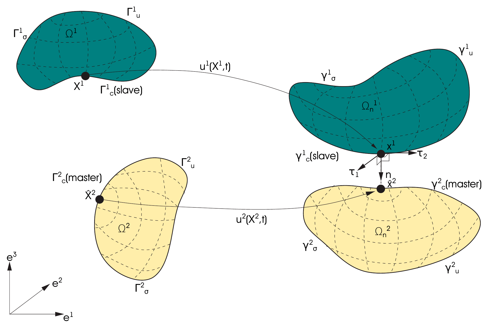
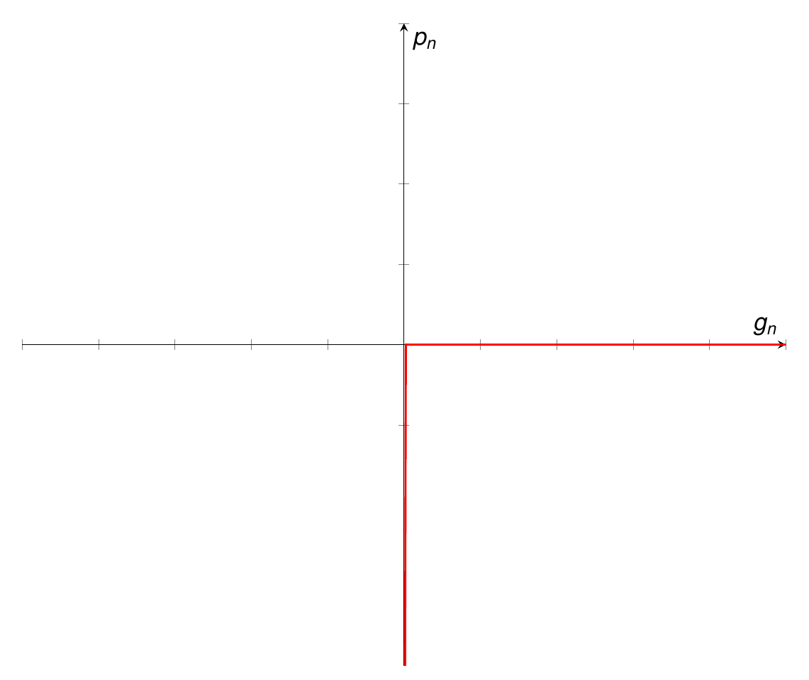
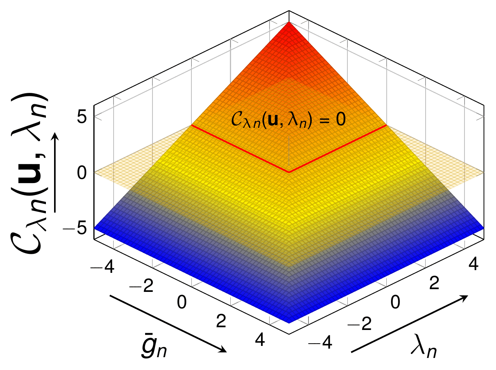
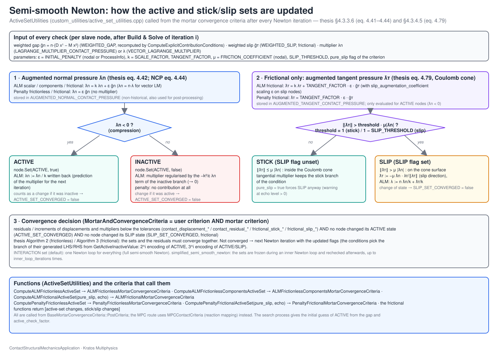

> **Sources.** Thesis §4.3.1–§4.3.3 (pp. 96–113): §4.3.2 *Definition of the problem*, §4.3.3.1 *Strong formulation*, §4.3.3.2 *Weak formulation* (scalar and vector Lagrange multiplier), §4.3.3.3 *Augmented Lagrange multiplier parameters calibration*, §4.3.3.4.3 *Algebraic form of the problem*, §4.3.3.4.4 *Static condensation*, §4.3.3.5 *Work-flow. Solution algorithm* (Algorithm 2) and §4.3.3.6 *Active set strategy*. Code: `automatic_differentiation/ALM_frictionless_mortar_condition/alm_frictionless_mortar_contact_condition.tex` (the typeset derivation shipped with the application), `automatic_differentiation/ALM_frictionless_mortar_condition/generate_frictionless_mortar_condition.py`, `custom_conditions/ALM_frictionless_mortar_contact_condition.{h,cpp}`, `custom_conditions/ALM_frictionless_components_mortar_contact_condition.{h,cpp}`, `custom_conditions/penalty_frictionless_mortar_contact_condition.{h,cpp}`, `custom_utilities/active_set_utilities.{h,cpp}`, `custom_strategies/custom_convergencecriterias/alm_frictionless_mortar_criteria.h`, `custom_strategies/custom_strategies/residualbased_newton_raphson_contact_strategy.h`, `custom_linear_solvers/mixedulm_linear_solver.h`, `custom_processes/alm_variables_calculation_process.cpp`.

This page presents the frictionless (unilateral, non-penetration) contact formulation implemented in the application. It is deliberately self-contained on the *mechanics* side (strong form, weak forms, algebraic systems, active set), while the mortar discretization itself (dual Lagrange multipliers, the operators $$\mathbf{D}$$ and $$\mathbf{M}$$, segmentation) is developed in [Mortar integration and dual Lagrange multipliers](Mortar_Integration_And_Dual_Lagrange_Multipliers.html), the constrained-optimization background (penalty, Lagrange multiplier, augmented Lagrangian methods, condition-number study) in [Constrained optimisation methods](Constrained_Optimisation_Methods.html), and the extension to Coulomb friction in [Frictional contact](Frictional_Contact.html). The last section, *How this maps to the code*, connects every symbol of the formulation with the sympy generator, the C++ conditions, the nodal variables, the active-set utilities, the strategy inner loop and the mixed linear solver.

## Notation

| Symbol | Meaning | Code counterpart |
|---|---|---|
| $$\Omega^{(1)}, \Omega^{(2)}$$ | Slave (1) and master (2) bodies; $$\Omega_0^{(i)}$$ reference configuration | Sub-model parts built by `SearchBaseProcess` (`SlaveSubModelPartN` / `MasterSubModelPartN`) |
| $$\Gamma_u^{(i)}, \Gamma_\sigma^{(i)}, \Gamma_c^{(i)}$$ | Dirichlet, Neumann and (potential) contact boundaries; $$\gamma$$ for spatial counterparts | `Contact` sub-model part, `SLAVE`/`MASTER` flags |
| $$\mathbf{u}^{(i)}, \mathbf{x}^{(i)} = \mathbf{X}^{(i)} + \mathbf{u}^{(i)}$$ | Displacement and current position | `DISPLACEMENT`, `u1`, `u2`, `X1`, `X2` in the generator |
| $$\mathbf{n}$$ | Outward unit normal of the slave surface (nodal averaged) | `NORMAL`, `NormalSlave` |
| $$g_n$$ | Continuous normal gap | — |
| $$\tilde{g}_n$$ | Nodal weighted (mortar-integrated) gap | `WEIGHTED_GAP`, `NormalGap` |
| $$p_n$$ | Normal contact pressure (negative in compression) | — |
| $$\lambda_n$$ | Scalar Lagrange multiplier (contact pressure) | `LAGRANGE_MULTIPLIER_CONTACT_PRESSURE`, `LMNormal` |
| $$\boldsymbol{\lambda}$$ | Vector Lagrange multiplier (contact traction) | `VECTOR_LAGRANGE_MULTIPLIER`, `LM` |
| $$\varepsilon$$ | Penalty parameter | `INITIAL_PENALTY`, `PenaltyParameter` |
| $$k$$ | Scale factor of the multiplier | `SCALE_FACTOR`, `ScaleFactor` |
| $$\bar{\lambda}_n = k\lambda_n + \varepsilon g_n$$ | Augmented normal pressure | `AUGMENTED_NORMAL_CONTACT_PRESSURE`, `augmented_contact_pressure` |
| $$\mathbf{D}, \mathbf{M}$$ | Mortar operators (slave–slave, slave–master) | `MortarOperator::DOperator/MOperator` |
| $$\mathcal{N}, \mathcal{M}, \mathcal{S}$$ | Sets of "other", master and slave DoFs; $$\mathcal{A}, \mathcal{I}$$ active/inactive slave sets | `MixedULMLinearSolver::BlockType`, `ACTIVE` flag |

## Definition of the problem (thesis §4.3.2)

The contact problem is formulated for two bodies undergoing potentially large deformations and large sliding. The reference configurations are the open sets $$\Omega^{(1)}$$ and $$\Omega^{(2)}$$, and the deformation maps $$\phi^{(1)}$$ and $$\phi^{(2)}$$ are the unknowns. On each body we distinguish $$\Gamma_u$$ (Dirichlet boundary), $$\Gamma_\sigma$$ (Neumann boundary) and $$\Gamma_c$$ (the surface where contact constraints are defined and enforced); their spatial counterparts are $$\gamma_u$$, $$\gamma_\sigma$$ and $$\gamma_c$$. Body (1) is by convention the **slave** body, whose surface $$\Gamma_c^{(1)}$$ carries the Lagrange multipliers and on which all the mortar integrals are evaluated; body (2) is the **master**.

<p align="center"></p>
<p align="center"><em>Figure: Definition of the contact problem (thesis Fig. 4.11).</em></p>

A note on terminology that matters when reading the code: the slave surface is the one that *owns* the contact conditions (`PairedCondition::GetParentGeometry()`), while the master surface is the *paired* geometry (`PairedCondition::GetPairedGeometry()`). The naming inversion with respect to the underlying `CouplingGeometry` slots is documented in [Mortar integration and dual Lagrange multipliers](Mortar_Integration_And_Dual_Lagrange_Multipliers.html#slave-and-master-roles-and-the-naming-inversion-in-pairedcondition).

## Strong formulation (thesis §4.3.3.1)

On each subdomain $$\Omega_0^{(i)}$$, $$i = 1, 2$$, the initial boundary value problem (IBVP) of finite deformation elastodynamics must be satisfied (thesis eq. 4.2):

<p align="center">$$\begin{aligned}
\nabla \cdot \boldsymbol{\sigma}^{(i)} + \mathbf{b}^{(i)} &= \rho^{(i)} \ddot{\mathbf{u}}^{(i)} &&\text{in } \Omega^{(i)} \times [0, T] \\
\mathbf{u}^{(i)} &= \hat{\mathbf{u}}^{(i)} &&\text{on } \Gamma_u^{(i)} \times [0, T] \\
\boldsymbol{\sigma}^{(i)} \cdot \mathbf{n}^{(i)} &= \hat{\mathbf{t}}^{(i)} &&\text{on } \Gamma_\sigma^{(i)} \times [0, T] \\
\mathbf{u}^{(i)}\left(\mathbf{X}^{(i)}, 0\right) &= \hat{\mathbf{u}}_0^{(i)}\left(\mathbf{X}^{(i)}\right) &&\text{in } \Omega_0^{(i)} \\
\dot{\mathbf{u}}^{(i)}\left(\mathbf{X}^{(i)}, 0\right) &= \hat{\dot{\mathbf{u}}}_0^{(i)}\left(\mathbf{X}^{(i)}\right) &&\text{in } \Omega_0^{(i)}
\end{aligned}$$</p>

The first line is the balance of linear momentum, the second the Dirichlet condition, the third the Neumann condition and the last two the initial conditions. In the Lagrangian (reference) description used in the `.tex` derivation the same system reads $$\text{Div}\,\mathbf{P}^{(i)} + \hat{\mathbf{b}}_0^{(i)} = \rho_0^{(i)} \ddot{\mathbf{u}}^{(i)}$$ with $$\mathbf{P}$$ the first Piola–Kirchhoff stress and $$\mathbf{P}^{(i)} \cdot \mathbf{N}^{(i)} = \hat{\mathbf{t}}_0^{(i)}$$ on $$\Gamma_\sigma^{(i)}$$; both forms are equivalent.

The contact constraints in the normal direction are given by the **Hertz–Signorini–Moreau** (HSM) conditions, usually called **Karush–Kuhn–Tucker** (KKT) conditions in optimization theory (thesis eq. 4.3):

<p align="center">$$g_n \ge 0 \;,\quad p_n \le 0 \;,\quad p_n\, g_n = 0 \qquad \text{on } \Gamma_c^{(i)} \times [0, T]$$</p>

They express, respectively, non-penetration (the gap is never negative), a compressive-only contact pressure (no adhesion), and complementarity (either the gap is closed and pressure may develop, or the gap is open and the pressure vanishes). Their graph in the $$(g_n, p_n)$$ plane is the well known "L-shaped" set, which is the source of the non-smoothness of the problem.

<p align="center"></p>
<p align="center"><em>Figure: KKT (Hertz–Signorini–Moreau) conditions of non-penetration (thesis Fig. 4.12).</em></p>

In the course of deriving a weak formulation, the balance of linear momentum at the contact interface $$\Gamma_c^{(i)}$$ is exploited and a Lagrange multiplier field $$\lambda_n$$ is introduced, which sets the basis for a mixed variational approach. Unilateral contact constraints are formulated (and later numerically evaluated) in the **current** configuration.

## Weak formulation with a scalar Lagrange multiplier (thesis §4.3.3.2.1)

Two families of weak forms are distinguished: the first considers the Lagrange multiplier as a *scalar* variable (the contact pressure itself), the second considers the multiplier decomposed in its Cartesian *components*, so that the contact pressure is $$\mathbf{n} \cdot \boldsymbol{\lambda}$$. The scalar form is presented first because it is simpler; the component form is then obtained by modifying only the multiplier-related terms.

### Lagrange multiplier method (LMM) — thesis eqs. 4.4–4.7

The general theory of the Lagrange multiplier method is developed in [Constrained optimisation methods](Constrained_Optimisation_Methods.html). To derive a weak formulation of the IBVP, appropriate solution spaces $$\mathcal{U}^{(i)}$$ and weighting spaces $$\mathcal{V}^{(i)}$$ are defined (thesis eq. 4.4):

<p align="center">$$\begin{cases}
\mathcal{U}^{(i)} = \left\{ \mathbf{u}^{(i)} \in H^1(\Omega) \;\vert\; \mathbf{u}^{(i)} = \hat{\mathbf{u}}^{(i)} \text{ on } \Gamma_u^{(i)} \right\} \\[4pt]
\mathcal{V}^{(i)} = \left\{ \delta\mathbf{u}^{(i)} \in H^1(\Omega) \;\vert\; \delta\mathbf{u}^{(i)} = \mathbf{0} \text{ on } \Gamma_u^{(i)} \right\}
\end{cases}$$</p>

Additionally the Lagrange multiplier vector $$\boldsymbol{\lambda}_n = \lambda_n \mathbf{n} = -\mathbf{t}_c^{(1)}$$, which enforces the unilateral contact constraint, represents the negative slave-side contact traction $$\mathbf{t}_c^{(1)}$$ and is chosen from a solution space denoted $$\mathcal{M}$$. In terms of functional analysis, $$\mathcal{M}$$ is the dual space of the trace space $$\mathcal{W}^{(1)}$$ of $$\mathcal{V}^{(1)}$$: $$\mathcal{M} = H^{-1/2}(\Gamma_c)$$ and $$\mathcal{W}^{(1)} = H^{1/2}(\Gamma_c)$$, where $$\mathcal{M}$$ and $$\mathcal{W}^{(1)}$$ denote the single scalar components of the corresponding vector-valued spaces.

Based on these considerations, a **saddle point** weak formulation is obtained by extending the standard weak form of non-linear solid mechanics to two subdomains and adding the Lagrange multiplier coupling terms: find $$\mathbf{u}^{(i)} \in \mathcal{U}^{(i)}$$ and $$\lambda_n \in \mathcal{M}$$ such that the contact Lagrangian (thesis eq. 4.5a)

<p align="center">$$\mathcal{L}_{co}(\mathbf{u}, \lambda_n) = \int_{\Gamma_c^{(1)}} \lambda_n \, g_n \, \text{d}\Gamma_{co}$$</p>

is stationary, where $$g_n$$ is the continuous normal gap (thesis eq. 4.5b)

<p align="center">$$g_n = \mathbf{n}^{(1)} \cdot \left( \mathbf{u}^{(1)} - \mathbf{u}^{(2)} \right)$$</p>

(measured along the slave normal; in the discrete setting the master displacement is evaluated at the projection of the slave point). Taking variations (thesis eq. 4.6):

<p align="center">$$\begin{aligned}
\delta\mathcal{L}(\mathbf{u}, \lambda_n) &= \delta\mathcal{L}_{\mathcal{V}} + \delta\mathcal{L}_{\mathcal{M}} \\
\delta\mathcal{L}_{\mathcal{V}} &= -\delta\mathcal{L}_{kin}(\mathbf{u}^{(i)}, \delta\mathbf{u}^{(i)}) - \delta\mathcal{L}_{int,ext}(\mathbf{u}^{(i)}, \delta\mathbf{u}^{(i)}) - \delta\mathcal{L}_{co}(\boldsymbol{\lambda}^{(i)}, \delta\mathbf{u}^{(i)}) = 0 \quad \forall\, \delta\mathbf{u}^{(i)} \in \mathcal{V} \\
\delta\mathcal{L}_{\mathcal{M}} &= -\delta\mathcal{L}_{\lambda}(\mathbf{u}^{(i)}, \delta\boldsymbol{\lambda}^{(i)}) \ge 0 \quad \forall\, \delta\boldsymbol{\lambda}^{(i)} \in \mathcal{M}
\end{aligned}$$</p>

Herein the kinetic contribution $$\delta\mathcal{L}_{kin}$$, the internal and external contributions $$\delta\mathcal{L}_{int,ext}$$ and the unilateral contact contribution $$\delta\mathcal{L}_{co}$$ to the overall virtual work, as well as the weak form of the unilateral contact constraint $$\delta\mathcal{L}_{\lambda}$$, are (thesis eq. 4.7):

<p align="center">$$\begin{aligned}
-\delta\mathcal{L}_{kin}(\mathbf{u}) &= \sum_{i=1}^{2} \left[ \int_{\Omega^{(i)}} \rho^{(i)} \ddot{\mathbf{u}}^{(i)} \cdot \delta\mathbf{u}^{(i)} \, \text{d}\Omega^{(i)} \right] \\
-\delta\mathcal{L}_{int,ext}(\mathbf{u}) &= \sum_{i=1}^{2} \left[ \int_{\Omega^{(i)}} \left( \boldsymbol{\sigma}^{(i)} : \delta\boldsymbol{\varepsilon}^{(i)} - \mathbf{b}^{(i)} \cdot \delta\mathbf{u}^{(i)} \right) \text{d}\Omega^{(i)} - \int_{\Gamma_\sigma^{(i)}} \hat{\mathbf{t}}^{(i)} \cdot \delta\mathbf{u}^{(i)} \, \text{d}\Gamma_\sigma^{(i)} \right] \\
-\delta\mathcal{L}_{co}(\mathbf{u}, \lambda_n) &= \int_{\Gamma_c^{(1)}} \lambda_n \, \delta g_n \, \text{d}\Gamma_{co}^{(1)} \\
-\delta\mathcal{L}_{\lambda}(\mathbf{u}, \lambda_n) &= \int_{\Gamma_c^{(1)}} \delta\lambda_n \, g_n \, \text{d}\Gamma_{co}^{(1)}
\end{aligned}$$</p>

(the internal-work term is written here with the symmetric stress/virtual-strain pairing $$\boldsymbol{\sigma} : \delta\boldsymbol{\varepsilon}$$, equivalent to $$\mathbf{S} : \delta\mathbf{E}$$ in the reference description of the `.tex` derivation; the thesis prints it in an expanded rate form).

The coupling terms on $$\Gamma_c$$ have a direct interpretation in terms of the principle of virtual work: $$-\delta\mathcal{L}_{co}$$ is the virtual work of the unknown interface tractions $$\boldsymbol{\lambda} = -\mathbf{t}_c^{(1)} = \mathbf{t}_c^{(2)}$$, whereas $$-\delta\mathcal{L}_{\lambda}$$ ensures a weak, variationally consistent enforcement of the non-penetration constraint. The concrete choice of the discrete multiplier space $$\mathcal{M}_h$$ is decisive for the stability of the mortar method and for optimal a-priori error bounds — this is the motivation for the **dual** Lagrange multipliers presented on the mortar page. Two remarks distinguish contact from mesh tying: (i) $$\gamma_c^{(1)}$$ and $$\gamma_c^{(2)}$$ cannot be guaranteed to coincide even in the continuum setting, because they comprise the *potential* and not only the actual contact surfaces; and (ii) the weak form contains an **inequality** ($$\delta\mathcal{L}_{\mathcal{M}} \ge 0$$), which requires a special numerical treatment based on active-set strategies.

### Penalty method — thesis eq. 4.8

The penalty method (see the [optimisation page](Constrained_Optimisation_Methods.html)) adds no extra DoFs and introduces no saddle point; its drawback is that the exact solution is only recovered for an infinite penalty, which makes the system ill-conditioned, so the choice of the penalty value is the central practical issue. The main difference from the LMM weak form is the absence of the constraint equation $$\delta\mathcal{L}_{\lambda}$$ (there is no multiplier), while the contact contribution is replaced by a quadratic potential in the gap with a positive normal penalty $$\varepsilon_n$$ (thesis eq. 4.8, written here with the gap factor explicit):

<p align="center">$$-\mathcal{L}_{co}(\mathbf{u}) = \frac{1}{2} \int_{\Gamma_c^{(1)}} \varepsilon_n \, g_n^2 \, \text{d}\Gamma_{co}^{(1)} \;, \qquad -\delta\mathcal{L}_{co}(\mathbf{u}) = \int_{\Gamma_c^{(1)}} \varepsilon_n \, g_n \, \delta g_n \, \text{d}\Gamma_{co}^{(1)}$$</p>

where only the penetrating part of the interface ($$g_n \lt 0$$) contributes; the active set is thus simply $$\{g_n \lt 0\}$$.

### Augmented Lagrangian method (ALM) — thesis eqs. 4.9–4.13

The main disadvantage of the standard Lagrange multiplier is the saddle-point structure of the resulting system. To circumvent it, the **augmented Lagrangian** method of Alart and Curnier reformulates the contact (and friction) laws as a system of *equations without inequalities*. The resulting Lagrangian is a combination of the LMM Lagrangian and the penalty one. Focusing on the contact part $$\mathcal{L}_{co}(\mathbf{u}, \lambda_n) = \mathcal{L}_{\mathcal{V}co} + \mathcal{L}_{\mathcal{M}}$$, the LMM functional is rewritten as (thesis eq. 4.9)

<p align="center">$$\mathcal{L}_{co}(\mathbf{u}, \lambda_n) = \int_{\Gamma_c^{(1)}} k \lambda_n \, g_n + \frac{\varepsilon}{2} g_n^2 - \frac{1}{2\varepsilon} \left\langle k \lambda_n + \varepsilon g_n \right\rangle^2 \, \text{d}\Gamma_{co}^{(1)}$$</p>

where $$\varepsilon$$ is a positive **penalty parameter**, $$k$$ is a positive **scale factor**, and $$\langle \cdot \rangle$$ is the **Macaulay bracket** (thesis eq. 4.10):

<p align="center">$$\langle x \rangle = \begin{cases} x & x \ge 0 \\ 0 & x \lt 0 \end{cases}$$</p>

This functional is $$\mathcal{C}^1$$-differentiable and has a saddle point (thesis Fig. D.4, see the [optimisation page](Constrained_Optimisation_Methods.html)); the solution is the set of values that render it stationary. The solution does **not** depend on $$\varepsilon$$ and $$k$$, but the convergence rate does. Following Cavalieri and Cardona, default values are selected from the mean Young modulus $$E$$ of the bodies in contact and the mean mesh size $$h$$ (thesis eq. 4.11):

<p align="center">$$\varepsilon = k \approx 10\, \frac{E_{mean}}{h_{mean}}$$</p>

Numerical experiments (thesis §4.3.3.3, summarized [below](#augmented-lagrangian-parameter-calibration-thesis-4333)) show that this choice gives a better condition number of the iteration matrix than other choices. The functional can be separated into two branches (thesis eq. 4.12):

<p align="center">$$\mathcal{L}_{co}(\mathbf{u}, \lambda_n) = \int_{\Gamma_c^{(1)}} \begin{cases} k \lambda_n \, g_n + \dfrac{\varepsilon}{2} g_n^2 & \text{if } k\lambda_n + \varepsilon g_n \le 0 \quad \text{(contact zone)} \\[6pt] -\dfrac{k}{2\varepsilon} \lambda_n^2 & \text{if } k\lambda_n + \varepsilon g_n \gt 0 \quad \text{(gap zone)} \end{cases} \; \text{d}\Gamma_{co}^{(1)}$$</p>

Finally, taking the variation yields the weak form (thesis eq. 4.13), where, to simplify, the **augmented normal pressure** is defined as

<p align="center">$$\bar{\lambda}_n = k \lambda_n + \varepsilon g_n$$</p>

<p align="center">$$\delta\mathcal{L}_{co}(\mathbf{u}, \lambda_n) = \int_{\Gamma_c^{(1)}} \begin{cases} \bar{\lambda}_n \, \delta g_n + k \, g_n \, \delta\lambda_n & \text{if } \bar{\lambda}_n \le 0 \quad \text{(contact zone)} \\[6pt] -\dfrac{k^2}{\varepsilon} \lambda_n \, \delta\lambda_n & \text{if } \bar{\lambda}_n \gt 0 \quad \text{(gap zone)} \end{cases} \; \text{d}\Gamma_{co}^{(1)}$$</p>

Three properties of this weak form drive the whole implementation:

1. In the contact zone the multiplier equation $$k\, g_n\, \delta\lambda_n$$ enforces the gap to vanish (weakly), and the displacement equation carries the *augmented* pressure $$\bar{\lambda}_n$$ rather than the bare multiplier. The penalty term therefore acts as a regularization that improves conditioning, but does not change the converged solution (at convergence $$g_n = 0$$ and $$\bar{\lambda}_n = k\lambda_n$$).
2. In the gap zone the equation $$-\frac{k^2}{\varepsilon} \lambda_n \delta\lambda_n$$ simply drives the multiplier to zero: inactive multipliers remain as DoFs in the system but are decoupled from the displacements. This is what makes the tangent matrix square and the active set change without any resizing of the system.
3. The switch between the two branches depends on the sign of $$\bar{\lambda}_n$$ only, which is the non-linear complementarity function used by the active-set strategy ([below](#active-set-strategy-semi-smooth-newton-thesis-4336)). Because the system depends on the a-priori unknown partition of the nodes into contact and gap zones, the discretization is developed for the contact zone; the gap-zone contribution is then trivial.

## Weak formulation with a vector Lagrange multiplier (thesis §4.3.3.2.2)

The vectorized (or "by components") frictionless formulation is defined mainly because the resulting system can be **statically condensed**, removing the multiplier DoFs and solving a system purely in displacements (a property of the dual Lagrange multipliers discussed on the mortar page). It is also the natural stepping stone to the frictional formulation, which always needs the tangential components. The penalty method is unchanged, since it has no multiplier.

The modification is the replacement of the pressure $$\lambda_n$$ by a multiplier $$\boldsymbol{\lambda}$$ in Cartesian components, whose normal component $$\lambda_n$$ may be non-zero while the tangential ones $$\boldsymbol{\lambda}_\tau$$ must vanish (thesis eq. 4.14):

<p align="center">$$\begin{cases} \lambda_n = \mathbf{n} \cdot \boldsymbol{\lambda} \\ \boldsymbol{\lambda}_\tau = \boldsymbol{\lambda} - \mathbf{n} \left( \mathbf{n} \cdot \boldsymbol{\lambda} \right) = \mathbf{0} \end{cases}$$</p>

### Components LMM — thesis eq. 4.15

The multiplier-related terms of eq. 4.7 become (thesis eq. 4.15):

<p align="center">$$\delta\mathcal{L}_{co}(\mathbf{u}, \boldsymbol{\lambda}) = \int_{\Gamma_c^{(1)}} \boldsymbol{\lambda} \cdot \left( \delta\mathbf{u}^{(1)} - \delta\hat{\mathbf{u}}^{(2)} \right) \text{d}\Gamma_{co}^{(1)}$$</p>

<p align="center">$$\delta\mathcal{L}_{\lambda}(\mathbf{u}, \boldsymbol{\lambda}) = \int_{\Gamma_c^{(1)}} \delta\left( \mathbf{n} \cdot \boldsymbol{\lambda} \right) g_n - \left( \boldsymbol{\lambda} - \mathbf{n} \left( \mathbf{n} \cdot \boldsymbol{\lambda} \right) \right) \cdot \left( \delta\boldsymbol{\lambda} - \mathbf{n} \left( \mathbf{n} \cdot \delta\boldsymbol{\lambda} \right) \right) \text{d}\Gamma_{co}^{(1)}$$</p>

where $$\hat{\mathbf{u}}^{(2)}$$ is the master displacement projected onto the slave side. The second term of $$\delta\mathcal{L}_{\lambda}$$ is the weak enforcement of $$\boldsymbol{\lambda}_\tau = \mathbf{0}$$.

### Components ALM — thesis eqs. 4.16–4.17

The augmented multiplier is now a vector (thesis eq. 4.16):

<p align="center">$$\bar{\boldsymbol{\lambda}} = k \boldsymbol{\lambda} + \varepsilon\, \mathbf{n}\, g_n$$</p>

and, with $$\bar{\lambda}_n = k\, (\mathbf{n} \cdot \boldsymbol{\lambda}) + \varepsilon g_n$$, the functional (eq. 4.12) and its variation (eq. 4.13) become (thesis eqs. 4.17a–b):

<p align="center">$$\mathcal{L}_{co}(\mathbf{u}, \boldsymbol{\lambda}) = \int_{\Gamma_c^{(1)}} \begin{cases} \bar{\boldsymbol{\lambda}} \cdot \left( \mathbf{u}^{(1)} - \mathbf{u}^{(2)} \right) + \dfrac{\varepsilon}{2} g_n^2 & \text{if } \bar{\lambda}_n \le 0 \quad \text{(contact zone)} \\[6pt] -\dfrac{k}{2\varepsilon} \boldsymbol{\lambda}^2 & \text{if } \bar{\lambda}_n \gt 0 \quad \text{(gap zone)} \end{cases} \; \text{d}\Gamma_{co}^{(1)}$$</p>

<p align="center">$$\delta\mathcal{L}_{co}(\mathbf{u}, \boldsymbol{\lambda}) = \int_{\Gamma_c^{(1)}} \begin{cases} \bar{\boldsymbol{\lambda}} \cdot \left( \delta\mathbf{u}^{(1)} - \delta\mathbf{u}^{(2)} \right) + k\, g_n \, \delta\boldsymbol{\lambda} \cdot \mathbf{n} & \text{if } \bar{\lambda}_n \le 0 \quad \text{(contact zone)} \\[6pt] -\dfrac{k^2}{\varepsilon} \boldsymbol{\lambda} \cdot \delta\boldsymbol{\lambda} & \text{if } \bar{\lambda}_n \gt 0 \quad \text{(gap zone)} \end{cases} \; \text{d}\Gamma_{co}^{(1)}$$</p>

while the multiplier equation, which now also has to kill the tangential components, reads (thesis eq. 4.17c):

<p align="center">$$\delta\mathcal{L}_{\lambda}(\mathbf{u}, \boldsymbol{\lambda}) = \int_{\Gamma_c^{(1)}} k \left( \mathbf{n} \cdot \delta\boldsymbol{\lambda} \right) g_n - \frac{k^2}{\varepsilon} \left( \boldsymbol{\lambda} - \mathbf{n} \left( \mathbf{n} \cdot \boldsymbol{\lambda} \right) \right) \cdot \left( \delta\boldsymbol{\lambda} - \mathbf{n} \left( \mathbf{n} \cdot \delta\boldsymbol{\lambda} \right) \right) \text{d}\Gamma_{co}^{(1)}$$</p>

The tangential multiplier is thus *penalized to zero* with the same $$-k^2/\varepsilon$$ coefficient used for inactive nodes. This is exactly the functional coded in `generate_frictionless_components_mortar_condition.py` (see the [code mapping](#the-generated-functional)).

## Augmented Lagrangian parameter calibration (thesis §4.3.3.3)

The expression $$\varepsilon = k \approx 10 E/h$$ is taken from Cavalieri and Cardona. The thesis verifies it with a 3D Taylor patch test (two blocks, $$E = 100\,\text{Pa}$$, $$\nu = 0.3$$ on both solids, unit load on the punch; with $$h \approx 10$$ the reference values are $$\varepsilon = k = 100$$) by measuring the condition number $$\kappa$$ of the tangent matrix (thesis eq. 4.18, $$\kappa(A) = \sigma_{\max}(A)/\sigma_{\min}(A)$$, or the ratio of extreme eigenvalue moduli for a normal matrix, computed with power and inverse power iterations). The sweep of $$k \in \{1, 10, 100, 1000, 10^4\}$$ and $$\varepsilon \in [10^{-12}, 10^4]$$ (thesis Table 4.2) shows that $$\varepsilon$$ always increases $$\kappa$$, whereas $$k$$ may improve or worsen it depending on the range, and that the pair estimated from eq. 4.11 ($$k = 100$$, $$\varepsilon = 100$$, $$\kappa = 1.74 \times 10^4$$) gives the best overall conditioning. The mesh, the displacement solution and the surface/contour plots of $$\kappa(k, \varepsilon)$$ (thesis Figs. 4.13 and 4.14) are reproduced and discussed on the [Constrained optimisation methods](Constrained_Optimisation_Methods.html) page. In the application this rule is implemented by `ALMVariablesCalculationProcess` (see [ALM parameters](#alm-parameters-scale_factor-and-initial_penalty)), and the condition number can be printed at every iteration through `MortarAndConvergenceCriteria`.

## From the weak form to the discrete system

The discretization of the displacement is standard; the discretization of the multiplier uses **dual** shape functions $$\Phi_j$$ biorthogonal to the standard slave shape functions $$N_k^{(1)}$$, and the contact integrals are evaluated on the slave side with an exact segmentation. All of this is developed in [Mortar integration and dual Lagrange multipliers](Mortar_Integration_And_Dual_Lagrange_Multipliers.html); the three results needed here are:

- the mortar operators $$\mathbf{D}$$ and $$\mathbf{M}$$ (thesis eq. 4.29), with $$\mathbf{D}$$ **diagonal** thanks to the dual basis,

<p align="center">$$D_{jk} = \int_{\Gamma_{c,h}^{(1)}} \Phi_j N_k^{(1)} \, \text{d}\Gamma \;, \qquad M_{jl} = \int_{\Gamma_{c,h}^{(1)}} \Phi_j \left( N_l^{(2)} \circ \chi_h \right) \text{d}\Gamma$$</p>

- the discrete contact forces $$\mathbf{f}_{co}(\lambda_n) = \mathbf{B}_{co} \lambda_n$$ with $$\mathbf{B}_{co}^T = [\mathbf{0}, -\mathbf{M}^T, \mathbf{D}^T]$$ acting on master and slave nodes (thesis eq. 4.30), and
- the **nodal weighted gap** $$\tilde{g}_n$$ (thesis eq. 4.31), the discrete counterpart of $$g_n$$: with $$\mathbf{x}^{(1)}$$, $$\mathbf{x}^{(2)}$$ the current slave and master nodal coordinates,

<p align="center">$$\tilde{g}_{n,j} = -\, \mathbf{n}_j \cdot \left( \mathbf{D}\, \mathbf{x}^{(1)} - \mathbf{M}\, \mathbf{x}^{(2)} \right)_j$$</p>

which is positive for an open gap and negative for penetration (the sign convention of `WEIGHTED_GAP` and of the `NormalGap` symbol in the generators). The discrete augmented pressure of slave node $$j$$ is then $$\bar{\lambda}_{n,j} = k \lambda_{n,j} + \varepsilon_j \tilde{g}_{n,j}$$.

## Algebraic form of the problem (thesis §4.3.3.4.3)

Two cases are distinguished for the matrix representation. The scalar-multiplier system cannot be condensed and requires solving with all DoFs; the vector-multiplier system can be condensed because $$\mathbf{D}$$ is diagonal with dual multipliers. Following the notation of Popp, the subindex $$\mathcal{N}$$ denotes all DoFs not related to contact, $$\mathcal{M}$$ the master DoFs and $$\mathcal{S}$$ the slave DoFs, split into the active $$\mathcal{A}$$ and inactive $$\mathcal{I}$$ sets. The residuals of the multiplier rows, $$\mathbf{r}_{\lambda_{\mathcal{A}}}$$ and $$\mathbf{r}_{\lambda_{\mathcal{I}}}$$, are written "algebraically", i.e. in terms of the mortar operators, and the corresponding rows of the tangent matrix are the derivatives of the mortar operators developed in [Linearisation and derivatives](Linearisation_And_Derivatives.html). In all systems $$\mathbf{K}_{\bullet\bullet}$$ are the usual structural tangent blocks (including the penalty-like contributions that arise from differentiating the augmented pressure with respect to the displacements), $$\mathbf{D}_{\mathcal{A}\mathcal{A}}$$, $$\mathbf{D}_{\mathcal{A}\mathcal{I}}$$, … are the sub-blocks of $$\mathbf{D}$$ for the active/inactive rows and columns, and $$\mathbf{M}_{\mathcal{A}}$$, $$\mathbf{M}_{\mathcal{I}}$$ the active/inactive rows of $$\mathbf{M}$$.

### Scalar LMM — thesis eq. 4.32

<p align="center">$$\begin{bmatrix}
\mathbf{K}_{\mathcal{N}\mathcal{N}} & \mathbf{K}_{\mathcal{N}\mathcal{M}} & \mathbf{K}_{\mathcal{N}\mathcal{S}_\mathcal{A}} & \mathbf{K}_{\mathcal{N}\mathcal{S}_\mathcal{I}} & \mathbf{0} & \mathbf{0} \\
\mathbf{K}_{\mathcal{M}\mathcal{N}} & \mathbf{K}_{\mathcal{M}\mathcal{M}} & \mathbf{K}_{\mathcal{M}\mathcal{S}_\mathcal{A}} & \mathbf{K}_{\mathcal{M}\mathcal{S}_\mathcal{I}} & -\left(\mathbf{n} \cdot \mathbf{M}_\mathcal{A}\right)^T & -\left(\mathbf{n} \cdot \mathbf{M}_\mathcal{I}\right)^T \\
\mathbf{K}_{\mathcal{S}_\mathcal{A}\mathcal{N}} & \mathbf{K}_{\mathcal{S}_\mathcal{A}\mathcal{M}} & \mathbf{K}_{\mathcal{S}_\mathcal{A}\mathcal{S}_\mathcal{A}} & \mathbf{K}_{\mathcal{S}_\mathcal{A}\mathcal{S}_\mathcal{I}} & \left(\mathbf{n} \cdot \mathbf{D}_{\mathcal{A}\mathcal{A}}\right)^T & \left(\mathbf{n} \cdot \mathbf{D}_{\mathcal{A}\mathcal{I}}\right)^T \\
\mathbf{K}_{\mathcal{S}_\mathcal{I}\mathcal{N}} & \mathbf{K}_{\mathcal{S}_\mathcal{I}\mathcal{M}} & \mathbf{K}_{\mathcal{S}_\mathcal{I}\mathcal{S}_\mathcal{A}} & \mathbf{K}_{\mathcal{S}_\mathcal{I}\mathcal{S}_\mathcal{I}} & \left(\mathbf{n} \cdot \mathbf{D}_{\mathcal{I}\mathcal{A}}\right)^T & \left(\mathbf{n} \cdot \mathbf{D}_{\mathcal{I}\mathcal{I}}\right)^T \\
\mathbf{0} & \dfrac{\partial \mathbf{r}_{\lambda_\mathcal{A}}}{\partial \mathbf{u}_\mathcal{M}} & \dfrac{\partial \mathbf{r}_{\lambda_\mathcal{A}}}{\partial \mathbf{u}_{\mathcal{S}_\mathcal{A}}} & \dfrac{\partial \mathbf{r}_{\lambda_\mathcal{A}}}{\partial \mathbf{u}_{\mathcal{S}_\mathcal{I}}} & \mathbf{0} & \mathbf{0} \\
\mathbf{0} & \mathbf{0} & \mathbf{0} & \mathbf{0} & \mathbf{0} & \mathbf{I}
\end{bmatrix}
\begin{bmatrix} \Delta\mathbf{u}_\mathcal{N} \\ \Delta\mathbf{u}_\mathcal{M} \\ \Delta\mathbf{u}_{\mathcal{S}_\mathcal{A}} \\ \Delta\mathbf{u}_{\mathcal{S}_\mathcal{I}} \\ \Delta\lambda_\mathcal{A} \\ \Delta\lambda_\mathcal{I} \end{bmatrix}
= - \begin{bmatrix} \mathbf{r}_\mathcal{N} \\ \mathbf{r}_\mathcal{M} \\ \mathbf{r}_{\mathcal{S}_\mathcal{A}} \\ \mathbf{r}_{\mathcal{S}_\mathcal{I}} \\ \mathbf{r}_{\lambda_\mathcal{A}} \\ \mathbf{r}_{\lambda_\mathcal{I}} \end{bmatrix}$$</p>

<p align="center">$$\begin{cases} \mathbf{r}_{\lambda_{\mathcal{A}n}} = -\mathbf{n} \cdot \left( \mathbf{D}\mathbf{x}_1 - \mathbf{M}\mathbf{x}_2 \right) \\ \mathbf{r}_{\lambda_\mathcal{I}} = \lambda_n \end{cases}$$</p>

The active multiplier residual is the weighted gap; the inactive multiplier rows are an identity that returns the multiplier itself, so that $$\lambda_{\mathcal{I}} \to 0$$. The multiplier columns of the displacement rows carry $$(\mathbf{n} \cdot \mathbf{D})^T$$ and $$-(\mathbf{n} \cdot \mathbf{M})^T$$, i.e. the projections of the operators along the slave normals, because the multiplier is a scalar pressure. (The thesis prints $$\mathbf{K}_{\mathcal{N}\mathcal{N}}$$ in the first block of the second row; $$\mathbf{K}_{\mathcal{M}\mathcal{N}}$$ is the intended block.)

### Components LMM — thesis eq. 4.33

With a vector multiplier the full operators $$\mathbf{M}$$ and $$\mathbf{D}$$ enter the displacement rows, and the multiplier row gains a diagonal block $$\partial \mathbf{r}_{\lambda_\mathcal{A}} / \partial \boldsymbol{\lambda}_\mathcal{A}$$ coming from the penalization of the tangential components:

<p align="center">$$\begin{bmatrix}
\mathbf{K}_{\mathcal{N}\mathcal{N}} & \mathbf{K}_{\mathcal{N}\mathcal{M}} & \mathbf{K}_{\mathcal{N}\mathcal{S}_\mathcal{A}} & \mathbf{K}_{\mathcal{N}\mathcal{S}_\mathcal{I}} & \mathbf{0} & \mathbf{0} \\
\mathbf{K}_{\mathcal{M}\mathcal{N}} & \mathbf{K}_{\mathcal{M}\mathcal{M}} & \mathbf{K}_{\mathcal{M}\mathcal{S}_\mathcal{A}} & \mathbf{K}_{\mathcal{M}\mathcal{S}_\mathcal{I}} & -\mathbf{M}_\mathcal{A}^T & -\mathbf{M}_\mathcal{I}^T \\
\mathbf{K}_{\mathcal{S}_\mathcal{A}\mathcal{N}} & \mathbf{K}_{\mathcal{S}_\mathcal{A}\mathcal{M}} & \mathbf{K}_{\mathcal{S}_\mathcal{A}\mathcal{S}_\mathcal{A}} & \mathbf{K}_{\mathcal{S}_\mathcal{A}\mathcal{S}_\mathcal{I}} & \mathbf{D}_{\mathcal{A}\mathcal{A}}^T & \mathbf{D}_{\mathcal{A}\mathcal{I}}^T \\
\mathbf{K}_{\mathcal{S}_\mathcal{I}\mathcal{N}} & \mathbf{K}_{\mathcal{S}_\mathcal{I}\mathcal{M}} & \mathbf{K}_{\mathcal{S}_\mathcal{I}\mathcal{S}_\mathcal{A}} & \mathbf{K}_{\mathcal{S}_\mathcal{I}\mathcal{S}_\mathcal{I}} & \mathbf{D}_{\mathcal{I}\mathcal{A}}^T & \mathbf{D}_{\mathcal{I}\mathcal{I}}^T \\
\mathbf{0} & \dfrac{\partial \mathbf{r}_{\lambda_\mathcal{A}}}{\partial \mathbf{u}_\mathcal{M}} & \dfrac{\partial \mathbf{r}_{\lambda_\mathcal{A}}}{\partial \mathbf{u}_{\mathcal{S}_\mathcal{A}}} & \dfrac{\partial \mathbf{r}_{\lambda_\mathcal{A}}}{\partial \mathbf{u}_{\mathcal{S}_\mathcal{I}}} & \dfrac{\partial \mathbf{r}_{\lambda_\mathcal{A}}}{\partial \boldsymbol{\lambda}_\mathcal{A}} & \mathbf{0} \\
\mathbf{0} & \mathbf{0} & \mathbf{0} & \mathbf{0} & \mathbf{0} & \mathbf{I}
\end{bmatrix}
\begin{bmatrix} \Delta\mathbf{u}_\mathcal{N} \\ \Delta\mathbf{u}_\mathcal{M} \\ \Delta\mathbf{u}_{\mathcal{S}_\mathcal{A}} \\ \Delta\mathbf{u}_{\mathcal{S}_\mathcal{I}} \\ \Delta\boldsymbol{\lambda}_\mathcal{A} \\ \Delta\boldsymbol{\lambda}_\mathcal{I} \end{bmatrix}
= - \begin{bmatrix} \mathbf{r}_\mathcal{N} \\ \mathbf{r}_\mathcal{M} \\ \mathbf{r}_{\mathcal{S}_\mathcal{A}} \\ \mathbf{r}_{\mathcal{S}_\mathcal{I}} \\ \mathbf{r}_{\lambda_\mathcal{A}} \\ \mathbf{r}_{\lambda_\mathcal{I}} \end{bmatrix}$$</p>

Defining $$\boldsymbol{\tau}$$ as the direction of the tangential part of the multiplier, $$\boldsymbol{\tau} = \dfrac{\boldsymbol{\lambda} - \mathbf{n}(\mathbf{n} \cdot \boldsymbol{\lambda})}{\Vert \boldsymbol{\lambda} - \mathbf{n}(\mathbf{n} \cdot \boldsymbol{\lambda}) \Vert}$$, the multiplier residuals are (thesis eq. 4.33b)

<p align="center">$$\begin{cases} \mathbf{r}_{\lambda_\mathcal{A}} = \mathbf{n} \left( -\mathbf{n} \cdot \left( \mathbf{D}\mathbf{x}_1 - \mathbf{M}\mathbf{x}_2 \right) \right) - \boldsymbol{\tau} \cdot \boldsymbol{\lambda} \\ \mathbf{r}_{\lambda_\mathcal{I}} = \boldsymbol{\lambda} \end{cases}$$</p>

This system can be statically condensed (next section), both for LMM and ALM, and the same construction is used in the frictional formulation, which always decomposes the multiplier in components.

### Penalty — thesis eq. 4.34

The penalty system is the simplest: there are no multiplier rows, the inactive slave nodes contribute nothing to LHS and RHS, and the contact stiffness appears as explicit $$\varepsilon$$-terms in the master and active-slave blocks (the blocks $$\mathbf{K}_{\mathcal{M}\mathcal{S}}$$, $$\mathbf{K}_{\mathcal{S}_\mathcal{A}\mathcal{M}}$$ and $$\mathbf{K}_{\mathcal{S}_\mathcal{I}\mathcal{M}}$$ are not assumed to vanish, as other physics may couple them). Expanding the compact layout of the thesis:

<p align="center">$$\begin{bmatrix}
\mathbf{K}_{\mathcal{N}\mathcal{N}} & \mathbf{K}_{\mathcal{N}\mathcal{M}} & \mathbf{K}_{\mathcal{N}\mathcal{S}_\mathcal{A}} & \mathbf{K}_{\mathcal{N}\mathcal{S}_\mathcal{I}} \\
\mathbf{K}_{\mathcal{M}\mathcal{N}} & \mathbf{K}_{\mathcal{M}\mathcal{M}} - \varepsilon \left( \mathbf{n} \cdot \mathbf{M}^T + \dfrac{\partial\left(\mathbf{n} \cdot \mathbf{M}^T\right)}{\partial \mathbf{u}_\mathcal{M}} \mathbf{x}_\mathcal{M} \right) & \mathbf{K}_{\mathcal{M}\mathcal{S}_\mathcal{A}} - \varepsilon \dfrac{\partial\left(\mathbf{n} \cdot \mathbf{M}^T\right)}{\partial \mathbf{u}_{\mathcal{S}_\mathcal{A}}} \mathbf{x}_\mathcal{M} & \mathbf{K}_{\mathcal{M}\mathcal{S}_\mathcal{I}} \\
\mathbf{K}_{\mathcal{S}_\mathcal{A}\mathcal{N}} & \mathbf{K}_{\mathcal{S}_\mathcal{A}\mathcal{M}} + \varepsilon \dfrac{\partial\left(\mathbf{n} \cdot \mathbf{D}_\mathcal{A}^T\right)}{\partial \mathbf{u}_\mathcal{M}} \mathbf{x}_{\mathcal{S}_\mathcal{A}} & \mathbf{K}_{\mathcal{S}_\mathcal{A}\mathcal{S}_\mathcal{A}} + \varepsilon \left( \mathbf{n} \cdot \mathbf{D}_\mathcal{A}^T + \dfrac{\partial\left(\mathbf{n} \cdot \mathbf{D}_\mathcal{A}^T\right)}{\partial \mathbf{u}_{\mathcal{S}_\mathcal{A}}} \mathbf{x}_{\mathcal{S}_\mathcal{A}} \right) & \mathbf{K}_{\mathcal{S}_\mathcal{A}\mathcal{S}_\mathcal{I}} \\
\mathbf{K}_{\mathcal{S}_\mathcal{I}\mathcal{N}} & \mathbf{K}_{\mathcal{S}_\mathcal{I}\mathcal{M}} & \mathbf{K}_{\mathcal{S}_\mathcal{I}\mathcal{S}_\mathcal{A}} & \mathbf{K}_{\mathcal{S}_\mathcal{I}\mathcal{S}_\mathcal{I}}
\end{bmatrix}
\begin{bmatrix} \Delta\mathbf{u}_\mathcal{N} \\ \Delta\mathbf{u}_\mathcal{M} \\ \Delta\mathbf{u}_{\mathcal{S}_\mathcal{A}} \\ \Delta\mathbf{u}_{\mathcal{S}_\mathcal{I}} \end{bmatrix}
= - \begin{bmatrix} \mathbf{r}_\mathcal{N} \\ \mathbf{r}_\mathcal{M} - \varepsilon\, \mathbf{n} \cdot \mathbf{M} \mathbf{x}_\mathcal{M} \\ \mathbf{r}_{\mathcal{S}_\mathcal{A}} + \varepsilon\, \mathbf{n} \cdot \mathbf{D}_\mathcal{A} \mathbf{x}_{\mathcal{S}_\mathcal{A}} \\ \mathbf{r}_{\mathcal{S}_\mathcal{I}} \end{bmatrix}$$</p>

The terms with $$\partial(\cdot)/\partial \mathbf{u}$$ are the linearizations of the mortar operators (and of the normal, if `CONSIDER_NORMAL_VARIATION` requests it) and are what distinguishes a consistently linearized mortar penalty from a simple node-to-segment spring.

### Scalar ALM — thesis eq. 4.35

The algebraic version of the scalar augmented Lagrangian differs from the scalar LMM in two places: the multiplier columns and the active multiplier residual are scaled by $$k$$, and the inactive multiplier block becomes $$\frac{k^2}{\varepsilon}\mathbf{I}$$ (the discrete counterpart of the gap-zone term of eq. 4.13). The $$\varepsilon$$-contributions of the augmented pressure to the displacement rows are absorbed in the $$\mathbf{K}$$ blocks, exactly as in the penalty system above.

<p align="center">$$\begin{bmatrix}
\mathbf{K}_{\mathcal{N}\mathcal{N}} & \mathbf{K}_{\mathcal{N}\mathcal{M}} & \mathbf{K}_{\mathcal{N}\mathcal{S}_\mathcal{A}} & \mathbf{K}_{\mathcal{N}\mathcal{S}_\mathcal{I}} & \mathbf{0} & \mathbf{0} \\
\mathbf{K}_{\mathcal{M}\mathcal{N}} & \mathbf{K}_{\mathcal{M}\mathcal{M}} & \mathbf{K}_{\mathcal{M}\mathcal{S}_\mathcal{A}} & \mathbf{K}_{\mathcal{M}\mathcal{S}_\mathcal{I}} & -\left(k\, \mathbf{n} \cdot \mathbf{M}_\mathcal{A}\right)^T & -\left(k\, \mathbf{n} \cdot \mathbf{M}_\mathcal{I}\right)^T \\
\mathbf{K}_{\mathcal{S}_\mathcal{A}\mathcal{N}} & \mathbf{K}_{\mathcal{S}_\mathcal{A}\mathcal{M}} & \mathbf{K}_{\mathcal{S}_\mathcal{A}\mathcal{S}_\mathcal{A}} & \mathbf{K}_{\mathcal{S}_\mathcal{A}\mathcal{S}_\mathcal{I}} & \left(k\, \mathbf{n} \cdot \mathbf{D}_{\mathcal{A}\mathcal{A}}\right)^T & \left(k\, \mathbf{n} \cdot \mathbf{D}_{\mathcal{A}\mathcal{I}}\right)^T \\
\mathbf{K}_{\mathcal{S}_\mathcal{I}\mathcal{N}} & \mathbf{K}_{\mathcal{S}_\mathcal{I}\mathcal{M}} & \mathbf{K}_{\mathcal{S}_\mathcal{I}\mathcal{S}_\mathcal{A}} & \mathbf{K}_{\mathcal{S}_\mathcal{I}\mathcal{S}_\mathcal{I}} & \left(k\, \mathbf{n} \cdot \mathbf{D}_{\mathcal{I}\mathcal{A}}\right)^T & \left(k\, \mathbf{n} \cdot \mathbf{D}_{\mathcal{I}\mathcal{I}}\right)^T \\
\mathbf{0} & \dfrac{\partial \mathbf{r}_{\lambda_\mathcal{A}}}{\partial \mathbf{u}_\mathcal{M}} & \dfrac{\partial \mathbf{r}_{\lambda_\mathcal{A}}}{\partial \mathbf{u}_{\mathcal{S}_\mathcal{A}}} & \dfrac{\partial \mathbf{r}_{\lambda_\mathcal{A}}}{\partial \mathbf{u}_{\mathcal{S}_\mathcal{I}}} & \mathbf{0} & \mathbf{0} \\
\mathbf{0} & \mathbf{0} & \mathbf{0} & \mathbf{0} & \mathbf{0} & \dfrac{k^2}{\varepsilon}\mathbf{I}
\end{bmatrix}
\begin{bmatrix} \Delta\mathbf{u}_\mathcal{N} \\ \Delta\mathbf{u}_\mathcal{M} \\ \Delta\mathbf{u}_{\mathcal{S}_\mathcal{A}} \\ \Delta\mathbf{u}_{\mathcal{S}_\mathcal{I}} \\ \Delta\lambda_\mathcal{A} \\ \Delta\lambda_\mathcal{I} \end{bmatrix}
= - \begin{bmatrix} \mathbf{r}_\mathcal{N} \\ \mathbf{r}_\mathcal{M} \\ \mathbf{r}_{\mathcal{S}_\mathcal{A}} \\ \mathbf{r}_{\mathcal{S}_\mathcal{I}} \\ \mathbf{r}_{\lambda_\mathcal{A}} \\ \mathbf{r}_{\lambda_\mathcal{I}} \end{bmatrix}$$</p>

<p align="center">$$\begin{cases} \mathbf{r}_{\lambda_{\mathcal{A}n}} = -k\, \mathbf{n} \cdot \left( \mathbf{D}\mathbf{x}_1 - \mathbf{M}\mathbf{x}_2 \right) \\[4pt] \mathbf{r}_{\lambda_\mathcal{I}} = \dfrac{k^2}{\varepsilon} \lambda_n \end{cases}$$</p>

This is the system assembled by `ALMFrictionlessMortarContactCondition*` (scalar multiplier `LAGRANGE_MULTIPLIER_CONTACT_PRESSURE`, one extra DoF per slave node) together with the structural elements. Note that the scalar system is *not* symmetric in general: the multiplier row contains the full derivative of the weighted gap (including $$\partial \mathbf{D}/\partial \mathbf{u}$$, $$\partial \mathbf{M}/\partial \mathbf{u}$$ and, optionally, $$\partial \mathbf{n}/\partial \mathbf{u}$$), whereas the multiplier columns contain only $$k(\mathbf{n} \cdot \mathbf{D})^T$$ and $$-k(\mathbf{n} \cdot \mathbf{M})^T$$.

### Components ALM — thesis eq. 4.36

<p align="center">$$\begin{bmatrix}
\mathbf{K}_{\mathcal{N}\mathcal{N}} & \mathbf{K}_{\mathcal{N}\mathcal{M}} & \mathbf{K}_{\mathcal{N}\mathcal{S}_\mathcal{A}} & \mathbf{K}_{\mathcal{N}\mathcal{S}_\mathcal{I}} & \mathbf{0} & \mathbf{0} \\
\mathbf{K}_{\mathcal{M}\mathcal{N}} & \mathbf{K}_{\mathcal{M}\mathcal{M}} & \mathbf{K}_{\mathcal{M}\mathcal{S}_\mathcal{A}} & \mathbf{K}_{\mathcal{M}\mathcal{S}_\mathcal{I}} & -k\mathbf{M}_\mathcal{A}^T & -k\mathbf{M}_\mathcal{I}^T \\
\mathbf{K}_{\mathcal{S}_\mathcal{A}\mathcal{N}} & \mathbf{K}_{\mathcal{S}_\mathcal{A}\mathcal{M}} & \mathbf{K}_{\mathcal{S}_\mathcal{A}\mathcal{S}_\mathcal{A}} & \mathbf{K}_{\mathcal{S}_\mathcal{A}\mathcal{S}_\mathcal{I}} & k\mathbf{D}_{\mathcal{A}\mathcal{A}}^T & k\mathbf{D}_{\mathcal{A}\mathcal{I}}^T \\
\mathbf{K}_{\mathcal{S}_\mathcal{I}\mathcal{N}} & \mathbf{K}_{\mathcal{S}_\mathcal{I}\mathcal{M}} & \mathbf{K}_{\mathcal{S}_\mathcal{I}\mathcal{S}_\mathcal{A}} & \mathbf{K}_{\mathcal{S}_\mathcal{I}\mathcal{S}_\mathcal{I}} & k\mathbf{D}_{\mathcal{I}\mathcal{A}}^T & k\mathbf{D}_{\mathcal{I}\mathcal{I}}^T \\
\mathbf{0} & \dfrac{\partial \mathbf{r}_{\lambda_\mathcal{A}}}{\partial \mathbf{u}_\mathcal{M}} & \dfrac{\partial \mathbf{r}_{\lambda_\mathcal{A}}}{\partial \mathbf{u}_{\mathcal{S}_\mathcal{A}}} & \dfrac{\partial \mathbf{r}_{\lambda_\mathcal{A}}}{\partial \mathbf{u}_{\mathcal{S}_\mathcal{I}}} & \dfrac{\partial \mathbf{r}_{\lambda_\mathcal{A}}}{\partial \boldsymbol{\lambda}_\mathcal{A}} & \mathbf{0} \\
\mathbf{0} & \mathbf{0} & \mathbf{0} & \mathbf{0} & \mathbf{0} & \dfrac{k^2}{\varepsilon}\mathbf{I}
\end{bmatrix}
\begin{bmatrix} \Delta\mathbf{u}_\mathcal{N} \\ \Delta\mathbf{u}_\mathcal{M} \\ \Delta\mathbf{u}_{\mathcal{S}_\mathcal{A}} \\ \Delta\mathbf{u}_{\mathcal{S}_\mathcal{I}} \\ \Delta\boldsymbol{\lambda}_\mathcal{A} \\ \Delta\boldsymbol{\lambda}_\mathcal{I} \end{bmatrix}
= - \begin{bmatrix} \mathbf{r}_\mathcal{N} \\ \mathbf{r}_\mathcal{M} \\ \mathbf{r}_{\mathcal{S}_\mathcal{A}} \\ \mathbf{r}_{\mathcal{S}_\mathcal{I}} \\ \mathbf{r}_{\lambda_\mathcal{A}} \\ \mathbf{r}_{\lambda_\mathcal{I}} \end{bmatrix}$$</p>

<p align="center">$$\begin{cases} \mathbf{r}_{\lambda_\mathcal{A}} = k\, \mathbf{n} \left( -\mathbf{n} \cdot \left( \mathbf{D}\mathbf{x}_1 - \mathbf{M}\mathbf{x}_2 \right) \right) - \dfrac{k^2}{\varepsilon} \boldsymbol{\tau} \cdot \boldsymbol{\lambda} \\[4pt] \mathbf{r}_{\lambda_\mathcal{I}} = \dfrac{k^2}{\varepsilon} \boldsymbol{\lambda} \end{cases}$$</p>

This is the system assembled by `ALMFrictionlessComponentsMortarContactCondition*` (vector multiplier `VECTOR_LAGRANGE_MULTIPLIER`, $$n_{dim}$$ extra DoFs per slave node). Because the multiplier columns are now the full $$k\mathbf{D}^T$$ blocks (diagonal with dual multipliers), this system admits the static condensation of the next section, and it is the frictionless formulation for which `MixedULMLinearSolver` is activated by the Python solver.

## Static condensation with dual Lagrange multipliers (thesis §4.3.3.4.4)

With a dual multiplier basis the block $$\mathbf{D}$$ is diagonal, and it is possible to eliminate the multipliers and solve a system in pure displacements. The construction applies to any LHS in which the multiplier is decomposed in Cartesian components (components LMM, components ALM and the frictional formulations). Writing the global system with generic multiplier blocks $$\mathbf{K}_{\bullet\mathcal{LM}}$$ (thesis eq. 4.37):

<p align="center">$$\begin{bmatrix}
\mathbf{K}_{\mathcal{N}\mathcal{N}} & \mathbf{K}_{\mathcal{N}\mathcal{M}} & \mathbf{K}_{\mathcal{N}\mathcal{S}_\mathcal{A}} & \mathbf{K}_{\mathcal{N}\mathcal{S}_\mathcal{I}} & \mathbf{0} & \mathbf{0} \\
\mathbf{K}_{\mathcal{M}\mathcal{N}} & \mathbf{K}_{\mathcal{M}\mathcal{M}} & \mathbf{K}_{\mathcal{M}\mathcal{S}_\mathcal{A}} & \mathbf{K}_{\mathcal{M}\mathcal{S}_\mathcal{I}} & \mathbf{K}_{\mathcal{M}\mathcal{LM}_\mathcal{A}} & \mathbf{K}_{\mathcal{M}\mathcal{LM}_\mathcal{I}} \\
\mathbf{K}_{\mathcal{S}_\mathcal{A}\mathcal{N}} & \mathbf{K}_{\mathcal{S}_\mathcal{A}\mathcal{M}} & \mathbf{K}_{\mathcal{S}_\mathcal{A}\mathcal{S}_\mathcal{A}} & \mathbf{K}_{\mathcal{S}_\mathcal{A}\mathcal{S}_\mathcal{I}} & \mathbf{K}_{\mathcal{S}_\mathcal{A}\mathcal{LM}_\mathcal{A}} & \mathbf{K}_{\mathcal{S}_\mathcal{A}\mathcal{LM}_\mathcal{I}} \\
\mathbf{K}_{\mathcal{S}_\mathcal{I}\mathcal{N}} & \mathbf{K}_{\mathcal{S}_\mathcal{I}\mathcal{M}} & \mathbf{K}_{\mathcal{S}_\mathcal{I}\mathcal{S}_\mathcal{A}} & \mathbf{K}_{\mathcal{S}_\mathcal{I}\mathcal{S}_\mathcal{I}} & \mathbf{K}_{\mathcal{S}_\mathcal{I}\mathcal{LM}_\mathcal{A}} & \mathbf{K}_{\mathcal{S}_\mathcal{I}\mathcal{LM}_\mathcal{I}} \\
\mathbf{0} & \mathbf{K}_{\mathcal{LM}_\mathcal{A}\mathcal{M}} & \mathbf{K}_{\mathcal{LM}_\mathcal{A}\mathcal{S}_\mathcal{A}} & \mathbf{K}_{\mathcal{LM}_\mathcal{A}\mathcal{S}_\mathcal{I}} & \mathbf{K}_{\mathcal{LM}_\mathcal{A}\mathcal{LM}_\mathcal{A}} & \mathbf{0} \\
\mathbf{0} & \mathbf{0} & \mathbf{0} & \mathbf{0} & \mathbf{0} & \mathbf{K}_{\mathcal{LM}_\mathcal{I}\mathcal{LM}_\mathcal{I}}
\end{bmatrix}
\begin{bmatrix} \Delta\mathbf{u}_\mathcal{N} \\ \Delta\mathbf{u}_\mathcal{M} \\ \Delta\mathbf{u}_{\mathcal{S}_\mathcal{A}} \\ \Delta\mathbf{u}_{\mathcal{S}_\mathcal{I}} \\ \Delta\boldsymbol{\lambda}_\mathcal{A} \\ \Delta\boldsymbol{\lambda}_\mathcal{I} \end{bmatrix}
= - \begin{bmatrix} \mathbf{r}_\mathcal{N} \\ \mathbf{r}_\mathcal{M} \\ \mathbf{r}_{\mathcal{S}_\mathcal{A}} \\ \mathbf{r}_{\mathcal{S}_\mathcal{I}} \\ \mathbf{r}_{\lambda_\mathcal{A}} \\ \mathbf{r}_{\lambda_\mathcal{I}} \end{bmatrix}$$</p>

The system simplifies with $$\mathbf{K}_{\mathcal{S}_\mathcal{I}\mathcal{LM}_\mathcal{A}} = \mathbf{0}$$, $$\mathbf{K}_{\mathcal{S}_\mathcal{A}\mathcal{LM}_\mathcal{I}} = \mathbf{0}$$ (an active multiplier only loads active slave nodes and vice versa, since $$\mathbf{D}$$ is diagonal) and $$\Delta\boldsymbol{\lambda}_\mathcal{I} = \mathbf{0}$$; the block $$\mathbf{K}_{\mathcal{LM}_\mathcal{I}\mathcal{LM}_\mathcal{I}}$$ is diagonal so its solution is trivial (or one simply imposes $$\boldsymbol{\lambda}_\mathcal{I} = \mathbf{0}$$). Eliminating $$\Delta\boldsymbol{\lambda}_\mathcal{A}$$ from the active-slave row and substituting into the master and multiplier rows gives a system in pure displacements (thesis eq. 4.38, rows ordered $$\mathcal{N}$$, $$\mathcal{M}$$, the former $$\mathcal{LM}_\mathcal{A}$$ row, $$\mathcal{S}_\mathcal{I}$$):

<p align="center">$$\begin{bmatrix}
\mathbf{K}_{\mathcal{N}\mathcal{N}} & \mathbf{K}_{\mathcal{N}\mathcal{M}} & \mathbf{K}_{\mathcal{N}\mathcal{S}_\mathcal{A}} & \mathbf{K}_{\mathcal{N}\mathcal{S}_\mathcal{I}} \\
\mathbf{K}_{\mathcal{M}\mathcal{N}} + \mathbf{P}\mathbf{K}_{\mathcal{S}_\mathcal{A}\mathcal{N}} & \mathbf{K}_{\mathcal{M}\mathcal{M}} + \mathbf{P}\mathbf{K}_{\mathcal{S}_\mathcal{A}\mathcal{M}} & \mathbf{K}_{\mathcal{M}\mathcal{S}_\mathcal{A}} + \mathbf{P}\mathbf{K}_{\mathcal{S}_\mathcal{A}\mathcal{S}_\mathcal{A}} & \mathbf{K}_{\mathcal{M}\mathcal{S}_\mathcal{I}} + \mathbf{P}\mathbf{K}_{\mathcal{S}_\mathcal{A}\mathcal{S}_\mathcal{I}} \\
\mathbf{C}\mathbf{K}_{\mathcal{S}_\mathcal{A}\mathcal{N}} & \mathbf{K}_{\mathcal{LM}_\mathcal{A}\mathcal{M}} + \mathbf{C}\mathbf{K}_{\mathcal{S}_\mathcal{A}\mathcal{M}} & \mathbf{K}_{\mathcal{LM}_\mathcal{A}\mathcal{S}_\mathcal{A}} + \mathbf{C}\mathbf{K}_{\mathcal{S}_\mathcal{A}\mathcal{S}_\mathcal{A}} & \mathbf{K}_{\mathcal{LM}_\mathcal{A}\mathcal{S}_\mathcal{I}} + \mathbf{C}\mathbf{K}_{\mathcal{S}_\mathcal{A}\mathcal{S}_\mathcal{I}} \\
\mathbf{K}_{\mathcal{S}_\mathcal{I}\mathcal{N}} & \mathbf{K}_{\mathcal{S}_\mathcal{I}\mathcal{M}} & \mathbf{K}_{\mathcal{S}_\mathcal{I}\mathcal{S}_\mathcal{A}} & \mathbf{K}_{\mathcal{S}_\mathcal{I}\mathcal{S}_\mathcal{I}}
\end{bmatrix}
\begin{bmatrix} \Delta\mathbf{u}_\mathcal{N} \\ \Delta\mathbf{u}_\mathcal{M} \\ \Delta\mathbf{u}_{\mathcal{S}_\mathcal{A}} \\ \Delta\mathbf{u}_{\mathcal{S}_\mathcal{I}} \end{bmatrix}
= - \begin{bmatrix} \mathbf{r}_\mathcal{N} \\ \mathbf{r}_\mathcal{M} + \mathbf{P}\mathbf{r}_{\mathcal{S}_\mathcal{A}} \\ \mathbf{r}_{\lambda_\mathcal{A}} + \mathbf{C}\mathbf{r}_{\mathcal{S}_\mathcal{A}} \\ \mathbf{r}_{\mathcal{S}_\mathcal{I}} \end{bmatrix}$$</p>

where the condensation operators are (thesis eq. 4.39)

<p align="center">$$\mathbf{P} = \left( \mathbf{K}_{\mathcal{S}_\mathcal{A}\mathcal{LM}_\mathcal{A}}^{-1} \mathbf{K}_{\mathcal{M}\mathcal{LM}_\mathcal{A}} \right)^T \;, \qquad \mathbf{C} = \left( \mathbf{K}_{\mathcal{S}_\mathcal{A}\mathcal{LM}_\mathcal{A}}^{-1} \mathbf{K}_{\mathcal{LM}_\mathcal{A}\mathcal{LM}_\mathcal{A}} \right)^T$$</p>

Both are cheap because $$\mathbf{K}_{\mathcal{S}_\mathcal{A}\mathcal{LM}_\mathcal{A}} = k\mathbf{D}_{\mathcal{A}\mathcal{A}}^T$$ is diagonal (it is the global assembly of the mortar operator $$\mathbf{D}$$). Once the displacements are known, the active multipliers are recovered in a standalone post-process from the active-slave row (thesis eq. 4.40; the thesis prints $$\mathbf{r}_\mathcal{N}$$ where $$\Delta\mathbf{u}_\mathcal{N}$$ is meant):

<p align="center">$$\mathbf{K}_{\mathcal{S}_\mathcal{A}\mathcal{N}} \Delta\mathbf{u}_\mathcal{N} + \mathbf{K}_{\mathcal{S}_\mathcal{A}\mathcal{M}} \Delta\mathbf{u}_\mathcal{M} + \mathbf{K}_{\mathcal{S}_\mathcal{A}\mathcal{S}_\mathcal{A}} \Delta\mathbf{u}_{\mathcal{S}_\mathcal{A}} + \mathbf{K}_{\mathcal{S}_\mathcal{A}\mathcal{S}_\mathcal{I}} \Delta\mathbf{u}_{\mathcal{S}_\mathcal{I}} + \mathbf{K}_{\mathcal{S}_\mathcal{A}\mathcal{LM}_\mathcal{A}} \Delta\boldsymbol{\lambda}_\mathcal{A} = \mathbf{r}_{\mathcal{S}_\mathcal{A}}$$</p>

<p align="center">$$\Delta\boldsymbol{\lambda}_\mathcal{A} = \mathbf{K}_{\mathcal{S}_\mathcal{A}\mathcal{LM}_\mathcal{A}}^{-1} \left( \mathbf{r}_{\mathcal{S}_\mathcal{A}} - \mathbf{K}_{\mathcal{S}_\mathcal{A}\mathcal{N}} \Delta\mathbf{u}_\mathcal{N} - \mathbf{K}_{\mathcal{S}_\mathcal{A}\mathcal{M}} \Delta\mathbf{u}_\mathcal{M} - \mathbf{K}_{\mathcal{S}_\mathcal{A}\mathcal{S}_\mathcal{I}} \Delta\mathbf{u}_{\mathcal{S}_\mathcal{I}} - \mathbf{K}_{\mathcal{S}_\mathcal{A}\mathcal{S}_\mathcal{A}} \Delta\mathbf{u}_{\mathcal{S}_\mathcal{A}} \right)$$</p>

This is precisely what `MixedULMLinearSolver` does at the linear-algebra level (see [below](#static-condensation-mixedulmlinearsolver)), without any change in the conditions or the builder: the assembled mixed system is split by DoF type, condensed, solved with an inner displacement solver and the multipliers are recovered with eq. 4.40b.

## Solution workflow (thesis §4.3.3.5, Algorithm 2)

The algorithm below solves the frictionless problem for any of the enforcement methods; it is tightly related to the active-set strategy of the next section and to the algebraic systems above. The most significant difference across formulations is the *threshold* used in the active-set computation: for the LMM it is the multiplier itself ($$\lambda_n$$, or $$\mathbf{n} \cdot \boldsymbol{\lambda}$$ for the components version), for the ALM it is the augmented pressure $$k\lambda_n + \varepsilon\tilde{g}_n$$ (or $$k\,\mathbf{n} \cdot \boldsymbol{\lambda} + \varepsilon\tilde{g}_n$$), and for the penalty method it is $$-\varepsilon\tilde{g}_n$$. It is also important to separate the residual of the displacement solution from the residual of the multiplier solution when the problem has multipliers.

```
Algorithm 2 — Frictionless contact problem (thesis Algorithm 2)
 1: procedure FRICTIONLESS CONTACT
 2:     t = 0, i = 0
 3:     Initialize the solution u^0 = 0
 4:     If solving with LM, initialize the LM solution: lambda^0 = 0 (or lambda_n^0 = 0)
 5:     Initialize the active set A_1^0 and I_1^0 such that A_1^0 ∪ I_1^0 = S and A_1^0 ∩ I_1^0 = ∅
 6:     while t < t_end do
 7:         t = t + Δt, i = i + 1
 8:         Initialize the increment of solution Δu_1^i = 0
 9:         If solving with LM, initialize the LM increment: Δlambda_1^i = 0 (or Δlambda_{n,1}^i = 0)
10:         Search for potential contact pairs; if required, update the pairs and the active set (respecting step 5)
11:         conv = false
12:         while conv == false do
13:             Solve the system of the corresponding algebraic form (eqs. 4.32–4.36, or the condensed 4.38)
14:             Update the solution: u_{n+1}^i = u_n^i + Δu_{n+1}^i
15:             If solving with LM: lambda_{n+1}^i = lambda_n^i + Δlambda_{n+1}^i (or lambda_{n,n+1}^i = lambda_{n,n}^i + Δlambda_{n,n+1}^i)
16:             Update the active set with (4.41), using the threshold of (4.42)
17:             Compute the residuals and check (4.43)
18:             conv = (A_{n+1}^{i+1} == A_{n+1}^i) and (I_{n+1}^{i+1} == I_{n+1}^i) and residuals of (4.43) converged
```

The active/inactive partition at line 16 is (thesis eq. 4.41)

<p align="center">$$\mathcal{I}_{n+1}^{i+1} := \left\{ j \in \mathcal{S} \;\vert\; threshold_{n+1}^{i+1} \ge 0 \right\} \;, \qquad \mathcal{A}_{n+1}^{i+1} := \left\{ j \in \mathcal{S} \;\vert\; threshold_{n+1}^{i+1} \lt 0 \right\}$$</p>

with the formulation-dependent nodal threshold (thesis eq. 4.42)

<p align="center">$$threshold_{LM} = \lambda_n \;\text{ or }\; \mathbf{n} \cdot \boldsymbol{\lambda} \;, \qquad threshold_{Penalty} = \varepsilon\, \tilde{g}_n \;, \qquad threshold_{ALM} = k\lambda_n + \varepsilon\tilde{g}_n \;\text{ or }\; k\, \mathbf{n} \cdot \boldsymbol{\lambda} + \varepsilon\tilde{g}_n$$</p>

and the residual check separating displacement and multiplier norms (thesis eq. 4.43)

<p align="center">$$\Vert \mathbf{r}_u \Vert \lt tolerance_u \;, \qquad \Vert \mathbf{r}_\lambda \Vert \lt tolerance_\lambda$$</p>

The solution is converged when $$\mathcal{A}_{n+1}^{i+1} = \mathcal{A}_{n+1}^{i}$$, $$\mathcal{I}_{n+1}^{i+1} = \mathcal{I}_{n+1}^{i}$$ and both residuals are below tolerance. The convergence check as implemented in Kratos is shown below: the table prints, per non-linear iteration, the displacement ratio/absolute norms with their expected values, the multiplier ratio/absolute norms, and the two Boolean columns (residual convergence, active-set convergence). In the example the residuals converge at iteration 4 but the active set is only stable at iteration 5, so a sixth iteration is needed for both flags to be achieved simultaneously.

<p align="center"></p>
<p align="center"><em>Figure: Example of convergence check in the frictionless contact (thesis Fig. 4.18). This table is the output of `MortarAndConvergenceCriteria` wrapping a displacement/LM criterion and `ALMFrictionlessMortarConvergenceCriteria`.</em></p>

## Active set strategy (semi-smooth Newton) (thesis §4.3.3.6)

The fully discretized unilateral contact problem introduces one significant complexity compared to mesh tying: the inequality constraints split the discrete constraints into two a-priori unknown sets, active and inactive, i.e. an additional source of non-linearity beyond geometry and material. This is solved with a **primal–dual active set strategy** (PDASS), presented in general form in [Constrained optimisation methods](Constrained_Optimisation_Methods.html). The principle is to iterate on the subset of slave nodes in contact until it no longer changes within the time step. A plain Newton–Raphson cannot find the active set by itself; but on each *fixed* subset a standard Newton step is applicable, and the sets themselves are updated by rearranging the KKT conditions into a **non-linear complementarity** (NCP) function. Popp showed that the NCP function is equivalent to the multiplier contribution of the augmented Lagrangian, which is therefore *de facto* built into the ALM Lagrangian. For the frictionless case the nodal NCP function is (thesis eq. 4.44)

<p align="center">$$\mathcal{C}_{\lambda_n}(\mathbf{u}, \lambda_n) = k\lambda_n - \max\left( 0,\; k\lambda_n + \varepsilon\tilde{g}_n \right)$$</p>

whose zero set $$\mathcal{C}_{\lambda_n} = 0$$ is exactly the KKT set: if $$k\lambda_n + \varepsilon\tilde{g}_n \le 0$$ (compression) then $$\mathcal{C} = k\lambda_n$$, whose vanishing requires... a closed gap through the multiplier equation; if $$k\lambda_n + \varepsilon\tilde{g}_n \gt 0$$ (traction) then $$\mathcal{C} = -\varepsilon\tilde{g}_n$$, and the node must be released. The criterion is therefore to *activate* a node when the augmented pressure $$\bar{\lambda}_n$$ is compressive and *deactivate* it when it is tensile; the strategy accommodates derivative information on the sets themselves, so that all non-linearities (finite deformation, material, contact) are treated within one single Newton-type iterative scheme — a **semi-smooth Newton** method. For the penalty formulation the same PDASS reduces to a standard Newton–Raphson with the threshold $$-\varepsilon\tilde{g}_n$$ (sign of the gap).

<p align="center"></p>
<p align="center"><em>Figure: Nodal NCP function, i.e. the Lagrangian contribution of the multiplier in the ALM, as a function of the weighted gap and the nodal pressure; the red line is the KKT set (thesis Fig. 4.19).</em></p>

Two variants of the semi-smooth Newton loop exist in the application (see the [strategy mapping](#strategy-inner-loop--algorithm-2)):

- **full semi-smooth Newton** — the active set is re-evaluated at every Newton iteration (the sets and the residual converge simultaneously, as in Fig. 4.18);
- **simplified semi-smooth Newton** — the active set is frozen during an inner Newton loop that converges the residuals, then re-evaluated; the outer loop repeats until the set is stable (bounded by `inner_loop_iterations`).

<p align="center"></p>
<p align="center"><em>Figure: Active-set decision flowchart (frictionless and frictional lanes) and the `ActiveSetUtilities` functions implementing it.</em></p>

## How this maps to the code

### Conditions and the generator symbols

The frictionless formulations are implemented as three condition families deriving from `MortarContactCondition<TDim, TNumNodes, TFrictional, TNormalVariation, TNumNodesMaster>` (see [Conditions](../Implementation/Conditions.html) for the full hierarchy, registered names and sizes):

| Formulation (thesis) | `FrictionalCase` | Class | Multiplier DoF | Local size `MatrixSize` | Generator |
|---|---|---|---|---|---|
| Scalar ALM (eq. 4.35) | `FRICTIONLESS` | `AugmentedLagrangianMethodFrictionlessMortarContactCondition` | `LAGRANGE_MULTIPLIER_CONTACT_PRESSURE` (1 per slave node) | `TDim*(TNumNodes+TNumNodesMaster)+TNumNodes` | `generate_frictionless_mortar_condition.py` |
| Components ALM (eq. 4.36) | `FRICTIONLESS_COMPONENTS` | `AugmentedLagrangianMethodFrictionlessComponentsMortarContactCondition` | `VECTOR_LAGRANGE_MULTIPLIER` (`TDim` per slave node) | `TDim*(TNumNodesMaster+2*TNumNodes)` | `generate_frictionless_components_mortar_condition.py` |
| Penalty (eq. 4.34) | `FRICTIONLESS_PENALTY` | `PenaltyMethodFrictionlessMortarContactCondition` | none | `TDim*(TNumNodes+TNumNodesMaster)` | `generate_penalty_frictionless_mortar_condition.py` |

The scalar LMM and components LMM systems (eqs. 4.32–4.33) are *not* implemented as separate conditions: they are recovered from the ALM conditions in the limit $$\varepsilon \to 0$$ with $$k = 1$$, which is why the default `"penalty" : 1.0e-12` of the ALM contact process together with `"use_scale_factor" : true` is close to a pure Lagrange multiplier method with an ALM-type active set. The axisymmetric variants (`...AxisymCondition`) multiply the integration weight by $$2\pi r / \text{THICKNESS}$$ and are otherwise identical.

Each generated `.cpp` file contains, between the `BEGIN AD REPLACEMENT` / `END AD REPLACEMENT` banners, one `CalculateLocalLHS` / `CalculateLocalRHS` specialization per geometry pair (`2D2N`, `3D3N`, `3D4N`, `3D3N4N`, `3D4N3N`) and per normal-variation flag, and inside each an `if (rActiveInactive == N)` chain with one branch per active/inactive combination of the slave nodes, $$N = \sum_i a_i 2^i$$ (`GetActiveInactiveValue`). The symbols read at the top of each specialization map one-to-one to the formulation:

| Generator / C++ symbol | Formula symbol | Source of the value |
|---|---|---|
| `u1`, `u2`, `X1`, `X2` | $$\mathbf{u}^{(1)}, \mathbf{u}^{(2)}, \mathbf{X}^{(1)}, \mathbf{X}^{(2)}$$ (current $$\mathbf{x} = \mathbf{X} + \mathbf{u}$$) | `DerivativeData::u1/u2/X1/X2`, filled in `DerivativeData::Initialize` / `UpdateMasterPair` |
| `w1`, `w2`, `wLMNormal` (`wLM`) | test functions $$\delta\mathbf{u}^{(1)}, \delta\mathbf{u}^{(2)}, \delta\lambda_n$$ ($$\delta\boldsymbol{\lambda}$$) | symbolic only; differentiated away by `Compute_RHS_and_LHS` |
| `LMNormal` | $$\lambda_n$$ (nodal scalar multiplier) | `MortarUtilities::GetVariableVector(GetParentGeometry(), LAGRANGE_MULTIPLIER_CONTACT_PRESSURE)` |
| `LM` (components) | $$\boldsymbol{\lambda}$$ | `MortarUtilities::GetVariableMatrix(..., VECTOR_LAGRANGE_MULTIPLIER)` |
| `NormalSlave` | $$\mathbf{n}$$ (nodal slave normals) | `DerivativeData::NormalSlave`; DoF-dependent when `TNormalVariation` (`DeltaNormalSlave`) |
| `DOperator`, `MOperator` | $$\mathbf{D}$$, $$\mathbf{M}$$ | `MortarOperator::DOperator/MOperator` (integrated in `CalculateConditionSystem`) |
| `DeltaDOperator[i]`, `DeltaMOperator[i]` | $$\partial\mathbf{D}/\partial u_i$$, $$\partial\mathbf{M}/\partial u_i$$ | `MortarOperatorWithDerivatives`, from `DefineDofDependencyMatrix` |
| `NormalGap[node]` | $$\tilde{g}_{n,j} = -\mathbf{n}_j \cdot (\mathbf{D}\mathbf{x}^{(1)} - \mathbf{M}\mathbf{x}^{(2)})_j$$ | built symbolically from the above |
| `PenaltyParameter[node]` | $$\varepsilon_j$$ (nodal penalty) | `DerivativeData::PenaltyParameter` = nodal `INITIAL_PENALTY` |
| `ScaleFactor` | $$k$$ | `DerivativeData::ScaleFactor` = `ProcessInfo[SCALE_FACTOR]` |
| `DynamicFactor[node]` | dynamic factor (1 in statics) multiplying the contact force | nodal `DYNAMIC_FACTOR` (set by `ComputeDynamicFactorProcess` when `compute_dynamic_factor` is on) |
| `augmented_contact_pressure` | $$\bar{\lambda}_{n,j} = k\lambda_{n,j} + \varepsilon_j \tilde{g}_{n,j}$$ | symbolic; the same quantity is stored nodally as `AUGMENTED_NORMAL_CONTACT_PRESSURE` by the active-set utilities |

### The generated functional

`generate_frictionless_mortar_condition.py` (lines 157–166) writes, for every active/inactive combination, the residual functional whose derivatives are the local RHS and LHS. For slave node $$j$$:

<p align="center">$$\mathcal{R}_j = \begin{cases} \text{DynamicFactor}_j \; \bar{\lambda}_{n,j} \; \mathbf{n}_j \cdot \left( \mathbf{D}\,\mathbf{w}^{(1)} - \mathbf{M}\,\mathbf{w}^{(2)} \right)_j + k\, \tilde{g}_{n,j} \, \delta\lambda_{n,j} & \text{node } j \text{ active} \\[6pt] -\dfrac{k^2}{\varepsilon_j} \lambda_{n,j} \, \delta\lambda_{n,j} & \text{node } j \text{ inactive} \end{cases}$$</p>

with $$\bar{\lambda}_{n,j} = k\lambda_{n,j} + \varepsilon_j \tilde{g}_{n,j}$$ and $$\tilde{g}_{n,j} = -\left(\mathbf{D}\mathbf{x}^{(1)} - \mathbf{M}\mathbf{x}^{(2)}\right)_j \cdot \mathbf{n}_j$$. Comparing with eq. 4.13, the first term is $$\bar{\lambda}_n \delta g_n$$ in discrete form (the row of $$\mathbf{D}\delta\mathbf{u}^{(1)} - \mathbf{M}\delta\mathbf{u}^{(2)}$$ projected on the normal; the overall sign follows the Kratos residual convention), the second is $$k\, g_n \delta\lambda_n$$ and the inactive branch is the gap-zone term $$-\frac{k^2}{\varepsilon}\lambda_n\delta\lambda_n$$. `Compute_RHS_and_LHS` then returns $$\mathbf{r} = \partial\mathcal{R}/\partial\mathbf{w}$$ and $$\mathbf{K} = -\partial\mathbf{r}/\partial\mathbf{d}$$ (Kratos sign convention $$\mathbf{K}\Delta\mathbf{d} = \mathbf{r}$$), with $$\mathbf{d} = [\mathbf{u}^{(2)}, \mathbf{u}^{(1)}, \lambda_n]$$ ordered master, slave, multiplier — the same DoF ordering as `GetDofList`. Because `DOperator`, `MOperator` (and `NormalSlave` when `normalvar == 1`) are declared DoF-dependent with `DefineDofDependencyMatrix`, the LHS contains the $$\partial\mathbf{r}_\lambda/\partial\mathbf{u}$$ blocks of eq. 4.35a and the linearized augmented pressure in the displacement rows, i.e. the full consistent tangent. See [Automatic differentiation](Automatic_Differentiation.html) for the generator pipeline.

The components generator (`generate_frictionless_components_mortar_condition.py`, lines 175–182) codes eq. 4.17 with `augmented_lm = ScaleFactor*LM + PenaltyParameter*NormalGap*NormalSlave` ($$\bar{\boldsymbol{\lambda}}$$ of eq. 4.16), the normal constraint `ScaleFactor*NormalGap*wLMNormal`, the tangential penalization `-ScaleFactor**2/PenaltyParameter * wLMTangent·LMTangent` and, for inactive nodes, `-ScaleFactor**2/PenaltyParameter * wLM·LM`. The penalty generator keeps only `augmented_contact_pressure = PenaltyParameter*NormalGap` (no multiplier term), which is eq. 4.8 in mortar form.

### Variables and DoFs

`auxiliary_methods_solvers.AuxiliaryAddVariables/AuxiliaryAddDofs` select, from `contact_settings.mortar_type`, what is added to the model part (see [Solver settings reference](../Usage/Solver_Settings_Reference.html) and [Variables and flags reference](../Implementation/Variables_And_Flags_Reference.html)):

| `mortar_type` | Historical variables added | DoFs (reaction) | Contact process `contact_type` |
|---|---|---|---|
| `ALMContactFrictionless` | `LAGRANGE_MULTIPLIER_CONTACT_PRESSURE`, `WEIGHTED_GAP` | `LAGRANGE_MULTIPLIER_CONTACT_PRESSURE` (`WEIGHTED_SCALAR_RESIDUAL`) | `"Frictionless"` |
| `ALMContactFrictionlessComponents` | `VECTOR_LAGRANGE_MULTIPLIER`, `WEIGHTED_GAP` | `VECTOR_LAGRANGE_MULTIPLIER_X/Y/Z` (`WEIGHTED_VECTOR_RESIDUAL_X/Y/Z`) | `"FrictionlessComponents"` |
| `PenaltyContactFrictionless` | `WEIGHTED_GAP` | none | `"Frictionless"` (with `PenaltyContactProcess`) |

Other variables of the formulation: `WEIGHTED_GAP` ($$\tilde{g}_n$$, integrated by `MortarExplicitContributionUtilities::AddExplicitContributionOfMortarCondition` from $$-\mathbf{n} \cdot (\mathbf{D}\mathbf{x}^{(1)} - \mathbf{M}\mathbf{x}^{(2)})$$), `AUGMENTED_NORMAL_CONTACT_PRESSURE` ($$\bar{\lambda}_n$$, non-historical, written by the active-set utilities for post-processing), `NORMAL` ($$\mathbf{n}$$), `SCALE_FACTOR` ($$k$$, in `ProcessInfo`), `INITIAL_PENALTY` ($$\varepsilon$$, in `ProcessInfo` and optionally per node, e.g. after `AALMAdaptPenaltyValueProcess`), `DYNAMIC_FACTOR`, and the `ACTIVE` / `SLAVE` / `MASTER` nodal flags that encode $$\mathcal{A}$$, $$\mathcal{I}$$, $$\mathcal{S}$$ and $$\mathcal{M}$$.

### ALM parameters: `SCALE_FACTOR` and `INITIAL_PENALTY`

Eq. 4.11 is implemented by `ALMVariablesCalculationProcess` (`custom_processes/alm_variables_calculation_process.cpp`), launched by `ALMContactProcess` unless `advance_ALM_parameters.manual_ALM` is `true`. It computes, over the contact conditions, the volume-averaged Young modulus and the area-averaged `NODAL_H` of the slave and master sides, then

<p align="center">$$\varepsilon = \text{stiffness\_factor} \cdot \min\left( \frac{E_{mean}^{(1)}}{h_{mean}^{(1)}}, \frac{E_{mean}^{(2)}}{h_{mean}^{(2)}} \right) \;, \qquad k = \text{penalty\_scale\_factor} \cdot \text{stiffness\_factor} \cdot \min\left( \frac{E_{mean}^{(1)}}{h_{mean}^{(1)}}, \frac{E_{mean}^{(2)}}{h_{mean}^{(2)}} \right)$$</p>

(the less stiff side is chosen), stored in `ProcessInfo[INITIAL_PENALTY]` and `ProcessInfo[SCALE_FACTOR]`. The relevant JSON block of the contact process (see [Contact process settings reference](../Usage/Contact_Process_Settings_Reference.html)) is:

```json
"advance_ALM_parameters" : {
    "manual_ALM"           : false,   // true: take "penalty" and "scale_factor" below verbatim
    "stiffness_factor"     : 1.0,     // multiplies E/h (thesis eq. 4.11 uses 10)
    "penalty_scale_factor" : 1.0,     // ratio k / epsilon
    "use_scale_factor"     : true,    // false: k = 1 (pure Lagrange multiplier scaling)
    "penalty"              : 1.0e-12, // epsilon when manual_ALM
    "scale_factor"         : 1.0e0,   // k when manual_ALM
    "adapt_penalty"        : false,   // AALM: recompute epsilon each iteration (AALMAdaptPenaltyValueProcess)
    "max_gap_factor"       : 1.0e-3   // AALM: gap threshold relative to NODAL_H
}
```

Both parameters are forced to at least `1.0` if they come out as zero (e.g. no `YOUNG_MODULUS` in the properties). The adapted augmented Lagrangian (`adapt_penalty`, `ADAPT_PENALTY`, `MAX_GAP_FACTOR`) is described on the [optimisation page](Constrained_Optimisation_Methods.html).

### Active set: `ActiveSetUtilities` and the mortar criteria

Eqs. 4.41–4.42 and the NCP function 4.44 are implemented in `ActiveSetUtilities::ComputeALMFrictionlessActiveSet(ModelPart&)` (`custom_utilities/active_set_utilities.cpp`). For every `SLAVE` node of the `Contact` sub-model part it evaluates

```cpp
const double epsilon = rNode.Has(INITIAL_PENALTY) ? rNode.GetValue(INITIAL_PENALTY) : common_epsilon;
const double augmented_normal_pressure = scale_factor * rNode.FastGetSolutionStepValue(LAGRANGE_MULTIPLIER_CONTACT_PRESSURE)
                                       + epsilon * rNode.FastGetSolutionStepValue(WEIGHTED_GAP);
rNode.SetValue(AUGMENTED_NORMAL_CONTACT_PRESSURE, augmented_normal_pressure);
if (augmented_normal_pressure < 0.0) { /* activate: rNode.Set(ACTIVE, true) */ } else { /* deactivate */ }
```

and returns the number of nodes that changed state; convergence of the active set means "no node changed". When a node is switched *on*, its multiplier is initialized as $$\lambda_n = \bar{\lambda}_n / k$$ so that the first Newton step starts from a consistent pressure. `ComputeALMFrictionlessComponentsActiveSet` does the same with $$\bar{\lambda}_n = k\, \mathbf{n} \cdot \boldsymbol{\lambda} + \varepsilon\tilde{g}_n$$ and initializes $$\boldsymbol{\lambda} = \mathbf{n}\, \bar{\lambda}_n / k$$; `ComputePenaltyFrictionlessActiveSet` uses the sign of the weighted gap. The check is only performed when `rModelPart.Is(INTERACTION)` (full semi-smooth Newton) or when `NL_ITERATION_NUMBER == 1` (simplified semi-smooth Newton, see below).

The utility is called from the `PostCriteria` of `ALMFrictionlessMortarConvergenceCriteria` (`custom_strategies/custom_convergencecriterias/alm_frictionless_mortar_criteria.h`), which derives from `BaseMortarConvergenceCriteria`. The base `PreCriteria` updates the nodal normals and tangents, resets and recomputes the weighted gap through `ContactUtilities::ComputeExplicitContributionConditions` (the explicit, RHS-only evaluation of the mortar conditions), and optionally recomputes the dynamic factor and the adapted penalty; `PostCriteria` recomputes the weighted gap with the new displacements, runs the active-set utility, stores the result in `ProcessInfo[ACTIVE_SET_CONVERGED]` and prints the "Active set convergence" column of the table. The factory `contact_convergence_criteria_factory.py` combines this criterion with the displacement / multiplier residual criteria (`DisplacementLagrangeMultiplierResidualContactCriteria`, `DisplacementLagrangeMultiplierMixedContactCriteria`, `DisplacementContactCriteria` for the penalty case, …) inside `MortarAndConvergenceCriteria`, which produces exactly the table of Fig. 4.18 and, if requested, the condition number $$\kappa$$ of eq. 4.18 via `ConditionNumberUtility`. The two separate tolerances of eq. 4.43 are the `displacement_*` / `residual_*` and `contact_residual_*` (`contact_displacement_*`) entries of the criteria (see [Strategies and convergence criteria](../Implementation/Strategies_And_Convergence_Criteria.html)).

### Strategy inner loop ↔ Algorithm 2

`ResidualBasedNewtonRaphsonContactStrategy` (`custom_strategies/custom_strategies/residualbased_newton_raphson_contact_strategy.h`) implements lines 8–18 of Algorithm 2:

- `Predict()` zeroes `WEIGHTED_GAP` on the `Contact` sub-model part, calls `ContactUtilities::ComputeExplicitContributionConditions("ComputingContact")` to integrate the current gap and advances the nodal coordinates with the displacement increment (line 10 of the algorithm: the pairs and the initial active set come from the search process run in `ExecuteInitializeSolutionStep`, see [Search pipeline](../Contact_Search/Search_Pipeline_And_Bounding_Volumes.html)).
- `SolveSolutionStep()` selects the variant of the semi-smooth Newton method through the `INTERACTION` flag of the computing model part, set by the Python solver from `contact_settings.simplified_semi_smooth_newton` (default `false`, i.e. `INTERACTION` **set**):
  - `INTERACTION` set → one call to `BaseSolveSolutionStep()`: the standard Newton loop where `PostCriteria` (and therefore the active-set update) runs at every iteration — **full semi-smooth Newton**, exactly lines 12–18.
  - `INTERACTION` not set → an outer loop `while (!is_converged && inner_iteration < inner_loop_iterations)` that resets `NL_ITERATION_NUMBER = 1`, stores `INNER_LOOP_ITERATION`, runs a complete Newton solve with the active set frozen (the utility only acts at `NL_ITERATION_NUMBER == 1`) and re-checks the active set with `PostCriteria` — the **simplified semi-smooth Newton**, bounded by `"inner_loop_iterations" : 5`.
- The adaptive time-stepping (`adaptative_strategy`, `split_factor`, `max_number_splits`) wraps the whole step and corresponds to reducing $$\Delta t$$ at line 7 when line 18 is never satisfied.

The same structure exists in `LineSearchContactStrategy` (with a split line search for the displacement and multiplier blocks) and, for the MPC formulation, in `ResidualBasedNewtonRaphsonMPCContactStrategy`.

### Static condensation: `MixedULMLinearSolver`

Eqs. 4.37–4.40 are implemented at the linear-solver level by `MixedULMLinearSolver` (`custom_linear_solvers/mixedulm_linear_solver.h`, see [Builder and solvers and linear solvers](../Implementation/Builder_And_Solvers_And_Linear_Solvers.html)). In `ProvideAdditionalData` every DoF is classified into a `BlockType` — `OTHER` ($$\mathcal{N}$$), `MASTER` ($$\mathcal{M}$$), `SLAVE_INACTIVE` ($$\mathcal{S}_\mathcal{I}$$), `SLAVE_ACTIVE` ($$\mathcal{S}_\mathcal{A}$$), `LM_INACTIVE` ($$\mathcal{LM}_\mathcal{I}$$), `LM_ACTIVE` ($$\mathcal{LM}_\mathcal{A}$$) — from the `MASTER`/`SLAVE`/`ACTIVE` nodal flags; `FillBlockMatrices` extracts the sub-blocks of eq. 4.37 (its Doxygen comment reproduces the block matrix), takes the diagonal of $$\mathbf{K}_{\mathcal{S}_\mathcal{A}\mathcal{LM}_\mathcal{A}}$$ (the assembled $$k\mathbf{D}_{\mathcal{A}\mathcal{A}}^T$$; a lumping fallback exists if it is not diagonal) and builds `mPOperator` and `mCOperator` — the operators $$\mathbf{P}$$ and $$\mathbf{C}$$ of eq. 4.39 — to assemble the condensed displacement matrix `mKDispModified` (eq. 4.38). `Solve` calls the inner solver `pSolverDispBlock` (typically AMGCL, configured by `auxiliary_methods_solvers.AuxiliaryCreateLinearSolver`) on the displacement block and recovers the active multipliers with eq. 4.40b (`mKLMAModified` is the inverse of the diagonal block); inactive multipliers are set from their own diagonal block.

Because the condensation needs the full $$k\mathbf{D}^T$$ columns, the Python solver only wraps the user linear solver in `MixedULMLinearSolver` for `mortar_type == "ALMContactFrictionlessComponents"` or any `"ALMContactFrictional*"` type (`"use_mixed_ulm_solver" : true` in `contact_settings`, with the `mixed_ulm_solver_parameters` block); the scalar `"ALMContactFrictionless"` system of eq. 4.35, whose multiplier columns are the projected $$k(\mathbf{n} \cdot \mathbf{D})^T$$, is solved monolithically, as stated in the thesis.

### Convergence table (Fig. 4.18) = `MortarAndConvergenceCriteria`

The table of Fig. 4.18 is produced by `MortarAndConvergenceCriteria` (`mortar_and_criteria.h`) through the `TABLE_UTILITY` stored in the `ProcessInfo`: it adds the `ITER` column, each wrapped criterion adds its own columns (`DP RATIO`, `EXP. RAT`, `ABS`, `EXP. ABS`, `LM RATIO`, …, `CONVERGENCE`, `ACTIVE SET CONV`), and the footer is printed on convergence. Enable it with `"print_convergence_criterion" : true` in the criterion parameters; the optional condition number is activated through the `condition_number_utility` of the factory (power-iteration eigen solvers) — see [Output and post-processing](../Usage/Output_And_Postprocessing.html).

### Penalty and components counterparts

- **Penalty frictionless** (`PenaltyContactProcess`, `PenaltyFrictionlessMortarContactCondition*`, `PenaltyFrictionlessMortarConvergenceCriteria`): no multiplier DoF, active set from the sign of `WEIGHTED_GAP`, default `"penalty" : 1.0e16` in the process (with `manual_ALM` false the same $$E/h$$ estimate is used, scaled by `stiffness_factor`). The relevant criterion is displacement-only (`DisplacementContactCriteria` / `DisplacementResidualContactCriteria`).
- **Components frictionless** (`contact_type : "FrictionlessComponents"`, `ALMFrictionlessComponentsMortarContactCondition*`, `ALMFrictionlessComponentsMortarConvergenceCriteria`): identical workflow with `VECTOR_LAGRANGE_MULTIPLIER`; the tangential components are penalized to zero by the condition and the mixed solver condenses the system. This is the recommended entry point when moving to friction, since the [frictional formulation](Frictional_Contact.html) reuses the same DoFs, active-set utility structure and linear solver.
- **MPC frictionless** (`MPCContactProcess`, `MPCMortarContactCondition`, `MPCContactCriteria`): a Lagrange-multiplier-free alternative in which the discrete constraint $$\mathbf{D}\mathbf{x}^{(1)} = \mathbf{M}\mathbf{x}^{(2)}$$ is imposed with a `ContactMasterSlaveConstraint` built from $$\mathbf{D}^{-1}\mathbf{M}$$ and the active set is decided from mapped reactions; see [Frictional laws and MPC constraint](../Implementation/Frictional_Laws_And_MPC_Constraint.html).

## Related pages

- [Contact problem and state of the art](Contact_Problem_And_State_Of_The_Art.html) — discretization families and enforcement methods overview.
- [Constrained optimisation methods](Constrained_Optimisation_Methods.html) — penalty, LMM, ALM, adapted ALM, PDASS in general form, condition-number study (thesis Figs. 4.13–4.14).
- [Mortar integration and dual Lagrange multipliers](Mortar_Integration_And_Dual_Lagrange_Multipliers.html) — $$\Phi_j$$, $$\mathbf{A}_e$$, $$\mathbf{D}$$, $$\mathbf{M}$$, segmentation.
- [Linearisation and derivatives](Linearisation_And_Derivatives.html) — the $$\partial\mathbf{r}_\lambda/\partial\mathbf{u}$$ blocks.
- [Frictional contact](Frictional_Contact.html) — Coulomb extension of eqs. 4.36 and Algorithm 2 (Algorithm 3).
- [Conditions](../Implementation/Conditions.html), [Strategies and convergence criteria](../Implementation/Strategies_And_Convergence_Criteria.html), [Builder and solvers and linear solvers](../Implementation/Builder_And_Solvers_And_Linear_Solvers.html), [Contact process settings reference](../Usage/Contact_Process_Settings_Reference.html).

## References

- A. Popp, *Mortar Methods for Computational Contact Mechanics and General Interface Problems*, PhD thesis, Technische Universität München, 2012.
- A. Popp, M. Gitterle, M. W. Gee, W. A. Wall, *A dual mortar approach for 3D finite deformation contact with consistent linearization*, Int. J. Numer. Meth. Engng., 2010.
- P. Alart, A. Curnier, *A mixed formulation for frictional contact problems prone to Newton like solution methods*, Comput. Methods Appl. Mech. Engrg. 92 (1991) 353–375.
- F. J. Cavalieri, A. Cardona, *An augmented Lagrangian technique combined with a mortar algorithm for modelling mechanical contact problems*, Int. J. Numer. Meth. Engng., 2013.
- B. I. Wohlmuth, *Discretization Methods and Iterative Solvers Based on Domain Decomposition*, Springer, 2001.
- V. Mataix Ferrándiz, *Innovative mathematical and numerical models for studying the deformation of shells during industrial forming processes with the Finite Element Method*, PhD thesis, UPC, 2020 — Chapter 4.

*Thesis figures © Vicente Mataix Ferrándiz, PhD thesis "Innovative mathematical and numerical models for studying the deformation of shells during industrial forming processes with the Finite Element Method", UPC 2020, reproduced by the author. Figures marked "inspired by" are the author's redrawings of the cited sources.*
