> **Sources.** Thesis §4.6 (pp. 161–179, Tables 4.20–4.25, Figs. 4.92–4.112), §4.3.3.4.1.3 and §4.3.3.4.2.2 (pp. 105–108: derivatives of the dual Lagrange multipliers and of the mortar operators), Appendix C (for the assembly of the derivatives into the tangent matrix); code: `custom_utilities/derivatives_utilities.h/.cpp`, `kratos/includes/mortar_classes.h` (`DerivativeData`, `MortarOperatorWithDerivatives::CalculateDeltaMortarOperators`, `DualLagrangeMultiplierOperatorsWithDerivatives::CalculateDeltaAe`), `custom_conditions/mortar_contact_condition.cpp` (`CalculateConditionSystem`), `custom_conditions/paired_condition.cpp`, `custom_strategies/custom_convergencecriterias/base_mortar_criteria.h`, `python_scripts/alm_contact_process.py`, `tests/cpp_tests/utilities/test_derivatives_utilities.cpp`.

This page collects the *directional derivatives* — also called *Gateaux derivatives* and denoted with $$\Delta$$ — of every quantity that enters the mortar contact residual. Together with the [automatic differentiation](Automatic_Differentiation.html) of the contact functionals, these derivatives are what make the tangent matrix of the [frictionless](Frictionless_Contact.html) and [frictional](Frictional_Contact.html) conditions *consistent*, i.e. what allows the semi-smooth Newton–Raphson solver to converge quadratically. The presentation follows thesis §4.6: first the general expressions (§4.6, eqs. 4.92–4.93), then the 2D line (§4.6.1) and the 3D triangle/quadrilateral (§4.6.2), each one closed by a convergence study; the last sections map every derivative to the class `DerivativesUtilities` and to the C++ unit tests that reproduce the convergence studies. Related developments can be found in Popp, Yang, Hammer and Cavalieri (see the [bibliography](../Reference/Bibliography.html)); the presentation focuses on *linear* geometries (2-node lines, 3-node triangles and 4-node quadrilaterals), which are the only ones instantiated by the application.

## Why a consistent linearisation

The residual of a mortar contact condition is built from the mortar operators $$\mathbf{D}$$ and $$\mathbf{M}$$, the nodal normals $$\mathbf{n}$$ (and tangents $$\boldsymbol{\tau}$$), the weighted gap $$\tilde{g}_n$$ and the weighted slip $$\tilde{u}_\tau$$; see [Mortar integration and dual Lagrange multipliers](Mortar_Integration_And_Dual_Lagrange_Multipliers.html). All of them depend on the current configuration $$\mathbf{x} = \mathbf{X} + \mathbf{u}$$, hence on the displacement degrees of freedom of the slave *and* master nodes. A Newton–Raphson scheme (thesis eq. C.1) needs the derivative of the residual with respect to those degrees of freedom; if the dependence of $$\mathbf{D}$$, $$\mathbf{M}$$ and $$\mathbf{n}$$ on $$\mathbf{u}$$ is neglected the tangent is only approximate and the convergence degrades from quadratic to (at best) linear.

The derivatives of the mortar operators are (thesis eq. 4.92, `automatic_differentiation/ALM_frictionless_mortar_condition/alm_frictionless_mortar_contact_condition.tex`):

<p align="center">$$
\Delta\mathbf{D}[j,k] = \sum_{g=1}^{n_{gp}} w_g \,\Delta\phi_{gj}\, N^{1}_{gk}\, J^{1}_g
+ \sum_{g=1}^{n_{gp}} w_g \,\phi_{gj}\, \Delta N^{1}_{gk}\, J^{1}_g
+ \sum_{g=1}^{n_{gp}} w_g \,\phi_{gj}\, N^{1}_{gk}\, \Delta J^{1}_g
$$</p>

<p align="center">$$
\Delta\mathbf{M}[j,l] = \sum_{g=1}^{n_{gp}} w_g \,\Delta\phi_{gj}\, N^{2}_{gl}\, J^{1}_g
+ \sum_{g=1}^{n_{gp}} w_g \,\phi_{gj}\, \Delta N^{2}_{gl}\, J^{1}_g
+ \sum_{g=1}^{n_{gp}} w_g \,\phi_{gj}\, N^{2}_{gl}\, \Delta J^{1}_g
$$</p>

where $$g$$ runs over the Gauss points of the integration cells, $$w_g$$ are the weights, $$\phi_{gj}$$ the dual shape functions, $$N^{1}$$ and $$N^{2}$$ the standard shape functions of the slave (1) and master (2) sides and $$J^{1}_g$$ the slave Jacobian determinant at the Gauss point. Three families of derivatives are therefore needed: $$\Delta J$$, $$\Delta N^{1}$$ / $$\Delta N^{2}$$ and $$\Delta\phi$$. The weighted gap and slip add the derivative of the normal and tangent. Writing the weighted gap of node $$i$$ in algebraic form (thesis eq. 4.93a) and differentiating (eq. 4.93b), with $$n$$ the current time step:

<p align="center">$$
\tilde{g}_i = \mathbf{n}_i \cdot \left(\mathbf{D}_n \mathbf{x}_1 - \mathbf{M}_n \mathbf{x}_2\right)_i
$$</p>

<p align="center">$$
\Delta\tilde{g}_i = \Delta\mathbf{n}_i \cdot \left(\mathbf{D}_n \mathbf{x}_1 - \mathbf{M}_n \mathbf{x}_2\right)_i
+ \mathbf{n}_i \cdot \left(\Delta\mathbf{D}_n \mathbf{x}_1 - \Delta\mathbf{M}_n \mathbf{x}_2 + \mathbf{D}_n \Delta\mathbf{x}_1 - \mathbf{M}_n \Delta\mathbf{x}_2\right)_i
$$</p>

and, in the same way, for the weighted slip between the time steps $$n-1$$ and $$n$$ (thesis eqs. 4.93c–d):

<p align="center">$$
\tilde{u}_{\tau i} = \boldsymbol{\tau}_i \cdot \left(\left(\mathbf{D}_n - \mathbf{D}_{n-1}\right)\mathbf{x}_1 - \left(\mathbf{M}_n - \mathbf{M}_{n-1}\right)\mathbf{x}_2\right)_i
$$</p>

<p align="center">$$
\begin{aligned}
\Delta\tilde{u}_{\tau i} = {} & \Delta\boldsymbol{\tau}_i \cdot \left(\left(\mathbf{D}_n - \mathbf{D}_{n-1}\right)\mathbf{x}_1 - \left(\mathbf{M}_n - \mathbf{M}_{n-1}\right)\mathbf{x}_2\right)_i \\
& + \boldsymbol{\tau}_i \cdot \left(\left(\Delta\mathbf{D}_n - \Delta\mathbf{D}_{n-1}\right)\mathbf{x}_1 - \left(\Delta\mathbf{M}_n - \Delta\mathbf{M}_{n-1}\right)\mathbf{x}_2\right)_i \\
& + \boldsymbol{\tau}_i \cdot \left(\left(\mathbf{D}_n - \mathbf{D}_{n-1}\right)\Delta\mathbf{x}_1 - \left(\mathbf{M}_n - \mathbf{M}_{n-1}\right)\Delta\mathbf{x}_2\right)_i
\end{aligned}
$$</p>

Once these directional derivatives are available, their algebraic representation in matrix–vector form is standard for FE formulations; in this application it is done automatically by the symbolic generators described in the [Automatic differentiation](Automatic_Differentiation.html) page: the generator differentiates the Galerkin functional with respect to the DoFs and treats $$\Delta\mathbf{D}$$, $$\Delta\mathbf{M}$$ and $$\Delta\mathbf{n}$$ as *externally provided* quantities (`DeltaDOperator[i]`, `DeltaMOperator[i]`, `DeltaNormalSlave[i]`), which are exactly the arrays filled by the utilities documented here. In the code the derivatives are indexed by the DoF $$i = i_{node}\cdot n_{dim} + i_{dof}$$, first the slave nodes and then the master nodes.

### How the derivatives are switched on: `TNormalVariation` and `CONSIDER_NORMAL_VARIATION`

Two independent mechanisms control which derivatives are computed:

- The template parameter `TNormalVariation` of every mortar condition (`MortarContactCondition<TDim, TNumNodes, TFrictional, TNormalVariation, TNumNodesMaster>`) selects, at compile time, whether the nodal normal is treated as a function of the displacements. Conditions with `TNormalVariation = true` are registered with `NV` in their name (`ALMNVFrictionlessMortarContactCondition2D2N`, `ALMNVFrictionalMortarContactCondition3D3N`, `PenaltyNVFrictionlessMortarContactCondition3D4N`, …, see [Conditions](../Implementation/Conditions.html)) and their generated `CalculateLocalLHS` contains the extra `DeltaNormalSlave` terms; the non-`NV` conditions treat $$\mathbf{n}$$ as constant within the iteration. The derivatives of $$\mathbf{D}$$ and $$\mathbf{M}$$ with respect to the displacements are *always* computed and used, for both variants.
- The process-info variable `CONSIDER_NORMAL_VARIATION` (an integer cast to the enum `NormalDerivativesComputation`, `contact_structural_mechanics_application_variables.h`) selects at run time how the normal derivative enters the segment/cell derivatives and whether the normals are refreshed between iterations:

| `NormalDerivativesComputation` | JSON `normal_variation` value (`alm_contact_process.py`, `mpc_contact_process.py`) | Effect |
|---|---|---|
| `NO_DERIVATIVES_COMPUTATION = 0` | `"no_derivatives_computation"` (default) | $$\Delta\mathbf{n} = \mathbf{0}$$ in all segment/cell derivatives; nodal and paired normals are kept constant during the non-linear iterations. |
| `ELEMENTAL_DERIVATIVES = 1` | `"elemental_derivatives"` | The derivative of the *element* (condition) normal, `DeltaNormalCenter`, is used in the integration-segment and clipping derivatives; nodal normals are recomputed every iteration. |
| `NODAL_ELEMENTAL_DERIVATIVES = 2` | `"nodal_elemental_derivatives"` | As above plus the derivatives of the *nodal* averaged normals (`CalculateDeltaNormalSlave/Master`) feed the generated LHS. This is the value that makes `alm_contact_process.py` pick the `NV` conditions (`ALMNVFrictionless…`, `ALMNVFrictional…`, `ALMNVFrictionlessComponents…`). |
| `NO_DERIVATIVES_COMPUTATION_WITH_NORMAL_UPDATE = 3` | `"no_derivatives_computation_with_normal_update"` | No normal derivatives, but the normals are updated at every non-linear iteration. `alm_contact_process.py` promotes `NO_DERIVATIVES_COMPUTATION` to this value automatically when the contact type contains `WithNormalUpdate` (the default for frictional problems unless `not_normal_update_frictional` is `true`). |

Both spellings (lower and upper case) of the JSON strings are accepted by the `__normal_computation` dictionary of `alm_contact_process.py`. The value is written to `process_info[CSMA.CONSIDER_NORMAL_VARIATION]` and read in `MortarContactCondition::CalculateConditionSystem` (`mortar_contact_condition.cpp:290-434`), in `PairedCondition::InitializeNonLinearIteration` (`paired_condition.cpp:105-122`, which refreshes `mPairedNormal` whenever the value differs from `NO_DERIVATIVES_COMPUTATION`) and in `BaseMortarConvergenceCriteria::PostCriteria` (`base_mortar_criteria.h`), which calls its private helper `ComputeNodesMeanNormalModelPartWithPairedNormal` to recompute the nodal unit normals (`NormalCalculationUtils().CalculateUnitNormals`) and the per-condition `NORMAL` after every iteration.

## Derivatives for 2D contact (thesis §4.6.1)

The 2D derivatives concern linear lines (`Line2D2`). They are validated on the three pairs of lines of Fig. 4.92 / Table 4.20, perturbed as listed in Table 4.21; the same configurations are hard-coded in `GeneratePairs<2, 2>` of `test_derivatives_utilities.cpp` (see the [validation section](#numerical-validation-the-49-c-derivative-tests)).

<p align="center">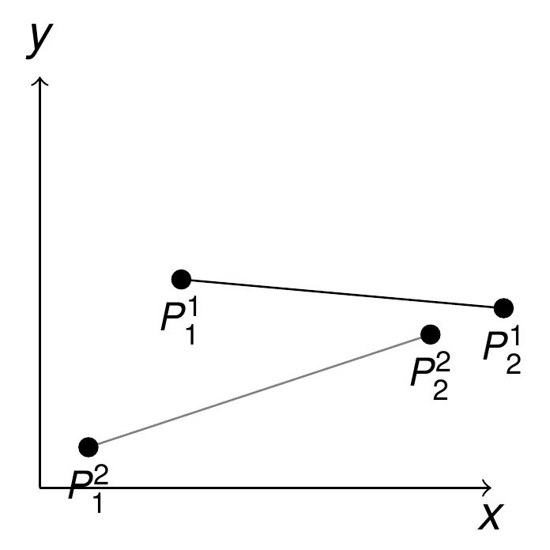</p>
<p align="center"><em>Figure: Line validation geometries (thesis Fig. 4.92). The slave line is P¹₁–P¹₂ and the master line P²₁–P²₂.</em></p>

| Pair | $$P^1_1$$ | $$P^1_2$$ | $$P^2_1$$ | $$P^2_2$$ |
|---|---|---|---|---|
| 1 | (−1.0, 0.0, 0.0) | (1.0, 0.0, 0.0) | (1.2, 0.0, 0.0) | (−0.8, 0.0, 0.0) |
| 2 | (−1.0, 0.0, 0.0) | (1.0, 0.0, 0.0) | (1.2, 1.0e−3, 0.0) | (−0.8, 1.0e−3, 0.0) |
| 3 | (−1.0, 0.0, 0.0) | (1.0, 5.0e−4, 0.0) | (1.2, 1.0e−3, 0.0) | (−0.8, 7.0e−4, 0.0) |

*Table: 2D line pairs (thesis Table 4.20; the coordinates are those of `GeneratePairs<2, 2>` in the test file, which is the executable version of the table).*

| Case | Node perturbed | Perturbation amplitude |
|---|---|---|
| 1 | 1 | −5.0e−2 |
| 2 | 1 | −5.0e−2 |
| 3 | 1 | −1.0e−1 |

*Table: 2D line perturbation amplitudes (thesis Table 4.21).*

### Jacobians (§4.6.1.1)

As the mortar integration is performed only on the slave (non-mortar) domain, the Jacobian derivative is only needed on the slave side. For a linear line, with $$J$$ denoting $$\det(\mathbf{J})$$ (thesis eq. 4.94a):

<p align="center">$$
J(\xi) = \left\| \sum_{k=1}^{n} N_{k,\xi}(\xi)\, \mathbf{x}_k \right\|
$$</p>

and its directional derivative at the Gauss point $$\xi^1_g$$ (thesis eq. 4.94b):

<p align="center">$$
\Delta J\left(\xi^1_g\right) = \frac{\sum_{k=1}^{n} N_{k,\xi}\left(\xi^1_g\right) \mathbf{x}_k}{\left\| \sum_{k=1}^{n} N_{k,\xi}\left(\xi^1_g\right) \mathbf{x}_k \right\|} \cdot \left( \sum_{k=1}^{n} N_{k,\xi}\left(\xi^1_g\right) \Delta\mathbf{x}_k \right)
$$</p>

In the code (`DerivativesUtilities::CalculateDeltaDetjSlave`, 2D branch) this is evaluated per slave DoF as $$\Delta J_i = \mathbf{j}_{(i_{dof})}\, N_{i_{node},\xi} / J$$, where $$\mathbf{j}$$ is the Jacobian column of the *integration segment* (`rVariables.jSlave`) and `DNDeSlave` the local gradient; the master DoF entries remain zero.

The convergence of this derivative for the three pairs of Table 4.20 is shown in Fig. 4.93. In this and in the following plots the $$L_2$$ error is the Euclidean norm of the difference between the linear prediction $$J_0 + \Delta J\cdot\Delta\mathbf{u}$$ and the exact value after moving the node, plotted against the perturbation amplitude in log–log scale, so that the slope is the convergence rate: a consistent first-order derivative gives a second-order remainder.

<p align="center">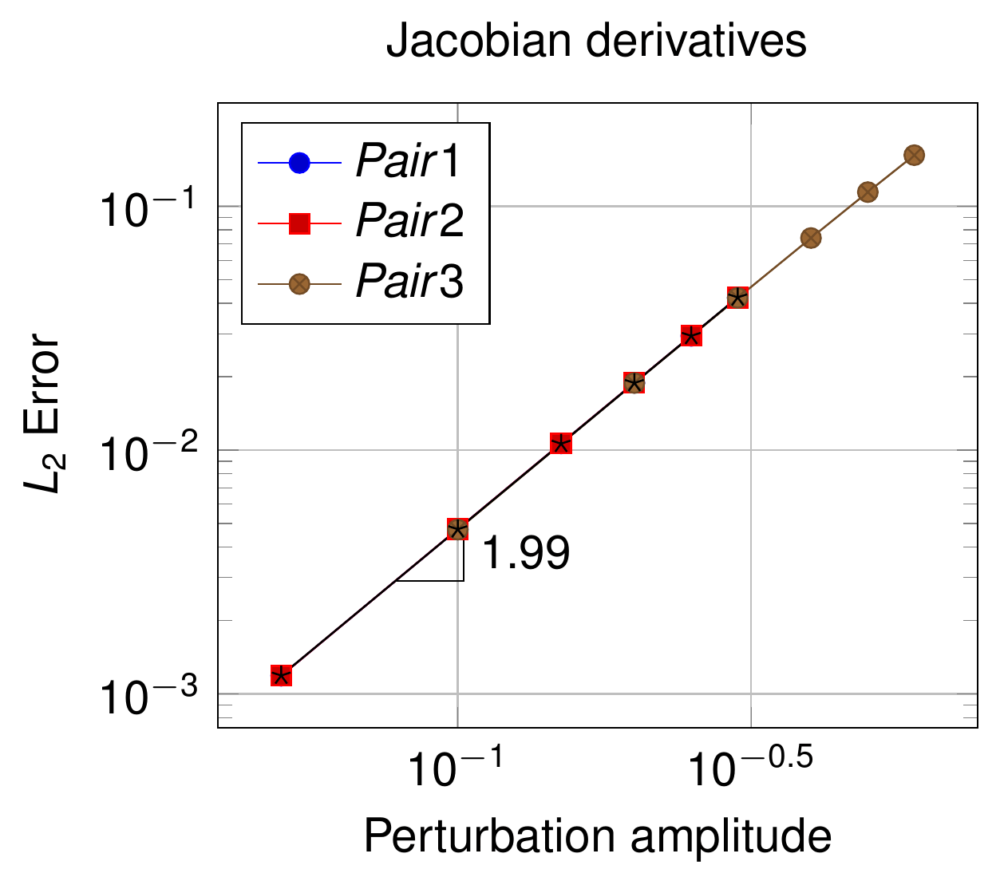</p>
<p align="center"><em>Figure: Convergence plot of the Jacobian derivatives for the 2D linear line, measured slope 1.99 (thesis Fig. 4.93).</em></p>

### Shape functions (§4.6.1.2)

The shape functions of both domains depend on the integration segment shared by the two lines in contact. For a linear line (thesis eq. 4.95):

<p align="center">$$
\begin{bmatrix} N_1 \\ N_2 \end{bmatrix} = \begin{bmatrix} \tfrac{1}{2}(1-\xi) \\ \tfrac{1}{2}(1+\xi) \end{bmatrix}, \qquad
\begin{bmatrix} \Delta N_1 \\ \Delta N_2 \end{bmatrix} = \begin{bmatrix} -\tfrac{1}{2}\Delta\xi \\ \tfrac{1}{2}\Delta\xi \end{bmatrix}
$$</p>

so the derivatives depend only on the derivative of the local coordinate $$\xi$$ at the Gauss point, which in turn depends on the derivatives of the end points of the integration segment. Note that the two lines of Fig. 4.94 (the shape functions themselves, not reproduced) are *not* in contact: a relative displacement of the pair still changes the segment, which is what makes the test meaningful. The derivation of the following terms is based on Laursen and Yang and on Popp.

#### Integration segments (§4.6.1.2.2)

<p align="center">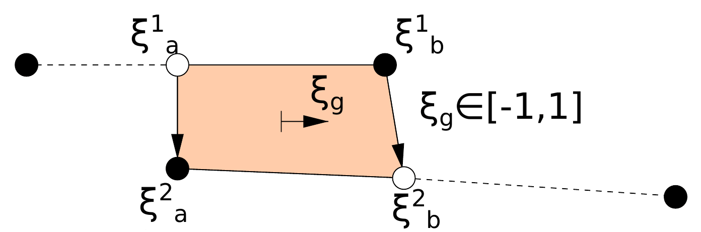</p>
<p align="center"><em>Figure: Integration segment for a linear line, defined by the projected end points $$\xi^1_a,\xi^1_b$$ (slave) and $$\xi^2_a,\xi^2_b$$ (master); the Gauss coordinate $$\xi_g\in[-1,1]$$ lives on the segment (thesis Fig. 4.95).</em></p>

Each end point of the segment is either an original slave node projected onto the master (first scenario) or an original master node projected onto the slave (second scenario); if the end point coincides with an original node of the geometry that is being integrated, its derivative vanishes. Let the sub-index $$a$$ denote the first node of the segment, $$\mathbf{x}^1_a$$ its coordinates and $$\mathbf{n}_a$$ its normal, $$n^c_s$$ and $$n^c_m$$ the number of slave and master nodes.

**First scenario** (the segment end is a slave node projected onto the master; shape functions and gradients evaluated at $$\xi^2_a$$), thesis eq. 4.96:

<p align="center">$$
\Delta\xi^1_a = 0
$$</p>

<p align="center">$$
\begin{aligned}
\Delta\xi^2_a = {} & -\frac{1}{\left(\sum_{l=1}^{n^c_m} N^2_{l,\xi} x^2_l\right) n^y_a - \left(\sum_{l=1}^{n^c_m} N^2_{l,\xi} y^2_l\right) n^x_a} \cdot \Bigg[ \left( \sum_{l=1}^{n^c_m} \left(N^2_l \Delta x^2_l\right) - \Delta x^1_a \right) n^y_a - \left( \sum_{l=1}^{n^c_m} \left(N^2_l \Delta y^2_l\right) - \Delta y^1_a \right) n^x_a \\
& + \left( \sum_{l=1}^{n^c_m} \left(N^2_l x^2_l\right) - x^1_a \right) \Delta n^y_a - \left( \sum_{l=1}^{n^c_m} \left(N^2_l y^2_l\right) - y^1_a \right) \Delta n^x_a \Bigg]
\end{aligned}
$$</p>

**Second scenario** (the segment end is a master node projected onto the slave along the interpolated slave normal; shape functions and gradients evaluated at $$\xi^1_a$$), thesis eq. 4.97:

<p align="center">$$
\Delta\xi^1_a = \frac{num}{denom}, \qquad \Delta\xi^2_a = 0
$$</p>

<p align="center">$$
\begin{aligned}
denom = {} & -\left[\sum_{k=1}^{n^c_s} N^1_{k,\xi} x^1_k\right]\left[\sum_{k=1}^{n^c_s} N^1_k n^y_k\right] + \left[\sum_{k=1}^{n^c_s} N^1_{k,\xi} y^1_k\right]\left[\sum_{k=1}^{n^c_s} N^1_k n^x_k\right] \\
& - \left[\sum_{k=1}^{n^c_s} \left(N^1_k x^1_k\right) - x^2_a\right]\left[\sum_{k=1}^{n^c_s} N^1_{k,\xi} n^y_k\right] + \left[\sum_{k=1}^{n^c_s} \left(N^1_k y^1_k\right) - y^2_a\right]\left[\sum_{k=1}^{n^c_s} N^1_{k,\xi} n^x_k\right]
\end{aligned}
$$</p>

<p align="center">$$
\begin{aligned}
num = {} & \left[\sum_{k=1}^{n^c_s} \left(N^1_k \Delta x^1_k\right) - \Delta x^2_a\right]\left[\sum_{k=1}^{n^c_s} N^1_k n^y_k\right] - \left[\sum_{k=1}^{n^c_s} \left(N^1_k \Delta y^1_k\right) - \Delta y^2_a\right]\left[\sum_{k=1}^{n^c_s} N^1_k n^x_k\right] \\
& + \left[\sum_{k=1}^{n^c_s} \left(N^1_k x^1_k\right) - x^2_a\right]\left[\sum_{k=1}^{n^c_s} N^1_k \Delta n^y_k\right] - \left[\sum_{k=1}^{n^c_s} \left(N^1_k y^1_k\right) - y^2_a\right]\left[\sum_{k=1}^{n^c_s} N^1_k \Delta n^x_k\right]
\end{aligned}
$$</p>

These two expressions are implemented literally in `DerivativesUtilities::LocalDeltaSegmentN1` (second scenario, projection of the master node $$a$$ onto the slave: `num/denom` built from `X1`, `DX1`, `Xa`, `DXa`, `n1`, `Dn1`) and `LocalDeltaSegmentN2` (first scenario). The terms $$\Delta n$$ are taken from the element-normal derivative `DeltaNormalCenter` only when `ConsiderNormalVariation` is `ELEMENTAL_DERIVATIVES` or `NODAL_ELEMENTAL_DERIVATIVES`, and are zero otherwise.

#### Local coordinates of the Gauss points (§4.6.1.2.3)

With the segment-end derivatives available, the derivative of the Gauss-point coordinate follows. On the slave side it is the linear interpolation between the segment ends (thesis eq. 4.98a):

<p align="center">$$
\Delta\xi^1_g = \tfrac{1}{2}\left(1-\xi_g\right)\Delta\xi^1_a + \tfrac{1}{2}\left(1+\xi_g\right)\Delta\xi^1_b
$$</p>

On the master side the Gauss point is obtained by projection, so the projection must be linearised (all quantities evaluated at $$\xi^2_g$$, thesis eq. 4.98b):

<p align="center">$$
\begin{aligned}
\Delta\xi^2_g = {} & -\frac{1}{\left(\sum_{k=1}^{n^c_m} N^2_{k,\xi} x^2_k\right) n^y_g - \left(\sum_{k=1}^{n^c_m} N^2_{k,\xi} y^2_k\right) n^x_g} \cdot \Bigg[ \left( \sum_{k=1}^{n^c_m} \left(N^2_k \Delta x^2_k\right) - \Delta x^1_g \right) n^y_g - \left( \sum_{k=1}^{n^c_m} \left(N^2_k \Delta y^2_k\right) - \Delta y^1_g \right) n^x_g \\
& + \left( \sum_{k=1}^{n^c_m} \left(N^2_k x^2_k\right) - x^1_g \right) \Delta n^y_g - \left( \sum_{k=1}^{n^c_m} \left(N^2_k y^2_k\right) - y^1_g \right) \Delta n^x_g \Bigg]
\end{aligned}
$$</p>

In `DerivativesUtilities::CalculateDeltaN` (2D branch) the master nodes are first projected onto the slave line and vice versa (`GeometricalProjectionUtilities::FastProjectDirection`); for each slave/master DoF the segment-end derivatives `DeltaXi_slave[i_mortar_node]` and `DeltaXi_master[i_mortar_node]` are evaluated with `LocalDeltaSegmentN1/N2` only if the projected point falls strictly inside the opposite geometry (`IsInside` plus a tolerance on the distance to the end nodes; otherwise the derivative is zero, which is the "original node" case), the Gauss-point derivatives are obtained as `inner_prod(N_decomp, DeltaXi_*)` — the interpolation of eq. 4.98a with the shape functions of the decomposition segment — and finally `DeltaN1 = DeltaXi1 * DNDe1(:,0)`, `DeltaN2 = DeltaXi2 * DNDe2(:,0)` (eq. 4.95b).

#### Convergence study (§4.6.1.2.4)

<p align="center">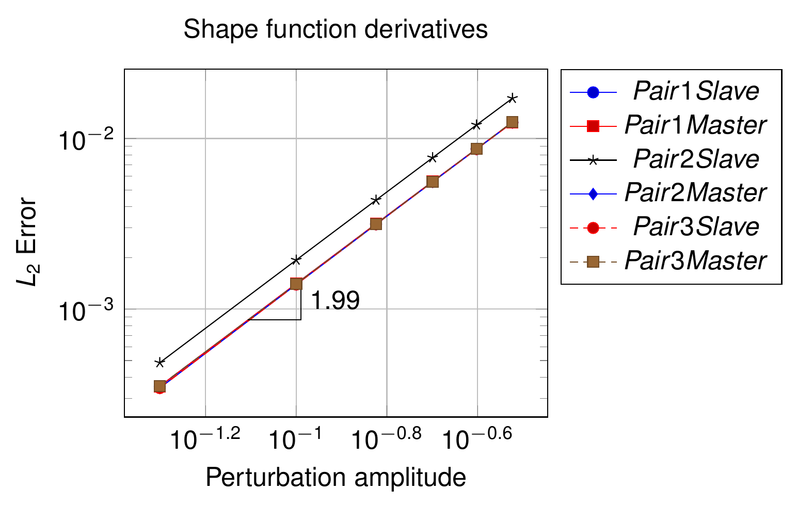</p>
<p align="center"><em>Figure: Convergence plot of the shape function derivatives (slave and master) for the three 2D pairs, slope 1.99 (thesis Fig. 4.96).</em></p>

### Dual shape functions (§4.6.1.3)

Standard FE shape functions are defined on the reference configuration and do not depend on the deformation. This is not the case for the dual shape functions, because of their intrinsic dependence on the slave Jacobian through the coefficient matrix $$\mathbf{A}_e$$ (see [dual Lagrange multipliers](Mortar_Integration_And_Dual_Lagrange_Multipliers.html) and thesis eq. 4.24). Therefore (thesis eq. 4.99):

<p align="center">$$
\boldsymbol{\Phi} = \mathbf{A}_e \mathbf{N}^1 \quad \begin{cases} \mathbf{A}_e\left(\mathbf{N}, J\right) \\ \mathbf{N}\left(\mathbf{N}\right) \end{cases}, \qquad
\Delta\boldsymbol{\Phi} = \mathbf{A}_e \Delta\mathbf{N}^1 + \Delta\mathbf{A}_e \mathbf{N}^1
$$</p>

so, in addition to the shape-function derivatives of the previous section, the derivative of $$\mathbf{A}_e = \mathbf{D}_e \mathbf{M}_e^{-1}$$ is required (thesis eq. 4.100, §4.3.3.4.1.3, also in `alm_frictionless_mortar_contact_condition.tex`):

<p align="center">$$
\begin{aligned}
\Delta\mathbf{A}_e &= \Delta\mathbf{D}_e \mathbf{M}_e^{-1} - \mathbf{D}_e \Delta\mathbf{M}_e \mathbf{M}_e^{-1} \\
\Delta\mathbf{D}_e &= \Delta[d_{jk}] \in \mathbb{R}^{m^1_e \times m^1_e}, \qquad \Delta d_{jk} = \delta_{jk} \sum_{g=1}^{n_{gp}} w_g N^1_{gk} \Delta J^1_g \\
\Delta\mathbf{M}_e &= \Delta[m_{jk}] \in \mathbb{R}^{m^1_e \times m^1_e}, \qquad \Delta m_{jk} = \sum_{g=1}^{n_{gp}} w_g N^1_{gj} N^1_{gk} \Delta J^1_g
\end{aligned}
$$</p>

The implementation lives in the Kratos core (`kratos/includes/mortar_classes.h`):

- `DualLagrangeMultiplierOperatorsWithDerivatives::CalculateDeltaAeComponents` (Doxygen: "Popp thesis page 112 eq. 4.59") accumulates, at each Gauss point, `DeltaDe[i] += w (De(N1, ΔJ_i) + De(ΔN1_i, J))` and `DeltaMe[i] += w (ΔJ_i N1⊗N1 + J (ΔN1_i⊗N1 + N1⊗ΔN1_i))`. It therefore also carries the $$\Delta N^1$$ contributions that thesis eq. 4.100 omits (the thesis keeps only the $$\Delta J$$ term because the derivation focuses on the Jacobian dependence).
- `DualLagrangeMultiplierOperatorsWithDerivatives::CalculateDeltaAe` (Doxygen: "Popp thesis page 112 equation 4.58") normalises $$\mathbf{M}_e$$ by its Frobenius norm before inverting it, checks the condition number (returning `false`, i.e. *no dual LM*, if the matrix is ill conditioned, in which case the condition falls back to standard shape functions $$\boldsymbol{\Phi} = \mathbf{N}^1$$), and computes `Ae = De·inv(Me)` and `DeltaAe[i] = (DeltaDe[i] − Ae·DeltaMe[i])·inv(Me)`. Note: this is the exact chain rule $$\Delta\mathbf{A}_e = \left(\Delta\mathbf{D}_e - \mathbf{A}_e\Delta\mathbf{M}_e\right)\mathbf{M}_e^{-1}$$; the second term of eq. 4.100 as printed in the thesis and in the `.tex` file lacks the inner $$\mathbf{M}_e^{-1}$$.
- `DerivativesUtilities::CalculateAeAndDeltaAe` drives the whole computation: it loops over the integration cells of the exact segmentation, evaluates the kinematics at each Gauss point, calls `CalculateDeltaCellVertex` (3D only), `CalculateDeltaDetjSlave` and `CalculateDeltaN1`, accumulates `CalculateDeltaAeComponents` and finally returns `CalculateDeltaAe`. The result is stored in `DerivativeData::Ae` and `DerivativeData::DeltaAe`. The derivative of the dual shape functions is then assembled in `CalculateDeltaN` as `DeltaPhi[i] = Ae·DeltaN1[i] + DeltaAe[i]·N1` (in 2D the second term is only added for master DoFs; when `DualLM` is `false`, `DeltaPhi = DeltaN1`).

<p align="center">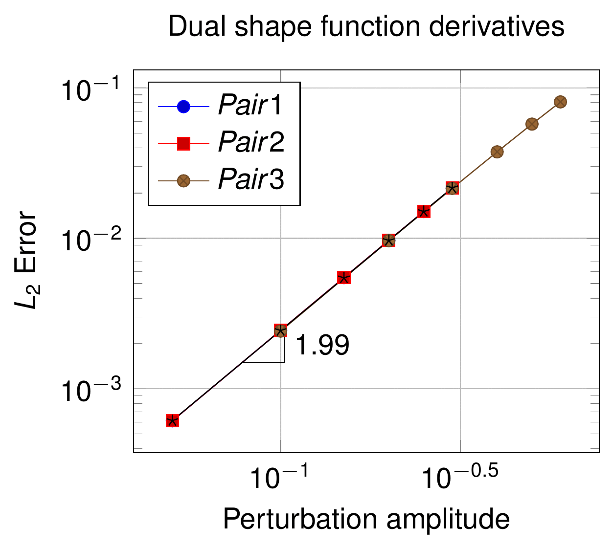</p>
<p align="center"><em>Figure: Convergence plot of the dual shape function derivatives for the 2D linear line, slope 1.99 (thesis Fig. 4.97).</em></p>

### Normal and tangent vectors (§4.6.1.4)

The linearisation of the tangent vector is tied to the linearisation of the normal, since in 2D the tangent is the cross product with the out-of-plane vector: $$\Delta\boldsymbol{\tau} = \mathbf{v}_z \times \Delta\mathbf{n}$$. Only the normal derivative is therefore developed.

<p align="center">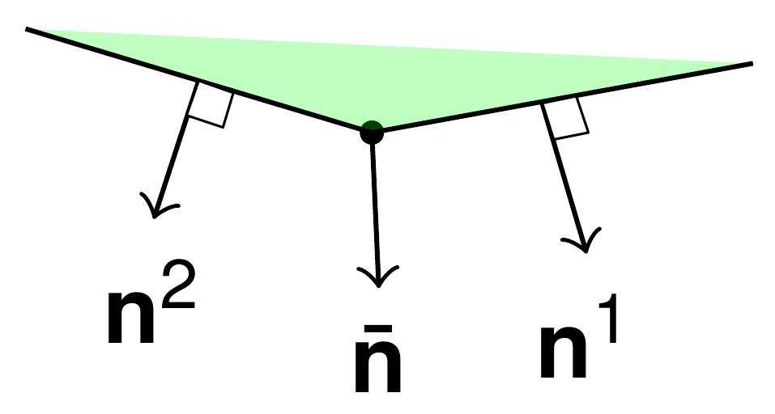</p>
<p align="center"><em>Figure: Nodal normal average for a 2D line, as proposed by Taylor and Papadopoulos (thesis Fig. 4.98).</em></p>

For a 2D line with nodes $$(x_1, y_1)$$ and $$(x_2, y_2)$$ the area normal and the unit normal are (thesis eqs. 4.101a–b):

<p align="center">$$
\mathbf{n}_{area} = \begin{bmatrix} y_2 \\ x_1 \end{bmatrix} - \begin{bmatrix} y_1 \\ x_2 \end{bmatrix}, \qquad
\mathbf{n} = \frac{\mathbf{n}_{area}}{\left\| \mathbf{n}_{area} \right\|}
$$</p>

The nodal *average normal* $$\bar{\mathbf{n}}$$ (Taylor and Papadopoulos, thesis eq. 4.101c) sums the **unit** normals $$\mathbf{n}^c$$ of the $$n^{neigh}_i$$ entities (conditions) neighbouring node $$i$$ and normalises the result:

<p align="center">$$
\bar{\mathbf{n}} = \frac{\sum_{c=1}^{n^{neigh}_i} \mathbf{n}^c}{\left\| \sum_{c=1}^{n^{neigh}_i} \mathbf{n}^c \right\|}
$$</p>

This definition, general and directly extensible to 3D, differs from the *area-weighted* average normal proposed by Popp: averaging over unit normals was found significantly more robust (better convergence) in several numerical studies, particularly on coarse meshes. In the code, this is `NormalCalculationUtils().CalculateUnitNormals<ModelPart::ConditionsContainerType>(rModelPart, true)` (the core replacement of the deprecated `MortarUtilities::ComputeNodesMeanNormalModelPart`), called by `ComputeNodesMeanNormalModelPartWithPairedNormal` in `base_mortar_criteria.h`, which additionally stores the unit normal at the centre of each slave geometry in the `NORMAL` value of every computing condition (the "paired" normal: `PairedCondition::mPairedNormal` holds the master-side counterpart, refreshed by `PairedCondition::Initialize`, `InitializeSolutionStep` and — when `CONSIDER_NORMAL_VARIATION` differs from `NO_DERIVATIVES_COMPUTATION` — `InitializeNonLinearIteration`).

The directional derivative of the unit normal follows from the quotient rule (thesis eqs. 4.102a–b):

<p align="center">$$
\Delta\mathbf{n} = \frac{\Delta\mathbf{n}_{area} \left\| \mathbf{n}_{area} \right\| - \mathbf{n}_{area} \Delta\left\| \mathbf{n}_{area} \right\|}{\left\| \mathbf{n}_{area} \right\|^2}, \qquad
\Delta\mathbf{n}_{area} = \Delta\begin{bmatrix} y_2 \\ x_1 \end{bmatrix} - \Delta\begin{bmatrix} y_1 \\ x_2 \end{bmatrix}
$$</p>

and the derivative of the average normal decomposes into its components (thesis eqs. 4.103a–c):

<p align="center">$$
\Delta\bar{\mathbf{n}} = \frac{\Delta\sum_{c=1}^{n^{neigh}_i} \mathbf{n}^c \left\| \sum_{c=1}^{n^{neigh}_i} \mathbf{n}^c \right\| - \sum_{c=1}^{n^{neigh}_i} \mathbf{n}^c \,\Delta\left\| \sum_{c=1}^{n^{neigh}_i} \mathbf{n}^c \right\|}{\left\| \sum_{c=1}^{n^{neigh}_i} \mathbf{n}^c \right\|^2}
$$</p>

<p align="center">$$
\Delta\sum_{c=1}^{n^{neigh}_i} \mathbf{n}^c = \sum_{c=1}^{n^{neigh}_i} \Delta\mathbf{n}^c, \qquad
\Delta\left\| \sum_{c=1}^{n^{neigh}_i} \mathbf{n}^c \right\| = \frac{\sum_{c=1}^{n^{neigh}_i} \mathbf{n}^c \cdot \Delta\sum_{c=1}^{n^{neigh}_i} \mathbf{n}^c}{\left\| \sum_{c=1}^{n^{neigh}_i} \mathbf{n}^c \right\|} = \bar{\mathbf{n}} \cdot \Delta\sum_{c=1}^{n^{neigh}_i} \mathbf{n}^c
$$</p>

Finally, the normal at a Gauss point is the shape-function interpolation of the nodal normals evaluated at $$\xi^1_g$$, so its derivative is obtained by the chain rule (thesis eq. 4.104):

<p align="center">$$
\Delta\mathbf{n}_g = \sum_{k=1}^{n^c_s} N^1_{k,\xi}\left(\xi^1_g\right) \Delta\xi^1_g \,\mathbf{n}_k + \sum_{k=1}^{n^c_s} N^1_k\left(\xi^1_g\right) \Delta\mathbf{n}_k
$$</p>

The code splits the computation in the following pieces (`derivatives_utilities.cpp`):

- `GPDeltaNormalSlave(rJacobian, rDNDe)` / `GPDeltaNormalMaster`: the derivative of the *unit* normal of one geometry at a point with respect to each of its nodal DoFs, obtained from the Jacobian tangent directions $$\mathbf{j}_0$$ (and $$\mathbf{j}_1$$ in 3D, $$\mathbf{v}_z$$ in 2D): $$\Delta\mathbf{n}_{area,i} = \mathbf{j}_0 \times \Delta\mathbf{j}_{1,i} + \Delta\mathbf{j}_{0,i} \times \mathbf{j}_1$$ with $$\Delta\mathbf{j}_{0,i} = N_{i_{node},\xi}\,\mathbf{e}_{i_{dof}}$$, followed by the normalisation of eq. 4.102a / 4.115a. Note: in the current implementation the projection term is added as `(Δn_area + n̂ (Δn_area·n_area))/‖n_area‖`, i.e. with the sign and the un-normalised $$\mathbf{n}_{area}$$ in the inner product instead of the $$-\mathbf{n}_{area}\,\Delta\left\|\mathbf{n}_{area}\right\|/\left\|\mathbf{n}_{area}\right\|^2$$ of eq. 4.102a; the unit length of the linearised normal is enforced afterwards by `ComputeRenormalizerMatrix`, and the tests below verify the convergence of the final, renormalised derivative rather than the intermediate formula.
- `DeltaNormalCenter(rThisGeometry)`: the derivative of the *element* normal at the centre of the geometry (eq. 4.102 applied at the centre); the previous-step normal (`PreviousNormalGeometry`) plus the increment $$\sum_i \Delta\mathbf{n}_i \Delta u_i$$ is renormalised and the correction is folded into the derivative with `ComputeRenormalizerMatrix(diff_vector, aux_delta_normal0)`, an auxiliary $$3\times 3$$ matrix that maps the raw derivative onto the unit sphere. This is the $$\Delta\mathbf{n}$$ used inside the segment (2D) and clipping (3D) derivatives when `ELEMENTAL_DERIVATIVES` or `NODAL_ELEMENTAL_DERIVATIVES` is requested.
- `CalculateDeltaNormalSlave(rDeltaNormal, rThisGeometry)` / `CalculateDeltaNormalMaster`: the derivative of the *nodal* normals of the geometry with respect to every DoF of the same geometry (a `BoundedMatrix<double, TNumNodes, TDim>` per DoF, stored in `DerivativeData::DeltaNormalSlave` / `DeltaNormalMaster`). For every node of the geometry it evaluates `GPDeltaNormalSlave` at the node, reconstructs the linearised nodal normal from the previous-step `NORMAL` (history index 1) and the displacement increment, renormalises row by row, and applies `ImplementationDerivativesUtilities::ComputeRenormalizerMatrix` (3D; the identity in 2D). This is the array that the `NV` generated conditions read as `DeltaNormalSlave[i]`, i.e. the discrete counterpart of eq. 4.103 restricted to the contribution of the condition itself. It is only computed in `CalculateConditionSystem` when `TNormalVariation` is `true`.
- The Gauss-point derivative of eq. 4.104 is not stored explicitly: the generated conditions work with nodal normals (`NormalSlave` and `DeltaNormalSlave`), and the interpolation is part of the mortar-operator products $$\mathbf{n}\cdot(\mathbf{D}\mathbf{x}_1 - \mathbf{M}\mathbf{x}_2)$$.

<p align="center">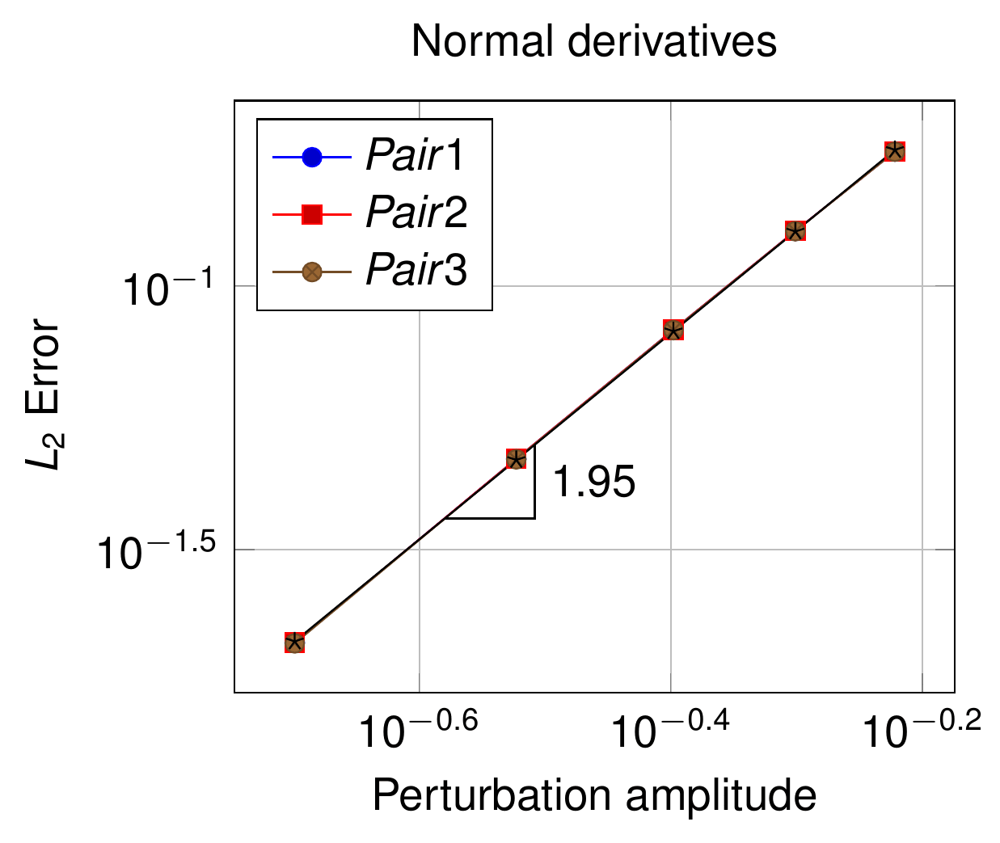</p>
<p align="center"><em>Figure: Convergence plot of the normal derivatives for the 2D linear line, slope 1.95 (thesis Fig. 4.99).</em></p>

## Derivatives for 3D contact (thesis §4.6.2)

The 3D derivatives concern linear triangles (`Triangle3D3`) and bilinear quadrilaterals (`Quadrilateral3D4`). The main difference with respect to 2D is the *segmentation* of the surfaces: the integration is performed on the triangular cells produced by clipping the projected master polygon against the slave one (see [mortar integration](Mortar_Integration_And_Dual_Lagrange_Multipliers.html), thesis §A.2), so the derivative of the cell vertices must be computed first. The derivatives are validated on the six triangle pairs of Table 4.22 (Fig. 4.100a) perturbed as in Table 4.23, and on the three quadrilateral pairs of Table 4.24 (Fig. 4.100b) perturbed as in Table 4.25.

| Pair | $$P^1_1$$ | $$P^1_2$$ | $$P^1_3$$ | $$P^2_1$$ | $$P^2_2$$ | $$P^2_3$$ |
|---|---|---|---|---|---|---|
| 1 | (0.0, 0.0, 0.0) | (1.0, 0.0, 0.0) | (0.0, 1.0, 0.0) | (0.0, 1.0, 1.0e−3) | (0.0, 0.0, 1.0e−3) | (1.0, 0.0, 1.0e−3) |
| 2 | (−0.1, 0.1, 1.0e−3) | (1.1, 0.2, 0.0) | (0.1, 1.0, 0.0) | (−0.1, 1.3, 1.0e−3) | (0.1, 0.2, 1.0e−3) | (1.2, 0.2, 2.0e−3) |
| 3 | (−0.1, 0.1, 1.0e−3) | (1.1, 0.2, 0.0) | (0.1, 1.0, 0.0) | (−0.1, 1.3, 1.0e−3) | (0.1, 0.2, 1.0e−3) | (1.2, 0.2, 2.0e−3) |
| 4 | (0.0, 0.0, 0.0) | (1.0, 0.0, 0.0) | (0.0, 1.0, 0.0) | (0.0, 1.0, 1.0e−3) | (0.0, 0.0, 1.0e−3) | (1.0, 0.0, 1.0e−3) |
| 5 | (−0.1, 0.1, 1.0e−3) | (1.1, 0.2, 0.0) | (0.1, 1.0, 0.0) | (−0.1, 1.3, 1.0e−3) | (0.1, 0.2, 1.0e−3) | (1.2, 0.2, 2.0e−3) |
| 6 | (0.0, 0.0, 0.0) | (1.0, 0.0, 0.0) | (0.0, 1.0, 0.0) | (−0.1, 1.0, 1.0e−3) | (0.0, 0.0, 1.0e−3) | (1.0, 0.0, 1.0e−3) |

*Table: 3D triangle pairs (thesis Table 4.22; coordinates from `GeneratePairs<3, 3>`, in which pair 6 has $$P^2_1 = (-0.1, 1.0, 10^{-3})$$).*

| Case | Node perturbed (I) | Amplitude (I) | Node perturbed (II) | Amplitude (II) |
|---|---|---|---|---|
| 1 | 4 | −5.0e−1 | – | – |
| 2 | 4 | −5.0e−3 | – | – |
| 3 | 4 | 1.0e−1 | 5 | 1.0e−1 |
| 4 | 4 | 1.0e−1 | 5 | 5.0e−2 |
| 5 | 1 | 5.0e−2 | – | – |
| 6 | 4 | −5.0e−2 | – | – |

*Table: 3D triangle perturbation amplitudes (thesis Table 4.23).*

| Pair | $$P^1_1$$ | $$P^1_2$$ | $$P^1_3$$ | $$P^1_4$$ | $$P^2_1$$ | $$P^2_2$$ | $$P^2_3$$ | $$P^2_4$$ |
|---|---|---|---|---|---|---|---|---|
| 1 | (0.0, 0.2, 1.0e−3) | (1.0, 0.2, 1.0e−3) | (1.1, 1.1, 0.0) | (0.2, 1.0, 0.0) | (−0.1, 1.0, 1.0e−3) | (1.0, 1.1, 1.0e−3) | (1.0, 0.1, 2.0e−3) | (0.0, 0.1, 2.0e−3) |
| 2 | (0.0, 0.0, 0.0) | (1.0, 0.0, 0.0) | (1.0, 1.0, 0.0) | (0.0, 1.0, 0.0) | (−0.1, 1.0, 1.0e−3) | (1.0, 1.0, 1.0e−3) | (1.0, 0.0, 1.0e−3) | (0.0, 0.0, 1.0e−3) |
| 3 | (0.0, 0.3, 2.0e−3) | (1.0, 0.2, 1.0e−3) | (1.2, 1.1, 0.0) | (0.2, 1.1, 0.0) | (−0.1, 1.0, 2.0e−3) | (1.2, 1.1, 2.0e−3) | (1.0, 0.1, 3.0e−3) | (0.1, 0.1, 3.0e−3) |

*Table: 3D quadrilateral pairs (thesis Table 4.24; coordinates from `GeneratePairs<3, 4>`).*

| Case | Node perturbed | Perturbation amplitude |
|---|---|---|
| 1 | 5 | −5.0e−3 |
| 2 | 5 | −5.0e−3 |
| 3 | 5 | −5.0e−3 |

*Table: 3D quadrilateral perturbation amplitudes (thesis Table 4.25).*

### Jacobians (§4.6.2.1)

#### Integration segment (clipping) derivatives (§4.6.2.1.1.1)

<p align="center">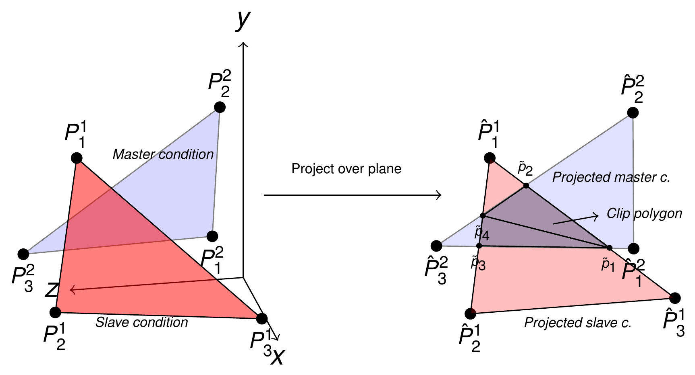</p>
<p align="center"><em>Figure: Intersection and clipping procedure during mortar segmentation: the master condition is projected onto the slave plane and the clip polygon is triangulated (thesis Fig. 4.100).</em></p>

<p align="center">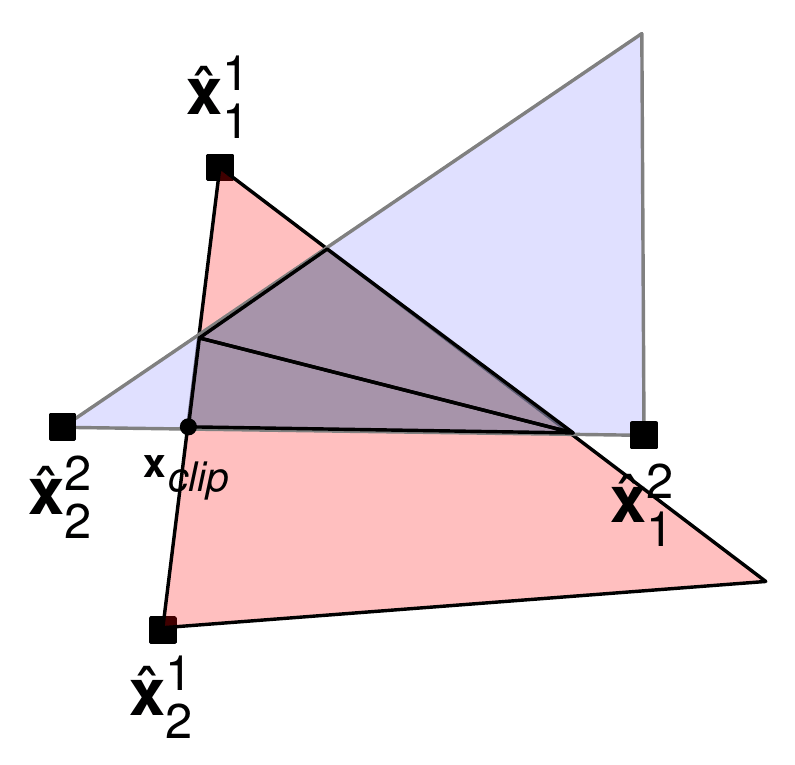</p>
<p align="center"><em>Figure: Detail of the intersection during mortar segmentation: the clipped point $$\mathbf{x}_{clip}$$ depends on the slave segment $$(\hat{\mathbf{x}}^1_1, \hat{\mathbf{x}}^1_2)$$ and on the master segment $$(\hat{\mathbf{x}}^2_1, \hat{\mathbf{x}}^2_2)$$ (thesis Fig. 4.101).</em></p>

The coordinates of the clipped points depend on the projected slave segment $$(\hat{\mathbf{x}}^1_1, \hat{\mathbf{x}}^1_2)$$ and master segment $$(\hat{\mathbf{x}}^2_1, \hat{\mathbf{x}}^2_2)$$, so the clipping algorithm must keep track of which nodes of each geometry generated each vertex. This bookkeeping is the `PointBelong` machinery of `mortar_classes.h`: each vertex of an integration cell carries a `PointBelongsLine2D2N` / `PointBelongsTriangle3D3N` / `PointBelongsQuadrilateral3D4N` / `PointBelongsTriangle3D3NQuadrilateral3D4N` / `PointBelongsQuadrilateral3D4NTriangle3D3N` hash that says whether it is an original slave node, an original master node, or an intersection between a slave edge and a master edge (decoded by `DerivativesUtilities::ConvertAuxHashIndex` into the start/end node indices of both edges). Two scenarios must be distinguished:

**The vertex is a projected node of the original master/slave geometry.** For a slave node (thesis eq. 4.105a) or a master node (4.105b) projected onto the plane of normal $$\mathbf{n}_{plane}$$ through $$\mathbf{x}^1_{plane}$$:

<p align="center">$$
\mathbf{x}_{clip} = \mathbf{x}^1 - \left[\left(\mathbf{x}^1 - \mathbf{x}^1_{plane}\right)\cdot\mathbf{n}_{plane}\right]\mathbf{n}_{plane}, \qquad
\mathbf{x}_{clip} = \mathbf{x}^2 - \left[\left(\mathbf{x}^2 - \mathbf{x}^1_{plane}\right)\cdot\mathbf{n}_{plane}\right]\mathbf{n}_{plane}
$$</p>

with derivatives (thesis eqs. 4.106a–b):

<p align="center">$$
\Delta\mathbf{x}_{clip} = \Delta\mathbf{x}^1 - \left[\left(\Delta\mathbf{x}^1 - \Delta\mathbf{x}^1_{plane}\right)\cdot\mathbf{n}_{plane} + \left(\mathbf{x}^1 - \mathbf{x}^1_{plane}\right)\cdot\Delta\mathbf{n}_{plane}\right]\mathbf{n}_{plane} - \left[\left(\mathbf{x}^1 - \mathbf{x}^1_{plane}\right)\cdot\mathbf{n}_{plane}\right]\Delta\mathbf{n}_{plane}
$$</p>

<p align="center">$$
\Delta\mathbf{x}_{clip} = \Delta\mathbf{x}^2 - \left[\left(\Delta\mathbf{x}^2 - \Delta\mathbf{x}^1_{plane}\right)\cdot\mathbf{n}_{plane} + \left(\mathbf{x}^2 - \mathbf{x}^1_{plane}\right)\cdot\Delta\mathbf{n}_{plane}\right]\mathbf{n}_{plane} - \left[\left(\mathbf{x}^2 - \mathbf{x}^1_{plane}\right)\cdot\mathbf{n}_{plane}\right]\Delta\mathbf{n}_{plane}
$$</p>

This is `DerivativesUtilities::LocalDeltaVertex(rNormal, rDeltaNormal, iDoF, iBelong, ConsiderNormalVariation, rSlaveGeometry, rMasterGeometry, Coeff)`, where $$\mathbf{x}^1_{plane}$$ is the slave centre (so $$\Delta\mathbf{x}^1_{plane} = \Delta\mathbf{x}^1/n_{nodes}$$, the `Coeff` argument) and $$\Delta\mathbf{n}_{plane}$$ is the element-normal derivative `DeltaNormalCenter`, or zero when normal variation is not requested.

**The vertex is an intersection (most general case; all the points of Fig. 4.101).** With the Foley clipping formula (thesis eq. 4.107; the four points are first projected onto the auxiliary plane of normal $$\mathbf{n}_{plane}$$):

<p align="center">$$
\mathbf{x}_{clip} = \hat{\mathbf{x}}^1_1 - \frac{\left(\hat{\mathbf{x}}^1_1 - \hat{\mathbf{x}}^2_1\right)\times\left(\hat{\mathbf{x}}^2_2 - \hat{\mathbf{x}}^2_1\right)\cdot\mathbf{n}_{plane}}{\left(\hat{\mathbf{x}}^1_2 - \hat{\mathbf{x}}^1_1\right)\times\left(\hat{\mathbf{x}}^2_2 - \hat{\mathbf{x}}^2_1\right)\cdot\mathbf{n}_{plane}}\left(\hat{\mathbf{x}}^1_2 - \hat{\mathbf{x}}^1_1\right)
$$</p>

The derivative, originally deduced by Puso and Laursen, is decomposed as (thesis eqs. 4.108a–e):

<p align="center">$$
\Delta\mathbf{x}_{clip} = \Delta\hat{\mathbf{x}}^1_1 - \frac{num}{denom}\left(\Delta\hat{\mathbf{x}}^1_2 - \Delta\hat{\mathbf{x}}^1_1\right) - \frac{\Delta num \cdot denom - num \cdot \Delta denom}{denom^2}\left(\hat{\mathbf{x}}^1_2 - \hat{\mathbf{x}}^1_1\right)
$$</p>

<p align="center">$$
num = \left(\hat{\mathbf{x}}^1_1 - \hat{\mathbf{x}}^2_1\right)\times\left(\hat{\mathbf{x}}^2_2 - \hat{\mathbf{x}}^2_1\right)\cdot\mathbf{n}_{plane}, \qquad
denom = \left(\hat{\mathbf{x}}^1_2 - \hat{\mathbf{x}}^1_1\right)\times\left(\hat{\mathbf{x}}^2_2 - \hat{\mathbf{x}}^2_1\right)\cdot\mathbf{n}_{plane}
$$</p>

<p align="center">$$
\Delta num = \left(\left(\hat{\mathbf{x}}^1_1 - \hat{\mathbf{x}}^2_1\right)\times\left(\hat{\mathbf{x}}^2_2 - \hat{\mathbf{x}}^2_1\right)\right)\cdot\Delta\mathbf{n}_{plane} + \left(\left(\Delta\hat{\mathbf{x}}^1_1 - \Delta\hat{\mathbf{x}}^2_1\right)\times\left(\hat{\mathbf{x}}^2_2 - \hat{\mathbf{x}}^2_1\right) + \left(\hat{\mathbf{x}}^1_1 - \hat{\mathbf{x}}^2_1\right)\times\left(\Delta\hat{\mathbf{x}}^2_2 - \Delta\hat{\mathbf{x}}^2_1\right)\right)\cdot\mathbf{n}_{plane}
$$</p>

<p align="center">$$
\Delta denom = \left(\left(\hat{\mathbf{x}}^1_2 - \hat{\mathbf{x}}^1_1\right)\times\left(\hat{\mathbf{x}}^2_2 - \hat{\mathbf{x}}^2_1\right)\right)\cdot\Delta\mathbf{n}_{plane} + \left(\left(\Delta\hat{\mathbf{x}}^1_2 - \Delta\hat{\mathbf{x}}^1_1\right)\times\left(\hat{\mathbf{x}}^2_2 - \hat{\mathbf{x}}^2_1\right) + \left(\hat{\mathbf{x}}^1_2 - \hat{\mathbf{x}}^1_1\right)\times\left(\Delta\hat{\mathbf{x}}^2_2 - \Delta\hat{\mathbf{x}}^2_1\right)\right)\cdot\mathbf{n}_{plane}
$$</p>

`DerivativesUtilities::CalculateDeltaCellVertex` implements exactly this decomposition; its Doxygen (`derivatives_utilities.h:199-213`) restates it in the code notation `xclipp = xs1 - num/denom * diff3`, with `diff1 = xs1 - xs2`, `diff2 = xe2 - xs2`, `diff3 = xe1 - xs1`, `num = (diff1 x diff2)·n0`, `denom = (diff3 x diff2)·n0`, `delta_num = num·delta_n0 + n0·(delta_diff1 x diff2 + diff1 x delta_diff2)`, `delta_denom = denom·delta_n0 + n0·(delta_diff3 x diff2 + diff3 x delta_diff2)`. For each of the three vertices of the cell and each DoF of the pair, the resulting vector is stored in `DerivativeData::DeltaCellVertex[i]` (a $$3\times 3$$ matrix per DoF, one row per vertex); the projected edge end points are obtained with `GeometricalProjectionUtilities::FastProject` onto the plane through the slave centre with the slave condition normal, and their derivatives with `LocalDeltaVertex`.

#### Jacobian derivatives (§4.6.2.1.1.2)

The integration is performed on the cells, so the relevant Jacobian is $$J_{clip}$$ of the integration triangle with vertices $$\mathbf{x}^1_{clip}, \mathbf{x}^2_{clip}, \mathbf{x}^3_{clip}$$ (thesis eq. 4.109):

<p align="center">$$
J_{clip} = \left\| \left(\mathbf{x}^2_{clip} - \mathbf{x}^1_{clip}\right)\times\left(\mathbf{x}^3_{clip} - \mathbf{x}^1_{clip}\right) \right\|
$$</p>

<p align="center">$$
\begin{aligned}
\Delta J_{clip} = {} & \frac{\left(\mathbf{x}^2_{clip} - \mathbf{x}^1_{clip}\right)\times\left(\mathbf{x}^3_{clip} - \mathbf{x}^1_{clip}\right)}{\left\| \left(\mathbf{x}^2_{clip} - \mathbf{x}^1_{clip}\right)\times\left(\mathbf{x}^3_{clip} - \mathbf{x}^1_{clip}\right) \right\|} \cdot \left[\left(\Delta\mathbf{x}^2_{clip} - \Delta\mathbf{x}^1_{clip}\right)\times\left(\mathbf{x}^3_{clip} - \mathbf{x}^1_{clip}\right)\right] \\
& + \frac{\left(\mathbf{x}^2_{clip} - \mathbf{x}^1_{clip}\right)\times\left(\mathbf{x}^3_{clip} - \mathbf{x}^1_{clip}\right)}{\left\| \left(\mathbf{x}^2_{clip} - \mathbf{x}^1_{clip}\right)\times\left(\mathbf{x}^3_{clip} - \mathbf{x}^1_{clip}\right) \right\|} \cdot \left[\left(\mathbf{x}^2_{clip} - \mathbf{x}^1_{clip}\right)\times\left(\Delta\mathbf{x}^3_{clip} - \Delta\mathbf{x}^1_{clip}\right)\right]
\end{aligned}
$$</p>

This is the 3D branch of `CalculateDeltaDetjSlave`: `x21cell`, `x31cell`, their cross product divided by `DetjSlave`, and for each DoF of slave and master the two cross products with the rows of `DeltaCellVertex[i]`. Because the cell vertices depend on both geometries, in 3D `DeltaDetjSlave` has `DoFSizeDerivativesDependence = DoFSizePairedGeometry` entries, whereas in 2D only the `DoFSizeSlaveGeometry` slave entries are non-zero (`DerivativeData`, `mortar_classes.h:617-626`).

#### Convergence study (§4.6.2.1.2)

<p align="center">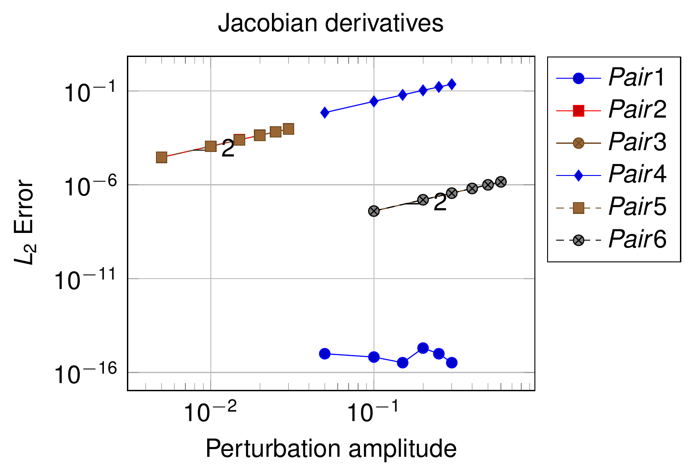</p>
<p align="center"><em>Figure: Convergence plot of the Jacobian derivatives for the six 3D triangle pairs, slope 2 (thesis Fig. 4.102). Pair 1 (flat, coincident triangles) is exact to machine precision, hence the 1e−16 plateau.</em></p>

The corresponding plot for the three quadrilateral pairs is thesis Fig. 4.103 (slope 2.02; pair 1 exact to machine precision), not reproduced here.

### Shape functions (§4.6.2.2)

The reasoning of the 2D case applies: the shape functions depend on the local coordinates $$(\xi, \eta)$$, whose derivatives are obtained in the next subsection. For the linear triangle (thesis eq. 4.110):

<p align="center">$$
\begin{bmatrix} N_1 \\ N_2 \\ N_3 \end{bmatrix} = \begin{bmatrix} 1 - \xi - \eta \\ \xi \\ \eta \end{bmatrix}, \qquad
\begin{bmatrix} \Delta N_1 \\ \Delta N_2 \\ \Delta N_3 \end{bmatrix} = \begin{bmatrix} -\Delta\xi & -\Delta\eta \\ \Delta\xi & 0 \\ 0 & \Delta\eta \end{bmatrix}
$$</p>

and for the bilinear quadrilateral (thesis eq. 4.111):

<p align="center">$$
\begin{bmatrix} N_1 \\ N_2 \\ N_3 \\ N_4 \end{bmatrix} = \begin{bmatrix} \tfrac{1}{4}(1-\xi)(1-\eta) \\ \tfrac{1}{4}(1+\xi)(1-\eta) \\ \tfrac{1}{4}(1+\xi)(1+\eta) \\ \tfrac{1}{4}(1-\xi)(1+\eta) \end{bmatrix}, \qquad
\begin{bmatrix} \Delta N_1 \\ \Delta N_2 \\ \Delta N_3 \\ \Delta N_4 \end{bmatrix} = \begin{bmatrix} -\tfrac{\Delta\xi}{4} & -\tfrac{\Delta\eta}{4} \\ \tfrac{\Delta\xi}{4} & -\tfrac{\Delta\eta}{4} \\ \tfrac{\Delta\xi}{4} & \tfrac{\Delta\eta}{4} \\ -\tfrac{\Delta\xi}{4} & \tfrac{\Delta\eta}{4} \end{bmatrix}
$$</p>

(the two columns are the $$\xi$$ and $$\eta$$ contributions, i.e. $$\Delta N_k = N_{k,\xi}\Delta\xi + N_{k,\eta}\Delta\eta$$; the thesis writes the quadrilateral entries at $$\xi = \eta = 0$$). The 3D shape functions themselves are plotted in thesis Figs. 4.104 and 4.105 (not reproduced).

#### Local coordinates of the Gauss points (§4.6.2.2.2)

The Gauss points of the integration triangles must be projected into the master and slave parent domains, which in general requires solving a non-linear problem with a Newton–Raphson iteration. Following Popp, but simplified because the geometries are linear, the Gauss point of the cell is written in terms of the cell shape functions $$\tilde{N}$$ and, equivalently, in terms of the slave/master shape functions (thesis eq. 4.112a):

<p align="center">$$
\mathbf{x}^1_g = \sum_{k=1}^{n^c_s} N^1_k \mathbf{x}^1_k = \sum_{i=1}^{3} \tilde{N}_i \mathbf{x}_{clip}, \qquad
\mathbf{x}^2_g = \sum_{l=1}^{n^c_m} N^2_l \mathbf{x}^2_l = \sum_{i=1}^{3} \tilde{N}_i \mathbf{x}_{clip}
$$</p>

which defines the residual of a linear system that converges in one iteration (thesis eqs. 4.112b–d):

<p align="center">$$
\mathbf{RHS}_1 = \mathbf{x}^1_g, \quad \mathbf{RHS}_2 = \mathbf{x}^2_g, \qquad
\mathbf{LHS}_i \begin{bmatrix} \xi_i \\ \eta_i \end{bmatrix} = \mathbf{RHS}_i, \qquad
\mathbf{LHS}_i = \mathbf{J}^i = \begin{bmatrix} \sum_{k=1}^{n^c_s} N^i_{k,\xi} \mathbf{x}^i_k \\ \sum_{k=1}^{n^c_s} N^i_{k,\eta} \mathbf{x}^i_k \end{bmatrix}, \quad i = 1, 2
$$</p>

Differentiating, the same LHS gives the derivatives of the local coordinates (thesis eqs. 4.113a–b):

<p align="center">$$
\mathbf{RHS}_1 = \Delta\mathbf{x}^1_g = \sum_{i=1}^{3} \tilde{N}_i \Delta\mathbf{x}_{clip}, \quad
\mathbf{RHS}_2 = \Delta\mathbf{x}^2_g = \sum_{i=1}^{3} \tilde{N}_i \Delta\mathbf{x}_{clip}, \qquad
\begin{bmatrix} \Delta\xi_i \\ \Delta\eta_i \end{bmatrix} = \mathbf{LHS}_i^{-1} \mathbf{RHS}_i, \quad i = 1, 2
$$</p>

In the 3D branch of `CalculateDeltaN`, for each DoF of the pair, `aux_RHS1 = Σ N_decomp[i_belong]·DeltaCellVertex[i](i_belong,:)` is the derivative of the Gauss point (eq. 4.113a); the contribution of the node being differentiated is subtracted (`aux_RHS1 −= N1[i_node]·LocalDeltaVertex(...)` for a slave DoF, `aux_RHS2 −= N2[i_node − TNumNodes]·...` for a master DoF), and `DeltaPointLocalCoordinatesSlave` / `DeltaPointLocalCoordinatesMaster` solve the $$3\times 2$$ system in the least-squares sense: with $$\mathbf{DN} = \mathbf{X}\,\partial\mathbf{N}/\partial\boldsymbol{\xi}$$ they form $$\mathbf{J} = \mathbf{DN}^T\mathbf{DN}$$ ($$2\times 2$$), invert it (the inverse is zeroed if the condition number check fails, with a debug warning "CANNOT INVERT JACOBIAN TO COMPUTE DELTA COORDINATES") and return $$\left[\Delta\xi, \Delta\eta\right]^T = \mathbf{J}^{-1}\mathbf{DN}^T\,\Delta\mathbf{x}_g$$. The shape-function derivatives are finally `DeltaN1[i] = Δξ·DNDe1(:,0) + Δη·DNDe1(:,1)` (eq. 4.110b / 4.111b) and likewise for `DeltaN2`, and `DeltaPhi[i] = DeltaAe[i]·N1 + Ae·DeltaN1[i]` (eq. 4.99b).

#### Convergence study (§4.6.2.2.3)

<p align="center">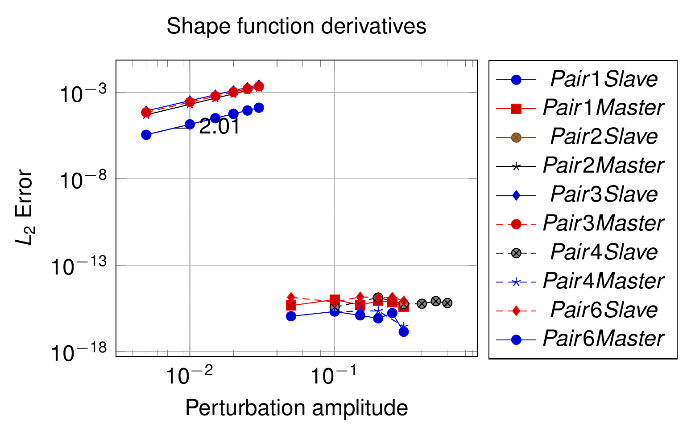</p>
<p align="center"><em>Figure: Convergence plot of the shape function derivatives (slave and master) for the 3D triangle pairs, slope 2.01; the flat pairs 1, 4 and 6 are exact to machine precision (thesis Fig. 4.106).</em></p>

The quadrilateral counterpart is thesis Fig. 4.107 (slope 2.02; pairs 1 and 3 exact), not reproduced.

### Dual shape functions (§4.6.2.3)

The procedure is identical to the 2D case (§4.6.1.3): the derivative of $$\mathbf{A}_e$$ is computed with the derivatives of $$J_{clip}$$ of the integration triangles and the shape-function derivatives of the previous section. No additional expression is needed; `CalculateAeAndDeltaAe` handles 2D and 3D uniformly through `DecompositionType` (`Line2D2<Point>` or `Triangle3D3<Point>`) and the `if constexpr (TDim == 3)` call to `CalculateDeltaCellVertex`.

<p align="center">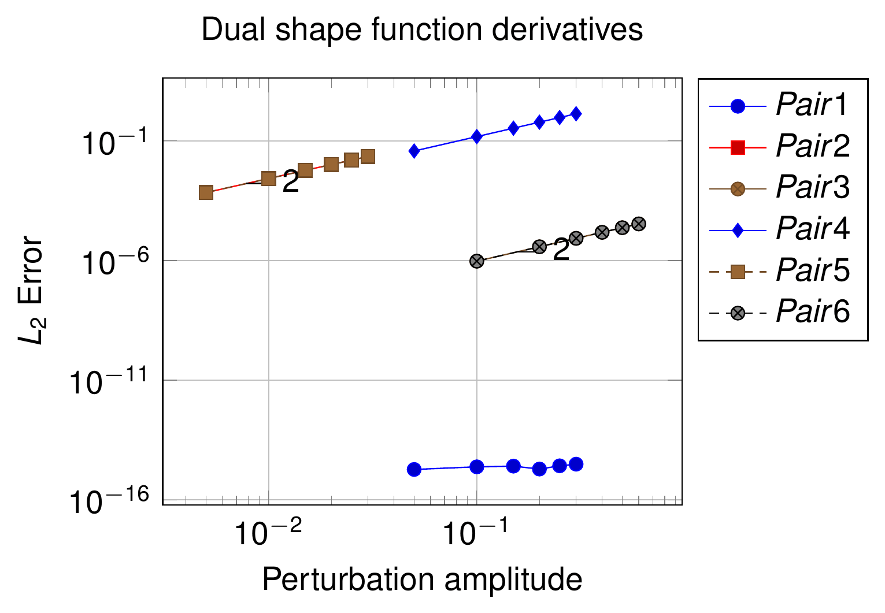</p>
<p align="center"><em>Figure: Convergence plot of the dual shape function derivatives for the 3D triangle pairs, slope 2 (thesis Fig. 4.108).</em></p>

The quadrilateral plot is thesis Fig. 4.109 (slope 2.04, all three pairs converge quadratically), not reproduced.

### Normal and tangent vectors (§4.6.2.4)

<p align="center">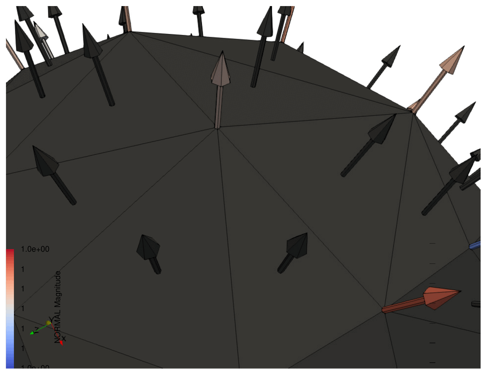</p>
<p align="center"><em>Figure: Nodal normal average for a 3D geometry; in 3D the number of neighbouring conditions of a node is not bounded (thesis Fig. 4.110).</em></p>

The tangent is taken as the complementary direction to the normal, so its derivative is automatically taken into account by the AD procedure once the normal derivative is available. For 3D surfaces the area normal is the cross product of the rows of the Jacobian matrix (thesis eq. 4.114):

<p align="center">$$
\boldsymbol{\tau} = \mathbf{I} - \mathbf{n}\times\mathbf{n}, \qquad
\mathbf{n}_{area} = \mathbf{x}_{,\xi} \times \mathbf{x}_{,\eta}
$$</p>

(eq. 4.114a is the thesis notation for the tangential projector $$\mathbf{I} - \mathbf{n}\otimes\mathbf{n}$$; the generated frictional conditions evaluate the nodal tangent with `MortarUtilities::ComputeTangentMatrix`). The unit normal is obtained as in 2D (eq. 4.101b), and the averaged normal behaves exactly as in 2D (eq. 4.101c), the only practical difference being the unbounded number of neighbours (Fig. 4.110). Applying the chain rule (thesis eq. 4.115):

<p align="center">$$
\Delta\mathbf{n} = \frac{\Delta\mathbf{n}_{area}\left\|\mathbf{n}_{area}\right\| - \mathbf{n}_{area}\Delta\left\|\mathbf{n}_{area}\right\|}{\left\|\mathbf{n}_{area}\right\|^2}
= \frac{\Delta\left(\mathbf{x}_{,\xi}\times\mathbf{x}_{,\eta}\right)\left\|\mathbf{x}_{,\xi}\times\mathbf{x}_{,\eta}\right\| - \left(\mathbf{x}_{,\xi}\times\mathbf{x}_{,\eta}\right)\Delta\left\|\mathbf{x}_{,\xi}\times\mathbf{x}_{,\eta}\right\|}{\left\|\mathbf{x}_{,\xi}\times\mathbf{x}_{,\eta}\right\|^2}
$$</p>

<p align="center">$$
\Delta\left(\mathbf{x}_{,\xi}\times\mathbf{x}_{,\eta}\right) = \left(\sum_{k=1}^{n^c_s} N_{k,\xi}\Delta\mathbf{x}_k\right)\times\left(\sum_{k=1}^{n^c_s} N_{k,\eta}\mathbf{x}_k\right) + \left(\sum_{k=1}^{n^c_s} N_{k,\xi}\mathbf{x}_k\right)\times\left(\sum_{k=1}^{n^c_s} N_{k,\eta}\Delta\mathbf{x}_k\right)
$$</p>

<p align="center">$$
\Delta\left\|\mathbf{x}_{,\xi}\times\mathbf{x}_{,\eta}\right\| = \frac{\left(\mathbf{x}_{,\xi}\times\mathbf{x}_{,\eta}\right)\cdot\Delta\left(\mathbf{x}_{,\xi}\times\mathbf{x}_{,\eta}\right)}{\left\|\mathbf{x}_{,\xi}\times\mathbf{x}_{,\eta}\right\|} = \mathbf{n}\cdot\Delta\left(\mathbf{x}_{,\xi}\times\mathbf{x}_{,\eta}\right)
$$</p>

The average-normal derivative follows eq. 4.103 and the Gauss-point derivative eq. 4.104, both unchanged. In the code, eq. 4.115b is the loop of `GPDeltaNormalSlave` over `delta_j0`/`delta_j1` (`j0 × Δj1 + Δj0 × j1`), the same function that serves the 2D case with $$\mathbf{j}_1 = \mathbf{v}_z$$; the renormalisation is `ComputeRenormalizerMatrix`, which in 3D is applied both to the element normal (`DeltaNormalCenter`) and to the nodal normals (`CalculateDeltaNormalSlave/Master` through `ImplementationDerivativesUtilities::ComputeRenormalizerMatrix(diff_matrix, aux_delta_normal_geometry, i_geometry)`).

<p align="center">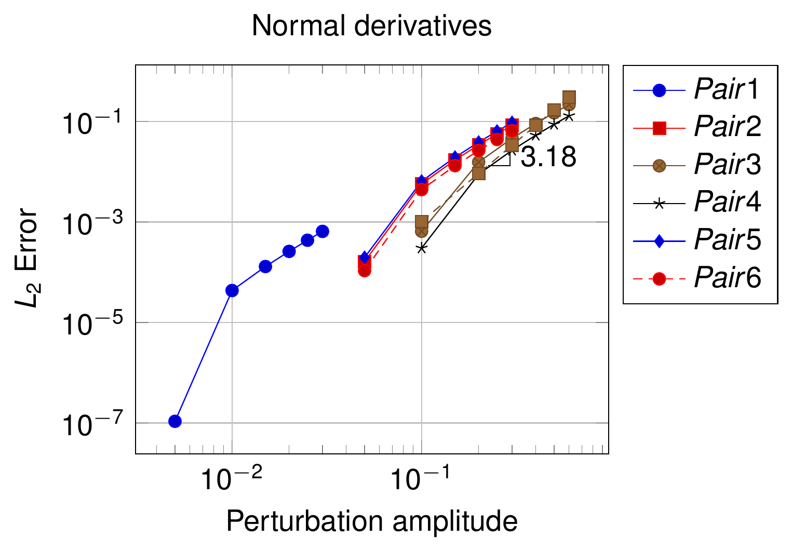</p>
<p align="center"><em>Figure: Convergence plot of the normal derivatives for the 3D triangle pairs; the measured rate (3.18) is higher than quadratic (thesis Fig. 4.111).</em></p>

The quadrilateral plot is thesis Fig. 4.112 (slope 2), not reproduced.

## From the derivatives to the tangent matrix

The complete flow inside `MortarContactCondition::CalculateConditionSystem` (`mortar_contact_condition.cpp:290-434`) is:

```text
derivative_data.Initialize(slave_geometry, process_info)          # X1, u1, u1old, NormalSlave, PenaltyParameter, ScaleFactor, ...
if TNormalVariation: CalculateDeltaNormalSlave(DeltaNormalSlave)  # nodal normal derivatives of the slave
segmentation = ExactMortarIntegrationUtility::GetExactIntegration(...)
derivative_data.UpdateMasterPair(master_geometry, process_info)   # X2, u2, u2old
if TNormalVariation: CalculateDeltaNormalMaster(DeltaNormalMaster)
dual_LM = CalculateAeAndDeltaAe(...)                              # Ae, DeltaAe over all cells (needs ΔJ, ΔN1 [, Δx_clip])
for each integration cell (line in 2D, triangle in 3D):
    for each Gauss point:
        derivative_data.ResetDerivatives()
        CalculateKinematics(...)                                  # N1, N2, Phi = Ae N1, jSlave, DetjSlave, DNDe
        if ComputeLHS:
            if 3D: CalculateDeltaCellVertex(...)                  # Δx_clip  (eqs. 4.106, 4.108)
            CalculateDeltaDetjSlave(...)                          # ΔJ       (eqs. 4.94b, 4.109b)
            CalculateDeltaN(...)                                  # ΔN1, ΔN2, ΔΦ (eqs. 4.95-4.98, 4.110-4.113, 4.99b)
            mortar_operators.CalculateDeltaMortarOperators(...)   # D, M, ΔD, ΔM (eq. 4.92)
        else:
            mortar_operators.CalculateMortarOperators(...)        # D, M only
active_inactive = GetActiveInactiveValue(slave_geometry)
CalculateLocalLHS(rLHS, mortar_operators, derivative_data, active_inactive, process_info)   # generated code
CalculateLocalRHS(rRHS, mortar_operators, derivative_data, active_inactive, process_info)   # generated code
```

`MortarOperatorWithDerivatives::CalculateDeltaMortarOperators` (`mortar_classes.h`, Doxygen "Popp thesis page 102 equation 4.32 and 4.33 / 4.37 and 4.38") is the literal implementation of eq. 4.92: for every pair $$(i, j)$$ and every DoF $$k$$ it accumulates `DeltaDOperator[k](i,j) += w (ΔJ_k φ_i N1_j + J Δφ_{k,i} N1_j + J φ_i ΔN1_{k,j})` and the analogous `DeltaMOperator[k](i,j)` with `N2`; in 2D only the slave DoFs contribute, in 3D the master DoFs are added as well (`if constexpr (TDim == 3)`). The arrays have `DoFSizePairedGeometry` entries in both cases (the master entries are simply zero in 2D). The generated `CalculateLocalLHS` of every condition then combines `DOperator`, `MOperator`, `DeltaDOperator[k]`, `DeltaMOperator[k]`, `NormalSlave` and (for `NV` conditions) `DeltaNormalSlave[k]` into the consistent tangent; see [Automatic differentiation](Automatic_Differentiation.html) for how those expressions are produced. The container `DerivativeData` (`mortar_classes.h:577`) is the single carrier of all the derivative arrays: `DeltaDetjSlave`, `DeltaPhi`, `DeltaN1`, `DeltaN2`, `DeltaNormalSlave`, `DeltaNormalMaster`, `DeltaCellVertex`, `Ae`, `DeltaAe`, plus the kinematic data `X1`, `X2`, `u1`, `u2`, `NormalSlave`, `PenaltyParameter` (from the nodal `INITIAL_PENALTY`), `ScaleFactor` (from `SCALE_FACTOR`); the frictional variant `DerivativeDataFrictional` adds `u1old`, `u2old` and `TangentFactor`, which are needed for the slip derivative of eq. 4.93d together with the previous-step operators `mPreviousMortarOperators` stored by the frictional conditions.

Note: `DerivativesUtilities` is templated as `DerivativesUtilities<TDim, TNumNodes, TFrictional, TNormalVariation, TNumNodesMaster>` (the `TNormalVariation` parameter is carried for symmetry with the conditions, but the run-time behaviour is governed by the `ConsiderNormalVariation` argument of type `NormalDerivativesComputation`), and its explicit instantiations cover the same five geometry pairs as the conditions (`2D2N`, `3D3N`, `3D4N`, `3D3N4N`, `3D4N3N`). Also note that the *non-matching* pairs (`TNumNodes ≠ TNumNodesMaster`) use `PointBelongsTriangle3D3NQuadrilateral3D4N` / `PointBelongsQuadrilateral3D4NTriangle3D3N` as `BelongType`, so that `ConvertAuxHashIndex` decodes edge indices of different ranges on each side.

## Numerical validation: the 49 C++ derivative tests

The convergence studies of Figs. 4.93–4.112 are reproduced, in executable form, by `tests/cpp_tests/utilities/test_derivatives_utilities.cpp` (49 `KRATOS_TEST_CASE_IN_SUITE` cases in `KratosContactStructuralMechanicsFastSuite`; run with `python3 kratos/python_scripts/testing/run_cpp_tests.py` from the build, see [Test suite reference](../Validation/Test_Suite_Reference.html)). The thesis states that "the code for the tests for the quadratic convergence shown on the following sections are accessible in the public repository of Kratos, implemented on Kratos C++ unittest format" — this is that file.

The driver `TestDerivatives<TDim, TNumNodes>(...)` works as follows:

1. `GeneratePairs<TDim, TNumNodes>(model_part, pair_index)` creates the slave/master pair of Tables 4.20, 4.22 or 4.24 twice: nodes 1…2n define the *reference* configuration (conditions `SlaveCondition0`, `MasterCondition0`) and nodes 2n+1…4n a copy that will be moved (`SlaveCondition1`, `MasterCondition1`).
2. For `NumberIterations` steps (6 in most tests, 1 in `JacobianDerivativesLine1`, `JacobianDerivativesTriangle1` and `NormalDerivativesTriangle2`), the selected nodes (`nodes_perturbed`) receive a displacement `(iter + 1)·coeff_perturbation` in the direction `IndexPerturbation` (0 = x, 1 = y, 2 = z), and the mesh is moved. If normal variation is on, the nodal and condition normals of the moved pair are recomputed (previous values kept in the history buffer, as required by `CalculateDeltaNormalSlave`).
3. Both configurations are segmented with `ExactMortarIntegrationUtility<TDim, TNumNodes, true>::GetExactIntegration`; when the number of cells coincides, `CalculateAeAndDeltaAe` is evaluated in both, and for every Gauss point of every cell the kinematics and the derivatives (`CalculateDeltaCellVertex` in 3D, `CalculateDeltaDetjSlave`, `CalculateDeltaN`) are computed in the *reference* configuration.
4. Depending on `DerivateToCheck` — `CHECK_SHAPE_FUNCTION`, `CHECK_JACOBIAN`, `CHECK_PHI` (dual shape functions through `Ae`, `DeltaAe`, `DeltaN1`) or `CHECK_NORMAL` (through `DeltaNormalSlave`) — the linear prediction "reference value + Σ derivative × Δu" is compared with the value in the moved configuration, and the $$L_2$$ norm of the difference is accumulated in `error_vector_slave` / `error_vector_master`.
5. With `CheckLevel::LEVEL_QUADRATIC_CONVERGENCE` the slope between consecutive perturbation levels, `log(e_{k+1}/e_k) / log((k+2)/(k+1))`, must be at least `quadratic_threshold = 1.8` (unless the error is already below `tolerance = 1e-6`); with `CheckLevel::LEVEL_EXACT` the error itself must be below the tolerance (used for the flat configurations that the thesis plots at 1e−16). `LEVEL_DEBUG` / `LEVEL_FULL_DEBUG` print the intermediate quantities.

| Test group (count) | Geometry, pairs | `CONSIDER_NORMAL_VARIATION` | Perturbed node / amplitude | Check | Thesis figure |
|---|---|---|---|---|---|
| `JacobianDerivativesLine1..3` (3) | `Line2D2`, pairs 1–3 | `NO_DERIVATIVES_COMPUTATION` | node 1, y; −5.0e−1 (pair 1, 1 iteration), −5.0e−2, 1.0e−1 | `CHECK_JACOBIAN`, quadratic | Fig. 4.93 |
| `ShapeFunctionDerivativesLine1..4` (4) | `Line2D2`, pairs 1–4 | `NO_DERIVATIVES_COMPUTATION` | node 1 (pair 2: node 4), y; 5.0e−2 | `CHECK_SHAPE_FUNCTION`, quadratic | Fig. 4.96 |
| `DualShapeFunctionDerivativesLine1..3` (3) | `Line2D2`, pairs 1–3 | `NO_DERIVATIVES_COMPUTATION` | node 1, y; −5.0e−2, −5.0e−2, 1.0e−1 | `CHECK_PHI`, quadratic | Fig. 4.97 |
| `NormalDerivativesLine1..3` (3) | `Line2D2`, pairs 1–3 | `NODAL_ELEMENTAL_DERIVATIVES` | node 1, y; 1.0e−1 | `CHECK_NORMAL`, quadratic | Fig. 4.99 |
| `JacobianDerivativesTriangle1..6` (6) | `Triangle3D3`, pairs 1–6 | `NO_DERIVATIVES_COMPUTATION` | Table 4.23 (node 4 / nodes 4+5 / node 1; directions y, x, z) | `CHECK_JACOBIAN`; pair 1 exact, others quadratic | Fig. 4.102 |
| `ShapeFunctionDerivativesTriangle1..6` (6) | `Triangle3D3`, pairs 1–6 | pairs 1–3 `NO_DERIVATIVES_COMPUTATION`, pairs 4–6 `ELEMENTAL_DERIVATIVES` | node 4 (−5.0e−2, −5.0e−3), nodes 4+5 (1.0e−1 / 5.0e−2), node 1 (5.0e−2) | `CHECK_SHAPE_FUNCTION`; pairs 1 and 6 exact, others quadratic | Fig. 4.106 |
| `DualShapeFunctionDerivativesTriangle1..6` (6) | `Triangle3D3`, pairs 1–6 | `NO_DERIVATIVES_COMPUTATION` | as above | `CHECK_PHI`; pair 1 exact, others quadratic | Fig. 4.108 |
| `NormalDerivativesTriangle1..6` (6) | `Triangle3D3`, pairs 1–6 | `NODAL_ELEMENTAL_DERIVATIVES` | node 4 (5.0e−3), node 3 (−5.0e−2, 1 iteration), nodes 4+5, node 1, node 4 (−5.0e−2); direction z | `CHECK_NORMAL`, quadratic | Fig. 4.111 |
| `JacobianDerivativesQuadrilateral1..3` (3) | `Quadrilateral3D4`, pairs 1–3 | `NO_DERIVATIVES_COMPUTATION` | node 5, y; −5.0e−3 | `CHECK_JACOBIAN`, quadratic | Fig. 4.103 |
| `ShapeFunctionDerivativesQuadrilateral1..3` (3) | `Quadrilateral3D4`, pairs 1–3 | `NO_DERIVATIVES_COMPUTATION` | node 5, y; −5.0e−3 | `CHECK_SHAPE_FUNCTION`, quadratic | Fig. 4.107 |
| `DualShapeFunctionDerivativesQuadrilateral1..3` (3) | `Quadrilateral3D4`, pairs 1–3 | `NO_DERIVATIVES_COMPUTATION` | node 5, y; −5.0e−3 | `CHECK_PHI`, quadratic | Fig. 4.109 |
| `NormalDerivativesQuadrilateral1..3` (3) | `Quadrilateral3D4`, pairs 1–3 | `NODAL_ELEMENTAL_DERIVATIVES` | node 5, z; −5.0e−2, −5.0e−3, −5.0e−3 | `CHECK_NORMAL`, quadratic | Fig. 4.112 |

Note: two of the 49 cases, `ShapeFunctionDerivativesLine4` (pair 4, an inclined line pair not present in the thesis tables) and `ShapeFunctionDerivativesTriangle5` (pair 5 with `ELEMENTAL_DERIVATIVES`), build their model part but have the `GenerateTest` call commented out with a `// FIXME: Not working properly` remark, so they currently pass without checking anything. The remaining 47 cases are the executable counterpart of the thesis convergence plots; the thesis curves (Figs. 4.93, 4.96, 4.97, 4.99, 4.102, 4.103, 4.106–4.109, 4.111, 4.112) were produced with the same driver in `LEVEL_DEBUG` mode and post-processed.

## Summary of code entry points

| Quantity | Thesis equations | Code |
|---|---|---|
| $$\Delta J$$ (2D segment / 3D cell) | 4.94b / 4.109b | `DerivativesUtilities::CalculateDeltaDetjSlave` → `DerivativeData::DeltaDetjSlave` |
| $$\Delta\mathbf{x}_{clip}$$ (3D cell vertices) | 4.105–4.108 | `DerivativesUtilities::CalculateDeltaCellVertex`, `LocalDeltaVertex`, `ConvertAuxHashIndex` → `DerivativeData::DeltaCellVertex` |
| $$\Delta\xi$$ of segment ends (2D) | 4.96–4.97 | `DerivativesUtilities::LocalDeltaSegmentN1`, `LocalDeltaSegmentN2` |
| $$\Delta\xi_g$$, $$\Delta\eta_g$$ of Gauss points | 4.98 / 4.112–4.113 | inside `CalculateDeltaN`; `DeltaPointLocalCoordinatesSlave`, `DeltaPointLocalCoordinatesMaster` (3D) |
| $$\Delta N^1$$, $$\Delta N^2$$ | 4.95b / 4.110b, 4.111b | `DerivativesUtilities::CalculateDeltaN` (both sides), `CalculateDeltaN1` (slave only, used while integrating $$\mathbf{A}_e$$) → `DerivativeData::DeltaN1`, `DeltaN2` |
| $$\Delta\mathbf{A}_e$$, $$\Delta\boldsymbol{\Phi}$$ | 4.99b, 4.100 | `DerivativesUtilities::CalculateAeAndDeltaAe`, `DualLagrangeMultiplierOperatorsWithDerivatives::CalculateDeltaAeComponents`, `CalculateDeltaAe` → `DerivativeData::Ae`, `DeltaAe`, `DeltaPhi` |
| $$\Delta\mathbf{n}$$ of a geometry at a point | 4.102, 4.115 | `DerivativesUtilities::GPDeltaNormalSlave`, `GPDeltaNormalMaster`, `DeltaNormalCenter`, `ComputeRenormalizerMatrix`, `PreviousNormalGeometry` |
| $$\Delta\bar{\mathbf{n}}$$ of the nodal (averaged) normals | 4.101c, 4.103 | `DerivativesUtilities::CalculateDeltaNormalSlave`, `CalculateDeltaNormalMaster` → `DerivativeData::DeltaNormalSlave`, `DeltaNormalMaster` (`NV` conditions only) |
| Nodal normal averaging (Taylor–Papadopoulos) | 4.101c | `NormalCalculationUtils::CalculateUnitNormals` via `BaseMortarConvergenceCriteria::ComputeNodesMeanNormalModelPartWithPairedNormal`; `PairedCondition::mPairedNormal` for the master normal |
| $$\Delta\mathbf{D}$$, $$\Delta\mathbf{M}$$ | 4.92 | `MortarOperatorWithDerivatives::CalculateDeltaMortarOperators` → `DeltaDOperator[k]`, `DeltaMOperator[k]` |
| $$\Delta\tilde{g}_n$$, $$\Delta\tilde{u}_\tau$$ and the tangent matrix | 4.93 | generated `CalculateLocalLHS` of each condition (see [Automatic differentiation](Automatic_Differentiation.html)) |
| Increments of position | – | `DerivativesUtilities::CalculateDeltaPosition` (four overloads: matrix of the geometry, matrix at the segment local coordinates, vector/double for one node and DoF of the slave or master) |

*Thesis figures © Vicente Mataix Ferrándiz, PhD thesis "Innovative mathematical and numerical models for studying the deformation of shells during industrial forming processes with the Finite Element Method", UPC 2020, reproduced by the author. Figures marked "inspired by" are the author's redrawings of the cited sources.*
