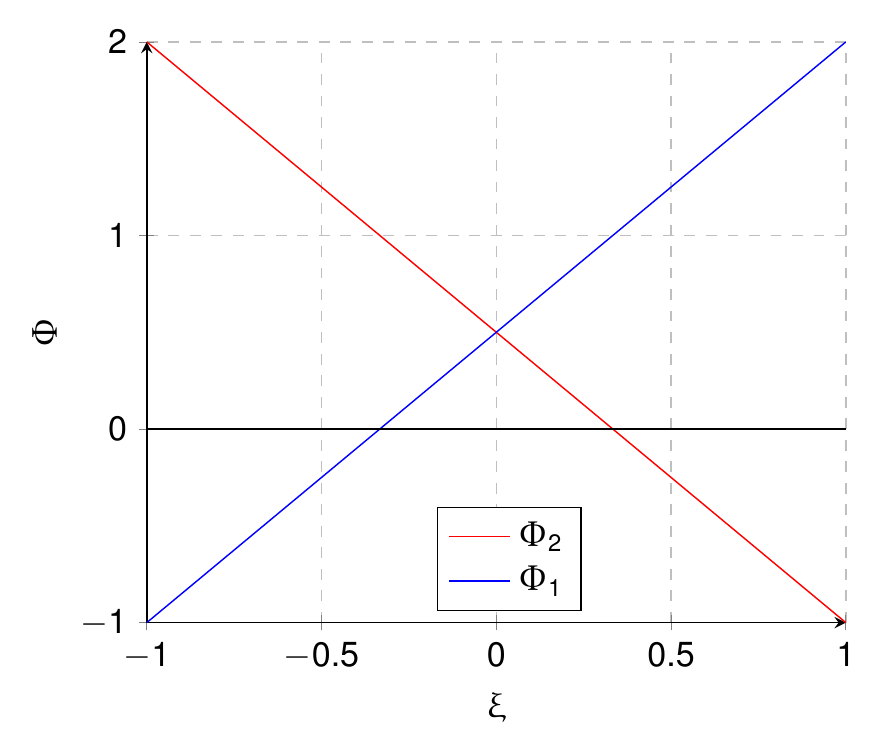
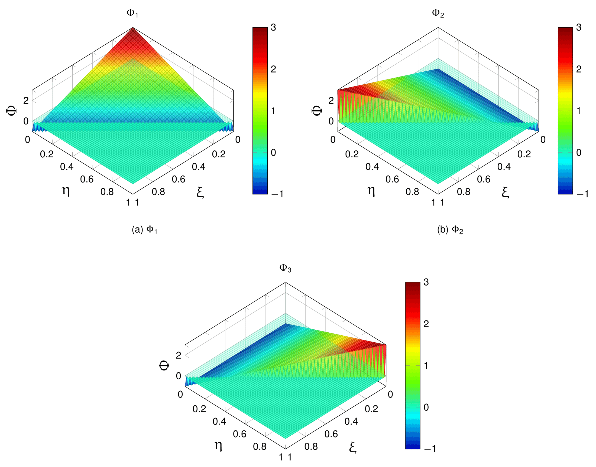
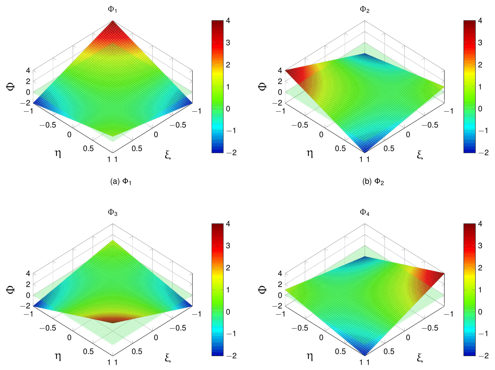
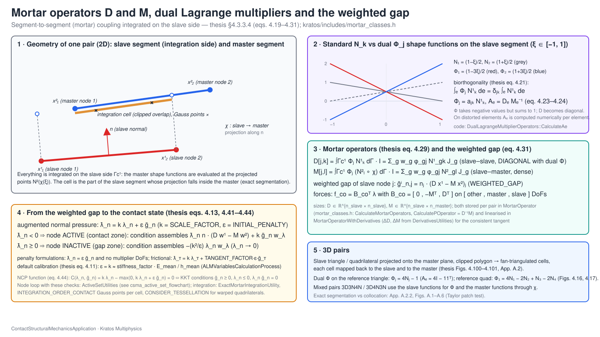
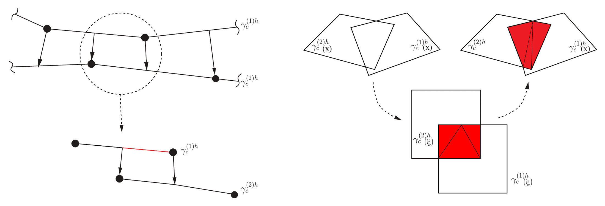
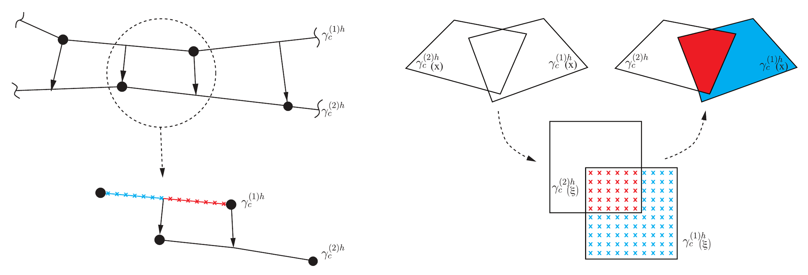
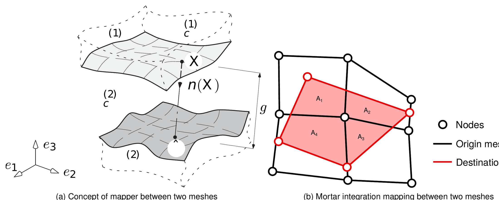
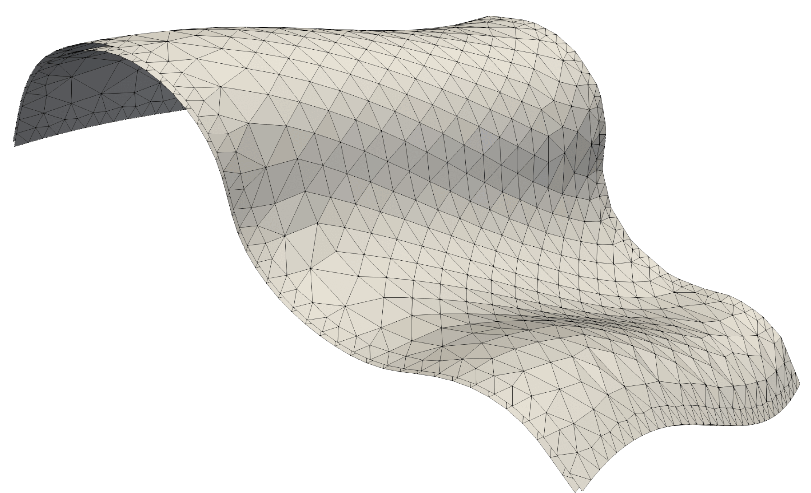
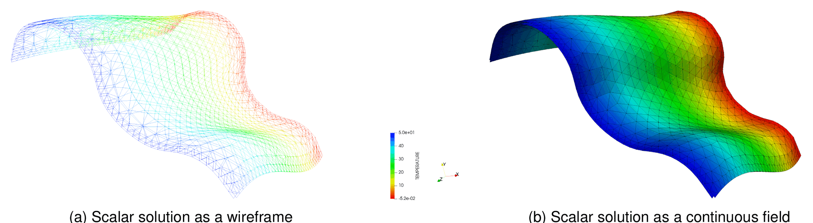
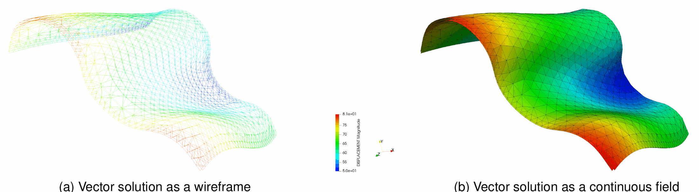

> **Sources.** Thesis §4.3.3.4.1 *Dual Lagrange multipliers* and §4.3.3.4.2 *Mortar operators* (pp. 103–108), App. A.2 *Mortar segmentation* (pp. 285–289), App. E *Mortar mapper* (pp. 339–346), §4.6.1.2.2 *Integration segments* (p. 164) and §4.6.2.1.1.1 *Integration segments derivatives* (pp. 170–171). Typeset derivation shipped with the application: `automatic_differentiation/ALM_frictionless_mortar_condition/alm_frictionless_mortar_contact_condition.tex` (sections *Dual Lagrange multipliers* and *Mortar operators*) and `automatic_differentiation/mesh_tying_mortar_condition/mesh_tying_mortar_condition.tex`. Code (Kratos core): `kratos/includes/mortar_classes.h`, `kratos/utilities/exact_mortar_segmentation_utility.{h,cpp}`, `kratos/utilities/mortar_utilities.h`, `kratos/processes/simple_mortar_mapper_process.{h,cpp}`, `kratos/processes/simple_mortar_mapper_wrapper_process.h`. Code (application): `custom_conditions/paired_condition.h`, `custom_conditions/mortar_contact_condition.cpp`, `custom_utilities/mortar_explicit_contribution_utilities.{h,cpp}`, `custom_utilities/derivatives_utilities.h`, `custom_processes/normal_gap_process.cpp`, `custom_strategies/custom_convergencecriterias/mpc_contact_criteria.h`, `python_scripts/search_base_process.py`.

This page is the discretization backbone shared by every formulation of the application: the [frictionless](Frictionless_Contact.html) and [frictional](Frictional_Contact.html) contact conditions, the [mesh tying](Mesh_Tying.html) condition and the MPC constraint all reduce, at the interface, to the two *mortar operators* $$\mathbf{D}$$ and $$\mathbf{M}$$ integrated on the slave surface with *dual* Lagrange multiplier shape functions. The page covers (i) the segment-to-segment concept and the slave/master roles, (ii) the construction of the dual shape functions, (iii) the operators $$\mathbf{D}$$, $$\mathbf{M}$$ and the weighted gap, (iv) how the integrals are evaluated exactly by segmentation in 2D and by projection/clipping in 3D, and (v) the mortar *mapper*, a by-product of the same machinery that the application reuses to compute consistent gaps and to transfer reactions. The consistent linearization of all these quantities is treated separately in [Linearisation and derivatives](Linearisation_And_Derivatives.html).

## Notation

| Symbol | Meaning | Code counterpart |
|---|---|---|
| $$\Gamma_c^{(1)}, \Gamma_c^{(2)}$$ ($$\Gamma_{c,h}$$) | Slave and master (potential) contact surfaces; discrete slave interface | `SLAVE` / `MASTER` flags, `PairedCondition::GetParentGeometry()` / `GetPairedGeometry()` |
| $$N_k^{(1)}, N_l^{(2)}$$ | Standard displacement shape functions of slave and master | `MortarKinematicVariables::NSlave`, `NMaster` |
| $$\Phi_j$$ | Dual Lagrange multiplier shape functions on the slave | `MortarKinematicVariables::PhiLagrangeMultipliers` |
| $$\chi_h$$ | Discrete interface mapping (projection slave → master) | `MortarExplicitContributionUtilities::MasterShapeFunctionValue` |
| $$\mathbf{A}_e, \mathbf{D}_e, \mathbf{M}_e$$ | Element-wise dual coefficient matrix and its two factors | `DualLagrangeMultiplierOperators::{CalculateAe, CalculateAeComponents, ComputeDe}`, `De`, `Me` |
| $$\mathbf{D}, \mathbf{M}$$ | Mortar operators (slave–slave, slave–master) | `MortarOperator::DOperator`, `MOperator` |
| $$\mathbf{P} = \mathbf{D}^{-1}\mathbf{M}$$ | Mortar projection operator | `MortarOperator::ComputePOperator()` |
| $$\tilde{g}_n$$ | Nodal weighted gap | `WEIGHTED_GAP` |
| $$J_g, w_g, n_{gp}$$ | Slave cell Jacobian, Gauss weight and number of Gauss points | `MortarKinematicVariables::DetjSlave`, `IntegrationPoint::Weight()`, `INTEGRATION_ORDER_CONTACT` |
| $$\mathbf{x}_{clip}, \hat{\mathbf{x}}$$ | Clipping vertex and points projected on the auxiliary plane | `ExactMortarIntegrationUtility`, `PointBelong` |

## The segment-to-segment (mortar) concept

In a **segment-to-segment (STS)** or mortar discretization the contact constraints are not enforced at nodes or at isolated collocation points but *weakly*, by integrating the constraint residual against a set of Lagrange multiplier shape functions over the whole discrete interface. The two surfaces are non-matching in general — different element types, different refinement, sliding — so one of them, the **slave** side $$\Gamma_c^{(1)}$$, is chosen as the *reference domain*: it carries the multiplier DoFs and every interface integral is evaluated on it. The other, the **master** side $$\Gamma_c^{(2)}$$, only enters through the values of its shape functions at the points of the slave surface that are *projected* onto it. That projection is the discrete interface mapping $$\chi_h : \Gamma_{c,h}^{(1)} \to \Gamma_{c,h}^{(2)}$$ (in the code, a projection along the slave normal, see [below](#the-interface-mapping-chi-projection-of-slave-points-onto-the-master)). The classification of contact discretizations (NTN, NTS, STS) and the reasons why the mortar method passes the patch test and is variationally consistent are discussed on the [state of the art page](Contact_Problem_And_State_Of_The_Art.html).

<p align="center"></p>
<p align="center"><em>Figure: Segment-to-segment (mortar) contact discretization (thesis Fig. 4.9).</em></p>

Two consequences of the choice "integrate on the slave side" shape the whole implementation:

1. Each *pair* (one slave condition, one master condition) is an independent unit of work. The application stores the pairs as a `PairedCondition` whose `CouplingGeometry` holds both geometries; the search process creates one paired condition for each admissible slave–master couple (see [Search pipeline](../Contact_Search/Search_Pipeline_And_Bounding_Volumes.html)). Its local contributions are assembled into the slave nodes (multipliers and displacements) and the master nodes (displacements).
2. The integrals $$\int_{\Gamma_{c,h}^{(1)}} \Phi_j\, (N_l^{(2)} \circ \chi_h)\, \text{d}\Gamma$$ contain a product of functions that are piecewise polynomial on *different* meshes: the integrand is only smooth on the intersection of one slave element with one master element. Exact Gauss quadrature therefore requires **segmentation** of the slave element into sub-cells (segments in 2D, triangles in 3D) aligned with the projected master element — the topic of [Exact segmentation versus collocation](#exact-segmentation-versus-collocation-thesis-a22).

### Slave and master roles and the naming inversion in `PairedCondition`

All mortar conditions of the application derive from `PairedCondition` (`custom_conditions/paired_condition.h`), whose geometry is a `CouplingGeometry` with two slots. The convention of the thesis and of Popp is that body (1) is the **slave** (owner of the multipliers and reference domain of the integrals) and body (2) the **master**. The accessors are:

| Accessor | Returns | Kratos `CouplingGeometry` slot |
|---|---|---|
| `GetParentGeometry()` / `pGetParentGeometry()` | the **slave** geometry (in Popp's sense) | `CouplingGeometryType::Master` |
| `GetPairedGeometry()` / `pGetPairedGeometry()` | the **master** geometry (in Popp's sense) | `CouplingGeometryType::Slave` |
| `GetPairedNormal()` / `SetPairedNormal()` | the master normal $$\mathbf{n}^{(2)}$$ stored in the pair | `mPairedNormal` |

The Doxygen comments of the accessors state it explicitly: *"slave in the definition of Popp which is the opposite of the standard"*. In other words, the *parent* geometry of a paired condition is the mortar slave, and it lives in the slot that `CouplingGeometry` calls "master". Throughout the application the code consistently uses `GetParentGeometry()` for slave quantities (`r_slave_geometry`, `NormalSlave`, `u1`, `X1`) and `GetPairedGeometry()` for master quantities (`u2`, `X2`, `NormalMaster`). When reading the generated conditions or the utilities, "parent = slave (1)" and "paired = master (2)" is the rule; the `SLAVE`/`MASTER` nodal flags follow the same (Popp) convention.

## Dual Lagrange multipliers (thesis §4.3.3.4.1)

### Definition and biorthogonality (thesis eqs. 4.19–4.24)

The displacements are discretized with the standard finite element shape functions. The Lagrange multiplier field needs its own discrete space $$\mathcal{M}_h \approx \mathcal{M}$$, spanned by shape functions $$\Phi_j$$ defined on the slave surface, with nodal values $$\boldsymbol{\lambda}_j$$ (thesis eq. 4.19):

<p align="center">$$\boldsymbol{\lambda}_h = \sum_{j=1}^{m^{(1)}} \Phi_j\left(\xi^{(1)}, \eta^{(1)}\right) \boldsymbol{\lambda}_j$$</p>

The simplest choice, $$\Phi_j = N_j^{(1)}$$ (**standard** multipliers), leads to a *fully coupled* interface: the slave block $$\mathbf{D}$$ of the constraint operator is a mass-like matrix and the multipliers cannot be eliminated locally. Wohlmuth introduced **dual** shape functions defined by the **biorthogonality** relation with the displacement shape functions (thesis eq. 4.20):

<p align="center">$$\int_{\Gamma_{c,h}^{(1)}} \Phi_j N_k^{(1)}\, \text{d}\Gamma_{co}^{(1)} = \delta_{jk} \int_{\Gamma_{c,h}^{(1)}} N_k^{(1)}\, \text{d}\Gamma_{co}^{(1)} \;, \qquad j, k = 1, \ldots, m^{(1)}$$</p>

where $$\delta_{jk}$$ is the Kronecker delta and the most common choice $$m^{(1)} = n^{(1)}$$ (one multiplier node per slave displacement node) is assumed. For practical reasons the condition is imposed locally on each slave element $$e$$ (thesis eq. 4.21), $$m_e^{(1)}$$ being the number of multiplier nodes of the element:

<p align="center">$$\int_e \Phi_j N_k^{(1)}\, \text{d}e = \delta_{jk} \int_e N_k^{(1)}\, \text{d}e \;, \qquad j, k = 1, \ldots, m_e^{(1)}$$</p>

Combining it with the partition of unity of the dual functions gives the integral identity (thesis eq. 4.22)

<p align="center">$$\int_e \Phi_j\, \text{d}e = \int_e N_j^{(1)}\, \text{d}e \;, \qquad j = 1, \ldots, m_e^{(1)}$$</p>

It is important that the element-wise biorthogonality must hold in the **physical** space (with the Jacobian), not merely in the parameter space; consequently a small $$m_e^{(1)} \times m_e^{(1)}$$ system is solved on each slave element. The dual functions are sought as linear combinations of the standard ones with unknown coefficients $$a_{jk}$$ (thesis eq. 4.23):

<p align="center">$$\Phi_j(\xi, \eta) = a_{jk} N_k^{(1)}(\xi, \eta) \;, \qquad \mathbf{A}_e = [a_{jk}] \in \mathbb{R}^{m_e^{(1)} \times m_e^{(1)}}$$</p>

and inserting this ansatz into the element-wise biorthogonality yields the coefficient matrix (thesis eq. 4.24; `.tex` eq. 19), where $$J(\xi, \eta)$$ is the slave Jacobian determinant:

<p align="center">$$\begin{aligned}
& \mathbf{A}_e = \mathbf{D}_e \mathbf{M}_e^{-1} \\
& \mathbf{D}_e = [d_{jk}] \in \mathbb{R}^{m_e^{(1)} \times m_e^{(1)}}, \quad d_{jk} = \delta_{jk} \int_e N_k^{(1)}(\xi, \eta)\, J(\xi, \eta)\, \text{d}e \\
& \mathbf{M}_e = [m_{jk}] \in \mathbb{R}^{m_e^{(1)} \times m_e^{(1)}}, \quad m_{jk} = \int_e N_j^{(1)}(\xi, \eta)\, N_k^{(1)}(\xi, \eta)\, J(\xi, \eta)\, \text{d}e
\end{aligned}$$</p>

$$\mathbf{D}_e$$ is diagonal (the lumped mass of the slave element) and $$\mathbf{M}_e$$ is the consistent element mass matrix (unit density). Because $$\mathbf{A}_e$$ depends on $$J$$, the dual functions are **deformation dependent** and must be linearized (thesis §4.3.3.4.1.3 and eq. 4.100; `.tex` eq. 19b):

<p align="center">$$\begin{aligned}
& \Delta \mathbf{A}_e = \Delta \mathbf{D}_e \mathbf{M}_e^{-1} - \mathbf{D}_e \Delta \mathbf{M}_e \mathbf{M}_e^{-1} \\
& \Delta \mathbf{D}_e = \Delta[d_{jk}], \quad \Delta d_{jk} = \delta_{jk} \sum_{g=1}^{n_{gp}} w_g N_{gk}^{(1)} \Delta J_g^{(1)} \\
& \Delta \mathbf{M}_e = \Delta[m_{jk}], \quad \Delta m_{jk} = \sum_{g=1}^{n_{gp}} w_g N_{gj}^{(1)} N_{gk}^{(1)} \Delta J_g^{(1)}
\end{aligned}$$</p>

(the `.tex` file prints a duplicated $$\sum_g w_g$$ in $$\Delta m_{jk}$$, a typographical slip; the thesis eq. 4.100 and the code use the single sum written here). The derivative $$\Delta J_g^{(1)}$$ and the resulting $$\Delta \Phi = \mathbf{A}_e \Delta N^{(1)} + \Delta \mathbf{A}_e N^{(1)}$$ (thesis eq. 4.99b) are developed on the [linearization page](Linearisation_And_Derivatives.html).

### Explicit expressions and graphical representation (thesis eqs. 4.25–4.27, Figs. 4.15–4.17)

For an *undistorted* element (constant Jacobian) the systems above can be solved in closed form. For the linear line with $$\xi \in [-1, 1]$$ (thesis eq. 4.25):

<p align="center">$$\begin{bmatrix} \Phi_1 \\ \Phi_2 \end{bmatrix} = \begin{bmatrix} \tfrac{1}{2}(1 - 3\xi) \\ \tfrac{1}{2}(1 + 3\xi) \end{bmatrix}$$</p>

for the linear triangle with area coordinates $$(\xi, \eta)$$ (thesis eq. 4.26):

<p align="center">$$\begin{bmatrix} \Phi_1 \\ \Phi_2 \\ \Phi_3 \end{bmatrix} = \begin{bmatrix} 3 - 4\xi - 4\eta \\ 4\xi - 1 \\ 4\eta - 1 \end{bmatrix}$$</p>

and for the bilinear quadrilateral with $$(\xi, \eta) \in [-1, 1]^2$$ (thesis eq. 4.27):

<p align="center">$$\begin{bmatrix} \Phi_1 \\ \Phi_2 \\ \Phi_3 \\ \Phi_4 \end{bmatrix} = \begin{bmatrix} \tfrac{1}{4}(1 - 3\xi)(1 - 3\eta) \\ \tfrac{1}{4}(1 + 3\xi)(1 - 3\eta) \\ \tfrac{1}{4}(1 + 3\xi)(1 + 3\eta) \\ \tfrac{1}{4}(1 - 3\xi)(1 + 3\eta) \end{bmatrix}$$</p>

(The thesis typesets eqs. 4.25–4.27 with the standard-looking factors; the expressions above are the biorthogonal duals of $$N_k$$ for constant $$J$$ and are what Figs. 4.15–4.17 plot — note the values $$2$$ and $$-1$$ at the nodes of the line, $$3$$ and $$-1$$ for the triangle, and the range $$[-2, 4]$$ for the quadrilateral.) The dual functions are discontinuous across element boundaries, take negative values, and still form a partition of unity ($$\sum_j \Phi_j = 1$$). For a *distorted* element the code never uses these closed forms: it always integrates $$\mathbf{D}_e$$ and $$\mathbf{M}_e$$ numerically and inverts, which is exactly what makes the method exact in the physical space.

<p align="center"></p>
<p align="center"><em>Figure: Dual shape functions for the 2D linear line (thesis Fig. 4.15).</em></p>

<p align="center"></p>
<p align="center"><em>Figure: Dual shape functions for the 3D linear triangle (thesis Fig. 4.16).</em></p>

<p align="center"></p>
<p align="center"><em>Figure: Dual shape functions for the 3D bilinear quadrilateral (thesis Fig. 4.17).</em></p>

### Implementation: `DualLagrangeMultiplierOperators`

The class `DualLagrangeMultiplierOperators<TNumNodes, TNumNodesMaster>` in `kratos/includes/mortar_classes.h` accumulates $$\mathbf{D}_e$$ and $$\mathbf{M}_e$$ at each Gauss point and builds $$\mathbf{A}_e$$:

- `CalculateAeComponents(rKinematicVariables, rIntegrationWeight)` adds `rIntegrationWeight * ComputeDe(N1, detJ)` to `De` and `rIntegrationWeight * detJ * outer_prod(N1, N1)` to `Me` (`ComputeDe` returns the diagonal matrix $$\text{diag}(J N_i)$$ — the code comment references Popp's thesis p. 70, eq. 3.65).
- `CalculateAe(Ae)` normalizes `Me` by its Frobenius norm before inverting it (`MathUtils::InvertMatrix`) and checks the condition number (`MathUtils::CheckConditionNumber`); if the element is degenerate (norm below machine epsilon or ill conditioned) it returns `false` and sets `Ae = I`, i.e. the pair falls back to **standard** multipliers. The returned boolean is the `dual_LM` flag that the conditions pass to `CalculateKinematics`.
- The application wraps this in `DerivativesUtilities::CalculateAeAndDeltaAe` (`custom_utilities/derivatives_utilities.h`), which performs a first pass over the integration cells of the pair to integrate $$\mathbf{D}_e$$, $$\mathbf{M}_e$$ (and their derivatives when the LHS is needed, through `DualLagrangeMultiplierOperatorsWithDerivatives::CalculateDeltaAe`), stores $$\mathbf{A}_e$$ in `DerivativeData::Ae` and $$\Delta \mathbf{A}_e$$ in `DerivativeData::DeltaAe`, and returns `dual_LM`. The mesh tying condition uses the simpler `MeshTyingMortarCondition::CalculateAe`. Note that $$\mathbf{D}_e$$, $$\mathbf{M}_e$$ are integrated over the *intersection cells* of the pair (not the whole slave element), which is consistent because the biorthogonality is only required over the part of the element that is actually integrated.

Finally, at every Gauss point `MortarExplicitContributionUtilities::CalculateKinematics` evaluates `PhiLagrangeMultipliers = dual_LM ? prod(Ae, NSlave) : NSlave`, which is eq. 4.23 in code form.

## Mortar operators D and M and the weighted gap (thesis §4.3.3.4.2)

Introducing the discrete multiplier (eq. 4.19) into the contact virtual work $$-\delta\mathcal{L}_{co}$$ of the [frictionless weak form](Frictionless_Contact.html#weak-formulation-with-a-scalar-lagrange-multiplier-thesis-43321) gives (thesis eq. 4.28), where $$\chi_h$$ is the interface mapping:

<p align="center">$$-\delta\mathcal{L}_{co,h} = \sum_{j=1}^{m^{(1)}} \sum_{k=1}^{n^{(1)}} \boldsymbol{\lambda}_{nj}^T \left( \int_{\Gamma_{c,h}^{(1)}} \Phi_j N_k^{(1)}\, \text{d}\Gamma_{co}^{(1)} \right) \delta\mathbf{d}_{nk}^{(1)} - \sum_{j=1}^{m^{(1)}} \sum_{l=1}^{n^{(2)}} \boldsymbol{\lambda}_{nj}^T \left( \int_{\Gamma_{c,h}^{(1)}} \Phi_j \left( N_l^{(2)} \circ \chi_h \right) \text{d}\Gamma_{co}^{(1)} \right) \delta\mathbf{d}_{nl}^{(2)}$$</p>

Numerical integration of the coupling terms is performed **exclusively on the slave side**. The two parenthesized integrals are the nodal blocks of the mortar matrices $$\mathbf{D}$$ and $$\mathbf{M}$$ (thesis eq. 4.29; `.tex` eq. 21), written directly with their Gauss quadrature:

<p align="center">$$\begin{aligned}
\mathbf{D}[j,k] &= D_{jk}\, \mathbf{I}_{ndim} = \int_{\Gamma_{c,h}^{(1)}} \Phi_j N_k^{(1)}\, \text{d}\Gamma_{co}^{(1)}\, \mathbf{I}_{ndim} = \sum_{g=1}^{n_{gp}} w_g\, \phi_{gj}\, N_{gk}^{(1)}\, J_g^{(1)} \;, && j = 1, \ldots, m^{(1)},\; k = 1, \ldots, n^{(1)} \\
\mathbf{M}[j,l] &= M_{jl}\, \mathbf{I}_{ndim} = \int_{\Gamma_{c,h}^{(1)}} \Phi_j \left( N_l^{(2)} \circ \chi_h \right) \text{d}\Gamma_{co}^{(1)}\, \mathbf{I}_{ndim} = \sum_{g=1}^{n_{gp}} w_g\, \phi_{gj}\, N_{gl}^{(2)}\, J_g^{(1)} \;, && j = 1, \ldots, m^{(1)},\; l = 1, \ldots, n^{(2)}
\end{aligned}$$</p>

Here $$\phi_{gj}$$, $$N_{gk}^{(1)}$$ and $$N_{gl}^{(2)}$$ are the dual, slave and (projected) master shape functions at Gauss point $$g$$, $$w_g$$ its weight and $$J_g^{(1)}$$ the Jacobian of the slave *integration cell* at that point. The scalar entries are expanded with the identity $$\mathbf{I}_{ndim}$$ because the same weights apply to every Cartesian component.

<p align="center"></p>
<p align="center"><em>Figure: Concept of the mortar operators — slave-side integration, projection of the Gauss points, dual shape functions, the operators D (diagonal) and M, and the weighted gap.</em></p>

**Why $$\mathbf{D}$$ is diagonal.** With dual shape functions the biorthogonality (eq. 4.20) gives $$D_{jk} = \delta_{jk} \int N_k^{(1)}\, \text{d}\Gamma$$: $$\mathbf{D}$$ is the diagonal matrix of the *nodal areas* of the slave surface (in the code these areas are also stored as `NODAL_PAUX` / `NODAL_MAUX` by the MPC and mapper utilities). This is the property that makes all the "dual" simplifications possible: $$\mathbf{D}^{-1}$$ is trivial, the multipliers can be condensed out of the system (thesis §4.3.3.4.4, implemented in `MixedULMLinearSolver` — see [Frictionless contact](Frictionless_Contact.html#static-condensation-mixedulmlinearsolver)), the MPC constraint $$\mathbf{x}^{(1)}_\mathcal{S} = \mathbf{D}^{-1}\mathbf{M}\, \mathbf{x}^{(2)}_\mathcal{M}$$ becomes an explicit master–slave relation, and the mortar mapper never needs a linear solver. With *standard* multipliers $$\mathbf{D}$$ is a banded mass matrix and none of this holds. In the code the operators are accumulated by `MortarOperator::CalculateMortarOperators` (`kratos/includes/mortar_classes.h`), one Gauss point at a time:

```cpp
for (IndexType i_slave = 0; i_slave < TNumNodes; ++i_slave) {
    const double phi = phi_vector[i_slave];
    for (IndexType j_slave = 0; j_slave < TNumNodes; ++j_slave)
        DOperator(i_slave, j_slave) += det_j_slave * rIntegrationWeight * phi * n1_vector[j_slave];
    for (IndexType j_slave = 0; j_slave < TNumNodesMaster; ++j_slave)
        MOperator(i_slave, j_slave) += det_j_slave * rIntegrationWeight * phi * n2_vector[j_slave];
}
```

(`DOperator` is `TNumNodes × TNumNodes`, `MOperator` is `TNumNodes × TNumNodesMaster`; the products with $$\mathbf{I}_{ndim}$$ are applied when the local system is assembled). `MortarOperator::ComputePOperator()` returns $$\mathbf{P} = \mathbf{D}^{-1}\mathbf{M}$$ (Popp's eq. 3.88), used by `MPCMortarContactCondition` to build the relation matrix of the `ContactMasterSlaveConstraint`; `MortarOperatorWithDerivatives::CalculateDeltaMortarOperators` accumulates in the same loop the arrays `DeltaDOperator[i]`, `DeltaMOperator[i]` of thesis eq. 4.32/4.33 (`.tex` eq. 24):

<p align="center">$$\begin{aligned}
\Delta\mathbf{D}[j,k] &= \sum_{g=1}^{n_{gp}} w_g \left( \Delta\phi_{gj}\, N_{gk}^{(1)}\, J_g^{(1)} + \phi_{gj}\, \Delta N_{gk}^{(1)}\, J_g^{(1)} + \phi_{gj}\, N_{gk}^{(1)}\, \Delta J_g^{(1)} \right) \\
\Delta\mathbf{M}[j,l] &= \sum_{g=1}^{n_{gp}} w_g \left( \Delta\phi_{gj}\, N_{gl}^{(2)}\, J_g^{(1)} + \phi_{gj}\, \Delta N_{gl}^{(2)}\, J_g^{(1)} + \phi_{gj}\, N_{gl}^{(2)}\, \Delta J_g^{(1)} \right)
\end{aligned}$$</p>

### Discrete contact forces and the weighted gap (thesis eqs. 4.30–4.31)

With the operators, the contact virtual work becomes (thesis eq. 4.30), where $$\mathbf{x}_n$$ collects the normal components of the nodal coordinates and $$\mathcal{N}, \mathcal{M}, \mathcal{S}$$ denote the "other", master and slave DoF sets:

<p align="center">$$-\delta\mathcal{L}_{co,h} = \delta\mathbf{x}_{n\mathcal{S}}^T \mathbf{D}^T \boldsymbol{\lambda}_n - \delta\mathbf{x}_{n\mathcal{M}}^T \mathbf{M}^T \boldsymbol{\lambda}_n = \delta \begin{bmatrix} \mathbf{x}_{n\mathcal{N}} & \mathbf{x}_{n\mathcal{M}} & \mathbf{x}_{n\mathcal{S}} \end{bmatrix} \begin{bmatrix} \mathbf{0} \\ -\mathbf{M}^T \\ \mathbf{D}^T \end{bmatrix} \boldsymbol{\lambda}_n = \delta\mathbf{x}_n \underbrace{\begin{bmatrix} \mathbf{0} \\ -\mathbf{M}^T \\ \mathbf{D}^T \end{bmatrix}}_{\mathbf{B}_{co}^T} \boldsymbol{\lambda}_n = \delta\mathbf{x}_n^T \mathbf{f}_{co}(\boldsymbol{\lambda}_n)$$</p>

$$\mathbf{B}_{co}$$ is the discrete mortar contact operator and $$\mathbf{f}_{co}(\boldsymbol{\lambda}_n) = \mathbf{B}_{co}^T \boldsymbol{\lambda}_n$$ the vector of contact forces on slave and master nodes: the multiplier $$\lambda_j$$ of a slave node is spread onto the slave nodes through $$\mathbf{D}^T$$ and onto the master nodes through $$-\mathbf{M}^T$$, and since $$\sum_k D_{jk} = \sum_l M_{jl}$$ (partition of unity of $$N^{(1)}$$ and $$N^{(2)}$$ and eq. 4.22) the resultant force is exactly balanced. By the symmetry of the saddle point problem the weak constraint (thesis eq. 4.31) reads

<p align="center">$$-\delta\mathcal{L}_{\lambda,h} = \delta\boldsymbol{\lambda}_n^T \mathbf{D}\, \mathbf{x}_{n\mathcal{S}} - \delta\boldsymbol{\lambda}_n^T \mathbf{M}\, \mathbf{x}_{n\mathcal{M}} = \delta\boldsymbol{\lambda}_n^T\, \mathbf{B}_{mt}\, \mathbf{x} \cdot \mathbf{n} = \delta\boldsymbol{\lambda}_n^T\, \mathbf{g}_n(\mathbf{x})$$</p>

and the discrete form of the gap, one value per slave node, is the **nodal weighted gap**

<p align="center">$$\tilde{g}_{n,j} = -\,\mathbf{n}_j \cdot \left( \mathbf{D}\mathbf{x}^{(1)} - \mathbf{M}\mathbf{x}^{(2)} \right)_j = -\,\mathbf{n}_j \cdot \left( \sum_k D_{jk}\, \mathbf{x}_k^{(1)} - \sum_l M_{jl}\, \mathbf{x}_l^{(2)} \right)$$</p>

(sign convention of the application: positive when open, see `WEIGHTED_GAP` and [Gap computation](../Contact_Search/Gap_Computation.html)). The weighted gap is an *integral* of the pointwise gap against the dual function $$\Phi_j$$ — it has units of length × area — which is why the active-set checks divide it by the nodal area when a pointwise value is needed (e.g. `NODAL_AREA` in `MPCContactCriteria`). In the code the weighted gap is accumulated by `MortarExplicitContributionUtilities::AddExplicitContributionOfMortarCondition` (the explicit, RHS-only pass of a pair) into the historical variable `WEIGHTED_GAP`, and the same expression appears symbolically in the AD generators as `NormalGap[node] = -Dx1Mx2.row(node).dot(NormalSlave.row(node))` (see [Automatic differentiation](Automatic_Differentiation.html)). The generated frictionless residual $$\mathbf{r}_\lambda = -\mathbf{n} \cdot (\mathbf{D}\mathbf{x}_1 - \mathbf{M}\mathbf{x}_2)$$ (thesis eq. 4.32b) is therefore literally the weighted gap, and the same $$\mathbf{D}$$, $$\mathbf{M}$$ (without normal projection) give the mesh tying residual $$\mathbf{D}\mathbf{u}^{(1)} - \mathbf{M}\mathbf{u}^{(2)}$$ of the [mesh tying page](Mesh_Tying.html).

### The interface mapping χ: projection of slave points onto the master

The composite $$N_l^{(2)} \circ \chi_h$$ is evaluated by `MortarExplicitContributionUtilities::MasterShapeFunctionValue` (`custom_utilities/mortar_explicit_contribution_utilities.cpp`), called from `CalculateKinematics` after the slave quantities are known:

1. the slave Gauss point is mapped to global coordinates with the *parent* slave geometry (`GlobalCoordinates`);
2. the unit normal at that point is interpolated from the nodal averaged normals, $$\mathbf{n}_g = \sum_k N_k^{(1)} \mathbf{n}_k / \| \cdot \|$$ (`MortarUtilities::GaussPointUnitNormal`);
3. the point is projected onto the master geometry **along** $$-\mathbf{n}_g$$ with `GeometricalProjectionUtilities::FastProjectDirection(master, point, projected, NormalMaster, -gp_normal)`;
4. the local coordinates of the projected point on the master are recovered (`PointLocalCoordinates`) and `NMaster` is evaluated there (`ShapeFunctionsValues`).

The mapping is thus a *normal projection from the slave*, the natural choice for a slave-integrated method (it uses the smooth, averaged slave normal and never requires the inverse mapping master → slave). Its linearization — the derivative of the projected local coordinate $$\Delta\xi_g^{(2)}$$ (thesis eq. 4.98b) — is part of `DerivativesUtilities::CalculateDeltaN`.

## Exact segmentation versus collocation (thesis A.2.2)

Two families of integration schemes exist for the mortar integrals:

- **Exact integration / segment based** (Fig. A.1). The slave element is decomposed into the cells obtained by intersecting it with the projection of each overlapping master element; on every cell the integrand is smooth and a low-order Gauss rule is exact (for linear geometries). This is the approach of Popp and of the application.
- **Collocation / element based** (Fig. A.2). A large number of integration points is distributed uniformly over the slave element; the points whose projection falls inside the master element are kept, the others discarded. No segmentation is needed, the derivatives are the same in 2D and 3D, and the implementation is a minor modification of a standard element — but the integrand is discontinuous inside the element, so the quadrature converges only as the number of points grows. The approach is widely used in isogeometric analysis.

<p align="center"></p>
<p align="center"><em>Figure: Exact segmentation method for integration (thesis Fig. A.1, inspired by Popp).</em></p>

<p align="center"></p>
<p align="center"><em>Figure: Collocation method for integration (thesis Fig. A.2, inspired by Popp).</em></p>

### Solution study: the Taylor patch test (thesis A.2.2.2, Figs. A.3–A.6)

Both approaches were implemented and compared on the **Taylor patch test** (Fig. A.3): two blocks with non-matching interface meshes, $$E = 1000$$, $$\nu = 0.4$$, distributed load $$p = 10$$ on the top block. The exact solution is a continuous displacement field and a *constant* contact pressure $$\bar{\lambda}_n = -10$$ equal to the applied load. The study follows the convergence of the augmented pressure with the number of collocation points, because the displacements converge already with very few points while $$\bar{\lambda}_n$$ does not.

<p align="center"></p>
<p align="center"><em>Figure: Taylor patch test (thesis Fig. A.3).</em></p>

<p align="center"></p>
<p align="center"><em>Figure: Displacement on the Taylor patch test; the detail (b) shows the interface in the deformed configuration (thesis Fig. A.4).</em></p>

<p align="center"></p>
<p align="center"><em>Figure: Augmented contact pressure with segmentation (a) and with collocation and 200 GP (b) (thesis Fig. A.5).</em></p>

<p align="center"></p>
<p align="center"><em>Figure: Convergence of the solution for different numbers of GP; segmentation gives the exact constant pressure, collocation approaches it slowly (thesis Fig. A.6).</em></p>

The displacement (Fig. A.6a) is recovered with a handful of points by both methods, but the augmented pressure (Fig. A.6b) obtained by collocation still differs from the exact value with 200 points; the segmentation result is exact. The reason (Fig. A.4b) is that in the deformed configuration the two interfaces do not match anymore and the discontinuity of the integrand is not resolved by uniform points. Consistently with Farah et al., the exact integration was kept as the sole approach of the application — "the costs languish before the advantages".

### Delaunay versus convex polygon construct (thesis A.2.3)

In 3D the clipping of the projected slave and master elements produces a *cloud of points* (the clipping polygon) that must be triangulated into integration cells. Three constructions were considered (Fig. A.7 of the thesis):

- **Delaunay triangulation** — the most general method (maximizes the minimum angle; for a convex polygon of $$n$$ vertices it also produces $$n - 2$$ triangles) but algorithmically complex and comparatively expensive. It is available in Kratos as an option through `DelaunatorUtilities` (a port of the *delaunator* library).
- **Convex polygon construct** (*fan triangulation*) — applicable only to convex polygons; every convex polygon admits a fan of $$n - 2$$ triangles emanating from one vertex. Simplest and cheapest.
- **Center-based triangulation** — $$n$$ triangles from an added central point; better aspect ratios but more cells, hence more expensive. Discarded.

Since all the contact geometries of the application are linear (lines, triangles, bilinear quadrilaterals) the intersection of two projected elements is always a **convex polygon**, so the fan triangulation is applicable and is the default. In the code the choice is the last constructor argument of `ExactMortarIntegrationUtility` (`ConsiderDelaunator`, exposed as the property `CONSIDER_TESSELLATION` and the JSON key `consider_tessellation`): `TriangleIntersections` calls `DelaunatorUtilities::ComputeTrianglesConnectivity` when it is `true`, otherwise it sorts the polygon vertices by angle around the slave center (`ComputeAnglesIndexes`) and emits the fan `(P_0, P_{i}, P_{i+1})`, discarding a triangle whose centroid is not inside both projected geometries (`CheckCenterIsInside`, guarding against a non-convex clipping result, with a warning if `EchoLevel > 0`).

## Integration segments in 2D and clipping in 3D

### 2D: the integration segment (thesis §4.6.1.2.2, Fig. 4.95)

For a slave line paired with a master line the intersection is a single **integration segment** $$[\xi_a^1, \xi_b^1]$$ in the slave parameter space, whose end points are either slave nodes (when they project inside the master) or the projections of master nodes onto the slave (Fig. 4.95). The Gauss coordinate $$\xi_g \in [-1, 1]$$ of the segment is mapped to the slave parent coordinate by $$\xi^1 = \tfrac{1}{2}(1 - \xi_g)\xi_a^1 + \tfrac{1}{2}(1 + \xi_g)\xi_b^1$$ (thesis eq. 4.98a) and to the master by projection.

<p align="center"></p>
<p align="center"><em>Figure: Integration segment for a linear line (thesis Fig. 4.95).</em></p>

`ExactMortarIntegrationUtility<2, 2, ...>::GetExactIntegration` (`kratos/utilities/exact_mortar_segmentation_utility.cpp`) implements this literally: (i) each slave node is projected onto the master along its own nodal normal with `GeometricalProjectionUtilities::FastProjectDirection`; if the projection distance exceeds `DistanceThreshold` the pair is discarded, and if the projected point `IsInside` the master the corresponding segment end is set to $$\mp 1$$; (ii) if the slave is not fully covered, each master node is projected onto the slave with `ProjectIterativeLine2D` (a Newton iteration on the slave parameter) and its local coordinate becomes a segment end; (iii) the two coordinates are sorted and the segment length `total_weight` $$= \xi_b - \xi_a \in [0, 2]$$ is checked (`KRATOS_ERROR_IF` for inverted or over-long segments). The result is one `array_1d<Point, 2>` of slave local coordinates; a segment shorter than `ZeroTolerance` yields `false` (no contact).

### 3D: projection onto the auxiliary plane and clipping (thesis §4.6.2.1.1.1, Figs. 4.100–4.101)

In 3D the slave and master elements are in general non-coplanar, so they are first **projected onto an auxiliary plane** defined by the slave center and the slave normal $$\mathbf{n}_{plane}$$ (Fig. 4.100), then clipped in that plane, and the resulting polygon is triangulated and pulled back to the slave parameter space.

<p align="center"></p>
<p align="center"><em>Figure: Intersection and clipping procedure during mortar segmentation (thesis Fig. 4.100).</em></p>

<p align="center"></p>
<p align="center"><em>Figure: Detail of an intersection on mortar segmentation (thesis Fig. 4.101).</em></p>

Two kinds of cell vertices appear (thesis p. 170–171): (a) vertices that are *original* slave or master nodes projected onto the plane (thesis eq. 4.105),

<p align="center">$$\mathbf{x}_{clip} = \mathbf{x}^{1} - \left[ \left( \mathbf{x}^{1} - \mathbf{x}^{1}_{plane} \right) \cdot \mathbf{n}_{plane} \right] \mathbf{n}_{plane} \;, \qquad \mathbf{x}_{clip} = \mathbf{x}^{2} - \left[ \left( \mathbf{x}^{2} - \mathbf{x}^{1}_{plane} \right) \cdot \mathbf{n}_{plane} \right] \mathbf{n}_{plane}$$</p>

and (b) genuine **intersections** of a projected slave edge $$(\hat{\mathbf{x}}_1^1, \hat{\mathbf{x}}_2^1)$$ with a projected master edge $$(\hat{\mathbf{x}}_1^2, \hat{\mathbf{x}}_2^2)$$, computed with the Foley clipping formula (thesis eq. 4.107):

<p align="center">$$\mathbf{x}_{clip} = \hat{\mathbf{x}}_1^1 - \frac{\left( \hat{\mathbf{x}}_1^1 - \hat{\mathbf{x}}_1^2 \right) \times \left( \hat{\mathbf{x}}_2^2 - \hat{\mathbf{x}}_1^2 \right) \cdot \mathbf{n}_{plane}}{\left( \hat{\mathbf{x}}_2^1 - \hat{\mathbf{x}}_1^1 \right) \times \left( \hat{\mathbf{x}}_2^2 - \hat{\mathbf{x}}_1^2 \right) \cdot \mathbf{n}_{plane}} \left( \hat{\mathbf{x}}_2^1 - \hat{\mathbf{x}}_1^1 \right)$$</p>

The derivatives of both kinds of vertices (thesis eqs. 4.106 and 4.108) require knowing *which* nodes of which side generated each vertex; this is the purpose of the `TBelong` template parameter of the utility and of the `PointBelong<TNumNodes, TNumNodesMaster>` point type of `mortar_classes.h`, whose `BelongType` enumerations (`PointBelongsLine2D2N`, `PointBelongsTriangle3D3N`, `PointBelongsQuadrilateral3D4N`, `PointBelongsTriangle3D3NQuadrilateral3D4N`, `PointBelongsQuadrilateral3D4NTriangle3D3N`) encode, for every vertex, the slave/master nodes or the pair of intersected edges it comes from. The conditions use `ExactMortarIntegrationUtility<TDim, TNumNodes, true, TNumNodesMaster>` (with belonging) and pass the `belong_array` of each cell to `DerivativesUtilities::CalculateDeltaCellVertex`; the mapper and the mesh tying condition use the `false` variant.

The 3D specializations `GetExactIntegration` for `<3,3>`, `<3,4>`, `<3,3,·,4>` and `<3,4,·,3>` proceed as follows: build the plane (slave center, slave normal, tangents $$\mathbf{t}_\xi$$ from the first edge and $$\mathbf{t}_\eta = \mathbf{n} \times \mathbf{t}_\xi$$); project every master node onto it with `GeometricalProjectionUtilities::FastProject` (discarding the pair if the distance exceeds `DistanceThreshold`); rotate all points into the plane's 2D frame (`MortarUtilities::RotatePoint`); test node containment both ways (`CheckInside`, `PushBackPoints`); if all master nodes are inside the slave, the master itself is the (single) cell, otherwise `TriangleIntersections` adds the edge–edge intersections (`ComputeClippingIntersections` → `Clipping2D`) and triangulates the polygon as described above. Every cell is finally expressed in slave *local* coordinates (`PointLocalCoordinates`), which is what the conditions store as `conditions_points_slave` (type `ConditionArrayListType`, a vector of `array_1d<PointType, TDim>`).

### From cells to Gauss points: the integration loop in the conditions

`MortarContactCondition::CalculateConditionSystem` (`custom_conditions/mortar_contact_condition.cpp`) shows how the pieces fit together; the mesh tying `Initialize()` and the explicit utilities follow the same skeleton:

```text
integration_utility = ExactMortarIntegrationUtility(integration_order, distance_threshold, 0, zero_tolerance_factor, consider_tessellation)
is_inside = integration_utility.GetExactIntegration(slave_geom, n_slave, master_geom, n_master, conditions_points_slave)
integration_utility.GetTotalArea(slave_geom, conditions_points_slave, integration_area)
if is_inside and integration_area/geometry_area > 1e-5:
    dual_LM = DerivativesUtilities::CalculateAeAndDeltaAe(...)          # first pass: Ae (and DeltaAe)
    for each cell in conditions_points_slave:                            # segments (2D) / triangles (3D)
        decomp_geom = Line2D2 / Triangle3D3 built from the cell vertices (global coordinates)
        skip cell if MortarUtilities::LengthCheck (2D) or HeronCheck (3D) flags a degenerate shape
        for each Gauss point of decomp_geom (GetIntegrationMethod()):
            local_point_parent = slave_geom.PointLocalCoordinates(decomp_geom.GlobalCoordinates(gp))
            CalculateKinematics(...)          # NSlave, Phi = Ae·NSlave, DetjSlave (of the cell!), NMaster via projection
            weight = gp.Weight() * axisymmetric coefficient
            if LHS: CalculateDeltaCellVertex (3D), CalculateDeltaDetjSlave, CalculateDeltaN; CalculateDeltaMortarOperators
            else:   CalculateMortarOperators
    active_inactive = GetActiveInactiveValue(slave_geom)
    CalculateLocalLHS / CalculateLocalRHS (generated code, see Automatic differentiation)
```

Two details matter for the accuracy of the operators: the Jacobian $$J_g^{(1)}$$ is that of the **cell** (`decomp_geom.DeterminantOfJacobian`), not of the parent slave element, so the sum of the cell integrals is exactly the integral over the covered part of the slave; and the shape functions are evaluated at the *parent* local coordinates of the Gauss point, so the parent element's basis (and the dual basis) is integrated exactly on each cell. A pair whose integrated area is below $$10^{-5}$$ of the slave area contributes nothing (mesh tying deactivates the condition with `Set(ACTIVE, false)`).

### Choosing the integration order and the related settings

| Setting | Where | Meaning |
|---|---|---|
| `integration_order` (JSON, default `2`; mesh tying default `2`) → `INTEGRATION_ORDER_CONTACT` (`int`, in the condition `Properties`) | contact/mesh-tying process, `search_base_process.py` (`prop[CSMA.INTEGRATION_ORDER_CONTACT]`) | Gauss order per cell. `GetIntegrationMethod()` maps `1..5` to `GI_GAUSS_1..GI_GAUSS_5` (anything else → `GI_GAUSS_2`). |
| `consider_tessellation` (JSON, default `false` for contact, `true` for mesh tying) → `CONSIDER_TESSELLATION` (`bool`, `Properties`) | same | Delaunay (`true`) versus fan (`false`) triangulation of the 3D clipping polygon. |
| `zero_tolerance_factor` (JSON, default `1.0`) → `ZERO_TOLERANCE_FACTOR` (`ProcessInfo`) | same | Multiplies the geometric tolerances of the clipping (`1e3 · factor · ZeroTolerance` in 2D). |
| `DISTANCE_THRESHOLD` (`double`, `ProcessInfo`; set by `AdvancedContactSearchProcess`, default $$10^{24}$$ otherwise) | search process | Projection distance above which a pair is skipped by the segmentation. |

For the linear geometries of the application the integrand of $$\mathbf{D}$$ on a cell is the product of two linear functions times a constant Jacobian — degree 2 — so **order 2** is exact for $$\mathbf{D}$$; $$\mathbf{M}$$ involves the projected master shape functions, which are rational in the slave coordinate when the surfaces are not parallel, so order 2 is exact only for flat parallel pairs and a very good approximation otherwise (a warped quadrilateral master adds further non-polynomial terms). Raising the order (3–5) is a cheap way to check that the segmentation, not the quadrature, controls the result; the Taylor patch test of Fig. A.6 passes with order 2. The double-curvature benchmarks of the [validation suite](../Validation/Benchmarks.html) use the default. The test `tests/test_double_curvature_integration.py` and the core `kratos/tests/test_exact_integration.py` exercise `TestGetExactIntegration` / `TestGetExactAreaIntegration` directly, and `TestIODebug` can write the integration cells as a GiD mesh for visual inspection.

## The mortar mapper (thesis App. E)

The same machinery — pair search, exact segmentation, dual shape functions, $$\mathbf{D}$$ and $$\mathbf{M}$$ — is packaged in the Kratos core as a general **mapper** of nodal variables between two non-matching surface meshes, `SimpleMortarMapperProcess`. It was developed alongside the contact application and is reused by it in two places (see [below](#use-inside-the-application)). Compared with element-transfer (nearest node/element) mappers it conserves the mapped quantity in a weak sense and satisfies equilibrium weakly, i.e. it is consistent with the finite element formulation.

<p align="center"></p>
<p align="center"><em>Figure: Mapping concepts — (a) mapper between two meshes, (b) mortar integration mapping between two meshes (thesis Fig. E.1).</em></p>

### General mapping theory (thesis E.2.1, eqs. E.1a–E.1e)

Following Ute and Jaiman, the consistent transfer of a field $$u_o$$ from the origin mesh to the nodal values $$\mathbf{u}$$ of the destination mesh is the solution of (thesis eq. E.1a–E.1b)

<p align="center">$$\mathbf{f} = \mathbf{M}_c\, \mathbf{u} \;, \qquad \mathbf{M}_c = \int_{\Gamma_d} N_d^i N_d^j\, \text{d}\Gamma_d \;, \quad \mathbf{f} = \int_{\Gamma_d} N_d^i\, N_o^j u_o^j\, \text{d}\Gamma_d$$</p>

i.e. a mass matrix $$\mathbf{M}_c$$ of the destination surface on the left and the projection of the origin field on the right. Written as a Newton-like iteration $$i$$ (thesis eqs. E.1c–E.1e):

<p align="center">$$\text{RHS} = \mathbf{f} - \mathbf{M}_c \mathbf{u}_i \;, \quad \text{LHS} = -\frac{\partial\, \text{RHS}}{\partial \mathbf{u}} = \mathbf{M}_c \;, \qquad \mathbf{u}_{i+1} = \mathbf{u}_i + \Delta\mathbf{u} \;, \quad \Delta\mathbf{u} = \text{LHS}^{-1}\, \text{RHS} = \mathbf{M}_c^{-1}\mathbf{f} - \mathbf{u}_i$$</p>

This *implicit* form requires the assembly and solution of a global system (the mapper does this when a linear solver is supplied: `ExecuteImplicitMapping`, with `AssembleRHSAndLHS`).

### Dual Lagrange multiplier mapping (thesis E.2.2, Algorithm 9, eqs. E.2a–E.2b)

If the test functions of the destination side are the **dual** functions, $$\mathbf{M}_c$$ is replaced by the diagonal $$\mathbf{M}_D \equiv \mathbf{D}$$ and the inversion becomes trivial and parallel: no linear solver is needed. The explicit iteration is thesis Algorithm 9; the local residual and weight area of a destination node are (thesis eqs. E.2a–E.2b), summing over the $$N_{node}$$ pairs that contain the node:

<p align="center">$$rhs_{node} = \sum_{elem=1}^{N_{node}} \mathbf{M}^{elem}\mathbf{u}_o^{elem} - \mathbf{D}^{elem}\mathbf{u}_d^{elem} \;, \qquad w_{node} = \sum_{elem=1}^{N_{node}} \mathbf{D}^{elem}(i_{node}, i_{node})$$</p>

```text
Algorithm 9 (thesis) — Explicit contribution of the pairs during dual-lambda mortar mapping
procedure EXPLICIT CONTRIBUTION OF THE PAIRS
  while (rhs_total > tol_abs and ratio > tol_rel) and i < iteration_max do
    reset global residual norm rhs_total; reset nodal residuals rhs_node; reset weight areas w_node
    for all elem in DestinationMesh_elements do
      if Area_mortar_segmentation > tolerance then
        calculate D and M
        calculate local residual (E.2a) and local weight area (E.2b)
    for all node in DestinationMesh_nodes do
      u_d = u_d + rhs_node / w_node
      rhs_total = rhs_total + rhs_node^2
    rhs_total = rhs_total / n_dof
    if i == 0 then rhs_total0 = rhs_total
    ratio = rhs_total / rhs_total0
    i = i + 1
```

Note that with dual functions the iteration converges in one step for a perfectly resolved pairing; the loop is kept because $$\mathbf{D}$$ is only *block* diagonal per node when the same node is shared by several destination elements paired with different origin elements, and because the mapper also accepts standard (`Ae = I`) fallbacks. In the code this is `ExecuteExplicitMapping()` of `SimpleMortarMapperProcess`: it computes the unit normals of both sides (`NormalCalculationUtils`), resets the destination variable, runs the pair search if pairs are missing (`CheckAndPerformSearch`, kd-tree with `search_parameters`), clears pairs with negligible intersection (`ClearIndexes`), and iterates `PerformMortarOperations` — segmentation with `ExactMortarIntegrationUtility<TDim, TNumNodes, false, TNumNodesMaster>`, `DualLagrangeMultiplierOperators::CalculateAe`, `MortarOperator::CalculateMortarOperators` — accumulating `rhs_node` and the nodal area (`NODAL_MAUX`) in `MortarUtilities::AddAreaWeightedNodalValue`; convergence is tested against `absolute_convergence_tolerance`, `relative_convergence_tolerance` and `max_number_iterations`.

### Discontinuous meshes mapping (thesis E.2.3, Algorithm 10, eq. E.3)

A *discontinuous* (non-watertight) destination mesh — typical of STL imports or embedded CFD skins — has nodes that are not shared between adjacent elements, so the nodal weight $$w_{node}$$ of eq. E.2b misses the contribution of the geometrically coincident neighbours. The thesis proposes an **inverse database** (destination → origin pairs and vice versa) and a distance-penalized contribution of the nodes near the discontinuity (thesis eq. E.3), with the *discontinuous interface factor* $$k \approx 10^{-4}$$ and $$h$$ the element length:

<p align="center">$$w_{node}^{\text{discontinuous}} = w_{node} + \frac{w_{local}}{\left( 1 + \frac{d}{k h} \right)^2}$$</p>

Algorithm 10 is Algorithm 9 with the extra inner loops over the inverse pairs. In the code this is enabled with `"discontinuous_interface" : true` (`CreateInverseDatabase()`, factor `"discontinous_interface_factor" : 1.0e-4` — the key is spelled as in the source).

### Numerical examples (thesis E.3, Figs. E.2–E.4)

The thesis validates the mapper on *irregular double-curvature* surfaces, mapping the scalar $$f(x,y,z) = z$$ and the vector $$\mathbf{f}(x,y,z) = [x\; y\; z]$$ between non-matching triangular meshes (Fig. E.2), between triangles and quadrilaterals, and on a discontinuous triangle mesh; all cases show a close match between origin and destination fields.

<p align="center"></p>
<p align="center"><em>Figure: Non-matching mesh of triangles (thesis Fig. E.2).</em></p>

<p align="center"></p>
<p align="center"><em>Figure: Scalar solution for the non-matching mesh of triangles (thesis Fig. E.3).</em></p>

<p align="center"></p>
<p align="center"><em>Figure: Vector solution for the non-matching mesh of triangles (thesis Fig. E.4).</em></p>

### The mapper API and its defaults

`SimpleMortarMapperProcess<TDim, TNumNodes, TVarType, TNumNodesMaster>` (`kratos/processes/simple_mortar_mapper_process.h`) is instantiated for `<2,2>`, `<3,3>`, `<3,4>`, `<3,3,·,4>` and `<3,4,·,3>`, each for `Variable<double>` and `Variable<array_1d<double,3>>`; `SimpleMortarMapperProcessWrapper` (`simple_mortar_mapper_wrapper_process.h`) picks the instantiation from the model parts at run time. Its `GetDefaultParameters()`:

```json
{
    "echo_level"                       : 0,
    "consider_tessellation"            : false,   // Delaunay instead of fan triangulation
    "using_average_nodal_normal"       : true,
    "discontinuous_interface"          : false,   // Algorithm 10
    "discontinous_interface_factor"    : 1.0e-4,  // k of eq. E.3
    "absolute_convergence_tolerance"   : 1.0e-9,
    "relative_convergence_tolerance"   : 1.0e-4,
    "max_number_iterations"            : 10,
    "integration_order"                : 2,
    "distance_threshold"               : 1.0e24,
    "zero_tolerance_factor"            : 1.0e0,
    "remove_isolated_conditions"       : false,
    "mapping_coefficient"              : 1.0e0,   // multiplies the mapped value (e.g. -1 to flip a reaction)
    "origin_variable"                  : "TEMPERATURE",
    "destination_variable"             : "",      // empty: same as origin
    "origin_variable_historical"       : true,
    "origin_are_conditions"            : true,
    "destination_variable_historical"  : true,
    "destination_are_conditions"       : true,
    "update_interface"                 : true,    // recompute normals/pairs before mapping
    "search_parameters"                : {
        "allocation_size"                  : 1000,
        "bucket_size"                      : 4,
        "search_factor"                    : 3.5
    }
}
```

The application exposes it to JSON-driven simulations through `python_scripts/basic_mapping_process.py` (`BasicMappingProcess`), and the core tests `kratos/tests/test_mortar_mapper.py` and `kratos/tests/cpp_tests/processes/test_mortar_mapper_process.cpp` reproduce the double-curvature cases.

### Use inside the application

- **Consistent gap in the search (`check_gap : "check_mapping"`)** — `NormalGapProcess` (`custom_processes/normal_gap_process.cpp`) implements thesis Algorithm 8 (*Consistent gap computation*, see [Gap computation](../Contact_Search/Gap_Computation.html)): it stores the coordinates of the origin side in the non-historical `AUXILIAR_COORDINATES`, zeroes them on the destination side, maps them with `SimpleMortarMapperProcess<TDim, TNumNodes, Variable<array_1d<double,3>>, TNumNodesMaster>` (parameters `{"distance_threshold", "update_interface": false, "remove_isolated_conditions": true, ..., "consider_tessellation"}` taken from `DISTANCE_THRESHOLD`, `ZERO_TOLERANCE_FACTOR` and `CONSIDER_TESSELLATION`), and sets `NORMAL_GAP` $$= -\mathbf{n} \cdot (\mathbf{x}_{node} - \mathbf{x}_{aux})$$ on every node that received a value. Poor candidates (nodes whose mapped gap is too large) are then discarded from the active set, which noticeably reduces the number of active-set iterations.
- **Reaction transfer in the MPC formulation** — `MPCContactCriteria::PostCriteria` (`custom_strategies/custom_convergencecriterias/mpc_contact_criteria.h`) maps `REACTION` from each `MasterSubModelPartN` to the paired `SlaveSubModelPartN` with `SimpleMortarMapperProcessWrapper(master, slave, {"origin_variable": "REACTION", "mapping_coefficient": -1.0e0, ...})`, so that the slave nodes — which carry no multiplier in the MPC approach — obtain a consistent contact pressure $$\mathbf{n} \cdot \mathbf{R} / \text{NODAL\_MAUX}$$ for the tension check against `REACTION_CHECK_STIFFNESS_FACTOR · E` (see [Frictional laws and MPC constraint](../Implementation/Frictional_Laws_And_MPC_Constraint.html)).

## Summary of the code map

| Concept | Kratos core | Application |
|---|---|---|
| Kinematic data per Gauss point ($$N^{(1)}, N^{(2)}, \Phi, J$$) | `MortarKinematicVariables` (+ `WithDerivatives`) | filled by `MortarExplicitContributionUtilities::CalculateKinematics` |
| $$\mathbf{A}_e = \mathbf{D}_e \mathbf{M}_e^{-1}$$ | `DualLagrangeMultiplierOperators::{CalculateAeComponents, CalculateAe, ComputeDe}` (+ `WithDerivatives::CalculateDeltaAe`) | `DerivativesUtilities::CalculateAeAndDeltaAe`, `MeshTyingMortarCondition::CalculateAe` |
| $$\mathbf{D}, \mathbf{M}$$ (+ $$\Delta$$) | `MortarOperator::CalculateMortarOperators`, `MortarOperatorWithDerivatives::CalculateDeltaMortarOperators` | integration loop of `MortarContactCondition::CalculateConditionSystem`, `MeshTyingMortarCondition::Initialize`, `AddExplicitContributionOfMortarCondition` |
| $$\mathbf{P} = \mathbf{D}^{-1}\mathbf{M}$$ | `MortarOperator::ComputePOperator` | `MPCMortarContactCondition::UpdateConstraint*` |
| Segmentation / clipping | `ExactMortarIntegrationUtility::{GetExactIntegration, GetExactAreaIntegration, GetTotalArea}`, `PointBelong` | `INTEGRATION_ORDER_CONTACT`, `CONSIDER_TESSELLATION`, `DISTANCE_THRESHOLD`, `ZERO_TOLERANCE_FACTOR`; `GetIntegrationMethod()` |
| Projection $$\chi_h$$ and normals | `GeometricalProjectionUtilities::FastProjectDirection`, `MortarUtilities::{GaussPointUnitNormal, ComputeNodesMeanNormalModelPart, LengthCheck, HeronCheck}` | `MasterShapeFunctionValue`, `PairedCondition::GetPairedNormal` |
| Mapper | `SimpleMortarMapperProcess`, `SimpleMortarMapperProcessWrapper` | `NormalGapProcess`, `MPCContactCriteria`, `BasicMappingProcess` |

## Related pages

- [Contact problem and state of the art](Contact_Problem_And_State_Of_The_Art.html) — NTN/NTS/STS discretizations, why mortar.
- [Frictionless contact](Frictionless_Contact.html) and [Frictional contact](Frictional_Contact.html) — how $$\mathbf{D}$$, $$\mathbf{M}$$ and $$\tilde{g}_n$$ enter the residuals and the active set.
- [Mesh tying](Mesh_Tying.html) — the same operators without inequality.
- [Linearisation and derivatives](Linearisation_And_Derivatives.html) — $$\Delta J$$, $$\Delta N$$, $$\Delta \Phi$$, $$\Delta \mathbf{x}_{clip}$$, $$\Delta \mathbf{D}$$, $$\Delta \mathbf{M}$$.
- [Automatic differentiation](Automatic_Differentiation.html) — how the operators are treated as DoF-dependent symbols in the generators.
- [Gap computation](../Contact_Search/Gap_Computation.html) and [Search pipeline](../Contact_Search/Search_Pipeline_And_Bounding_Volumes.html) — where the mapper and the weighted gap are used.

## References

- A. Popp, *Mortar Methods for Computational Contact Mechanics and General Interface Problems*, PhD thesis, Technische Universität München, 2012.
- A. Popp, M. Gitterle, M. W. Gee, W. A. Wall, *A dual mortar approach for 3D finite deformation contact with consistent linearization*, Int. J. Numer. Meth. Engng., 2010.
- B. I. Wohlmuth, *Discretization Methods and Iterative Solvers Based on Domain Decomposition*, Springer, 2001; *A mortar finite element method using dual spaces for the Lagrange multiplier*, SIAM J. Numer. Anal., 2000.
- M. A. Puso, T. A. Laursen, *A mortar segment-to-segment contact method for large deformation solid mechanics*, Comput. Methods Appl. Mech. Engrg., 2004.
- P. Farah, A. Popp, W. A. Wall, *Segment-based vs. element-based integration for mortar methods in computational contact mechanics*, Comput. Mech., 2015.
- R. L. Taylor, P. Papadopoulos, *On a patch test for contact problems in two dimensions*, in *Nonlinear Computational Mechanics*, Springer, 1991.
- J. D. Foley et al., *Computer Graphics: Principles and Practice*, Addison-Wesley (clipping algorithm).
- V. Mataix Ferrándiz, *Innovative mathematical and numerical models for studying the deformation of shells during industrial forming processes with the Finite Element Method*, PhD thesis, UPC, 2020 — §4.3.3.4, App. A.2, App. E.

*Thesis figures © Vicente Mataix Ferrándiz, PhD thesis "Innovative mathematical and numerical models for studying the deformation of shells during industrial forming processes with the Finite Element Method", UPC 2020, reproduced by the author. Figures marked "inspired by" are the author's redrawings of the cited sources.*
