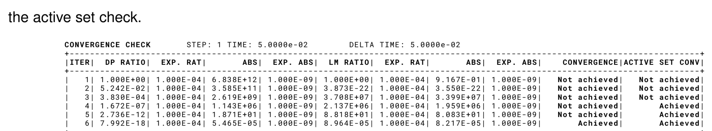

> **Sources.** [`custom_strategies/custom_convergencecriterias/base_mortar_criteria.h`](https://github.com/KratosMultiphysics/Kratos/blob/master/applications/ContactStructuralMechanicsApplication/custom_strategies/custom_convergencecriterias/base_mortar_criteria.h) (`gidio_debug`), [`mortar_and_criteria.h`](https://github.com/KratosMultiphysics/Kratos/blob/master/applications/ContactStructuralMechanicsApplication/custom_strategies/custom_convergencecriterias/mortar_and_criteria.h) (table, condition number), [`python_scripts/search_base_process.py`](https://github.com/KratosMultiphysics/Kratos/blob/master/applications/ContactStructuralMechanicsApplication/python_scripts/search_base_process.py) and [`alm_contact_process.py`](https://github.com/KratosMultiphysics/Kratos/blob/master/applications/ContactStructuralMechanicsApplication/python_scripts/alm_contact_process.py) (`debug_mode`), the variables header; thesis §4.3.3.5 (Fig. 4.18), §4.3.4.4 (Fig. 4.23), §4.5.6 (energy conservation, Fig. 4.64).

## Contact results available on the nodes

| Variable | Storage | Formulations | Meaning |
|---|---|---|---|
| `DISPLACEMENT`, `REACTION` | historical | all | Structural results. The reactions of a fixed body balance the contact force transmitted to it. |
| `NORMAL` | historical | all | Nodal normal of the interface (averaged from the conditions, thesis §4.6.1.4 / §4.6.2.4). The slave normal defines the gap direction. |
| `NODAL_H` | historical | all | Nodal mesh size used to scale the search radius and the penalty. |
| `LAGRANGE_MULTIPLIER_CONTACT_PRESSURE` | historical, DoF | `ALMContactFrictionless` | Scalar multiplier $$\lambda_n$$. **Scaled unknown**: the physical normal pressure is $$k\lambda_n$$ with $$k$$ = `SCALE_FACTOR` (printed at start-up). Negative in compression. |
| `VECTOR_LAGRANGE_MULTIPLIER` | historical, DoF | components, frictional ALM, `ComponentsMeshTying` | Vector multiplier $$\boldsymbol\lambda$$; normal pressure $$k\,\mathbf{n}\cdot\boldsymbol\lambda$$, tangential traction $$k\,\boldsymbol\lambda_\tau$$. |
| `SCALAR_LAGRANGE_MULTIPLIER` | historical, DoF | `ScalarMeshTying` | Multiplier of a tied scalar field. |
| `WEIGHTED_GAP` | historical | all contact types | Mortar-weighted gap $$\tilde g_n = \mathbf{n}\cdot(\mathbf{D}\mathbf{x}^{(1)} - \mathbf{M}\mathbf{x}^{(2)})$$ (thesis eq. 4.31), an *integrated* quantity (units of length × area). Zero on active nodes at convergence, positive where the surfaces are apart. Divide by `NODAL_AREA` for a length. |
| `WEIGHTED_SLIP` | historical | frictional | Mortar-weighted tangential slip increment (thesis eqs. 4.63–4.69). |
| `NORMAL_GAP` | non-historical | when `check_gap = check_mapping` | Nodal gap obtained by mapping the master surface onto the slave (a length). |
| `AUGMENTED_NORMAL_CONTACT_PRESSURE` | non-historical | all | $$\bar\lambda_n = k\lambda_n + \varepsilon\tilde g_n$$ (penalty: $$\varepsilon\tilde g_n$$) — the effective normal pressure used for the active-set decision and **the quantity to plot as contact pressure**. Negative in compression. Set to zero on inactive nodes before output when `clear_inactive_for_post` is true. |
| `AUGMENTED_TANGENT_CONTACT_PRESSURE` | non-historical | frictional | $$\bar{\boldsymbol\lambda}_\tau$$, the effective tangential traction (Coulomb limit $$\mu\vert\bar\lambda_n\vert$$ on slip nodes). |
| `DYNAMIC_FACTOR` | non-historical | dynamic problems | Factor scaling the contact contribution from the gap evolution (`compute_dynamic_factor`). |
| `INITIAL_PENALTY` | non-historical | ALM/penalty | Nodal penalty $$\varepsilon$$ (varies when `adapt_penalty` is used). |
| `CONTACT_FORCE` | non-historical | MPC route | Nodal contact force recovered from the mapped reactions (`MPCContactCriteria`). |
| `WEIGHTED_SCALAR_RESIDUAL`, `WEIGHTED_VECTOR_RESIDUAL` | historical (reactions of the multiplier DoFs) | ALM / tying | Residual of the multiplier equations; useful for debugging only. |
| Flags `ACTIVE`, `SLIP`, `SLAVE`, `MASTER`, `INTERFACE`, `ISOLATED` | nodal flags | all | Active set, stick/slip state, roles, interface membership, isolated multipliers (see [Variables and flags](../Implementation/Variables_And_Flags_Reference.html)). |

On the pair conditions of `ComputingContact` the flags `ACTIVE`, `SLIP`, `RIGID` and `MODIFIED` are also available; the conditions themselves carry no result variables.

## Writing the results

### VTK (`vtk_output_process`)

```json
"output_processes" : {
    "vtk_output" : [{
        "python_module" : "vtk_output_process",
        "kratos_module" : "KratosMultiphysics",
        "process_name"  : "VtkOutputProcess",
        "Parameters"    : {
            "model_part_name"                    : "Structure",
            "output_control_type"                : "step",
            "output_interval"                    : 1,
            "file_format"                        : "binary",
            "output_path"                        : "vtk_output",
            "nodal_solution_step_data_variables" : ["DISPLACEMENT", "REACTION", "NORMAL", "LAGRANGE_MULTIPLIER_CONTACT_PRESSURE", "WEIGHTED_GAP"],
            "nodal_data_value_variables"         : ["AUGMENTED_NORMAL_CONTACT_PRESSURE", "NORMAL_GAP", "NODAL_H"],
            "nodal_flags"                        : ["ACTIVE", "SLAVE", "MASTER"],
            "gauss_point_variables_in_elements"  : ["VON_MISES_STRESS"]
        }
    }]
}
```

For frictional cases replace the multiplier by `VECTOR_LAGRANGE_MULTIPLIER`, add `WEIGHTED_SLIP` to the historical list, `AUGMENTED_TANGENT_CONTACT_PRESSURE` to the non-historical list and `SLIP` to the flags. `output_sub_model_parts: true` writes the `Contact` and `ComputingContact` sub-model-parts separately, which is convenient to inspect the interface alone.

### GiD (`gid_output_process`)

The test cases keep a GiD block (as `_output_processes`, disabled by the leading underscore) that can be reused directly:

```json
"nodal_results"               : ["DISPLACEMENT", "NORMAL", "REACTION", "LAGRANGE_MULTIPLIER_CONTACT_PRESSURE", "WEIGHTED_GAP"],
"nodal_nonhistorical_results" : ["AUGMENTED_NORMAL_CONTACT_PRESSURE"],
"nodal_flags_results"         : ["ACTIVE", "SLAVE"],
"gauss_point_results"         : ["VON_MISES_STRESS", "PK2_STRESS_TENSOR"]
```

The pair conditions of `ComputingContact` are written with the mesh; with `clear_inactive_for_post` (default `true`) the inactive pairs are removed before the output step so that only the current active interface appears.

### JSON output / checks

`json_output_process` and `from_json_check_result_process` (Kratos core) work with the contact variables as with any other; the test suite uses them with `"historical_value": false` for `AUGMENTED_NORMAL_CONTACT_PRESSURE` (see the `_json_output_process` blocks of the test parameter files and [Test suite reference](../Validation/Test_Suite_Reference.html)).

## Reading the convergence table

With `fancy_convergence_criterion` (default) every Newton iteration prints one row of a table built by `MortarAndConvergenceCriteria` (`TABLE_UTILITY`). Frictionless ALM example (from the [tutorial](Tutorial_Hertz_2D.html)):

```
CONVERGENCE CHECK	STEP: 1	TIME: 5.0050e-01	DELTA TIME: 5.0050e-01
|ITER|  DP RATIO|  EXP. RAT|       ABS|  EXP. ABS|  LM RATIO|  EXP. RAT|       ABS|  EXP. ABS|    CONVERGENCE|ACTIVE SET CONV|
|   1| 1.000E+00| 1.000E-04| 1.882E-07| 1.000E-09| 1.000E+00| 1.000E-04| 1.988E-06| 1.000E-09|   Not achieved|   Not achieved|
|   4| 4.167E-06| 1.000E-04| 7.842E-13| 1.000E-09| 2.606E-05| 1.000E-04| 5.180E-11| 1.000E-09|       Achieved|       Achieved|
```

| Column | Meaning |
|---|---|
| `ITER` | Newton iteration number within the step (`NL_ITERATION_NUMBER`). |
| `DP RATIO` / `EXP. RAT` | Relative norm of the displacement block (residual or increment depending on the criterion) and its tolerance. |
| `ABS` / `EXP. ABS` | Absolute norm and tolerance of the same block. |
| `RT RATIO` … | Rotation block (only with `rotation_dofs`). |
| `LM RATIO` … | Lagrange-multiplier block (ALM formulations). Frictional criteria split it into `N.LM RATIO` (normal), `STI. RATIO` (stick nodes) and `SLIP RATIO` (slip nodes). |
| `CONVERGENCE` | Result of the residual/increment check of the user criterion. |
| `ACTIVE SET CONV` | `Achieved` when no node changed its active/inactive state in this iteration (thesis eq. 4.41). |
| `SLIP/STICK CONV` | Frictional: no node changed its stick/slip state (thesis eq. 4.79). |
| `COND.NUM.` | Condition number estimate, only with `condn_convergence_criterion`. |

The step is converged only when **all** columns are achieved in the same iteration (thesis Algorithms 2 and 3). The thesis shows the same tables in Figs. 4.18 (frictionless) and 4.23 (frictional):

<p align="center"></p>
<p align="center"><em>Figure: convergence table of a frictionless contact step as printed by Kratos (thesis Fig. 4.18).</em></p>

<p align="center"></p>
<p align="center"><em>Figure: convergence table of a frictional contact step with the two active-set columns (thesis Fig. 4.23).</em></p>

Typical patterns: a multiplier ratio that grows in the first iterations while `ACTIVE SET CONV` is `Not achieved` is normal (nodes entering or leaving contact); a table that alternates `Achieved` / `Not achieved` in the active-set column for many iterations indicates chattering (see [Tips and troubleshooting](Tips_Troubleshooting_And_Limitations.html)); once the set is fixed the ratios should drop quadratically.

## Debug outputs

| Switch | Where | Output |
|---|---|---|
| `contact_settings.gidio_debug` | `BaseMortarConvergenceCriteria::PostCriteria` | A GiD file per iteration with the flags `INTERFACE`, `ACTIVE`, `SLAVE`, `ISOLATED`, `SLIP`, the `NORMAL`, `DYNAMIC_FACTOR`, `AUGMENTED_NORMAL/TANGENT_CONTACT_PRESSURE`, `DISPLACEMENT`, `VELOCITY`, `ACCELERATION`, the multipliers and `WEIGHTED_GAP` / `WEIGHTED_SLIP`. |
| `search_parameters.debug_mode` | `SearchBaseProcess` / `ALMContactProcess` | GiD dumps of the pairs after every search (`_debug_output`), the total integrated interface area (`TOTAL INTEGRATED AREA`), and at the end of every step the totals `TOTAL LOAD`, `TOTAL REACTION` and `TOTAL CONTACT FORCE` ($$\sum$$ `NODAL_AREA` × `AUGMENTED_NORMAL_CONTACT_PRESSURE`) — the quickest global check that the contact force balances the load. Self-contact runs additionally write `SELFCONTACT_<model part>_STEP_<n>` with the `MASTER`/`SLAVE` flags. |
| `octree_search_parameters.debug_obb` | OBB search | Writes the oriented bounding boxes. |
| `contact_settings.print_convergence_criterion` | all criteria | Verbose print of every criterion in addition to the table. |
| `contact_settings.condn_convergence_criterion` | `MortarAndConvergenceCriteria` | Estimates the condition number with power iterations (thesis §4.3.3.3 uses it to calibrate $$k$$ and $$\varepsilon$$). Expensive. |
| `contact_settings.ensure_contact` | criteria | Raises an error when no node is active. |
| `echo_level` of the solver | strategies | Set `silent_strategy: false` to see the strategy messages. |

## Post-processing recipes

**Contact pressure.** Plot `AUGMENTED_NORMAL_CONTACT_PRESSURE` (negative = compression). If you need the multiplier itself, remember the scaling: pressure $$= $$ `SCALE_FACTOR` $$\times$$ `LAGRANGE_MULTIPLIER_CONTACT_PRESSURE` (or $$\times\,\mathbf{n}\cdot$$`VECTOR_LAGRANGE_MULTIPLIER`). The scale factor is printed at start-up and stored in `ProcessInfo[SCALE_FACTOR]`.

**Resultant contact force.** Either sum the `REACTION` of a fixed body, or integrate the pressure on the slave side:

```python
import KratosMultiphysics as KM
import KratosMultiphysics.ContactStructuralMechanicsApplication as CSMA
contact = model["Structure.Contact"]
force = sum(n.GetValue(KM.NODAL_AREA) * n.GetValue(CSMA.AUGMENTED_NORMAL_CONTACT_PRESSURE)
            for n in contact.Nodes if n.Is(KM.SLAVE) and n.Is(KM.ACTIVE))
```

(`NODAL_AREA` is filled by the explicit contribution of the mortar conditions on the slave nodes.)

**Contact area / half-width.** Count or locate the `ACTIVE` slave nodes, or integrate `NODAL_AREA` over them.

**Gap history.** `WEIGHTED_GAP` keeps its previous value in buffer position 1 (`GetSolutionStepValue(WEIGHTED_GAP, 1)`), which is how `ComputeDynamicFactorProcess` measures the approach velocity of the surfaces.

**Energy conservation (dynamics).** The thesis checks the formulation on a cylinder bouncing inside a ring (§4.5.6): the total energy must stay constant apart from the contact impulses. With `compute_dynamic_factor` and an implicit scheme the displacement and energy evolution follow the analytical solution:

<p align="center"></p>
<p align="center"><em>Figure: displacement and energy evolution of the energy-conservation test compared with the analytical solution (thesis Fig. 4.64).</em></p>

The kinetic and strain energies can be obtained with the `StructuralMechanicsApplication` utilities (`EnergyCalculationUtilities`) or from the `STRAIN_ENERGY` / `KINETIC_ENERGY` element results; the work of the contact tractions is $$\sum$$ `AUGMENTED_NORMAL_CONTACT_PRESSURE` $$\times$$ `NODAL_AREA` $$\times$$ gap increment on the slave nodes.

**Comparing with an analytical solution.** See the [tutorial](Tutorial_Hertz_2D.html) for a complete example (Hertz pressure distribution) and [Benchmarks](../Validation/Benchmarks.html) for the reference solutions of every thesis example.

*Thesis figures © Vicente Mataix Ferrándiz, PhD thesis "Innovative mathematical and numerical models for studying the deformation of shells during industrial forming processes with the Finite Element Method", UPC 2020, reproduced by the author. Figures marked "inspired by" are the author's redrawings of the cited sources.*
