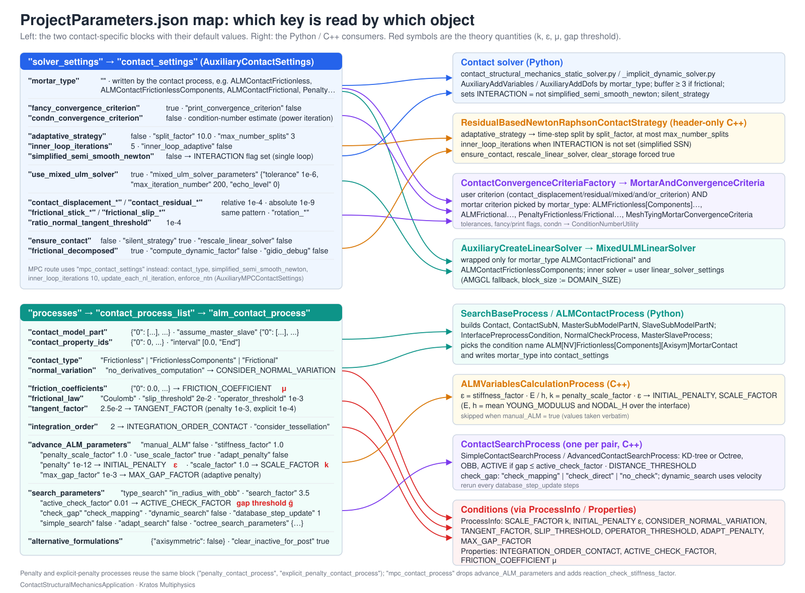

> **Sources.** [`python_scripts/auxiliary_methods_solvers.py`](https://github.com/KratosMultiphysics/Kratos/blob/master/applications/ContactStructuralMechanicsApplication/python_scripts/auxiliary_methods_solvers.py) (defaults and consumers), [`contact_structural_mechanics_static_solver.py`](https://github.com/KratosMultiphysics/Kratos/blob/master/applications/ContactStructuralMechanicsApplication/python_scripts/contact_structural_mechanics_static_solver.py), [`contact_structural_mechanics_implicit_dynamic_solver.py`](https://github.com/KratosMultiphysics/Kratos/blob/master/applications/ContactStructuralMechanicsApplication/python_scripts/contact_structural_mechanics_implicit_dynamic_solver.py), [`contact_structural_mechanics_explicit_dynamic_solver.py`](https://github.com/KratosMultiphysics/Kratos/blob/master/applications/ContactStructuralMechanicsApplication/python_scripts/contact_structural_mechanics_explicit_dynamic_solver.py), [`mpc_contact_structural_mechanics_static_solver.py`](https://github.com/KratosMultiphysics/Kratos/blob/master/applications/ContactStructuralMechanicsApplication/python_scripts/mpc_contact_structural_mechanics_static_solver.py), [`contact_convergence_criteria_factory.py`](https://github.com/KratosMultiphysics/Kratos/blob/master/applications/ContactStructuralMechanicsApplication/python_scripts/contact_convergence_criteria_factory.py), and the solver wrapper of the StructuralMechanicsApplication ([`python_solvers_wrapper_structural.py`](https://github.com/KratosMultiphysics/Kratos/blob/master/applications/StructuralMechanicsApplication/python_scripts/python_solvers_wrapper_structural.py)).

## How the contact solver is selected

The `solver_settings` block of a contact problem is an ordinary `StructuralMechanicsApplication` block (`solver_type`, `analysis_type`, `time_stepping`, `linear_solver_settings`, `convergence_criterion`, …) plus **one** extra sub-block. The generic wrapper decides which solver module to import from its presence:

| Present in `solver_settings` | Module imported | `solver_type` values |
|---|---|---|
| `contact_settings` | `KratosMultiphysics.ContactStructuralMechanicsApplication.contact_<solver>` | `Static` → `contact_structural_mechanics_static_solver`, `Dynamic` with implicit scheme → `contact_structural_mechanics_implicit_dynamic_solver`, `Dynamic` with `time_integration_method: explicit` → `contact_structural_mechanics_explicit_dynamic_solver` |
| `mpc_contact_settings` | `…mpc_contact_<solver>` | `Static` → `mpc_contact_structural_mechanics_static_solver`, `Dynamic` → `mpc_contact_structural_mechanics_implicit_dynamic_solver` |
| neither | the plain structural solver | – |

All contact solvers derive from the corresponding structural solver and override only what contact needs: variables and DoFs (`AddVariables` / `AddDofs`), the builder-and-solver, the strategy, the convergence criterion, the linear solver wrapping and a few forced settings. The block itself is normally *completed* by the contact process of `processes.contact_process_list`, which writes the `mortar_type` key; in the simplest case the user only writes:

```json
"solver_settings" : {
    "solver_type"           : "Static",
    "analysis_type"         : "non_linear",
    "contact_settings"      : { "mortar_type" : "ALMContactFrictionless" },
    "convergence_criterion" : "contact_residual_criterion",
    "time_stepping"         : { "time_step" : 0.1 }
}
```

<p align="center"></p>
<p align="center"><em>Figure: the two contact-specific JSON blocks and the Python / C++ objects that read every key.</em></p>

## `contact_settings` (static and implicit dynamic solvers)

Defaults returned by `AuxiliaryContactSettings()` and merged into the structural defaults by `GetDefaultParameters()`:

```json
{
    "contact_settings" :
    {
        "mortar_type"                                             : "",
        "condn_convergence_criterion"                             : false,
        "fancy_convergence_criterion"                             : true,
        "print_convergence_criterion"                             : false,
        "ensure_contact"                                          : false,
        "frictional_decomposed"                                   : true,
        "compute_dynamic_factor"                                  : false,
        "gidio_debug"                                             : false,
        "adaptative_strategy"                                     : false,
        "split_factor"                                            : 10.0,
        "max_number_splits"                                       : 3,
        "inner_loop_iterations"                                   : 5,
        "inner_loop_adaptive"                                     : false,
        "rotation_relative_tolerance"                             : 1.0e-4,
        "rotation_absolute_tolerance"                             : 1.0e-9,
        "rotation_residual_relative_tolerance"                    : 1.0e-4,
        "rotation_residual_absolute_tolerance"                    : 1.0e-9,
        "contact_displacement_relative_tolerance"                 : 1.0e-4,
        "contact_displacement_absolute_tolerance"                 : 1.0e-9,
        "contact_residual_relative_tolerance"                     : 1.0e-4,
        "contact_residual_absolute_tolerance"                     : 1.0e-9,
        "frictional_stick_contact_displacement_relative_tolerance": 1.0e-4,
        "frictional_stick_contact_displacement_absolute_tolerance": 1.0e-9,
        "frictional_stick_contact_residual_relative_tolerance"    : 1.0e-4,
        "frictional_stick_contact_residual_absolute_tolerance"    : 1.0e-9,
        "frictional_slip_contact_displacement_relative_tolerance" : 1.0e-4,
        "frictional_slip_contact_displacement_absolute_tolerance" : 1.0e-9,
        "frictional_slip_contact_residual_relative_tolerance"     : 1.0e-4,
        "frictional_slip_contact_residual_absolute_tolerance"     : 1.0e-9,
        "ratio_normal_tangent_threshold"                          : 1.0e-4,
        "silent_strategy"                                         : true,
        "simplified_semi_smooth_newton"                           : false,
        "rescale_linear_solver"                                   : false,
        "use_mixed_ulm_solver"                                    : true,
        "mixed_ulm_solver_parameters" :
        {
            "solver_type"          : "mixed_ulm_linear_solver",
            "tolerance"            : 1.0e-6,
            "max_iteration_number" : 200,
            "echo_level"           : 0
        }
    }
}
```

### Key by key

| Key | Type / default | Meaning | Consumed by |
|---|---|---|---|
| `mortar_type` | string, `""` | Selects the formulation (see the table below). Normally written by the contact process; an empty string means "no contact", in which case the solver behaves exactly as the structural one. | `AuxiliaryAddVariables`, `AuxiliaryAddDofs`, `AuxiliarySetSettings`, `ContactConvergenceCriteriaFactory`, `AuxiliaryCreateLinearSolver`, `_CreateBuilderAndSolver`, `_CreateSolutionStrategy` |
| `condn_convergence_criterion` | bool, `false` | Estimates and prints the condition number of the system matrix at every iteration (power-iteration eigen solvers, expensive). | `ContactConvergenceCriteriaFactory` → `MortarAndConvergenceCriteria` |
| `fancy_convergence_criterion` | bool, `true` | Prints the coloured convergence table (`TABLE_UTILITY`) with one column per residual and the active-set columns. | `AuxiliaryCreateConvergenceParameters` |
| `print_convergence_criterion` | bool, `false` | Verbose print of every criterion in addition to the table. | all criteria |
| `ensure_contact` | bool, `false` | Fails the step when no node is active (a contact problem that lost contact) and runs `ContactUtilities::CheckActivity` at the end of each step. | criteria constructors, `ExecuteFinalizeSolutionStep` |
| `frictional_decomposed` | bool, `true` | For frictional `mortar_type`, use the criteria that split the contact block into stick and slip nodes (`…FrictionalContactCriteria`); `false` uses the plain displacement/LM criteria. | `ContactConvergenceCriteriaFactory` |
| `compute_dynamic_factor` | bool, `false` | Runs `ComputeDynamicFactorProcess` in the mortar criterion (`DYNAMIC_FACTOR` from the gap evolution; dynamic problems). | `BaseMortarConvergenceCriteria::PreCriteria` |
| `gidio_debug` | bool, `false` | GiD dump of flags, normals, multipliers and gaps after every iteration. | `BaseMortarConvergenceCriteria::PostCriteria` |
| `adaptative_strategy` | bool, `false` | On non-convergence the time step is split (`AdaptativeStep`) instead of failing. | `ResidualBasedNewtonRaphsonContactStrategy` |
| `split_factor` | double, `10.0` | Division factor of `DELTA_TIME` at every split. | idem |
| `max_number_splits` | int, `3` | Maximum number of nested splits. | idem |
| `inner_loop_iterations` | int, `5` | Outer iterations of the simplified semi-smooth Newton (only when `simplified_semi_smooth_newton` is `true`). | idem |
| `inner_loop_adaptive` | bool, `false` | Divides the time step by the current `INNER_LOOP_ITERATION` when the inner loop had to iterate. | `AuxiliaryComputeDeltaTime` |
| `rotation_*_tolerance` | double | Tolerances of the rotation block (beams / shells with `rotation_dofs`). | displacement/LM criteria |
| `contact_displacement_*`, `contact_residual_*` | double | Tolerances of the Lagrange-multiplier block (increment / residual). | `DisplacementLagrangeMultiplier{,Residual,Mixed}ContactCriteria` |
| `frictional_stick_*`, `frictional_slip_*` | double | Tolerances of the stick and slip sub-blocks of the multipliers. | `…FrictionalContactCriteria` |
| `ratio_normal_tangent_threshold` | double, `1.0e-4` | Ratio below which the tangential multiplier is considered negligible with respect to the normal one in the frictional criteria. | idem |
| `silent_strategy` | bool, `true` | Sets the strategy echo level to 0 (the convergence table is still printed by the criteria). | `Initialize` of the solver |
| `simplified_semi_smooth_newton` | bool, `false` | `false`: the computing model part gets the `INTERACTION` flag and displacements, multipliers and active sets converge in one Newton loop (full semi-smooth Newton, thesis Algorithms 2–3). `true`: the sets are frozen during an inner Newton loop and re-checked up to `inner_loop_iterations` times. | `Initialize`, `ResidualBasedNewtonRaphsonContactStrategy` |
| `rescale_linear_solver` | bool, `false` | Wraps the linear solver in a `ScalingSolver`. | `AuxiliaryCreateLinearSolver` |
| `use_mixed_ulm_solver` | bool, `true` | Wraps the user linear solver in a `MixedULMLinearSolver` that condenses the dual multipliers. Applied only to vector-multiplier formulations (`ALMContactFrictional*`, `ALMContactFrictionlessComponents`). | `AuxiliaryCreateLinearSolver` |
| `mixed_ulm_solver_parameters` | object | Settings of the mixed solver (`tolerance`, `max_iteration_number`, `echo_level`). | `MixedULMLinearSolver` |

### Forced settings and side effects

- `clear_storage` and `reform_dofs_at_each_step` are forced to `true` (`AuxiliaryValidateSettings`): the DoF set changes with the active set.
- `buffer_size` is raised to at least 3 for frictional formulations (`AuxiliarySetSettings`), because the slip increment needs the previous configurations.
- `AddVariables` adds `NORMAL`, `NODAL_H`, `WEIGHTED_GAP` (and `WEIGHTED_SLIP` for frictional types) plus the multiplier variable of the formulation; `AddDofs` adds the multiplier DoFs with their reactions (`WEIGHTED_SCALAR_RESIDUAL`, `WEIGHTED_VECTOR_RESIDUAL_X/Y/Z`). See the [variables reference](../Implementation/Variables_And_Flags_Reference.html).
- The computing model part receives the `INTERACTION` flag according to `simplified_semi_smooth_newton`.
- `analysis_type: "linear"` with a contact `mortar_type` creates the base linear strategy (no active-set iterations); use `"non_linear"`.

## `mortar_type` values

| Value | Formulation | Multiplier variable / DoFs | Buffer | Active-set criterion | Mixed ULM solver |
|---|---|---|---|---|---|
| `ALMContactFrictionless` | ALM, scalar multiplier (thesis §4.3.3.2.1) | `LAGRANGE_MULTIPLIER_CONTACT_PRESSURE` | user | `ALMFrictionlessMortarConvergenceCriteria` | no |
| `ALMContactFrictionlessComponents` | ALM, vector multiplier (§4.3.3.2.2) | `VECTOR_LAGRANGE_MULTIPLIER` | user | `ALMFrictionlessComponentsMortarConvergenceCriteria` | yes |
| `ALMContactFrictional`, `ALMContactFrictionalPureSlip` | ALM frictional (§4.3.4) | `VECTOR_LAGRANGE_MULTIPLIER` | ≥ 3 | `ALMFrictionalMortarConvergenceCriteria` (`pure_slip` for the `PureSlip` suffix) | yes |
| `PenaltyContactFrictionless` | penalty frictionless | none | user | `PenaltyFrictionlessMortarConvergenceCriteria` | no |
| `PenaltyContactFrictional`, `PenaltyContactFrictionalPureSlip` | penalty frictional | none | ≥ 3 | `PenaltyFrictionalMortarConvergenceCriteria` | no |
| `ScalarMeshTying` | mesh tying of a scalar variable | `SCALAR_LAGRANGE_MULTIPLIER` | user | `MeshTyingMortarConvergenceCriteria` | no |
| `ComponentsMeshTying` | mesh tying of a vector variable | `VECTOR_LAGRANGE_MULTIPLIER` | user | `MeshTyingMortarConvergenceCriteria` | no |

The contact processes set these values from their own `contact_type` (`Frictionless`, `FrictionlessComponents`, `Frictional`, `FrictionalPureSlip`) and formulation (ALM / penalty / tying); see [Contact process settings](Contact_Process_Settings_Reference.html).

## `convergence_criterion`

The structural key `convergence_criterion` accepts the contact-specific values below (built by `ContactConvergenceCriteriaFactory`, always combined with the mortar active-set criterion through `MortarAndConvergenceCriteria`):

| Value | Criterion created (ALM) | Penalty formulations | Frictional with `frictional_decomposed` |
|---|---|---|---|
| `contact_displacement_criterion` | `DisplacementLagrangeMultiplierContactCriteria` (displacement + LM increments) | `DisplacementContactCriteria` | `DisplacementLagrangeMultiplierFrictionalContactCriteria` |
| `contact_residual_criterion` | `DisplacementLagrangeMultiplierResidualContactCriteria` | `DisplacementResidualContactCriteria` | `DisplacementLagrangeMultiplierResidualFrictionalContactCriteria` |
| `contact_mixed_criterion` | `DisplacementLagrangeMultiplierMixedContactCriteria` (displacement residual + LM increment) | `DisplacementResidualContactCriteria` | `DisplacementLagrangeMultiplierMixedFrictionalContactCriteria` |
| `contact_and_criterion` | displacement AND residual contact criteria | idem with the penalty versions | – |
| `contact_or_criterion` | displacement OR residual contact criteria | idem | – |
| `adaptative_remesh_criteria` | the above combined with `ContactErrorMeshCriteria` (adaptive remeshing, needs the `MeshingApplication`) | | |
| any structural value (`displacement_criterion`, `residual_criterion`, `and_criterion`, `or_criterion`) | the standard structural criterion, without the multiplier blocks | | |

The tolerances come from the structural keys (`displacement_relative_tolerance`, `residual_relative_tolerance`, …) for the displacement block and from `contact_settings` for the rotation, multiplier, stick and slip blocks. Details of every criterion: [Strategies and convergence criteria](../Implementation/Strategies_And_Convergence_Criteria.html).

## Strategy, builder-and-solver and linear solver

| Structural key | Contact behaviour |
|---|---|
| `solving_strategy_settings.type` | `newton_raphson` → `ResidualBasedNewtonRaphsonContactStrategy`; `line_search` → `LineSearchContactStrategy`; `arc_length` → the structural arc-length strategy (no contact-specific version). The MPC solvers always use `ResidualBasedNewtonRaphsonMPCContactStrategy`. |
| `builder_and_solver_settings.type` | `block` → `ContactResidualBasedBlockBuilderAndSolver` (fixes the multipliers of `ISOLATED` nodes); anything else → `ContactResidualBasedEliminationBuilderAndSolver`, or `…WithConstraints` when `multi_point_constraints_used` is `true`. |
| `linear_solver_settings` | Any Kratos linear solver. For vector-multiplier formulations it becomes the *inner* solver of the `MixedULMLinearSolver` (`use_mixed_ulm_solver`). When the user solver is AMGCL, the wrapper rebuilds it with `block_size = DOMAIN_SIZE` and the fallback below. |
| `time_stepping` | `time_step`, `time_step_table` or the legacy `time_step_intervals`; `inner_loop_adaptive` may reduce the step. |

AMGCL fallback used inside `AuxiliaryCreateLinearSolver` (the `block_size` is overwritten with `DOMAIN_SIZE`):

```json
{
    "solver_type"                    : "amgcl",
    "smoother_type"                  : "ilu0",
    "krylov_type"                    : "lgmres",
    "coarsening_type"                : "aggregation",
    "max_iteration"                  : 100,
    "provide_coordinates"            : false,
    "gmres_krylov_space_dimension"   : 100,
    "verbosity"                      : 1,
    "tolerance"                      : 1e-6,
    "scaling"                        : false,
    "block_size"                     : 3,
    "use_block_matrices_if_possible" : true,
    "coarse_enough"                  : 1000,
    "max_levels"                     : -1,
    "post_sweeps"                    : 1,
    "pre_sweeps"                     : 1,
    "preconditioner_type"            : "amg",
    "use_gpgpu"                      : false
}
```

## `mpc_contact_settings` (MPC solvers)

```json
{
    "mpc_contact_settings" :
    {
        "contact_type"                  : "Frictionless",
        "simplified_semi_smooth_newton" : false,
        "inner_loop_iterations"         : 10,
        "update_each_nl_iteration"      : false,
        "enforce_ntn"                   : false
    }
}
```

| Key | Meaning | Consumed by |
|---|---|---|
| `contact_type` | `Frictionless` or `Frictional` (adds `WEIGHTED_SLIP`; the conditions get the `SLIP` flag). | `AuxiliaryMPCAddVariables`, `mpc_contact_process.py` |
| `simplified_semi_smooth_newton` | Same meaning as for the ALM solvers (`INTERACTION` flag). | `ResidualBasedNewtonRaphsonMPCContactStrategy` |
| `inner_loop_iterations` | Outer iterations of the simplified loop (default 10 here). | idem |
| `update_each_nl_iteration` | Re-evaluate the constraints (and rebuild the DoF set) at every non-linear iteration instead of once per step. | idem |
| `enforce_ntn` | Accepted for compatibility; the node-to-node enforcement (`EnforcingNTN()`) is commented out in the strategy and has no effect. | – |

The MPC solvers use the elimination builder-and-solver with constraints and no `MixedULMLinearSolver` (there are no multiplier DoFs). See [Frictional laws and MPC constraint](../Implementation/Frictional_Laws_And_MPC_Constraint.html).

## `contact_settings` of the explicit solver

```json
{
    "contact_settings" :
    {
        "mortar_type"                                       : "",
        "compute_dynamic_factor"                            : true,
        "ensure_contact"                                    : false,
        "silent_strategy"                                   : false,
        "delta_time_factor_for_contact"                     : 5.0e-1
    }
}
```

The explicit solver (`contact_structural_mechanics_explicit_dynamic_solver.py`) supports the penalty formulations only (`explicit_penalty_contact_process.py`); there is no Newton loop, so no criteria or strategies are involved. `delta_time_factor_for_contact` multiplies the stable time step when the `CONTACT` flag is set on the model part (`ComputeDeltaTime`).

## Complete example

A frictional ALM problem with all the frequently touched keys:

```json
"solver_settings" : {
    "solver_type"                 : "Static",
    "model_part_name"             : "Structure",
    "domain_size"                 : 3,
    "analysis_type"               : "non_linear",
    "time_stepping"               : { "time_step" : 0.05 },
    "convergence_criterion"       : "contact_residual_criterion",
    "residual_relative_tolerance" : 1.0e-5,
    "residual_absolute_tolerance" : 1.0e-9,
    "max_iteration"               : 20,
    "builder_and_solver_settings" : { "type" : "block" },
    "linear_solver_settings"      : { "solver_type" : "amgcl" },
    "contact_settings" : {
        "mortar_type"                          : "ALMContactFrictional",
        "adaptative_strategy"                  : true,
        "split_factor"                         : 5.0,
        "max_number_splits"                    : 2,
        "contact_residual_relative_tolerance"  : 1.0e-5,
        "frictional_slip_contact_residual_relative_tolerance" : 1.0e-4,
        "use_mixed_ulm_solver"                 : true
    }
}
```

The companion process block (`contact_process_list`) is documented in [Contact process settings](Contact_Process_Settings_Reference.html); a complete runnable case is in the [tutorial](Tutorial_Hertz_2D.html).
