> **Sources.** Thesis §4.5 *Numerical examples* (pp. 135–160; §4.5.1 basic patch test, §4.5.2 Taylor patch test, §4.5.3 friction base test, §4.5.4 Hertz problem, §4.5.5 teeth model, §4.5.6 energy conservation, §4.5.7 double arc benchmark, §4.5.8 arc pressing block, §4.5.9 hyperelastic tubes, §4.5.10 contacting cylinders, §4.5.11 press fit, §4.5.12 ironing punch), Tables 4.4–4.19, Appendix A.2.2.2 *Solution study* (pp. 287–289) and A.3.5 *Numerical example* (p. 292, Table A.1). Code: `tests/SmallTests.py`, `tests/NightlyTests.py`, `tests/ValidationTests.py`, `tests/test_ContactStructuralMechanicsApplication.py`, the data folders `tests/ALM_frictionless_contact_test_2D`, `tests/ALM_frictionless_contact_test_3D`, `tests/ALM_frictional_contact_test_2D`, `tests/ALM_frictional_contact_test_3D`, `tests/penalty_*`, `tests/mpc_contact_tests`, `tests/mesh_tying_test`, and the `contact_structural_mechanics` folder of the [KratosMultiphysics/Examples](https://github.com/KratosMultiphysics/Examples/tree/master/contact_structural_mechanics) repository.

This page collects the benchmarks with which the contact formulation of the application was verified, in the order in which the thesis presents them: from the most basic patch tests to the classical, more demanding contact benchmarks of the literature (Hertz, Taylor patch test, double arc, press fit, ironing). All the cases were solved with the **augmented Lagrangian method** (ALM) and **dual Lagrange multipliers** on a **mortar** discretization with exact (segment-based) integration; the frictional cases use the Coulomb extension described in [Frictional contact](../Theory/Frictional_Contact.html). In terms of the JSON settings, this corresponds to `"mortar_type": "ALMContactFrictionless"` (or `"ALMContactFrictionlessComponents"`, the vector-multiplier variant), `"ALMContactFrictional"` and `"ALMContactFrictionalPureSlip"`, see [Solver settings reference](../Usage/Solver_Settings_Reference.html).

For every benchmark the page gives: the purpose, the setup (material and geometry parameters transcribed from the thesis tables), the formulation, the reference solution and the discussion of the results as reported in the thesis, the thesis figures, and a **Where to find it** line that points to the test classes of the repository (when the case, or a reduced version of it, is part of the test suite) and to the folder of the Examples repository (when the full-size case is published there). How the test classes are organized and executed is described in [Test suite reference](Test_Suite_Reference.html); the final section of this page summarizes the mapping in a single table.

## How the benchmarks relate to the test suite

The repository test suite (`tests/`) is built to run in continuous integration, so the cases it contains are either the benchmarks themselves when they are small (patch tests, Taylor patch test, friction base test, cylinder–cylinder Hertz, mesh tying example) or **reduced versions** of the large benchmarks (coarser mesh, fewer steps, different material constants) that exercise exactly the same code path. Full-size cases with their reference comparison live in the Examples repository, under `contact_structural_mechanics/validation` (cases with a literature or analytical reference) and `contact_structural_mechanics/use_cases` (demonstration cases). Each test class of the repository is a subclass of `ContactStructuralMechanicsTestFactory` whose `file_name` attribute points to a `<folder>/<case>` prefix, read as `<case>_parameters.json` (see the [Test suite reference](Test_Suite_Reference.html#the-test-factory)). All the tests compare nodal results against the `<case>_results.json` reference files through `from_json_check_result_process`.

In the *Where to find it* lines below, the test classes are given with the suite in which the runner registers them (small / nightly / validation) and the parameters file relative to `tests/`. Cases that are registered under `if has_CL_application:` require the `ConstitutiveLawsApplication` to be compiled (all the 3D hyperelastic ones).

## Basic patch test (thesis §4.5.1)

**Purpose.** The most basic of all possible patch tests: two blocks sharing a clear interface. For frictionless contact the expected result is a continuous gradient of the displacement in the direction normal to the interface; the frictional case has a richer casuistry (stick and slip states) that is checked separately. Two geometries are used (thesis Fig. 4.42): a straight interface between two $$1 \times 1$$ squares, and a sloped interface between two non-regular quadrilaterals.

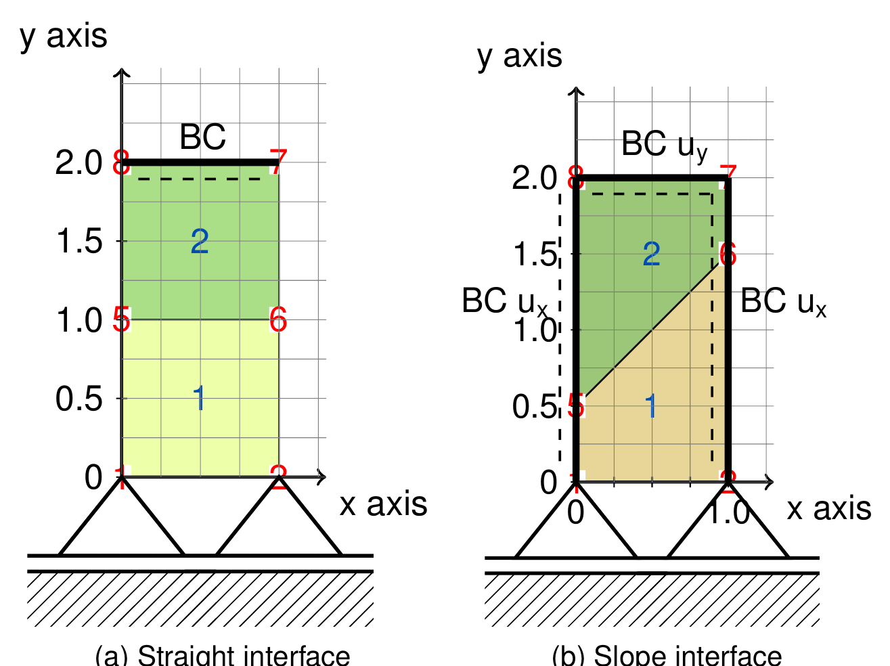

<em>Figure: Geometries of the simplest patch test, (a) straight interface, (b) slope interface (thesis Fig. 4.42).</em>

**Setup (thesis Table 4.4).**

| Body | $$E$$ | $$\nu$$ | $$\rho$$ |
|---|---|---|---|
| Die | $$2.069 \times 10^{11}$$ Pa | 0.29 | 1000 |
| Block | $$2.069 \times 10^{11}$$ Pa | 0.29 | 1000 |

For both problems a vertical displacement of 0.1 m is imposed on the top face of the upper quadrilateral.

### Frictionless (§4.5.1.1)

**Reference solution and results.** The solution for the straight interface (Fig. 4.43a) is the expected one, a continuous gradient of the displacement in the vertical direction; the sloped interface (Fig. 4.43b) also gives the expected continuous solution in the vertical direction. The thesis remarks that, because the same Poisson ratio is used for both bodies, the deformation of the interface is symmetric, which gives the impression that the displacement is also tied in the tangential direction; taking $$\nu = 0$$ in one of the bodies, that body deforms only vertically while the other one exhibits the Poisson effect.

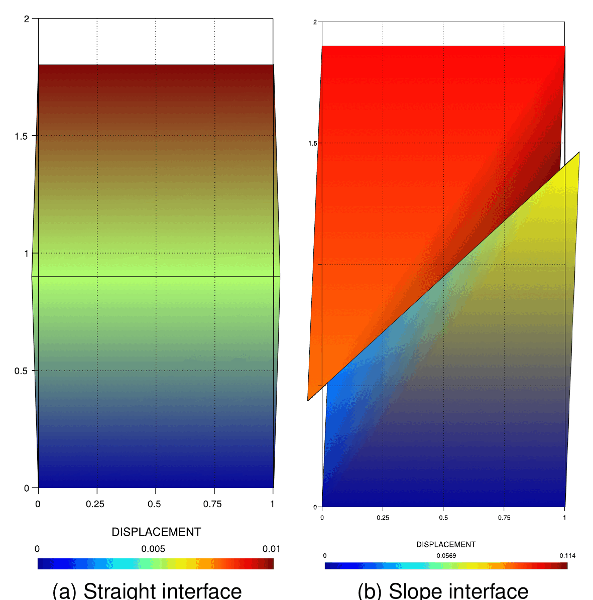

<em>Figure: Solution for the frictionless simplest patch test (thesis Fig. 4.43).</em>

**Where to find it.** Straight interface: `ALMHyperSimplePatchTestContact` (small, `ALM_frictionless_contact_test_2D/hyper_simple_patch_test_parameters.json`), together with its variants `ALMHyperSimplePatchTrianglesTestContact` (triangular elements), `ALMHyperSimplePatchTestWithEliminationContact` (elimination builder and solver) and `ALMHyperSimplePatchTestWithEliminationWithConstraintContact` (elimination with constraints); sloped interface: `ALMHyperSimpleSlopePatchTestContact` (small, `hyper_simple_slope_patch_test_parameters.json`, checks the `AUGMENTED_NORMAL_CONTACT_PRESSURE` against `hyper_simple_slope_patch_test_results_LM.json`). The same cases are repeated with the vector multiplier (`ComponentsALM*` classes), with the penalty formulation (`PenaltyFrictionlessHyperSimplePatchTestContact`), with the MPC contact (`TwoDSimplestPatchMatchingTestContact`) and with mesh tying (`SimplePatchTestTwoDMeshTying`, `SimpleSlopePatchTestTwoDMeshTying`). The 3D counterparts are `ALMThreeDSimplestPatchMatchingTestContact` and the `3D_contact_simplest_patch_matching_*` family (see [Test suite reference](Test_Suite_Reference.html)). Not published in the Examples repository.

### Frictional (§4.5.1.2)

**Purpose.** Only the straight interface is studied. In contrast with the frictionless case, a vertical load is applied on the top face of the upper block together with a tangential load that triggers the tangential behavior. Two states must be distinguished, slip and stick, and the simplicity of the problem allows checking the correctness of the slip/stick detection: by adjusting the friction coefficient $$\mu$$ one switches between them.

**Reference solution and results.** For the slip state (Figs. 4.44a–b) a relative drift appears on the interface; for the stick state (Figs. 4.44c–d) the two blocks move in solidarity. Figures 4.44b and 4.44d plot the `SLIP` flag, which takes the value 1 (slip) or 0 (stick).

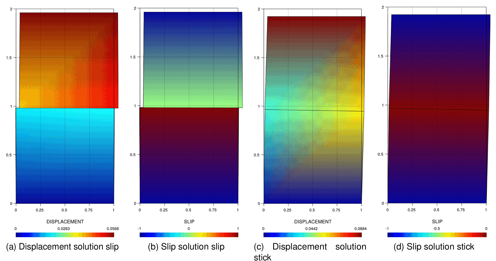

<em>Figure: Geometry and solution for the frictional simplest patch test: (a) displacement, slip; (b) SLIP flag, slip; (c) displacement, stick; (d) SLIP flag, stick (thesis Fig. 4.44).</em>

**Where to find it.** `ALMHyperSimplePatchFrictionalTestContact` (small, `ALM_frictional_contact_test_2D/hyper_simple_patch_test_parameters.json`, $$\mu = 0.01$$) and the regime-specific variants that reuse the same mesh (`hyper_simple_patch_test.mdpa`): `ALMHyperSimplePatchFrictionalSlipTestContact` (`hyper_simple_slip_patch_test`, $$\mu = 0.01$$), `ALMHyperSimplePatchFrictionalStickTestContact` (`hyper_simple_stick_patch_test`, $$\mu = 1.0$$), `ALMNoFrictionHyperSimplePatchFrictionalTestContact` (`no_friction_hyper_simple_patch_test`, $$\mu = 0$$, degeneracy to the frictionless case), `ALMPerfectStickHyperSimplePatchFrictionalTestContact` (`perfect_stick_hyper_simple_patch_test`, $$\mu = 10$$) and `ALMThresholdSlipHyperSimplePatchFrictionalTestContact` (`threshold_slip_hyper_simple_patch_test`, $$\mu = 0.001$$). All are dynamic (`"solver_type": "Dynamic"`, $$\Delta t = 1.1 \times 10^{-3}$$ s, one step) and are mirrored by the `Penalty*HyperSimplePatchFrictional*TestContact` classes in `penalty_frictional_contact_test_2D/` and by `TwoDSimplestWithFrictionPatchMatchingTestContact` in `mpc_contact_tests/`. Not published in the Examples repository.

## Taylor patch test (thesis §4.5.2)

**Purpose.** The Taylor patch test [Taylor & Papadopoulos] is slightly more complex than the former patch test: the interface meshes are not coincident between the two domains and a distributed load is applied on the upper face of the punch. The expected solution is a continuous field of displacements and a constant contact pressure equal to the applied load. It is the classical benchmark for checking that a contact discretization passes the patch test on non-matching meshes.

**Setup (thesis Table 4.5).** The load is $$p = 10$$ Pa.

| Body | $$E$$ | $$\nu$$ | $$\rho$$ |
|---|---|---|---|
| Die | $$3 \times 10^{3}$$ Pa | 0.4 | 1000 |
| Block | $$3 \times 10^{3}$$ Pa | 0.4 | 1000 |

### 2D (§4.5.2.1)

**Reference solution and results.** Figure 4.45a shows the setup; the solution is a continuous gradient of vertical displacement (Fig. 4.45b) and a continuous, uniform vertical stress (Fig. 4.45c), which is the exact solution of the problem.

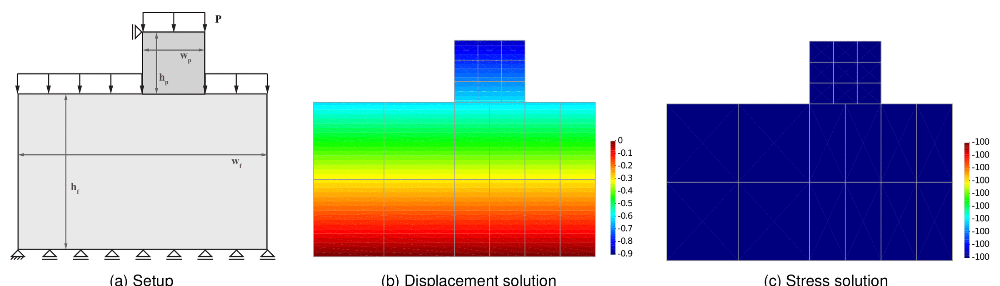

<em>Figure: Solution for the Taylor patch test in 2D: (a) setup, (b) displacement, (c) stress (thesis Fig. 4.45).</em>

### 3D (§4.5.2.2)

**Reference solution and results.** The same conclusions as in 2D apply: continuous gradient of displacement (Fig. 4.46b) and continuous stress field (Fig. 4.46c) in the vertical direction.

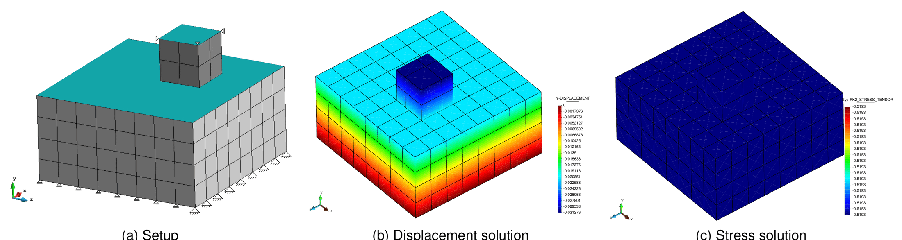

<em>Figure: Solution for the Taylor patch test in 3D: (a) setup, (b) displacement, (c) stress (thesis Fig. 4.46).</em>

**Where to find it.** 2D static: `ALMTaylorPatchTestContact` (nightly, `ALM_frictionless_contact_test_2D/taylor_patch_test_parameters.json`; $$8 \times 7$$ geometry of thesis Fig. A.3, $$E = 1000$$ Pa, $$\nu = 0.4$$, plane strain) and `ComponentsALMTaylorPatchTestContact` (nightly, vector multiplier); 2D dynamic: `ALMTaylorPatchDynamicTestContact` and `ComponentsALMTaylorPatchDynamicTestContact` (validation, `taylor_patch_dynamic_test_parameters.json`, 20 s with $$\Delta t = 0.11$$ s); 2D frictional: `ALMTaylorPatchFrictionalTestContact` (validation, `ALM_frictional_contact_test_2D/taylor_patch_test_parameters.json`, $$\mu = 0.75$$). The 3D case is not in the suite as such; the non-matching 3D patch tests `ALMThreeDPatchNotMatchingTestContact` and `ThreeDPatchNotMatchingTestContact` (MPC) play the same role. Not published in the Examples repository.

## Friction base test (thesis §4.5.3)

**Purpose.** A test extracted from the work of Dong (1999) that allows studying the effect of the friction coefficient on the contact behavior. An upper block (I) rests on a longer lower block (II); a distributed load $$q = 20000$$ kN/m is applied on the top of block I, whose left side is constrained, and the reaction force on the boundary is recorded against the horizontal displacement of the interface.

**Setup (thesis Table 4.6).** The geometry and mesh are those of thesis Fig. 4.47.

| Body | $$E$$ | $$\nu$$ | $$\mu$$ |
|---|---|---|---|
| Die | $$2.1 \times 10^{11}$$ Pa | 0.29 | 1, 0.5, 0.25 |
| Block | $$2.1 \times 10^{11}$$ Pa | 0.29 | 1, 0.5, 0.25 |

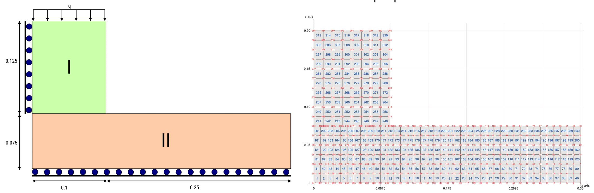

<em>Figure: Friction problem from Dong (1999): (a) geometry, (b) mesh (thesis Fig. 4.47).</em>

**Reference solution and results.** The boundary force versus interface displacement curves are compared with the reference for the three values of $$\mu$$ in Fig. 4.48b, with very good agreement: the force grows linearly while the interface sticks and saturates at the Coulomb limit once it slips, the plateau being proportional to $$\mu$$. The displacement solution for $$\mu = 0.25$$ (Fig. 4.48a) shows the detachment that appears at the interface.

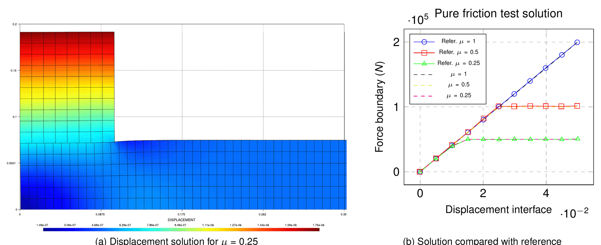

<em>Figure: Solution for the pure friction problem: (a) displacement for $$\mu = 0.25$$, (b) boundary force compared with the reference for $$\mu = 1, 0.5, 0.25$$ (thesis Fig. 4.48).</em>

**Where to find it.** `ALMPureFrictionalTestContact` (nightly, `ALM_frictional_contact_test_2D/pure_friction_test_parameters.json`): the same $$0.35 \times 0.2$$ m two-block geometry (386 nodes, `SmallDisplacementElement2D4N`, `LinearElasticPlaneStrain2DLaw` with $$E = 2.069 \times 10^{11}$$ Pa, $$\nu = 0.29$$), a line load `"modulus": "2000000.0*t"` in the $$-y$$ direction, solved in one static step with $$\mu = 0.05$$. The regression check is on `DISPLACEMENT_X`/`DISPLACEMENT_Y` of the contact part. `ALMBasicFrictionTestContact` (nightly, `basic_friction_test_parameters.json`, $$\mu = 1.01$$) and `ALMStaticEvolutionLoadFrictionTestContact` / `ALMEvolutionLoadFrictionTestContact` (evolving loads, nightly / validation) are related stick–slip checks. Not published in the Examples repository.

## Hertz problem (thesis §4.5.4)

**Purpose.** The most commonly used benchmark in contact mechanics, originally published by Hertz in 1882. Its advantage is that the solution is analytical, so the numerical contact pressure and the displacement of the contact interface can be compared with a solution known a priori for different combinations of materials and geometries (the reference used is the compilation of Zhu). Two configurations are studied, the rigid plane–sphere contact and the sphere–sphere contact (in 2D, cylinder–cylinder), both in 2D and 3D, under the hypothesis of infinitesimal deformations.

### 2D plane–sphere (§4.5.4.1.1)

**Setup (thesis Table 4.7).** The plane–sphere configuration of thesis Fig. 4.49 requires, in 2D, the axisymmetric formulation. Radius $$R = 6.1237$$ m and pressure $$P = 5 \times 10^{5}$$ Pa; the plane can be considered *de facto* rigid.

| Body | $$E$$ | $$\nu$$ |
|---|---|---|
| Sphere | $$1 \times 10^{8}$$ Pa | 0.29 |
| Block | $$1 \times 10^{25}$$ Pa | 0.29 |

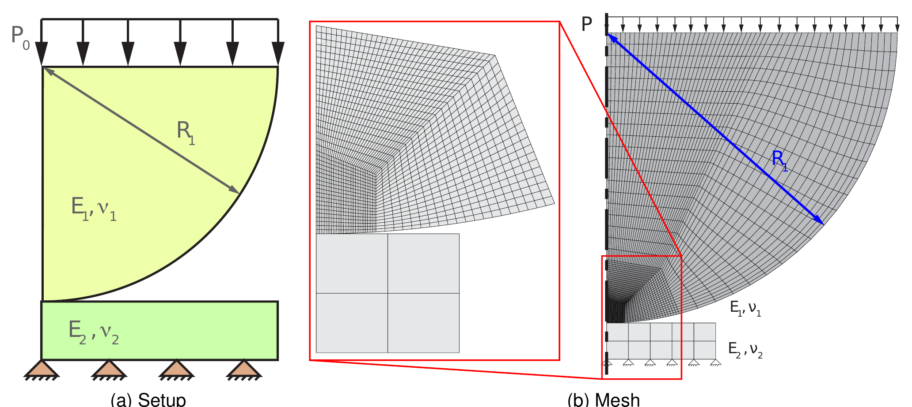

<em>Figure: Setup for the 2D sphere–plane Hertz benchmark: (a) setup, (b) mesh (thesis Fig. 4.49).</em>

**Reference solution.** The analytical solution (thesis eq. 4.85) gives the contact pressure over the contact zone of radius $$b$$ and the vertical displacement of the contact interface:

$$E_{\text{eff}} = \frac{1}{\dfrac{1-\nu_1^2}{E_1} + \dfrac{1-\nu_2^2}{E_2}}\,,\qquad r = \sqrt{x^2 + y^2}$$

$$b = \sqrt[3]{\frac{3 P \pi R^3 (1-\nu^2)}{4 E_{\text{eff}}}}\,,\qquad p_0 = 3P\frac{R^2}{2b^2}\,,\qquad d_0 = \frac{b^2}{R}\,,\qquad f_0 = \sqrt[3]{\left(E_{\text{eff}}\sqrt{R d_0^3}\right)^4}$$

$$p_n = p_0\sqrt{1 - \frac{r^2}{b^2}}\,,\qquad y = -\frac{2}{3}\,p_0\,\pi\,b^2\sqrt{\left(1-\frac{r^2}{b^2}\right)^3}$$

**Results.** Several mesh sizes were compared (Figs. 4.50 and 4.51, series "Sim. 30-15" to "Sim. 30-480"). The displacement solution converges even for very coarse meshes, while the pressure is more difficult to converge, particularly at the contact frontier; the thesis notes that the finest mesh does not necessarily give the best pressure and that intermediate meshes present better results. This is seen most clearly in the error plots of Fig. 4.51, where the displacement error is negligible away from the axis and the pressure error concentrates at the edge of the contact zone.

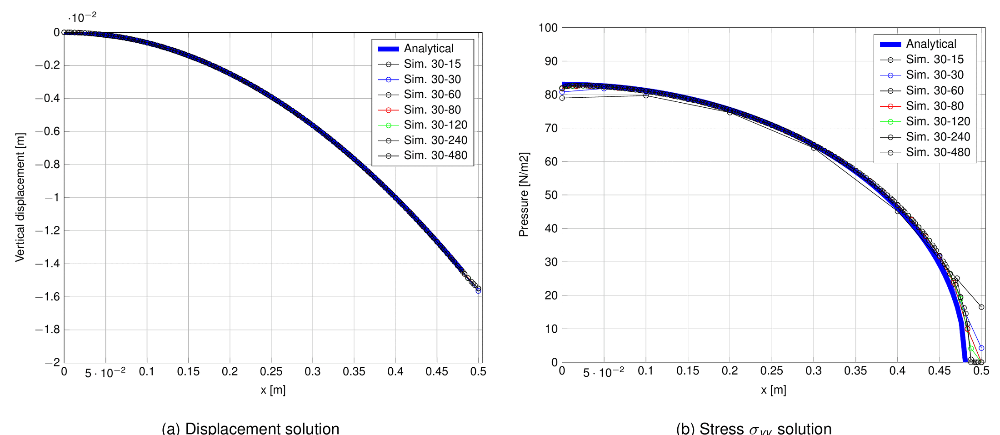

<em>Figure: Solution compared for different mesh sizes for the 2D Hertz plane–sphere contact: (a) displacement, (b) stress $$\sigma_{yy}$$ (thesis Fig. 4.50).</em>

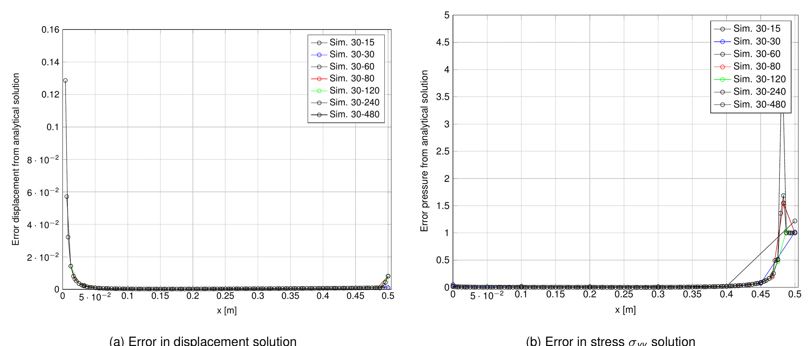

<em>Figure: Error compared for different mesh sizes for the 2D Hertz plane–sphere contact (thesis Fig. 4.51).</em>

**Where to find it.** The axisymmetric version is `ALMHertzSphereTestContact` / `ComponentsALMHertzSphereTestContact` (`ALM_frictionless_contact_test_2D/hertz_sphere_plate_test_parameters.json`), which are **disabled** in the runner (`# FIXME: This test requires the axisymmetric to work (memory error, correct it)`). The plane-strain cylinder-on-rigid-plane versions are active: `ALMHertzSimpleSphereTestContact` and `ComponentsALMHertzSimpleSphereTestContact` (nightly, `simple_hertz_sphere_plate_test_parameters.json`, 326 nodes, dynamic, one step) and `ALMHertzSimpleTestContact` / `ComponentsALMHertzSimpleTestContact` (validation, `hertz_simple_test_parameters.json`, 3556 nodes, $$E = 200$$ Pa hemisphere on a $$E = 2 \times 10^{12}$$ Pa plate, checking `AUGMENTED_NORMAL_CONTACT_PRESSURE` against `hertz_simple_test_results_LM.json`). A step-by-step walk-through of the 2D case is the [Hertz 2D tutorial](../Usage/Tutorial_Hertz_2D.html).

### 2D cylinder–cylinder (§4.5.4.1.2)

**Setup (thesis Table 4.8).** Two infinite cylinders (not to be confused with spheres) coming into contact (thesis Fig. 4.52), with $$q = 0.05851$$ Pa (tangential load), $$p = 0.625$$ Pa (normal load) and $$R = 8$$ m.

| Body | $$E$$ | $$\nu$$ | $$\mu$$ |
|---|---|---|---|
| Upper cylinder | 200 Pa | 0.3 | 0.2 |
| Lower cylinder | 200 Pa | 0.3 | 0.2 |

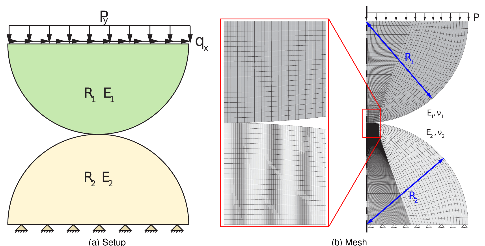

<em>Figure: Setup for the two cylinders Hertz benchmark: (a) setup, (b) mesh (thesis Fig. 4.52).</em>

**Frictionless case (§4.5.4.1.2.1).** With $$\mu = 0$$ the normal contact pressure follows the classical Hertz distribution (thesis eq. 4.86):

$$b = 2\sqrt{\frac{2R^2 p\,(1-\nu^2)}{E\pi}}\,,\qquad p_n = \frac{4Rp}{\pi b^2}\sqrt{b^2 - x^2}$$

The displacement and $$\sigma_{yy}$$ fields are shown in Fig. 4.53; the comparison with the analytical solution is presented together with the frictional one.

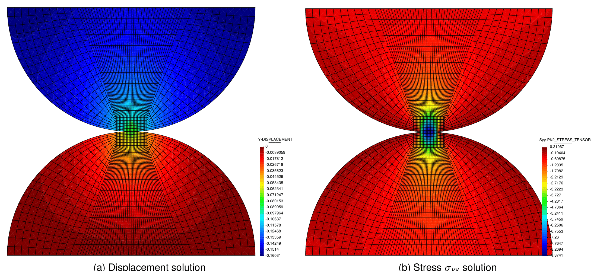

<em>Figure: Solution for the two cylinders frictionless Hertz benchmark: (a) displacement, (b) stress $$\sigma_{yy}$$ (thesis Fig. 4.53).</em>

**Frictional case (§4.5.4.1.2.2).** The reference is taken from Wang et al. and Gitterle; the normal pressure is again eq. 4.86 and the tangential traction follows (thesis eq. 4.87), with a central stick zone of half-width $$c$$ and slip in the annulus $$c \lt \vert x \vert \le b$$:

$$c = b\sqrt{1 - \frac{q}{\mu p}}\,,\qquad p_t = \begin{cases} \mu\dfrac{4Rp}{\pi b^2}\left(\sqrt{b^2-x^2} - \sqrt{c^2-x^2}\right) & \text{if } \vert x \vert \le c \\[2ex] \mu\dfrac{4Rp}{\pi b^2}\sqrt{b^2-x^2} & \text{if } c \lt \vert x \vert \le b \end{cases}$$

Figure 4.54 compares normal and tangential tractions for three meshes (coarse, medium, fine) with the analytical curves, showing very good agreement; the kink of the tangential traction at $$x = c$$ (stick–slip transition) is captured.

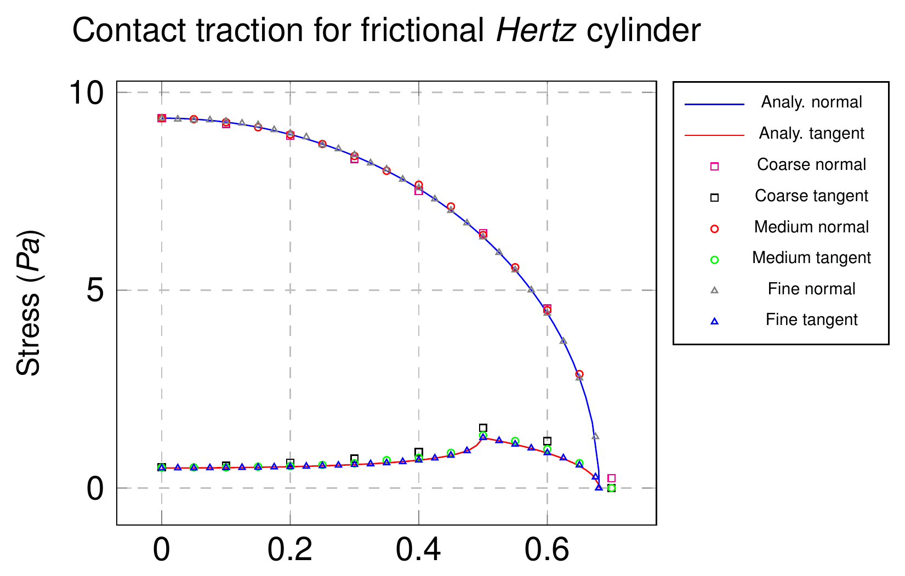

<em>Figure: Solution for the two cylinders frictional Hertz benchmark (thesis Fig. 4.54).</em>

**Where to find it.** Frictionless: `ALMHertzCompleteTestContact` and `ComponentsALMHertzCompleteTestContact` (validation, `ALM_frictionless_contact_test_2D/hertz_complete_test_parameters.json`): two cylinders of $$R = 8$$ m (mesh spanning $$x \in [-8, 8]$$, $$y \in [0, 16]$$, 3342 nodes), `LinearElasticPlaneStrain2DLaw` with $$E = 200$$ Pa and $$\nu = 0.3$$, two static steps. Frictional: `ALMHertzTestFrictionalContact` (validation, gated on `ConstitutiveLawsApplication`, `ALM_frictional_contact_test_2D/hertz_complete_test_parameters.json`, 10086 nodes, `KirchhoffSaintVenantPlaneStrain2DLaw`, $$\mu = 0.2$$, checks `DISPLACEMENT` and `VECTOR_LAGRANGE_MULTIPLIER` components). Not published in the Examples repository.

### 3D plane–sphere (§4.5.4.2.1)

**Setup (thesis Table 4.9).** The 3D counterpart of the axisymmetric case: a sphere of 12.2474 m diameter under $$p = 5 \times 10^{5}$$ Pa, two mesh sizes (Fig. 4.55 shows the finer one), solved in one static step.

| Body | $$E$$ | $$\nu$$ |
|---|---|---|
| Sphere | $$1 \times 10^{8}$$ Pa | 0.29 |
| Plane | $$2.1 \times 10^{11}$$ Pa | 0.29 |

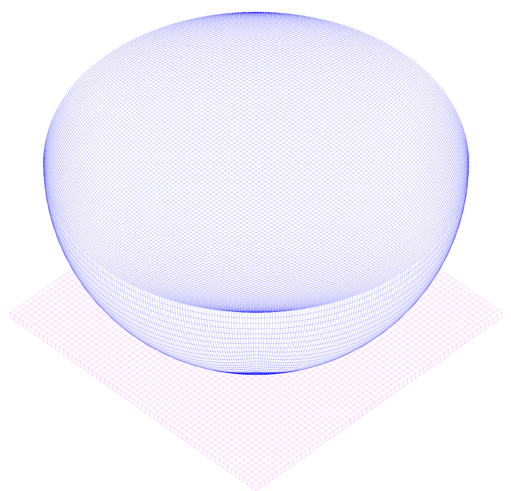

<em>Figure: Mesh considered for the 3D Hertz plane–sphere (thesis Fig. 4.55).</em>

**Results.** Displacement and von Mises stress are shown in Fig. 4.56. For the displacement a very good agreement with the analytical solution is obtained for both meshes, particularly for the refined one (Fig. 4.57a); for the contact pressure the finer mesh gives the better approximation (Fig. 4.57b). The error plots (Fig. 4.58) show the displacement error dropping from about $$7 \times 10^{-2}$$ to below $$10^{-2}$$ with refinement and the pressure error concentrating, as in 2D, at the border of the contact area.

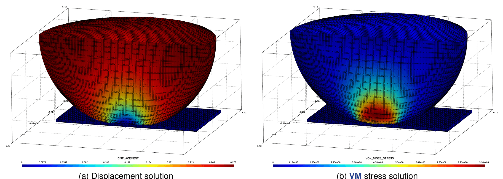

<em>Figure: Solution for the 3D Hertz plane–sphere contact: (a) displacement, (b) von Mises stress (thesis Fig. 4.56).</em>

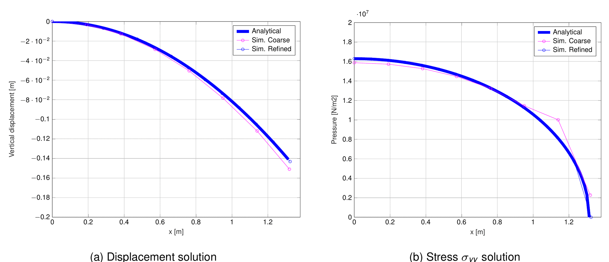

<em>Figure: Solution compared for different mesh sizes for the 3D Hertz plane–sphere contact (thesis Fig. 4.57).</em>

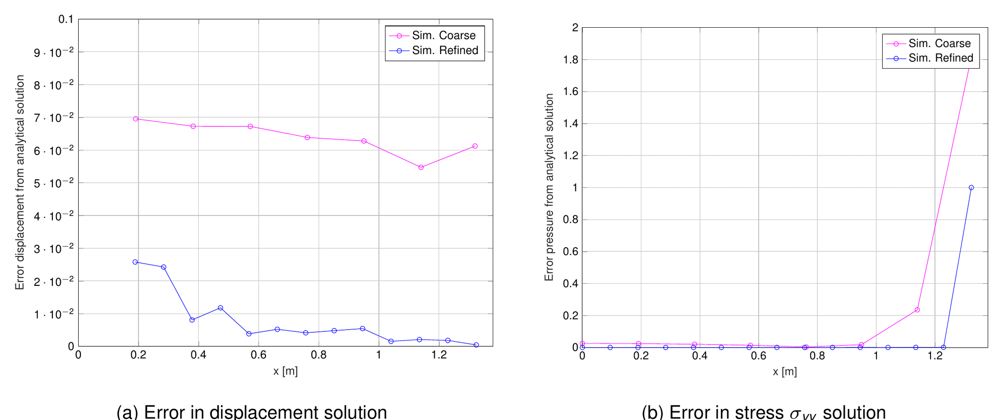

<em>Figure: Error compared for different mesh sizes for the 3D Hertz plane–sphere contact (thesis Fig. 4.58).</em>

**Where to find it.** Not in the repository test suite (too large for CI). Examples repository: [validation/hertz](https://github.com/KratosMultiphysics/Examples/tree/master/contact_structural_mechanics/validation/hertz) (author V. Mataix Ferrándiz, "Kratos version: current head"; two meshes, fine and coarse; the README reproduces the comparison plots `hertz1.png`–`hertz4.png`).

<em>Figure: Geometry of the 3D plane–sphere Hertz example (Examples repository, <code>validation/hertz</code>).</em>

### 3D sphere–sphere (§4.5.4.2.2)

**Setup (thesis Table 4.10).** Two hemispheres of 12.2474 m diameter under an applied pressure $$q = 1.0 \times 10^{3}$$ Pa, transformed into the force of the reference solution with $$F = q\,\pi D^2/4$$; one static step.

| Body | $$E$$ | $$\nu$$ |
|---|---|---|
| Upper body | $$1 \times 10^{8}$$ Pa | 0.29 |
| Lower body | $$1 \times 10^{6}$$ Pa | 0.29 |

**Reference solution.** Besides the qualitative comparison with the reference solution of Zhu (thesis Fig. 4.59, not reproduced here), the radius of the contact area and the maximum contact pressure are compared with the analytical values (thesis eq. 4.88):

$$P_{\max} = \frac{3F}{2\pi a^2}\,,\qquad a = \sqrt[3]{\frac{3F\left[\dfrac{1-\nu_1^2}{E_1} + \dfrac{1-\nu_2^2}{E_2}\right]}{4\left(\dfrac{1}{R_1} + \dfrac{1}{R_2}\right)}}$$

**Results (thesis eq. 4.89).** With $$F = 1.0 \times 10^{3} \cdot \pi \cdot 12.2474^2/4 = 117808.787$$ N, the contact radius is $$a = 0.6301$$ m versus $$0.627$$ m analytical (0.5 % error) and the maximum pressure $$P_{\max} = 1.41641 \times 10^{5}$$ Pa versus $$1.435467 \times 10^{5}$$ Pa (1.3 % error); the maximal error is therefore around 1 %. Displacement and von Mises stress are shown in Fig. 4.60.

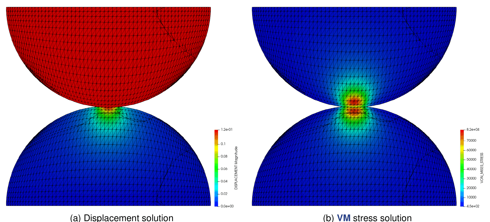

<em>Figure: Solution for two hemispheres Hertz contact: (a) displacement, (b) von Mises stress (thesis Fig. 4.60).</em>

**Where to find it.** Not in the repository test suite. Examples repository: [validation/hertz_full](https://github.com/KratosMultiphysics/Examples/tree/master/contact_structural_mechanics/validation/hertz_full) (author V. Mataix Ferrándiz; the README states the same $$a$$ and $$P_{\max}$$ comparison and links the Hertz contact calculator used as reference).

<em>Figure: Von Mises stress of the sphere–sphere Hertz example (Examples repository, <code>validation/hertz_full</code>).</em>

## Teeth model (thesis §4.5.5)

**Purpose.** A simplified model of a tooth with different layers pressed by a rigid punch. Two models are compared, enamel–composite (Fig. 4.61a) and enamel–dentine–composite (Fig. 4.61b), to determine the benefit of the additional layer of dentine as a reinforcement of the composed structure.

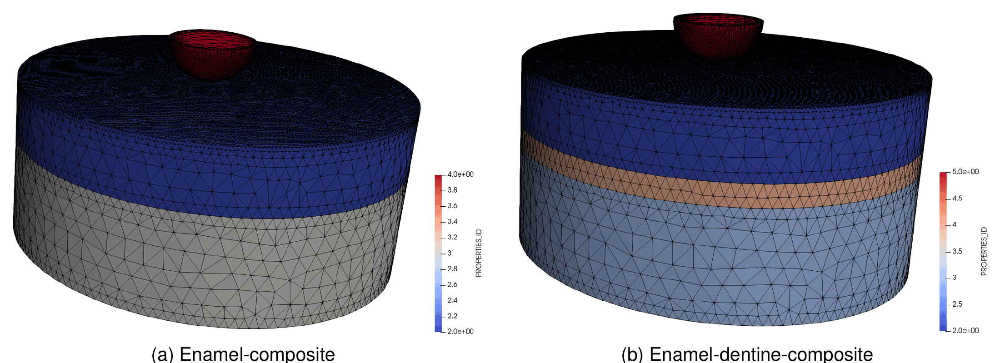

<em>Figure: Teeth layers model: (a) enamel–composite, (b) enamel–dentine–composite (thesis Fig. 4.61).</em>

**Setup (thesis Table 4.11).**

| Body | $$E$$ | $$\nu$$ |
|---|---|---|
| Punch | $$2.069 \times 10^{11}$$ Pa | 0.29 |
| Enamel (color 3) | $$8 \times 10^{10}$$ Pa | 0.3 |
| Dentine (color 4) | $$2 \times 10^{10}$$ Pa | 0.3 |
| Composite (color 2) | $$1.03 \times 10^{10}$$ Pa | 0.3 |

**Results.** Figure 4.62 compares the displacement and von Mises stress of the two alternatives; the comparison makes visible the advantage of the additional dentine layer, which spreads the stress under the indentation.

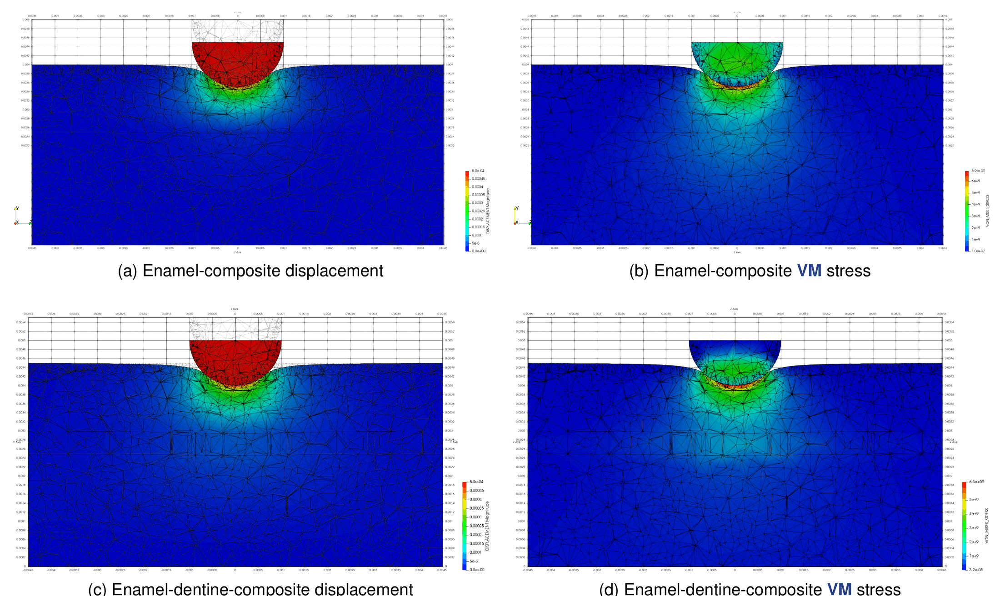

<em>Figure: Solution for the teeth layers model: (a, b) enamel–composite displacement and VM stress, (c, d) enamel–dentine–composite displacement and VM stress (thesis Fig. 4.62).</em>

**Where to find it.** Not in the repository test suite. Examples repository: [use_cases/tooth_model](https://github.com/KratosMultiphysics/Examples/tree/master/contact_structural_mechanics/use_cases/tooth_model) (author V. Mataix Ferrándiz; the README lists the layers with densities $$3.2 \times 10^{5}$$ for the tooth layers and $$7.85 \times 10^{3}$$ for the press).

<em>Figure: Von Mises stress of the enamel–dentine–composite model (Examples repository, <code>use_cases/tooth_model</code>).</em>

## Energy conservation (thesis §4.5.6)

**Purpose.** To show the energy conservation of a frictionless contact simulation. A ring of 2 m outer and 1.8 m inner diameter contains a cylinder of 0.4 m diameter; the problem is fully 3D with 0.1 m thickness in $$z$$ and the cylinder is subjected only to its own weight. The inner cylinder is much softer than the ring, which can be considered rigid from a practical point of view.

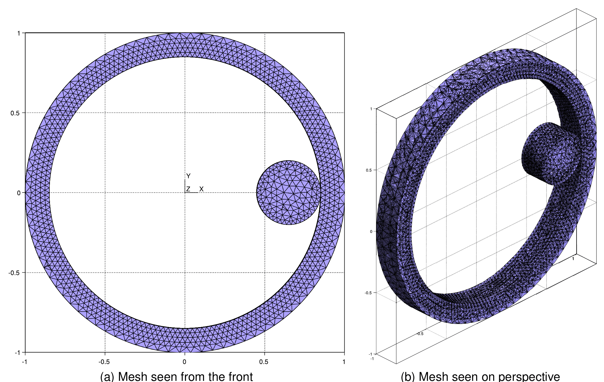

<em>Figure: Energy conservation test, cylinder inside ring: (a) front view, (b) perspective (thesis Fig. 4.63).</em>

**Setup (thesis Table 4.12).**

| Body | $$E$$ | $$\nu$$ | $$\rho$$ |
|---|---|---|---|
| Ring | $$2.069 \times 10^{11}$$ Pa | 0.29 | 7850 |
| Cylinder | $$2 \times 10^{8}$$ Pa | 0.29 | 1000 |

**Reference solution.** With the only degree of freedom being the angle $$\theta$$ between the cylinder and the center (initially $$\theta = 0$$, $$h = 0.7$$ m, $$v = 0$$), the total energy of the cylinder of mass $$m = 0.2^2\pi \times 0.1 \times 1000 = 4\pi$$ kg is (thesis eq. 4.90)

$$E_{\text{tot}} = E_{\text{kin}} + E_{\text{pot}} = h\,m\,g + \tfrac{1}{2} m v^2 = 0.7 \times 4\pi \times 9.81 = 86.2632\ \text{J}\,,\qquad v_{\max} = \sqrt{\frac{2E_{\text{tot}}}{m}} = 3.7\ \text{m/s}$$

Expressing the velocity as $$v = R\dot{\theta}$$ with $$R = 0.7$$ m and $$h = R(1 - \sin\theta)$$, the motion is governed by (thesis eq. 4.91)

$$E_{\text{tot}} = R(1-\sin\theta)\,m g + \tfrac{1}{2} m (R\dot{\theta})^2\,,\qquad \dot{\theta} = \sqrt{\frac{2g}{R}\sin\theta}$$

whose solution involves the Jacobi elliptic amplitude function $$\operatorname{am}$$,

$$\theta = \frac{1}{2}\left(\pi - 4\operatorname{am}\left(\frac{1}{4}\left(-c_1\sqrt{\frac{2g}{R}} + t\left(-\sqrt{\frac{2g}{R}}\right)\right)\Bigg\vert\, 2\right)\right)\,,\qquad c_1 = -0.990539$$

**Results.** Figure 4.64 compares the displacement of the center of gravity and the kinetic, potential and total energies with the analytical solution; the error is below 1 %. Figure 4.65 shows that at the predicted time the cylinder returns to its original position and the loop starts over, the maximum velocity coincides with the predicted $$v_{\max}$$ and, as expected for a frictionless case, there is no rotation: the contact point between cylinder and ring is always the same. The energy is preserved despite the numerical dissipation of the Bossak scheme.

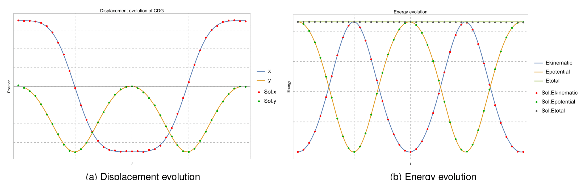

<em>Figure: Evolution of displacement and energy compared with the analytical solution (thesis Fig. 4.64).</em>

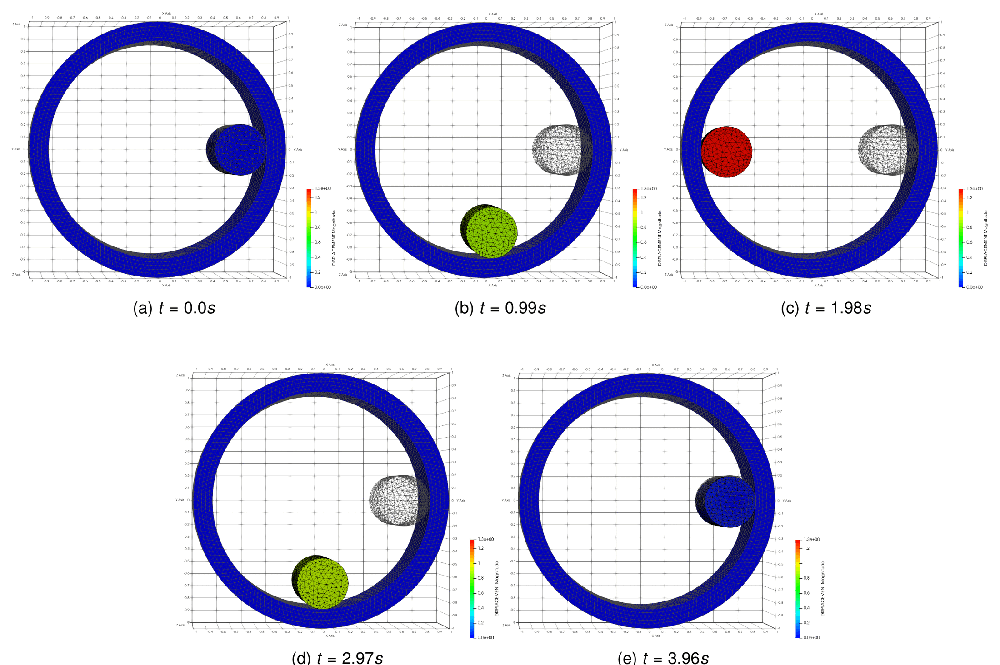

<em>Figure: Solution of the problem at $$t = 0.0, 0.99, 1.98, 2.97, 3.96$$ s (thesis Fig. 4.65).</em>

**Where to find it.** Not in the repository test suite. Examples repository: [use_cases/in_ring](https://github.com/KratosMultiphysics/Examples/tree/master/contact_structural_mechanics/use_cases/in_ring) (author V. Mataix Ferrándiz).

<em>Figure: Animation of the cylinder-in-ring example (Examples repository, <code>use_cases/in_ring</code>).</em>

## Double arc benchmark (thesis §4.5.7)

**Purpose.** The crushing of a hyperelastic bi-material half-ring on a hyperelastic base. The test involves large displacements, large deformations and large sliding coupled with contact/non-contact transitions. The reference solutions are taken from Drouet (2015) and Poulios & Renard (2015).

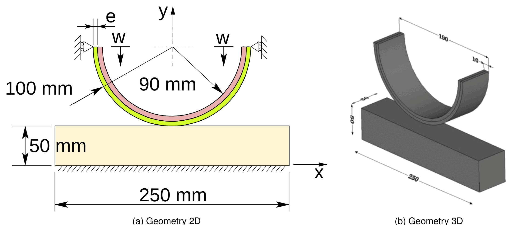

<em>Figure: Double arc benchmark: (a) geometry 2D, (b) geometry 3D (thesis Fig. 4.66).</em>

**Setup (thesis Table 4.13).** Half-ring of two materials (external diameter 190 mm, inner 170 mm) on a base of length 250 mm and height 50 mm; a vertical displacement of $$-90$$ mm is imposed at each end of the half-ring and the bottom of the base is fixed. The variables of interest are the vertical displacement of the middle of the half-ring as a function of the loading step (60 steps from the onset of contact, about 1.16 mm per step) and the contact pressure. Both materials are Neo-Hookean; the time step is 0.0005 s for a total time of 0.2 s, the imposed displacement growing as $$0.4t$$. For the frictional case $$\mu = 0.5$$.

| Body | $$E$$ | $$\nu$$ |
|---|---|---|
| First arc | $$3 \times 10^{8}$$ Pa | 0.32 |
| Second arc | $$1 \times 10^{9}$$ Pa | 0.32 |
| Support material | $$1 \times 10^{11}$$ Pa | 0.3 |

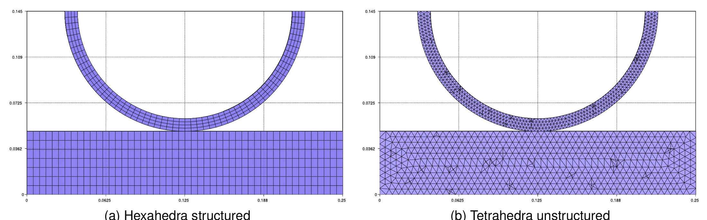

<em>Figure: Double arc meshes: (a) hexahedra structured, (b) tetrahedra unstructured (thesis Fig. 4.67).</em>

### Frictionless (§4.5.7.1)

The problem was solved with an unstructured tetrahedral mesh and a structured hexahedral mesh (fine and coarse). The deformation sequence (Fig. 4.68) shows the arc first flattening on the base, then buckling upward in the middle. Compared with the reference (Fig. 4.69), the hexahedral meshes deviate from the reference only in the last steps, where the deformation is larger and finally stabilizes; the tetrahedral mesh shows more differences (higher deformation in general, except for the last stages). In any case the results are in very good agreement with the reference solution.

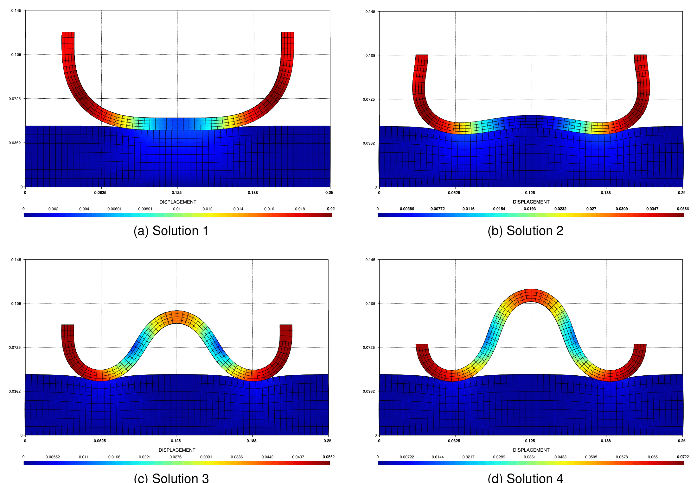

<em>Figure: Displacement solution for the frictionless double arc benchmark (thesis Fig. 4.68).</em>

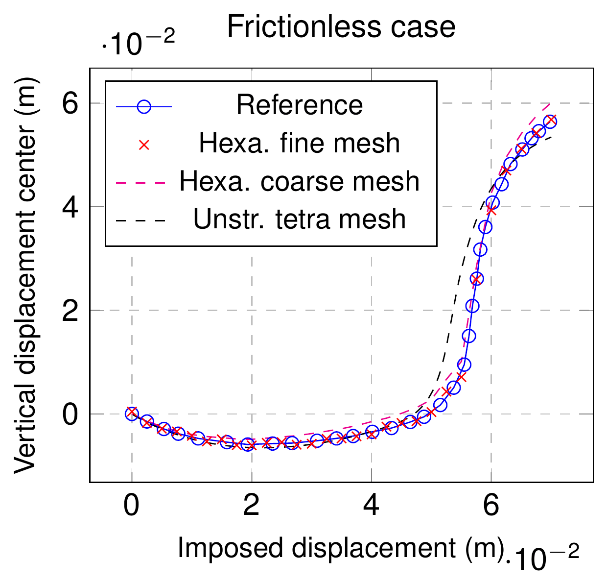

<em>Figure: Compared solution for the frictionless double arc benchmark (thesis Fig. 4.69).</em>

### Frictional (§4.5.7.2)

With $$\mu = 0.5$$ the arc deforms differently (Fig. 4.70): friction opposes the sliding of the arc ends on the base and the arc bulges as a whole. The comparison with the literature (Fig. 4.71) shows differences aligned with those already seen in the frictionless case.

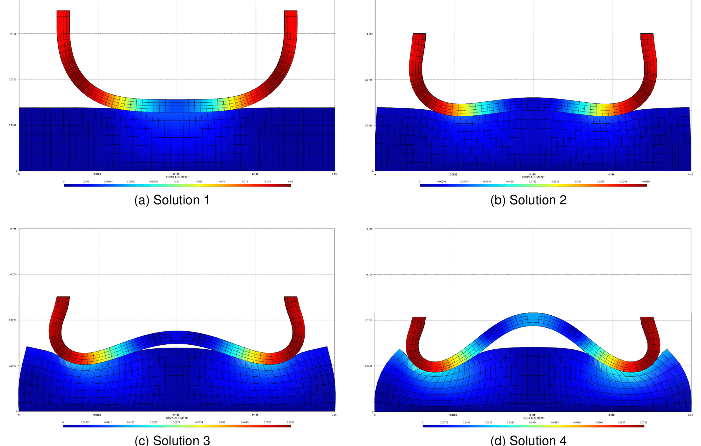

<em>Figure: Displacement solution for the frictional double arc benchmark (thesis Fig. 4.70).</em>

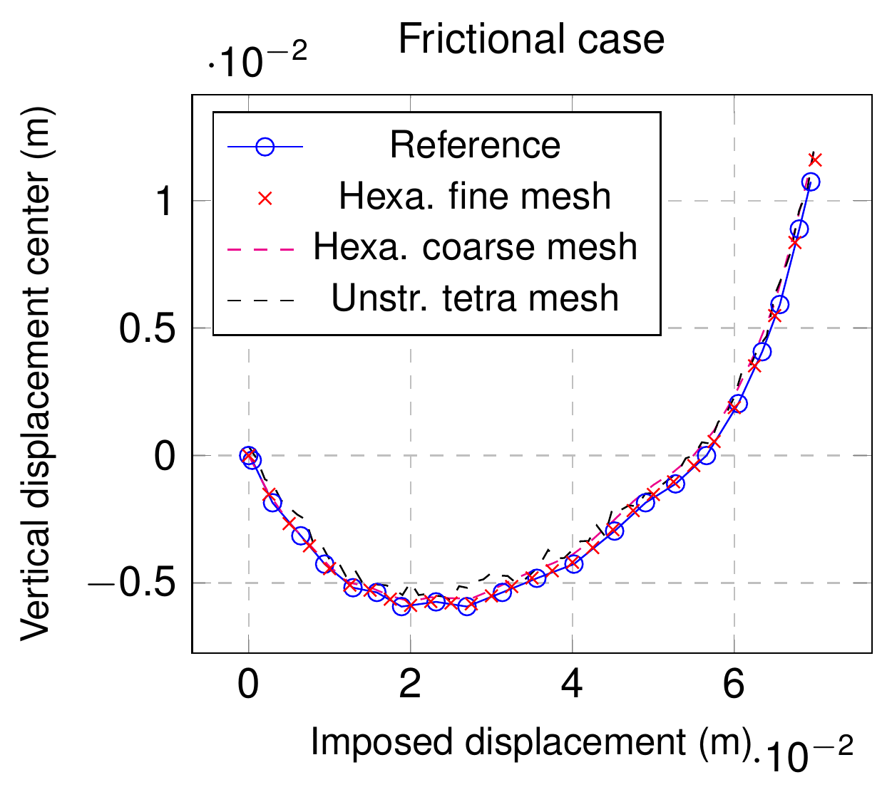

<em>Figure: Compared solution for the frictional double arc benchmark (thesis Fig. 4.71).</em>

**Where to find it.** Not in the repository test suite. Examples repository: [validation/double_arch](https://github.com/KratosMultiphysics/Examples/tree/master/contact_structural_mechanics/validation/double_arch) (author V. Mataix Ferrándiz, "Kratos version: development branch, expected 5.3"; the README gives $$\nu = 0.3$$ for the three materials and reproduces the comparison plots with Drouet and Poulios & Renard).

 

<em>Figure: Frictionless (left) and frictional (right) double arch animations (Examples repository, <code>validation/double_arch</code>).</em>

## Arc pressing block (thesis §4.5.8)

**Purpose.** An arc pressed against a block, both deformable and hyperelastic (Neo-Hookean), formulated in the updated Lagrangian (UL) framework. Three stiffness ratios are studied: rigid block, deformable block and deformable block with rigid arc. The imposed displacement is $$u_y = t$$ with $$t \in [0, 1]$$ for the first two cases and $$t \in [0, 1.775]$$ for the rigid arc.

**Setup (thesis Table 4.14).**

| Body | Constitutive law | $$E$$ | $$\nu$$ |
|---|---|---|---|
| Arc (rigid block) | Neo-Hookean | $$68.96 \times 10^{8}$$ Pa | 0.32 |
| Block (rigid block) | Neo-Hookean | $$68.96 \times 10^{7}$$ Pa | 0.32 |
| Arc (deformable block) | Neo-Hookean | $$68.96 \times 10^{8}$$ Pa | 0.32 |
| Block (deformable block) | Neo-Hookean | $$68.96 \times 10^{5}$$ Pa | 0.32 |
| Arc (deformable block – rigid arc) | Neo-Hookean | $$68.96 \times 10^{9}$$ Pa | 0.32 |
| Block (deformable block – rigid arc) | Neo-Hookean | $$68.96 \times 10^{5}$$ Pa | 0.32 |

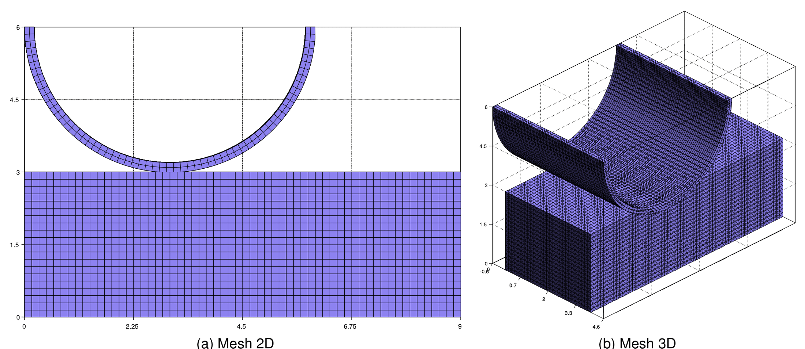

<em>Figure: Arc pressing block: (a) mesh 2D, (b) mesh 3D (thesis Fig. 4.72).</em>

**Results.** Figure 4.73 summarizes the solution for each stiffness ratio. The effect of the relative stiffness is evident: with a deformable block and a rigid arc (Fig. 4.73b) the block absorbs all the deformation, whereas with a rigid block (Fig. 4.73c) all the deformation lies in the arc.

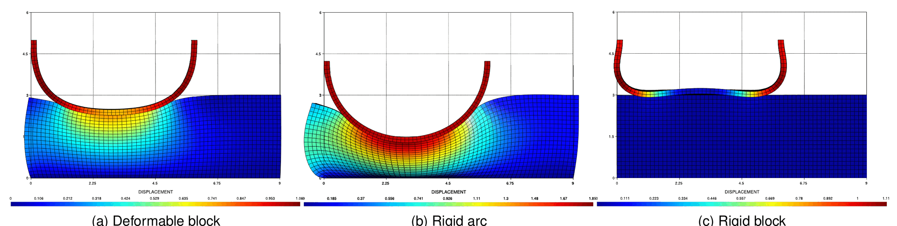

<em>Figure: Solution for different stiffness between the arc and the block: (a) deformable block, (b) rigid arc, (c) rigid block (thesis Fig. 4.73).</em>

**Where to find it.** Not in the repository test suite. Examples repository: [use_cases/arc_block](https://github.com/KratosMultiphysics/Examples/tree/master/contact_structural_mechanics/use_cases/arc_block) (author V. Mataix Ferrándiz; `HyperElastic3DLaw`, the three material combinations of Table 4.14 and one animation per case).

<em>Figure: Deformable block case (Examples repository, <code>use_cases/arc_block</code>).</em>

## Hyperelastic tubes (thesis §4.5.9)

**Purpose.** Two crossed hyperelastic cylinders (Poulios & Renard 2015) in finite deformation, UL framework. A vertical displacement $$u_z = -0.01\,t$$ is imposed on the upper cylinder during $$t \in [0, 4]$$ in 100 steps. The cylinders come into contact and, in addition, the inner ring of the upper cylinder develops **self-contact**.

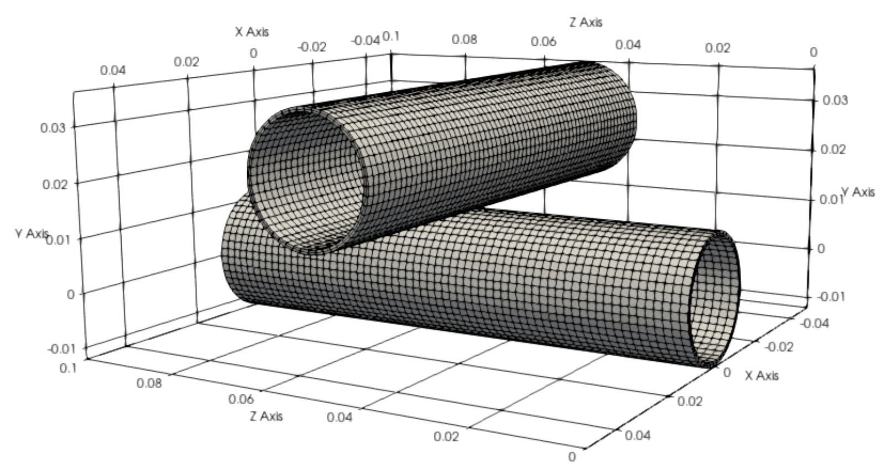

<em>Figure: Mesh for hyperelastic tubes (thesis Fig. 4.74).</em>

**Setup (thesis Table 4.15).**

| Body | Constitutive law | $$E$$ | $$\nu$$ |
|---|---|---|---|
| Upper cylinder | Neo-Hookean | 10000 Pa | 0.3 |
| Lower cylinder | Neo-Hookean | 100000 Pa | 0.3 |

**Results.** Figure 4.75 shows the displacement at $$t = 1, 2, 3, 4$$ s, the upper (softer) tube wrapping around the stiffer lower one. The slice of the final configuration (Fig. 4.76) shows the flattened section of the upper tube, where self-contact arises, and the von Mises stress.

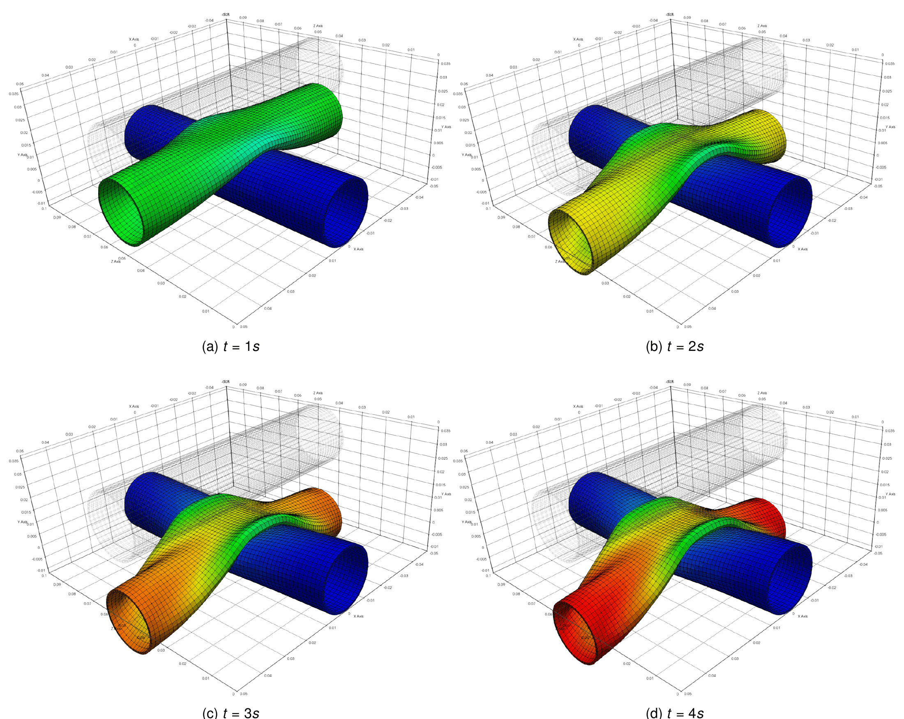

<em>Figure: Displacement solution for hyperelastic tubes at $$t = 1, 2, 3, 4$$ s (thesis Fig. 4.75).</em>

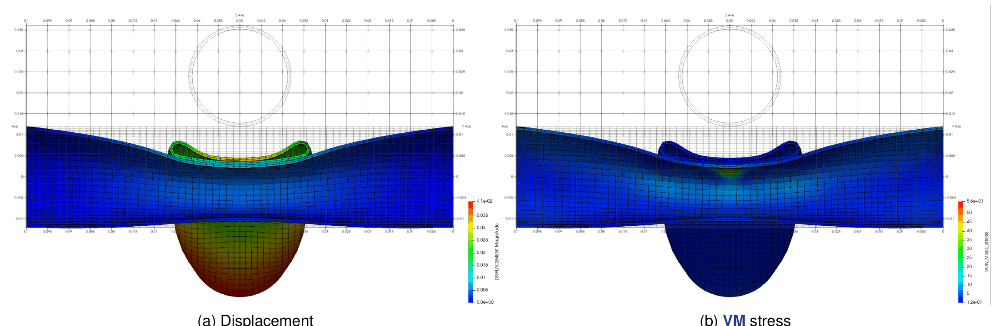

<em>Figure: Slice solution for hyperelastic tubes: (a) displacement, (b) von Mises stress (thesis Fig. 4.76).</em>

**Where to find it.** Not in the repository test suite as such; the self-contact machinery is covered by `ALMSelfContactContactTest` / `ComponentsALMSelfContactContactTest` (validation, `ALM_frictionless_contact_test_3D/self_contact_test_parameters.json`, the S-shaped profile of thesis §4.4) and by the `SelfContactUtilities1/2/3` C++ tests. Examples repository: [use_cases/hyperelastic_tubes](https://github.com/KratosMultiphysics/Examples/tree/master/contact_structural_mechanics/use_cases/hyperelastic_tubes) (author V. Mataix Ferrándiz) and, for the S-shape, [use_cases/self_contact](https://github.com/KratosMultiphysics/Examples/tree/master/contact_structural_mechanics/use_cases/self_contact).

<em>Figure: Hyperelastic tubes, half-model animation (Examples repository, <code>use_cases/hyperelastic_tubes</code>).</em>

## Contacting cylinders (thesis §4.5.10)

**Purpose.** Two deformable hemicylinders in large deformation with Neo-Hookean behavior. Two movements are applied at the base of the upper cylinder, first horizontal and then vertical; the relative position of the hemicylinders changes slightly between the two configurations. The problem is revisited in the adaptive remeshing chapter of the thesis (§6.10.5), see [Adaptive remeshing](../Examples/Adaptive_Remeshing.html).

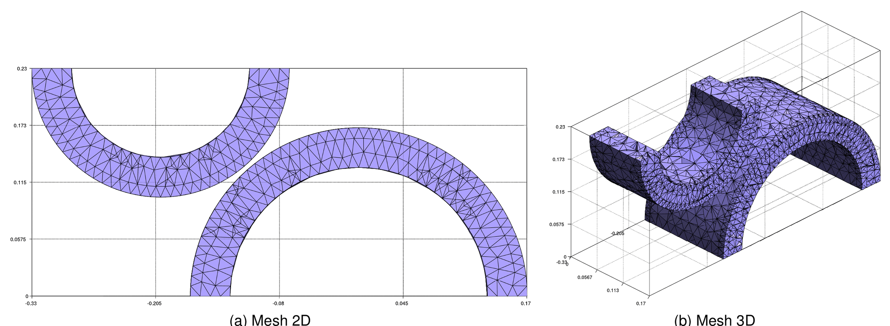

<em>Figure: Contacting cylinders mesh: (a) mesh 2D, (b) mesh 3D (thesis Fig. 4.77).</em>

**Setup (thesis Table 4.16).**

| Body | Constitutive law | $$E$$ | $$\nu$$ |
|---|---|---|---|
| Upper cylinder | Neo-Hookean | $$2.1 \times 10^{11}$$ Pa | 0.29 |
| Lower cylinder | Neo-Hookean | $$2.1 \times 10^{11}$$ Pa | 0.29 |

### Horizontal movement (§4.5.10.1)

A horizontal displacement $$u_x = 0.2\,t$$ is imposed for $$t \in [0, 2.5]$$ s in 1000 steps, both frictionless and frictional ($$\mu = 1$$). The difference of behavior between both cases is notorious (Fig. 4.78): the frictionless upper cylinder slides over the lower one, while with friction the lower cylinder is dragged and bent. The reaction at the base of the lower hemicylinder for the frictionless case (Fig. 4.79) grows while the cylinders press against each other and vanishes once they separate.

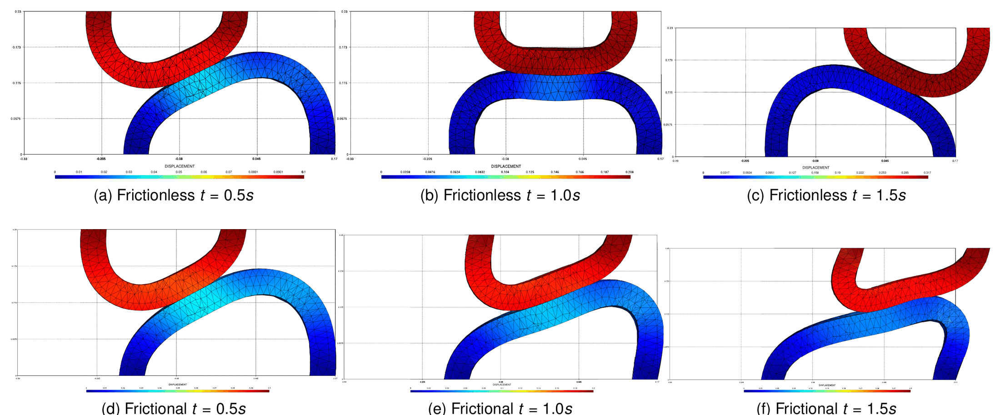

<em>Figure: Solution for contacting cylinders with horizontal movement, frictionless (a–c) and frictional (d–f) (thesis Fig. 4.78).</em>

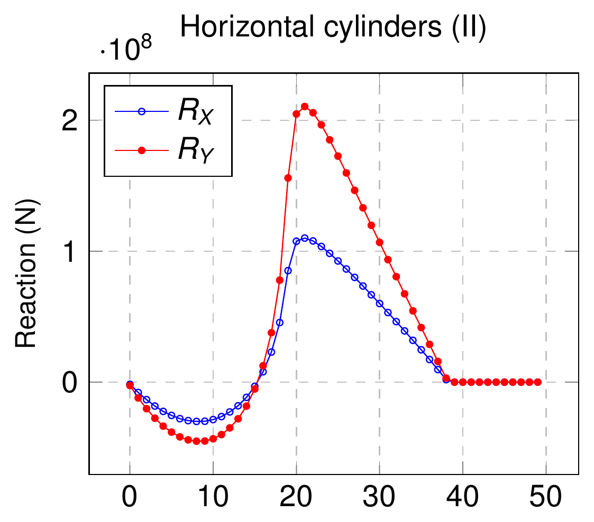

<em>Figure: Frictionless reaction solution in the lower cylinder for the horizontal movement (thesis Fig. 4.79).</em>

### Vertical movement (§4.5.10.2)

A vertical displacement $$u_y = 0.1\,t$$ is imposed for $$t \in [0, 1]$$ s in 200 steps. Figure 4.80 shows the deformation and Fig. 4.81 the reaction at the base of the still hemicylinder.

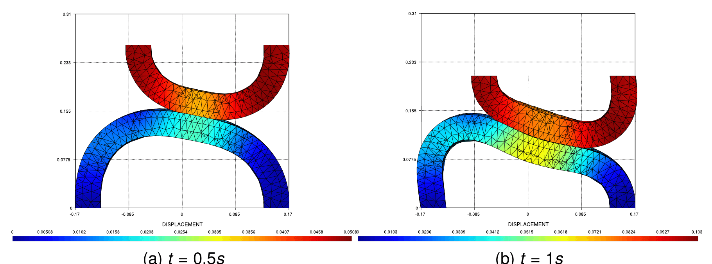

<em>Figure: Solution for contacting cylinders with vertical movement (thesis Fig. 4.80).</em>

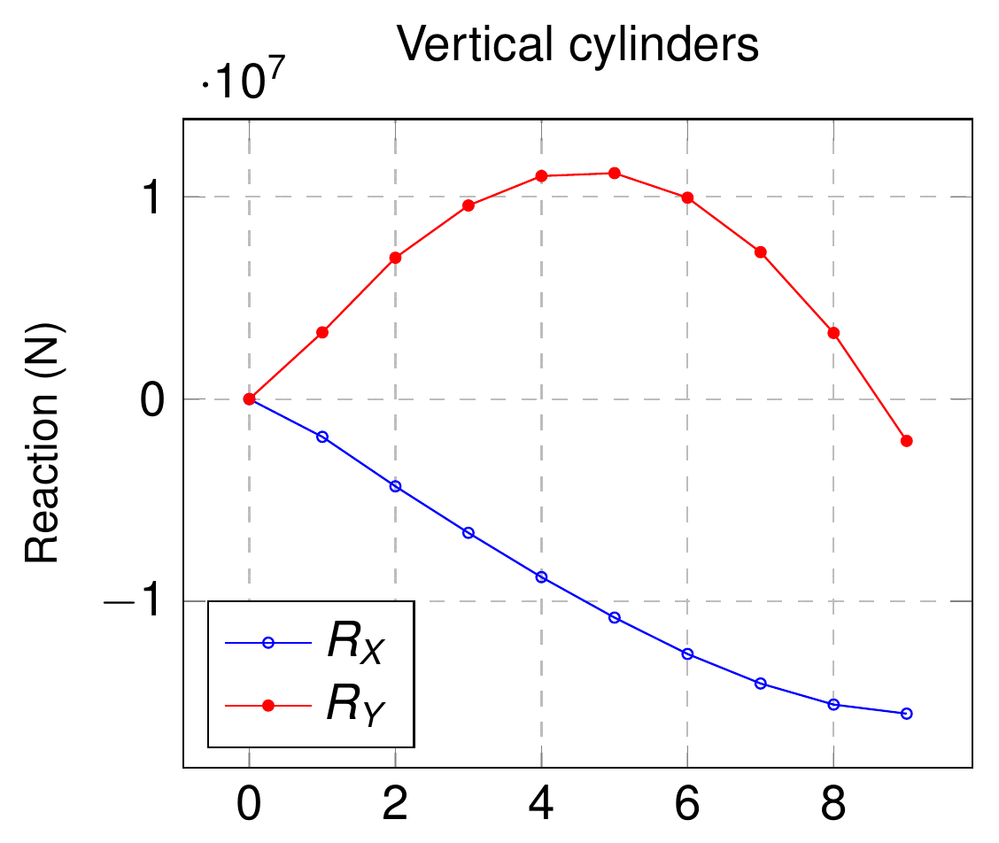

<em>Figure: Reaction solution in the lower cylinder for the vertical movement (thesis Fig. 4.81).</em>

**Where to find it.** Not in the repository test suite. Examples repository: [use_cases/cylinders](https://github.com/KratosMultiphysics/Examples/tree/master/contact_structural_mechanics/use_cases/cylinders) (authors V. Mataix Ferrándiz and A. Cornejo Velázquez; three meshes: vertical movement, horizontal movement I and II, the latter frictionless and frictional with $$\mu = 1$$). The adaptive-remeshing versions of this case that used to live in the `mmg_remeshing_examples` folder are no longer available on the master branch of the Examples repository.

 

<em>Figure: Horizontal movement (II), frictionless (left) and frictional (right) (Examples repository, <code>use_cases/cylinders</code>).</em>

## Press fit (thesis §4.5.11)

**Purpose.** The numerical simulation of the press-fit of a block into a channel, following Fischer & Wriggers (2006) and Dias et al. (2015). Neo-Hookean compressible hyperelasticity is used for both components, which allows evaluating the contact element in a frictional problem with large deformation and sliding. The symmetry of the problem is exploited and only half of the domain is simulated.

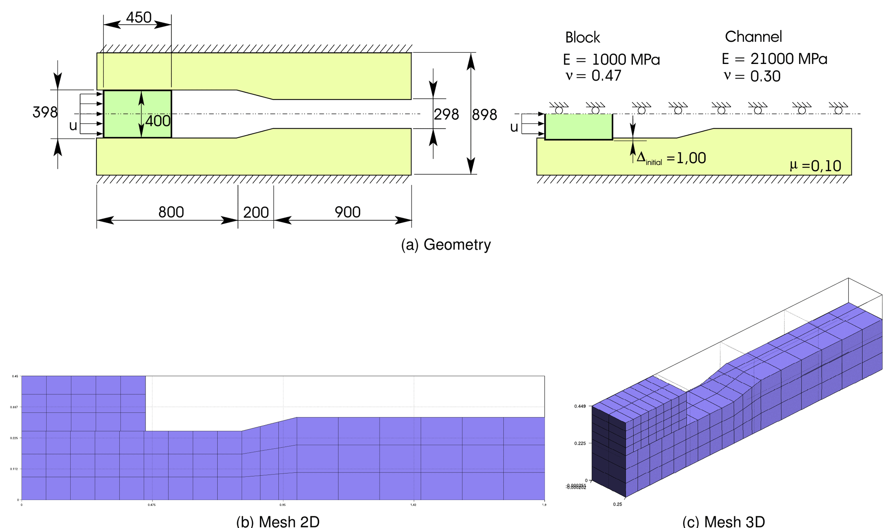

<em>Figure: Press fit problem: (a) geometry, (b) mesh 2D, (c) mesh 3D (thesis Fig. 4.82).</em>

**Setup (thesis Table 4.17).** Geometry as in Fig. 4.82a (block 450 mm long and 400 mm high, channel of 800 + 200 + 900 mm with a step from 398 to 298 mm of half-height, total height 898 mm); the block is higher than the channel, which imposes an initial penetration $$\Delta_{\text{initial}} = 1$$ mm and hence an initial contact stress.

| Body | $$E$$ | $$\nu$$ | $$\mu$$ |
|---|---|---|---|
| Die | $$68.96 \times 10^{8}$$ Pa | 0.32 | 0.1 |
| Block | $$68.96 \times 10^{7}$$ Pa | 0.32 | 0.1 |

The process is modeled by a non-homogeneous boundary condition $$u = 1000$$ mm on the left face of the block. The first time step uses $$u = 0$$ mm and the program generates the normal stress necessary to satisfy the non-penetration condition, separating the bodies in contact; afterwards the displacement is applied. Plane strain and UL formulation are used in 2D; the 3D setup is an extrusion of 250 mm and has no reference to compare with.

**Reference solution and results.** The horizontal reaction versus time steps is compared with the reference in Fig. 4.83; the values obtained are slightly higher than the reference, with the same evolution (rise while the block enters the narrowing, peak around step 100 and plateau once the block is fully inside). The 2D deformation sequence is shown in Fig. 4.84, the 3D one in Fig. 4.85 together with the horizontal reaction at the westernmost points of the base support.

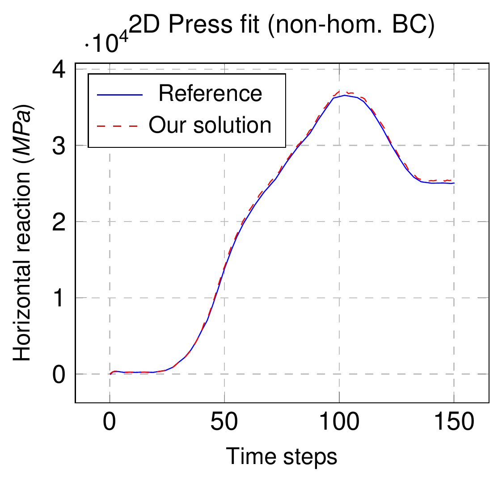

<em>Figure: Solution for 2D press fit compared with reference (thesis Fig. 4.83).</em>

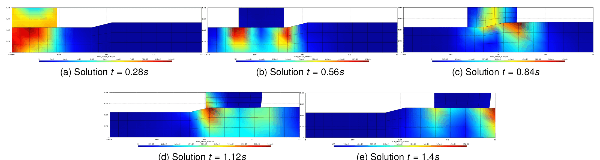

<em>Figure: Press fit 2D solution (thesis Fig. 4.84).</em>

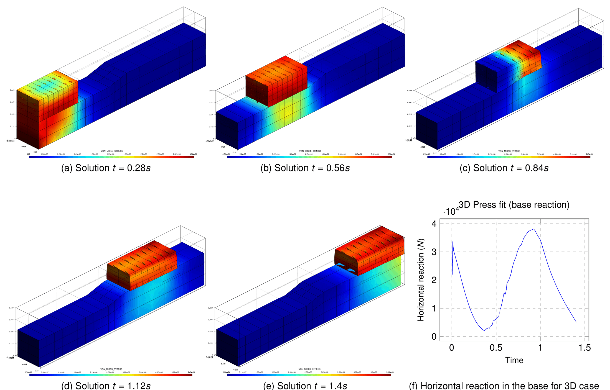

<em>Figure: Press fit 3D solution and horizontal reaction in the base (thesis Fig. 4.85).</em>

**Where to find it.** 3D: `ALMBlockTestFrictionalContact` (validation, gated on `ConstitutiveLawsApplication`, `ALM_frictional_contact_test_3D/friction_block_test_parameters.json`): the half press-fit geometry of Fig. 4.82c in meters ($$x \in [0, 1.9]$$, $$y \in [0, 0.45]$$, $$z \in [0, 0.25]$$, 363 nodes), `HyperElastic3DLaw` with $$E = 2.1 \times 10^{10}$$ Pa, $$\nu = 0.3$$ (channel) and $$E = 1 \times 10^{9}$$ Pa, $$\nu = 0.47$$ (block), i.e. the 21000 MPa / 1000 MPa pair printed in Fig. 4.82a, $$\mu = 0.1$$, dynamic with $$\Delta t = 0.005$$ s up to $$t = 1.4$$ s. The runner marks it `# TODO: Fix this` in the manual debug list. 2D: not in the suite. Examples repository: [validation/press_fit](https://github.com/KratosMultiphysics/Examples/tree/master/contact_structural_mechanics/validation/press_fit) (author V. Mataix Ferrándiz; 2D literature setup and custom 3D setup).

<em>Figure: Press fit setup (Examples repository, <code>validation/press_fit</code>).</em>

 

<em>Figure: Frictional stress evolution, 2D (left) and 3D (right) press fit (Examples repository, <code>validation/press_fit</code>).</em>

## Ironing punch (thesis §4.5.12)

**Purpose.** Two ironing tests, extensively considered in the literature (Fischer & Wriggers 2006, Hartmann et al. 2009, Poulios & Renard 2015): a die is moved along a solid block, which undergoes large deformation in the process. The first case, **circular ironing**, has a fully circular die of higher curvature and is not found in the literature; the second, **shallow ironing**, is the standard test with a die whose bottom edge is a circular arc, solved frictionless and frictional.

### Circular ironing (§4.5.12.1)

**Setup (thesis Table 4.18).** Frictionless only. Geometry as in Fig. 4.86a, structured hexahedral mesh (Figs. 4.86b–c); Neo-Hookean material. A vertical displacement $$u_y = -t$$ is imposed for $$t \in [0, 1]$$ s, then $$u_x = t - 1$$ for $$t \in [1, 10]$$ s keeping the vertical displacement.

| Body | $$E$$ | $$\nu$$ |
|---|---|---|
| Die | $$68.96 \times 10^{8}$$ Pa | 0.32 |
| Block | $$68.96 \times 10^{7}$$ Pa | 0.32 |

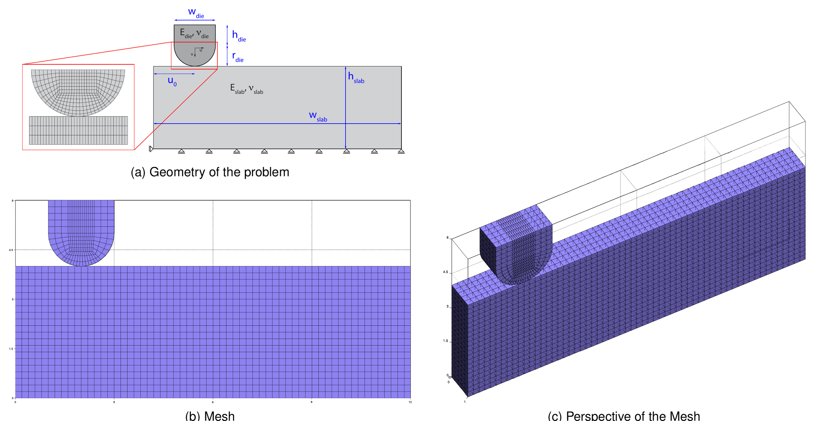

<em>Figure: Circular ironing test: (a) geometry, (b) mesh, (c) perspective of the mesh (thesis Fig. 4.86).</em>

**Results.** Figure 4.87 presents the deformation for $$t = 2.5, 5, 7.5, 10$$ s. Figure 4.88 compares the reactions of the circular and shallow ironing: the vertical reaction $$R_Y$$ of the circular die is slightly higher than the shallow one and both show the sharp rise during the indentation phase, a plateau during sliding and a drop when the die reaches the end of the block; the horizontal reaction $$R_X$$ stays close to zero in both frictionless cases.

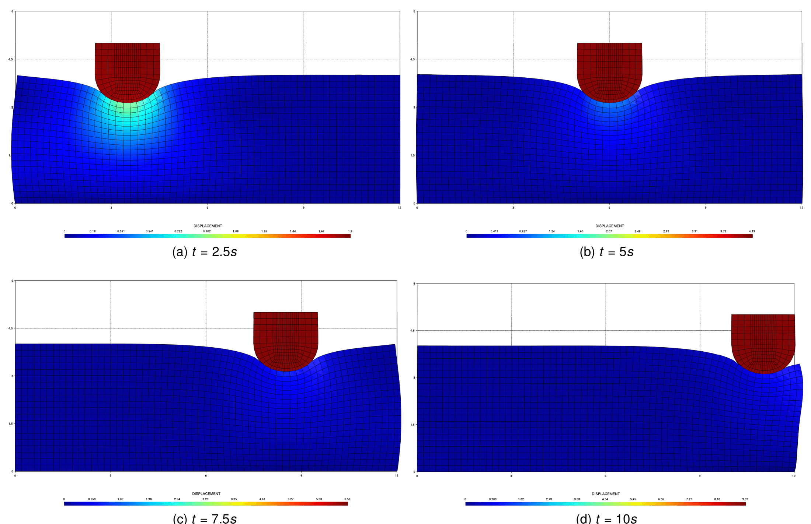

<em>Figure: Circular ironing test solution (thesis Fig. 4.87).</em>

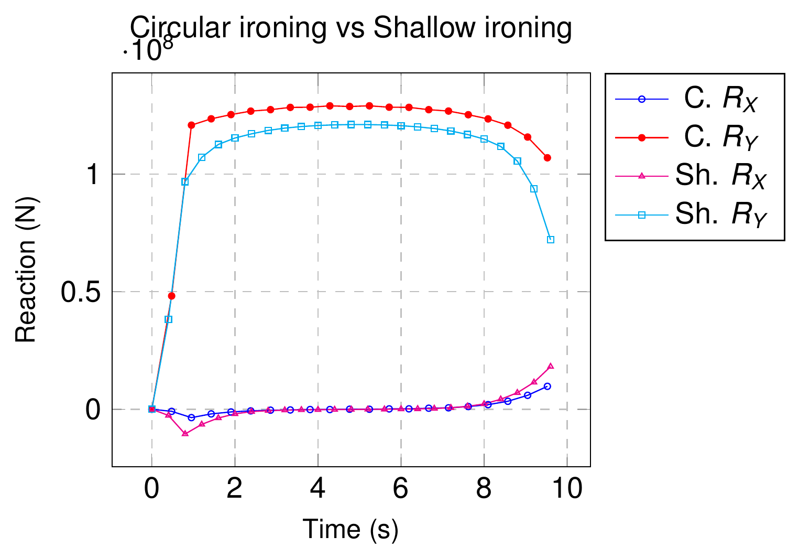

<em>Figure: Comparison between the frictionless solutions of the shallow and the circular ironing (thesis Fig. 4.88).</em>

### Shallow ironing (§4.5.12.2)

**Setup (thesis Table 4.19).** An indenter with a circular-arc bottom edge is pressed against a rectangular block and forced to slide along its length (Fig. 4.89). Neo-Hookean materials. The case is solved fully 3D, although in the literature it is usually a plane strain 2D case. Although the simulation is quasi-static, the load steps are defined as a function of time: for $$t \in [0, 1]$$ s the indenter is moved vertically 1 m into the block; for $$t \in [1, 12]$$ s it is displaced horizontally by 11 m. This loading differs sometimes from the literature, so the results must be translated to the equivalent displacement evolution.

| Body | Constitutive law | $$E$$ | $$\nu$$ | $$\mu$$ |
|---|---|---|---|---|
| Die | Neo-Hookean | $$68.96 \times 10^{8}$$ Pa | 0.32 | 0.3 |
| Block | Neo-Hookean | $$68.96 \times 10^{7}$$ Pa | 0.32 | 0.3 |

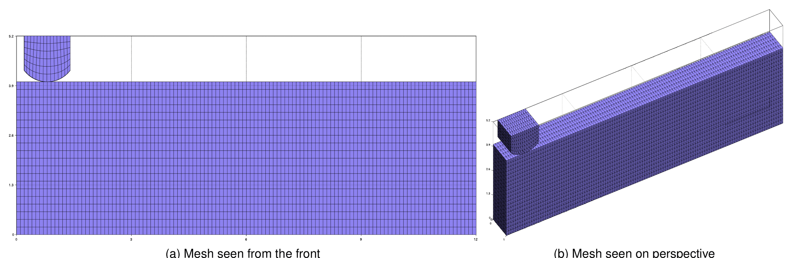

<em>Figure: Shallow ironing test: (a) mesh seen from the front, (b) mesh seen in perspective (thesis Fig. 4.89).</em>

**Reference solution and results.** Figure 4.90 compares the frictionless and frictional solutions at $$t = 2.5$$ and 5 s; the frictional case visibly opposes the movement of the die (the block material is dragged in front of it). Figure 4.91 compares the vertical and horizontal forces with the reference of Poulios & Renard: the agreement is good in both cases, with the frictional horizontal force reaching the Coulomb plateau $$F_x \approx \mu F_y$$ during the sliding phase, so the solution is considered valid.

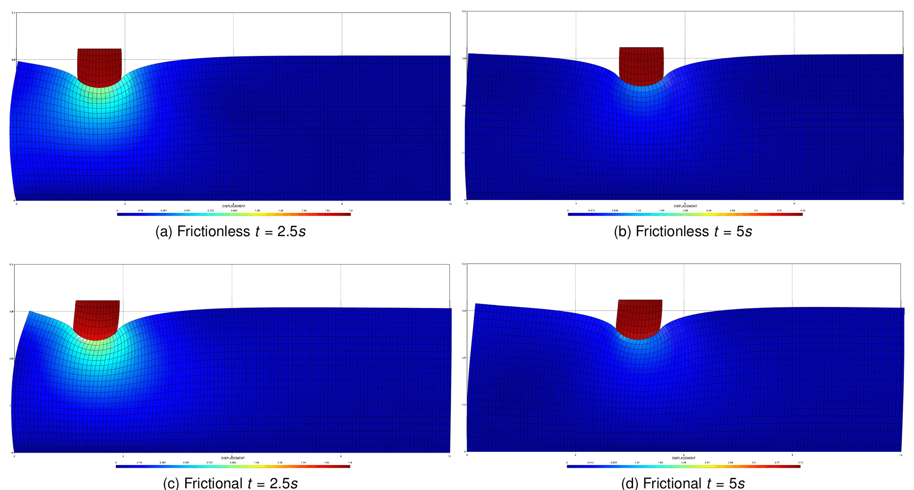

<em>Figure: Shallow ironing test solution, comparing frictional and frictionless cases (thesis Fig. 4.90).</em>

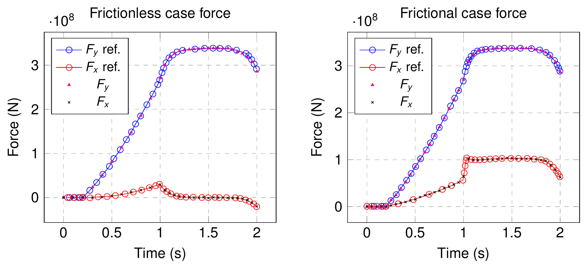

<em>Figure: Reaction solution for shallow ironing test: (a) frictionless, (b) frictional (thesis Fig. 4.91).</em>

**Where to find it.** 2D reduced versions exist in the repository but are **disabled** in the runner (`#validationSuite.addTest(TALMIroningTestContact(...))`, `#validationSuite.addTest(TALMIroningDieTestContact(...))`): `ALMIroningTestContact` (`ALM_frictionless_contact_test_2D/ironing_test_parameters.json`, shallow die, $$12 \times 5.2$$ m block, 2412 nodes, $$\Delta t = 0.0025$$ s up to 20 s) and `ALMIroningDieTestContact` (`ironing_die_test_parameters.json`, circular die, 1732 nodes, $$E = 6896$$ / $$689.6$$ Pa and $$\nu = 0.32$$, $$\Delta t = 0.1$$ s up to 15 s). Examples repository: [validation/shallow_ironing_3D](https://github.com/KratosMultiphysics/Examples/tree/master/contact_structural_mechanics/validation/shallow_ironing_3D) (author V. Mataix Ferrándiz; literature setup via `ProjectParameters_literature.json` and a custom setup with 20 % more vertical displacement) and [use_cases/ironing_with_die_3D](https://github.com/KratosMultiphysics/Examples/tree/master/contact_structural_mechanics/use_cases/ironing_with_die_3D) (circular die; its `comparison.png` is the counterpart of thesis Fig. 4.88).

 

<em>Figure: Shallow ironing (left, <code>validation/shallow_ironing_3D</code>) and circular ironing with die (right, <code>use_cases/ironing_with_die_3D</code>) animations from the Examples repository.</em>

## Taylor patch test: exact integration versus collocation (thesis App. A.2.2.2)

**Purpose.** Appendix A.2.2 of the thesis compares the two ways of integrating the mortar terms: exact segment-based integration (Fig. A.1) and collocation, i.e. a large number of uniformly distributed integration points on the slave element, discarding those falling outside the master (Fig. A.2). Collocation is much simpler to implement (identical in 2D and 3D, no clipping, no segmentation derivatives), so the study quantifies what is lost. The Taylor patch test is used because it has an analytical solution: a continuous displacement field and a constant contact pressure equal to the applied load. The convergence of the augmented pressure $$\bar{\lambda}_n$$ is analyzed because it takes longer to converge than the displacements, which converge even with few integration points (the same conclusion was reached by Farah et al. 2014). The setting is $$E = 1000$$, $$\nu = 0.4$$ and $$p = 10$$ Pa, so the exact value is $$\bar{\lambda}_n = -10$$ Pa.

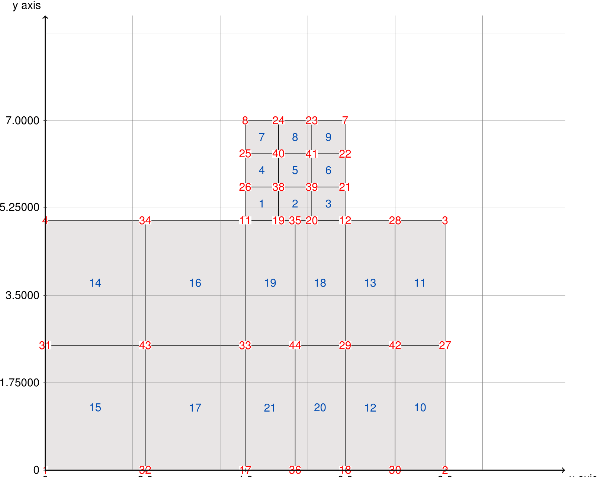

<em>Figure: Taylor patch test (thesis Fig. A.3).</em>

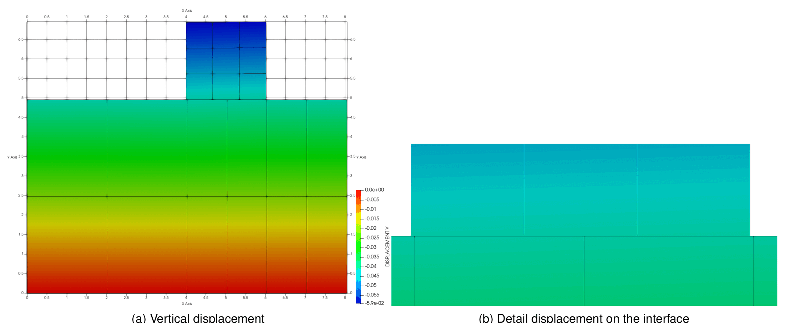

<em>Figure: Displacement on Taylor test: (a) vertical displacement, (b) detail on the interface (thesis Fig. A.4).</em>

**Results.** In the deformed configuration the interface no longer matches (Fig. A.4b), which is the reason why the collocation method has problems converging. Figure A.5 shows the augmented contact pressure obtained with mortar segmentation (exact, $$\bar{\lambda}_n = -10$$ Pa) and with collocation using 200 Gauss points, which look very close. The detailed plots of Fig. A.6 show that the vertical displacement converges to the correct solution with a very small number of integration points (Fig. A.6a), while the augmented pressure (Fig. A.6b) gets closer to the exact value as the number of points grows (10, 20, 50, 100, 200) but never reaches it. This is the reason why exact integration was adopted as the final approach of the application (`"integration_order"` and the exact `MortarUtilities` segmentation, see [Mortar integration and dual Lagrange multipliers](../Theory/Mortar_Integration_And_Dual_Lagrange_Multipliers.html)).

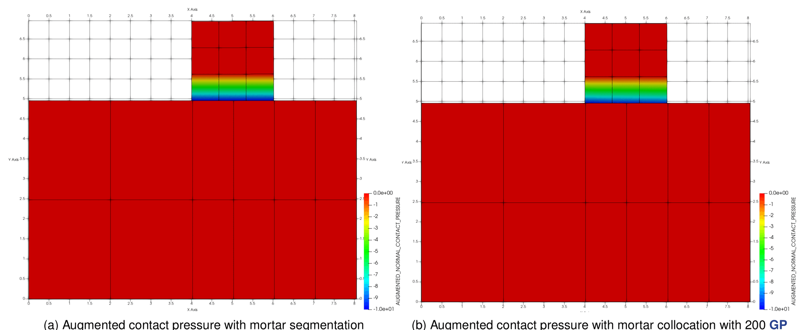

<em>Figure: Compared solution for the augmented contact pressure: (a) mortar segmentation, (b) mortar collocation with 200 GP (thesis Fig. A.5).</em>

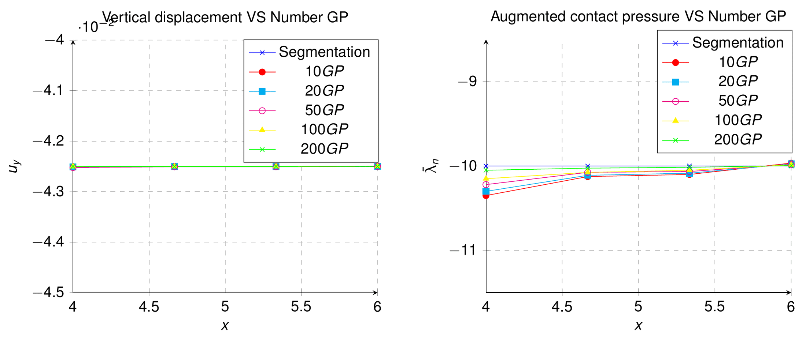

<em>Figure: Convergence of the solution for different number of Gauss points (thesis Fig. A.6).</em>

**Where to find it.** The exact-integration Taylor patch test of this appendix is the `taylor_patch_test` case of the repository (`ALMTaylorPatchTestContact`, nightly; same $$8 \times 7$$ mesh with 37 nodes, $$E = 1000$$ Pa, $$\nu = 0.4$$, plane strain). The collocation alternative is not shipped. The exact integration itself is unit-tested by `MassMatrixIntegrationTriangle`, `MassMatrixIntegrationQuadrilateral`, `MassMatrixIntegrationQuadrilateralDeformed` (`tests/cpp_tests/utilities/test_integration_utilities.cpp`) and by `TestDoubleCurvatureIntegration` (`tests/test_double_curvature_integration.py`).

## Mesh tying example (thesis App. A.3.5)

**Purpose.** The mesh tying formulation of Appendix A.3 (dual Lagrange multipliers enforcing $$\mathbf{u}^1 = \mathbf{u}^2$$ on the interface, statically condensed thanks to the diagonal $$\mathbf{D}$$, see [Mesh tying](../Theory/Mesh_Tying.html)) is verified on an L-shaped solid in which the circular region around the inner corner is treated as a different body. The mesh interface between the solids does not match. Total Lagrangian (TL) framework with Neo-Hookean material. A vertical displacement equal to $$t$$ is applied at the upper corner with $$t \in [0, 2]$$ s; the lower corner is fixed.

**Setup (thesis Table A.1).**

| $$E$$ solid 1 | $$\nu$$ solid 1 | $$E$$ solid 2 | $$\nu$$ solid 2 |
|---|---|---|---|
| $$2 \times 10^{8}$$ Pa | 0.35 | $$2 \times 10^{8}$$ Pa | 0.35 |

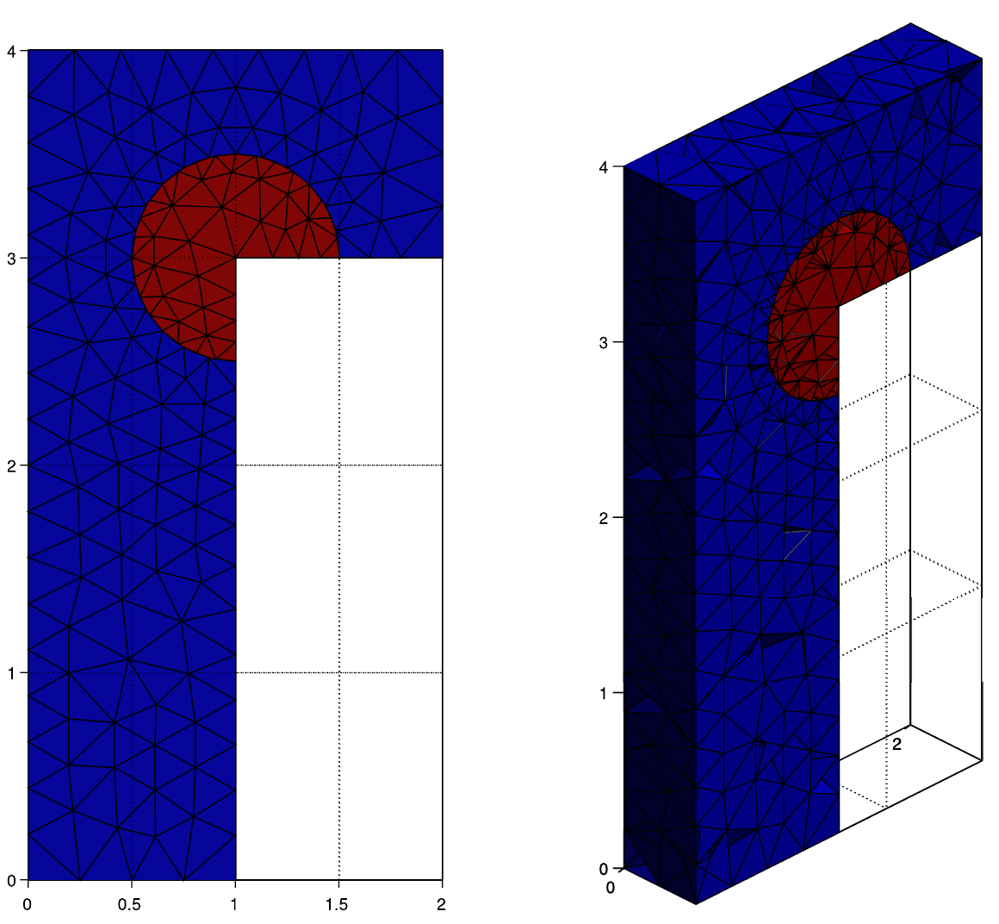

<em>Figure: Mesh tying example: (a) mesh front, (b) mesh perspective (thesis Fig. A.7).</em>

**Results.** The solution at $$t = 0.5, 1.0, 1.5, 2.0$$ s (Fig. A.8) shows that the continuity across the interface is preserved despite the large displacement: from a practical point of view it is like considering a continuous element for the whole domain, which is the type of formulation originally considered in the mortar method for domain decomposition (Wohlmuth 2001).

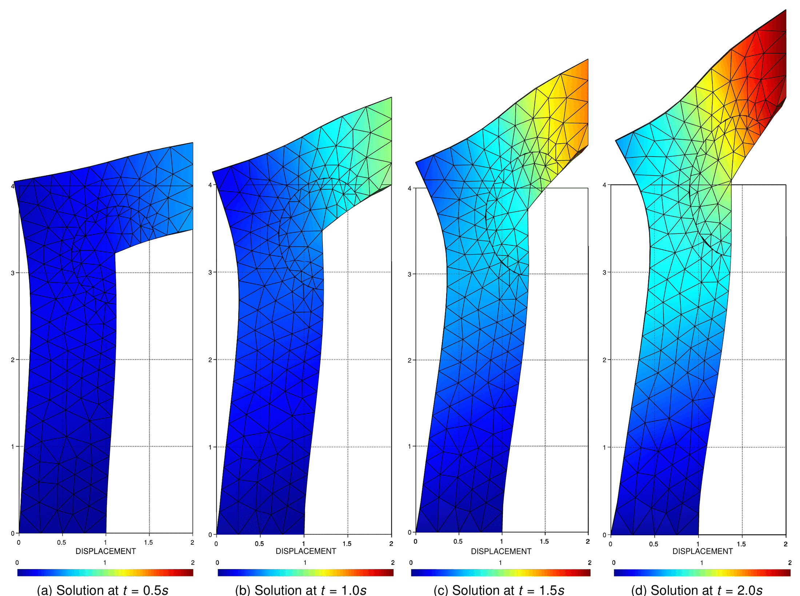

<em>Figure: Solution for mesh tying example at $$t = 0.5, 1.0, 1.5, 2.0$$ s (thesis Fig. A.8).</em>

**Where to find it.** `MeshTyingValidationTest` (validation, gated on `ConstitutiveLawsApplication`, `mesh_tying_test/mesh_tying_validation_test_parameters.json`): the same L-shaped body ($$x \in [0, 2]$$, $$y \in [0, 4]$$, 880 nodes, `HyperElastic3DLaw` with $$E = 2 \times 10^{8}$$ Pa and $$\nu = 0.35$$, `"mortar_type": "ComponentsMeshTying"`, $$\Delta t = 0.1$$ s up to $$t = 2$$ s). The smaller mesh tying patch tests are `SimplePatchTestTwoDMeshTying`, `SimpleSlopePatchTestTwoDMeshTying`, `SimplestPatchTestThreeDMeshTying` (small), `SimplestPatchTestThreeDTriQuadMeshTying`, `SimplestPatchTestThreeDQuadTriMeshTying`, `SimplePatchTestThreeDMeshTying` (nightly) and `LargeDisplacementPatchTestHexa` (validation); the condition itself is unit-tested by `MeshTyingCondition1/2` (`tests/cpp_tests/conditions/test_mesh_tying_condition.cpp`). Not published in the Examples repository.

## Summary: benchmark to test mapping

| Benchmark | Thesis | Repository test class(es) (suite) | Parameters file (relative to `tests/`) | Examples repository |
|---|---|---|---|---|
| Basic patch test, frictionless (straight / slope) | §4.5.1.1, Table 4.4 | `ALMHyperSimplePatchTestContact`, `ALMHyperSimplePatchTrianglesTestContact`, `ALMHyperSimplePatchTestWithEliminationContact`, `ALMHyperSimplePatchTestWithEliminationWithConstraintContact`, `ALMHyperSimpleSlopePatchTestContact` (small) + `ComponentsALM*` twins | `ALM_frictionless_contact_test_2D/hyper_simple_patch_test_parameters.json`, `..._triangles_test_parameters.json`, `..._with_elimination_parameters.json`, `..._with_elimination_with_constraints_parameters.json`, `hyper_simple_slope_patch_test_parameters.json` | – |
| Basic patch test, frictional (slip / stick) | §4.5.1.2 | `ALMHyperSimplePatchFrictionalTestContact`, `ALMHyperSimplePatchFrictionalSlipTestContact`, `ALMHyperSimplePatchFrictionalStickTestContact`, `ALMNoFriction…`, `ALMPerfectStick…`, `ALMThresholdSlip…` (small) | `ALM_frictional_contact_test_2D/hyper_simple_patch_test_parameters.json`, `hyper_simple_slip_patch_test_parameters.json`, `hyper_simple_stick_patch_test_parameters.json`, `no_friction_…`, `perfect_stick_…`, `threshold_slip_…` | – |
| Taylor patch test 2D | §4.5.2.1, Table 4.5; App. A.2.2.2 | `ALMTaylorPatchTestContact`, `ComponentsALMTaylorPatchTestContact` (nightly); `ALMTaylorPatchDynamicTestContact`, `ComponentsALMTaylorPatchDynamicTestContact`, `ALMTaylorPatchFrictionalTestContact` (validation) | `ALM_frictionless_contact_test_2D/taylor_patch_test_parameters.json`, `taylor_patch_dynamic_test_parameters.json`, `ALM_frictional_contact_test_2D/taylor_patch_test_parameters.json` | – |
| Taylor patch test 3D | §4.5.2.2 | (closest) `ALMThreeDPatchNotMatchingTestContact` (nightly), `ThreeDPatchNotMatchingTestContact` (small, MPC) | `ALM_frictionless_contact_test_3D/3D_contact_patch_nonmatching_test_parameters.json`, `mpc_contact_tests/3D_contact_patch_nonmatching_test_parameters.json` | – |
| Friction base test (Dong) | §4.5.3, Table 4.6 | `ALMPureFrictionalTestContact` (nightly) | `ALM_frictional_contact_test_2D/pure_friction_test_parameters.json` | – |
| Hertz 2D plane–sphere | §4.5.4.1.1, Table 4.7 | `ALMHertzSimpleSphereTestContact` (nightly), `ALMHertzSimpleTestContact` (validation) + `ComponentsALM*` twins; `ALMHertzSphereTestContact` (disabled, axisymmetric) | `ALM_frictionless_contact_test_2D/simple_hertz_sphere_plate_test_parameters.json`, `hertz_simple_test_parameters.json`, `hertz_sphere_plate_test_parameters.json` | – (see [Tutorial Hertz 2D](../Usage/Tutorial_Hertz_2D.html)) |
| Hertz 2D cylinder–cylinder, frictionless | §4.5.4.1.2.1, Table 4.8 | `ALMHertzCompleteTestContact`, `ComponentsALMHertzCompleteTestContact` (validation) | `ALM_frictionless_contact_test_2D/hertz_complete_test_parameters.json` | – |
| Hertz 2D cylinder–cylinder, frictional | §4.5.4.1.2.2 | `ALMHertzTestFrictionalContact` (validation, CL-gated) | `ALM_frictional_contact_test_2D/hertz_complete_test_parameters.json` | – |
| Hertz 3D plane–sphere | §4.5.4.2.1, Table 4.9 | – | – | [validation/hertz](https://github.com/KratosMultiphysics/Examples/tree/master/contact_structural_mechanics/validation/hertz) |
| Hertz 3D sphere–sphere | §4.5.4.2.2, Table 4.10 | – | – | [validation/hertz_full](https://github.com/KratosMultiphysics/Examples/tree/master/contact_structural_mechanics/validation/hertz_full) |
| Teeth model | §4.5.5, Table 4.11 | – | – | [use_cases/tooth_model](https://github.com/KratosMultiphysics/Examples/tree/master/contact_structural_mechanics/use_cases/tooth_model) |
| Energy conservation (cylinder in ring) | §4.5.6, Table 4.12 | – | – | [use_cases/in_ring](https://github.com/KratosMultiphysics/Examples/tree/master/contact_structural_mechanics/use_cases/in_ring) |
| Double arc, frictionless / frictional | §4.5.7, Table 4.13 | – | – | [validation/double_arch](https://github.com/KratosMultiphysics/Examples/tree/master/contact_structural_mechanics/validation/double_arch) |
| Arc pressing block | §4.5.8, Table 4.14 | – | – | [use_cases/arc_block](https://github.com/KratosMultiphysics/Examples/tree/master/contact_structural_mechanics/use_cases/arc_block) |
| Hyperelastic tubes | §4.5.9, Table 4.15 | (self-contact path) `ALMSelfContactContactTest`, `ComponentsALMSelfContactContactTest` (validation) | `ALM_frictionless_contact_test_3D/self_contact_test_parameters.json` | [use_cases/hyperelastic_tubes](https://github.com/KratosMultiphysics/Examples/tree/master/contact_structural_mechanics/use_cases/hyperelastic_tubes), [use_cases/self_contact](https://github.com/KratosMultiphysics/Examples/tree/master/contact_structural_mechanics/use_cases/self_contact) |
| Contacting cylinders, horizontal / vertical | §4.5.10, Table 4.16 | – | – | [use_cases/cylinders](https://github.com/KratosMultiphysics/Examples/tree/master/contact_structural_mechanics/use_cases/cylinders) |
| Press fit 2D | §4.5.11, Table 4.17 | – | – | [validation/press_fit](https://github.com/KratosMultiphysics/Examples/tree/master/contact_structural_mechanics/validation/press_fit) |
| Press fit 3D | §4.5.11 | `ALMBlockTestFrictionalContact` (validation, CL-gated) | `ALM_frictional_contact_test_3D/friction_block_test_parameters.json` | [validation/press_fit](https://github.com/KratosMultiphysics/Examples/tree/master/contact_structural_mechanics/validation/press_fit) |
| Circular ironing | §4.5.12.1, Table 4.18 | `ALMIroningDieTestContact` (defined, disabled) | `ALM_frictionless_contact_test_2D/ironing_die_test_parameters.json` | [use_cases/ironing_with_die_3D](https://github.com/KratosMultiphysics/Examples/tree/master/contact_structural_mechanics/use_cases/ironing_with_die_3D) |
| Shallow ironing, frictionless / frictional | §4.5.12.2, Table 4.19 | `ALMIroningTestContact` (defined, disabled) | `ALM_frictionless_contact_test_2D/ironing_test_parameters.json` | [validation/shallow_ironing_3D](https://github.com/KratosMultiphysics/Examples/tree/master/contact_structural_mechanics/validation/shallow_ironing_3D) |
| Taylor patch, exact vs collocation | App. A.2.2.2 | `ALMTaylorPatchTestContact` (nightly, exact integration only) | `ALM_frictionless_contact_test_2D/taylor_patch_test_parameters.json` | – |
| Mesh tying L-shape | App. A.3.5, Table A.1 | `MeshTyingValidationTest` (validation, CL-gated) | `mesh_tying_test/mesh_tying_validation_test_parameters.json` | – |

The test classes live in [SmallTests.py](https://github.com/KratosMultiphysics/Kratos/blob/master/applications/ContactStructuralMechanicsApplication/tests/SmallTests.py), [NightlyTests.py](https://github.com/KratosMultiphysics/Kratos/blob/master/applications/ContactStructuralMechanicsApplication/tests/NightlyTests.py) and [ValidationTests.py](https://github.com/KratosMultiphysics/Kratos/blob/master/applications/ContactStructuralMechanicsApplication/tests/ValidationTests.py); the suite assignment is done in [test_ContactStructuralMechanicsApplication.py](https://github.com/KratosMultiphysics/Kratos/blob/master/applications/ContactStructuralMechanicsApplication/tests/test_ContactStructuralMechanicsApplication.py).

## Reproducing the thesis results

- **Available in the repository test suite** (run with `python3 tests/test_ContactStructuralMechanicsApplication.py -l nightly` or `-l validation`, see [Test suite reference](Test_Suite_Reference.html#running-the-tests)): the basic patch tests (frictionless and frictional, all regimes), the 2D Taylor patch test (static, dynamic, frictional), the Dong friction base test (reduced load and friction coefficient), the 2D Hertz cylinder-on-plane and cylinder–cylinder problems (frictionless and frictional), the 3D press fit (`friction_block_test`) and the mesh tying L-shape. These tests assert against stored nodal results, not against the analytical curves; to reproduce the plots of Figs. 4.48, 4.50–4.54 or A.6 enable the `gid_output_process` block (rename `"_output_processes"` to `"output_processes"` in the parameters file) or add a `json_output_process` on the contact part and post-process `LAGRANGE_MULTIPLIER_CONTACT_PRESSURE` / `AUGMENTED_NORMAL_CONTACT_PRESSURE` and `DISPLACEMENT` along the interface, as explained in [Output and postprocessing](../Usage/Output_And_Postprocessing.html).
- **Defined in the repository but disabled**: the axisymmetric 2D Hertz plane–sphere (`hertz_sphere_plate_test`, memory error, needs the axisymmetric element) and both 2D ironing cases (`ironing_test`, `ironing_die_test`). Their parameter files are complete and can be run by hand from `tests/` with `python3 -c "from ValidationTests import ALMIroningTestContact; import KratosMultiphysics.KratosUnittest as U; U.main()"`-style invocations or, more simply, by temporarily adding them to the `manual_tests` list of the runner.
- **Only in the Examples repository** (`git clone https://github.com/KratosMultiphysics/Examples`, then `python3 MainKratos.py` inside the `source` folder of the case): the 3D Hertz plane–sphere and sphere–sphere, the teeth model, the cylinder in ring, the double arc, the arc pressing block, the hyperelastic tubes, the contacting cylinders, the 2D press fit and the 3D ironing cases. These require the `StructuralMechanicsApplication`, `ContactStructuralMechanicsApplication` and, for hyperelastic materials, the `ConstitutiveLawsApplication`; the double arc README was written for the 5.3 development branch, so its JSON may need the updates listed in [Tips, troubleshooting and limitations](../Usage/Tips_Troubleshooting_And_Limitations.html).
- **Not available**: the collocation variant of the mortar integration used in App. A.2.2.2 (the application only ships the exact segmentation), the 3D Taylor patch test input files, and the adaptive-remeshing versions of the contacting cylinders and Hertz problems that used to be in the `mmg_remeshing_examples` folder of the Examples repository (removed from its master branch).

## References

- R. L. Taylor, P. Papadopoulos, *On a patch test for contact problems in two dimensions*, in: P. Wriggers, W. Wagner (eds.), Nonlinear Computational Mechanics, Springer, 1991.
- Z. Dong, *A solution method for frictional contact problems*, 1999 (friction base test reference of thesis §4.5.3).
- H. Hertz, *Über die Berührung fester elastischer Körper*, J. reine und angewandte Mathematik 92 (1882) 156–171.
- X. Zhu, *Tutorial on Hertz contact stress*, OPTI 521, University of Arizona, 2012.
- M. Gitterle, *A dual mortar formulation for finite deformation frictional contact problems including wear and thermal coupling*, PhD thesis, TU München, 2012.
- G. Drouet, *Méthode locale de type mortar pour le contact dans le cas de maillages incompatibles de degré élevé*, PhD thesis, Université de Toulouse, 2015.
- K. Poulios, Y. Renard, *An unconstrained integral approximation of large sliding frictional contact between deformable solids*, Computers & Structures 153 (2015) 75–90.
- K. A. Fischer, P. Wriggers, *Mortar based frictional contact formulation for higher order interpolations using the moving friction cone*, Comput. Methods Appl. Mech. Engrg. 195 (2006) 5020–5036.
- A. P. C. Dias, A. L. Serpa, M. L. Bittencourt, *High-order mortar-based element applied to nonlinear analysis of structural contact mechanics*, Comput. Methods Appl. Mech. Engrg. 294 (2015) 19–55.
- S. Hartmann, S. Brunssen, E. Ramm, B. Wohlmuth, *Unilateral non-linear dynamic contact of thin-walled structures using a primal-dual active set strategy*, Int. J. Numer. Meth. Engng. 70 (2007) 883–912.
- P. Farah, A. Popp, W. A. Wall, *Segment-based vs. element-based integration for mortar methods in computational contact mechanics*, Computational Mechanics 55 (2015) 209–228.
- B. I. Wohlmuth, *Discretization Methods and Iterative Solvers Based on Domain Decomposition*, Springer, 2001.
- V. Mataix Ferrándiz, *Innovative mathematical and numerical models for studying the deformation of shells during industrial forming processes with the Finite Element Method*, PhD thesis, UPC, 2020 — §4.5, App. A.2.2 and A.3.5.

*Thesis figures © Vicente Mataix Ferrándiz, PhD thesis "Innovative mathematical and numerical models for studying the deformation of shells during industrial forming processes with the Finite Element Method", UPC 2020, reproduced by the author. Figures marked "inspired by" are the author's redrawings of the cited sources.*
