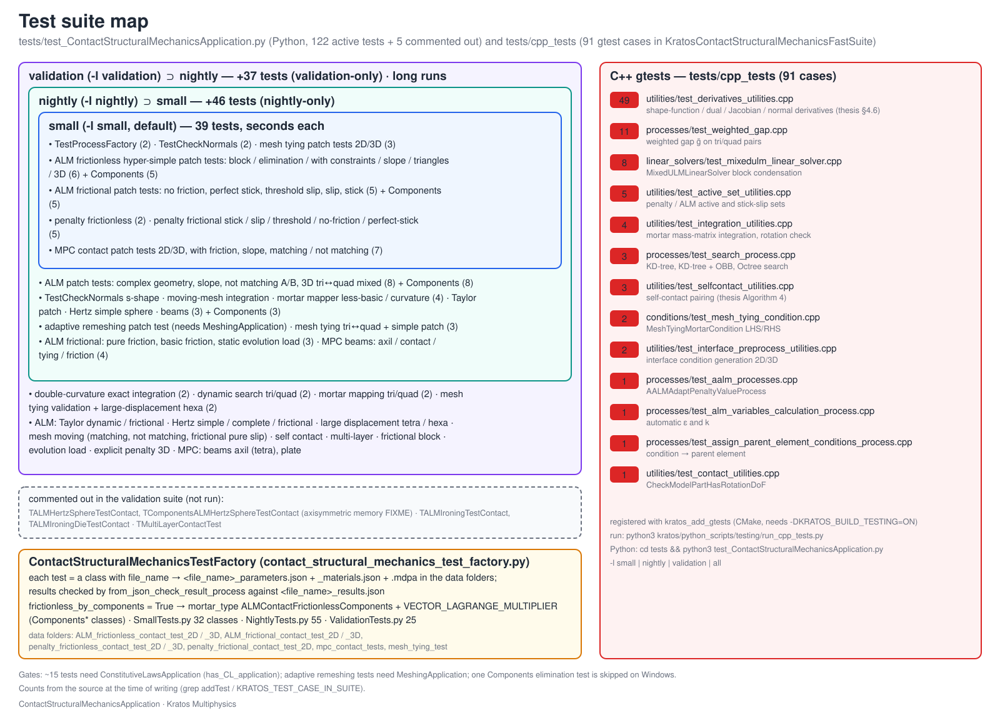

> **Sources.** [`tests/test_ContactStructuralMechanicsApplication.py`](https://github.com/KratosMultiphysics/Kratos/blob/master/applications/ContactStructuralMechanicsApplication/tests/test_ContactStructuralMechanicsApplication.py), [`contact_structural_mechanics_test_factory.py`](https://github.com/KratosMultiphysics/Kratos/blob/master/applications/ContactStructuralMechanicsApplication/tests/contact_structural_mechanics_test_factory.py), `SmallTests.py`, `NightlyTests.py`, `ValidationTests.py`, the stand-alone `test_*.py` files and [`tests/cpp_tests/`](https://github.com/KratosMultiphysics/Kratos/tree/master/applications/ContactStructuralMechanicsApplication/tests/cpp_tests); [`CMakeLists.txt`](https://github.com/KratosMultiphysics/Kratos/blob/master/applications/ContactStructuralMechanicsApplication/CMakeLists.txt) for the gtest registration. Counts were taken from the sources at the time of writing.

<p align="center"></p>
<p align="center"><em>Figure: the nested Python suites, their categories, and the C++ gtest files.</em></p>

## Running the tests

```sh
# Python tests (from applications/ContactStructuralMechanicsApplication/tests/)
python3 test_ContactStructuralMechanicsApplication.py            # small level (default)
python3 test_ContactStructuralMechanicsApplication.py -l nightly
python3 test_ContactStructuralMechanicsApplication.py -l validation
python3 test_ContactStructuralMechanicsApplication.py -l all

# through the global Kratos runner (what the CI does)
python3 kratos/python_scripts/testing/run_python_tests.py -v 2 -l nightly -c python3

# C++ gtests (application configured with -DKRATOS_BUILD_TESTING=ON)
python3 kratos/python_scripts/testing/run_cpp_tests.py
```

Requirements: the compiled `StructuralMechanicsApplication` and `ContactStructuralMechanicsApplication`; about 15 tests are gated on the `ConstitutiveLawsApplication` (`has_CL_application`, detected at run time) and the adaptive-remeshing tests need the `MeshingApplication`. Test data is installed with the Python scripts when `INSTALL_TESTING_FILES=ON`. The application is part of the Linux CI application list (`.github/workflows/ci_apps_linux.json`).

## Organisation

### Suites

`AssembleTestSuites()` fills the standard Kratos suites, nested so that a level always contains the previous one:

| Level | Added tests | Content | Typical duration |
|---|---|---|---|
| `small` | 39 | patch tests of every formulation, normals check, process factory | seconds |
| `nightly` | +46 (85 total) | complex geometries, non-matching and mixed meshes, Taylor and Hertz sphere, beams, integration, mapping, remeshing | minutes |
| `validation` | +37 (122 total) | large problems: Hertz complete, large displacements, mesh moving, self-contact, multi-layer, frictional block, explicit dynamics, dynamic search | tens of minutes |
| `all` | = nightly | alias used by the runner (`validation` also adds `all`) | |

Five validation tests are registered but commented out: `TALMHertzSphereTestContact` and `TComponentsALMHertzSphereTestContact` (`# FIXME: requires axisymmetric to work (memory error)`), `TALMIroningTestContact`, `TALMIroningDieTestContact` and `TMultiLayerContactTest`. `TComponentsALMHyperSimplePatchTestWithEliminationContact` is skipped on Windows (random failure noted in the source).

### The test factory

Every simulation test is a class of `SmallTests.py` (32 classes), `NightlyTests.py` (55) or `ValidationTests.py` (25) deriving from `ContactStructuralMechanicsTestFactory` and declaring only a `file_name`, for example

```python
class ALMHertzSimpleTestContact(TestFactory):
    file_name = "ALM_frictionless_contact_test_2D/hertz_simple_test"
```

The factory reads `<file_name>_parameters.json`, builds a `StructuralMechanicsAnalysis` in the test folder (`controlledExecutionScope`) and runs it (`test_execution`). The parameter files contain `from_json_check_result_process` entries that compare `DISPLACEMENT` (and the augmented pressure, non-historical) with the reference `<file_name>_results.json` / `<file_name>_results_LM.json`; to regenerate a reference, run the case with the `_json_output_process` block renamed to `json_output_process`.

`frictionless_by_components = True` in a class (the `ComponentsALM*` tests) makes the factory switch the case to the vector-multiplier formulation: `mortar_type` becomes `ALMContactFrictionlessComponents`, the process `contact_type` `FrictionlessComponents`, and the checked variable `LAGRANGE_MULTIPLIER_CONTACT_PRESSURE` is replaced by `VECTOR_LAGRANGE_MULTIPLIER`. Every frictionless ALM case is therefore run twice, exercising both condition families and the `MixedULMLinearSolver`.

Some cases (`hyper_simple_patch_test`) are built from two `.mdpa` files with the `SerialModelPartCombinatorModeler` (`model_import_settings.input_type: use_input_model_part`), which is why their `.mdpa` names end in `1` and `2`.

### Data folders

| Folder | Formulation |
|---|---|
| `ALM_frictionless_contact_test_2D/`, `ALM_frictionless_contact_test_3D/` | ALM frictionless (patch tests, Taylor, Hertz, beams, large displacement, mesh moving, self-contact, multi-layer) |
| `ALM_frictional_contact_test_2D/`, `ALM_frictional_contact_test_3D/` | ALM frictional (stick/slip patch tests, pure friction, evolution load, Hertz frictional, block) |
| `penalty_frictionless_contact_test_2D/`, `penalty_frictionless_contact_test_3D/`, `penalty_frictional_contact_test_2D/` | penalty formulations (incl. the explicit 3D patch test) |
| `mpc_contact_tests/` | multipoint-constraint contact (patch tests, beams, plate, multi-layer) |
| `mesh_tying_test/` | mesh tying |
| `auxiliary_files_for_python_unittest/` | meshes for the stand-alone unit tests (inverted normals, S-shape, integration) |

Each case has `<name>.mdpa`, `<name>_parameters.json`, `<name>_materials.json` and the reference `<name>_results.json` (plus `_results_LM.json` when the pressure is checked).

## Categories

| Category | Small | Nightly | Validation | What is validated |
|---|---|---|---|---|
| Processes / utilities | `TestProcessFactory` (2) | – | – | `ProcessFactoryUtility` wrapping Python process lists |
| Normals | `TestCheckNormals` (`test_check_normals`, `_quads`) | `test_check_normals_s_shape` | – | `NormalCheckProcess` on inverted / S-shaped skins |
| Mesh tying | `SimplePatchTestTwoDMeshTying`, `SimpleSlopePatchTestTwoDMeshTying`, `SimplestPatchTestThreeDMeshTying` | `SimplestPatchTestThreeDTriQuadMeshTying`, `SimplestPatchTestThreeDQuadTriMeshTying`, `SimplePatchTestThreeDMeshTying` | `LargeDisplacementPatchTestHexa`, `MeshTyingValidationTest` | tied non-matching interfaces (thesis A.3) |
| ALM frictionless patch tests | `ALMHyperSimplePatchTestContact`, `…Triangles…`, `…WithElimination…`, `…WithEliminationWithConstraint…`, `ALMHyperSimpleSlopePatchTestContact`, `ALMThreeDSimplestPatchMatchingTestContact` (+ `ComponentsALM*` twins) | `ALMTwoDPatchComplexGeom(Slope)TestContact`, `ALMSimplePatch(Slope)TestContact`, `ALMSimplePatchNotMatchingA/B…`, `ALMThreeDSimplestPatchTestTriQuad/QuadTri…`, `ALMThreeDSimplestPatchMatchingSlope…`, `ALMThreeDPatchComplexGeom…`, `ALMTThreeDPatchMatching…`, `ALMThreeDPatchNotMatching…` (+ twins) | `ALMLargeDisplacementPatchTestTetra/Hexa`, `ALMMeshMovingMatching/NotMatchingTestContact`, `ALMMultiLayerContactTest` (+ twins) | constant pressure transfer through matching, non-matching, sloped and mixed tri/quad interfaces; block vs elimination builders; large displacements; moving meshes; stacked bodies (thesis §4.5.1) |
| Taylor patch test | – | `ALMTaylorPatchTestContact` (+ twin) | `ALMTaylorPatchDynamicTestContact` (+ twin), `ALMTaylorPatchFrictionalTestContact` | thesis §4.5.2 |
| Hertz | – | `ALMHertzSimpleSphereTestContact` (+ twin) | `ALMHertzSimpleTestContact`, `ALMHertzCompleteTestContact` (+ twins), `ALMHertzTestFrictionalContact` | thesis §4.5.4 (pressure distribution vs analytical) |
| Beams / structures | – | `ALMBeamsTestContact` (+ twin) | – | contact between beam-modelled bodies |
| ALM frictional | `ALMHyperSimplePatchFrictionalTestContact`, `ALMNoFriction…`, `ALMPerfectStick…`, `ALMThresholdSlip…`, `ALM…FrictionalSlipTest…`, `ALM…FrictionalStickTest…` | `ALMPureFrictionalTestContact`, `ALMBasicFrictionTestContact`, `ALMStaticEvolutionLoadFrictionTestContact` | `ALMEvolutionLoadFrictionTestContact`, `ALMBlockTestFrictionalContact`, `ALMMeshMovingMatching/NotMatchingTestFrictionalPureSlipContact` | Coulomb stick, slip, threshold, zero friction, evolving loads (thesis §4.5.3, §4.5.4.1.2.2) |
| Penalty | `PenaltyFrictionlessHyperSimplePatchTestContact`, `PenaltyThreeDSimplestPatchMatchingTestContact`, `PenaltyNoFriction…`, `PenaltyPerfectStick…`, `PenaltyThresholdSlip…`, `Penalty…FrictionalSlip/StickTestContact` | – | `ExplicitPenaltyThreeDSimplestPatchMatchingTestContact` | penalty frictionless / frictional, implicit and explicit |
| MPC contact | `TwoDSimplestPatchMatchingTestContact`, `TwoDSimplestWithFriction…`, `ThreeDSimplestPatchMatching…`, `ThreeDSimplestWithFriction…`, `ThreeDSimplestPatchMatchingSlope…`, `ThreeDPatchMatching/NotMatchingTestContact` | `BeamAxilSimpleContactTest`, `BeamContactTest`, `BeamContactWithTyingTest`, `BeamContactWithFrictionTest` | `BeamAxilContactTest`, `BeamAxilTetraContactTest`, `PlateTest` | constraint-based contact incl. friction and tying (thesis App. D.5) |
| Adaptive remeshing | – | `ALMThreeDSimplestPatchMatchingAdaptativeTestContact` (+ twin; needs `MeshingApplication`) | – | error-driven remeshing path (thesis Ch. 6) |
| Integration | – | `TestDoubleCurvatureIntegration.test_moving_mesh_integration_quad` | `test_double_curvature_integration_triangle/_quad`, `test_moving_mesh_integration_quad` (+ `test_integration_quad_non_matching` in the file) | exact mortar integration on doubly curved and moving meshes (thesis App. A.2) |
| Dynamic search | – | – | `TestDynamicSearch.test_dynamic_search_triangle/_quad` | velocity-based search (thesis §4.4) |
| Mortar mapping | – | `TestMortarMapperCore.test_less_basic_/test_simple_curvature_mortar_mapping_triangle` | `test_mortar_mapping_triangle/_quad` | core `SimpleMortarMapperProcess` (thesis App. E; imported from `kratos/tests/test_mortar_mapper.py`) |
| Self-contact | – | – | `ALMSelfContactContactTest` (+ twin) | thesis §4.4.5 |

The mapping between the thesis benchmarks and these classes is given in [Benchmarks](Benchmarks.html).

## C++ tests (gtest)

91 cases in `KratosContactStructuralMechanicsFastSuite`, registered by `kratos_add_gtests` in the `CMakeLists.txt` and run with `run_cpp_tests.py`.

| File | Cases | Names |
|---|---|---|
| `utilities/test_derivatives_utilities.cpp` | 49 | `JacobianDerivatives{Line1-3,Triangle1-6,Quadrilateral1-3}`, `ShapeFunctionDerivatives{Line1-4,Triangle1-6,Quadrilateral1-3}`, `DualShapeFunctionDerivatives{Line1-3,Triangle1-6,Quadrilateral1-3}`, `NormalDerivatives{Line1-3,Triangle1-6,Quadrilateral1-3}` — the numerical counterpart of the convergence studies of thesis §4.6 |
| `processes/test_weighted_gap.cpp` | 11 | `WeightedGap1` … `WeightedGap9` (+ `3b`, `4b`): weighted gap of pairs of lines, triangles and quadrilaterals |
| `linear_solvers/test_mixedulm_linear_solver.cpp` | 8 | `MixedULMLinearSolver{SimplestSystem, SimplestWithInactiveSystem, SimplestUnorderedSystem, TwoDoFSystem, TwoDoFUnorderedSystem, ThreeDoFSystem, ThreeDoFUnorderedSystem, RealSystem}` |
| `utilities/test_active_set_utilities.cpp` | 5 | `ComputePenaltyFrictionlessActiveSet`, `ComputePenaltyFrictionalActiveSet`, `ComputeALMFrictionlessActiveSet`, `ComputeALMFrictionlessComponentsActiveSet`, `ComputeALMFrictionalActiveSet` |
| `utilities/test_integration_utilities.cpp` | 4 | `MassMatrixIntegrationTriangle`, `MassMatrixIntegrationQuadrilateral`, `MassMatrixIntegrationQuadrilateralDeformed`, `TestCheckRotation` |
| `processes/test_search_process.cpp` | 3 | `SearchProcessKDTree`, `SearchProcessKDTreeWithOBB`, `SearchProcessOctree` |
| `utilities/test_selfcontact_utilities.cpp` | 3 | `SelfContactUtilities1-3` (planes and tubular cases of thesis Figs. 4.37–4.39) |
| `conditions/test_mesh_tying_condition.cpp` | 2 | `MeshTyingCondition1`, `MeshTyingCondition2` |
| `utilities/test_interface_preprocess_utilities.cpp` | 2 | `InterfacePreprocessCondition2D`, `InterfacePreprocessCondition3D` |
| `processes/test_aalm_processes.cpp` | 1 | `AALMProcess1` (adapted penalty, thesis Algorithm 7) |
| `processes/test_alm_variables_calculation_process.cpp` | 1 | `ALMVariablesProcess` (automatic $$\varepsilon$$, $$k$$) |
| `processes/test_assign_parent_element_conditions_process.cpp` | 1 | `AssignParentElementConditionsProcess1` |
| `utilities/test_contact_utilities.cpp` | 1 | `CheckModelPartHasRotationDoF` |

`contact_structural_mechanics_fast_suite.h/.cpp` defines the suite fixture that registers the application.

## Writing a new test

1. Create `<case>.mdpa`, `<case>_materials.json` and `<case>_parameters.json` in the data folder of the formulation, using an existing case as template (keep the `json_check_process` and `_json_output_process` blocks).
2. Generate the reference: rename `_json_output_process` to `json_output_process`, run once, rename back.
3. Add a class to `SmallTests.py` / `NightlyTests.py` / `ValidationTests.py` with the `file_name` (and `frictionless_by_components = True` for a components twin).
4. Register it in `test_ContactStructuralMechanicsApplication.py` in the right suite (`smallSuite.addTest(T<Class>('test_execution'))`), gated with `if has_CL_application:` if the materials need the `ConstitutiveLawsApplication`.
5. For C++ tests add a `KRATOS_TEST_CASE_IN_SUITE(<Name>, KratosContactStructuralMechanicsFastSuite)` in the matching `cpp_tests/` file; the CMake glob picks it up.
