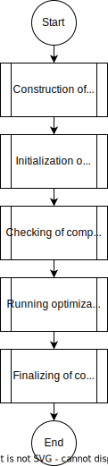

## Introduction

An optimization problem is run by calling ```OptimizationAnalysis::Run``` method. Following python code snippet illustrates how to run an optimization problem.
```python
import KratosMultiphysics as Kratos
from KratosMultiphysics.OptimizationApplication.optimization_analysis import OptimizationAnalysis

# open the optimization parameters json file
with open("OptimizationParameters.json", "r") as params_file:
    parameters = Kratos.Parameters(params_file.read())

# creates the Kratos::Model
model = Kratos.Model()

# creates the OptimizationAnalysis
opt_analysis = OptimizationAnalysis(model, parameters)

# run the optimization analysis
opt_analysis.Run()
```

Even though the ```OptimizationAnalysis``` is not derived from ```AnalysisStage```, it has a similar interface to replicate the methods in ```AnalysisStage```. Therefore, ```OptimizationAnalysis``` can also used in ```Ochestrator```.

## Json settings
Following json snippet illustrates basic settings which can be found in a json settings file used by ```OptimizationAnalysis```.
```json
{
    "problem_data"      : {},
    "model_parts"       : [],
    "analyses"          : [],
    "responses"         : [],
    "controls"          : [],
    "algorithm_settings": {},
    "processes"         : {
        "kratos_processes"           : {},
        "optimization_data_processes": {}
    }
}
```

### Problem data

```problem_data``` section of the json settings can be used to add data to identify the optimization problem. The only mandatory sub-setting is ```echo_level```, which is used to indicate overall echo level to be used in the optimization analysis. Higher the value, more verbose the output. Following json-snippet illustrate an example use case.
```json
{
    "name"      : "optimization_problem_name",
    "echo_level": 1
}
```

### Model parts

```model_parts``` section of the json settings can be used to read/create meshes. This sections is **not a must** to be used in an optimization analysis. If a central place is required to read/create all the meshes which will be used in the optimization analysis, this can be used. Otherwise, the meshes can be read in their respective places making this section empty. Following code snippet illustrate an example use case of one single entry in the list.

Following ```ModelPartController``` does not need to be within Kratos. You can write your own ```ModelPartController```, and put it within your working directory. If that is the case then, change ```module``` to blank.
```json
{
    "type": "mdpa_model_part_controller",                                           // type of the ModelPartController
    "module": "KratosMultiphysics.OptimizationApplication.model_part_controllers",  // Where to find the ModelPartController
    "settings": {                                                                   // ModelPartController specific settings
        "model_part_name": "Structure",
        "domain_size": 3,
        "input_filename": "mdpa_file_name"
    }
}
```

### Analyses

```analyses``` section is used to list all the analyses which will be used in the optimization analysis. These analyses can be any type of analysis from Kratos or from an external solver. Analyses are added using the ```ExecutionPolicy``` objects. In the case of an external solver, an ```ExecutionPolicy``` may be developed to use it within the ```OptimizationAnalysis```. ```ExecutionPolicy``` can also be custom and found in your working directory of the problem. In this case, ```module``` should be a blank string.

**```name``` field should be a unique string entry for the whole optimization problem**

Following json snippet illustrates one use case.
```json
{
    "name": "Structure_static",                 // Name of the analysis. needs to be unique.
    "type": "kratos_analysis_execution_policy", // Type of the execution policy.
    "module": "KratosMultiphysics.OptimizationApplication.execution_policies",  // Where to find the ExecutionPolicy.
    "settings": {                               // Execution policy specific settings.
        "model_part_names": [
            "Structure"
        ],
        "analysis_module": "KratosMultiphysics.StructuralMechanicsApplication",
        "analysis_type": "StructuralMechanicsAnalysis",
        "analysis_settings": {
            "@include_json": "PrimalParametersCase2A.json"
        }
    }
}
```

### Responses
```responses``` section is to list all the responses which will be used by the algorithm. All the objectives and constraints should be listed in here. As mentioned in other sections, custom responses can be defines as well and put in to the working directory. In that case the ```module``` should be a blank string.

**```name``` field should be a unique string entry for the whole optimization problem**

Following json-snippet illustrates an example use case.
```json
{
    "name": "mass",
    "type": "mass_response_function",
    "module": "KratosMultiphysics.OptimizationApplication.responses",
    "settings": {
        "evaluated_model_part_names": [
            "Structure"
        ]
    }
}
```

### Controls
```controls``` section is to list all of the controls to be used by the algorithm.

**```name``` field should be a unique string entry for the whole optimization problem**

Following code-snippet illustrates an example use case.
```json
{
    "name": "thickness_control",
    "type": "thickness.shell_thickness_control",
    "settings": {
        "controlled_model_part_names": [
            "Structure.Parts_Shell_structure"
        ],
        "filter_settings": {
            "type": "implicit",
            "radius": 0.2,
            "linear_solver_settings": {
                "solver_type": "LinearSolversApplication.amgcl"
            }
        },
        "output_all_fields": false,
        "beta_value": 25.0,
        "initial_physical_thickness": 0.15,
        "physical_thicknesses": [
            0.1,
            0.2
        ]
    }
}
```

### Algorithm settings

```algorithm_settings``` section holds all the necessary information for algorithms such as which controls, which responses to be used, what type of convergence criteria, etc.


### Processes
```processes``` section is allowed to have two type of processes. One is, processes you find anywhere in Kratos which is not in hte OptimizationApplication. If these processes are required to be used in the optimization analysis to input or output data, then they should go in the ```kratos_processes```.

There are some specific processes which are implemented in OptimizationApplication which requires not only ```Kratos::Model``` and ```Kratos::Parameters```, but also ```OptimizationProblem``` to construct an object. These processes needs to be included under ```optimization_data_processes```.


## Work flow

<p align="center">
    
</p>
<p align="center">Figure 1: Overall execution flow</p>

Figure 1 illustrates the overall execution of an optimization problem.

### Construction of components

This step will construct all following components in the listed order.
1. ```OptimizationProblem``` data container.
2. [```ModelPartControllers```](#model-parts)
3. [```Analyses```](#analyses)
4. [```Controls```](#controls)
5. [```Responses```](#responses)
6. [```Algorithm```](#algorithm-settings)
7. [```Processes```](#processes)

Each type of component will read its respective part of the json to create the component.

### Initialization of components

Initialization of components will be done in the following listed order.

1. Fill in the model parts specified by [```ModelPartControllers```](#model-parts) by calling ```ModelPartController::ImportModelPart```.
2. Initialize ```ModelPartController``` by calling ```ModelPartController::Initialize```
3. Initialize Processes.
4. Initialize ```Algorithm```

Initialization of ```ResponseFunction``` and ```Controls``` are done within the ```Algorithm::Initialize```.

### Checking of components

Checking of components will be done in the following listed order.

1. Checks processes
2. Check ```Algorithm```

Checking of ```ResponseFunction``` and ```Controls``` are done within the ```Algorithm::Check```.


### Running optimization algorithm

This step will call [```Algorithm::Solve```](Algorithm.html) method.


### Finalizing of components

Finalization of components will be done in the following listed order.

1. Initialize ```Algorithm```.
2. Initialize Processes.

Finalization of ```ResponseFunction``` and ```Controls``` are done within the ```Algorithm::Finalize```.