The objective of this tutorial is to show Kratos users how to build ROMs using the Kratos RomApplication.

In Katos, the [RomManager](https://github.com/KratosMultiphysics/Kratos/blob/master/applications/RomApplication/python_scripts/rom_manager.py) is the class that seamlessly orschestrates the simulations involved in both stages. 

In the subsequent sections, the parameters passed to the RomManager will be introduced.


## Setting up a Structural Mechanics Parametric Simulation

The first example is a structural mechanics simulation with three pressure loads applied as shown in the figure


The material follows a Neo-Hookean Hyperelastic constitutive law, and the bottom part is fixed. The step-by-step procedure for generating this geometry in GiD is explained in [this video](https://youtu.be/3gJIHf5gQ88?si=5gPumMJTlYwBL0e3). Moreover, the geometry files can be obtained [here](https://github.com/KratosMultiphysics/Documentation/tree/master/RomApp_Tutorial/RomAppTutorial_Part2).


## Setting up a Structural Mechanics ROM

A video version of this section is available [here](https://youtu.be/KtO-XxbgLwU?si=MEmMpKlW1LOJaCTW), while the files used are available [here](https://github.com/KratosMultiphysics/Documentation/tree/master/RomApp_Tutorial/RomAppTutorial_Part3).


The [RomManager](https://github.com/KratosMultiphysics/Kratos/blob/master/applications/RomApplication/python_scripts/rom_manager.py) accepts a KratosParameters object as the key word argument *general_rom_manager_parameters*. In this tutorial section we consider the following subset of parameters:

```python
def rom_manager_parameters():

    default_settings = KratosMultiphysics.Parameters("""{
        "rom_stages_to_train" : ["ROM", "HROM"],
        "rom_stages_to_test" : [],
        "save_gid_output": true,
        "save_vtk_output": true
        "ROM":{
            "use_non_converged_sols": true,
            "model_part_name": "Structure",
            "nodal_unknowns": ["DISPLACEMENT_X","DISPLACEMENT_Y"]
        }
    }""")

    return default_settings
```

We setup the simplest workflow by creating a rom_manager object and passing to it the KratosParameters returned by the above function:

```python
if __name__ == "__main__":
    rom_manager = RomManager(general_rom_manager_parameters=rom_manager_parameters())
    rom_manager.Fit()
    rom_manager.PrintErrors()
```

Indeed, by running the above code, a unique case is launched, obtaining a single column vector, which is used for creating a ROM. Then, a ROM is also launched and the results of FOM and ROM are compared with the PrintErrors() method. This workflow looks as follows:

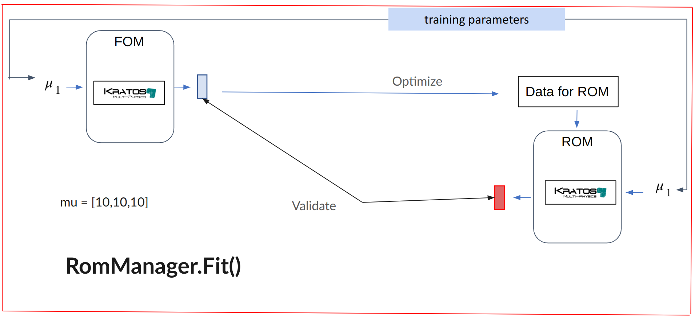


The parameters vector $\mu$ contains the pressure loads speficied in the ProjectParameters.json, that is [10, 10, 10].

There are 3 ways of imposing different parameters vectors $\mu$ using the RomManager, they are:

- Specify a function that modifies the KratosParameters object from the ProjectParameters.json. This is useful for impossing boundary conditions, initial conditions, loads, or other parameter variation imposed via a Kratos Process.
- Specify a function that modifies the json file containg the material. This re-writes, with the desired material property, the json file that is loaded by each simulation.
- Speficy a custom analysis stage. This allows to either impose a parameter variation or acces any of the methods of the derived Analysis stage class.


We now focus on the first option. The function modifying the KratosParameters object to impose different values of pressure is the following:

```python
def UpdateProjectParameters(parameters, mu):
    parameters["processes"]["loads_process_list"][0]["Parameters"]["value"].SetDouble(mu[0])
    parameters["processes"]["loads_process_list"][1]["Parameters"]["value"].SetDouble(mu[1])
    parameters["processes"]["loads_process_list"][2]["Parameters"]["value"].SetDouble(mu[2])

    return parameters

```


This function should be passed as the key word argument *UpdateProjectParameters* to the rom_manager object as follows:

```python
rom_manager = RomManager(general_rom_manager_parameters=rom_manager_parameters(), UpdateProjectParameters=UpdateProjectParameters)

```

Finally, the $\mu$ vector is passed to the Fit() method as a list of lists.

```python
mu_train = [[20,45,60]]
rom_manager.Fit(mu_train)
rom_manager.PrintErrors()
```

The workflow for the above script is the one presented in Sec. Overview of ROMs in Kratos.


The Test() method of the RomManager also accepts a list of lists specifying the testing parameters. This method runs both the FOM and ROM, but the snapshots from the FOM are not used for improving the ROM. An example snippet of the Test() method of the RomManager is the following:

```python
mu_test = [[200,450,600]]
rom_manager.Test(mu_test)
rom_manager.PrintErrors()
```

The workflow, when calling the Test() method looks like this:


The RunFOM() method of the RomManager allows to launch the FOM simulations without introducing overheads. No extra data (besides the Results files if they are chosen to be kept with the flags *"save_gid_output"* and *"save_vtk_output"*) is generated.  An example snippet of the RunROM() method of the RomManager is the following:

```python
mu_run = [[2,4,6]]
rom_manager.RunFOM(mu_run)
```

The workflow, when calling the RunFOM() method looks like this:


Finally, the RunROM() method of the RomManager launches the ROM simulations for the parameters passed, without storing extra data. The workflow, when calling the RunROM() method looks like this:


## Setting up a Fluid Dynamics Parametric Simulation

A video version of this section is available [here](https://youtu.be/jTzNdll3tt8?si=VOd3UVggCP4WwKkJ), while the files used are available [here](https://github.com/KratosMultiphysics/Documentation/tree/master/RomApp_Tutorial/RomAppTutorial_Part4).


The *general_rom_manager_parameters* keyword argument passed to the RomManager for this example is the following:

```python
def rom_manager_parameters():

    default_settings = KratosMultiphysics.Parameters("""{
        "rom_stages_to_train" : ["ROM"],
        "rom_stages_to_test" : [],
        "ROM":{
            "model_part_name": "FluidModelPart",
            "nodal_unknowns": ["VELOCITY_X","VELOCITY_Y", "PRESSURE"]
        }
    }""")

    return default_settings
```

We setup the simplest workflow by creating a rom_manager object and passing to it the KratosParameters returned by the above function:

```python
if __name__ == "__main__":
    rom_manager = RomManager(general_rom_manager_parameters=rom_manager_parameters())
    rom_manager.Fit()
    rom_manager.PrintErrors()
```

By running the above code, a unique *time dependent* case is launched, obtaining a *matrix with one column per time step*. This matrix is used for creating a ROM. Then, a ROM is also launched and the results of FOM and ROM are compared with the PrintErrors() method. This workflow looks as follows:

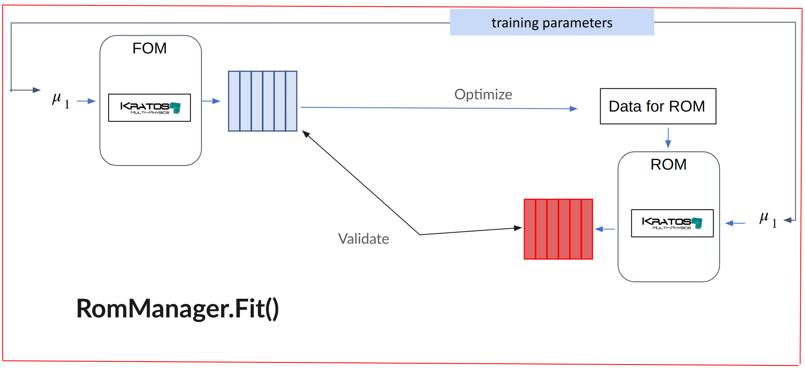


In order to vary the *viscosity* of the fluid, we pass a function to the RomManager with the keyword argument *UpdateMaterialParametersFile*. This function should accept the name of the file to modify, with the keyword argument *UpdateMaterialParametersFile*,  and a single list containing the parameters to modify with the keyword argument *mu*. For this example, the funcition looks like this:

```python
def UpdateMaterialParametersFile(material_parametrs_file_name=None, mu=None):
    with open(material_parametrs_file_name, mode="r+") as f:
        data = json.load(f)
        data["properties"][1]["Material"]["Variables"]["DYNAMIC_VISCOSITY"] = mu[0]
        #write to file and save file
        f.seek(0)
        json.dump(data, f, indent=4)
        f.truncate()
```

Notice that unlike the previous section where the function modified and returned a KratosParameters object, in this case the file is loaded, modified and re-writen in json format.

We can then launch the ROM workflow for the time-dependnent simulations for different values of viscosity as follows:

```python
if __name__ == "__main__":

    rom_manager = RomManager(general_rom_manager_parameters=rom_manager_parameters(), UpdateMaterialParametersFile=UpdateMaterialParametersFile)

    mu_train = [[0.0066]] # a list of list
    rom_manager.Fit(mu_train)
    rom_manager.PrintErrors()
```

## The RomDatabase class

A video version of this section is available [here](https://youtu.be/U8oBudQJOXs?si=kCN6-wT1K-gVOugq), while the files used are available [here](https://github.com/KratosMultiphysics/Documentation/tree/master/RomApp_Tutorial/RomAppTutorial_Part5).

The [RomDataBase](https://github.com/KratosMultiphysics/Kratos/blob/master/applications/RomApplication/python_scripts/rom_database.py) is a [sqlite3](https://docs.python.org/3/library/sqlite3.html) data base which is automatilly created by the RomManager when using the methods Fit() and Test().

The relevant files for the RomDatabase are created in a folder named *rom_database* inside the *rom_data* folder, and they are:

- a file named rom_database.db. This is the file containing the table-like information of the RomDatabase. It is not human readable, and it is accesed by the RomManager.
- a folder containing Excel files for reference, containing
   - a summary of the first 5 rows of the tables in the database
   - optionally, a complete dump of the database as excel
- a folder containing the numpy binary (.npy) files with the relevant results of the computations. This files are stored with a hashed name.

The usages of the RomDatabase covered in this section are

- Ensure that computations are not performed multiple times unnecesarily. To do this, the RomDatabase is queried to check whether the relevant result already exists before every computation.  This can be checked readily by lanunching multiple times the Fit() or Test() methods. One can also check that by passing the exact same parameters in the list of lists passed to either the Fit or Test methods, the simulations and other computations are only launched once.

- Serve as a way to fetch snapshots or quanties of interest. See the following example

```python
    mu_train = [[20,45,60], [23,46,89], [10,23,45], [10,23,89]] #three cases
    rom_manager.Fit(mu_train)
    rom_manager.PrintErrors()
    print(np.linalg.norm(snapshots_fom-snapshots_rom)/np.linalg.norm(snapshots_fom-snapshots_rom)) #this outputs the same as the PrintErrors() method

    single_snapshots_fom = rom_manager.data_base.get_snapshots_matrix_from_database([[10,23,900]], "FOM") #this will fail because the list [10,23,900] was not part to the mu_train

```


## Analysis Stage Customization

A video version of this section is available [here](https://youtu.be/2DZ-RTIBl3E?si=sGDeT3TAZrAQZ7-R), while the files used are available [here](https://github.com/KratosMultiphysics/Documentation/tree/master/RomApp_Tutorial/RomAppTutorial_Part6).


Here we cover the third way that we have in the RomManager to pass the parameters $\mu$ contained in the list of lists passed to the Fit(), Test(), or Run() methods of the RomManager. This is done by passing a function to the RomManger with keyword argument *CustomSimulation*. This function, should expect a KratosModel, a KratosParameters and a single list containig an instance of the parameters.

For the fluid dynamics example covered before, we can use the followin function:

```python
def MyCustomizeSimulation(cls, global_model, parameters, mu=None):
    # Default function that does nothing special
    class DefaultCustomSimulation(cls):
        def __init__(self, model, project_parameters):
            super().__init__(model, project_parameters)
            self.y_vel_at_point = []

        def Initialize(self):
            super().Initialize()

        def FinalizeSolutionStep(self):
            super().FinalizeSolutionStep()
            node = self._GetSolver().GetComputingModelPart().GetNode(1515)
            self.y_vel_at_point.append(node.GetSolutionStepValue(KratosMultiphysics.VELOCITY_Y, 0))

        def GetFinalData(self):
            return {"vel_y": np.array(self.y_vel_at_point)}

    return DefaultCustomSimulation(global_model, parameters)
```

For this example, the custom simulation will store the value of the velocity in the $y$-direction and store in as a quantity of interest, which can then be fetched from the database. To launch the workflow, one should then do


```python
if __name__ == "__main__":
    rom_manager = RomManager(general_rom_manager_parameters=rom_manager_parameters(), UpdateMaterialParametersFile=UpdateMaterialParametersFile, CustomizeSimulation=MyCustomizeSimulation)

    mu_train = [[0.0066]]
    rom_manager.Fit(mu_train)
    rom_manager.PrintErrors()

    fom = rom_manager.data_base.get_snapshots_matrix_from_database(mu_train, "QoI_FOM", "vel_y" )
    rom = rom_manager.data_base.get_snapshots_matrix_from_database(mu_train, "QoI_ROM", "vel_y" )


    from matplotlib import pyplot as plt
    plt.plot(fom, label = 'FOM')
    plt.plot(rom, label = 'ROM')
    plt.legend()
    plt.show()

```

The obtained plot should look like this:

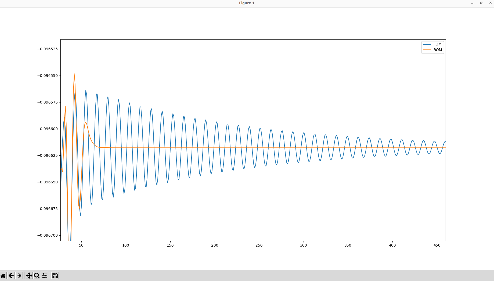


## Use of nonconvereged solutions to enrich training data

A video version of this section is available [here](https://youtu.be/iP8dX1M_NhA?si=0iOPk1C1ct6AUv9Q), while the files used are available [here](https://github.com/KratosMultiphysics/Documentation/tree/master/RomApp_Tutorial/RomAppTutorial_Part7).

In nonlinear simulations, iterations are performed until some convergence criterion is fullfilled. These nonconverged solutions are usually not relevant, but they can help enrich the traning data for constructing the ROMs.

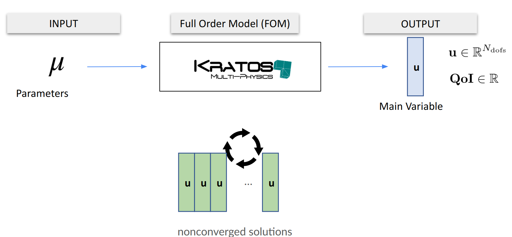

To store and use the FOM nonconverged solutions to enlarge the training data for the ROMs, one should include in the main filed of the *general_rom_manager_parameters* the flag:

```json
"store_nonconverged_fom_solutions": true,
```

Moreover, to use the nonconverged solutions inside the process to create a ROM, one should include in the "ROM" field of the *general_rom_manager_parameters* the flag:, the flag:

```json
"use_non_converged_sols": true
```

When using both flags, the ROM workflow looks like this:


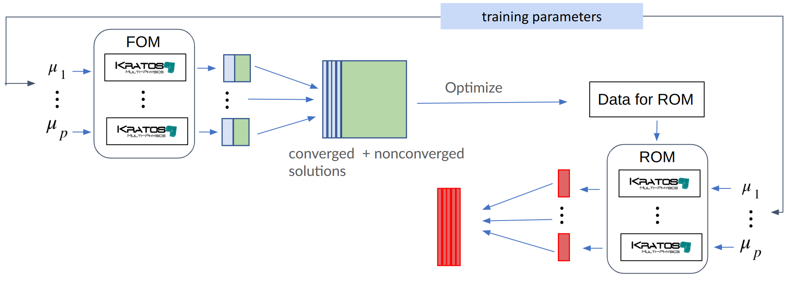


## Linear and Nonlinear Decoders

A video version of this section is available [here](https://youtu.be/sg51zx1gHH8?si=Cf1RaGUpYH1eGWUV), while the files used are available [here](https://github.com/KratosMultiphysics/Documentation/tree/master/RomApp_Tutorial/RomAppTutorial_Part8).


Currently, there are two types of decoders in the RomApplication accesible using the RomManager

- **Linear**. The linear decoder is the default option in the main field of the *general_rom_manger_parameters*. It can be changed by modifying:

    ```json
    "type_of_decoder" : "linear",      // "linear" "ann_enhanced",  TODO: add "quadratic"
    ```

    This refers to the fact that the snapshots matrix $\mathbf{S}$ (containing potentially nonconverged solutions as per the previous section) is analysed using a singular value decomposition (SVD) and a truncation tolerance $\epsilon$. This trunctaion tolerance can be modified in the "ROM" field of the *general_rom_manger_parameters* by modifying:

    ```json
    "svd_truncation_tolerance": 1e-5,
    ```

    When using the linear decoder, the optimization of the snapsthos matrix looks like this:
    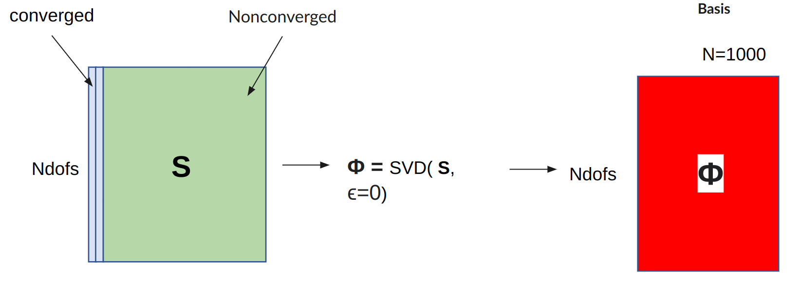

- **Nonlinear (ANN-Enhanced)**.  To select the nonlinear decoder in the RomManager, one should enter:

    ```json
    "type_of_decoder" : "ann_enhanced",      // "linear" "ann_enhanced",  TODO: add "quadratic"
    ```

    in the main field of the *general_rom_manager_parameters* passed to the RomManager. [This paper](https://doi.org/10.1016/j.jcp.2023.112420) explains the technical details of the method, while the following figure depicts it graphically.

    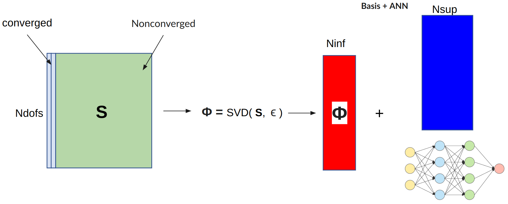

    As can be seen, the snapshots matrix is passed to the SVD, therefore the truncation tolerance is managed still with this value in the "ROM" field of the *general_rom_manger_parameters*:

    ```json
    "svd_truncation_tolerance": 1e-6,
    ```

    On the other hand, there is an artificial neural network must be trained to approximate part of the basis. The parameters dictating the Number of columns in the linear part $N_{inf}$, the number of columns in the Nonlinear part $N_{sup}$, as well as the NN training parameters are all set in the *ann_enhanced_setting* field, which is a sub-field of the "ROM" field of the *general_rom_manger_parameters*.


    ```json
            "ann_enhanced_settings": {
                "modes":[5,10],  // first refers to N_inf, second slot refers to N_sup
                "layers_size":[200,200], // hiden layers size
                "batch_size":2,
                "epochs":800,
                "NN_gradient_regularisation_weight": 0.0, // experimental setting, safe to keep it as 0
                "lr_strategy":{
                    "scheduler": "sgdr", // check these parameter definition in Trainer Class implementation
                    "base_lr": 0.001,
                    "additional_params": [1e-4, 10, 400]
                },
                "training":{
                    "retrain_if_exists" : false  // If false only one model will be trained for each the mu_train and NN hyperparameters combination
                },
                "online":{
                    "model_number": 0   // out of the models existing for the same parameters, this is the model that will be lauched
                }
            }
    ```

    Check [here](https://github.com/KratosMultiphysics/Kratos/blob/master/applications/RomApplication/python_scripts/rom_nn_trainer.py) the TensorFlow-based implementaion of the training of the neural network.


To close this section we clarify the jargon "decoder", which refers to the fact that the ROM solver computes reduced coefficient $\mathbf{q} \in \mathbb{R}^N$, or $\mathbf{q} \in \mathbb{R}^{N_{inf}}$. This small vectors are decoded either linearly, by multiplying the $\tilde{\boldsymbol{u}} = \boldsymbol{\Phi}\boldsymbol{q}$ or nonlinearly $\tilde{\boldsymbol{u}} = \boldsymbol{\Phi}_{inf} \boldsymbol{q}_{inf} + \boldsymbol{\Phi}_{sup} NN(\boldsymbol{q}_{inf}) $, or expressed graphically:


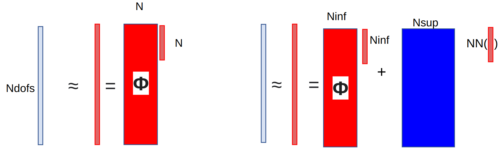


Among the upcoming decoder alernatives is the quadratic decoder.


## Projection Strategies

A video version of this section is available [here](https://youtu.be/ayJI-OXWVt8?si=OqoZ3wa1fzyFAn6C), while the files used are available [here](https://github.com/KratosMultiphysics/Documentation/tree/master/RomApp_Tutorial/RomAppTutorial_Part9).


This this section considers a linear decoder, but it can readily be exteded the case to the nonlinear decoder case by substituting in the correct derivative of the decoder with respect to the reduced parameters $\boldsymbol{q}$. For the linear case this is simply $\boldsymbol{\Phi}$, while for the nonlinear it can be called $\boldsymbol{V}$, as shown in this figure


In this section we present the different projection strategies currently available in the RomApplication through the RomManager. These are:

- **Galerkin**

- **Least Squares Petrov-Galerkin (LSPG)**

- **Petrov-Galerkin**


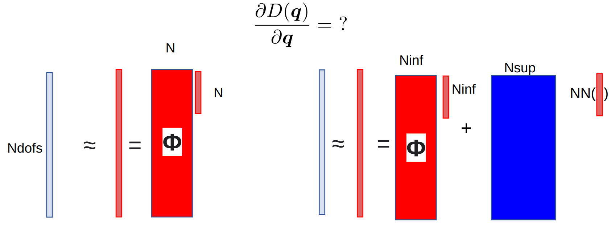


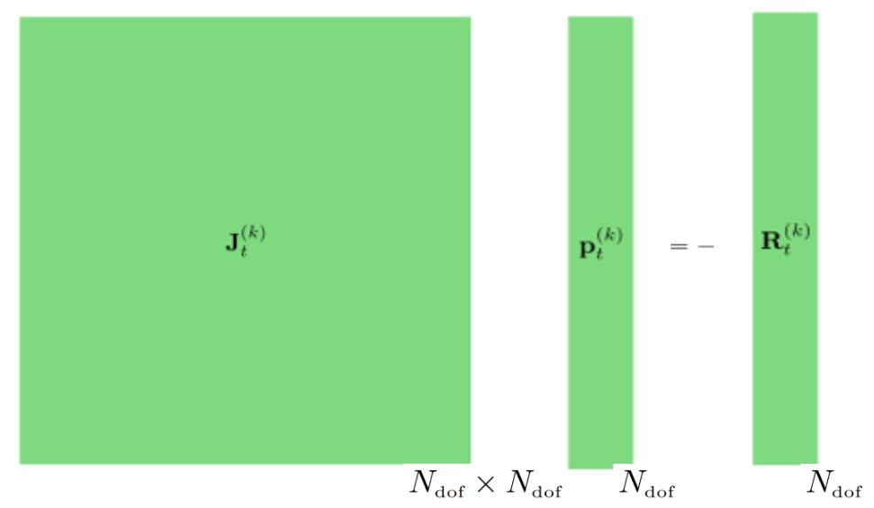


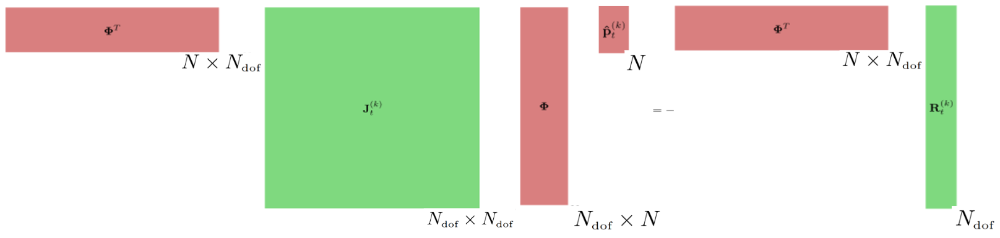


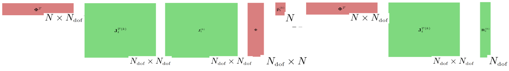


## Hyper-Reduction HROM

A video version of this section is available [here](https://youtu.be/gDn4Dbb_1t0?si=5xrQiGTwoepemUMa), while the files used are available [here](https://github.com/KratosMultiphysics/Documentation/tree/master/RomApp_Tutorial/RomAppTutorial_Part10).


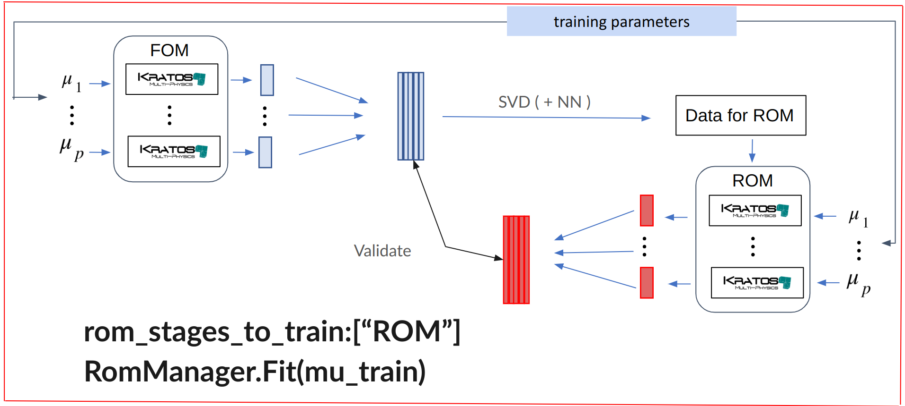


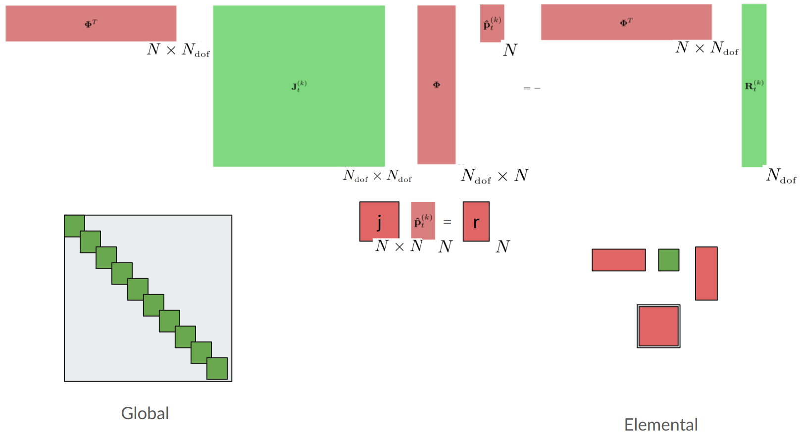


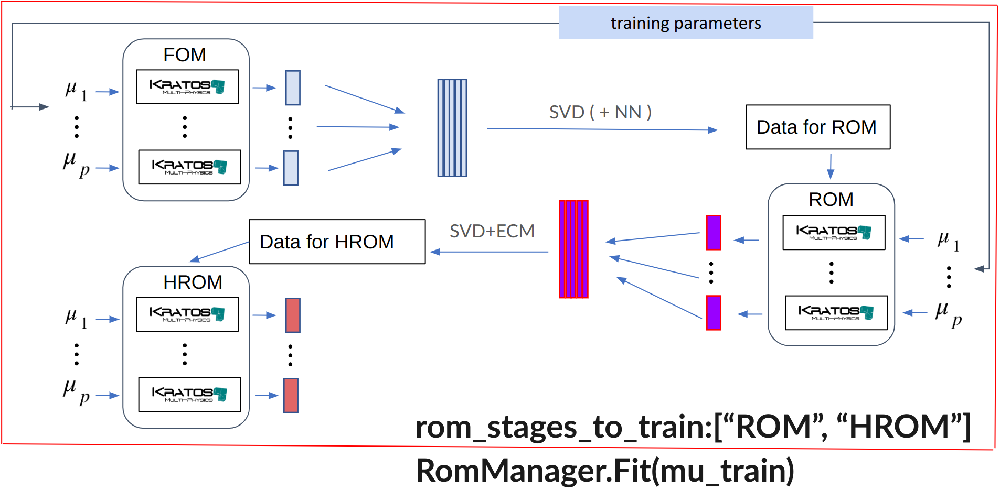


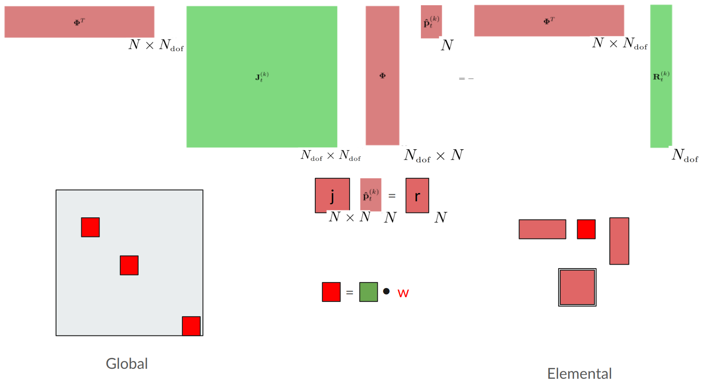


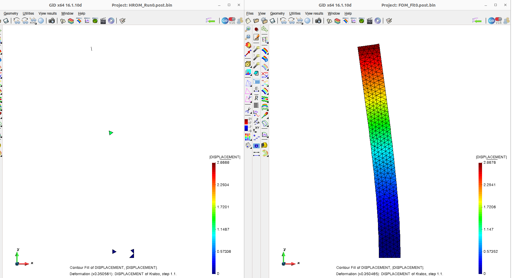