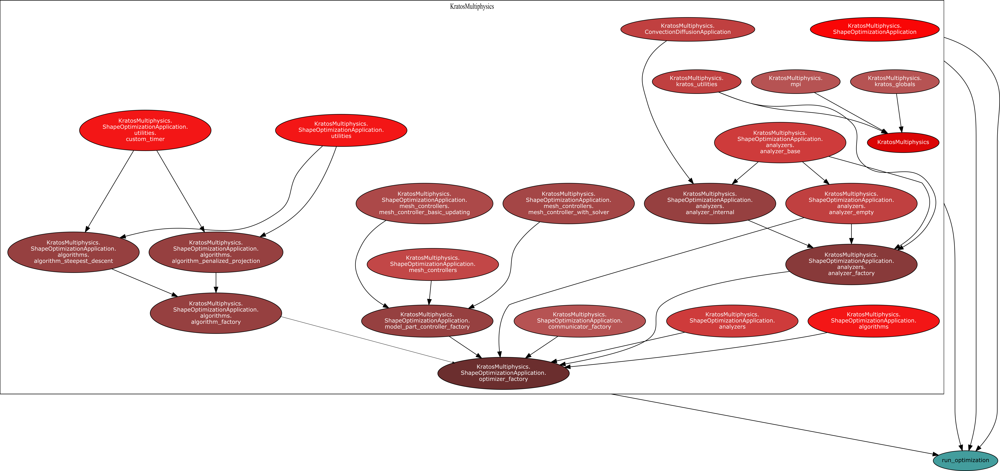

## Introduction

An optimization problem constructed for Kratos Multiphysics consist of the following flow graph as depicted in figure 1.

    

Figure 1: Shape optimization flow graph

## Optimizer factory

The Kratos Multiphysics's Shape optimization optimizer factory creates an algorithm for each of the optimization problems from the following list of algorithms.
1. [Steepest descent](../Technologies/Algorithms/steepest_descent.html)
2. [Penalized projection](../Technologies/Algorithms/penalized_projection.html)

The algorithm is created with a communicator, analyzer and a model part controller as inputs apart from the JSON parameters.

## Communicator ([source](https://github.com/KratosMultiphysics/Kratos/blob/shapeopt/kreisselmeier_aggregation/applications/ShapeOptimizationApplication/python_scripts/communicator_factory.py))

The responsibility of the commpunicator is to initiate computation of the values of a given response and if required calculate its shape derivatives. It is also responsible for standardizing the response values and gradients to be used in shape optimization algorithms.

## Analyzer ([source](https://github.com/KratosMultiphysics/Kratos/blob/shapeopt/kreisselmeier_aggregation/applications/ShapeOptimizationApplication/python_scripts/analyzers/analyzer_internal.py))

This is the class responsible for creating response functions, analyzing each response function to obtain the required response values and their respective shape gradients.

## Model part controller ([source](https://github.com/KratosMultiphysics/Kratos/blob/shapeopt/kreisselmeier_aggregation/applications/ShapeOptimizationApplication/python_scripts/mesh_controllers/mesh_controller_with_solver.py))

This is the class responsible for updating the mesh, if required moving the mesh using mesh motion solver.