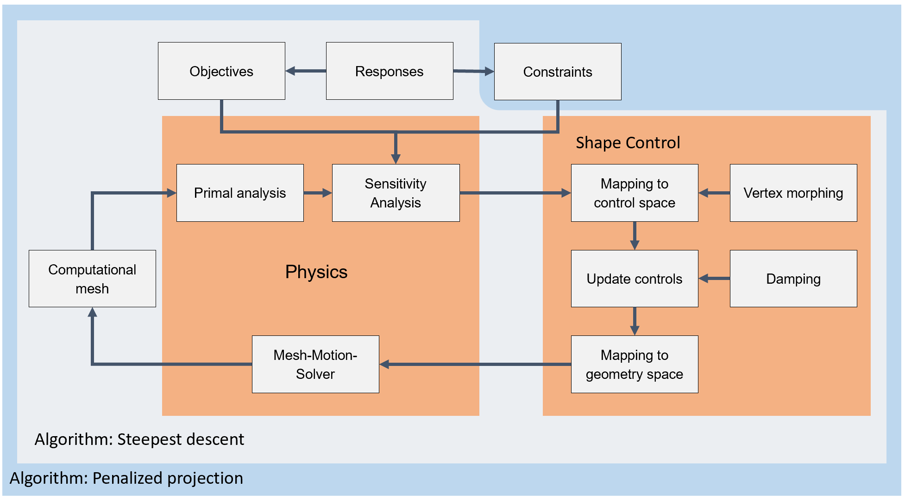

The shape optimization application consists of algorithms and technologies to make changes to a given design surface to optimize selected objective under given constraints. Figure 1 illustrates overview of algorithms and technologies available in this application.

## Overview of algorithms and technologies

    

Figure 1: Algorithms and technologies overview

Components present in the **Physics** group is explained in brief in the following table.

|[Primal analysis](https://github.com/KratosMultiphysics/Kratos/blob/shapeopt/kreisselmeier_aggregation/applications/StructuralMechanicsApplication)| Primal analysis solves the primal problem |
|Sensitivity analysis| Sensitivity analysis computes sensitivities of given [objectives](../Technologies/Objectives.html) and [constraints](../Technologies/Constraints.html) with respect to design surface nodal positions. It can either use [finite difference approach](Sensitivity_Analysis/Finite_difference_or_direct_approach.html) or [adjoint approach](Sensitivity_Analysis/Adjoint_approach.html).|
|Mesh motion solver| Mesh motion solver is used to move domain internal node locations when the design surface is updated from the optimization process |

Components present in the **Shape control** group is explained in brief in the following table.

| Mapping to control space | The computed sensitivities are mapped to control space.|
| Update controls | Mapped sensitivities on the control space is updated for given constraints and damping |
| Mapping to geometry space | The update control space sensitivities are mapped back to geometry space |
|[Vertex morphing](../Technologies/Vertex_morphing.html)|This technology is used to minimize the noise in the computed sensitivity fields specially when the objective or the constraint is highly non-linear.|
|[Damping](../Technologies/Damping.html)| Dampens the mapped sensitivities in the selected regions to limit design surface update in those regions |

## Optimization algorithms

Following algorithms are used to obtain optimum designs for given objectives satisfying the given constraints.

1. [Steepest descent](../Technologies/Algorithms/steepest_descent.html)
2. [Penalized projection](../Technologies/Algorithms/penalized_projection.html)

## Auxiliary technologies

This section briefly introduces the responses, objectives and constraints which are used in the optimization problem in the following table.

|Responses| Responses are used to compute the response value and its partial derivatives with respect to design surface nodal positions (See [Average temperature](../List_of_response_functions/average_temperature.html), [Mass](../List_of_response_functions/Mass.html), [Strain energy](../List_of_response_functions/Strain_energy.html), [Kreisselmeier aggregated stress](../List_of_response_functions/Kreisselmeier_aggregation.html) )|
|[Objectives](../Technologies/Objectives.html)| Objectives are also Responses which determines the objective of the optimization problem|
|[Constraints](../Technologies/Constraints.html)| Constraints are use to impose boundaries to the optimization problem|

## Siemens NX Plugin

The capabilities of **KratosMultiphysics** **ShapeOptimization** application is exposed to **Siemens NX** via a [plugin](../Siemens_NX/Overview.html)

## Examples

There are two types of example.

1. [Showcase examples](../Examples)
2. [Guided examples](../Siemens_NX/Guided_beam_example/Primal_problem_construction.html)

## Source

Location: ["applications/ShapeOptimizationApplication"](https://github.com/KratosMultiphysics/Kratos/blob/shapeopt/kreisselmeier_aggregation/applications/ShapeOptimizationApplication)

